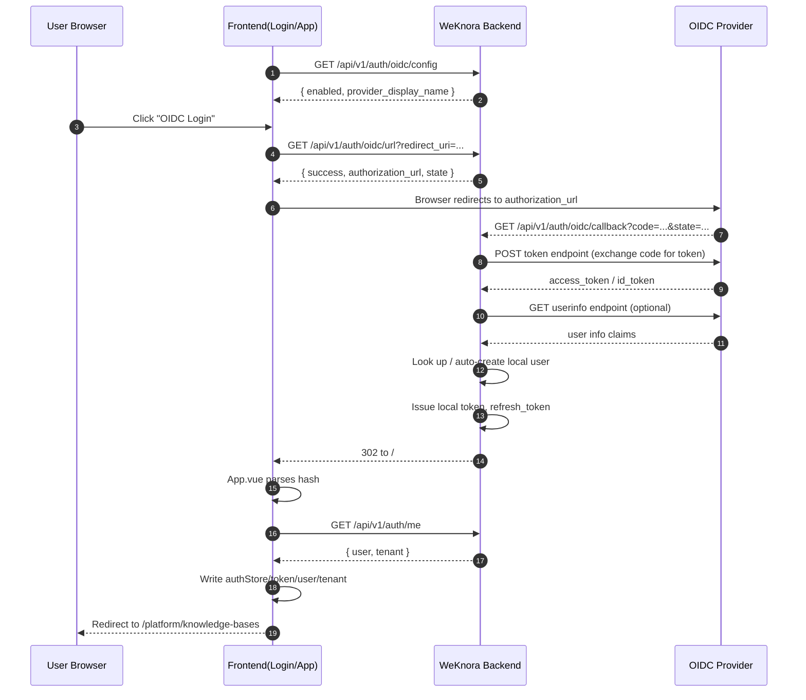
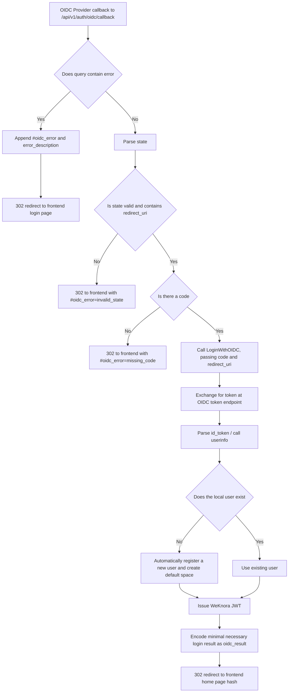

# WeKnora OIDC Authentication Flow

This document describes the actual call flow of WeKnora's current OIDC login capability, covering:

- How the frontend determines whether to display the OIDC login entry point
- The frontend-backend call chain after a user clicks OIDC login
- How the backend interacts with the OIDC Provider
- How the frontend receives the result after a successful login and persists the local login state
- Key configuration items and how to test locally

The content of this document is based on the current project implementation. The relevant code is mainly located at:

- Backend routing: `internal/router/router.go`
- Authentication handling: `internal/handler/auth.go`
- Authentication service: `internal/application/service/user.go`
- Configuration definitions: `internal/config/config.go`
- Frontend login page: `frontend/src/views/auth/Login.vue`
- Frontend global callback handling: `frontend/src/App.vue`
- Frontend authentication API: `frontend/src/api/auth/index.ts`
- Local Dex example: `misc/dex-config.yaml`

---

## 1. Overall Design Description

The project's OIDC login uses a model where **the backend initiates authorization parameter generation, the backend receives the callback and completes the code-for-token exchange, and the frontend receives the final login result via the URL hash**.

Unlike the common pure-frontend OIDC SDK approach, WeKnora's characteristics are:

1. **The frontend is only responsible for initiating the redirect**, and does not directly exchange tokens with the OIDC Provider.
2. **The backend is responsible for exchanging the authorization code `code` for a token with the OIDC Provider**.
3. After the backend obtains the OIDC user information, it will:
   - Look up the local user;
   - If the user does not exist, automatically create a local account and default space;
   - Finally issue WeKnora's own local JWT (`token` / `refresh_token`).
4. Instead of placing the login result directly in the query string, the backend will:
   - Serialize the login result JSON (fields such as `success`, `token`, `refresh_token`) and base64url-encode it;
   - Redirect back to the frontend in the form `#oidc_result=...`;
   - The frontend uniformly parses the hash in `App.vue`, then calls `/api/v1/auth/me` to complete the user and space information.

Therefore, **the OIDC Provider's token is only used by the backend to obtain the user's identity — the actual business access credential used by this project is still the JWT issued by WeKnora itself**.

---

## 2. Related Endpoints

The current OIDC-related endpoints are all registered in `internal/router/router.go`:

- `GET /api/v1/auth/oidc/config`
  - Retrieves whether OIDC is enabled and the Provider's display name
- `GET /api/v1/auth/oidc/url`
  - Generates the third-party login redirect address
- `GET /api/v1/auth/oidc/callback`
  - The OIDC Provider callback address

The frontend's regular login flow still uses:

- `POST /api/v1/auth/login`
- `POST /api/v1/auth/refresh`
- `POST /api/v1/auth/logout`
- `GET /api/v1/auth/me`

---

## 3. Call Flow Diagrams

### 3.1 Overall Sequence Diagram



### 3.2 Backend Callback Handling Branch Diagram



---

## 4. Frontend Call Flow

## 4.1 Login Page Initialization: Deciding Whether to Show the OIDC Login Button

The login page component is located at `frontend/src/views/auth/Login.vue`.

When the page loads, it executes:

```ts
loadOIDCConfig()
```

This function calls:

```ts
getOIDCConfig() -> GET /api/v1/auth/oidc/config
```

The backend's `GetOIDCConfig` reads `configInfo.OIDCAuth`:

- `enabled`: whether OIDC is enabled
- `provider_display_name`: the provider name displayed on the login button

Based on this, the frontend decides:

- Whether to show the OIDC login button;
- Whether the button text should read "Sign in with XXX".

---

## 4.2 User Clicks the OIDC Login Button

After the user clicks the button, `Login.vue` executes `handleOIDCLogin()`.

Core logic:

1. The frontend first constructs the backend callback address:

```ts
const getBackendOIDCRedirectURI = () => `${window.location.origin}/api/v1/auth/oidc/callback`
```

Where:

- `redirect_uri`: the callback address provided to the OIDC Provider, which must be a backend address.

After a successful login, the backend always redirects back to the frontend home page `/`, passing the OIDC result via the hash.

2. The frontend calls:

```ts
GET /api/v1/auth/oidc/url?redirect_uri=...
```

3. After the backend returns `authorization_url`, the frontend directly executes:

```ts
window.location.href = authorizationURL
```

The browser then leaves the WeKnora page and navigates to the OIDC Provider's authorization page.

---

## 5. Backend Generation of the Authorization Address

Corresponding handler: `AuthHandler.GetOIDCAuthorizationURL`

Corresponding service: `userService.GetOIDCAuthorizationURL`

### 5.1 Parameter Validation

The backend requires the following parameter to be present:

- `redirect_uri`

Otherwise it returns a validation error directly.

### 5.2 Reading OIDC Configuration

`getOIDCConfig()` performs the following logic:

1. Checks whether `OIDCAuth.Enable` is `true`;
2. Sets default values:
   - `ProviderDisplayName` defaults to `OIDC`
   - `Scopes` defaults to `openid profile email`
   - `UserInfoMapping.Username` defaults to `name`
   - `UserInfoMapping.Email` defaults to `email`
3. If the authorization/token endpoints are not explicitly configured, it fetches the OIDC Discovery document via `discovery_url`;
4. Automatically fills in:
   - `authorization_endpoint`
   - `token_endpoint`
   - `userinfo_endpoint`

### 5.3 Generating the State

Instead of treating state as just a random string, the backend encodes a JSON structure:

```json
{
  "nonce": "random string",
  "redirect_uri": "backend callback address"
}
```

This is then base64url-encoded and passed to the Provider as `state`.

This way, when the OIDC Provider calls back, the backend can restore from `state`:

- The backend `redirect_uri` used for this request

### 5.4 Constructing the Authorization Address

The parameters the backend ultimately assembles include:

- `response_type=code`
- `client_id`
- `redirect_uri`
- `scope`
- `state`

Then returns to the frontend:

```json
{
  "success": true,
  "provider_display_name": "Dex",
  "authorization_url": "...",
  "state": "..."
}
```

---

## 6. OIDC Provider Callback to the Backend

After the OIDC Provider completes authentication, it calls back:

```text
GET /api/v1/auth/oidc/callback
```

The handler is `AuthHandler.OIDCRedirectCallback`.

### 6.1 When the Provider Returns an Error

If the query contains:

- `error`
- `error_description`

The backend does not return JSON, but instead issues a 302 directly to the frontend home page `/`, with the hash:

```text
#oidc_error=...&oidc_error_description=...
```

### 6.2 Parsing State

The backend base64url-decodes `state` and parses it into a struct.

The following cases are treated as failure:

- `state` cannot be decoded
- The JSON structure is invalid
- `state.redirect_uri` is empty

On failure, it redirects to the frontend home page:

```text
#oidc_error=invalid_state
```

### 6.3 Validating the Code

If no `code` is received, it redirects:

```text
#oidc_error=missing_code
```

### 6.4 Executing OIDC Login

If both `state` and `code` are valid, it calls:

```go
LoginWithOIDC(ctx, code, decodedState.RedirectURI, h.resolveDefaultTenantMode(ctx))
```

Note that the `redirect_uri` passed here is the one **saved in the state**, not a freshly reconstructed address — this ensures that the `redirect_uri` used during the code exchange exactly matches the one used at authorization time.

The fourth parameter is the default space strategy used for first-time automatic account provisioning, resolved by `resolveDefaultTenantMode` from `auth.default_tenant_mode` (SystemSetting, DB > `WEKNORA_AUTH_DEFAULT_TENANT_MODE` > config file), sharing the same switch with local password registration; OIDC no longer has an independent `OIDC_AUTH_DEFAULT_TENANT_MODE`.

---

## 7. Backend Exchanges Code for Token and Resolves User Identity

The core logic is located in `internal/application/service/user.go`.

## 7.1 Exchanging for the OIDC Token

`exchangeOIDCCode()` sends the following to the OIDC Provider's `token_endpoint`:

```text
POST application/x-www-form-urlencoded
```

The form parameters include:

- `grant_type=authorization_code`
- `code`
- `redirect_uri`
- `client_id`
- `client_secret`

Expected returned fields:

- `access_token`
- `id_token`
- `token_type`

If both `access_token` and `id_token` are missing, it is treated as a failure.

## 7.2 Parsing User Information

The processing order of `resolveOIDCUserInfo()` is:

1. If there is an `id_token`, first decode the JWT payload locally to extract claims;
2. If `userinfo_endpoint` is configured and there is an `access_token`, then call the userinfo endpoint;
3. Merge the two sets of claims, where userinfo's fields can override fields already obtained earlier;
4. Extract the following according to the configured `user_info_mapping`:
   - The username field
   - The email field

Default mapping:

- `username -> name`
- `email -> email`

There is also fallback logic:

1. If username is empty, try `preferred_username`
2. Then try `name`
3. Then try generating a username from the email prefix

If an email still cannot be obtained in the end, an error is raised directly, since local users are associated by email.

---

## 8. Local User Association and Automatic Provisioning

### 8.1 Looking Up the User by Email

The backend uses the email returned by OIDC to execute:

```go
userRepo.GetUserByEmail(ctx, userInfo.Email)
```

### 8.2 Automatic Registration When the User Does Not Exist

If no local user exists with that email, `provisionOIDCUser()` is called to automatically create an account.

The automatic creation logic includes:

1. Generating a local username based on the OIDC username/email;
2. If the username conflicts, automatically appending suffixes such as `-1`, `-2`, etc.;
3. Generating a random password;
4. Calling the existing `Register()` flow to create the user;
5. `Register()` internally also automatically creates a default space.

Therefore, **users logging in via OIDC for the first time do not need to manually create an account in WeKnora beforehand**.

### 8.3 Handling Disabled Users

If the found local user has `IsActive=false`, the login fails, and the error message returned to the frontend via the callback is:

```text
Account is disabled
```

---

## 9. Generating the WeKnora Local Login State

After a successful OIDC login, instead of directly handing the OIDC token to the frontend for use, the backend continues to execute:

```go
GenerateTokens(ctx, user)
```

Two types of JWT are generated:

- `token`: access token, 24 hours by default
- `refresh_token`: refresh token, 7 days by default

These are written to the local `auth_tokens` store (via `tokenRepo.CreateToken`).

Finally, the backend returns the OIDC callback payload, which includes:

- `token`
- `refresh_token`
- `success`
- `message`
- `is_new_user`

This step means:

> OIDC is only responsible for "confirming who you are" — WeKnora itself is responsible for "issuing the business token usable within the system."

---

## 10. How the Backend Passes the Result Back to the Frontend

After `OIDCRedirectCallback` obtains the `OIDCCallbackResponse`, it executes:

1. Serializes the response object to JSON;
2. base64url-encodes it;
3. Issues a 302 redirect to:

```text
/#oidc_result=ENCODED_PAYLOAD
```

On failure, it returns:

```text
/#oidc_error=...&oidc_error_description=...
```

The benefits of using the hash here are:

- The result is not sent to the server again as a query parameter;
- The frontend can read and clean it up directly in the local browser;
- It avoids re-exposing these parameters to the backend on refresh.

---

## 11. How the Frontend Consumes the OIDC Callback Result

The frontend does not handle the callback in `Login.vue`, but instead handles it uniformly in `frontend/src/App.vue`.

This way, even if the backend redirects the user to `/`, the application's root component can still catch this OIDC login result.

## 11.1 App.vue Parses the Hash

When the application mounts, it executes:

```ts
handleGlobalOIDCCallback()
```

It reads:

```ts
window.location.hash
```

And parses the following fields:

- `oidc_error`
- `oidc_error_description`
- `oidc_result`

## 11.2 Error Branch

If `oidc_error` is present:

1. Call `clearOIDCCallbackState('/login')` to clean up the URL;
2. Redirect to `/login`;
3. Show an error message.

## 11.3 Success Branch

If `oidc_result` is present:

1. base64url-decode and deserialize it;
2. If `response.success=true`:
   - First write `authStore.setToken(...)`
   - Then write `authStore.setRefreshToken(...)`
   - Then call `/api/v1/auth/me`
   - Use the `user` / `tenant` returned by `/auth/me` to execute `authStore.setUser(...)` and `authStore.setTenant(...)`
3. Finally redirect to:

```text
/platform/knowledge-bases
```

This is consistent with the persistence logic after a successful normal username/password login.

---

## 12. Key Configuration Items

The OIDC configuration definitions are located in `internal/config/config.go`; example environment variables are in `.env.example`.

### 12.1 Main Configuration Items

| Configuration Item | Description |
|---|---|
| `OIDC_AUTH_ENABLE` | Whether to enable OIDC login |
| `OIDC_AUTH_ISSUER_URL` | Issuer address, can be used to automatically construct the discovery URL |
| `OIDC_AUTH_DISCOVERY_URL` | OIDC Discovery address |
| `OIDC_AUTH_PROVIDER_DISPLAY_NAME` | Display name shown on the frontend button |
| `OIDC_AUTH_CLIENT_ID` | OIDC Client ID |
| `OIDC_AUTH_CLIENT_SECRET` | OIDC Client Secret |
| `OIDC_AUTH_AUTHORIZATION_ENDPOINT` | Authorization endpoint, optional |
| `OIDC_AUTH_TOKEN_ENDPOINT` | Token endpoint, optional |
| `OIDC_AUTH_USER_INFO_ENDPOINT` | UserInfo endpoint, optional |
| `OIDC_AUTH_SCOPES` | Scope list, default `openid profile email` |
| `OIDC_USER_INFO_MAPPING_USER_NAME` | The field name in claims mapped to the username |
| `OIDC_USER_INFO_MAPPING_EMAIL` | The field name in claims mapped to the email |

### 12.2 Minimum Requirements When Enabled

When `OIDC_AUTH_ENABLE=true`, the backend validation requires:

1. `client_id` must be present
2. `client_secret` must be present
3. One of the following must be satisfied:
   - `discovery_url` is configured
   - or both `authorization_endpoint + token_endpoint` are configured

---

## 13. Local Testing Example (Dex)
[Dex](https://dexidp.io/) is a simple, easy-to-use OIDC Provider that lets you connect to a variety of third-party authentication systems (such as OAuth2.0, Google, GitHub, LDAP, etc.). Besides Dex, you can also choose other OpenID Connect-compliant Providers such as [KeyCloak](https://www.keycloak.org/) for integration.

The project already provides a Dex example configuration: `misc/dex-config.yaml`.

The static client configuration example:

```yaml
staticClients:
  - id: weknora
    redirectURIs:
      - 'http://127.0.0.1:5173/api/v1/auth/oidc/callback'
      - 'http://127.0.0.1/api/v1/auth/oidc/callback'
    name: 'WeKnora'
    # secret: <YOUR_SECRET_HERE>
```

This means that during local debugging, you need to ensure that **the redirect URI registered with the Provider exactly matches the `redirect_uri` actually passed by the frontend to the backend**.

The current frontend implementation uses:

```ts
${window.location.origin}/api/v1/auth/oidc/callback
```

So:

- If the frontend is accessed from `http://127.0.0.1:5173`, the redirect URI is
  `http://127.0.0.1:5173/api/v1/auth/oidc/callback`
- If accessed through a unified Nginx entry point, it might be
  `http://127.0.0.1/api/v1/auth/oidc/callback`

The Provider must have these addresses whitelisted in advance.

---

## 14. Call Flow Summary

The current OIDC login can be understood as consisting of the following 4 stages:

### Stage One: Frontend Discovers Capability

The frontend calls `/auth/oidc/config` to decide whether to display the third-party login entry point.

### Stage Two: Browser Redirects for Authorization

The frontend calls `/auth/oidc/url` to obtain the authorization address, then redirects to the OIDC Provider.

### Stage Three: Backend Completes Identity Exchange

The Provider calls back to the backend's `/auth/oidc/callback`; the backend exchanges the `code` for a token, fetches user information, associates or creates a local user, and issues a WeKnora JWT.

### Stage Four: Frontend Receives the Final Result

The backend issues a 302 back to the frontend, passing the login result via `#oidc_result`; the frontend parses it uniformly in `App.vue`, writes the local login state, and enters the business pages.

---

## 15. Notes

1. **`redirect_uri` must match exactly** with the Provider's client configuration.
2. **The frontend home page is not the OIDC Provider callback address**.
   - The Provider calls back to the backend's `/api/v1/auth/oidc/callback`
	   - The backend then always redirects to the frontend home page `/`
3. **Email is the primary key for local account association**.
   - If the Provider does not return an email, the login cannot be completed.
4. **A first-time OIDC login automatically creates a user and a default space**.
5. **The credential actually used to access the WeKnora API is still the local JWT**, not the OIDC access token.
6. The current implementation encodes and wraps `state`, but **there is no server-side persisted state/nonce validation**; it is mainly used to pass context and provide basic error prevention, not a complete anti-replay mechanism.

---

## 16. Related Source Code Locations

- Whether the frontend displays the OIDC login button:
  - `frontend/src/views/auth/Login.vue`
- Frontend obtaining the authorization address:
  - `frontend/src/api/auth/index.ts`
  - `frontend/src/views/auth/Login.vue`
- Frontend parsing the callback hash:
  - `frontend/src/App.vue`
- OIDC endpoint route registration:
  - `internal/router/router.go`
- OIDC HTTP handling:
  - `internal/handler/auth.go`
- OIDC business logic:
  - `internal/application/service/user.go`
- OIDC configuration struct and environment variable overrides:
  - `internal/config/config.go`
- Local Dex example:
  - `misc/dex-config.yaml`
