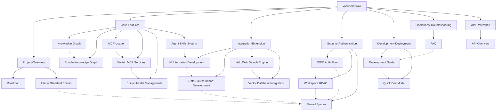

# WeKnora Wiki

Welcome to the WeKnora knowledge base wiki! This is the interconnected knowledge network for the WeKnora project documentation, with all pages linked bidirectionally to help you explore the entire knowledge system from any entry point.

---

## Project Overview

| Page | Description |
|------|------|
| [Version Roadmap](Project-Overview/Version-Roadmap.md) | Product planning and roadmap direction |
| [Lite vs Standard Edition Differences](Project-Overview/Lite-vs-Standard-Edition.md) | Feature comparison between the lite and standard editions |

## Core Features

| Page | Description |
|------|------|
| [Knowledge Graph](Core-Features/Knowledge-Graph.md) | Quick start and usage guide for the Neo4j knowledge graph |
| [Enabling the Knowledge Graph Feature](Core-Features/Enabling-Knowledge-Graph.md) | Complete workflow for enabling the knowledge graph feature |
| [MCP Feature Usage Guide](Core-Features/MCP-Usage-Guide.md) | User guide for operating MCP services |
| [Built-in MCP Service Management](Core-Features/Builtin-MCP-Service-Management.md) | System-level management of built-in MCP services |
| [Built-in Model Management](Core-Features/Builtin-Model-Management.md) | System-level management of built-in models |
| [Agent Skills System](Core-Features/Agent-Skills-System.md) | Agent Skills extension mechanism and preloaded skills |

## Integrations and Extensions

| Page | Description |
|------|------|
| [IM Integration Development](Integration-Extension/IM-Integration-Development.md) | Integration development for enterprise instant messaging platforms |
| [Data Source Import Development](Integration-Extension/Data-Source-Import-Development.md) | Automatic synchronization and import of data from external platforms |
| [Adding a Web Search Engine](Integration-Extension/Adding-a-New-Search-Engine.md) | Extending new web search providers |
| [Integrating a Vector Database](Integration-Extension/Integrating-a-Vector-Database.md) | Integrating new vector database retrieval engines |

## Security and Authentication

| Page | Description |
|------|------|
| [OIDC Authentication Call Flow](Security-Authentication/OIDC-Authentication-Flow.md) | The complete call chain for OIDC third-party login |
| [Space RBAC Guide](Security-Authentication/RBAC-Guide.md) | Role matrix, resource ownership, and auditing within a space |
| [Shared Space Guide](Security-Authentication/Shared-Spaces-Guide.md) | Cross-space collaboration and sharing of knowledge bases/agents |

## Development and Deployment

| Page | Description |
|------|------|
| [Development Guide](Development-Deployment/Development-Guide.md) | Setting up the local development environment and workflow |
| [Quick Development Mode](Development-Deployment/Quick-Development-Mode.md) | Hot-reload development mode for backend/frontend |

## Operations and Troubleshooting

| Page | Description |
|------|------|
| [FAQ](Operations-Troubleshooting/FAQ.md) | FAQ for deployment and usage |

## API Reference

| Page | Description |
|------|------|
| [API Documentation Overview](API-Reference/API-Documentation-Overview.md) | Basic information and categorized index for the RESTful API |

---

## Knowledge Graph

---

## Backlinks

This page is the wiki home page; all pages link back here.
