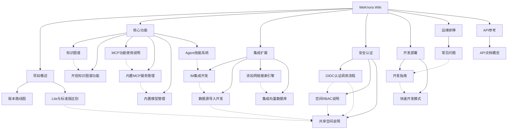

# WeKnora Wiki

Welcome to the WeKnora knowledge base wiki! This is the interconnected knowledge network for the WeKnora project documentation, with all pages linked bidirectionally to help you explore the entire knowledge system from any entry point.

---

## Project Overview

| Page | Description |
|------|------|
| [Version Roadmap](项目概述/版本路线图.md) | Product planning and roadmap direction |
| [Lite vs Standard Edition Differences](项目概述/Lite与标准版区别.md) | Feature comparison between the lite and standard editions |

## Core Features

| Page | Description |
|------|------|
| [Knowledge Graph](核心功能/知识图谱.md) | Quick start and usage guide for the Neo4j knowledge graph |
| [Enabling the Knowledge Graph Feature](核心功能/开启知识图谱功能.md) | Complete workflow for enabling the knowledge graph feature |
| [MCP Feature Usage Guide](核心功能/MCP功能使用说明.md) | User guide for operating MCP services |
| [Built-in MCP Service Management](核心功能/内置MCP服务管理.md) | System-level management of built-in MCP services |
| [Built-in Model Management](核心功能/内置模型管理.md) | System-level management of built-in models |
| [Agent Skills System](核心功能/Agent技能系统.md) | Agent Skills extension mechanism and preloaded skills |

## Integrations and Extensions

| Page | Description |
|------|------|
| [IM Integration Development](集成扩展/IM集成开发.md) | Integration development for enterprise instant messaging platforms |
| [Data Source Import Development](集成扩展/数据源导入开发.md) | Automatic synchronization and import of data from external platforms |
| [Adding a Web Search Engine](集成扩展/添加网络搜索引擎.md) | Extending new web search providers |
| [Integrating a Vector Database](集成扩展/集成向量数据库.md) | Integrating new vector database retrieval engines |

## Security and Authentication

| Page | Description |
|------|------|
| [OIDC Authentication Call Flow](安全认证/OIDC认证调用流程.md) | The complete call chain for OIDC third-party login |
| [Space RBAC Guide](安全认证/RBAC说明.md) | Role matrix, resource ownership, and auditing within a space |
| [Shared Space Guide](安全认证/共享空间说明.md) | Cross-space collaboration and sharing of knowledge bases/agents |

## Development and Deployment

| Page | Description |
|------|------|
| [Development Guide](开发部署/开发指南.md) | Setting up the local development environment and workflow |
| [Quick Development Mode](开发部署/快速开发模式.md) | Hot-reload development mode for backend/frontend |

## Operations and Troubleshooting

| Page | Description |
|------|------|
| [FAQ](运维排障/常见问题.md) | FAQ for deployment and usage |

## API Reference

| Page | Description |
|------|------|
| [API Documentation Overview](API参考/API文档概览.md) | Basic information and categorized index for the RESTful API |

---

## Knowledge Graph

---

## Backlinks

This page is the wiki home page; all pages link back here.
