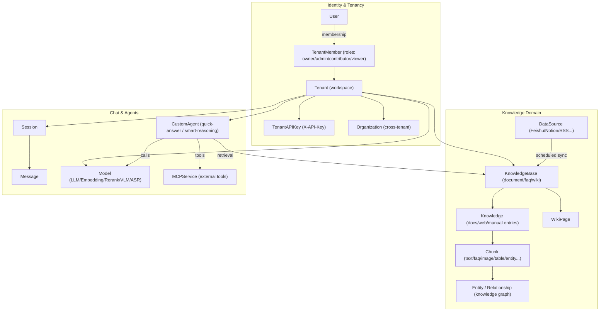
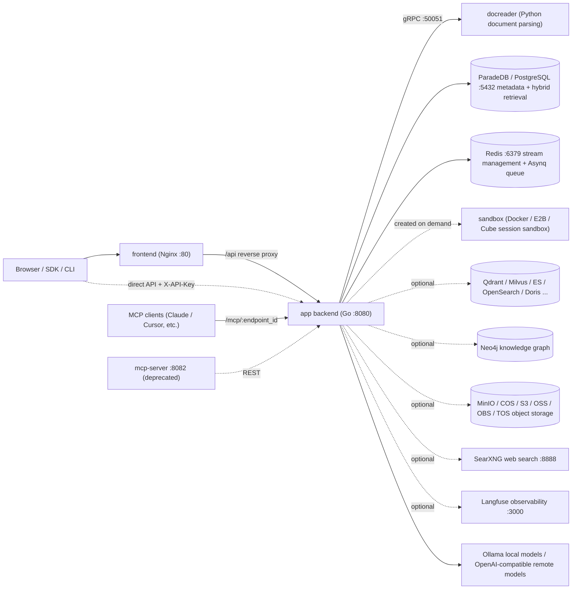

# WeKnora Product Introduction

WeKnora (维娜拉) is Tencent's open-source knowledge base Q&A system. It can import PDFs, Word documents, web pages, and content from platforms such as Feishu, Notion, Confluence, Yuque, and DingTalk. Users can ask questions about this material and view the source text through the citations in each answer.

The system uses Retrieval-Augmented Generation (RAG): it first parses documents and builds indexes, then retrieves relevant passages for each question and has the large model generate the answer.

The system consists of a Go backend, a Vue 3 frontend, and docreader, a Python document parsing service. It supports deployment via Docker Compose, Helm, a single-binary Lite mode, and a desktop app.

<Screenshot
  src="/screenshots/introduction-overview.png"
  caption="WeKnora main interface: knowledge bases and sessions on the left, Q&A area on the right"
  hint="Shows the full main interface after login: the sidebar (knowledge bases, agents, settings entry point) and a round of Q&A with citations." />

## Use Cases {#what-problems-does-weknora-solve}

| Need | Feature |
| --- | --- |
| Complex document formats — PDFs/scans/tables are hard to structure | The document processing pipeline supports PDF layout analysis, OCR for scanned documents, Office conversion, web scraping, and image captioning, with optional OpenDataLoader/Docling hybrid parsing |
| Single vector retrieval yields unstable recall | Hybrid vector + keyword (BM25) retrieval, RRF fusion, rerank re-scoring, with optional knowledge graph (GraphRAG) and Wiki navigation |
| Locked into a single model vendor | Model abstraction layer: works with local Ollama models and dozens of built-in providers (OpenAI-compatible, Anthropic Messages, native Gemini, and other protocols), with LLM / Embedding / Rerank / VLM / ASR category management; see [Model Management](../03-features/06-models.md) for the provider and model catalog |
| Data security and private deployment | Fully self-hostable stack; sensitive credentials (API keys, etc.) are encrypted at rest with AES-256 (`SYSTEM_AES_KEY`); multi-tenant isolation + RBAC role-based authorization |
| Multi-step tasks and tool calling | Built-in Agent (ReAct multi-step reasoning), MCP tool integration, sandboxed Agent Skills execution, web search (SearXNG, etc.), data analysis (running SQL against CSV/Excel) |
| Team collaboration | Tenants (workspaces) + member roles + Organizations for cross-tenant knowledge base sharing + invitation mechanism |

## Core Concepts

Knowledge bases organize material, workspaces manage members and resource permissions, and agents determine the models and tools used for answers. The terms below correspond to options in the interface; the full type definitions are under `internal/types/`.

### Tenants and Identity

| Concept | Description |
| --- | --- |
| Tenant | A workspace that manages knowledge bases, models, agents, sessions, and the storage quota. See [Workspaces and Permissions](../03-features/01-tenant-auth.md) |
| User | A login account; one user can join multiple workspaces |
| TenantMember | A user's membership in a workspace, including role and status |
| TenantRole | Four levels — Owner, Admin, Contributor, Viewer — determining which workspace operations a user can perform |
| API Key (TenantAPIKey) | A credential for programmatic access that can be granted specific capabilities and restricted to certain knowledge bases. Workspace and platform key permissions are managed separately |
| Organization | Connects multiple workspaces and shares knowledge bases and agents according to organization member roles |

### Knowledge Domain

| Concept | Description |
| --- | --- |
| KnowledgeBase | Organizes related material and configures models, chunking, and indexing strategies. Supports document, FAQ, and Wiki types |
| Knowledge | A single file, web page, or hand-written entry in a knowledge base; its parsing status can be checked after ingestion |
| Chunk | The retrieval unit produced by document parsing; it can contain text, image recognition results, tables, or other indexed content |
| FAQ | Q&A entries that maintain a standard question, similar questions, negative examples, and answers; see [FAQ Capabilities](../03-features/17-faq.md) |
| WikiPage | A topic page generated from documents, with source citations and page links, supporting editing and version management |
| Knowledge Graph Entity / Relationship | Entities and relationships in documents, stored in Neo4j and used to supplement retrieval of related content |
| DataSource | A connection that continuously syncs external material. Supports Feishu/Lark (wiki and drive), Notion, Confluence, Yuque, DingTalk Docs, Tencent IMA, GitLab, and RSS; see [Data Source Import](../03-features/10-datasource.md) |
| RetrievalConfig | Controls the number of candidates, match thresholds, fusion weights, and rerank results; see [Retrieval Engines](../03-features/05-retrieval-engines.md) |

### Conversations and Agents

| Concept | Description |
| --- | --- |
| Session | Stores multi-turn Q&A along with the selected agent, model, knowledge scope, and tool configuration |
| Message | A single question or answer, which can be associated with images, attachments, citations, and tool execution results |
| Model | A model connection that provides chat, embedding, rerank, vision, or speech capabilities; see [Model Management](../03-features/06-models.md) |
| CustomAgent (Custom Agent) | Configures the model, material scope, and tools per task; supports quick Q&A and smart reasoning |
| Built-in Agents | Preconfigured quick Q&A, smart reasoning, data analysis, and Wiki agents; see [Agent Engine](../03-features/07-agent.md) |
| Skills and Sandbox | The workspace skill catalog stores packages, which are installed per sandbox configuration and then bound to agents; supports Docker/Cube/E2B, personal variables, and generated files; see [Skills and Sandbox](../03-features/22-skills-sandbox.md) |
| Long-Term Memory | Stores profile/preferences/facts/tasks/interests per workspace and caller; off by default; see [Long-Term Memory](../03-features/23-memory.md) for enabling it and personal management |
| MCPService | Connects external tools to agents, supporting SSE and Streamable HTTP; authentication can use API Key, Bearer, or OAuth 2.0 |

### Concept Relationship Diagram

## Feature List

- **Document ingestion**: file upload (PDF/Word/PPT/Excel/Markdown/HTML/EPUB/XMind/images/audio, etc.), URL scraping, hand-written Markdown, whole-directory upload, scheduled syncing for Feishu / Lark / Notion / Confluence / Yuque / DingTalk / IMA / GitLab / RSS.
- **Document understanding**: layout analysis, OCR for scanned documents, table extraction, multimodal image captioning (VLM), audio transcription (ASR), parser engine selection by file type (`ParserEngineRules`, can hook into MinerU / OpenDataLoader).
- **Indexing pipeline**: configurable chunking (including parent-child chunking and adaptive strategies), vector indexing, keyword full-text indexing, FAQ indexing, Wiki generation, knowledge graph extraction, pre-generated questions (question generation).
- **Retrieval**: hybrid vector + BM25 retrieval, RRF fusion, rerank re-scoring, query rewriting and expansion, intent recognition (greeting/chitchat/web_search, etc. — see `config/prompt_templates/intent_prompts.yaml`).
- **Q&A and Agents**: streaming SSE Q&A, multi-turn context compression, citation tracing; ReAct Agent (tools: `search_knowledge`, `read_document`, `list_documents`, `wiki_search`, `data_analysis`, etc.), external MCP tools, Agent Skills (script execution in a Docker, Cube, or E2B sandbox), web search.
- **Conversation experience**: add requirements while an answer is in progress, fork from or roll back in place to any earlier question (with sandbox workspace checkpoints), adjust thinking intensity per session, and an "Artifacts" page that collects agent-generated files across sessions; see [Conversation Experience](../03-features/18-chat-experience.md).
- **Multi-tenancy and security**: RBAC role-based authorization (enabled by default, `WEKNORA_TENANT_ENABLE_RBAC`), audit logs (retained 90 days by default), invite-only registration (`auth.registration_mode=invite_only`, or the legacy `DISABLE_REGISTRATION=true` variable), OIDC single sign-on, SSRF protection (optional allowlist-only egress via `SSRF_DNS_WHITELIST_ONLY`), AES-256 encryption for sensitive fields. The interface is available in Simplified Chinese, English, Japanese, Korean, and Russian.
- **Observability**: full-chain Langfuse tracing (LLM/Embedding/Rerank/VLM/ASR calls and token statistics), health checks, Swagger API docs (when `GIN_MODE=debug`).
- **Ecosystem**: REST API (`/api/v1`) + API Key, a built-in MCP Server (create endpoints per workspace to expose WeKnora as a tool to other Agents; see [MCP Integration](../03-features/08-mcp.md)), a CLI (`cli/`), a WeChat Mini Program (`miniprogram/`), a browser extension channel, and the [local browser](../05-clients/09-local-browser.md) (agents operate the user's browser through a Chrome/Edge extension). The Lite desktop edition (macOS) can run agent commands in a local sandbox.

## System Components Overview

| Component | Tech Stack | Source Location | Default Port | Responsibility |
| --- | --- | --- | --- | --- |
| app (backend) | Go / Gin | `cmd/server`, `internal/` | 8080 | REST API, retrieval Q&A, Agent engine, async tasks (Asynq) |
| frontend | Vue 3 + Nginx | `frontend/` | 80 | Web console, Nginx reverse-proxies `/api` to app |
| docreader | Python / gRPC | `docreader/` | 50051 (container network only) | File-to-Markdown conversion, web scraping, image extraction |
| postgres | ParadeDB (PostgreSQL 17 + BM25/vector extensions) | image `paradedb/paradedb` | 5432 | Primary database + default hybrid retrieval engine (`RETRIEVE_DRIVER=postgres`) |
| redis | Redis 7 | — | 6379 | Stream management (SSE recovery), Asynq task queue |
| sandbox | Python 3.12 + Node 20 | `docker/Dockerfile.sandbox` | — | Session sandbox container image for Agent Skills |
| Optional: qdrant / milvus / weaviate / doris | — | `docker-compose.yml` profiles | 6334 / 19530 / 9035 / 9030 | Alternative or additional vector retrieval engines (`RETRIEVE_DRIVER`) |
| Optional: opensearch | — | `docker-compose.dev.yml` only | 9200 | For development use; production requires your own cluster |
| Optional: elasticsearch / tencent_vectordb | — | not shipped with compose | — | Supported in code, but must be deployed separately and wired up via `RETRIEVE_DRIVER` |
| Optional: neo4j | Neo4j | profile `neo4j` | 7474 / 7687 | Knowledge graph storage (GraphRAG) |
| Optional: minio | MinIO | profile `minio` | 9000 / 9001 | S3-compatible object storage (`STORAGE_TYPE=minio`) |
| Optional: searxng | SearXNG | profile `searxng` | 8888 | Self-hosted web search engine |
| Optional: langfuse stack | Langfuse 3 + ClickHouse + MinIO | profile `langfuse` | 3000 | LLM observability |
| Optional: mcp (deprecated) | Python | `mcp-server/`, profile `full` | 8082 | Legacy standalone MCP Server; new deployments use the MCP Server endpoints built into app |
| Optional: odl-hybrid | Docling | profile `odl-hybrid` | 5002 | OpenDataLoader PDF hybrid parsing backend |

## Next Steps

- [Installation & Deployment](./02-installation.md): choose a deployment method and start the service.
- [Quick Start](./03-quickstart.md): create a knowledge base, upload documents, and complete your first Q&A.
- [Configuration Reference](./04-configuration.md): look up deployment parameters and configuration precedence.
