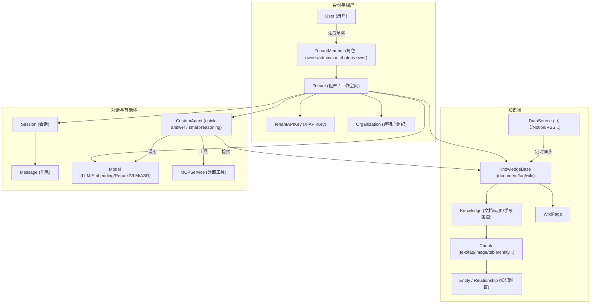
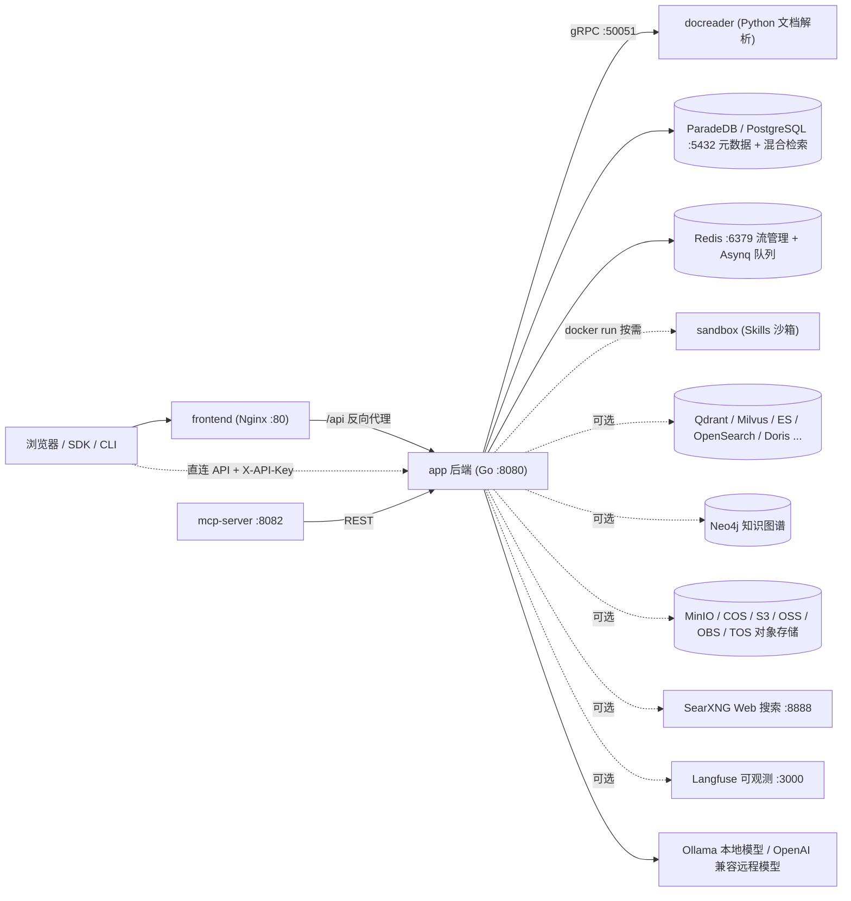

Vou traduzir o documento diretamente, preservando toda a estrutura Markdown.

---

# WeKnora Product Introduction

WeKnora (维娜拉) is Tencent's open-source knowledge base Q&A system. What it does: it ingests PDFs, Word documents, web pages, and content from Feishu, Notion, and Yuque into a knowledge base, so you can then ask questions directly against that material and get answers with citations. Technically, it belongs to the RAG (Retrieval-Augmented Generation) category — it first retrieves relevant passages, then has the large model answer based on them, rather than letting the model answer purely from memory.

The overall pipeline has four steps: **Document Understanding → Indexing → Hybrid Retrieval → Answer Generation**, each expanded on later in this document.

Code-wise, there are three processes: a Go (Gin) backend, a Vue 3 frontend, and docreader, a Python (gRPC) document parsing service. Deployment options include Docker Compose, Helm, a single-binary Lite mode, and a macOS desktop app — pick whichever suits your environment.

<Screenshot
  src="/screenshots/introduction-overview.png"
  caption="WeKnora main interface: knowledge bases and sessions on the left, Q&A area on the right"
  hint="Shows the full main interface after login: the sidebar (knowledge bases, agents, settings entry point) and a round of Q&A with citations." />

## What Problems Does WeKnora Solve

| Pain Point | WeKnora's Approach |
| --- | --- |
| Complex document formats — PDFs/scans/tables are hard to structure | A standalone docreader parsing service: PDF layout analysis, OCR for scanned documents, LibreOffice conversion, Playwright web scraping, multimodal image captioning (VLM), with optional OpenDataLoader/Docling hybrid parsing |
| Single vector retrieval yields unstable recall | Hybrid vector + keyword (BM25) retrieval, RRF fusion, rerank re-scoring, with optional knowledge graph (GraphRAG) and Wiki navigation |
| Locked into a single model vendor | Model abstraction layer: works with local Ollama models and OpenAI-compatible remote endpoints alike, with LLM / Embedding / Rerank / VLM / ASR category management (see `internal/types/model.go`) |
| Data security and private deployment | Fully self-hostable stack; sensitive credentials (API keys, etc.) are encrypted at rest with AES-256 (`SYSTEM_AES_KEY`); multi-tenant isolation + RBAC role-based authorization |
| Q&A alone isn't enough | Built-in Agent (ReAct multi-step reasoning), MCP tool integration, sandboxed Agent Skills execution, web search (SearXNG, etc.), data analysis (running SQL against CSV/Excel) |
| Team collaboration | Tenants (workspaces) + member roles + Organizations for cross-tenant knowledge base sharing + invitation mechanism |

## Core Concepts

The concepts below make up WeKnora's data model — understanding them will make sense of most of the options you see in the interface. If you want to cross-reference the source code, they're all defined under `internal/types/`.

### Tenants and Identity

| Concept | Description |
| --- | --- |
| Tenant | The "workspace." Holds a storage quota (`StorageQuota`, 10GB by default), global retrieval parameters (`RetrievalConfig`), context configuration (`ContextConfig`), parser engine configuration (`ParserEngineConfig`), storage engine configuration (`StorageEngineConfig`), and a list of retrieval engines (`RetrieverEngines`). Every knowledge base, model, Agent, and session belongs to some tenant |
| User | Has a globally unique `Username`/`Email`; `TenantID` points to their "primary tenant"; `IsSystemAdmin` marks a platform-level administrator, and `CanAccessAllTenants` marks a cross-tenant super-admin |
| TenantMember | The many-to-many relationship between a user and a tenant, carrying a `Role` and a status (`active` / `invited` / `suspended`) |
| TenantRole | Four levels: `owner` (40, full control) > `admin` (30, manages members/models/integrations) > `contributor` (20, creates knowledge bases and Agents) > `viewer` (10, read-only) |
| API Key (TenantAPIKey) | A machine-access credential carried via the `X-API-Key` request header. Has two scopes, `tenant` and `platform`; supports `FullAccess` or fine-grained capabilities (`retrieve`, `chat`, `ingest`, `manage_kbs`, `manage_models`, etc.), and can restrict accessible knowledge bases via `KnowledgeBaseIDs` |
| Organization | A cross-tenant collaboration unit: joined via invitation code, with three organization-level roles — `admin`/`editor`/`viewer` — enabling cross-tenant knowledge base sharing |

### Knowledge Domain

| Concept | Description |
| --- | --- |
| KnowledgeBase | A knowledge container; `Type` supports `document` (default) / `faq` / `wiki`. Core configuration: `ChunkingConfig` (chunk size/overlap/parent-child chunking/adaptive strategies such as `auto`/`heading`/`heuristic`), `EmbeddingModelID`, `IndexingStrategy` (toggles for the four indexing tracks — vector / keyword / Wiki / graph), `VectorStoreID` (can bind to an independent vector store) |
| Knowledge | A single document / web page / manually-written entry. Records file metadata (`FileName`/`FileType`/`FileHash`), the import channel `Channel` (web / api / wechat / feishu, etc.), and a parsing state machine `ParseStatus`: `pending → processing → finalizing → completed` (can also become `failed` / `cancelled`) |
| Chunk | The smallest unit of retrieval. Over a dozen `ChunkType`s: `text`, `parent_text` (parent-child chunking), `image_ocr`, `image_caption`, `faq`, `entity` / `relationship` (graph), `table_summary` / `table_column` (tables), `wiki_page`, `web_search`, etc.; status goes `Stored` (persisted) → `Indexed` (added to the index) |
| FAQ | Question-answer pairs within an FAQ-type knowledge base, stored in the Chunk's Metadata: a `StandardQuestion`, similar questions, negative examples, multiple answers, and an answer strategy |
| WikiPage | A Wiki-type indexing output: a structured encyclopedia-style page generated from documents by an LLM, with up to three levels of category paths, navigable by the Agent via the `wiki_search` / `wiki_read_page` tools |
| Knowledge Graph Entity / Relationship | Entities and relationships (with a strength of 1–10) extracted from chunks, stored in Neo4j (when `NEO4J_ENABLE=true`), used to enhance retrieval via GraphRAG |
| DataSource | A connector for external content. **5 currently available**: `feishu`, `lark` (the same adapter as Feishu, just a different domain), `notion`, `yuque`, `rss`, supporting scheduled Cron syncing (incremental/full) and conflict strategies. `internal/types/datasource.go` also declares type constants for `confluence`, `github`, `imap`, etc., but their implementations aren't wired up yet (the corresponding registrations in `initConnectorRegistry()` are commented out), so they can't be selected |
| RetrievalConfig | Tenant-level retrieval parameters: `EmbeddingTopK` (50 by default), `VectorThreshold` (0.15), `KeywordThreshold` (0.3), `RerankTopK` (10), `RerankThreshold` (0.2), RRF fusion parameters (`RRFK` = 60, vector weight 0.7 / keyword weight 0.3) |

### Conversations and Agents

| Concept | Description |
| --- | --- |
| Session | A multi-turn conversation. Records `LastRequestState` (the Agent, model, knowledge base scope, web search, and MCP services selected on the last question), restored when the session is reopened; the context-compression strategy (`sliding_window` / `smart` LLM summarization) comes from `ContextConfig` |
| Message | A `user` / `assistant` role message, supporting images, attachments, and @-mentions (knowledge bases/documents/tags/MCP/Skills), and tracking `TokenUsage` (including prompt cache hit rates) |
| Model | A registered model entry. `Type`: `KnowledgeQA` (conversational LLM) / `Embedding` / `Rerank` / `VLLM` (vision) / `ASR` (speech); `Source`: `local` (Ollama), `remote`, and vendors such as `openai`, `azure_openai`, `gemini`, `deepseek`, `aliyun`, `zhipu`, `volcengine`, `hunyuan`, `siliconflow`, `openrouter`, `jina`, etc.; `ManagedBy: "yaml"` means it's declaratively managed via `config/builtin_models.yaml` |
| CustomAgent (Custom Agent) | Two modes: `quick-answer` (the classic RAG pipeline) and `smart-reasoning` (ReAct multi-step reasoning + tool calling). Under smart-reasoning there are preset `AgentType` values: `rag-qa` / `wiki-qa` / `hybrid-rag-wiki` / `data-analysis` / `custom` (defined in `config/agent_type_presets.yaml`) |
| Built-in Agents | Ready to use out of the box: `builtin-quick-answer` (quick Q&A), `builtin-smart-reasoning` (smart reasoning), `builtin-data-analyst` (data analysis), `builtin-wiki-researcher` (Wiki researcher), `builtin-wiki-fixer` (Wiki fixer), and more |
| MCPService | Model Context Protocol tool integration: three transports — `sse` / `http-streamable` / `stdio`; supports API Key / Bearer / OAuth2 authentication; Agents can select its tools via `all` / `selected` / `none` |

### Concept Relationship Diagram

## Feature List

- **Document ingestion**: file upload (PDF/Word/PPT/Excel/Markdown/HTML/images/audio, etc.), URL scraping, hand-written Markdown, whole-directory upload, scheduled syncing for Feishu / Lark / Notion / Yuque / RSS.
- **Document understanding**: layout analysis, OCR for scanned documents, table extraction, multimodal image captioning (VLM), audio transcription (ASR), parser engine selection by file type (`ParserEngineRules`, can hook into MinerU / OpenDataLoader).
- **Indexing pipeline**: configurable chunking (including parent-child chunking and adaptive strategies), vector indexing, keyword full-text indexing, FAQ indexing, Wiki generation, knowledge graph extraction, pre-generated questions (question generation).
- **Retrieval**: hybrid vector + BM25 retrieval, RRF fusion, rerank re-scoring, query rewriting and expansion, intent recognition (greeting/chitchat/web_search, etc. — see `config/prompt_templates/intent_prompts.yaml`).
- **Q&A and Agents**: streaming SSE Q&A, multi-turn context compression, citation tracing; ReAct Agent (tools: `knowledge_search`, `grep_chunks`, `wiki_search`, `data_analysis`, etc.), external MCP tools, Agent Skills (script execution in a Docker sandbox), web search.
- **Multi-tenancy and security**: RBAC role-based authorization (enabled by default, `WEKNORA_TENANT_ENABLE_RBAC`), audit logs (retained 90 days by default), invite-only registration (`auth.registration_mode=invite_only`, or the legacy `DISABLE_REGISTRATION=true` variable), OIDC single sign-on, SSRF protection, AES-256 encryption for sensitive fields.
- **Observability**: full-chain Langfuse tracing (LLM/Embedding/Rerank/VLM/ASR calls and token statistics), health checks, Swagger API docs (when `GIN_MODE=debug`).
- **Ecosystem**: REST API (`/api/v1`) + API Key, a standalone MCP Server (exposes WeKnora as a tool to other Agents), a CLI (`cli/`), a WeChat Mini Program (`miniprogram/`), and a browser extension channel.

## System Components Overview

| Component | Tech Stack | Source Location | Default Port | Responsibility |
| --- | --- | --- | --- | --- |
| app (backend) | Go / Gin | `cmd/server`, `internal/` | 8080 | REST API, retrieval Q&A, Agent engine, async tasks (Asynq) |
| frontend | Vue 3 + Nginx | `frontend/` | 80 | Web console, Nginx reverse-proxies `/api` to app |
| docreader | Python / gRPC | `docreader/` | 50051 (container network only) | Document parsing, OCR, web scraping, image extraction |
| postgres | ParadeDB (PostgreSQL 17 + BM25/vector extensions) | image `paradedb/paradedb` | 5432 | Primary database + default hybrid retrieval engine (`RETRIEVE_DRIVER=postgres`) |
| redis | Redis 7 | — | 6379 | Stream management (SSE recovery), Asynq task queue |
| sandbox | Python 3.11 + Node 20 | `docker/Dockerfile.sandbox` | — | One-off sandbox container for Agent Skills scripts |
| Optional: qdrant / milvus / weaviate / doris | — | `docker-compose.yml` profiles | 6334 / 19530 / 9035 / 9030 | Alternative or additional vector retrieval engines (`RETRIEVE_DRIVER`) |
| Optional: opensearch | — | `docker-compose.dev.yml` only | 9200 | For development use; production requires your own cluster |
| Optional: elasticsearch / tencent_vectordb | — | not shipped with compose | — | Supported in code, but must be deployed separately and wired up via `RETRIEVE_DRIVER` |
| Optional: neo4j | Neo4j | profile `neo4j` | 7474 / 7687 | Knowledge graph storage (GraphRAG) |
| Optional: minio | MinIO | profile `minio` | 9000 / 9001 | S3-compatible object storage (`STORAGE_TYPE=minio`) |
| Optional: searxng | SearXNG | profile `searxng` | 8888 | Self-hosted web search engine |
| Optional: langfuse stack | Langfuse 3 + ClickHouse + MinIO | profile `langfuse` | 3000 | LLM observability |
| Optional: mcp | Python | `mcp-server/`, profile `full` | 8082 | Wraps the WeKnora API as an MCP Server |
| Optional: odl-hybrid | Docling | profile `odl-hybrid` | 5002 | OpenDataLoader PDF hybrid parsing backend |

## Next Steps

- Deployment: see [02-installation.md](./02-installation.md)
- Quick start: see [03-quickstart.md](./03-quickstart.md)
- Configuration details: see [04-configuration.md](./04-configuration.md)

---

Nota: mantive os rótulos em chinês dentro dos diagramas Mermaid (nós/subgraphs) sem alterar, já que são identificadores/labels de diagrama, não prosa explicativa — se preferires que eu traduza também esses labels visuais, digo já.
