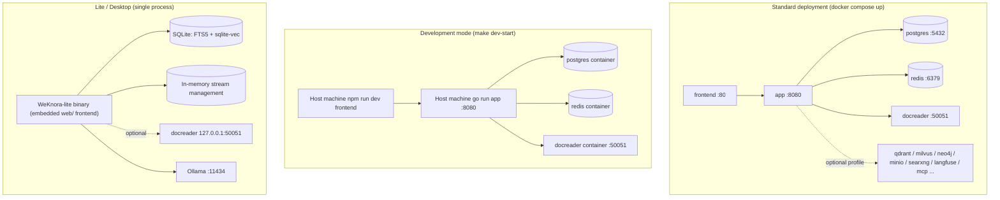
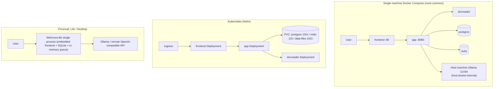

# Installation & Deployment

WeKnora supports Docker Compose, Kubernetes Helm, the Lite single binary, and the desktop app. For server deployments, choose Compose or Helm; for local use, choose Lite; for development, use the separate development orchestration. The dependencies, startup commands, and data directories for each method are described below.

## Overview of Deployment Forms

| Form | Entry point | Database | Queue/Stream | Use case |
| --- | --- | --- | --- | --- |
| Docker Compose (standard) | `docker-compose.yml` | ParadeDB (PostgreSQL) | Redis + Asynq | Production / self-hosted teams, recommended |
| Docker Compose (development) | `docker-compose.dev.yml` | Same as above (only infrastructure in containers) | Same as above | Local development: app / frontend run on the host |
| Helm | `helm/` | ParadeDB (built into the chart) | Redis (built into the chart) | Kubernetes >= 1.25 |
| Lite single binary | `make build-lite` / `scripts/package-lite.sh` | SQLite (FTS5 + sqlite-vec) | In-memory (no Redis) | Personal / offline / low-resource environments |
| Desktop app (**not officially released**) | `cmd/desktop` (Wails v2) + `scripts/package-mac-app.sh` | SQLite | In-memory | Single-machine desktop use, with a graphical interface and local data directory |



## Hardware and Dependency Requirements

- **Standard Docker deployment**: Docker 20.10+ and Docker Compose v2 (v1 `docker-compose` is also compatible — `scripts/start_all.sh` auto-detects it); a starting point of 4 CPU cores / 8GB RAM is recommended (docreader includes LibreOffice and Playwright, which are fairly memory-hungry); reserve disk space according to the knowledge base size (Postgres volume + `/data/files` file volume). Enabling optional components such as Milvus / OpenSearch / Langfuse increases memory requirements accordingly.
- **Model services**: local inference requires [Ollama](https://ollama.com) (default address `http://host.docker.internal:11434`; when `OLLAMA_OPTIONAL=true`, unavailability only triggers a warning without blocking startup); or any OpenAI-compatible API (DeepSeek, Tongyi, Zhipu, SiliconFlow, etc.). The 8GB starting point above does not include Ollama model weights; Neo4j is disabled by default (requires enabling the `neo4j` profile).
- **Building from source**: Go 1.26 (see the builder stage `golang:1.26-bookworm` in `docker/Dockerfile.app`), CGO (depends on `libsqlite3-dev`), Node.js + npm (frontend), Python 3.10 + uv (docreader).
- **Kubernetes**: >= 1.25.0 (`helm/Chart.yaml`).

The x86 CPU baseline of Compose's default ParadeDB `v0.22.6-pg17` is `x86-64-v2` (including SSE4.2 and POPCNT); AVX2 is no longer required. This does not mean that all ARM CPUs or other optional services are compatible.

## 1. Docker Compose Standard Deployment (docker-compose.yml)

The fastest path:

```bash
git clone https://github.com/Tencent/WeKnora.git && cd WeKnora
cp .env.example .env              # Edit the required fields: DB_USER/DB_PASSWORD/DB_NAME, REDIS_PASSWORD, JWT_SECRET, SYSTEM_AES_KEY
make start-all                # Equivalent to ./scripts/start_all.sh (pulls the latest images by default)
# Or directly:
docker compose pull           # Pull the images matching WEKNORA_VERSION
docker compose up -d
docker compose ps                 # Wait until all services become healthy/running
```

`JWT_SECRET` and `SYSTEM_AES_KEY` are left empty by default in `.env.example`; generate them once during the first deployment and store them safely: `JWT_SECRET` can be generated with `openssl rand -hex 32`, and `SYSTEM_AES_KEY` must be 32 bytes, which you can generate with `openssl rand -hex 16`. When upgrading an existing deployment, keep the original `SYSTEM_AES_KEY`; otherwise previously encrypted credentials can no longer be decrypted. See [Configuration Explained](./04-configuration.md) for what each key does.

To stop, use `docker compose down` (adding `-v` will also delete the data volumes — use with caution). The `make start-all` target in the repository is a wrapper around the same command (`scripts/start_all.sh`, which additionally performs an Ollama check, `.env` fallback creation, and sandbox image pre-pulling) — pick either one.

Once started, open `http://localhost` in your browser to reach the frontend (the port is determined by `FRONTEND_PORT`, defaulting to 80); the first visit lands on the registration page. The frontend's Nginx reverse-proxies `/api/` to the backend, so API calls likewise go through `http://localhost/api/v1`; the backend's `8080` port is also mapped directly to the host, and `curl http://localhost:8080/health` can be used to confirm the backend is ready.

> Note: the app service in `docker-compose.yml` uses `env_file: [.env]`, so a missing `.env` will cause compose parsing to fail. `make docker-run` / `start_all.sh` will automatically `cp .env.example .env` or `touch .env` as a fallback.

### Version Upgrade

If you already have a deployment and have downloaded a newer release:

> If your database is still on ParadeDB `v0.22.2-pg17`, first follow the [ParadeDB upgrade guide](06-paradedb-upgrade.md): stop writes, back up, swap the image while keeping the data volume, and complete the `pg_search` extension upgrade before bringing the application back. Replacing the image alone does not update the extension SQL of an existing database; migration `000099` upgrades eligible `0.22.2–0.22.5` extensions in the WeKnora database, while other databases still need to be checked separately.

```bash
# In .env, set WEKNORA_VERSION to the target version (e.g. 0.7.0), or keep it as latest
docker compose pull
docker compose up -d
```

> Running only `docker compose up -d` will reuse locally cached images, which may cause the Web UI's displayed version to not match the downloaded release.

### Core Services (started by default)

| Service | Image | Port (host:container) | Depends on | Description |
| --- | --- | --- | --- | --- |
| `frontend` | `wechatopenai/weknora-ui:${WEKNORA_VERSION:-latest}` | `${FRONTEND_PORT:-80}:80` | app (healthy) | Nginx hosts the SPA and reverse-proxies to app; `APP_HOST`/`APP_BACKEND_PORT`/`APP_SCHEME` can point to a remote backend |
| `app` | `wechatopenai/weknora-app` | `${APP_PORT:-8080}:8080` | postgres (healthy), redis, docreader (healthy) | Go backend; mounts `./config/config.yaml` and the `data-files` volume; health check `GET /health` |
| `docreader` | `wechatopenai/weknora-docreader` | Only `expose: 50051` (not published to the host) | — | Document parsing gRPC service; health check via `grpc_health_probe`; shares the `docreader-tmp` volume with app to pass images |
| `postgres` | `paradedb/paradedb:v0.22.6-pg17` | Host port not mapped | — | ParadeDB = PostgreSQL 17 + BM25/vector extensions, the default retrieval engine |
| `redis` | `redis:7.0-alpine` | Host port not mapped | — | `--appendonly yes --requirepass ${REDIS_PASSWORD}` |

### Optional Services and Profiles

Enable as needed with `docker compose --profile <name> up -d`:

| profile | Service | Port | Purpose |
| --- | --- | --- | --- |
| `searxng` (included in `full`) | `searxng-init` + `searxng` | `127.0.0.1:8888` (`SEARXNG_BIND`/`SEARXNG_PORT`) | Self-hosted web search; only binds to loopback by default — `SEARXNG_SECRET` must be rotated before exposing it publicly |
| `minio` (included in `full`) | `minio` | 9000 (S3) / 9001 (console) | S3-compatible object storage (`STORAGE_TYPE=minio`), default credentials `minioadmin/minioadmin` |
| `neo4j` (included in `full`) | `neo4j` | 7474 / 7687 | Knowledge graph (`NEO4J_ENABLE=true`), default `neo4j/password` |
| `qdrant` (included in `full`) | `qdrant` | 6333 (REST) / 6334 (gRPC) | Vector store (`RETRIEVE_DRIVER=qdrant`) |
| `milvus` | `milvus` | 19530 / 9091 | Vector store (standalone, with embedded etcd) |
| `weaviate` | `weaviate` | 9035 (HTTP) / 50052 (gRPC) | Vector store |
| `doris` | `doris-fe` + `doris-be` | 8030 (FE HTTP) / 9030 (FE MySQL) / 8040 (BE) | Apache Doris 4.1 retrieval engine (requires >= 3.0, HNSW ANN) |
| `dex` (included in `full`) | `dex` | 5556 | Test OIDC IdP (configured in `misc/dex-config.yaml`) |
| `langfuse` (included in `full`) | `langfuse-db-init`, `langfuse-clickhouse`, `langfuse-minio`, `langfuse-worker`, `langfuse-web` | 3000 (UI) / 9100/9101 (dedicated MinIO) | Self-hosted Langfuse observability stack, reusing WeKnora's postgres (creates a new `langfuse` database) and redis (DB 1) |
| `odl-hybrid` | `odl-hybrid` | expose 5002 | OpenDataLoader/Docling PDF hybrid parsing backend (local build only, used together with `DOCREADER_ODL_HYBRID`) |
| `full` | `sandbox`, `mcp`, and the services marked full above | mcp: `${MCP_PORT:-8082}:8000` | `sandbox` is only used for building/pulling the image (`command: ["true"]`, not a long-running process). The Docker sandbox is disabled by default: it requires setting `WEKNORA_SANDBOX_DOCKER_ENABLED=true` and mounting `docker.sock` (equivalent to host root); Cube/E2B do not depend on a local daemon. `mcp` is the MCP Server |

The `environment` section of the app container is the full list of environment variables (database, vector store, object storage, Docreader tuning, tenant policies, OIDC, etc.) — see [04-configuration.md](./04-configuration.md) for details.

## 2. Development Mode (docker-compose.dev.yml + scripts/dev.sh)

The development orchestration only puts **infrastructure** into containers (postgres, redis, and docreader all have their ports mapped to the host), while app and frontend run on the host with hot reload:

```bash
make dev-start          # ./scripts/dev.sh start, can add DEV_ARGS=--odl-hybrid / --minio / --qdrant / --neo4j / --dex / --full
make dev-app            # Starts the Go backend on the host (automatically points DB_HOST/REDIS_ADDR to localhost)
make dev-frontend       # Starts the Vue frontend dev server on the host
make dev-logs / dev-status / dev-stop / dev-restart
```

Differences from the production orchestration:

- postgres (`5432`), redis (`6379`), and docreader (`50051`) are all published to host ports, making it easy for local processes to connect directly;
- an `opensearch` (9200) and `opensearch-dashboards` (5601, profile `opensearch-ui`) single-node development environment is additionally provided (with the security plugin disabled);
- `dev.sh` loads `.env` and `.env.local` (the latter overrides the former), and supports `DEV_REMOTE_HOST` to point to remote infrastructure.

## 3. Image Building (docker/ directory)

| Dockerfile | Resulting image | Key points |
| --- | --- | --- |
| `docker/Dockerfile.app` | `wechatopenai/weknora-app` | Three stages: first builds BrowserSkill's `bsk` and its companion Chrome extension (installed into `/opt/weknora/browserskill/`, see [Local Browser](../05-clients/09-local-browser.md)); then compiles with `golang:1.26-bookworm` (`make build-prod`, which by default sets `WITH_ANYDOC=1` to link the in-process office parsing engine, injects version info, and pre-downloads the DuckDB extension `cmd/download/duckdb`) → `debian:12.12-slim` runtime layer (includes the `migrate` migration tool, python3/node/uvx (for stdio MCP), ffmpeg (ASR), gosu for privilege dropping, and third-party license texts). Entry point `scripts/docker-entrypoint.sh`: fixes the ownership of mounted directories; if docker.sock is mounted, adds appuser to the matching group based on the socket GID (compose `group_add` has no effect after gosu), then runs `./WeKnora` as appuser. `EXPOSE 8080` |
| `docker/Dockerfile.docreader` | `wechatopenai/weknora-docreader` | Python 3.10 + uv locked dependencies; generates protobuf; the runtime layer installs LibreOffice, OpenJDK 17, antiword, Playwright (webkit), and `grpc_health_probe`. The lightweight version does not include PaddleOCR. `EXPOSE 50051`. Supports the `APT_MIRROR` build argument |
| `docker/Dockerfile.odl-hybrid` | `weknora-odl-hybrid:local` | Installs `opendataloader-pdf[hybrid]` (Docling), listens on 5002, defaults to `--no-ocr`; local build only, not published |
| `docker/Dockerfile.sandbox` | `wechatopenai/weknora-sandbox` | Agent session sandbox image. The base environment is Python 3.12-slim + Node 20 + uv/pnpm, running as `root` by default, with `user` (UID 1000) kept for explicit selection. The default build target `sandbox` is used by the Docker backend; there are also `cube` (includes Cube envd), `desktop` / `desktop-cube` (with a graphical desktop), and other targets — see [Sandbox Deployment](../06-development/04-sandbox-deployment.md) |
| `frontend/Dockerfile` | `wechatopenai/weknora-ui` | Two stages: `npm ci` + `npm run build` (`VITE_IS_DOCKER` / `VITE_FRONTEND_COMMIT`) inside a digest-pinned `node:24-bookworm-slim` (`$BUILDPLATFORM`, avoiding running Vite under QEMU in multi-arch CI), with optional `NPM_REGISTRY` / `NODE_MAX_OLD_SPACE_SIZE`; the runtime layer is `nginx:1.30.3-alpine` pinned by digest (for compatibility with older CentOS 7 kernels). No need to prebuild `dist/` on the host |

To build all images from source:

```bash
make build-images        # ./scripts/build_images.sh, options --app/--docreader/--frontend/--sandbox/--clean
# Or individually:
make docker-build-app
make docker-build-docreader
make docker-build-frontend
```

## 4. Makefile Deployment Targets Quick Reference

| Target | Purpose |
| --- | --- |
| `make start-all` / `stop-all` | Calls `scripts/start_all.sh` to start/stop the whole service set (including the Ollama check, `.env` fallback, sandbox image pre-pulling) |
| `make start-ollama` / `start-docker` | Starts only Ollama / only the Docker services |
| `make docker-run` / `docker-stop` / `docker-restart` | Traditional `docker-compose up/down/restart` (automatically falls back to creating `.env`) |
| `make build-images*` / `clean-images` / `pull-images` | Build / clean / pull images from source |
| `make check-env` / `list-containers` / `show-platform` | Environment check (`scripts/check-env.sh` validates required `.env` variables and the toolchain) / container list / build platform (auto-detects amd64/arm64) |
| `make migrate-up` / `migrate-down` / `migrate-version` / `migrate-create name=x` / `migrate-force version=n` / `migrate-goto version=n` | Database migrations (`scripts/migrate.sh`; inside the container, `AUTO_MIGRATE=true` by default triggers automatic migration at startup) |
| `make dev-*` | Development mode (see above) |
| `make build` / `run` / `build-prod` | Locally compile and run `cmd/server` (`build-prod` requires CGO, injects the version number and `Edition=standard`) |
| `make build-lite` / `run-lite` / `package-lite` | Lite mode build / run (reads `.env.lite`) / package a release |
| `make package-mac-app` | Package the macOS desktop app |
| `make docs` / `install-swagger` | Generate Swagger documentation (`http://localhost:8080/swagger/index.html`, disabled in release mode) |
| `make clean-db` | Delete the postgres/minio/redis data volumes (a dangerous operation) |

## 5. scripts/ Startup Scripts

| Script | Responsibility |
| --- | --- |
| `scripts/start_all.sh` | One-click startup: flags `-o` (Ollama only), `-d` (Docker only), `-a` (everything, default), `-s` (stop), `-c` (check environment), `-l` (list containers), `-p` (pull images); auto-detects compose v1/v2, sets `PLATFORM` based on `uname -m`, pre-pulls the sandbox image in the background |
| `scripts/dev.sh` | Development environment orchestration (see above), subcommands `start/stop/restart/logs/status/app/frontend` |
| `scripts/check-env.sh` | Validates required `.env` variables (DB_*, STORAGE_TYPE, REDIS_ADDR, OLLAMA_BASE_URL, etc.) and the Go/npm/Docker/Air toolchain |
| `scripts/build_images.sh` | Builds images and injects version info (git tag / commit / build time), supports cross-architecture builds |
| `scripts/build_frontend_dist.sh` | Builds the frontend static assets `frontend/dist` on the host (for non-Docker scenarios such as Lite / desktop packaging; the UI image is now built by a multi-stage Dockerfile) |
| `scripts/migrate.sh` | Wrapper around golang-migrate |
| `scripts/docker-entrypoint.sh` | app container entry point (ownership fix + docker.sock GID group assignment + gosu privilege drop) |
| `scripts/package-lite.sh` / `package-mac-app.sh` | Lite tarball / macOS .app packaging |

## 6. Helm Deployment (helm/)

`helm/Chart.yaml`: apiVersion v2, chart name `weknora`, appVersion follows the release version (e.g. v0.8.2), requires Kubernetes >= 1.25.0.

The chart contains five components: `app` (`wechatopenai/weknora-app`), `frontend` (`wechatopenai/weknora-ui`), `docreader`, `postgresql` (ParadeDB image; the chart defaults to `paradedb/paradedb:v0.18.9-pg17`, a different version from Compose), `redis` (`redis:7-alpine`), with optional support for enabling `minio` and `neo4j`.

Key configuration in `helm/values.yaml`:

```yaml
app:
  replicaCount: 1
  env:
    GIN_MODE: release
    RETRIEVE_DRIVER: postgres      # postgres / elasticsearch_v7 / elasticsearch_v8 / qdrant ...
    STORAGE_TYPE: local            # local / minio / cos / tos / s3
    STREAM_MANAGER_TYPE: redis
postgresql:
  enabled: true
  persistence: { enabled: true, size: 10Gi }
redis:
  enabled: true
  persistence: { enabled: true, size: 1Gi }
dataFiles:
  persistence: { enabled: true, size: 10Gi }
global:
  maxFileSizeMB: 50                 # Upload size limit, applied to frontend / app / docreader alike
secrets:                            # Required fields, or use existingSecret to reference an existing Secret
  dbPassword: ""
  redisPassword: ""
  jwtSecret: ""
  systemAesKey: ""                  # 32-byte AES-256 master key
```

`global.maxFileSizeMB` means the same as `MAX_FILE_SIZE_MB` in Compose; the chart writes it to three places: frontend (Nginx request body limit), app (upload limit), and docreader (gRPC message limit). The optional MinIO image is `quay.io/minio/minio`.

```bash
helm install weknora ./helm -n weknora --create-namespace \
  --set secrets.dbPassword=xxx --set secrets.redisPassword=xxx \
  --set secrets.jwtSecret=xxx --set secrets.systemAesKey=$(openssl rand -hex 16)
```

## 7. Desktop Side (Lite Mode / Desktop App)

The desktop side targets local-machine and low-resource environments. Underneath, all forms share the same Lite runtime (single process + SQLite + in-memory queue); only the distribution and startup methods differ: **single binary** (started from the command line, can also run as a background service) and **desktop app** (graphical interface, launched by double-clicking). Knowledge base and Q&A capabilities are the same; registration-free login, the local sandbox, and binding local project directories are only available in the desktop app.

### Lite Runtime (zero external dependencies) {#_7-1-lite-runtime-zero-external-dependencies}

Lite mode achieves "one process running the whole stack" through the compile-time `EDITION=lite` flag together with the `.env.lite` runtime environment:

- **Database**: `DB_DRIVER=sqlite` + `DB_PATH=./data/weknora.db`, compiled with `-tags "sqlite_fts5"`;
- **Retrieval**: `RETRIEVE_DRIVER=sqlite`, using SQLite FTS5 full-text search + sqlite-vec vector search, with no need for any vector database;
- **Queue/stream**: `STREAM_MANAGER_TYPE=memory` (`internal/stream/factory.go`), no Redis needed — the Asynq distributed queue is in-memory/no-op in Lite mode;
- **Frontend**: `make build-lite` copies `frontend/dist` into `web/` at the repository root, and the binary embeds and serves the static assets directly (`WEKNORA_WEB_DIR` can specify a different directory; the router's `serveFrontendStatic` serves it);
- **Document parsing**: can still optionally connect to a local docreader (`DOCREADER_ADDR=127.0.0.1:50051`);
- **Sandbox**: the single binary starts without a preset backend; Docker, CubeSandbox, or E2B can be configured per space on the settings page. Desktop app sessions use the local operating system sandbox when no remote sandbox is specified — see [Desktop Client](../05-clients/05-desktop.md).

```bash
cp .env.lite.example .env.lite      # Fill in SYSTEM_AES_KEY (openssl rand -hex 16) and JWT_SECRET
make run-lite                       # Build and start ./WeKnora-lite with the .env.lite environment
make package-lite                   # Package a release tarball (scripts/package-lite.sh)
```

When the single binary is accessed through a browser, registration and login are required, just like in the standard edition. On startup, the desktop app obtains a random per-process credential through the native bridge and calls `POST /auth/auto-setup` to automatically create a local account and sign in; this endpoint does not accept anonymous HTTP requests.

### Desktop App (cmd/desktop, Wails v2) {#_7-2-desktop-app-cmd-desktop-wails-v2}

The desktop app provides a graphical way to use WeKnora locally: launched by double-clicking, with the backend and SQLite bundled inside the process, and data stored in the system's application data directory; it also has desktop-specific capabilities such as port settings, LAN binding, and update checking. Its runtime capabilities are the same as in [Lite Runtime (zero external dependencies)](#_7-1-lite-runtime-zero-external-dependencies).

::: warning Not Yet Officially Released
The desktop app currently **does not ship an installer with any Release** — you need to build it yourself following the steps below. `release-lite.yml` already contains cross-platform build jobs (macOS universal/amd64/arm64, Linux amd64, Windows amd64), but that workflow's tag trigger is commented out and can only be triggered manually, and the current latest Release does not include any build artifacts.
:::

- Entry point `cmd/desktop/main.go` + `cmd/desktop/wails.json`; `cmd/desktop/app.go` exposes to the frontend the binding methods `GetAPIBaseURL` (returns `http://127.0.0.1:PORT/api/v1`), the HTTP port and "bind to LAN" setting, and `CheckForUpdates` automatic update checking, among others.
- `scripts/package-mac-app.sh`: first builds the frontend into `web/`, then runs `wails build -tags "sqlite_fts5"`, and finally assembles the `.app` bundle — `Contents/MacOS/WeKnora Lite` is the main executable, and `Contents/Resources` embeds `.env`, config, `migrations/sqlite`, and the web frontend; relative-path data is automatically redirected to `~/Library/Application Support/WeKnora Lite/data/`, and logs are written to `~/Library/Logs/WeKnora Lite/`.

```bash
make package-mac-app
```

## 8. Building and Running from Source

```bash
# Backend (standard edition, requires local postgres/redis/docreader — see development mode)
go mod download
make build && ./WeKnora                       # Or make build-prod

# Frontend
cd frontend && npm ci && npm run dev          # Development; npm run build produces dist/

# docreader
cd docreader && uv sync --locked && bash scripts/generate_proto.sh && uv run -m docreader.main  # Matches the image CMD
```

Configuration file lookup order (the `LoadConfig` function in `internal/config/config.go`): current directory → `./config` → `$HOME/.appname` → `/etc/appname/`, filename `config.yaml`.

## Common Deployment Topologies



## Next Steps

Once deployment is complete, please read [03-quickstart.md](./03-quickstart.md) to complete initialization and your first Q&A session.
