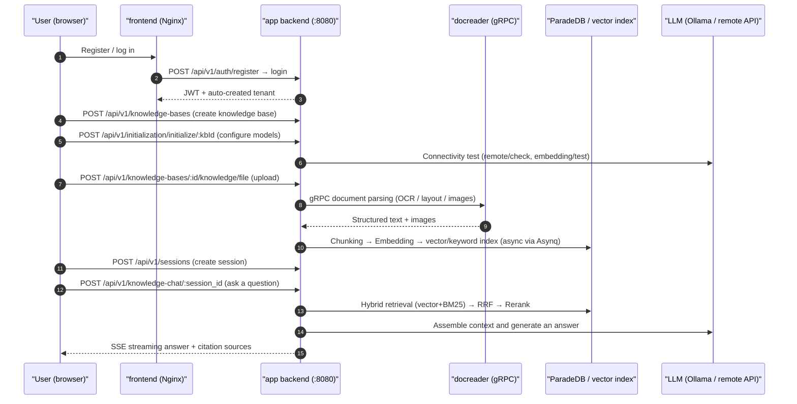

# Quick Start

Follow this guide through and you'll end up with a knowledge base that can answer questions about your own documents: sign up → create a knowledge base and pick a model → upload documents → ask a question and see an answer with citations. Everything happens in the web UI; if things go smoothly it takes about ten to fifteen minutes, most of which is spent waiting for document parsing.

If you want to integrate via the API, jump to section 7 of this document — there's a copy-paste-ready curl walkthrough there.

## 1. Before you start

- The service is already running: after starting it following [Installation & Deployment](./02-installation.md), the frontend is at `http://localhost` and the backend at `http://localhost:8080`;
- You have a usable model available: either a local Ollama (default address inside the container is `http://host.docker.internal:11434`), or any OpenAI-compatible service with a `base_url` + `api_key`. You need at least one chat model and one embedding model;
- Confirm the backend is alive: `curl http://localhost:8080/health` returns `{"status":"ok"}`.

## 2. Sign up and log in

On your first visit you'll land on the login page; registration is a tab on the same page — it only appears when the registration mode is `self_serve` (the frontend reads `/auth/config` to decide). The system has no built-in default account; after registering you automatically get your own workspace, in which you are the Owner.

<Screenshot
  src="/screenshots/quickstart-register.png"
  caption="The registration page on first visit"
  hint="Show the registration form (username / email / password) along with the login link." />

A few things worth knowing upfront:

- Usernames are 2–50 characters; on the registration page passwords must be 8–32 characters and contain both letters and digits (if you call `POST /auth/register` directly, the backend only enforces ≥6 characters, but it's still recommended to use 8+ characters);
- For team deployments, once the first account has registered you can disable public registration and add people afterward via invite links. There are two ways to disable it: set `DISABLE_REGISTRATION=true` (forces the registration mode to `invite_only` at startup), or, once logged in, change `auth.registration_mode` to `invite_only` under "Settings → System" (takes effect immediately, no restart needed);
- If the deployment has the default workspace policy set to `tenantless` (`auth.default_tenant_mode`), a workspace is **not** automatically created after registration — instead you're guided to `/onboarding/workspace`, where you must create your own workspace or accept an invitation to join one before continuing;
- The desktop / Lite edition requires no registration — a local account is created automatically on startup.

::: tip Workspace Owner ≠ System Admin
These are two different dimensions of identity that are easy to confuse:

- **Workspace Owner**: the highest level of privilege within a single workspace, managing that workspace's members, models, and knowledge bases. Registering automatically grants you ownership of your own workspace, so everyone is the Owner of their own workspace.
- **System Admin**: a platform-level identity that manages the entire deployment — global system settings, the task queue, platform API keys, cross-workspace audit logs, resetting user passwords. It doesn't belong to any workspace, and you don't automatically get it just because you're the Owner of some workspace.

A fresh deployment has **no system admin at all** — the first one must be explicitly designated. To do so: register an account normally, then set `WEKNORA_BOOTSTRAP_SYSTEM_ADMIN_EMAIL=<that account's email>` on the app service and restart it — on startup, if it detects that the current deployment has zero system admins, it promotes the user matching that email to system admin. Once a system admin already exists, this variable no longer takes effect (this avoids privileges that were just revoked in the UI being quietly restored on the next restart); if the user hasn't registered yet, it just logs a WARN and retries on the next restart. After that, adding more admins can be done directly in the UI. See [Tenants, Users & Auth](../03-features/01-tenant-auth.md) for details.
:::

## 3. Create a knowledge base and configure a model

After logging in, create a new knowledge base. WeKnora's model configuration is **per knowledge base**: after creating one, the frontend walks you through picking models for that specific base — there's no global one-time initialization.

1. On the "Knowledge Bases" page, click New, enter a name, and choose a type: `document` (regular document base) or `faq` (Q&A pair base);
2. In the initialization wizard that pops up, pick your models:
   - **Chat model (LLM)**: used to generate answers;
   - **Embedding model**: used to convert documents into vectors — **don't change this after creating the base**; changing it requires rebuilding the index;
   - Everything else (Rerank, VLM for image understanding, ASR for speech transcription, knowledge graph extraction, question pre-generation) can be left off for now and added at any time later;
3. Use the "Test" button in the wizard to confirm the model connection works, then save.

<Screenshot
  src="/screenshots/quickstart-init-wizard.png"
  caption="Initialization wizard: choosing a chat model and an embedding model for the knowledge base"
  hint="Show the model source (Ollama / remote API), model name, Base URL input field, and a message confirming the connectivity test passed." />

::: tip The most common pitfall with local Ollama
The backend runs inside a container, so entering `http://localhost:11434` won't reach Ollama on the host machine — you need `http://host.docker.internal:11434`.
:::

## 4. Upload documents

Enter the knowledge base and drag files into the upload area, or paste a web page URL. In the upload confirmation dialog you can conveniently set tags and parsing options for this batch of files.

Supported formats include PDF, Word, Excel, PPT, Markdown, HTML, EPUB, images, audio, and more — see [Document Parsing Service](../03-features/03-document-parsing.md) for the full list.

<Screenshot
  src="/screenshots/quickstart-upload.png"
  caption="Upload confirmation dialog: selecting files, adding tags, adjusting parsing options"
  hint="Show the list of files pending upload, tag selection, and parsing engine options." />

After uploading, documents are parsed asynchronously, moving through the states `pending → processing → finalizing → completed`. Scanned PDFs and large files take longer; the list page refreshes progress in real time.

<Screenshot
  src="/screenshots/quickstart-document-list.png"
  caption="Document list: three documents finished parsing"
  hint="Show columns for document name, type, parsing status as “Completed”, chunk count, etc." />

## 5. Ask a question

Go to the chat page, select the knowledge base you just created, and ask a question directly. The built-in "Quick Q&A" Agent is used by default: it retrieves relevant chunks → hands them to the LLM to answer → the answer includes citations, and clicking a citation jumps back to the source text.

<Screenshot
  src="/screenshots/quickstart-chat.png"
  caption="Knowledge Q&A: an answer with clickable citation sources"
  hint="Show one round of Q&A, with citation markers in the answer body and the expanded citation source panel." />

At this point, the minimal end-to-end flow is working.

## 6. Going further

- **Switch to a reasoning Agent**: switch to the built-in "Smart Reasoning" Agent at the top of the chat box — it decides on its own how many retrieval rounds to run, whether to search the web, and whether to call tools, which suits questions that need multi-step reasoning. You can also build a custom Agent on the "Agents" page, hooking up MCP tools and web search — see [Agent Engine](../03-features/07-agent.md);
- **Improve answer accuracy**: turn on Rerank, adjust chunk size — see [Chunking](../03-features/04-chunking.md) and [Retrieval Engines](../03-features/05-retrieval-engines.md);
- **Bring knowledge in automatically**: sync from Feishu / Notion / Yuque / RSS automatically — see [Data Source Import](../03-features/10-datasource.md);
- **Let others ask questions too**: connect to WeCom / Feishu or other IMs, or embed the Agent as a widget on your own website — see [IM Integration](../03-features/12-im-integration.md) and [Web Embed](../03-features/13-embed-channel.md).

## 7. Walking through the same flow via the API

Every step above has a corresponding API endpoint, all sharing the prefix `/api/v1`. The snippet below can be run as-is:

```bash
BASE=http://localhost:8080/api/v1

# 1) Register (for the first deployment; username>=2 chars, password>=6 chars)
curl -s -X POST $BASE/auth/register -H "Content-Type: application/json" \
  -d '{"username":"admin","email":"admin@example.com","password":"pass123456"}'

# 2) Log in and get the JWT
TOKEN=$(curl -s -X POST $BASE/auth/login -H "Content-Type: application/json" \
  -d '{"email":"admin@example.com","password":"pass123456"}' | jq -r '.token')
AUTH="Authorization: Bearer $TOKEN"

# 3) Create a knowledge base
KB_ID=$(curl -s -X POST $BASE/knowledge-bases -H "$AUTH" -H "Content-Type: application/json" \
  -d '{"name":"My knowledge base","description":"demo","type":"document"}' | jq -r '.data.id')

# 4) Initialize the knowledge base (using local Ollama as an example; change source/baseUrl/apiKey for a remote model)
curl -s -X POST $BASE/initialization/initialize/$KB_ID -H "$AUTH" -H "Content-Type: application/json" -d '{
  "llm":       {"source":"local","modelName":"qwen3:8b"},
  "embedding": {"source":"local","modelName":"bge-m3","dimension":1024},
  "rerank":    {"enabled":false},
  "multimodal":{"enabled":false},
  "documentSplitting":{"chunkSize":512,"chunkOverlap":50,"separators":["\n\n","\n","。"]},
  "nodeExtract":{"enabled":false},
  "questionGeneration":{"enabled":false}}'

# 5) Upload a document (multipart, field name "file")
curl -s -X POST $BASE/knowledge-bases/$KB_ID/knowledge/file -H "$AUTH" \
  -F "file=@./demo.pdf"
# Poll parsing status: GET /knowledge-bases/$KB_ID/knowledge until parse_status=completed

# 6) Create a session
SESSION_ID=$(curl -s -X POST $BASE/sessions -H "$AUTH" -H "Content-Type: application/json" \
  -d '{"title":"First conversation"}' | jq -r '.data.id')

# 7) Knowledge Q&A (SSE streaming output)
curl -N -X POST $BASE/knowledge-chat/$SESSION_ID -H "$AUTH" -H "Content-Type: application/json" \
  -d '{"query":"What does this document cover?","knowledge_base_ids":["'$KB_ID'"]}'

# 7b) Agent chat (also SSE; agent_id can be the built-in builtin-smart-reasoning)
curl -N -X POST $BASE/agent-chat/$SESSION_ID -H "$AUTH" -H "Content-Type: application/json" \
  -d '{"query":"Summarize the document's key points and list the evidence","agent_enabled":true,"agent_id":"builtin-smart-reasoning","knowledge_base_ids":["'$KB_ID'"]}'

# 8) Retrieval only, no generation (structured JSON result)
curl -s -X POST $BASE/knowledge-search -H "$AUTH" -H "Content-Type: application/json" \
  -d '{"query":"keyword","knowledge_base_ids":["'$KB_ID'"]}'
```

The chat request body also supports fields like `knowledge_ids` (restrict to a single document), `web_search_enabled`, `summary_model_id`, `mcp_service_ids`, `skill_names`, and `images` / `attachment_uploads` (multimodal attachments) — see [API Reference: Sessions & Chat](../04-api/02-api-chat.md) for the full details.

### Three authentication methods

| Method | Request header | Use case |
| --- | --- | --- |
| JWT | `Authorization: Bearer <token>` | Browser / interactive calls, issued by the login endpoint |
| API Key | `X-API-Key: <key>` | Server-side integration; created in "Workspace Settings" or via `POST /api/v1/tenants/:id/api-keys`, supports fine-grained capabilities (`retrieve`/`chat`/`ingest`/`manage_kbs`, etc.) |
| Specify workspace | `X-Tenant-ID: <id>` | For multi-workspace users to switch their current active workspace |

For server-side integration, an API Key is recommended over a JWT:

```bash
# Create an API Key as the Owner (TENANT_ID comes from the login response)
curl -s -X POST $BASE/tenants/$TENANT_ID/api-keys -H "$AUTH" -H "Content-Type: application/json" \
  -d '{"name":"ci-bot","full_access":true}'
# All subsequent requests then use:
curl -s $BASE/knowledge-bases -H "X-API-Key: <key returned at creation time>"
```

### Endpoints corresponding to the initialization wizard

Every step of the on-screen wizard has its own dedicated endpoint, which you can reuse directly if you're building your own admin console:

| Step | Endpoint | Description |
| --- | --- | --- |
| Read current config | `GET /api/v1/initialization/config/:kbId` | Returns the llm / embedding / rerank / multimodal / documentSplitting / nodeExtract / questionGeneration sections plus `hasFiles` (restricts embedding changes once files already exist) |
| Detect Ollama | `GET /api/v1/initialization/ollama/status`, `GET /api/v1/initialization/ollama/models` | Checks Ollama availability and already-installed models |
| Download an Ollama model | `POST /api/v1/initialization/ollama/models/download` → `GET /api/v1/initialization/ollama/download/progress/:taskId` | Asynchronous download with progress polling |
| Test a remote model | `POST /api/v1/initialization/remote/check`, `/initialization/embedding/test`, `/initialization/rerank/check`, `/initialization/asr/check`, `/initialization/multimodal/test` | Connectivity verification before saving |
| Trial knowledge graph extraction | `POST /api/v1/initialization/extract/text-relation` (paired with `fabri-text` / `fabri-tag` to generate an example) | Preview entity/relation extraction results |
| Save config | `POST /api/v1/initialization/initialize/:kbId` (first time) / `PUT /api/v1/initialization/config/:kbId` (update) | Persists the config: creates/updates Model records and writes the KnowledgeBase configuration |

`source` can be `local` (Ollama) or a remote vendor identifier (`openai`, `deepseek`, `aliyun`, `zhipu`, `siliconflow`, etc.). Valid range for `chunkSize` is 100–10000.

### What happens across the whole flow



## 8. Stuck? Check here

| Symptom | What to check |
| --- | --- |
| Stuck on `processing` after upload | `docker logs WeKnora-docreader`; large files are bound by `MAX_FILE_SIZE_MB` (default 50) and `WEKNORA_DOCUMENT_PROCESS_TIMEOUT` (default 2h) |
| Ollama detection fails during initialization | The default address inside the container is `http://host.docker.internal:11434` (`OLLAMA_BASE_URL`); on Linux make sure `extra_hosts: host.docker.internal:host-gateway` is in effect |
| No citations in answers / empty retrieval | Confirm document parsing is `completed`; lower `vector_threshold`; check that the embedding model matches the one used when the base was created |
| Registration tab missing | Check `registration_mode` from `GET /auth/config`. Its value may come from a database setting under "Settings → System", not just `DISABLE_REGISTRATION`; invite links and OIDC first-time login are two other paths that aren't affected by it |
| API Key request returns 403 | The key's capabilities don't include what's needed, or `knowledge_base_ids` whitelist doesn't include the target knowledge base |

Next steps: for detailed configuration options see [Configuration Reference](./04-configuration.md); to understand how the system works overall see [Architecture Overview](../02-architecture/01-overview.md).
