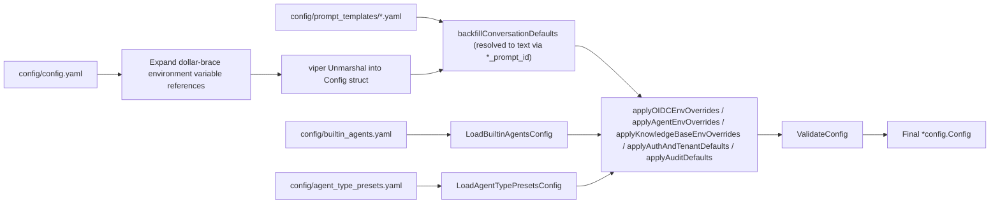

# Configuration Explained

WeKnora's configuration consists of four layers, **from lowest to highest priority**:

| Layer | Location | When to use |
| --- | --- | --- |
| Main configuration file | `config/config.yaml` | Structured default values, distributed with the image |
| Templates / presets | `config/prompt_templates/*.yaml`, `builtin_agents.yaml`, `agent_type_presets.yaml`, `builtin_models.yaml` | Prompts, built-in Agents, built-in models |
| Environment variables | `.env` / container environment | Deployment-level overrides, requires restart after changes |
| Runtime system settings | Database `system_settings` table, UI at "Settings → System" | Some switches can be changed online, **overriding environment variables**, and most take effect immediately |

The last layer is easily overlooked, yet it's the first thing to check when troubleshooting "I changed the env but it didn't take effect": once keys like registration mode, space policies and quotas, the SSRF whitelist, worker pool concurrency, or model concurrency limits have been changed via the UI, a record is left in the database, and environment variables no longer take effect for that key afterward. Resetting the item (`DELETE /api/v1/system/admin/settings/:key`) is required to fall back to the environment variable or built-in default value. For the complete key table and semantics, see the "Runtime-modifiable system settings" section of [Tenants, Users, and Authentication & Authorization](../03-features/01-tenant-auth.md).

The sections below walk through the structs in `internal/config/config.go` one by one, with environment variables summarized at the end.

## Configuration Loading Mechanism

The `LoadConfig()` flow in `internal/config/config.go`:

1. viper searches for `config.yaml` in order: current directory → `./config` → `$HOME/.appname` → `/etc/appname/`;
2. **Environment variable expansion**: a regex substitution is applied to the file content, replacing `${ENV_VAR}` with the value of the environment variable of the same name; if the variable is not set, the literal `${ENV_VAR}` is kept as-is (to make configuration errors visible);
3. viper enables `AutomaticEnv()`, and the key separator `.` maps to `_` (i.e., `server.port` can be overridden by the environment variable `SERVER_PORT`);
4. Prompt templates are loaded from `config/prompt_templates/*.yaml` and **backfilled** into the conversation configuration according to the `xxx_prompt_id` fields (`backfillConversationDefaults`);
5. `builtin_agents.yaml` (built-in Agents) and `agent_type_presets.yaml` (Agent type presets) are loaded, and the `system_prompt_id` references within them are resolved;
6. Environment variable overrides are applied (for the OIDC, Agent, KnowledgeBase, Auth/Tenant, and Audit groups) and `ValidateConfig` validation is executed.



## config/config.yaml Section by Section

### server (`ServerConfig`)

| Name | Type | Default | Description |
| --- | --- | --- | --- |
| `server.port` | int | 8080 | HTTP listening port, validated range 1–65535 |
| `server.host` | string | "0.0.0.0" | Listening address |
| `server.log_path` | string | empty | Log file path (can also use environment variable `LOG_PATH`) |
| `server.shutdown_timeout` | duration | 30s | Graceful shutdown timeout |

### conversation (`ConversationConfig`) — Retrieval Q&A Pipeline

| Name | Type | Default (config.yaml) | Description |
| --- | --- | --- | --- |
| `max_rounds` | int | 5 | Number of multi-turn history rounds carried |
| `keyword_threshold` | float | 0.3 | Minimum score for keyword retrieval |
| `embedding_top_k` | int | 30 | Number of results recalled by vector retrieval (>=0) |
| `vector_threshold` | float | 0.2 | Vector similarity threshold (0–1) |
| `rerank_top_k` | int | 30 | Number of results kept after reranking |
| `rerank_threshold` | float | 0.3 | Minimum rerank score (-10–10) |
| `fallback_strategy` | string | "model" | Strategy when recall is empty: `model` (let the model handle it as a fallback) or a fixed reply |
| `fallback_response` | string | "Sorry, I am unable to answer this question." | Fixed fallback text |
| `enable_rewrite` | bool | true | Multi-turn coreference resolution / query rewriting |
| `enable_query_expansion` | bool | true | Query expansion |
| `enable_rerank` | bool | true | Enable reranking |
| `fallback_prompt_id` | string | "default_fallback_prompt" | Fallback prompt template ID (`prompt_templates/fallback.yaml`, mode:"model") |
| `rewrite_prompt_id` | string | "default_rewrite" | Rewrite template ID (includes system-side content + user-side user) |
| `generate_summary_prompt_id` | string | "default_summary" | Document summary template ID |
| `generate_session_title_prompt_id` | string | "default_session_title" | Session title generation template ID |
| `extract_entities_prompt_id` / `extract_relationships_prompt_id` | string | "default_extract_entities" / "default_extract_relationships" | Graph extraction template ID (`graph_extraction.yaml`) |
| `generate_questions_prompt_id` | string | "default_generate_questions" | Pre-generated question template ID |

`conversation.summary` (`SummaryConfig`, answer generation parameters):

| Name | Type | Default | Description |
| --- | --- | --- | --- |
| `max_input_chars` | int | 16384 | Maximum number of characters fed into the LLM |
| `temperature` | float | 0.3 | Generation temperature |
| `repeat_penalty` | float | 1.0 | Repetition penalty |
| `max_completion_tokens` | int | 2048 | Maximum number of generated tokens |
| `no_match_prefix` | string | `<think>\n</think>\nNO_MATCH` | When the model output starts with this prefix, it's judged as a "miss" and triggers fallback |
| `prompt_id` | string | "default_kb" | System prompt template ID (`system_prompt.yaml`) |
| `context_template_id` | string | "default_context" | Context assembly template ID (`context_template.yaml`) |
| `max_tokens` / `top_k` / `top_p` / `frequency_penalty` / `presence_penalty` / `seed` / `thinking` | various | unset | Optional sampling parameters passed through to the model; `thinking` is a `*bool` controlling thinking mode |

### knowledge_base (`KnowledgeBaseConfig`) — Global Default Chunking

| Name | Type | Default | Description |
| --- | --- | --- | --- |
| `chunk_size` | int | 512 | Default chunk size (>0, and > overlap) |
| `chunk_overlap` | int | 50 | Chunk overlap |
| `split_markers` | []string | `["\n\n", "\n", "。"]` | Split markers |
| `keep_separator` | bool | false | Keep separator |
| `document_process_timeout` | duration | 2h | Total timeout for a single document processing task (overridable via env `WEKNORA_DOCUMENT_PROCESS_TIMEOUT`) |
| `docreader_call_timeout` | duration | 30m | Timeout for a single DocReader RPC call (env `WEKNORA_DOCREADER_CALL_TIMEOUT`), must be less than the item above |
| `image_processing.enable_multimodal` | bool | true | Enable multimodal image processing (OCR/Caption) on upload |

> Each knowledge base's `ChunkingConfig` overrides the global defaults here.

### extract (`ExtractManagerConfig`) — Knowledge Graph Extraction Templates

`extract.extract_graph` / `extract.extract_entity` / `extract.fabri_text` define the descriptive text (`description`) for graph extraction, the allowed relationship labels (`tags`, default `Author`, `Alias`), and few-shot examples (`examples`: `text` + `node` + `relation`). The "trial extraction / generate example text" feature in the initialization wizard uses this configuration (`%s` in `fabri_text.with_tag` / `with_no_tag` is replaced by the tag list).

### tenant (`TenantConfig`)

| Name | Type | Default | Description |
| --- | --- | --- | --- |
| `enable_cross_tenant_access` | bool | false | Allow users with `CanAccessAllTenants` to access across spaces (can be enabled on an internal network) |
| `enable_rbac` | *bool | true | Enforce space role-based authorization; explicitly setting `false` enters a gray-scale mode that only logs without blocking (env `WEKNORA_TENANT_ENABLE_RBAC`) |
| `max_owned_per_user` | int | 0 (falls back to handler default) | Maximum number of spaces a single non-admin user can create; <0 disables the limit (env `WEKNORA_TENANT_MAX_OWNED_PER_USER`) |
| `self_service_creation_enabled` | *bool | true | Whether regular users can create their own spaces (env `WEKNORA_TENANT_SELF_SERVICE_CREATION_ENABLED`) |
| `default_session_name` / `default_session_title` / `default_session_description` | string | empty | Default text for new sessions |

### Sections Supported by the Struct but Not Written to the Default File

The following sections exist in the `Config` struct and can be appended to `config.yaml` as needed (most also have an environment variable entry point):

| Section | Struct | Key fields and defaults |
| --- | --- | --- |
| `auth` | `AuthConfig` | `registration_mode`: `self_serve` (default) / `invite_only` (forced when `DISABLE_REGISTRATION=true`); `default_tenant_mode`: `create_personal` (default) / `tenantless` |
| `audit` | `AuditConfig` | `retention_days`: audit log retention in days, defaults to 90 when the section is omitted; 0 disables cleanup; <0 fails validation (env `WEKNORA_AUDIT_RETENTION_DAYS`) |
| `oidc_auth` | `OIDCAuthConfig` | `enable`, `issuer_url`, `discovery_url` (if omitted, built from issuer by appending `/.well-known/openid-configuration`), `client_id`, `client_secret`, `authorization_endpoint`, `token_endpoint`, `user_info_endpoint`, `scopes` (default `openid profile email`), `user_info_mapping.username` (default `name`) / `email` (default `email`); all can be overridden with `OIDC_AUTH_*` environment variables |
| `agent` | `AgentConfig` | `llm_call_timeout`: single LLM call timeout in seconds (default 120, env `WEKNORA_AGENT_LLM_TIMEOUT`); `tool_approval_timeout_seconds`: MCP tool manual approval wait time (default 600, env `WEKNORA_AGENT_TOOL_APPROVAL_TIMEOUT`) |
| `im` | `IMConfig` | IM channel Q&A concurrency: `workers` (5), `global_max_workers` (0=unlimited, requires Redis), `max_queue_size` (50), `max_per_user` (3), `rate_limit_window` (60s), `rate_limit_max` (10) |
| `docreader` | `DocReaderConfig` | `addr` (gRPC address such as `docreader:50051` or an HTTP base URL), `transport`: `grpc` (default) / `http`; typically set via env `DOCREADER_ADDR` / `DOCREADER_TRANSPORT` |
| `vector_database` | `VectorDatabaseConfig` | `driver` (typically set via env `RETRIEVE_DRIVER`) |
| `stream_manager` | `StreamManagerConfig` | `type`: `memory` / `redis`; `redis.address/username/password/db/prefix/ttl`; `cleanup_timeout` (typically set via env `STREAM_MANAGER_TYPE`, `REDIS_*`) |
| `web_search` | `WebSearchConfig` | `timeout`: web search timeout in seconds |
| `models` | `[]ModelConfig` | Legacy static model list (`type`/`source`/`model_name`/`parameters`); now recommended to use `builtin_models.yaml` or UI configuration instead |
| `frontend_base_url` | string | empty | The SPA's external origin, used to generate absolute links such as invitations (env `FRONTEND_BASE_URL`) |

## Important Environment Variables

The following variables come from the app/docreader `environment` section of `docker-compose.yml`, `.env.example`, and `os.Getenv` calls in the code. At minimum, production deployments must change: `DB_USER/DB_PASSWORD/DB_NAME`, `REDIS_PASSWORD`, `JWT_SECRET`, `SYSTEM_AES_KEY`.

### Runtime Basics

| Name | Default | Description |
| --- | --- | --- |
| `GIN_MODE` | release | `debug` for development mode (enables Swagger) / `release` for production |
| `LOG_LEVEL` / `LOG_PATH` / `LOG_FORMAT` | debug / empty / empty | Log level, file path (stdout only if empty), custom format |
| `LLM_DEBUG_LOG` | false | If true, writes `llm_debug.log` in the same directory as LOG_PATH |
| `TZ` | Asia/Shanghai | Time zone |
| `WEKNORA_LANGUAGE` | empty | Document processing language (question/summary generation). Priority: this variable > the request's `Accept-Language` > built-in `zh-CN`. **It overrides the request header** intentionally: UI language and document processing language are two different things, allowing "English UI + processing Korean documents" |
| `AUTO_MIGRATE` | true | Automatically run database migrations on startup |
| `AUTO_RECOVER_DIRTY` | true | Automatically repair golang-migrate's dirty state (left behind by an interrupted previous migration). Should be temporarily set to false when manually troubleshooting migration issues, otherwise startup will automatically rewrite the migration version record — see [Database and Migrations](../06-development/02-database-schema.md) |
| `WEKNORA_TRUSTED_PROXIES` | empty | gin trusted proxy CIDRs (comma-separated) |
| `MAX_FILE_SIZE_MB` | 50 | Upload file size limit (shared across app/frontend/docreader) |
| `CONCURRENCY_POOL_SIZE` | 5 | General-purpose concurrency pool |
| `APP_EXTERNAL_URL` / `FRONTEND_BASE_URL` | empty | Externally reachable URL for IM channel image/file links / external origin of the frontend |
| `RESOURCE_URL_MODE` | handle | Default form of file references in API responses: `handle` returns an internal `resource://`, `public` returns a directly loadable, time-limited external link. Can be overridden per-request with `?resource_urls=`; see [API Overview](../04-api/01-api-overview.md) for details |

`APP_EXTERNAL_URL` affects whether IM channels can render knowledge base images. IM platforms need a publicly reachable http(s) URL — there are two options:

1. The storage backend itself is publicly reachable (use a public endpoint for object storage, or set `MINIO_ENDPOINT` to a public host); in this case `resource://` falls back to the backend's presigned URL, and this variable is not needed;
2. Set `APP_EXTERNAL_URL`, and `resource://` images will be rewritten to `<APP_EXTERNAL_URL>/r/<token>`, routed through WeKnora itself (requires nginx to proxy `/r/`, which is already built into the official frontend image).

The default MinIO intranet deployment and the `local` backend can only use the second option. If IM channels are enabled but this variable is empty, the service will print a WARN once on startup; if the rewritten result isn't an http(s) URL, the original reference is kept and an actionable warning is logged, instead of emitting a link the IM side can't access.

See [External Access to Images and Files](../03-features/21-file-access.md) for the four URL forms and how each channel obtains them.

### Database and Queue

| Name | Default | Description |
| --- | --- | --- |
| `DB_DRIVER` | postgres | `postgres` / `sqlite` (Lite) |
| `DB_HOST` / `DB_PORT` / `DB_USER` / `DB_PASSWORD` / `DB_NAME` | postgres / 5432 / empty / empty / empty | PostgreSQL connection (required) |
| `DB_PATH` | — | Database file path when `DB_DRIVER=sqlite` |
| `STREAM_MANAGER_TYPE` | empty (compose actually uses redis) | `redis` / `memory` |
| `REDIS_ADDR` / `REDIS_USERNAME` / `REDIS_PASSWORD` / `REDIS_DB` / `REDIS_PREFIX` | redis:6379 / … | Redis connection |
| `REDIS_USE_TLS` | false | **Master switch for enabling TLS**, needed for managed Redis (e.g. AWS ElastiCache); `REDIS_TLS_SERVER_NAME` specifies the server name used for validation and SNI (useful when the address is an IP), `REDIS_TLS_INSECURE_SKIP_VERIFY` skips certificate validation (insecure, only for self-signed dev environments) |
| `WEKNORA_REDIS_NAMESPACE` | empty | Channel naming namespace suffix when multiple deployments share a Redis instance |
| `WEKNORA_ASYNQ_CORE_CONCURRENCY` etc. | 8 / 2 / 12 / 4 / 6 | Asynq per-queue concurrency (core/postprocess/enrichment/maintenance/shared), plus `WEKNORA_WIKI_ASYNQ_CONCURRENCY=8`, `WEKNORA_MODEL_MAX_CONCURRENCY=32` |

### Retrieval Engine and Vector Database

| Name | Default | Description |
| --- | --- | --- |
| `RETRIEVE_DRIVER` | postgres | Retrieval engine: `postgres` / `elasticsearch_v7` / `elasticsearch_v8` / `qdrant` / `milvus` / `weaviate` / `opensearch` / `doris` / `tencent_vectordb` / `sqlite` (Lite); multiple engines can run in parallel, comma-separated |
| `ELASTICSEARCH_ADDR/USERNAME/PASSWORD/INDEX` | empty | Elasticsearch |
| `QDRANT_HOST/PORT/COLLECTION/API_KEY/USE_TLS` | qdrant / 6334 / weknora_embeddings / empty / false | Qdrant |
| `MILVUS_ADDRESS/COLLECTION/METRIC_TYPE/...` | milvus:19530 / weknora_embeddings / IP | Milvus |
| `OPENSEARCH_ADDR/USERNAME/PASSWORD/INDEX/INSECURE_SKIP_VERIFY` | empty | OpenSearch |
| `WEAVIATE_HOST/GRPC_ADDRESS/SCHEME/AUTH_ENABLED/API_KEY` | empty | Weaviate |
| `DORIS_ADDR/HTTP_PORT/DATABASE/USERNAME/PASSWORD/TABLE_PREFIX/COMPAT_MODE` | empty | Apache Doris 4.1+ |
| `TENCENT_VECTORDB_ADDR/USERNAME/API_KEY/DATABASE/COLLECTION/REPLICA_NUMBER` | empty | Tencent Cloud VectorDB |
| `MULTI_STORE_RETRIEVE_TIMEOUT_SEC` | empty | Timeout for parallel multi-engine retrieval |
| `NEO4J_ENABLE` / `NEO4J_URI` / `NEO4J_USERNAME` / `NEO4J_PASSWORD` | empty / bolt://neo4j:7687 / neo4j / password | Sole switch for the knowledge graph (`ENABLE_GRAPH_RAG` deprecated since v0.1.6) |

### File Storage

| Name | Default | Description |
| --- | --- | --- |
| `STORAGE_TYPE` | local | `local` / `minio` / `cos` / `tos` / `s3` / `obs` / `oss` |
| `STORAGE_ALLOW_LIST` | empty | Whitelist of storage types users may select (comma-separated) |
| `LOCAL_STORAGE_BASE_DIR` | /data/files | Local storage root directory |
| `MINIO_ENDPOINT/ACCESS_KEY_ID/SECRET_ACCESS_KEY/BUCKET_NAME/USE_SSL` | minio:9000 / minioadmin / minioadmin / empty / false | MinIO |
| `COS_SECRET_ID/SECRET_KEY/REGION/BUCKET_NAME/APP_ID/PATH_PREFIX` | empty | Tencent Cloud COS (also has TEMP_BUCKET/TEMP_REGION) |
| `S3_*` / `OBS_*` / `OSS_*` / `TOS_*` | see `.env.example` section B4 | AWS S3 / Huawei OBS / Alibaba OSS / Volcano Engine TOS, each including ENDPOINT/REGION/KEY/BUCKET/PATH_PREFIX etc. |

AWS S3's `S3_ACCESS_KEY` / `S3_SECRET_KEY` can **both be left empty**, in which case the AWS SDK default credential chain is used, supporting EC2/ECS/EKS IAM Roles, IRSA/Web Identity, environment variables, and shared config files — when deploying on AWS, there's no need to stuff long-lived keys into environment variables. The two must be either both set or both empty. If `S3_ENDPOINT` is left empty, the standard endpoint for the Region is used.

### Models and Inference

| Name | Default | Description |
| --- | --- | --- |
| `OLLAMA_BASE_URL` | http://host.docker.internal:11434 | Ollama address |
| `OLLAMA_OPTIONAL` | true | If Ollama is unavailable, only warn without blocking startup |
| `BATCH_EMBED_SIZE` | empty | Batch embedding size |
| `VLM_HTTP_TIMEOUT_SECONDS` | 180 | Timeout for a single VLM request |
| `BUILTIN_MODELS_CONFIG` | config/builtin_models.yaml | Path to the built-in model declaration file (see below) |
| `WEKNORA_LLM_STREAM_RAW_DUMP` / `_DIR` | empty | LLM stream raw dump (for troubleshooting) |

### Authentication, Tenancy, and Security

| Name | Default | Description |
| --- | --- | --- |
| `JWT_SECRET` | empty | JWT signing secret (required) |
| `SYSTEM_AES_KEY` | empty | AES-256 master key for encrypting sensitive fields at rest, **must be 32 bytes**; if lost, already-encrypted data (tenant API keys, model keys, vector database credentials, etc.) cannot be recovered. Replaces `TENANT_AES_KEY`/`CRYPTO_MASTER_KEY`/`CRYPTO_SALT` as of v0.4.0 |
| `DISABLE_REGISTRATION` | false | If true, forces `registration_mode=invite_only` |
| `WEKNORA_AUTH_DEFAULT_TENANT_MODE` | create_personal | Space creation policy after registration (`create_personal` / `tenantless`) |
| `WEKNORA_TENANT_ENABLE_RBAC` | (default true) | Space role-based authorization enforcement switch |
| `WEKNORA_TENANT_ENABLE_CROSS_TENANT_ACCESS` | false | Cross-space access |
| `WEKNORA_TENANT_SELF_SERVICE_CREATION_ENABLED` | true | Regular users creating their own spaces |
| `WEKNORA_TENANT_MAX_OWNED_PER_USER` | empty | Maximum number of self-created spaces |
| `WEKNORA_TENANT_AUTO_CREATE_API_KEY` | false | Automatically issue a full_access API Key when creating a space (compatibility with old behavior) |
| `WEKNORA_TENANT_DEFAULT_STORAGE_QUOTA_GB` | 10 | Default storage quota for new spaces |
| `WEKNORA_INVITATION_TTL` | 168h | Invitation link validity period |
| `WEKNORA_AUDIT_RETENTION_DAYS` | 90 | Audit log retention in days |
| `WEKNORA_BOOTSTRAP_SYSTEM_ADMIN_EMAIL` | empty | Bootstraps the first system administrator. **Does not create a user**: this email must first register on its own; on next startup, if there is no system administrator yet in the deployment, it is promoted; once an admin exists, this variable no longer has any effect. See [Tenants, Users, and Authentication & Authorization](../03-features/01-tenant-auth.md) for details |
| `OIDC_AUTH_ENABLE` and `OIDC_AUTH_*` / `OIDC_USER_INFO_MAPPING_*` | false / empty | Full OIDC single sign-on configuration |
| `SSRF_WHITELIST` / `SSRF_WHITELIST_EXTRA` | empty / `searxng,qdrant,milvus,weaviate,doris-fe,doris-be` | SSRF whitelist for outbound requests (shared by app and docreader) |
| `IMAGE_HOST_KEEP_URL` | empty | Whitelist of image domains for which the original URL is preserved |

### Docreader Parsing (docreader container)

| Name | Default | Description |
| --- | --- | --- |
| `DOCREADER_ADDR` / `DOCREADER_TRANSPORT` | docreader:50051 / grpc | Address and transport the app side connects with (`grpc`/`http`) |
| `DOCREADER_GRPC_MAX_WORKERS` / `DOCREADER_GRPC_PORT` / `DOCREADER_GRPC_MAX_FILE_SIZE_MB` | 4 / 50051 / follows MAX_FILE_SIZE_MB | gRPC service parameters |
| `GRPC_TLS_ENABLED/CERT/KEY/CA/SERVER_NAME`, `GRPC_MTLS_REQUIRE_CLIENT_CERT`, `GRPC_AUTH_TOKEN` | false / empty | TLS/mTLS and token authentication for the app↔docreader link |
| `DOCREADER_PDF_RENDER_DPI` / `DOCREADER_PDF_JPEG_QUALITY` / `DOCREADER_PDF_RENDER_MAX_EDGE` | 200 / 85 / 2000 | PDF rendering |
| `DOCREADER_PDF_FORCE_SCANNED` / `DOCREADER_PDF_SCAN_IMAGE_RATIO` / `DOCREADER_PDF_SCAN_MIN_CHARS` | false / code default | Scanned document detection |
| `DOCREADER_ODL_HYBRID` / `DOCREADER_ODL_HYBRID_URL` / `DOCREADER_ODL_HYBRID_MODE` / `DOCREADER_ODL_HYBRID_FALLBACK` | off / http://odl-hybrid:5002 / auto / false | OpenDataLoader hybrid parsing |
| Remaining `DOCREADER_PDF_*` (word spacing/sidebar/hidden text/embedded images/chart regions, and 20+ others) | see comments in the docreader section of `docker-compose.yml` | Fine-tuning of PDF layout and extraction |
| `DOCREADER_EXTERNAL_HTTP_PROXY` / `_HTTPS_PROXY` | empty | Outbound fetch proxy for docreader |

### Agent, Skills, and Attachments

| Name | Default | Description |
| --- | --- | --- |
| `WEKNORA_SANDBOX_MODE` | disabled (code default; set to docker in the standard compose file) | Skills sandbox: `docker` / `local` / `disabled` |
| `WEKNORA_SANDBOX_TIMEOUT` / `WEKNORA_SANDBOX_DOCKER_IMAGE` | 60 / wechatopenai/weknora-sandbox:latest | Sandbox execution timeout and image |
| `WEKNORA_SKILLS_DIR` | empty (/app/skills/preloaded inside the image) | Custom Skills directory |
| `WEKNORA_AGENT_LLM_TIMEOUT` | 120s | Agent single LLM call timeout (Go duration or plain number of seconds) |
| `WEKNORA_AGENT_TOOL_APPROVAL_TIMEOUT` / `_FAIL_OPEN` | 600s / fail-close | MCP tool manual approval wait time and failure policy |
| `WEKNORA_CHAT_ATTACHMENT_TTL_HOURS` / `_WAIT_TIMEOUT_SEC` / `_OCR_CONCURRENCY` / `_OCR_MAX_PAGES` | 24 / 60 / 8 / 8 | Chat attachment parsing retention duration, wait timeout, and OCR concurrency/page limits |
| `WEKNORA_HOUSEKEEPING_ENABLED` | enabled | Reclaims dirty data stuck in processing state |
| `WEKNORA_DOCUMENT_PROCESS_TIMEOUT` / `WEKNORA_DOCREADER_CALL_TIMEOUT` | 2h / 30m | Document processing task and single RPC timeouts |

### Observability (Langfuse)

Setting both `LANGFUSE_PUBLIC_KEY` and `LANGFUSE_SECRET_KEY` automatically enables it; `LANGFUSE_HOST` (default `https://cloud.langfuse.com`, set to `http://langfuse-web:3000` for a self-hosted stack), `LANGFUSE_ENABLED`, `LANGFUSE_RELEASE`, `LANGFUSE_ENVIRONMENT`, `LANGFUSE_SAMPLE_RATE`, `LANGFUSE_FLUSH_AT/FLUSH_INTERVAL/QUEUE_SIZE/REQUEST_TIMEOUT/DEBUG` are tuning options; the self-hosted stack under `--profile langfuse` additionally has `LANGFUSE_SALT`, `LANGFUSE_ENCRYPTION_KEY`, `LANGFUSE_NEXTAUTH_SECRET`, `LANGFUSE_INIT_*` (automatically creates an organization/project/admin on first startup), etc. — see sections I1/I2 of `.env.example`.

### Optional Services: SearXNG and MCP Server

These two groups of variables are only needed when enabling the corresponding compose profile, independent of the main service.

**SearXNG** (self-hosted metasearch, `--profile searxng` / `full`):

| Name | Default | Description |
| --- | --- | --- |
| `SEARXNG_PORT` | 8888 | Host port |
| `SEARXNG_BIND` | 127.0.0.1 | **Listens only on localhost by default**. WeKnora's bundled configuration disables SearXNG's own rate limiting (otherwise the backend would get throttled), so it should not be exposed directly to the LAN; if you really need to open it up, explicitly change it to `0.0.0.0` and harden it yourself |
| `SEARXNG_SECRET` | empty | Used by the entrypoint script to replace the `secret_key` in `settings.yml`; must be set when exposed externally |

When self-hosting SearXNG, remember to add `127.0.0.1` to `SSRF_WHITELIST`, otherwise the backend's SSRF protection will block the local address. See [Web Search and Web Scraping](../03-features/11-web-search.md) for usage.

**MCP Server** (exposes WeKnora to MCP clients such as Claude Desktop, `--profile full`):

| Name | Default | Description |
| --- | --- | --- |
| `WEKNORA_API_KEY` | empty | The Key used by mcp-server to call the WeKnora REST API; generate it under "Settings → API Keys" |
| `MCP_SERVER_AUTH_TOKEN` | empty | **Required for HTTP/SSE transport**; the process refuses to start if missing; clients pass it as `Authorization: Bearer` |
| `WEKNORA_CHAT_TIMEOUT` | 300 | Read timeout for calls to the WeKnora REST API (seconds) |
| `WEKNORA_VERIFY_SSL` | true | Whether to validate the backend's TLS certificate; can be set to false for self-signed certificates |
| `MCP_ALLOWED_UPLOAD_DIRS` | empty | Whitelist of directories allowed for uploads (comma-separated); leaving it empty disables the file upload tool |

See [MCP Integration](../03-features/08-mcp.md) for full details.

## config/prompt_templates/: Prompt Templates

One YAML file per category of Prompt, with a unified structure of a `templates:` list; fields of an individual template (the `PromptTemplate` struct, `internal/config/config.go`):

| Field | Description |
| --- | --- |
| `id` | Unique ID, referenced by config.yaml's `*_prompt_id`, built-in Agents' `system_prompt_id`, and type presets |
| `name` / `description` | Display name and description |
| `content` | System-side prompt body (required for all templates) |
| `user` | User-side prompt (only used by system+user paired templates, such as rewrite, keywords_extraction) |
| `default` | Whether this is the default template for its category |
| `mode` | Subcategory distinction (e.g., `model` in fallback indicates a model-based fallback prompt) |
| `has_knowledge_base` / `has_web_search` | Flags marking the template's applicable scenarios |
| `i18n` | Multi-language name/description (keyed by locale, e.g. `zh-CN`) |

Purpose and included template IDs for each file:

| File | Purpose | Template IDs |
| --- | --- | --- |
| `system_prompt.yaml` | Q&A system prompt (quick-answer / RAG) | `default_kb` (default), `expert_assistant`, `customer_service`, `technical_support`, `pure_chat`, `web_search_assistant` |
| `context_template.yaml` | Template for assembling retrieval results into context | `default_context`, `detailed_context`, `simple_context`, `qa_context` |
| `rewrite.yaml` | Multi-turn query rewriting (content+user pair) | `default_rewrite`, `standard_rewrite`, `strict_rewrite` |
| `fallback.yaml` | Fallback for misses (fixed reply + `mode:"model"` model-based fallback) | `default_fallback`, `polite_fallback`, `brief_fallback`, `model_fallback`, `default_fallback_prompt` |
| `generate_session_title.yaml` | Session title generation | `default_session_title` |
| `generate_summary.yaml` | Document summary generation | `default_summary` |
| `generate_questions.yaml` | Pre-generated document questions | `default_generate_questions` |
| `keywords_extraction.yaml` | Keyword extraction | `default_keywords_extraction` |
| `graph_extraction.yaml` | Graph entity/relationship extraction | `default_extract_entities`, `default_extract_relationships` |
| `agent_system_prompt.yaml` | Agent (smart-reasoning) system prompt | `pure_agent`, `progressive_rag_agent`, `data_analyst`, `wiki_researcher`, `wiki_fixer`, `hybrid_rag_wiki_agent` |
| `intent_prompts.yaml` | Intent-specific system prompts for intent routing (template ID = intent value) | `greeting`, `chitchat`, `follow_up`, `image_only`, `summarize`, `web_search`, `doc_only` |

**Customization points**: edit the template `content` directly, or add a new template entry and change the corresponding `*_prompt_id` in config.yaml to the new ID; restarting (compose already mounts `./config/config.yaml`, and the template directory travels with the image/mount) applies the change. If an ID cannot be found, the startup log will print `Warning: xxx_prompt_id not found`.

## config/agent_type_presets.yaml: Agent Type Presets

Provides "one-click prefill" for custom Agents in smart-reasoning mode: each preset (`AgentTypePresetEntry`, `internal/types/agent_type_preset.go`) contains `id`, `i18n` (multi-language label/description), `config` (prefill values, zero values have no effect), and an optional `kb_filter` (capability predicate restricting selectable knowledge bases: `any_of` / `all_of` / `none_of`, capability names: `vector`, `keyword`, `wiki`, `graph`, `faq`). The frontend reads these via `GET /agents/type-presets`.

Five built-in presets:

| id | System Prompt | Tool whitelist | Notes |
| --- | --- | --- | --- |
| `rag-qa` | `progressive_rag_agent` | knowledge_search, grep_chunks, list_knowledge_chunks, get_document_info | temperature 0.7, max_iterations 30, FAQ prioritized |
| `wiki-qa` | `wiki_researcher` | wiki_search, wiki_read_page, wiki_read_source_doc, wiki_flag_issue | Requires a knowledge base with Wiki enabled |
| `hybrid-rag-wiki` | `hybrid_rag_wiki_agent` | Full set of Wiki + RAG tools | max_iterations 40, the most flexible preset |
| `data-analysis` | `data_analyst` | data_schema, data_analysis | temperature 0.3; `kb_filter: none_of: [faq]`; supports csv/xlsx |
| `custom` | none | no prefill | Fully manual configuration |

## config/builtin_agents.yaml: Built-in Agents

Defines Agents distributed with the system and visible to all tenants (`BuiltinAgentEntry`, `internal/types/builtin_agent_config.go`). Each entry contains `id`, `avatar`, `is_builtin: true`, `i18n` (names and descriptions for default/zh-CN/zh-TW/ja-JP/ko-KR), and a complete `config` (`CustomAgentConfig`). The file has five built-in Agents:

- `builtin-quick-answer`: `agent_mode: quick-answer`, references `system_prompt_id: default_kb` and `context_template_id: default_context`, with full retrieval parameters (`embedding_top_k: 10`, `vector_threshold: 0.5`, `rerank_threshold: 0.3`, FAQ direct-answer threshold 0.9, etc.);
- `builtin-smart-reasoning`: `agent_mode: smart-reasoning`, `agent_type: rag-qa`, `max_iterations: 50`;
- `builtin-data-analyst`, `builtin-wiki-researcher`, `builtin-wiki-fixer`: targeted at tabular analysis and Wiki scenarios, respectively.

The `system_prompt_id` in `config` is resolved at startup by `resolveBuiltinAgentPromptIDs` into the actual content from `agent_system_prompt.yaml`. Modify this file and restart to adjust built-in Agent behavior.

## config/builtin_models.yaml.example: Declarative Built-in Models

After copying it to `config/builtin_models.yaml` (or specifying a path via `BUILTIN_MODELS_CONFIG`), its entries are written into the `models` table **on every startup** and marked `is_builtin=true`, visible to all tenants (uncomment the `- ./config/builtin_models.yaml:/app/config/builtin_models.yaml:ro` mount line in compose). Format:

```yaml
builtin_models:
  - id: builtin-llm-default        # Stable ID, repeated startups update idempotently by ID
    type: KnowledgeQA              # KnowledgeQA | Embedding | Rerank | VLLM | ASR
    source: remote                 # remote (default) | local
    is_default: true               # Whether to set as the default model for this type
    name: ${LLM_MODEL_NAME}        # String fields all support ${ENV} references (.env injected into the container via env_file)
    parameters:
      base_url: ${LLM_BASE_URL}
      api_key: ${LLM_API_KEY}
      provider: ${LLM_PROVIDER}    # openai | generic | aliyun | moonshot | ...
      embedding_parameters:        # Embedding type only
        dimension: 1536
        truncate_prompt_tokens: 0
```

Note: unset `${ENV}` variables keep the literal text to make configuration errors visible; non-string fields (`type`, `source`, `is_default`, `dimension`, etc.) must be written as literal values; deleting an entry from the file **does not** automatically delete it from the database — manual cleanup is required.

## Configuration Priority Quick Reference

For the same semantic configuration, the effective priority is: **database `system_settings` (only keys registered in the table) > environment variables > config.yaml > built-in code defaults**; tenant/knowledge-base-level configuration (`RetrievalConfig`, `ChunkingConfig`, etc., stored in the database) overrides global defaults at runtime. After modifying `.env`, the container needs to be restarted (`docker compose up -d app`); in development mode, air hot reload does not re-read `.env`, so the dev script needs to be restarted.
