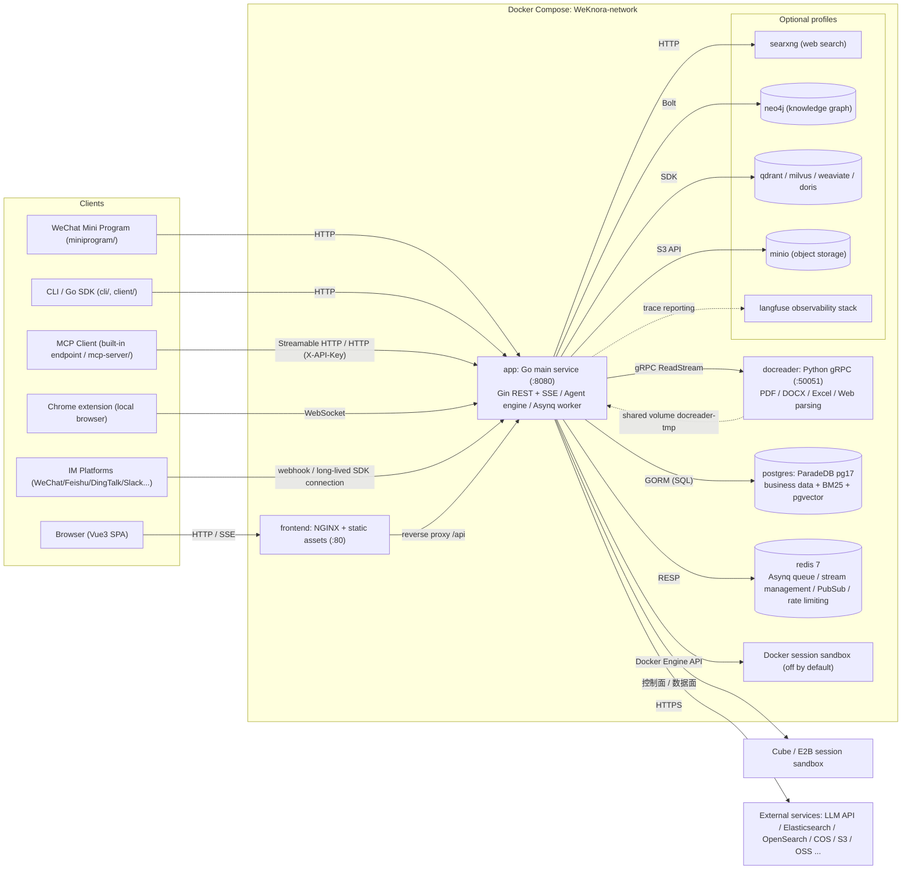
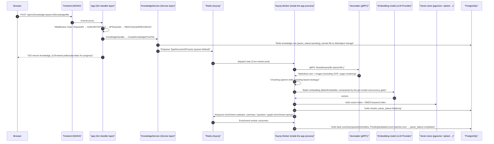

# Overall Architecture

WeKnora consists of a web frontend, a Go main service, and a Python document parsing service; it stores business data in a database and schedules async tasks through Redis. Vector storage, object storage, the knowledge graph, and model services can be configured according to deployment needs.

## System Composition {#_1-system-composition}

WeKnora follows a three-process core architecture of "main service + frontend + document parsing microservice," plus two infrastructure dependencies, PostgreSQL and Redis; the remaining components (vector store, knowledge graph, web search, etc.) are all optional and can be enabled on demand via Docker Compose profiles.

### Core Services (Started by Default) {#_1-1-core-services-started-by-default}

| Service | Image / Build | Port | Responsibility |
| --- | --- | --- | --- |
| `app` | `wechatopenai/weknora-app` (`docker/Dockerfile.app`, Go) | `8080` | Main backend: REST API, RAG retrieval, Agent engine, async task workers, IM/Embed channel integration. Health check `GET /health` |
| `frontend` | `wechatopenai/weknora-ui` (`frontend/`, NGINX + Vue3 static build) | `80` | Web UI; NGINX also acts as a reverse proxy, forwarding `/api` to `app` (`APP_HOST`/`APP_BACKEND_PORT`/`APP_SCHEME` can point to a remote backend) |
| `docreader` | `wechatopenai/weknora-docreader` (`docker/Dockerfile.docreader`, Python) | `50051` (exposed only within the compose network, not mapped to the host) | Document parsing microservice: gRPC server, parsing and page rendering for 25+ formats including PDF/DOCX/Excel/EPUB/web pages, etc. Health check via `grpc_health_probe` |
| `postgres` | `paradedb/paradedb:v0.22.6-pg17` | `5432` (network-internal) | Main database. The ParadeDB distribution comes with built-in BM25 full-text search and pgvector vector capabilities, so **the default deployment does not require a separate vector store** (`RETRIEVE_DRIVER=postgres`) |
| `redis` | `redis:7.0-alpine` (`appendonly` + `requirepass`) | `6379` (network-internal) | Asynq task queue, SSE stream management (cross-instance), `system_settings` pub/sub, rate limiting, and distributed per-model concurrency gating |
| `sandbox` | `wechatopenai/weknora-sandbox` (`docker/Dockerfile.sandbox`) | — | WeKnora's standard runtime image; it can be used directly for a space's Docker backend, and when integrating CubeSandbox/E2B it's registered automatically via the template API and used for Agent Skills |

`app` and `docreader` also pass parsed-output images to each other via the shared volume `docreader-tmp` (mounted at `/tmp/docreader`); `app`'s local file storage volume is `data-files` (`/data/files`).

### Optional Components (Compose Profiles) {#_1-2-optional-components-compose-profiles}

| Service | Profile | Purpose |
| --- | --- | --- |
| `searxng` (+ one-off `searxng-init`) | `searxng` / `full` | Self-hosted metasearch engine, provides Web Search for the Agent (bound to `127.0.0.1:8888` by default) |
| `neo4j` | `neo4j` / `full` | Knowledge graph storage (GraphRAG), toggled via `NEO4J_ENABLE`, Bolt protocol on `7687` |
| `minio` | `minio` / `full` | Object storage (`STORAGE_TYPE=minio`) |
| `qdrant` / `milvus` / `weaviate` | respective same-named profiles | Standalone vector stores (switched via `RETRIEVE_DRIVER`) |
| `doris-fe` + `doris-be` | `doris` | Apache Doris 4.1 retrieval engine (FE MySQL 9030 / FE HTTP 8030 Stream Load / BE 8040) |
| `odl-hybrid` | `odl-hybrid` | OpenDataLoader PDF hybrid parsing backend (docreader calls it over HTTP `:5002`) |
| `dex` | `dex` / `full` | OIDC test IdP (paired with `OIDC_AUTH_ENABLE`) |
| `langfuse-*` (web/worker/clickhouse/minio/db-init) | `langfuse` | Self-hosted LLM observability stack, reusing WeKnora's postgres (a new `langfuse` database) and redis (DB 1) |

In addition, the Go backend can also connect directly to external engines not included in the compose setup: Elasticsearch v7/v8, OpenSearch, Tencent Cloud VectorDB, as well as 8 types of object storage (local/MinIO/COS/TOS/S3/OSS/KS3/OBS).

### Deployment Forms {#_1-3-deployment-forms}

In addition to standard Docker Compose deployment, the repository also supports:

- **Lite mode**: `DB_DRIVER=sqlite` (with the built-in sqlite-vec vector extension) + no `REDIS_ADDR` configured (Asynq falls back to the in-process `SyncTaskExecutor`), runs as a single binary, with frontend static assets embedded (when `handler.Edition == "lite"`, the Go process hosts them directly);
- **Desktop edition**: `cmd/desktop`, packaged as a desktop app based on Wails v2; sessions can run in the local operating system's sandbox (currently macOS only, based on Seatbelt);
- **Kubernetes**: `helm/` Chart; **bare metal**: `deploy/` systemd units.

## Tech Stack Overview {#_2-tech-stack-overview}

| Layer | Technology | Version / Notes |
| --- | --- | --- |
| Backend language | Go | `go.mod` declares `go 1.26.0` |
| Web framework | `github.com/gin-gonic/gin` | v1.12.0 |
| ORM | `gorm.io/gorm` + postgres/sqlite driver | v1.31.1; SQLite comes with the `sqlite-vec` vector extension |
| Dependency injection | `go.uber.org/dig` | v1.19.0 (constructor injection, see the backend design chapter) |
| Async tasks | `github.com/hibiken/asynq` | v0.26.0 (Redis-based, 6 worker pools) |
| Cache/queue | `github.com/redis/go-redis/v9` | v9.14.1 |
| Authentication | `github.com/golang-jwt/jwt/v5` + OIDC | Three modes: JWT Bearer / X-API-Key / OIDC |
| Database migrations | `github.com/golang-migrate/migrate/v4` | `migrations/versioned/*.up.sql`, run automatically at startup via `AUTO_MIGRATE` |
| Logging | `github.com/sirupsen/logrus` + lumberjack rotation | custom formatter, request_id threaded throughout |
| Configuration | `github.com/spf13/viper` + `config/config.yaml` + environment variables | — |
| Observability | OpenTelemetry + Langfuse (`internal/tracing/langfuse`) | LLM call-level tracing |
| gRPC | `google.golang.org/grpc` v1.81.0 | used to call docreader |
| LLM integration | In-house protocol layer `internal/models/api` (one package per wire format: OpenAI / Anthropic / Gemini / DashScope, etc.), Ollama, Tencent Cloud LKE SDK, etc. | 27 vendors declared by `internal/models/providers`; see [Model Management](../03-features/06-models.md) |
| Vector/retrieval | pgvector, ES v7/v8, OpenSearch, Qdrant, Milvus, Weaviate, Doris, Tencent VectorDB, sqlite-vec | dynamically assembled via `RETRIEVE_DRIVER` and the `vector_stores` table |
| Knowledge graph | `neo4j-go-driver/v6` | optional |
| Data analysis | DuckDB (`duckdb-go/v2`), `pg_query_go` SQL validation | Agent data analysis tool |
| Goroutine pool | `panjf2000/ants/v2` | document processing concurrency pool (`CONCURRENCY_POOL_SIZE`) |
| MCP | `mark3labs/mcp-go` v0.52.0 | Agent-facing external MCP tools (including OAuth) |
| API documentation | swaggo/gin-swagger | exposes `/swagger` in non-release mode |
| Frontend framework | Vue 3 (^3.5) + TypeScript + Vite 7 | `frontend/package.json` |
| Frontend UI/state | TDesign Vue Next, Pinia, Vue Router 4, vue-i18n | rich text rendering via Marked/KaTeX/Mermaid/highlight.js |
| Document parsing service | Python + grpcio | `docreader/main.py`; parsers located in `docreader/parser/` (pdf/docx/excel/epub/web/image/markitdown/opendataloader, etc.) |
| Desktop client | Wails v2 | `cmd/desktop` |

## Inter-Process Communication {#_3-inter-process-communication}

| Path | Protocol | Notes |
| --- | --- | --- |
| Browser → `frontend` (NGINX) → `app` | HTTP/HTTPS (REST + SSE) | NGINX reverse-proxies `/api`; chat uses SSE streaming responses |
| `app` → `docreader` | **gRPC** (default `docreader:50051`, `DOCREADER_TRANSPORT=grpc`, supports TLS/mTLS and `GRPC_AUTH_TOKEN`) | proto definitions live in `docreader/proto/`; large files use streaming `ReadStream` |
| `app` → `postgres` | PostgreSQL wire protocol (GORM/pgx) | business data + BM25 + pgvector |
| `app` ↔ `redis` | RESP (TLS supported) | ① Asynq task queue (document parsing/enrichment/Wiki/memory tasks, etc.); ② Stream Manager for SSE reconnect/resume (`STREAM_MANAGER_TYPE`); ③ `system_settings` change pub/sub; ④ Embed channel rate limiting; ⑤ distributed per-model concurrency semaphore |
| `app` → `neo4j` | Bolt (`bolt://neo4j:7687`) | GraphRAG entity/relationship storage and retrieval |
| `app` → `searxng` / Web search provider | HTTP | SSRF whitelist validation (`SSRF_WHITELIST_EXTRA` allows `searxng,qdrant,milvus,weaviate,doris-fe,doris-be,minio` within compose by default; with `SSRF_DNS_WHITELIST_ONLY` enabled, only whitelisted outbound traffic is allowed) |
| `app` → vector store/object storage/LLM providers | respective SDKs (HTTP/gRPC/MySQL protocol) | Doris uses the MySQL protocol + Stream Load HTTP |
| `app` → sandbox backend | Docker Engine API / Cube/E2B control plane and data plane | session execution, skill installation, and file artifacts; chosen per the space's sandbox configuration |
| MCP client → `app` | Streamable HTTP (`/mcp/:endpoint_id`, a separate Bearer Token per endpoint) | built-in MCP Server that exposes the space's capabilities, such as knowledge base retrieval, to external MCP clients; see [MCP Integration](../03-features/08-mcp.md) |
| Chrome extension ↔ `app` | WebSocket (`/api/v1/local-browser/extension`; WSS required for remote deployments) | local browser capability: the app process hosts the BrowserSkill daemon, and the extension runs web tasks in the user's browser; see [Local Browser](../05-clients/09-local-browser.md) |
| `app` ↔ IM platforms | HTTP webhook / long-lived connection SDKs | WeChat, WeCom, Feishu, DingTalk, Slack, Telegram, QQ, Mattermost, Yunzhijia (`internal/im/`) |

## Overall Architecture Diagram {#_4-overall-architecture-diagram}

## Typical Request Flow: Document Upload and Parsing Ingestion {#_5-typical-request-flow-document-upload-and-parsing-ingestion}

The diagram below shows the complete flow of a document from upload to becoming searchable, covering most of the inter-component interactions (synchronous API, Asynq async tasks, gRPC parsing, embedding, vector writes, enrichment subtasks):

The conversation flow (`POST /api/v1/knowledge-chat/:session_id` or agent-chat) is synchronous SSE instead: Handler → `SessionService` → `chat_pipeline` plugin pipeline (query understanding → parallel retrieval → rerank → merge → prompt assembly → LLM streaming completion) → the token stream is pushed back to the client via the Stream Manager (Redis/in-memory), detailed further in the backend design chapter.

## Repository Top-Level Directory Tour {#_6-repository-top-level-directory-tour}

| Directory | Responsibility |
| --- | --- |
| `cmd/` | Executable entry points. `cmd/server`: main service (main/bootstrap/listen + platform signal handling); `cmd/desktop`: Wails desktop edition; `cmd/download`: model/resource download helper tool |
| `internal/` | All Go backend business code (layered structure covered in the backend design chapter): `handler`, `application/service`, `application/repository`, `container` (DI), `router`, `middleware`, `types`, `agent`, `im`, `mcp`, `stream`, `sandbox`, etc. |
| `frontend/` | Vue3 + Vite + TDesign web frontend; the build output is hosted by NGINX or embedded in Lite mode |
| `docreader/` | Python gRPC document parsing microservice: `main.py` server entry point, `parser/` with 25+ parsers, `splitter/` chunking logic, `proto/` protocol definitions, built via a standalone `Dockerfile.docreader` |
| `cli/` | `weknora` command-line tool: resource operations for knowledge bases, documents, retrieval, sessions, agents, models, MCP, skills, etc., plus `doctor` diagnostics; see [CLI](../05-clients/02-cli.md) |
| `client/` | Go SDK: wraps the WeKnora API as an HTTP client for integration into other projects |
| `mcp-server/` | MCP Server implemented in Python (`weknora_mcp_server.py`), exposing the WeKnora API as MCP tools for MCP clients such as Claude |
| `miniprogram/` | WeChat Mini Program client (WXML/WXSS/JS) |
| `migrations/` | golang-migrate database migrations: `versioned/` (Postgres mainline `NNNNNN_*.up/down.sql`), `sqlite/` (Lite mode), `paradedb/`, `mysql/` |
| `config/` | Runtime configuration: `config.yaml` main config, `builtin_agents.yaml` built-in agents, `agent_type_presets.yaml` agent presets, `builtin_models.yaml.example` declarative built-in models, `models.json.example` model vendor catalog overlay, `prompt_templates/` prompt templates |
| `docker/` | Dockerfiles for each image (app/docreader/sandbox/odl-hybrid) and searxng configuration |
| `deploy/` | Bare-metal deployment resources (systemd service units, etc.) |
| `helm/` | Kubernetes Helm Chart (Chart.yaml / values.yaml / templates/) |
| `examples/` | Example API usage code; `examples/skills/` contains example Agent Skill packages |
| `dataset/` | QA datasets for evaluation and their generation scripts |
| `scripts/` | Build/startup/migration helper scripts (e.g. `start_all.sh`; `build_frontend_dist.sh` is for Lite / desktop packaging, while the UI image is built by the multi-stage `frontend/Dockerfile`) |
| `tests/`, `testdata/` | Integration tests and test data |
| `misc/` | Miscellaneous (e.g. `dex-config.yaml` OIDC test configuration) |
| `packages/` | Independently released integration packages, such as the DeepSeek Harness plugin `packages/dsh-weknora`; see [DeepSeek Harness](../05-clients/08-deepseek-harness.md) |
| `docs/` | Unmaintained legacy docs; temporarily holds the generated Swagger package, release assets, and historical images |

> Note: the Go module path is `github.com/Tencent/WeKnora`; the root directory also contains `docker-compose.yml` (production orchestration) and `docker-compose.dev.yml` (development orchestration), `Makefile`, `VERSION`, etc.

The next chapter, "Go Backend Design," will dive deeper into `internal/`: layered architecture, dig dependency injection, startup flow, routing and RBAC, middleware, domain models, and error/logging conventions.
