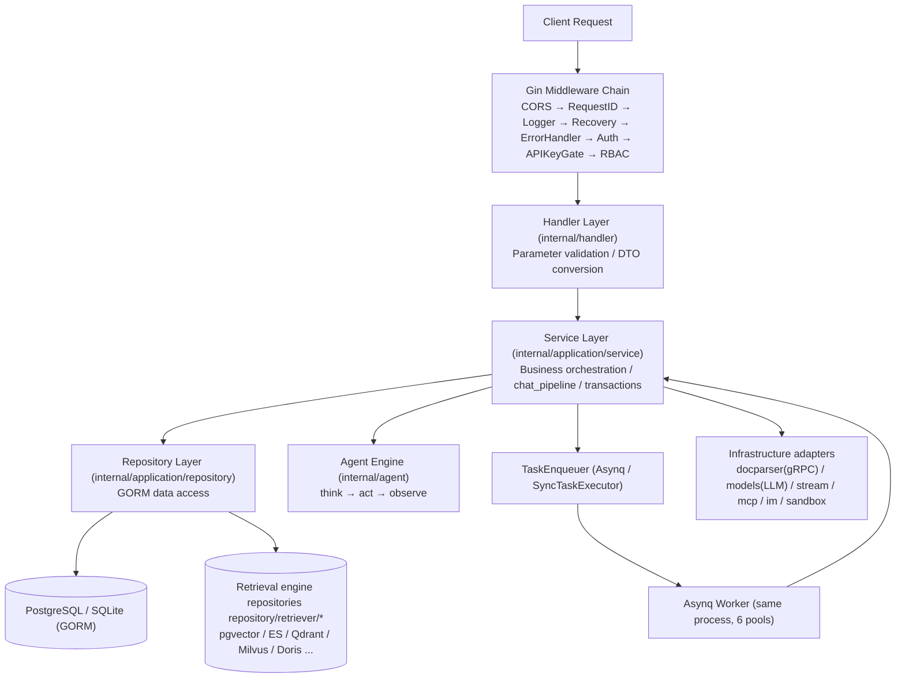
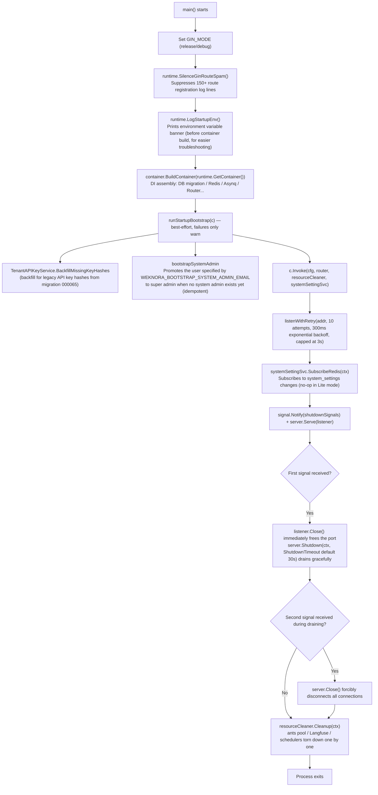

# Go Backend Design

This chapter dives deep into the internal design of the WeKnora Go backend (`internal/` and `cmd/server`): layered architecture, dependency injection based on uber/dig, startup and graceful shutdown flow, route organization and RBAC assembly, all HTTP middleware, domain models, error handling and logging conventions, and common utility libraries.

## 1. Layered Architecture

The backend follows the classic **Handler → Service → Repository → Database** four-layer structure, with all inter-layer dependencies decoupled through interfaces (`internal/types/interfaces/`) and assembled by the DI container at startup:

| Layer | Location | Responsibility |
| --- | --- | --- |
| Router / Middleware | `internal/router/`, `internal/middleware/` | Route registration, authentication, RBAC, rate limiting, logging, error envelope |
| Handler | `internal/handler/` (session-related in `internal/handler/session/`) | Parses request parameters (DTOs in `internal/handler/dto/`), calls Services, writes responses; contains no business logic |
| Service | `internal/application/service/` (~160+ files) | Business orchestration: knowledge base/knowledge/chunking, sessions and the `chat_pipeline/` pipeline, Agent, tenants and members, models, data source sync, Wiki, audit, etc. |
| Repository | `internal/application/repository/` (~60 files) | Data access, uniformly using **GORM** (`type knowledgeRepository struct { db *gorm.DB }`, operations go through `r.db.WithContext(ctx)`); retrieval engine repository implementations are packaged by engine under `repository/retriever/{postgres,elasticsearch,qdrant,milvus,weaviate,doris,opensearch,tencentvectordb,sqlite,neo4j}` |
| Domain Models | `internal/types/` | GORM entities, enums, context keys, interface definitions (`types/interfaces`) |
| Infrastructure | `internal/infrastructure/` (docparser gRPC client, web_search), `internal/models/` (chat/embedding/rerank model adapters), `internal/stream/`, `internal/sandbox/`, `internal/mcp/`, `internal/im/` | External system adapters |



Key conventions:

- Handlers only depend on Service interfaces (e.g. `interfaces.KnowledgeService`); Services only depend on Repository interfaces and other Service interfaces;
- All interfaces are declared centrally in `internal/types/interfaces/`, with implementations bound via dig;
- The Asynq worker and the HTTP server run in the **same process**, and task handler functions reuse the same set of Services.

## 2. Dependency Injection: internal/container (uber/dig)

WeKnora uses **`go.uber.org/dig` v1.19.0** (a constructor-injection container, not code-generated wire). The entry point is `BuildContainer` in `internal/container/container.go`:

```go
// cmd/server/main.go
c := container.BuildContainer(runtime.GetContainer())

// internal/container/container.go
func BuildContainer(container *dig.Container) *dig.Container {
    must(container.Provide(NewResourceCleaner, dig.As(new(interfaces.ResourceCleaner))))
    must(container.Provide(config.LoadConfig))
    must(container.Provide(initDatabase))     // *gorm.DB
    must(container.Provide(initRedisClient))  // *redis.Client (may be nil: Lite mode)
    ...
    must(container.Provide(repository.NewTenantRepository))
    must(container.Provide(service.NewTenantService))
    ...
    must(container.Provide(router.NewRouter)) // final output: *gin.Engine
    return container
}
```

`runtime.GetContainer()` (`internal/runtime/container.go`) holds the global singleton `dig.Container`; `must(err)` panics directly on registration failure — DI assembly errors are fatal startup errors.

### 2.1 dig Features Used

| Feature | Usage Example |
| --- | --- |
| `dig.As` | Binds a concrete type to an interface: `container.Provide(NewResourceCleaner, dig.As(new(interfaces.ResourceCleaner)))`; `router.NewAsyncqClient` is bound as `interfaces.TaskEnqueuer` |
| `dig.Name` named dependencies | Multiple instances of the same interface: 4 extraction services (`chunkExtractor`/`dataTableSummary`/`imageMultimodal`/`knowledgePostProcess`), 6 Asynq servers (`coreAsynqServer`/`postProcessAsynqServer`/`enrichmentAsynqServer`/`maintenanceAsynqServer`/`sharedAsynqServer`/`wikiAsynqServer`), `wikiIngest` |
| `dig.In` parameter struct | `router.RouterParams` embeds `dig.In`, injecting ~60 Handler/Service dependencies at once, avoiding excessively long constructor signatures |
| `container.Invoke` for side effects | Register-and-start background components: `registerPoolCleanup`, `registerWebSearchProviders`, `startDataSourceScheduler`, `startHousekeepingService`, `startAuditLogRetention`, `startTemporaryDocumentCleanup`, 15 `chatpipeline.NewPluginXxx` calls (Search/Rerank/WebFetch/Merge/DataAnalysis/QueryUnderstand/LoadHistory/ChatCompletionStream and other plugins self-registering to the EventManager), `router.RunAsynqServer`, `recoverPendingWikiTasks`, etc. |
| Adapter Provide | Uses closures for interface conversion: `func(s *service.StorageBackendService) interfaces.StorageBackendService { return s }`; `RetrieveEngineRegistry` exposes the same instance simultaneously as `StoreRegistry` |

### 2.2 Registration Order and Conditional Assembly

`BuildContainer`'s registration is divided into nine phases (with corresponding logs in the source): ① core infrastructure (config/langfuse/db/file/redis/ants pool) → ② retrieval engine registry → ③ external clients (docreader gRPC, Ollama, Neo4j, StreamManager, DuckDB) → ④ Repository layer (30+) → ⑤ Service layer (50+, including MCP Manager, event bus, Agent approval gate `approval.Gate`) → ⑥ **conditional task executor assembly** → ⑦ chat_pipeline plugins → ⑧ Handler layer (40+) and IM adapters → ⑨ Router and Asynq server startup.

Step ⑥ is the most important conditional branch in the entire repository — **the presence of Redis determines the runtime mode**:

```go
redisAvailable := os.Getenv("REDIS_ADDR") != ""
if redisAvailable {
    must(container.Provide(router.NewAsyncqClient, dig.As(new(interfaces.TaskEnqueuer))))
    must(container.Provide(router.NewCoreAsynqServer, dig.Name("coreAsynqServer")))
    ... // 6 worker pools total + AsynqInspector
    must(container.Invoke(registerModelConcurrencyLimiter))   // Redis distributed per-model concurrency gate
} else {
    syncExec := router.NewSyncTaskExecutor()                  // Lite mode: in-process synchronous executor
    must(container.Provide(func() interfaces.TaskEnqueuer { return syncExec }))
    must(container.Provide(router.NewNoopTaskInspector))
    must(container.Invoke(registerLiteModelConcurrencyLimiter)) // in-process semaphore
}
```

The concurrency of the 6 Asynq worker pools can be adjusted via system settings / environment variables (defaults: Core=8, PostProcess=2, Enrichment=12, Maintenance=4, Shared=6, Wiki=8, `WEKNORA_ASYNQ_*_CONCURRENCY`); the queue topology is defined in `internal/types/task.go` (default, chat_attachment, postprocess, summary, multimodal, graph, question, sync, low/maintenance, wiki, etc. — 19 task categories total).

### 2.3 Resource Cleanup and Factories

- `ResourceCleaner` (`internal/container/cleanup.go`): each component registers its destructor via `RegisterWithName(name, cleanupFunc)` (ants pool, Langfuse flush, data source scheduler, Housekeeping, etc.), and all are torn down together via `Cleanup(ctx)` on exit;
- `EngineFactory` (`internal/container/engine_factory.go`): creates retrieval engine instances at runtime based on rows in the `vector_stores` table (`createQdrantEngine` / `createMilvusEngine` / `createDorisEngine` / `createOpenSearchEngine` ...), rather than statically binding a single engine at startup;
- Besides establishing the connection, `initDatabase` is also responsible for: golang-migrate automatic migration (`AUTO_MIGRATE`, failures only warn without blocking), `__pending_env__` storage provider backfill, legacy StorageBackend migration, sequence sync, resetting pending tasks in Lite mode, declarative built-in model UPSERT from `config/builtin_models.yaml`; when using SQLite it forces `SetMaxOpenConns(1)` to serialize writes.

## 3. cmd/server Startup Flow

`cmd/server` has only three logical files: `main.go` (entry point and HTTP lifecycle), `bootstrap.go` (one-time bootstrap hooks), `listen.go` (port retry), plus `signals_unix.go`/`signals_windows.go` providing platform-specific `shutdownSignals`.



Key points:

- **Bootstrap hooks are deliberately best-effort**: `bootstrap.go`'s comments explicitly state "configuration errors should not brick the deployment" — all failure paths only call `logger.Warnf`; system admin promotion only takes effect when the deployment has no super admin at all yet, and a revocation done in the UI won't be restored by a restart;
- **Two-phase graceful shutdown**: on the first SIGTERM/SIGINT, the listener is closed first (so a new process can immediately bind the port), then `Shutdown` drains existing connections; a second signal forces `Close`;
- **Port-in-use retry**: `listenWithRetry` retries 10 times with exponential backoff starting at 300ms (avoids immediate failure during rolling restarts when the old process hasn't released the port yet).

## 4. Route Organization and RBAC Assembly (internal/router)

### 4.1 NewRouter Assembly Order

`NewRouter(params RouterParams)` in `internal/router/router.go` (`RouterParams` is a `dig.In` struct) assembles things in the following order — **order is security semantics**:

1. `gin.New()` + `SetTrustedProxies` (`WEKNORA_TRUSTED_PROXIES`, by default trusts only loopback and private network ranges, preventing forged `X-Forwarded-For` headers from bypassing per-IP rate limiting);
2. Global middleware: `cors` → `RequestID` → `Language` → `Logger` → `Recovery` → `ErrorHandler`;
3. Auth-free endpoints: `GET /health`; in non-release mode, mounts `/swagger/*any`;
4. Embed page `frame-ancestors` CSP middleware; Lite edition embeds frontend static assets (`handler.Edition == "lite"`);
5. Public routes registered **before authentication**: IM platform callbacks (`/api/v1/im`, each platform has its own signature verification), Web Embed public routes (`/api/v1/embed/:channel_id`, `middleware.EmbedAuth` publish-token authentication + Redis rate limiting), short-lived capability URLs (resource grants);
6. `middleware.Auth(...)` global authentication; followed by authenticated file proxy routes, unauthenticated but signature-verified presigned file routes, Langfuse trace middleware, `AuditServiceProvider`;
7. `v1 := r.Group("/api/v1")`: first `v1.Use(rbacGuards.apiKeyAuthorizer.Middleware())` (API Key gateway — JWT sessions pass straight through), then calls 30 `RegisterXxxRoutes(v1, handler, rbacGuards)` in sequence;
8. Final self-check: `rbacGuards.assertAPIKeyPoliciesMatchRoutes(r)` — if a declared API Key policy points to a nonexistent route template (path drift/typo), **it panics at startup**, preventing a permanently-403 dead policy from going live.

### 4.2 Route Group Overview

| Group Prefix | Register Function | API Key Policy Example |
| --- | --- | --- |
| `/auth`, `/me` | RegisterAuthRoutes / RegisterMyInvitationRoutes | most are Key-free |
| `/tenants`, `/tenants/:id/*` (members/invitations/audit) | RegisterTenantRoutes | `manage_members` / `manage_spaces`; the `/:id` group mounts `PathTenantMatch()` |
| `/knowledge-bases`, `/knowledge-bases/:id/knowledge|faq|tags|shares` | RegisterKnowledgeBaseRoutes etc. | `retrieve` / `ingest` (fallback `full_access`) |
| `/knowledge`, `/chunks` | RegisterKnowledgeRoutes / RegisterChunkRoutes | `ingest` |
| `/sessions`, `/knowledge-chat`, `/agent-chat`, `/knowledge-search`, `/messages` | RegisterSessionRoutes / RegisterChatRoutes etc. | `chat` / `retrieve` |
| `/models`, `/evaluation` | RegisterModelRoutes / RegisterEvaluationRoutes | `manage_models` / `run_evaluations` |
| `/system`, `/system/admin` | RegisterSystemRoutes / RegisterSystemAdminRoutes | the admin group forces `g.SystemAdmin()` |
| `/mcp-services`, `/agent`, `/web-search`, `/web-search-providers` | corresponding Register functions | `manage_mcp_services` / `manage_web_search` |
| `/vector-stores`, `/storage-backends` | RegisterVectorStoreRoutes / RegisterStorageBackendRoutes | `manage_vector_stores` / `manage_storage_backends` |
| `/agents`, `/agents/:id/shares|embed-channels|im-channels` | RegisterCustomAgentRoutes etc. | `full_access` / `manage_channels` |
| `/organizations`, `/user/favorites`, `/skills` | corresponding Register functions | `manage_spaces` etc. |
| `/im-channels`, `/embed-channels`, `/wechat` | RegisterIMChannelRoutes / RegisterEmbedChannelRoutes | `manage_channels` |
| `/datasource`, `/knowledgebase/:kb_id/wiki`, `/chunker/preview` | RegisterDataSourceRoutes / RegisterWikiPageRoutes / RegisterChunkerDebugRoutes | `manage_datasources` / `ingest` |

### 4.3 rbacGuards: Centralized Permission Matrix

`internal/router/rbac.go` defines `rbacGuards`, constructed once by `NewRouter` and passed into every Register function. Guards fall into three categories, used inline in route definitions so permission requirements are visible at a glance:

```go
kb.PUT("/:id", g.OwnedKBOrAdmin(), handler.UpdateKnowledgeBase)
```

- **Role guards** (asking "what role does the caller have within the tenant"): `Viewer()` / `Contributor()` / `Admin()` / `Owner()` / `AdminOrSystemAdmin()` / `SystemAdmin()`, underpinned by `middleware.RequireRole`;
- **Ownership guards** (asking "is the caller the creator of this resource, or Admin+"): `OwnedKBOrAdmin()`, `OwnedAgentOrAdmin()`, `OwnedKnowledgeKBOrAdmin()`, `OwnedChunkKBOrAdmin()`, `OwnedWikiKBOrAdmin()`, etc. — sub-resources (chunk/wiki/FAQ/tag) trace back to the owning KB's `creator_id` via URL parameters using closures like `KBCreatorLookupFromKnowledgeID`, sharing the same rule as the parent resource;
- **Knowledge base access guards** (three-tier resolution: owned KB / cross-organization shared KB / KB visible via shared Agent): `KBAccessRead|Write(param)` and the `...FromKnowledgeIDParam` / `...FromChunkIDParam` variants, underpinned by `middleware.RequireKBAccess`;
- **Tenant boundary guards**: `CrossTenant()` (platform-level operations require `EnableCrossTenantAccess` + `CanAccessAllTenants`), `PathTenantMatch()` (`/tenants/:id` must match the tenant in context).

The source code comments provide a decision tree for choosing guards (resources with a creator use OwnedXxxOrAdmin; tenant-level infrastructure uses Admin; creation entry points use Contributor), and make clear that all guards respect the `cfg.Tenant.EnableRBAC` toggle — when disabled, they merely log "would have denied" and pass through (behavior for gradual migration periods).

**API Key policies** are orthogonal to role guards: `apiKeyGroup(grp, policy)` wraps a gin RouterGroup, writing `(method, fullPath) → APIKeyRoutePolicy` into the `APIKeyRouteAuthorizer` policy table as routes are registered. Policy constructors include `apiKeyFullAccess()`, `apiKeyPlatform(...)`, and 17 capability wrappers (`apiKeyRetrieve` / `apiKeyChat` / `apiKeyIngest` / `apiKeyManageModels` ...). Routes without a registered policy **default to fail-closed rejection** for API Key principals.

## 5. Middleware List (internal/middleware)

In the order requests pass through them:

| Middleware | File | Responsibility and Key Logic |
| --- | --- | --- |
| `cors.New` (gin-contrib) | router.go | Allows `Authorization`, `X-API-Key`, `X-Tenant-ID`, `X-Embed-Session`, and other headers; MaxAge 12h |
| `RequestID()` | logger.go | Reuses the `X-Request-ID` request header or generates a UUID, writing it into the gin context and `Request.Context()`, threading through logging/tracing |
| `Language()` | language.go | Determines the document processing language: `WEKNORA_LANGUAGE` env var > first tag in `Accept-Language` > default `zh-CN` |
| `Logger()` | logger.go | Full request/response logging; regex-based redaction of password/token fields, truncates base64 image data URLs, marks SSE responses to skip, 10KB cap per entry |
| `Recovery()` | recovery.go | Panic recovery + stack trace logging + 500 response |
| `ErrorHandler()` | error_handler.go | Reads the last error in `c.Errors`: for `*errors.AppError`, returns the unified `{success:false, error:{code,message,details}}` envelope per its `HTTPCode`; everything else is 500 |
| `EmbedAuth(...)` | embed_auth.go | Mounted only on the `/api/v1/embed/:channel_id` public group: validates the publish token, injects Embed channel context; 3-tier Redis rate limiting (per IP/minute, channel-wide/minute, channel/day) |
| `PublicAuthRateLimit()` | auth_public_ratelimit.go | For unauthenticated invitation-lookup/invited-registration routes: **in-process memory** sliding window, 60s/30 requests per IP, background cleanup of expired buckets every 2 minutes, returns 429 when exceeded |
| `Auth(...)` | auth.go | Core authentication, three modes: ① JWT (`Authorization: Bearer`, `userService.ValidateToken`); ② API Key (`X-API-Key`, `AuthenticateAPIKey`); ③ `noAuthAPI` whitelist. Supports switching tenants via `X-Tenant-ID` (`IsTenantAccessible` three-tier check: own tenant/cross-tenant super admin/active membership), `resolveTenantRole` resolves the role within the tenant. Writes into context: `TenantIDContextKey`, `TenantInfoContextKey`, `UserContextKey`, `UserIDContextKey`, `TenantRoleContextKey`, `SystemAdminContextKey`, `PrincipalContextKey`, etc. |
| `langfuse.GinMiddleware()` | tracing/langfuse | LLM observability tracing; a no-op when LANGFUSE_* isn't configured |
| `AuditServiceProvider()` | audit_provider.go | Injects `AuditLogService` into the gin context, for logging audit entries on RBAC denial paths; degrades gracefully when the service is nil |
| `APIKeyRouteAuthorizer.Middleware()` | api_key_gate.go | Route-level gateway for API Key principals: looks up the `(method, fullPath)` policy table, validates `PlatformOnly` / `RequireFullAccess` / `Capabilities`; routes with no declared policy default to rejection; JWT users pass straight through |
| `RequireRole(min)` etc. | rbac.go | Minimum-role check within the tenant (owner=40 > admin=30 > contributor=20 > viewer=10); `RequireOwnershipOrRole(min, creatorLookup)` lets the resource creator bypass the minimum role; API Key principals short-circuit (their authorization is handled by APIKeyGate); cross-tenant super admins temporarily gain Admin; denials call `AuditService.LogDenied` |
| `RequireCrossTenantAccess()` / `RequirePathTenantMatch()` | access.go | Gateway for platform-level operations and URL tenant-consistency checks |
| `RequireKBAccess(resolver, perm, ...)` | kb_access.go | Three-tier KB access resolution (owned → organization-shared → shared-agent read-only), and **rewrites** the `TenantIDContextKey` in `Request.Context()` to the KB's source tenant, so downstream retrieval automatically lands on the correct tenant's data |
| `asynqdl.Middleware()` | asynqdl/ | Non-HTTP: when an Asynq task's retry budget is exhausted, writes into the `task_dead_letters` table, and can attach an `OnDeadLetter` callback to trigger business-state updates (e.g. marking knowledge parsing as failed) |

## 6. Domain Model Overview (internal/types)

`internal/types/` contains around 26 GORM persistence entities. Core relationships:

```mermaid
erDiagram
    TENANT ||--o{ USER : "primary tenant (users.tenant_id)"
    TENANT ||--o{ TENANT_MEMBER : "members"
    USER ||--o{ TENANT_MEMBER : "joins multiple spaces"
    TENANT ||--o{ TENANT_API_KEY : "API key (empty tenant_id = platform-level)"
    TENANT ||--o{ KNOWLEDGE_BASE : "owns"
    TENANT ||--o{ MODEL : "model configs"
    TENANT ||--o{ CUSTOM_AGENT : "custom Agents"
    TENANT ||--o{ VECTOR_STORE : "vector store instances"
    TENANT ||--o{ STORAGE_BACKEND : "storage backends"
    TENANT ||--o{ DATA_SOURCE : "external data sources"
    TENANT ||--o{ SESSION : "sessions"
    TENANT ||--o{ AUDIT_LOG : "audit (tenant_id=0 = system-level)"
    KNOWLEDGE_BASE ||--o{ KNOWLEDGE : "documents (knowledge.knowledge_base_id)"
    KNOWLEDGE_BASE ||--o{ KNOWLEDGE_TAG : "tags"
    KNOWLEDGE_BASE ||--o| VECTOR_STORE : "bound to vector_store_id at creation"
    KNOWLEDGE_BASE ||--o| STORAGE_BACKEND : "bound to storage_backend_id at creation"
    KNOWLEDGE_BASE ||--o{ WIKI_PAGE : "Wiki pages"
    KNOWLEDGE_BASE ||--o{ WIKI_FOLDER : "Wiki folder tree"
    KNOWLEDGE ||--o{ CHUNK : "chunks (chunk.knowledge_id)"
    DATA_SOURCE ||--o{ SYNC_LOG : "sync records"
    SESSION ||--o{ MESSAGE : "messages (message.session_id)"
    MESSAGE }o--|| CUSTOM_AGENT : "agent_id"
    MESSAGE }o--|| MODEL : "model_id"

    TENANT {
        uint64 id PK
        string name
        int64 storage_quota
        json retriever_engines
        json credentials_config "AES-256 encrypted"
    }
    USER {
        string id PK "UUID"
        string username UK
        string email UK
        uint64 tenant_id FK
        bool is_system_admin
        bool can_access_all_tenants
    }
    TENANT_MEMBER {
        uint64 id PK
        string user_id FK "uniq(user_id,tenant_id)"
        uint64 tenant_id FK
        string role "owner/admin/contributor/viewer"
        string status "active/invited/suspended"
    }
    KNOWLEDGE_BASE {
        string id PK "UUID"
        uint64 tenant_id FK
        string creator_id FK "used for RBAC ownership checks"
        string type "document/faq/wiki"
        json chunking_config
        json indexing_strategy "vector/keyword/wiki/graph — four pipeline toggles"
        string embedding_model_id FK
    }
    KNOWLEDGE {
        string id PK "UUID"
        string knowledge_base_id FK
        string parse_status "7 states: pending→processing→finalizing→completed etc."
        string channel "web/api/wechat/feishu... 14 types"
        int pending_subtasks_count
    }
    CHUNK {
        string id PK "UUID"
        string knowledge_id FK
        string chunk_type "text/parent_text/faq/entity/wiki_page... 12 types"
        string parent_chunk_id "parent-child chunking"
        string content_hash
    }
    SESSION {
        string id PK "UUID"
        uint64 tenant_id FK
        string user_id "user/API principal/embed guest"
        json last_request_state
    }
    MESSAGE {
        string id PK "UUID"
        string session_id FK
        string role "user/assistant/system"
        json knowledge_references "retrieval citations"
        json agent_steps "Agent reasoning trace"
        text rendered_content "full RAG-augmented prompt"
    }
    MODEL {
        string id PK
        uint64 tenant_id FK
        string type "Embedding/Rerank/KnowledgeQA/VLLM/ASR"
        string source "18+ providers"
        json parameters "APIKey AES encrypted"
    }
```



Design highlights:

- **Multi-tenant isolation**: nearly all entities carry a `TenantID`; `tenant_id=0` denotes system-level (e.g. system audit);
- **Static encryption of sensitive fields**: `Model.Parameters`, `VectorStore.ConnectionConfig`, `StorageBackend.Config`, `DataSource.Config`, `TenantAPIKey.APIKey`, etc. are AES-256-GCM encrypted with `SYSTEM_AES_KEY` (32 bytes) on GORM `Value()`, and leniently decrypted on `Scan()` (a decryption failure is treated as "not configured" rather than an error);
- **Immutable-at-creation bindings**: a KB's `VectorStoreID` (gorm tag `<-:create`) and `StorageBackendID` cannot be changed once created, ensuring index/file consistency;
- **Async state machine**: `Knowledge.ParseStatus`'s seven states plus `PendingSubtasksCount` track parallel enrichment subtasks (summary/question/graph) during the finalizing stage;
- **Append-only audit**: `AuditLog` has no update/soft-delete fields, covering 50+ types of `AuditAction`;
- Notable non-entity types: `SearchResult` retrieval results, `Pagination`, `Task`/queue topology (`task.go`), various JSONB config structs (`ChunkingConfig`, `IndexingStrategy`, `CustomAgentConfig`, etc.), context keys and accessor helpers (`context_helpers.go`).

## 7. Error Handling Conventions (internal/errors)

The unified error carrier is `AppError`:

```go
// internal/errors/errors.go
type AppError struct {
    Code     ErrorCode // business error code
    Message  string
    Details  any
    HTTPCode int       // HTTP status mapping
}
```

- **Error code ranges**: 1000–1999 general HTTP semantics (`ErrBadRequest=1000`, `ErrUnauthorized=1001`, `ErrForbidden=1002`, `ErrNotFound=1003`, `ErrTooManyRequests=1006`, `ErrServiceUnavailable=1008`); 2000–2099 tenant; 2100–2199 Agent; 2200–2299 vector store;
- **Constructors**: `NewBadRequestError` / `NewUnauthorizedError` / `NewForbiddenError` / `NewNotFoundError` / `NewValidationError` / `NewConflictError` / `NewTooManyRequestsError` / `NewServiceUnavailableError`, etc.;
- **Usage pattern**: Handlers/middleware attach errors via `c.Error(appErr)`; the `ErrorHandler` middleware renders the unified `{success:false, error:{code,message,details}}` envelope at the end of the chain, and the frontend does i18n based on `error.code`; anything that isn't an `AppError` is treated as 500;
- `session.go` provides session-domain sentinel errors (`ErrSessionNotFound`, etc.); `parse_error_codes.go` defines string error codes for the document parsing stage (`DOCREADER_TIMEOUT`, `EMBEDDING_RATE_LIMIT`, `VECTORSTORE_WRITE_FAILED`, `TASK_TIMEOUT`, etc.), stored in `Knowledge.ErrorMessage` for frontend translation and display.

## 8. Logging System (internal/logger)

- Based on **logrus**, a private `appLogger` singleton with a custom Formatter (colored terminal output; `LOG_FORMAT` supports customizable templates with placeholders like `%d` `%level` `%traceId` `%msg`; when `LOG_PATH` is set, logs are rotated via lumberjack to files with ANSI color codes stripped);
- **request_id threading**: `middleware.RequestID` writes into context → `logger.GetLogger(ctx)` automatically extracts it and injects the `request_id` field; common entry points are `logger.Infof/Warnf/Errorf(ctx, format, ...)` and `ErrorWithFields`;
- **LLM debug logging** (`llm_logger.go`): enabled when `LLM_DEBUG_LOG=true`, logging every LLM call per request_id into a separate file (`LLMCallRecord`: CallType Chat/Embedding/Rerank/VLM, model, duration, full messages and tool calls, errors), auto-cleaned after 7 days — the go-to tool for troubleshooting prompt/context issues.

## 9. Key Utility Libraries (internal/common, internal/utils)

| Location | Utility | Purpose |
| --- | --- | --- |
| `common/tools.go` | `Deduplicate` / `DeduplicateWithScore`, `ParseLLMJsonResponse`, `CleanInvalidUTF8`, `PipelineLog` series | Generic deduplication (retrieval merge keeps the highest score), parses ```json code blocks from LLM responses, cleans invalid UTF-8, RAG pipeline stage logging |
| `common/db_retry.go` | `WithDeadlockRetry(ctx, fn)` | Database deadlock-detection retry (up to 3 times, 50→100→200ms backoff) |
| `common/redis_tls.go` | `RedisTLSConfig()` | Generates Redis TLS config based on `REDIS_USE_TLS` and other env vars |
| `utils/crypto.go` | `EncryptAESGCM` / `DecryptAESGCM` (`enc:v1:` prefix, idempotent) | The underlying implementation for static encryption of all the sensitive fields mentioned above |
| `utils/security.go` | `SanitizeHTML`, `ValidateFilePath`, `SanitizeForLog` | XSS sanitization, directory traversal protection, log redaction |
| `utils/inject.go` | `ValidateSQL` (based on `pganalyze/pg_query_go`) | Whitelisted-table validation and injection-pattern detection for SQL generated by Agent data analysis |
| `utils/presign.go` | `GeneratePresignURL` / `ValidatePresignURL` | HMAC-SHA256 presigned file URLs (default 2h, used for IM embedded images) |
| `utils/oidc_state.go` | `GenerateState` / `ValidateState` | HMAC signing and 10-minute TTL for OIDC authorization state (CSRF protection) |
| `utils/log_sanitize.go` | `CompactImageDataURLForLog` | Truncates overly long image data URLs, preventing log bloat |
| `utils/storage_error.go` | `SanitizeStorageConnectivityError` | Converts storage connectivity errors into user-friendly messages while hiding internal hostnames |
| Others | `taskid.go` / `fileutil.go` / `filesize.go` / `httputil.go` / `json.go` | Task ID generation, file and size formatting, HTTP downloads, JSON Schema generation, etc. |

---

With this, the full chain from process startup, dependency assembly, and request ingress through to database persistence has been closed. The following chapters will cover the internal implementation of the RAG retrieval pipeline (`chat_pipeline`), the Agent engine (`internal/agent`), and the document parsing service (`docreader`) in turn.
