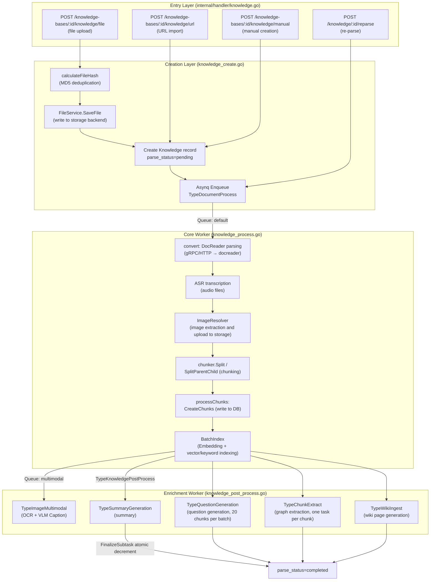
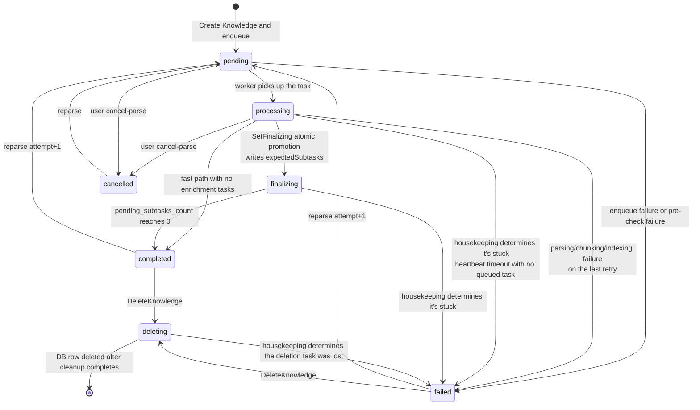

# Document Ingestion Pipeline

Documents enter the system through file upload, URL import, or manual creation. The server stores the content and submits processing tasks, which perform parsing, chunking, and indexing in turn, then generate summaries, questions, the graph, and Wiki according to the knowledge base configuration. Status and progress are updated as the processing stages advance, and failed tasks are recovered by the retry and sweep mechanisms.

## Overall Architecture {#_1-overall-architecture}

WeKnora's ingestion pipeline is a **distributed asynchronous pipeline based on Asynq (Redis)**. The HTTP Handler is only responsible for persisting records and enqueuing tasks; all time-consuming work (parsing, vectorization, LLM enrichment) is consumed by an independent Worker pool from the queue.



## Entry Layer: Three Creation Methods {#_2-entry-layer-three-creation-methods}

Routes registered in `internal/router/routes_knowledge.go`:

```go
kb.POST("/file",   g.OwnedKBOrAdmin(), g.KBAccessWrite("id"), handler.CreateKnowledgeFromFile)
kb.POST("/url",    g.OwnedKBOrAdmin(), g.KBAccessWrite("id"), handler.CreateKnowledgeFromURL)
kb.POST("/manual", g.OwnedKBOrAdmin(), g.KBAccessWrite("id"), handler.CreateManualKnowledge)
```

Companion management endpoints: `POST /knowledge/:id/reparse` (re-parse), `POST /knowledge/:id/cancel-parse` (cancel parsing), `POST /knowledge/batch-reparse`, `POST /knowledge/batch-delete`, `POST /knowledge/move` (cross-KB move).

### File Upload (CreateKnowledgeFromFile) {#_2-1-file-upload-createknowledgefromfile}

- Form parameters: `file`, `fileName`, `metadata`, `enable_multimodel`, `tag_ids`, `process_config` (each upload can override the KB-level processing config, see [Processing Config: KB Defaults + Per-Upload Overrides](#_5-processing-config-kb-defaults-per-upload-overrides)).
- Flow: extension validation → MD5 deduplication → `FileService.SaveFile` storage → create `Knowledge` record → enqueue.

### Unified Extension Gate {#_2-1-1-unified-extension-gate}

`supportedImportFileExtensions` in `internal/application/service/knowledge_util.go` is the **single source of truth for all import paths** — direct upload, file URL download, and the re-check after worker download all query the same table:

```
pdf txt docx doc epub html htm mhtml md markdown xmind
png jpg jpeg gif csv xlsx xls pptx ppt json
mp3 wav m4a flac ogg
```

Previously, URL import maintained a shorter, separate whitelist, causing inconsistencies like "direct xlsx upload works, but URL import of xlsx is rejected" (#2447); this is now uniformly determined by `isSupportedImportExtension()` / `validateImportFileType()`, and video types return a clear message: "video file upload is not currently supported."

Table-type extensions (`csv` / `xlsx` / `xls`, `dataTableFileExtensions`) get an additional table summary task (`enqueueDataTableSummaryIfNeeded`) appended after the document processing task.

The extra pre-checks for image and audio files (whether object storage config is complete, whether VLM / ASR models are configured) are consolidated together with `process_config` validation into `resolveFileImportProcessConfig()`, shared by both upload and URL import.

### URL Import (CreateKnowledgeFromURL) {#_2-2-url-import-createknowledgefromurl}

- JSON Body: `{url, file_name?, file_type?, enable_multimodel?, title?, tag_ids?, channel?, process_config?}`.
- `isFileURL()` determines whether this is a "file download" or a "webpage scrape" based on the unified extension set above.
- Both the Handler and Service layers perform SSRF protection (called in both `internal/handler/knowledge.go` and `knowledge_create.go`):

```go
if err := secutils.ValidateURLForSSRF(req.URL); err != nil {
    c.Error(errors.NewBadRequestError(secutils.FormatSSRFError("URL", req.URL, err)))
    return
}
```

The Worker side re-validates right before the actual fetch (`convert()` in `knowledge_process.go`), forming a triple line of defense against TOCTOU.

### Manual Creation (CreateManualKnowledge) {#_2-3-manual-creation-createmanualknowledge}

- The JSON Body is `types.ManualKnowledgePayload{Title, Content, Status, TagIDs, Channel, ProcessConfig}`, supporting a Draft status; upon publishing, `triggerManualProcessing()` enters the same chunking/indexing pipeline as files (skipping the DocReader stage).

### Deduplication Mechanism {#_2-4-deduplication-mechanism}

`knowledge_create.go` computes an MD5 for the uploaded file and looks it up by a four-tuple key:

```go
hash, err := calculateFileHash(file) // MD5
exists, existingKnowledge, err := s.repo.CheckKnowledgeExists(ctx, tenantID, kbID,
    &types.KnowledgeCheckParams{
        Type:     "file",
        FileName: fileName,
        FileType: getFileType(fileName),
        FileSize: file.Size,
        FileHash: hash,
    })
if exists {
    return existingKnowledge, types.NewDuplicateFileError(existingKnowledge)
}
```

On a hit, nothing new is stored; the existing Knowledge is returned along with a `DuplicateFileError` (the frontend uses this to show a "file already exists" message). Rows whose `parse_status` is `failed` or `deleting` do not take part in the duplicate check, so files whose deletion has not finished or is stuck in deletion can be uploaded again. `FileType` participates in the check: a duplicate only counts **within the same file type**, so `notes.md` and `notes.txt` with identical content coexist as two separate knowledge entries (`CheckKnowledgeExists` appends a `LOWER(file_type)` condition on both the hash branch and the "filename + size" branch).

### Initial State {#_2-5-initial-state}

Key initial fields of a newly created Knowledge record (`knowledge_create.go`):

```go
knowledge := &types.Knowledge{
    ID:           uuid.New().String(),
    Type:         "file",        // or "url" / "manual"
    ParseStatus:  "pending",     // initial parsing status
    EnableStatus: "disabled",    // not searchable until indexing completes
    FileHash:     hash,
    ...
}
```

For CSV/Excel data-table type knowledge, a `TypeDataTableSummary` (`datatable:summary`) task is also enqueued after creation, generating `table_summary` / `table_column` type Chunks for table-based Q&A.

## File Storage Layer (FileService and Storage Backends) {#_3-file-storage-layer-fileservice-and-storage-backends}

### Interface Definition {#_3-1-interface-definition}

`internal/types/interfaces/file.go`:

```go
type FileService interface {
    CheckConnectivity(ctx context.Context) error
    SaveFile(ctx context.Context, file *multipart.FileHeader, tenantID uint64, knowledgeID string) (string, error)
    SaveBytes(ctx context.Context, data []byte, tenantID uint64, fileName string, temp bool) (string, error)
    GetFile(ctx context.Context, filePath string) (io.ReadCloser, error)
    GetFileURL(ctx context.Context, filePath string) (string, error)
    DeleteFile(ctx context.Context, filePath string) error
    CopyFile(ctx context.Context, srcPath string, tenantID uint64, knowledgeID string) (string, error)
}
```

### Supported Storage Backends {#_3-2-supported-storage-backends}

The factory function `NewFileServiceFromStorageConfig()` (`internal/application/service/file/factory.go`) selects a backend based on `types.StorageEngineConfig.DefaultProvider`. The list of actually supported backends:

| Provider | Path prefix | Implementation file | Description | Key config |
|----------|----------|----------|------|----------|
| `local` | `local://` | `file/local.go` | Single-machine local disk | `LocalEngineConfig.PathPrefix`, base directory from `LOCAL_STORAGE_BASE_DIR`, external link signing from `APP_EXTERNAL_URL` |
| `minio` | `minio://` | `file/minio.go` | MinIO / S3-compatible | `MinIOEngineConfig` (with `mode: docker`, reads env vars `MINIO_ENDPOINT` / `MINIO_ACCESS_KEY_ID` / `MINIO_SECRET_ACCESS_KEY` / `MINIO_BUCKET_NAME`; with `mode: remote`, reads config fields) |
| `cos` | `cos://` | `file/cos.go` | Tencent Cloud COS | `SecretID/SecretKey/Region/BucketName/AppID`, supports a separate temp bucket `TempBucketName/TempRegion` |
| `oss` | `oss://` | `file/oss.go` | Alibaba Cloud OSS | `Endpoint/Region/AccessKey/SecretKey/BucketName`, supports a temp bucket |
| `s3` | `s3://` | `file/s3.go` | AWS S3 / compatible protocol | `Endpoint/Region/AccessKey/SecretKey/BucketName/UseSSL/ForcePathStyle` |
| `tos` | `tos://` | `file/tos.go` | Volcano Engine TOS | Same as above, supports a temp bucket |
| `obs` | `obs://` | `file/obs.go` | Huawei Cloud OBS | `Endpoint/Region/AccessKey/SecretKey/BucketName/UseSSL` |
| `ks3` | `ks3://` | `file/ks3.go` | Kingsoft Cloud KS3 | `Endpoint/Region/AccessKey/SecretKey/BucketName` |
| `dummy` | `dummy://` | `file/dummy.go` | Empty implementation for testing | None |

### Object Key Organization Rules {#_3-3-object-key-organization-rules}

- Formal files: `{tenantID}/{knowledgeID}/{uuid-or-nanosecond-timestamp}{ext}`, e.g. `local://12345/kb-001/1722045600000000000.pdf`.
- Export/temp/clone artifacts: `{tenantID}/exports/{fileName}_{timestamp}{ext}`.
- Path safety: `secutils.SafePathUnderBase` (directory traversal protection), `secutils.SafeFileName`, and on the object-storage side `utils.SafeObjectKey`.

### Two Wrapper Layers {#_3-4-two-wrapper-layers}

- **`backend_scoped.go`**: In multi-storage-backend deployments, adds an instance prefix to paths, in the form `storage://{backendID}/{innerPath}`; `wrap/unwrap` encode/decode and reject cross-backend operations. A KB can bind to a specific backend instance via `StorageBackendID`.
- **`resource_catalog.go`**: Registers a physical path as a stable `resource://{uuid}` reference, supporting `Bind` (associating a resource with an owner such as knowledge), `MarkDeleted`, and `CreateAccessGrant` (generates a temporary access token, producing a URL in the form `/r/{token}`). As long as the application layer holds a `resource://` reference, it can migrate the underlying storage transparently.

## Asynchronous Task Mechanism (Asynq + Redis) {#_4-asynchronous-task-mechanism-asynq-redis}

### Enqueuing {#_4-1-enqueuing}

`knowledge_create.go` assembles a `types.DocumentProcessPayload` (containing `TenantID/KnowledgeID/KnowledgeBaseID/FilePath/FileName/FileType/EnableMultimodel/EnableQuestionGeneration/QuestionCount/Language/Attempt`, etc.), with task options coming from `knowledge_task_options.go`:

```go
opts := []asynq.Option{
    asynq.Queue(types.QueueDefault),
    asynq.Timeout(config.DocumentProcessTimeout(cfg)), // 2 hours by default
    asynq.MaxRetry(3),                                  // up to 3 retries on failure
}
task := asynq.NewTask(types.TypeDocumentProcess, payloadBytes, opts...)
info, err := s.task.Enqueue(task)
```

If enqueueing fails, `ParseStatus` is set to `failed` (the file has already been saved, and can be re-triggered via reparse).

### Queue Topology and Worker Pools {#_4-2-queue-topology-and-worker-pools}

Queues defined in `internal/types/task.go`:

| Queue constant | Name | Purpose |
|----------|------|------|
| `QueueDefault` | `default` | Core document processing (parsing/chunking/embedding/indexing) |
| `QueueChatAttachment` | `chat_attachment` | Parsing of session temporary documents |
| `QueuePostProcess` | `postprocess` | Post-processing orchestration tasks |
| `QueueSummary` | `summary` | Summaries, table summaries, automatic tagging, knowledge base descriptions |
| `QueueMultimodal` | `multimodal` | Image OCR / VLM Caption |
| `QueueQuestion` | `question` | Question generation |
| `QueueGraph` | `graph` | Graph extraction |
| `QueueWiki` | `wiki` | Wiki generation and finalization |
| `QueueMaintenance` | `low` | Maintenance tasks (FAQ batch import, knowledge base copy/delete, batch delete/reparse, moves, etc.) |

There are also the `sync` (data source sync) and `memory` (personal memory extraction) queues. Default concurrency (`internal/types/task.go`): core pool `DefaultCoreWorkerConcurrency = 8`, post-processing pool `2`, enrichment pool `12`, maintenance pool `4`, elastic shared pool `6`, Wiki pool `8`; for the full topology, see [Async Task System](05-async-tasks.md#_4-1-six-independent-worker-pools).

### Failure Retry Semantics {#_4-3-failure-retry-semantics}

- `TypeDocumentProcess`: `MaxRetry(3)` → initial attempt + 3 retries = 4 attempts total; each attempt is bound by `DocumentProcessTimeout` (2 hours by default, environment variable `WEKNORA_DOCUMENT_PROCESS_TIMEOUT`), and a single docreader call is additionally bound by `WEKNORA_DOCREADER_CALL_TIMEOUT` (30 minutes by default).
- A panic inside the processing function is converted into an error and handed to the retry and dead-letter flow, and the document is marked `failed` on the last failure; the executor in Lite mode also catches panics, so they do not bring down the process.
- The payload carries `Attempt` (when re-parsing, this takes the historical max attempt + 1); the Span Tracker uses the attempt to isolate the progress tree of each processing round — a new attempt "supersedes" the finalization actions of the old task.
- The processing function distinguishes "whether this is the last asynq attempt" (`isLastRetry`): a failure on a non-final attempt simply returns an error to let asynq retry, and only on the final attempt is `ParseStatus` set to `failed` with `ErrorMessage` written.

## Processing Config: KB Defaults + Per-Upload Overrides {#_5-processing-config-kb-defaults-per-upload-overrides}

`ResolveProcessConfig(kb, overrides)` in `knowledge_process_config.go` merges the KB's default configuration with the `process_config` (`types.KnowledgeProcessOverrides`) carried at upload time into a `types.EffectiveProcessConfig`:

- Overridable items: `ChunkingConfig` (chunk size/overlap/strategy/parent-child chunking, etc.), `EnableMultimodel`, `VLMConfig`, `ASRConfig`, `QuestionGenerationConfig`, `GraphEnabled`, `ExtractConfig`, `ParserEngineRules`.
- Constraint: `eff.GraphEnabled = eff.GraphEnabled && eff.ExtractConfig.Enabled` (graph depends on extraction config being enabled).
- `ValidateProcessOverrides` performs pre-checks based on file type: uploading an image requires a configured VLM model, uploading audio requires a configured ASR model, and multimodal processing additionally requires complete object storage configuration (`validateImageMultimodalConfig`).
- The override configuration is persisted on the Knowledge row via `knowledge.SetProcessOverrides`, and is reused on reparse.

Which pipelines run is determined by the KB's `IndexingStrategy` (`internal/types/indexing_strategy.go`):

```go
type IndexingStrategy struct {
    VectorEnabled  bool // semantic vector index
    KeywordEnabled bool // BM25 keyword index
    WikiEnabled    bool // automatic wiki page generation
    GraphEnabled   bool // knowledge graph extraction
}
```

`NeedsEmbedding() = Vector || Keyword`, `NeedsChunks() = any enabled`. The defaults are vector+keyword enabled.

## Core Processing Pipeline (knowledge_process.go) {#_6-core-processing-pipeline-knowledge-process-go}

After the Worker consumes `TypeDocumentProcess`, it advances through five standardized stages, each corresponding to a Span (see [Housekeeping Self-Healing (knowledge_housekeeping.go)](#_8-housekeeping-self-healing-knowledge-housekeeping-go)):

`docreader → chunking → embedding → multimodal → postprocess`

### Parsing (convert, Stage: docreader) {#_6-1-parsing-convert-stage-docreader}

1. `beginStage(StageDocReader)` records the input (file_name/file_type/is_url).
2. In URL mode, `ValidateURLForSSRF` is run again; on failure it goes straight to `failStage` + `ParseStatus=failed`.
3. Engine selection: `eff.ChunkingConfig.ResolveParserEngine(fileType)` (URL uses the virtual type `"url"`), routed according to the KB-configured `ParserEngineRules` (file type → engine); `MergeParserEngineOverrides` merges tenant-level and upload-level engine parameter overrides.
4. `resolveDocReader` returns an `interfaces.DocReader`:
   - **builtin**: calls the Python **docreader** service via gRPC (`docparser/grpc_parser.go`) or HTTP (`http_parser.go`);
   - **simple**: native Go parsing of md/txt/csv/json/images/audio (`builtin_converter.go`, CSV→Markdown table, JSON→recursively-split code blocks, images/audio converted to placeholder references);
   - **anydoc**: in-process Go parsing of docx/doc/pptx/ppt/xlsx/xls/odf/rtf/epub/csv/pdf (`anydoc_reader.go`), backed by the anydoc Rust library linked through cgo. Embedded images in office documents are inserted back into their original positions in the Markdown according to the document model; scanned PDFs without a text layer fall back to builtin full-page rendering when DocReader is available. When anydoc is linked, complex formats without a configured rule default to anydoc, but PDFs still default to builtin. It is only available in binaries built with the `anydoc` build tag; in other builds the engine is shown as unavailable in the engine list;
   - **weknoracloud / mineru / mineru_cloud / paddleocr_vl / paddleocr_vl_cloud**: HTTP converters (registered in `engines.go`, availability determined by config such as `mineru_endpoint`, `mineru_api_key`, `paddleocr_vl_endpoint`; a self-hosted `mineru` automatically detects the MinerU 4.0 V1 API and the legacy `/file_parse`, see [Document Parsing Service](../03-features/03-document-parsing.md#mineru-self-hosted)).

The engine catalog is centralized in `internal/infrastructure/docparser/engines.go`: each engine declares both its metadata (name, description, file types, availability probe) and a `NewReader` factory; `docparser.NewReader` dispatches by name, and unregistered names (such as `markitdown`, which exists only in docreader) fall through to the docreader client.
5. File mode: bytes are read back from `FileService.GetFile(payload.FilePath)` and filled into `ReadRequest.FileContent`.

**docreader service side** (`docreader/`, Python gRPC): proto defined in `docreader/proto/docreader.proto`, service methods `Read` / `ReadStream` (streaming: first frame is meta + one frame per image, avoiding hitting the gRPC message size limit on large scanned PDFs) / `ListEngines`. Built-in parsers cover docx/doc/pdf/md/xlsx/xls/pptx/ppt/epub/html/htm/mhtml/xmind/images/webpages (`WebParser` handles URLs), and the `markitdown` (Microsoft MarkItDown) and `opendataloader` (PDF layout analysis, requires Java 11+) engines are also registered; the engine list is maintained by `engine_registry.go` on the Go side, and the Go App no longer calls `ListEngines`. Results are uniformly returned as `ReadResult{MarkdownContent, ImageRefs, Metadata, IsAudio, AudioData}` — **the parsing output is always Markdown text + image bytes**, with image persistence handled on the Go side.

### ASR Transcription (Audio Files) {#_6-2-asr-transcription-audio-files}

When `convertResult.IsAudio` is true (audio files are parsed into a placeholder + raw bytes):

```go
asrModel, err := s.modelService.GetASRModel(ctx, eff.ASRConfig.ModelID)
transcriptionResult, err := asrModel.Transcribe(ctx, convertResult.AudioData, knowledge.FileName)
```

The transcribed text replaces MarkdownContent and continues through the normal text pipeline; if ASR is not configured, it fails outright.

### Image Extraction and Upload {#_6-3-image-extraction-and-upload}

`ImageResolver.ResolveAndStore` in `docparser/image_resolver.go`:

1. Sequentially handles `<!link>`-wrapped images, `data:` URIs, HTML inline base64, bare base64, and inline bytes from docreader's returned `ImageRefs`;
2. Filters out icon-sized small images (width/height < 64px or < 512 bytes, except for `IsOriginal=true` original uploads);
3. `SaveBytes` uploads to the current KB's storage backend, with `savedRefs` caching to deduplicate;
4. Rewrites the references in the Markdown to storage URLs (`markdown_image_scanner.go` precisely locates `` positions).

Afterward, `ResolveRemoteImages` downloads and re-stores external `http(s)` images referenced in the Markdown (also protected against SSRF). This produces `storedImages []docparser.StoredImage` for use in the multimodal stage.

### Chunking (Stage: chunking) {#_6-4-chunking-stage-chunking}

Chunking is done on the **Go side** (`internal/infrastructure/chunker`, see the "Chunking Mechanism" chapter for details):

```go
chunkCfg := buildSplitterConfigFromChunking(eff.ChunkingConfig)
if eff.ChunkingConfig.EnableParentChild {
    parentCfg, childCfg := buildParentChildConfigs(eff.ChunkingConfig, chunkCfg)
    pcResult := chunker.SplitParentChild(convertResult.MarkdownContent, parentCfg, childCfg)
    // children → types.ParsedChunk (with ParentIndex); parents → ParsedParentChunk
} else {
    splitChunks := chunker.Split(convertResult.MarkdownContent, chunkCfg)
}
```

### Writing to DB and Indexing (processChunks, Stage: chunking + embedding) {#_6-5-writing-to-db-and-indexing-processchunks-stage-chunking-embedding}

`processChunks` is the core assembly function:

1. **Parent chunks** (parent-child chunking mode): a `ChunkTypeParentText` record is created for each parent, linked via a `PreChunkID/NextChunkID` chain; parent chunks are **written to the DB only, not indexed as vectors** (parent content is fetched back after a child chunk is matched during retrieval).
2. **Text chunks**: each `ParsedChunk` creates a `ChunkTypeText` record, carrying `StartAt/EndAt` (rune offsets in the original text, usable for restoration/highlighting) and a `ContextHeader` (heading breadcrumb, stored in `chunks.context_header` and not returned in API responses); in parent-child mode, `ParentChunkID` is also written. Before chunking, inline HTML tables output by the various parser engines are uniformly converted to Markdown tables (`NormalizeHTMLTables`).
3. `chunkService.CreateChunks(ctx, insertChunks)` writes in batch; on failure, `ParseStatus=failed` + `failStage(StageChunking)`.
4. **Vectorization and indexing** (when `kb.NeedsEmbeddingModel()`). When the embedding model or the vector store bound to the knowledge base cannot be resolved (the model was deleted, credentials became invalid, etc.), this attempt fails immediately and the reason is recorded in `error_message`, instead of staying in `processing`:

```go
indexContent := titlePrefix + chunk.EmbeddingContent() // title + breadcrumb + content
indexInfoList = append(indexInfoList, &types.IndexInfo{
    Content: indexContent, SourceID: chunk.ID, SourceType: types.ChunkSourceType,
    ChunkID: chunk.ID, KnowledgeID: knowledge.ID, KnowledgeBaseID: ..., IsEnabled: true,
})
err = retrieveEngine.BatchIndex(ctx, embeddingModel, indexInfoList)
```

   On indexing failure, a **compensating rollback** is executed: the already-written chunks are deleted (`DeleteChunksByKnowledgeID`) and the vector index is cleared (`DeleteByKnowledgeIDList`), and the status is set to `failed`, ensuring no partial artifacts are left behind.
5. **Image multimodal task fan-out**: when `enableMultimodel && len(storedImages) > 0`, `enqueueImageMultimodalTasks` enqueues one `TypeImageMultimodal` task **per image** (`QueueMultimodal`), with a payload containing `ImageURL/EnableOCR/EnableCaption/Attempt/ImageIndex`. When enqueuing fails for individual images, the corresponding counts are released immediately; when enqueuing fails for all of them, processing goes straight to post-processing, so the document doesn't get stuck in `processing`.
6. `finalizeIndexedKnowledgeState`: if there is still multimodal/post-processing work to run, the state stays `processing`; otherwise it goes straight to `completed`; at the same time `EnableStatus` is set to `"enabled"` (at this point the document is already searchable), and tenant storage usage is accumulated.

### Post-Processing Orchestration (knowledge_post_process.go, Stage: postprocess) {#_6-6-post-processing-orchestration-knowledge-post-process-go-stage-postprocess}

Once all multimodal work is complete (or there is none), `TypeKnowledgePostProcess` is enqueued. This task is the **orchestrator of the enrichment subtasks**, using an atomic counter to guarantee convergence to a final state:

```go
willSpawnSummary  := eff.SummaryEnabled && len(textChunks) > 0   // 单次上传可关闭摘要
willSpawnQuestion := len(textChunks) > 0 && kb.NeedsEmbeddingModel() && eff.QuestionGenerationConfig.Enabled
willSpawnWiki     := kb.IndexingStrategy.WikiEnabled && len(textChunks) > 0
graphChunks       := selectGraphChunks(textChunks)                // see below
// questionGenChunkBatchSize = 20: question generation is batched at 20 chunks per batch (skipping chunks that contain only image links)
expectedSubtasks = summary(0/1) + questionBatchCount + wiki(0/1) + len(graphChunks)(when graph is enabled)

// Atomically promotes parse_status from processing to finalizing, and writes pending_subtasks_count
promoted, err := s.knowledgeRepo.SetFinalizing(ctx, payload.KnowledgeID, expectedSubtasks)
```

- When `expectedSubtasks == 0`, a fast path goes straight to `completed`.
- Input for graph extraction (`selectGraphChunks`): text chunks with body content; text chunks that contain only image links (such as scanned PDF pages) use their `image_ocr` child chunks instead; `image_caption` child chunks are not included, to avoid duplicating the OCR.
- When writing the `processing → finalizing` state fails, the task returns an error for asynq to retry, rather than falsely reporting success and leaving the document stuck in `processing`.
- When each subtask exits in a final state, `FinalizeSubtask` is called to atomically decrement `pending_subtasks_count`; when it reaches 0, it's automatically upgraded to `completed`.
- **Shortfall reconciliation**: if the actual number of enqueued tasks is less than the planned number (e.g. some queue enqueue failed), the difference is compensated by an immediate decrement, preventing the state from being stuck in `finalizing` forever.
- `finalizeSubtaskDetached` (`knowledge.go`): the decrement action runs in a **detached context** using `context.WithoutCancel` plus a 10-second timeout, avoiding lost counts (and knowledge permanently stuck in `finalizing`) caused by ctx cancellation when the worker shuts down gracefully.

Four types of enrichment subtasks:

| Task | Queue | Granularity | Description |
|------|------|------|------|
| `TypeSummaryGeneration` | `summary` | 1 per knowledge | Generates the document summary; `summary_status` has an independent state machine; not generated when `process_config.summary_enabled=false` at upload time |
| `TypeQuestionGeneration` | question queue | 1 batch per 20 chunks | Generates retrieval questions for chunks |
| `TypeChunkExtract` | graph queue | 1 per chunk | Entity/relationship extraction written to the graph engine |
| `TypeWikiIngest` | wiki queue | Debounced batch | Generates/updates wiki pages |

#### Automatic Document Tagging

Post-processing after parsing decides, based on the knowledge base's auto_tag_config, whether to enqueue knowledge:auto_tag (summary queue). The handler selects from the tags that already exist in the current KB, and the model falls back to summary_model_id; max_tags defaults to 3 with a cap of 10, and documents that already have tags are skipped by default. It only adds tag associations incrementally, never creates new categories, and never removes manual tags; a failure does not block document ingestion. For the configuration and which new parses/reparses it applies to, see [Knowledge Base Management](../03-features/02-knowledge-base.md).

#### Knowledge Base Description Refresh (knowledgebase_profile.go)

Every final-state exit of a summary task, completion of post-processing scheduling, document deletion, and completion of a cross-library move calls `requestKnowledgeBaseProfileRefresh` to enqueue one `kb:profile` (summary queue). Task IDs are bucketed by knowledge base and 30-second window, so a batch of uploads or deletions triggers only one aggregation; the handler recomputes the document profile aggregation and skips the model call when the hash has not changed. Only document knowledge bases with `profile_config.enabled` are enqueued; manual triggering (`POST /knowledge-bases/:id/profile/generate`) is not subject to this restriction.

#### Summary Refresh (knowledge_summary_refresh.go)

Beyond the initial ingestion, editing chunk content, enabling/disabling chunks, or changing custom metadata all cause an existing summary to become stale, triggering a **summary refresh** task to be enqueued (this can also be manually triggered via `POST /knowledge/:id/regenerate-summary`):

- At task start, a snapshot of the inputs is recorded: each source chunk's `content_revision` / `is_enabled`, and the `custom_metadata` version;
- Once generation completes, `summarySourceChanged()` re-checks against the snapshot. If it was edited again in the meantime, `ErrSummaryRefreshStale` is returned, **the result of this run is discarded without touching `summary_status`**, letting the more recent refresh finish the job — otherwise a stale summary would overwrite a newer one;
- Database read failures are handled separately from "input has changed," to avoid a transient read error being silently treated as a stale task and dropped;
- The refresh runs inside an Asynq worker, without the tenant context injected by HTTP middleware, so `restoreSummaryRefreshTenantInfo()` reconstructs the full tenant configuration — needed by the retrieval engine factory.

### Image Multimodal (image_multimodal.go) {#_6-7-image-multimodal-image-multimodal-go}

`ImageMultimodalService.Handle` consumes a single-image task:

1. `readImageBytes` fetches the image from storage/URL; `resolveVLM` retrieves the KB's VLM configuration;
2. Generates a Caption (VLM, prompt assembled by `buildVLMCaptionPrompt` based on `DescriptionLanguage/CustomInstructions`) and OCR text;
3. The results are written back to the `ImageInfo` (JSON) of the parent text Chunk, and two **child Chunks** are created/updated: `ChunkTypeImageCaption` and `ChunkTypeImageOCR`, with `ParentChunkID` pointing to the text chunk, then separately `indexChunks` into the vector index — this makes it so "searching an image description can also retrieve the original text chunk";
4. `shouldDropOrphanedMultimodal` checks whether the parent chunk has already been deleted/superseded; orphaned tasks are dropped outright;
5. `checkAndFinalizeAllImages`: once all images are processed, `enqueueKnowledgePostProcessTask` triggers the post-processing orchestration described in [Post-Processing Orchestration (knowledge_post_process.go, Stage: postprocess)](#_6-6-post-processing-orchestration-knowledge-post-process-go-stage-postprocess).

## State Machine {#_7-state-machine}

### Knowledge Main State (ParseStatus) {#_7-1-knowledge-main-state-parsestatus}

The complete set of values defined in `internal/types/knowledge.go`:

| Value | Meaning |
|----|------|
| `pending` | Created, waiting for a worker to pick it up |
| `processing` | Parsing/chunking/embedding/multimodal in progress |
| `finalizing` | Main pipeline complete, waiting on enrichment subtasks (`pending_subtasks_count > 0`) |
| `completed` | Fully complete |
| `failed` | Processing failed (`ErrorMessage` records the reason) |
| `deleting` | Being deleted (concurrency guard flag; not counted in the knowledge base's document count and excluded from duplicate file checks) |
| `cancelled` | User cancelled parsing |

Auxiliary states: `EnableStatus ∈ {enabled, disabled}` (whether it's searchable — becomes enabled once indexing succeeds, without waiting on enrichment); `SummaryStatus ∈ {none, pending, processing, completed, failed}`.



### Stage-Level Progress (Span Tracker) {#_7-2-stage-level-progress-span-tracker}

`knowledge_span_tracker.go` + `internal/types/knowledge_span.go` provide a per-stage progress tree (this is what renders the frontend timeline):

- Five canonical stages: `StageDocReader / StageChunking / StageEmbedding / StageMultimodal / StagePostProcess` (`types.AllStages`).
- Span states: `pending / running / done / failed / skipped / cancelled`. `skipped` is used for intentional skips (e.g. multimodal not enabled), `cancelled` is used when an upstream failure cascades a cancellation.
- Each processing round has an independent `Attempt` (`repo.NextAttempt`); the root Span has `name="knowledge_processing"`, `Kind=SpanKindRoot`; stages are marked via `beginStage / endStage / failStage / skipStage`, with inputs/outputs recorded in `JSONMap` (e.g. `chunks_planned` / `chunks_written` / `total_text_chars`).
- Every time progress is recorded, `touchKnowledgeHeartbeat` refreshes the heartbeat as well, so Housekeeping can distinguish tasks that are still being processed from tasks that have stopped updating.

## Housekeeping Self-Healing (knowledge_housekeeping.go) {#_8-housekeeping-self-healing-knowledge-housekeeping-go}

Runs one round every **5 minutes** in the background (can be disabled via `WEKNORA_HOUSEKEEPING_ENABLED`), fixing zombie states caused by worker crashes / Redis dropping tasks:

**Sweep A — Stuck Knowledge Recovery**, three-stage filtering:

1. Rough filter: `parse_status IN (pending, processing, finalizing) AND updated_at < cutoff`;
2. `filterByLastSpanActivity`: checks the `MAX(updated_at)` heartbeat in `knowledge_processing_spans`; anything with a heartbeat still within the threshold is kept (still being processed), and anything with no span at all is also judged as stuck;
3. `filterOutQueued`: checks via the asynq TaskInspector whether there's still a queued task; if so, it's kept (it's just waiting in the queue).

Knowledge judged as stuck is updated row by row to `parse_status = 'failed'` and `pending_subtasks_count = 0`, with `error_message` stating which stage it stopped at and the time of the last progress, for example:

```text
task stuck in processing at docreader stage: no progress since 2026-09-22T09:37:54Z (> 2h10m0s), recovered by housekeeping
```

At the same time, spans in the knowledge's latest attempt that are still `pending`/`running` are closed, all with the error code `TASK_STALLED` and a backfilled `duration_ms`: the stuck position is marked `failed` and the rest are marked `cancelled`. The stuck position is the running stage span; when no stage is running (under `finalizing`, the post-processing stage has already closed), it is the innermost child span still running, and the message includes their names, such as `at postprocess stage (postprocess.summary)`. When the span heartbeat query fails, the message omits the time. This way the timeline shows where it got stuck, instead of spinning forever.

The frontend warns before the server declares a task dead: the batch query and spans endpoints return `last_activity_at` for knowledge in progress; after more than 20 minutes without progress, they also return the server's verdict `stall_state` (the same backlog check as Sweep A). `stalled` is shown as "May be stuck" in the list, cards, and timeline, and the timeline provides a "Stop parsing" entry point; `queued` is shown as "Queued" with no stop entry point; when the probe fails there is no verdict, and it is shown as normal parsing in progress. During quiet periods, the polling interval is relaxed to 15 seconds.

Threshold `staleThreshold() = max(1h, DocumentProcessTimeout) + 10min`.

**Sweep B — Stuck Summary Recovery**: `summary_status = 'processing' AND updated_at < 1 hour ago` → set to `failed`.

**Sweep C — Stuck Deletion Recovery**: when `parse_status = 'deleting'` has exceeded the threshold and there is no `knowledge:list_delete` task in the queue covering it, it is set to `failed` with the reason recorded, the document reappears in the list, and the user can delete it again. When probing the queue fails, it is deferred to the next round; Lite mode has no queued tasks, so it recovers directly based on the actual situation.

**Wiki queue fallback**: for documents stuck in `finalizing` only because the persistent Wiki queue has not been consumed, the sweep re-triggers Wiki generation once for the corresponding knowledge base (at most once per threshold period per knowledge base). When a Wiki task is triggered and finds that the knowledge base has disabled Wiki, has no synthesis model, or the model has been deleted, it clears the unclaimed Wiki operations and releases the corresponding documents, so they finish `finalizing` normally.

## Deletion Cleanup Pipeline (knowledge_delete.go) {#_9-deletion-cleanup-pipeline-knowledge-delete-go}

The order of operations in `DeleteKnowledge(ctx, id)` is carefully designed (**delete DB rows first, then files**, so it can be safely retried on failure):

1. Mark `ParseStatus = deleting` (blocks concurrent tasks from writing);
2. For knowledge in `pending/processing` state, run `dequeueKnowledgeTasks()` to cancel downstream tasks still in the queue;
3. **errgroup parallel cleanup** of four resource types:
   - Vector/keyword index: `retrieveEngine.DeleteByKnowledgeIDList` (routed by embedding dimension and KB type);
   - Wiki: `cleanupWikiOnKnowledgeDelete` (writes a Redis tombstone → clears pending ingests → reconciles existing pages → enqueues WikiRetract);
   - Chunks: `chunkService.DeleteChunksByKnowledgeID`;
   - Graph: `graphEngine.DelGraph`;
4. Delete Tag associations → delete the Knowledge database row;
5. **Finally, best-effort cleanup of physical files**: the source file + all extracted images collected from `chunk_image_info` (`collectImageURLs` + `deleteExtractedImages`), and tenant storage usage stats are reversed accordingly.

The batch version `DeleteKnowledgeList` preloads each KB's FileService, groups image URLs by KB, and groups index deletions by embedding model, avoiding repeated queries inside goroutines.

## FAQ-Type Knowledge Import (knowledge_faq.go / knowledge_faq_import.go) {#_10-faq-type-knowledge-import-knowledge-faq-go-knowledge-faq-import-go}

FAQ knowledge bases don't go through the document parsing pipeline: each FAQ KB has only **one** Knowledge instance (`ensureFAQKnowledge`), and each Q&A pair is a Chunk of type `ChunkTypeFAQ`, with metadata stored in `Chunk.Metadata`:

```go
type FAQChunkMetadata struct {
    StandardQuestion  string   // standard question
    SimilarQuestions  []string // similar questions
    NegativeQuestions []string // negative example questions (negative filtering, not indexed)
    Answers           []string
    AnswerStrategy    AnswerStrategy // "all" | "random"
    ...
}
```

- **Single-entry creation** `CreateFAQEntry`: cleaning/validation → duplicate check (`checkFAQQuestionDuplicate`) → build Chunk (`buildFAQChunkContent` decides whether to write the answer into Content based on `FAQIndexMode`) → `indexFAQChunks` synchronous indexing → `ChunkStatusIndexed`.
- **Index modes** (KB-level config): `FAQIndexModeQuestionOnly` (`question_only`, indexes questions only) / `FAQIndexModeQuestionAnswer` (`question_answer`, questions + answers); question indexing further splits into `FAQQuestionIndexModeCombined` (standard question + similar questions merged into a single vector) and `FAQQuestionIndexModeSeparate` (each similar question gets its own vector, with source_id in the form `{chunkID}-{index}`, supporting incremental indexing via `incrementalIndexFAQEntry`).
- **Batch import** `UpsertFAQEntries`:
  - Mode `append` (append/merge) or `replace` (full replacement), supports `DryRun` for validation only;
  - When over 200 entries or 50KB, entries are first uploaded to object storage via `SaveBytes`, and the payload only carries `EntriesURL`;
  - Enqueued as `TypeFAQImport` → `QueueMaintenance`, `MaxRetry 5` (3 for dry-run), Timeout 2 hours; only one import task is allowed at a time per KB (Redis lock);
  - Deduplication is based on `CalculateFAQContentHash`: standard question/similar questions/negative examples/answers are **normalized** (URLs stripped, lowercased, Traditional→Simplified Chinese, full-width→half-width, smart whitespace) then SHA256-hashed;
  - Append mode performs four-stage validation (standard question conflict → the entire entry fails; similar question/negative example conflict → partial failure, only the conflicting items are dropped; standard question already exists → merged as a union);
  - Progress is written to Redis (`FAQImportProgress`: `pending/processing/completed/failed`, counts of success/failure/partial-failure/skipped), and failed entries are exported as a UTF-8 BOM CSV for download.

## Knowledge Cloning and Moving (knowledge_clone_move.go) {#_11-knowledge-cloning-and-moving-knowledge-clone-move-go}

### Cloning (CloneKnowledgeBase / CloneChunk) {#_11-1-cloning-cloneknowledgebase-clonechunk}

- KB-level cloning first copies the KB configuration, then adds/removes Knowledge based on a set difference (`AminusB`), processed in parallel (deletion batch size 10, cloning one at a time).
- Chunk-level cloning (batch size 100) copies five chunk types: `Text/ParentText/Summary/ImageCaption/ImageOCR`:
  - **Deep copy of images**: `cloneChunkImageInfo` reads bytes from the source storage → writes them into the target tenant's `exports/` namespace, with `urlCache` for deduplication; `rewriteContentImageURLs` replaces all old URLs in Content (longest URL first, to avoid partial matches);
  - Tag mapping via `getOrCreateTagInTarget` (reuse if same name exists, otherwise create new);
  - Rebuilds the `PreChunkID/NextChunkID/ParentChunkID` mapping before batch insertion;
  - The vector index is copied directly via `retrieveEngine.CopyIndices()`, without recomputing embeddings.
- FAQ KB cloning uses differential sync: `chunkRepo.FAQChunkDiff` computes add/remove/match groups based on `content_hash`; matched pairs only sync state (`IsEnabled/Flags/TagID/AnswerStrategy`).
- Progress is written to Redis (`KBCloneProgress`).

### Moving (ProcessKnowledgeMove) {#_11-2-moving-processknowledgemove}

Eligibility check: source and target KB **must be the same type** and **must have the same EmbeddingModelID**. Two modes:

- `reuse_vectors`: requires `sourceKB.SharesStoreWith(targetKB)` (same vector store instance); `CopyIndices` copies the index → deletes the source index → `MoveChunksByKnowledgeID` reassigns chunk ownership → clears Tag associations → updates the Knowledge's KB ID;
- `reparse`: used when crossing vector stores. `cleanupKnowledgeResources` (deletes index/chunks/graph, reverses storage stats) → Knowledge is reset to `pending` and attached to the target KB → re-enqueued as `TypeDocumentProcess` (manual-type knowledge goes through `triggerManualProcessing`).

## End-to-End Sequence Summary {#_12-end-to-end-sequence-summary}

For a PDF with multimodal, question generation, and graph extraction all enabled, the complete journey is:

1. `POST /knowledge-bases/:id/knowledge/file` → MD5 deduplication → `cos://tenant/kb/uuid.pdf` → Knowledge(`pending`) → asynq `document:process`;
2. Worker: Span attempt=1 opens the root → `docreader` stage calls the Python service via gRPC to get Markdown+image bytes → images are uploaded to storage and URLs rewritten → `chunking` stage: Go chunker splits into chunks → chunks written to DB → `embedding` stage: BatchIndex → `EnableStatus=enabled` (now searchable) → a multimodal task is enqueued for each image;
3. The multimodal worker runs OCR+Caption per image, generating image_caption/image_ocr child chunks and indexing them; once all are complete, post-processing is triggered;
4. The orchestrator computes `expectedSubtasks` (1 summary + N/20 question batches + M graph tasks + 0/1 wiki) → `SetFinalizing` → fans out; each subtask's final state calls `FinalizeSubtask` to decrement, and once it reaches 0 → `completed`;
5. If any stage hangs along the way, Housekeeping reclaims it as `failed` once every 5 minutes based on the triple criteria of "updated_at + span heartbeat + queue check," and the user can reparse (attempt+1) to retry.

## Implementation Reference

Source code locations for each stage:

| Stage | Source location |
|------|----------|
| HTTP entry | `internal/handler/knowledge.go`, `internal/router/routes_knowledge.go` |
| Creation and enqueuing | `internal/application/service/knowledge_create.go`, `knowledge_task_options.go` |
| File storage | `internal/application/service/file/` (`factory.go`, various backend implementations) |
| Parsing infrastructure | `internal/infrastructure/docparser/`, `docreader/` (Python service) |
| Main processing pipeline | `internal/application/service/knowledge_process.go` |
| Processing config merging | `internal/application/service/knowledge_process_config.go` |
| Post-processing | `internal/application/service/knowledge_post_process.go`, `image_multimodal.go` |
| Progress tracking | `internal/application/service/knowledge_span_tracker.go`, `internal/types/knowledge_span.go` |
| Self-healing | `internal/application/service/knowledge_housekeeping.go` |
| Deletion | `internal/application/service/knowledge_delete.go` |
| FAQ | `internal/application/service/knowledge_faq.go`, `knowledge_faq_import.go` |
| Clone/Move | `internal/application/service/knowledge_clone_move.go` |
