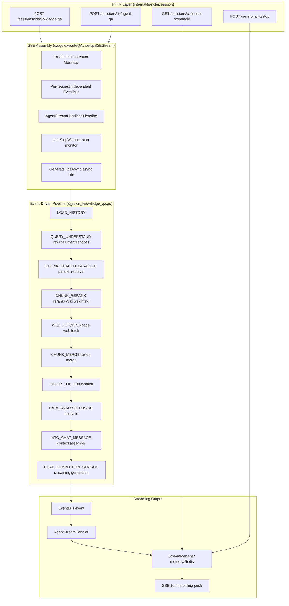
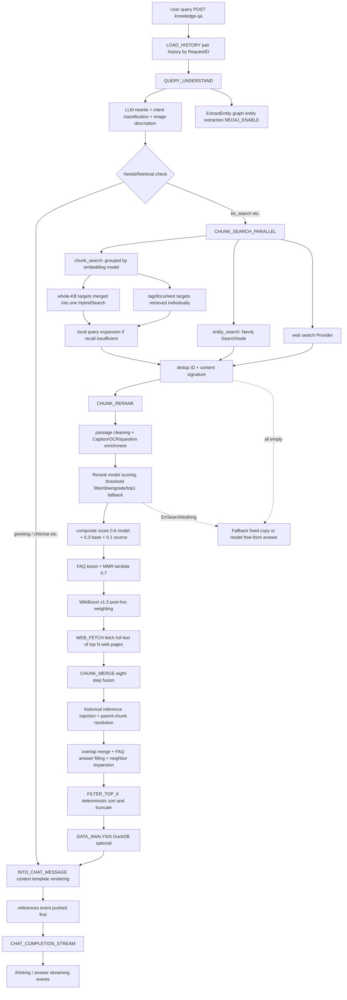
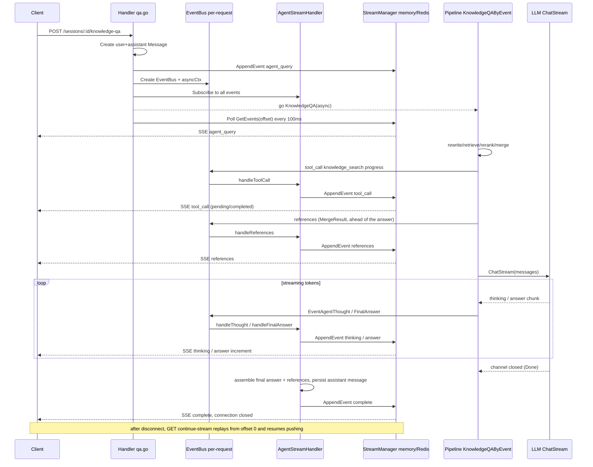

# Retrieval-Augmented Question Answering Pipeline (RAG Pipeline)

This document fully describes the end-to-end flow of a "knowledge Q&A" request in WeKnora, from the HTTP entry point to the streamed answer being persisted: SSE session assembly → event-driven Pipeline (intent recognition / query rewriting / parallel retrieval / rerank / fusion merge / filtering / data analysis / context assembly / streaming generation) → citation expansion → streaming output and disconnect-resume.

Source locations for each stage:

| Stage | Source location |
|------|----------|
| HTTP entry / SSE assembly | `internal/handler/session/qa.go`, `helpers.go`, `stream.go` |
| EventBus → stream event bridge | `internal/handler/session/agent_stream_handler.go` |
| Pipeline orchestration | `internal/application/service/session_knowledge_qa.go` |
| Plugin framework and all stage plugins | `internal/application/service/chat_pipeline/` |
| Plugin registration (DI container) | `internal/container/container.go` |
| Event/state types | `internal/types/chat_manage.go`, `internal/types/chat.go`, `internal/event/event.go` |
| Cross-database hybrid retrieval | `internal/application/service/knowledgebase_search*.go` |
| Stream manager (disconnect-resume) | `internal/stream/` (`factory.go`, `memory_manager.go`, `redis_manager.go`) |
| Session / message management | `internal/application/service/session.go`, `message.go` |
| Citation aliasing and expansion | `internal/llmreference/`, `internal/llmresource/` |
| Text utilities | `internal/searchutil/` |
| Prompt templates | `config/prompt_templates/`, `internal/config/config.go` |

## 1. Overall Architecture

WeKnora's Q&A pipeline is an **Event-Driven Plugin Pipeline**: each stage is a plugin implementing the `Plugin` interface, registered on the `EventManager`; the orchestrator (`KnowledgeQAByEvent`) triggers events one by one from a dynamically assembled `EventType` list, and plugins are chained together via a chain of responsibility (`next()`). Generated results are not written directly to the HTTP response — instead, events are published through a per-request independent `EventBus`, which the `AgentStreamHandler` lands into a shared `StreamManager` (in-memory or Redis); the HTTP layer polls every 100ms to push events to the SSE client. This design naturally supports **disconnect/reconnect resumption** and **distributed multi-replica deployment**.



## 2. Event-Driven Plugin Framework

### 2.1 Plugin Interface and Chain of Responsibility

`internal/application/service/chat_pipeline/chat_pipeline.go` defines the core abstraction:

```go
type Plugin interface {
    OnEvent(ctx context.Context, eventType types.EventType,
        chatManage *types.ChatManage, next func() *PluginError) *PluginError
    ActivationEvents() []types.EventType
}
```

The `EventManager` maintains an `eventType → []Plugin` mapping. During `Register`, plugins are appended in registration order, and `buildHandler` constructs a nested closure chain from back to front: **for the same event, plugins registered earlier sit in the outer layer of the chain, and those registered later sit in the inner layer** — an outer plugin only enters the inner layer when it calls `next()` inside `OnEvent`. A plugin can do pre-processing before `next()` (most plugins do this), or call `next()` first and do post-processing afterward (e.g. `PluginWikiBoost` applies weighting after reranking).

Errors propagate via `*PluginError`; predefined errors include `ErrSearchNothing` (retrieval returned nothing, triggers a fallback response instead of failing), `ErrRerank`, `ErrGetChatModel`, `ErrModelCall`, etc. (`chat_pipeline.go`).

### 2.2 Registration Order (container.go)

All plugins are constructed and self-register in the DI container via `container.Invoke` (`internal/container/container.go`); the registration order is the execution order on the same event chain:

```go
must(container.Provide(chatpipeline.NewEventManager))
must(container.Invoke(chatpipeline.NewPluginSearch))               // CHUNK_SEARCH
must(container.Invoke(chatpipeline.NewPluginRerank))               // CHUNK_RERANK (outer chain layer)
must(container.Invoke(chatpipeline.NewPluginWebFetch))             // WEB_FETCH
must(container.Invoke(chatpipeline.NewPluginMerge))                // CHUNK_MERGE
must(container.Invoke(chatpipeline.NewPluginDataAnalysis))         // DATA_ANALYSIS
must(container.Invoke(chatpipeline.NewPluginIntoChatMessage))      // INTO_CHAT_MESSAGE
must(container.Invoke(chatpipeline.NewPluginChatCompletion))       // CHAT_COMPLETION
must(container.Invoke(chatpipeline.NewPluginChatCompletionStream)) // CHAT_COMPLETION_STREAM
must(container.Invoke(chatpipeline.NewPluginFilterTopK))           // FILTER_TOP_K
must(container.Invoke(chatpipeline.NewPluginQueryUnderstand))      // QUERY_UNDERSTAND (outer chain layer)
must(container.Invoke(chatpipeline.NewPluginLoadHistory))          // LOAD_HISTORY
must(container.Invoke(chatpipeline.NewPluginExtractEntity))        // QUERY_UNDERSTAND (inner chain layer)
must(container.Invoke(chatpipeline.NewPluginSearchEntity))         // ENTITY_SEARCH
must(container.Invoke(chatpipeline.NewPluginSearchParallel))       // CHUNK_SEARCH_PARALLEL
must(container.Invoke(chatpipeline.NewPluginWikiBoost))            // CHUNK_RERANK (inner chain layer)
```

Full mapping of events to plugins (including same-event chain order):

| EventType | Plugin (in chain order) | Source file |
|-----------|---------------|--------|
| `load_history` | PluginLoadHistory | `load_history.go` |
| `query_understand` | PluginQueryUnderstand → PluginExtractEntity | `query_understand.go`, `extract_entity.go` |
| `chunk_search` | PluginSearch | `search.go`, `query_expansion.go` |
| `chunk_search_parallel` | PluginSearchParallel (internally composes PluginSearch + PluginSearchEntity) | `search_parallel.go` |
| `entity_search` | PluginSearchEntity | `search_entity.go` |
| `chunk_rerank` | PluginRerank → PluginWikiBoost | `rerank.go`, `wiki_boost.go` |
| `web_fetch` | PluginWebFetch | `web_fetch.go` |
| `chunk_merge` | PluginMerge | `merge.go`, `merge_overlap.go`, `merge_expand.go`, `merge_faq.go`, `merge_history.go` |
| `data_analysis` | PluginDataAnalysis | `data_analysis.go` |
| `into_chat_message` | PluginIntoChatMessage | `into_chat_message.go` |
| `chat_completion` | PluginChatCompletion | `chat_completion.go` |
| `chat_completion_stream` | PluginChatCompletionStream | `chat_completion_stream.go` |
| `filter_top_k` | PluginFilterTopK | `filter_top_k.go` |

### 2.3 ChatManage: The State Object That Spans the Whole Flow

`ChatManage` in `internal/types/chat_manage.go` is composed of three embedded parts:

- **PipelineRequest** (immutable request configuration): `Query`, `KnowledgeBaseIDs`/`KnowledgeIDs`/`SearchTargets`, `VectorThreshold`/`KeywordThreshold`/`EmbeddingTopK`, `RerankModelID`/`RerankTopK`/`RerankThreshold`, `ChatModelID`/`SummaryConfig`, `FallbackStrategy`, `CitationEnabled`, `EnableRewrite`/`EnableQueryExpansion`, FAQ strategy (`FAQPriorityEnabled`/`FAQDirectAnswerThreshold`/`FAQScoreBoost`), `DataAnalysisEnabled`, multimodal (`Images`/`VLMModelID`/`ChatModelSupportsVision`), Web search (`WebSearchEnabled`/`WebFetchEnabled`/`WebFetchTopN`), etc.
- **PipelineState** (intermediate state read/written between plugins): `RewriteQuery`, `Intent`, `History`, the three-tier `SearchResult` → `RerankResult` → `MergeResult` results, `Entity`/`EntityKBIDs`/`GraphResult`, `UserContent`, `RenderedContexts`, `SystemPromptOverride`, etc.
- **PipelineContext** (runtime handles): `EventBus`, `MessageID` (assistant message ID), `UserMessageID`.

`ChatManage.Clone()` provides a deep copy (avoiding concurrent read/write on shared slices during parallel retrieval), but does **not** copy `PipelineContext`.

### 2.4 Dynamic Pipeline Assembly (PipelineBuilder)

`KnowledgeQA` in `session_knowledge_qa.go` dynamically assembles the event list based on request characteristics:

```go
// Pure chat (no KB and Web search not enabled)
pipeline = types.NewPipelineBuilder().
    AddIf(hasHistory, types.LOAD_HISTORY).
    Add(types.CHAT_COMPLETION_STREAM).Build()

// RAG
pipeline = types.NewPipelineBuilder().
    AddIf(hasHistory, types.LOAD_HISTORY).
    Add(types.QUERY_UNDERSTAND).
    Add(types.CHUNK_SEARCH_PARALLEL).
    Add(types.CHUNK_RERANK).
    AddIf(req.WebSearchEnabled, types.WEB_FETCH).
    Add(types.CHUNK_MERGE).
    Add(types.FILTER_TOP_K).
    AddIf(chatManage.DataAnalysisEnabled, types.DATA_ANALYSIS).
    Add(types.INTO_CHAT_MESSAGE).
    Add(types.CHAT_COMPLETION_STREAM).Build()
```

The `types.Pipeline` map also retains static presets such as `chat` / `chat_stream` / `chat_history_stream` / `rag` / `rag_stream`, for callers that don't need dynamic assembly.

### 2.5 Orchestrator: KnowledgeQAByEvent

`KnowledgeQAByEvent` (`session_knowledge_qa.go`) triggers `eventManager.Trigger` one stage at a time, and does a substantial amount of surrounding work:

- Each stage is wrapped in a Langfuse span (`pipeline.<event_type>`); `CHAT_COMPLETION_STREAM` is the exception (its OnEvent returns immediately, so the span would end before the stream finishes).
- **Progress events**: `progress.go` merges `CHUNK_SEARCH_PARALLEL → CHUNK_RERANK → CHUNK_MERGE → FILTER_TOP_K` (including conditional `WEB_FETCH`/`DATA_ANALYSIS`) into a single frontend-visible `knowledge_search` tool_call progress window; `QUERY_UNDERSTAND` gets its own `query_understand` window. Error/short-circuit paths also close the window, preventing the frontend from spinning forever on "retrieving knowledge base."
- **References first**: before triggering `CHAT_COMPLETION_STREAM`, `emitKnowledgeReferencesEvent` is called to emit `MergeResult` as a `references` event — ensuring the client has already received the reference list before the SSE connection closes.
- **Cancellation priority**: at the end of each stage, `ctx.Err()` is checked first (a user stop cancels the context); this must happen before the `ErrSearchNothing` check, otherwise a stop would be misinterpreted as "retrieval returned nothing" and a fallback response would be written.
- **Fallback**: `ErrSearchNothing` → `handleFallbackResponse`: `FallbackStrategyFixed` sends the fixed copy `FallbackResponse` directly; `FallbackStrategyModel` lets the model answer freely using `FallbackPrompt`.

## 3. Detailed Look at Each Stage Plugin

### 3.1 LOAD_HISTORY — Loading Session History

`load_history.go`. `MaxRounds <= 0` means the Agent has explicitly disabled multi-turn (`MultiTurnEnabled=false`), and the stage is skipped directly — it does **not** fall back to a global default. Otherwise `loadAndProcessHistory` (`common.go`) is called:

1. `messageService.GetRecentMessagesBySession` fetches the most recent `maxRounds*2+10` messages;
2. Messages are paired into `types.History` by `RequestID` matching user/assistant pairs (the user side attaches image Captions and attachment prompts; the assistant side strips thinking tags with the regex `regThinkTags` and carries `KnowledgeReferences`);
3. The most recent `maxRounds` rounds are taken in reverse chronological order, then reversed back to chronological order and written into `chatManage.History`.

Note: replaying history plays back the user message's original `Content`, not `RenderedContent` (to avoid mixing old context envelopes into the current protocol); historical references are injected separately via `merge_history.go`.

### 3.2 QUERY_UNDERSTAND — Query Rewriting + Intent Recognition (+ Entity Extraction)

Two plugins are chained on the same event:

**PluginQueryUnderstand** (`query_understand.go`) handles rewriting and intent classification:

- Input combinations fall into three cases: text-only (chat model), text+image, image-only (prefers a vision-capable chat model, otherwise `VLMModelID`).
- The prompt comes from `config/prompt_templates/rewrite.yaml` (a system + user pair), which can be overridden at the Agent level by `RewritePromptSystem`/`RewritePromptUser`; placeholders `{conversation}` / `{query}` / `{language}` are rendered by `types.RenderPromptPlaceholders`.
- The model is required to output JSON: `{"rewrite_query":"...","intent":"kb_search","image_description":"..."}`; parsing is fault-tolerant (markdown wrapping, field aliases, OCR field merging) — if JSON parsing fails entirely, the original text is used as the rewritten query and `kb_search` is the default.
- Intent enum (`types.QueryIntent`): `kb_search`, `web_search`, `greeting`, `chitchat`, `follow_up`, `image_only`, `doc_only`, `summarize`, `clarification`. `NeedsKBRetrieval()` returns true only for `kb_search`/`clarification`/`summarize`/empty; `ChatManage.NeedsRetrieval()` additionally checks `WebSearchEnabled` for `web_search`. **All subsequent retrieval-type plugins use `NeedsRetrieval()` as the skip condition.**
- For non-retrieval intents, `applyIntentPromptOverride` sets `SystemPromptOverride` using `config/prompt_templates/intent_prompts.yaml` (template ids map one-to-one to intent values, e.g. `greeting`) or the Agent's override settings.
- The image description is written back asynchronously to the user message's `Images[0].Caption` (for use in the next round's history).
- `QueryUnderstandModelID` can specify a separate small model for this stage; on failure it falls back to `ChatModelID`.

**PluginExtractEntity** (`extract_entity.go`) runs in the inner chain layer: only when `NEO4J_ENABLE=true` and there is a knowledge base within the retrieval scope with `ExtractConfig.Enabled`, it calls the LLM via `config.ExtractManager.ExtractEntity`'s template (`graph_extraction.yaml`) to extract query entities, writing them into `chatManage.Entity` / `EntityKBIDs` / `EntityKnowledge`, for use by `ENTITY_SEARCH`.

### 3.3 CHUNK_SEARCH_PARALLEL — Parallel Retrieval (chunk + graph entities)

`search_parallel.go`. If `NeedsRetrieval()` is false, the stage is skipped directly. Otherwise `chatManage` is `Clone()`d twice, and `RunParallel` executes concurrently:

- `chunk_search`: the internal (unregistered) `PluginSearch.OnEvent(CHUNK_SEARCH, ...)`;
- `entity_search`: when entities exist, `PluginSearchEntity.OnEvent(ENTITY_SEARCH, ...)` executes, running `SearchNode` in parallel against Neo4j by `NameSpace{KnowledgeBase, Knowledge}`, converting matched graph nodes/relationships into SearchResults and assembling `GraphResult`.

The two result sets are merged and deduplicated by `removeDuplicateResults` (by chunk ID + content signature `searchutil.BuildContentSignature`). If both are empty, `ErrSearchNothing` is returned.

**PluginSearch** (`search.go`) internally runs two more concurrent paths:

1. **KB retrieval** `searchByTargets`:
   - `SearchTargets` are grouped by "embedding model identity" (`model.Name + BaseURL`, shareable across tenants) via `ResolveEmbeddingModelKeys`, with the query vector (`GetQueryEmbedding`) computed only once per group;
   - Within a group, whole-KB targets with no tag/document constraints are merged into a **single** `HybridSearch` call (`params.KnowledgeBaseIDs` carries multiple KBs), while constrained targets are queried individually via `searchSingleTarget` (carrying `KnowledgeIDs`/`TagIDs`/`ScopeTagIDs`; targets with an explicitly delimited scope can `DisableRecallThresholds` to turn off recall thresholds);
2. **Web search** `searchWebIfEnabled`: when `WebSearchEnabled`, calls `webSearchService.Search` using the `WebSearchProviderID` resolved from the tenant/Agent; results are converted to SearchResult via `searchutil.ConvertWebSearchResults` (URL as ID, `KnowledgeSource="web_search"`).

**Query expansion** (`query_expansion.go`): triggered when `EnableQueryExpansion` is set and the initial recall count is below `EmbeddingTopK`. This does not call an LLM — it locally generates query variants (stop-word removal, word-order adjustment, key-phrase extraction, etc.). Chinese word segmentation goes through `types.Jieba.CutForSearch`: contiguous Chinese-character spans are handed whole to jieba for word segmentation, while mixed Chinese/English/numeric text is segmented by switching per script rather than degrading to "one Chinese character = one token"; stop-word and length filtering count by rune, avoiding multi-byte characters being misjudged as single characters. Each (variant × SearchTarget) combination executes `HybridSearch` concurrently (semaphore capped at 16), with the keyword threshold relaxed to 0.8× the original value, and TopK expanded to `max(EmbeddingTopK, RerankTopK) * 2`.

### 3.4 CHUNK_RERANK — Reranking, Composite Scoring, MMR, Wiki Weighting

**PluginRerank** (`rerank.go`, 720 lines):

1. **Passage cleaning** `cleanPassageForRerank`: reranking models perform semantic similarity matching, so Markdown structural syntax is noise. Code blocks and `$$...$$` formula blocks **only have their fences stripped, keeping the inner body text** (the earlier implementation deleted the whole block, causing candidates that were pure code or pure formulas to be reduced to empty strings and lose score); HTML tags, image references, link markup (text kept), bare URLs, table separator rows (data rows joined with commas), and heading/quote/bold/list markers are stripped in sequence, then excess blank lines are collapsed.
2. **Passage enrichment** `getEnrichedPassage`: appends `ImageInfo` Caption/OCR text and the generated questions (GeneratedQuestions) from `ChunkMetadata`.
3. Calls `rerankModel.Rerank(ctx, RewriteQuery, passages)`, filtering by `RerankThreshold`:
   - If everything falls below the threshold but top1 ≥ `rerankFallbackMinScore` (default 0.15; 0 when the user has explicitly delimited a tag/document scope, preserving the best candidate within an authoritative scope) → keep top1 as a fallback;
   - If there are no results and the threshold > 0.3 → **threshold downgrade** retry once (`threshold * 0.7`, floor 0.3);
   - If the Rerank API call fails → fall back to the original retrieval results and continue the pipeline.
4. **Composite scoring** `compositeScore`: `0.6*model score + 0.3*retrieval base score + 0.1*source weight` (web_search source weight 0.95, others 1.0), clamped to [0,1]. The base score/model score are recorded in `Metadata["base_score"]` / `["model_score"]`. An earlier version also multiplied in a "the closer to the front of the document, the higher" positional prior (±0.05); it has been removed because it was coupled to offset shifts from chunk edits with unclear benefit.
5. **FAQ weighting**: when `FAQPriorityEnabled` and `FAQScoreBoost > 1.0`, FAQ chunk scores are multiplied by the boost (capped at 1.0), recorded as `Metadata["faq_boosted"]`.
6. **MMR diversity selection** `applyMMR` (λ=0.7, k=`RerankTopK`): `mmr = 0.7*relevance - 0.3*max_jaccard_redundancy`, using `searchutil.TokenizeSimple` + `Jaccard` to precompute token sets in parallel, greedily selecting `RerankResult` iteratively.

**PluginWikiBoost** (`wiki_boost.go`) is registered in the inner chain layer of the same event; its OnEvent calls `next()` first (waiting for reranking to complete) and does post-processing afterward: if the `RerankResult` contains a `wiki_page`-type chunk and the retrieval targets do include a KB with Wiki enabled, scores are multiplied by `wikiBoostFactor = 1.3` and stably re-sorted — Wiki pages are LLM-presynthesized knowledge, prioritized over raw chunks.

### 3.5 WEB_FETCH — Full Web Page Fetching

`web_fetch.go`. Only runs when `WebFetchEnabled && WebSearchEnabled`. Takes the top `WebFetchTopN` (default 3) web results from `RerankResult` and fetches their body content in parallel via `web_fetch.FetchURLContent(ctx, url)`, replacing the summary snippet (truncated to 8000 bytes). Positioned after reranking and before merging — so fetch cost is paid only for high-scoring web pages that will actually make it into the context.

### 3.6 CHUNK_MERGE — Eight-Step Fusion Merge

The comment on `OnEvent` in `merge.go` itself describes the flow:

1. **Select input**: prefer `RerankResult`, falling back to `SearchResult` (sorted by score) if empty;
2. **Deduplicate**: by ID + content signature;
3. **Inject historical references** (`merge_history.go`): take `KnowledgeReferences` from the most recent round of history that has references, filter by Jaccard similarity against the current query (threshold 0.15), discount the score by 0.6, inject at most 3 entries, marked `MatchTypeHistory`;
4. **Parent-chunk resolution** `resolveParentChunks`: both text sub-chunks and image_ocr/image_caption sub-chunks are backfilled with context using the **current** parent_text content; the narrowing of image Markdown relies on stable image URLs (`PruneMarkdownImagesByImageInfo`) rather than parser coordinates; ImageInfo is strictly scoped to the matched text sub-chunk, preventing an image-dense parent chunk from flooding the context with sibling pages' OCR. The image → text → parent_text chain only performs the extra grandparent-chunk lookup when an image result was actually hit;
5. **Grouped sequential merge** `groupAndMergeCurrentContent`: groups by `KnowledgeID + ChunkType`, sorts within groups by `ChunkIndex`, then `mergeSequentialChunks` — concatenates via `searchutil.JoinChunkContent` when indices are sequential or one side's content contains the other, keeping the highest score; `SubChunkID` records the merged-in chunks, and `mergeImageInfo` deduplicates and merges image info by URL;
6. **FAQ answer filling** (`merge_faq.go`): FAQ-type chunks are batch-loaded from the table to read `FAQMetadata`, rewriting Content into `Q: standard question + Answer: answer list`;
7. **Short-context neighbor expansion** (`merge_expand.go`): when a text chunk's content is under 350 characters, its `PreChunkID`/`NextChunkID` neighbors are batch-fetched and concatenated up to a maximum of 850 characters;
8. New duplicates introduced by expansion are **merged again**, followed by final deduplication + `removePartialOverlaps` (normalized containment checks / cross-KB near-duplicates with token overlap ratio ≥ 0.85 are removed, with lower-scoring ones dropped).

The result is written into `chatManage.MergeResult`.

::: tip Why character offsets are no longer used
Since chunks support manual editing, parser coordinates like `StartAt` / `EndAt` can no longer reliably represent "where the current content sits in the original text" — a single edit can make the interval length mismatch the body length. As a result, the merge stage has fully switched to using **current body text + `ChunkIndex` sequence number** to determine adjacency and containment relations (`JoinChunkContent` / `ContainsChunkContent` perform text-level dedup and concatenation); source coordinates are retained only for citation positioning. `FILTER_TOP_K`'s tiebreaker key has also been changed from `StartAt`/`EndAt` to `ChunkIndex`.
:::

### 3.7 FILTER_TOP_K — Deterministic Sorting and Truncation

`filter_top_k.go`. Runs `sortSearchResultsDeterministically` on `MergeResult` (falling back in order to `RerankResult`/`SearchResult` if absent) — sorting descending by score, with `KnowledgeID`/`ChunkType`/`ChunkIndex`/`ID` as a stable tiebreaker (the merge stage's map iteration can scramble order, and this restores globally reproducible ordering), then truncates to `RerankTopK`.

### 3.8 DATA_ANALYSIS — DuckDB Tabular Data Analysis

`data_analysis.go`. Disabled by default (`DataAnalysisEnabled` comes from Agent configuration). If `MergeResult` includes a CSV/Excel file: `table_column`/`table_summary`-type chunks are filtered out first, the first data file is taken, `tools.NewDataAnalysisTool` loads the file into DuckDB to obtain the schema, and the LLM decides whether data analysis is needed and generates DuckDB SQL (structured output `DataAnalysisInput`); after execution, the result is appended to `MergeResult` as a synthetic SearchResult of type `MatchTypeDataAnalysis` with score=1.0.

### 3.9 INTO_CHAT_MESSAGE — Context Assembly

`into_chat_message.go`:

- `utils.ValidateInput` validates query safety (injection protection);
- Non-retrieval-intent path: still goes through `ContextTemplate` rendering (`contexts` is empty), to inject runtime metadata such as `current_time`;
- **FAQ priority strategy**: when `FAQPriorityEnabled`, FAQ and document results are split into two sections, `source type="faq" priority="high"` and `source type="document" priority="supplementary"`; when the top FAQ score ≥ `FAQDirectAnswerThreshold`, its context is marked `match="exact"` (prompting the model that it may adopt that answer directly);
- Normal path: each enriched passage is wrapped in `context id="N"` order (`getEnrichedPassageForChat` inlines ImageInfo into the content as a Markdown image + description);
- Header `buildDocumentHeader` outputs deduplicated document metadata (title/description);
- Renders `SummaryConfig.ContextTemplate` (from `config/prompt_templates/context_template.yaml`), with placeholders `{query}` / `{contexts}` / `{language}`; appends image descriptions (for non-vision models), quoted context `QuotedContext`, and attachment prompts;
- The assembled `UserContent` is **asynchronously written back** to the user message's `RenderedContent` (`persistRenderedContent`), for auditing and debugging; `RenderedContexts` stores the plain contexts string for citation substitution.

### 3.10 CHAT_COMPLETION / CHAT_COMPLETION_STREAM — Generation

The two plugins share helper functions in `common.go`:

- `prepareChatModel`: fetches the chat model and assembles `ChatOptions` (Temperature/TopP/Seed/MaxTokens/Thinking, etc.) from `SummaryConfig`;
- `prepareMessagesWithHistory`: the system prompt is `SystemPromptOverride` (intent override) or `SummaryConfig.Prompt` (`system_prompt.yaml`); after rendering placeholders, if the retrieved context contains Markdown images, a "retrieved image output requirement" paragraph is appended (`appendRetrievedImageOutputRequirement`); history Q/A pairs are then appended in chronological order, followed by the current user message (with `Images` attached for vision models).

`prepareMessagesWithReferences` in `references.go` performs **citation alias substitution** on top of this (see §7 for details): it replaces the positionally-numbered contexts in `RenderedContexts` with a per-request-isolated chunk alias view generated by `llmreference.Registry`, and appends the citation protocol to the end of the system prompt.

**Streaming version** (`chat_completion_stream.go`) requires the `EventBus` to exist; after calling `chatModel.ChatStream`, it starts a goroutine to consume the response channel:

- `ResponseTypeThinking` → after double-decoding through `llmresource.StreamDecoder` (restoring res:// resource aliases) and `llmreference.StreamExpander` (expanding ref citation tags), it's emitted as `EventAgentThought`;
- `ResponseTypeAnswer` → likewise double-decoded and emitted as `EventAgentFinalAnswer`. A final answer marked `Done` is **forwarded only once**: some providers send a completion once by `finish_reason` and again at the stream-end sentinel — forwarding it twice would cause the answer event to be ordered after the session's complete event;
- `ResponseTypeError` → `EventError`;
- When the channel closes or ctx is cancelled, `flushDecoders` flushes the decoders' buffered trailing bytes (so aliases spanning chunk boundaries aren't lost) before closing the thinking stream.

**Non-streaming version** (`chat_completion.go`) calls `Chat` directly, then `resourceRefs.DecodeResponse` + `sourceRefs.ExpandResponse` restore the full text, and the result is written to `chatManage.ChatResponse`.

## 4. Complete RAG Flow Diagram



## 5. Session and Message Management

### 5.1 Session Service (`session.go`)

- Full CRUD: `CreateSession` / `GetSession` (tenant + shared scope) / `GetOwnedSession` (strict ownership, used for destructive operations like stop) / paginated listing / `SetSessionPinned` / `UpdateSessionLastRequestState` (remembers input-bar state: Agent/model/KB/Web search selections, UI-only) / single delete, bulk delete, clear.
- **Title generation**: `GenerateTitleAsync` is triggered asynchronously during SSE assembly (when the session has no title), calling the same model used for the conversation via the `generate_session_title.yaml` template; the result flows out via the `EventSessionTitle` event (SSE `response_type=session_title`), and the HTTP layer waits up to another 3 seconds after complete to receive the title event.

### 5.2 Message Service (`message.go`)

- User and assistant messages are linked into one round by the same `RequestID`; the user message is `IsCompleted=true` as soon as the request is made, while the assistant message has its content and references filled in by `completeAssistantMessage` after streaming ends (or is stopped).
- `UpdateMessageRenderedContent` / `UpdateMessageImages` are called asynchronously by `INTO_CHAT_MESSAGE` and `QUERY_UNDERSTAND` respectively to write back.
- `GetRecentMessagesBySession` is the data source for history loading.
- Additional capabilities: `IndexMessageToKB` (writes the Q&A pair into a "chat history knowledge base" for cross-session search), `SearchMessages` (vector + rerank message search).

## 6. Streaming Output Mechanism

### 6.1 StreamManager: Append-Only Event Stream

`internal/stream/factory.go` selects the implementation based on the `STREAM_MANAGER_TYPE` environment variable:

| Implementation | Storage | Key points |
|------|------|--------|
| `memory` (default) | In-process `map[sessionID]map[messageID]*events` + RWMutex | Single-node deployment; `GetEvents` returns a copy of events to avoid races |
| `redis` | Redis List, key = `{REDIS_PREFIX or stream:events}:{sessionID}:{messageID}` | `AppendEvent` = RPUSH + refresh TTL (factory passes 1 hour); `GetEvents` = LRANGE offset..-1; shared across multi-replica deployments — stop events are also propagated cross-node through it |

The interface has only two methods: `AppendEvent(ctx, sessionID, messageID, StreamEvent)` and `GetEvents(ctx, sessionID, messageID, fromOffset) (events, nextOffset, error)` — **producers only append, consumers pull by offset** — which lets any node at any time replay from the beginning.

### 6.2 Event Flow: EventBus → AgentStreamHandler → StreamManager → SSE

1. `setupSSEStream` (`qa.go`) creates an **independent** `event.EventBus` and cancellable `asyncCtx` for each request;
2. `AgentStreamHandler.Subscribe()` (`agent_stream_handler.go`) subscribes to `thought` / `tool_call` / `tool_result` / `references` / `final_answer` / `reflection` / `error` / `session_title` / `agent.complete` / tool approval / MCP OAuth events, converting them into `StreamEvent`s appended to StreamManager. It also accumulates `answerSegments` in memory (segmented by answer event ID; non-final-round "preambles" are marked superseded when a later tool_call appears, and are not persisted into the final answer) and `knowledgeRefs`, assembling the assistant message into storage when the stream ends;
3. The HTTP layer's `handleAgentEventsForSSE` (`stream.go`) polls `GetEvents` with a 100ms ticker, wrapping each `StreamEvent` via `buildStreamResponse` into a `types.StreamResponse` and pushing it with `c.SSEvent("message", response)`; it ends upon receiving a `complete` event (for new sessions, it waits up to another 3s for the title event).

### 6.3 SSE Protocol and response_type Event Types

SSE headers are set by `setSSEHeaders` (`text/event-stream`, `no-cache`, `keep-alive`, `X-Accel-Buffering: no`). Each SSE `message` is a JSON `StreamResponse` (`internal/types/chat.go`):

```go
type StreamResponse struct {
    ID                  string       `json:"id"`            // request_id
    ResponseType        ResponseType `json:"response_type"`
    Content             string       `json:"content"`       // incremental chunk, client accumulates
    Done                bool         `json:"done"`
    KnowledgeReferences References   `json:"knowledge_references,omitempty"`
    SessionID           string       `json:"session_id,omitempty"`
    AssistantMessageID  string       `json:"assistant_message_id,omitempty"`
    Data                map[string]interface{} `json:"data,omitempty"`
    ...
}
```

Full list of `response_type` values (`internal/types/chat.go`, plus `stop` which is used at the handler layer):

| response_type | Meaning |
|---------------|------|
| `agent_query` | Query accepted, carries `session_id` / `assistant_message_id` (the client uses this to get the message_id needed for resumption) |
| `thinking` | Incremental thinking process (reasoning_content) |
| `answer` | Incremental answer text |
| `references` | Knowledge citation list (`knowledge_references` field) |
| `tool_call` / `tool_result` | Agent/progress tool calls and results (the RAG pipeline's `knowledge_search` and `query_understand` progress also use these two types) |
| `reflection` | Agent reflection |
| `session_title` | Asynchronously generated session title |
| `error` | Error (`Done=true` indicates a terminal error) |
| `complete` | Stream-end marker (the frontend uses this to wrap up, no longer relying on empty answer+done) |
| `tool_approval_required` / `tool_approval_resolved` | Dangerous MCP tool approval request/result |
| `mcp_oauth_required` / `mcp_oauth_resolved` | MCP OAuth authorization request/result |
| `stop` | User stop notification (constructed at the handler layer) |

### 6.4 Disconnect Resumption (continue-stream) and Stop

**Resumption**: `GET /sessions/continue-stream/:session_id?message_id=...` (`stream.go` ContinueStream). After validating the session and message, it calls `GetEvents` from offset 0 to **replay all historical events**; if a `complete` is already present it wraps up immediately, otherwise it continues polling every 100ms to push new events until complete — since the generation goroutine is completely decoupled from the SSE connection (events are written to StreamManager), a page refresh or network blip won't interrupt generation.

**Stop**: `POST /sessions/:id/stop` (with strict ownership validation) appends a `stop` event to StreamManager; two paths consume it: the SSE polling loop detects it and sends `EventStop` to the EventBus; a separate `startStopWatcher` (300ms polling, independent of the client connection, with a 2-hour fallback timeout) ensures the stop can still cancel generation even after the client has disconnected. `setupStopEventHandler`, upon receiving `EventStop`, calls `cancel()` on asyncCtx, and uses `context.WithoutCancel` to preserve the partial content already streamed out.

### 6.5 Streaming Q&A Sequence Diagram



## 7. Citation Generation Mechanism

### 7.1 llmreference: Request-Scoped Source Aliasing and ref Expansion

`internal/llmreference/registry.go`. Goal: **internal IDs never enter the model context, and the model's output citations can be safely expanded**.

- The `Registry` (one instance per answer, covering all of an Agent's tool rounds, never persisted across requests) assigns low-entropy aliases to sources: `cN` = knowledge chunk, `wN` = web page, `dN` = document, `bN` = knowledge base.
- `ProtocolPrompt(citationsEnabled)` is appended to the system prompt: when citations are enabled, the model is required to cite inline using self-closing tags in the form `ref id="cN"` (custom kb/web tags are forbidden); when disabled (`PipelineRequest.CitationEnabled=false`, enabled by default) any citation output is forbidden.
- `prepareMessagesWithReferences` in `references.go` registers `MergeResult` in FAQ-priority order via `RegisterSearchResults`, and uses `ModelOutput` (`model_output.go`) to render knowledge/web results into a compact XML view intended for the model (`display_type=search_results` / `web_search_results`), **replacing** the message's original `RenderedContexts`.
- `ref` tags in the model's output are expanded into public-facing tags by `ExpandText` / `StreamExpander` (streaming, handles tags split across chunks): chunk → `kb` tag (carrying attributes like chunk_id, knowledge_id), web page → `web url title` tag; unknown aliases are fail-closed and simply removed. The frontend renders superscript citations based on this.
- Independently of inline citations, `MergeResult` is always pushed in full as a `references` SSE event (driving the "retrieved results" panel), even when inline citations are disabled.

### 7.2 llmresource: Storage Resource Handle Aliasing

`internal/llmresource/registry.go` addresses a different problem: high-entropy storage handles such as `resource://`, `minio://`, `cos://`, as well as wiki `summary/<uuid>` slugs, are prone to being mangled by the model when it repeats a URL after it has entered the model context. `EncodeMessages` replaces them with low-entropy aliases in the form `res://0001`; on streaming output, `StreamDecoder` restores them (`Flush` ensures aliases spanning chunk boundaries aren't truncated or lost), and tool-call parameters have the real handles filled back in after decoding as well.

## 8. Cross-Database Concurrent Retrieval and Fusion (HybridSearch)

`internal/application/service/knowledgebase_search.go` is the convergence point for all retrieval (shared by the chat pipeline, Agent tools, and the search API):

1. **Authorization and validation**: batch-loads KBs (including cross-tenant Organization-shared KBs), authorizing each individually via `authorizeKBAccess`; `validateSameEmbeddingModel` rejects multi-KB retrieval across different embedding spaces (wiki/graph KBs without a vector store are exempt).
2. **Over-recall**: `matchCount = max(MatchCount*5, 50) * len(KBs)`, capped at 500.
3. **Query vector computed only once**, propagated to all store groups via `params.QueryEmbedding`.
4. **storeGroup grouping** (`knowledgebase_search_storegroup.go`): grouped by `(VectorStoreID, owning tenant)`; each group resolves a `CompositeRetrieveEngine` via `retriever.CreateRetrieveEngineForKB`. `buildRetrievalParams` routes by each KB's type within the group: FAQ KBs go through the FAQ vector index (`KnowledgeType=faq`, no keyword index), document KBs go through the default vector index + keyword index.
5. **Fan-out** (`knowledgebase_search_fanout.go`): a single group is queried directly with zero overhead; multiple groups run concurrently via `errgroup` (capped at 4), each group timing out at `MULTI_STORE_RETRIEVE_TIMEOUT_SEC` (default 30s), with an all-or-nothing failure policy; when results span engine types, `EngineAwareNormalizer` normalizes vector scores to [0,1] (see the retrieval engine documentation for details).
6. **Fusion** (`knowledgebase_search_fusion.go`):
   - Vector-only or keyword-only → `deduplicateByScore` (keeps the highest score per chunk);
   - Hybrid → **weighted RRF**: `score = vectorWeight/(k+vectorRank) + keywordWeight/(k+keywordRank)`, where `k` and the weights come from the tenant's `RetrievalConfig` (with defaults), and rank is based on each retriever's own returned order (1-indexed), making it immune to score-scale differences.
7. **FAQ hit strategy** (`knowledgebase_search_faq.go`, FAQ-type KBs only):
   - **Iterative retrieval**: if, after deduplication, results fall short of `MatchCount` and the first round already maxed out its TopK → up to 5 rounds of doubling TopK starting from `TopK*3`, applied consistently across store groups, with chunk data cached to avoid redundant lookups;
   - **Negative-question filtering**: an exact match (lowercased, whitespace-stripped) between the query and an FAQ's `NegativeQuestions` excludes that entry — supporting operational configuration like "don't use this FAQ to answer this question."
8. After truncating to `MatchCount`, `processSearchResults` fills in chunk metadata (in the pipeline scenario `SkipContextEnrichment=true`, leaving context assembly to the merge stage).

The pipeline-side companion FAQ strategies (Agent config `FAQPriorityEnabled` / `FAQScoreBoost` / `FAQDirectAnswerThreshold`) are covered in §3.4 and §3.9.

## 9. Keyword Extraction and searchutil

`config/prompt_templates/keywords_extraction.yaml` provides a system+user template pair for "extract up to 5 keywords from the question," loaded via the `prompt_templates` loader in `internal/config/config.go` and exposed to the frontend configuration through the tenant template API (`internal/handler/tenant.go`). Query expansion within the pipeline (§3.3), by contrast, uses LLM-free local heuristics to generate keyword variants.

`internal/searchutil/` is a pure-function library shared by retrieval and merging:

| File | Key functions | Purpose |
|------|----------|------|
| `textutil.go` | `BuildContentSignature` / `NormalizeContent` / `IsContentContained` / `ContentOverlapRatio` | Content-signature deduplication, normalization, containment/overlap-ratio checks (merge dedup) |
| `textutil.go` | `TokenizeSimple` / `Jaccard` | Simple tokenization (Chinese by character, English by word) and Jaccard similarity (MMR, historical reference filtering) |
| `chunkmerge.go` | `AppendWithOverlap` / `MergeTextChunks` | Concatenating overlapping chunks by text matching |
| `imageinfo.go` / `imageinfo_match.go` | `CollectImageInfoByChunkIDs`, `EnrichContentWithImageInfoForChat`, `FilterImageInfoByMatchRange`, `PruneMarkdownImagesOutsideRange`, `SliceContentByDocumentRange` | Image info collection, filtering by hit window, content enrichment |
| `conversion.go` | `ConvertWebSearchResults` | Converting web search results to SearchResult |
| `normalize.go` | `NormalizeKeywordScores` | Keyword score normalization utility |

## 10. Prompt Templates and Code Mapping

Templates are loaded by `loadPromptTemplates` in `internal/config/config.go` from the `config/prompt_templates/` directory into `PromptTemplatesConfig`; each yaml is a list of templates with `id`/`i18n`/`default`, and config items such as `system_prompt_id` / `context_template_id` resolve default template text by id.

| Template file | Config field | Used in |
|----------|----------|----------|
| `rewrite.yaml` | `Conversation.RewritePromptSystem/User` | `query_understand.go` rewriting + intent classification (includes `{conversation}`/`{query}`/`{language}` placeholders) |
| `intent_prompts.yaml` | `Conversation.IntentSystemPrompts` | System prompt override for non-retrieval intents (template id = intent value) |
| `system_prompt.yaml` | `Conversation.Summary.Prompt` | RAG answer system prompt (`common.go prepareMessagesWithHistory`) |
| `context_template.yaml` | `Conversation.Summary.ContextTemplate` | Retrieved-context rendering (`into_chat_message.go`) |
| `fallback.yaml` | `Conversation.FallbackPrompt/Response` | Fallback when retrieval returns nothing (`handleFallbackResponse`) |
| `generate_session_title.yaml` | — | Asynchronous session title generation (`session.go GenerateTitle`) |
| `keywords_extraction.yaml` | `PromptTemplates.KeywordsExtraction` | Keyword extraction template (exposed via tenant template API) |
| `generate_questions.yaml` / `generate_summary.yaml` | — | Ingestion enrichment (question generation/summarization, see the document ingestion documentation) |
| `graph_extraction.yaml` | `ExtractManager.ExtractEntity/ExtractGraph` | Query entity extraction (`extract_entity.go`) and graph construction |
| `agent_system_prompt.yaml` | — | Agent-mode system prompt (see the Agent documentation) |

Placeholders are uniformly rendered via `types.RenderPromptPlaceholders` (`{query}`, `{contexts}`, `{conversation}`, `{language}`, etc.). The citation protocol (§7.1) is appended at the system level and is **not** part of any user-editable template.
