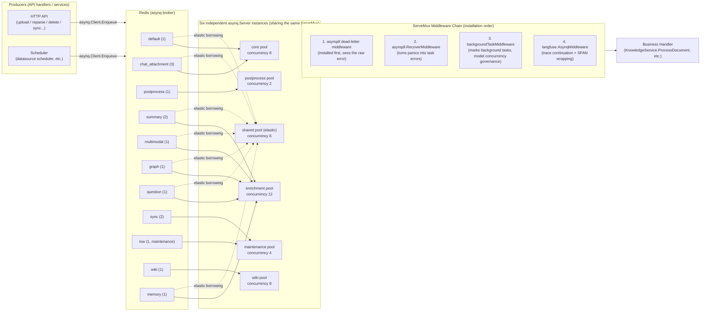
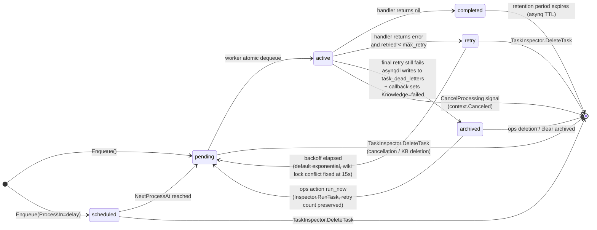
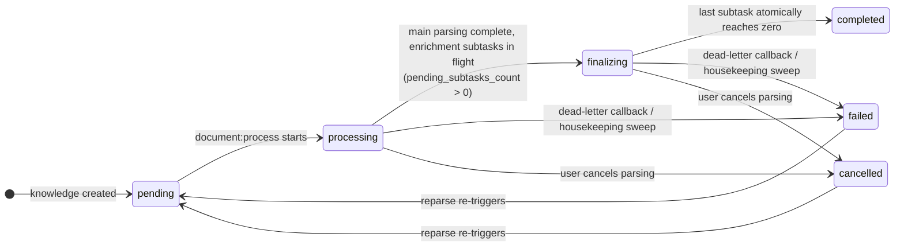

# Async Task System

Document parsing, index building, summary and question generation, graph extraction, Wiki generation, data source synchronization, and bulk operations are scheduled by the task system. Standard deployments use [asynq](https://github.com/hibiken/asynq) and Redis; Lite mode uses an executor that doesn't need Redis. Both modes share the same task handling logic but differ in how tasks are executed and in their operational capabilities.

## Overall Architecture: Dual Execution Modes {#_1-overall-architecture-dual-execution-modes}

WeKnora has two task execution modes, selected based on deployment form:

- **asynq mode (standard deployment)**: Tasks are serialized by `asynq.Client` into a JSON payload and written to a Redis queue, consumed by several independent `asynq.Server` instances (worker pools). `RunAsynqServer()` in `internal/router/task.go` builds a unified `asynq.ServeMux` and runs it across 6 pools.
- **Lite mode (standalone / macOS App, no Redis)**: `SyncTaskExecutor` in `internal/router/sync_task.go` implements the same `interfaces.TaskEnqueuer` interface — `Enqueue` dispatches the task directly to a goroutine for execution, supporting the `ProcessIn` (delay) and `MaxRetry` options; retries use linear backoff (`attempt * 5s`, capped at 30s). A panic inside a handler is caught and treated as a failure, so it doesn't bring down the process.

```go
// internal/router/sync_task.go
// SyncTaskExecutor executes tasks synchronously (in a goroutine) without Redis.
// Used in Lite mode as a drop-in replacement for *asynq.Client.
```

The set of handlers registered in both modes is fully identical (compare `RunAsynqServer` with `RegisterSyncHandlers`), ensuring task semantics don't drift across deployment forms.

## Redis's Role in the System {#_2-redis-s-role-in-the-system}

| Role | Description | Source Location |
| --- | --- | --- |
| asynq broker | All task queues (pending list, scheduled/retry ZSET, archived ZSET) are stored in Redis; dequeue is atomic (`BRPOPLPUSH`), guaranteeing a task is executed by only one worker | `internal/router/task.go` `getAsynqRedisClientOpt()` |
| Task inspection data source | `asynq.Inspector` + direct paginated reads via `LPos`/`ZRank`/`ZRevRank` | `internal/router/task_inspector.go` |
| Wiki ingest mutex | `wiki:active:<kbID>`, the finalize lock, and the slug lock are all `SetNX` + TTL | `internal/application/service/wiki_ingest.go`, `wiki_ingest_batch.go` |
| Multimodal subtask counter | Image subtask completion counter (DECR); the last attempt triggers finalize | `image_multimodal`-related services |
| Rate limiting | Sliding-window rate-limit ZSET (see observability docs) | `internal/ratelimit/limiter.go` |

Redis connection parameters come from the environment variables `REDIS_ADDR` / `REDIS_USERNAME` / `REDIS_PASSWORD` / `REDIS_DB` / TLS configuration. Read/write timeouts are controlled by `WEKNORA_REDIS_OP_TIMEOUT_MS`, defaulting to 500ms (the write timeout is 2x that, to absorb head-of-queue blocking):

```go
// internal/router/task.go
const defaultRedisOpTimeoutMs = 500
opt := &asynq.RedisClientOpt{
    Addr:        os.Getenv("REDIS_ADDR"),
    ReadTimeout: time.Duration(timeoutMs) * time.Millisecond,
    WriteTimeout: time.Duration(timeoutMs*2) * time.Millisecond,
    ...
}
```

## Task Type List {#_3-task-type-list}

Task type constants are defined in `internal/types/task.go`:

| Task Type | Constant | Purpose | Queue |
| --- | --- | --- | --- |
| `document:process` | `TypeDocumentProcess` | Document parsing entry point (DocReader / chunking / vectorization) | `default` |
| `manual:process` | `TypeManualProcess` | Manual knowledge update (cleanup + re-indexing) | `default` |
| `temporary_document:process` | `TypeTemporaryDocumentProcess` | Parsing of session-scoped temporary documents (chat attachments) | `chat_attachment` |
| `knowledge:post_process` | `TypeKnowledgePostProcess` | Unified scheduling of knowledge post-processing (fans out enrichment subtasks) | `postprocess` |
| `knowledge:auto_tag` | `TypeKnowledgeAutoTag` | Automatically associates a document with existing tags | `summary` |
| `memory:extract` | `TypeMemoryExtract` | Background extraction of personal memory | `memory` |
| `summary:generation` | `TypeSummaryGeneration` | Summary + document profile generation | `summary` |
| `kb:profile` | `TypeKnowledgeBaseProfile` | Knowledge base description (profile aggregation + one small-model call, skipped if the hash hasn't changed) | `summary` |
| `datatable:summary` | `TypeDataTableSummary` | Table summarization | `summary` |
| `image:multimodal` | `TypeImageMultimodal` | Image OCR + VLM captioning | `multimodal` |
| `chunk:extract` | `TypeChunkExtract` | Graph entity/relationship extraction (per chunk) | `graph` |
| `question:generation` | `TypeQuestionGeneration` | Question generation (fanned out by chunk batch) | `question` |
| `datasource:sync` | `TypeDataSourceSync` | Data source synchronization | `sync` |
| `faq:import` | `TypeFAQImport` | FAQ import (including dry run) | `low` (maintenance) |
| `kb:clone` | `TypeKBClone` | Knowledge base cloning | `low` |
| `kb:delete` | `TypeKBDelete` | Knowledge base deletion | `low` |
| `index:delete` | `TypeIndexDelete` | Index deletion | `low` |
| `knowledge:list_delete` | `TypeKnowledgeListDelete` | Bulk knowledge deletion | `low` |
| `knowledge:list_reparse` | `TypeKnowledgeListReparse` | Bulk reparsing | `low` |
| `knowledge:move` | `TypeKnowledgeMove` | Knowledge relocation | `low` |
| `wiki:ingest` | `TypeWikiIngest` | Wiki page generation/sync | `wiki` |
| `wiki:finalize` | `TypeWikiFinalize` | Wiki KB-level finalization (debounced: index rebuild / dead-link cleanup / cross-linking) | `wiki` |

All payload structs (such as `DocumentProcessPayload`, `ImageMultimodalPayload`) embed `types.TracingContext`, used to propagate Langfuse/W3C traceparent across processes (see the observability docs), and uniformly carry routing fields such as `tenant_id` / `knowledge_id` / `knowledge_base_id`, used for dead-letter archiving and cancellation matching.

Auto-tagging, summarization, and knowledge base descriptions share the summary queue and are optional enrichment tasks. Auto-tagging is only enqueued when auto_tag_config is enabled on a document knowledge base, and the knowledge base description (`kb:profile`) is only triggered by summary terminal states / deletion / moves when profile_config is enabled, deduplicated within a 30-second window; their failures never affect parsing that has already completed. Memory extraction uses a separate memory queue, consumed by the enrichment pool, and takes part in the shared pool's elastic borrowing with weight 1; the total number of worker pools is still 6.

Memory tasks are deduplicated per personal subject and aggregated with a delay; the extract_cursor, pending_sessions, and scheduled time in memory_subjects are used to resume, so a model extraction isn't launched immediately on every question. Background distillation doesn't run when a space has memory disabled or its write_mode isn't auto. Lite's synchronous executor also registers the auto-tagging and memory tasks, following the same business switches.

## Worker Pool Topology and Governance Strategy {#_4-worker-pool-topology-and-governance-strategy}

The `queueDefinitions` in `internal/types/task.go` is the **single source of truth** for queue topology — worker server construction (`QueueWeightsForPool`) and the operations dashboard display (`QueueStats`) share this registry, preventing weight drift.

### Six Independent Worker Pools {#_4-1-six-independent-worker-pools}

Each pool is an independent `asynq.Server`, with concurrency **hard-isolated** (not just a weight preference). Default concurrency and config keys (system_settings keys / environment variables, see `types.ResolveWorkerPoolConcurrency`):

| Pool | Default Concurrency | Queues Consumed (weight) | Config Key / Env Var |
| --- | --- | --- | --- |
| `core` | 8 | `default`(1), `chat_attachment`(3) | `asynq.core_concurrency` / `WEKNORA_ASYNQ_CORE_CONCURRENCY` |
| `postprocess` | 2 | `postprocess`(1) | `asynq.postprocess_concurrency` / `WEKNORA_ASYNQ_POSTPROCESS_CONCURRENCY` |
| `enrichment` | 12 | `summary`(2), `multimodal`(1), `graph`(1), `question`(1), `memory`(1) | `asynq.enrichment_concurrency` / `WEKNORA_ASYNQ_ENRICHMENT_CONCURRENCY` |
| `maintenance` | 4 | `sync`(2), `low`(1) | `asynq.maintenance_concurrency` / `WEKNORA_ASYNQ_MAINTENANCE_CONCURRENCY` |
| `shared` (elastic layer) | 6 | queues from core + enrichment where `SharedWeight > 0` | `asynq.shared_concurrency` / `WEKNORA_ASYNQ_SHARED_CONCURRENCY` |
| `wiki` | 8 | `wiki`(1) | `asynq.wiki_concurrency` / `WEKNORA_WIKI_ASYNQ_CONCURRENCY` |

Design highlights (all corroborated by source comments):

- **Guaranteed capacity + elastic borrowing**: core/postprocess/enrichment/maintenance each provide a minimum guaranteed capacity; the `shared` pool subscribes to both core's and enrichment's queues simultaneously, so idle capacity can be borrowed by either stage (`NewSharedAsynqServer`: Redis dequeue is atomic, so even with multiple servers subscribed to the same queue, each task still executes exactly once). Post-process and maintenance don't take part in the shared pool: the former needs its own latency guarantee, and the latter runs long and could consume burst capacity meant for interactive tasks. The scope is defined by `QueueWeightsForSharedPool`.
- **Wiki hard isolation**: the `wiki` pool only pulls from the `wiki` queue, preventing the parsing pipeline and Wiki generation from starving each other (per the `NewWikiAsynqServer` comment).
- **Chat attachment priority**: `chat_attachment` has weight 3 in the core pool, higher than `default`'s 1, so large-batch KB imports don't cause interactive chat uploads to queue up.
- **Rolling-upgrade compatibility**: the physical Redis queue name for the `QueueMaintenance` constant remains the legacy `"low"`, so tasks enqueued by older versions can still be consumed during a rolling deployment.

### Capacity Planning and Scaling {#capacity-planning}

The legacy aggregate setting `asynq.concurrency` / `WEKNORA_ASYNQ_CONCURRENCY` is no longer used; existing deployments should switch to the per-pool settings in the table above. Changing these settings requires a service restart. By default, the first five pools add up to 32 workers per instance, with Wiki's 8 counted separately.

You can use the estimate below as a starting point, then adjust it based on the runtime dashboard and actual load:

```text
required workers ≈ ceil(peak task arrival rate × average execution time / 0.70)
```

Here 0.70 is an example target utilization, not a system setting or a fixed capacity guarantee. The arrival rate must be computed from the task count after fan-out: a single document may produce several question batches, per-chunk graph tasks, and multiple image tasks. The number of queues by itself says nothing about processing capacity.

Workers control how many tasks each service instance may run at the same time; model quotas control concurrency, RPM, and TPM across replicas; DocReader, the vector store, the database, and object storage have their own capacity limits. When model rate-limit waits are already high, adding workers only adds more waiters. Judge by the oldest task's wait time, the total capacity of active instances, worker utilization, and downstream resources: grow the relevant pool only when downstream has headroom and the backlog keeps growing; lower core admission when DocReader is saturated.

### Worker Pool Architecture Diagram {#_4-2-worker-pool-architecture-diagram}



### Middleware Governance {#_4-3-middleware-governance}

`RunAsynqServer` (`internal/router/task.go`) installs four middlewares in order on the same mux:

1. **`asynqdl.MiddlewareWithCallback` (dead letter)** — must be installed first, so it can see the raw error returned by the handler (subsequent middleware may transform the error). See [Failure Retries and Dead-Letter Handling](#_7-failure-retries-and-dead-letter-handling).
2. **`asynqdl.RecoverMiddleware`** — turns a handler panic into an ordinary task error. asynq itself only recovers panics outside all middleware, so without it the dead-letter callback never sees the error, and a document on its final attempt would stay stuck in `processing`.
3. **`backgroundTaskMiddleware`** — tags each task's context with `types.WithBackgroundTask`, so the per-model chat concurrency governor rate-limits LLM calls from ingestion/enrichment without affecting interactive user chat.
4. **`langfuse.AsynqMiddleware`** — a passthrough when Langfuse is disabled; when enabled, it continues the upstream HTTP trace or starts a new independent trace, wrapping handler execution in a SPAN.

### Retry Backoff Strategy {#_4-4-retry-backoff-strategy}

By default, asynq's exponential backoff is used (roughly 10s, 40s, 90s, 2.5m…), but this has been customized for Wiki ingest lock conflicts (`asynqRetryDelayFunc`):

```go
// internal/router/task.go
func asynqRetryDelayFunc(n int, e error, t *asynq.Task) time.Duration {
    if errors.Is(e, service.ErrWikiIngestConcurrent) {
        return wikiIngestRetryDelay // fixed 15s
    }
    return asynq.DefaultRetryDelayFunc(n, e, t)
}
```

Reason: orphaned lock TTL is ≤ 60s, so a fixed 15s retry will almost certainly succeed; exponential backoff would instead leave a KB stuck for 7–10 minutes after a crash restart.

## Task Lifecycle State Machine {#_5-task-lifecycle-state-machine}

Runtime state on the asynq side (`runtimeTaskState` in `internal/router/task_inspector.go`, mapped to `types.RuntimeTaskState`): `pending`, `active`, `scheduled`, `retry`, `archived`, `completed`. The business-side knowledge row's `parse_status` (`internal/types/knowledge.go`): `pending` → `processing` → `finalizing` → `completed`, plus `failed` / `deleting` / `cancelled`.



The corresponding knowledge row states (driven by tasks):



## Task Inspection, Cancellation, and the Operations Dashboard (TaskInspector) {#_6-task-inspection-cancellation-and-the-operations-dashboard-taskinspector}

`internal/router/task_inspector.go` implements `interfaces.TaskInspector`; in asynq mode it's backed by `asynq.Inspector` + a native Redis client, while in Lite mode it's `noopTaskInspector` (a goroutine can't be pulled out before it starts, so a checkpoint-style abort is the only stop signal available).

### Cancellation by Knowledge / Knowledge Base {#_6-1-cancellation-by-knowledge-knowledge-base}

- `CancelTasksForKnowledge(ctx, knowledgeID)`: scans the pending/scheduled/retry/active states across all registered queues (`queuesScanned`, from `types.QueueDefinitions()`), and handles any task whose payload `knowledge_id` matches. The whitelist of cancellable task types, `taskTypesForKnowledgeCancel`: `document:process`, `manual:process`, `image:multimodal`, `knowledge:post_process`, `question:generation`, `summary:generation`, `chunk:extract` (excluding FAQ import and knowledge-base-level tasks).
- The cancellation flow has three stages (`cancelMatchingTasks`): ① first cleanly delete queued-state tasks; ② snapshot active tasks, call `Inspector.CancelProcessing` to signal them, and within a 1s settle window poll (at 25ms intervals) to delete records that transitioned to retry due to `context.Canceled` (`deleteCancelledTransitions`); ③ scan queued state once more to catch any downstream tasks enqueued during cancellation.
- `CancelTasksForKnowledgeBase`: cleans up orphaned tasks after KB deletion; `kb:delete` and `index:delete` are explicitly excluded (they carry snapshots and are responsible for the actual storage cleanup — deleting them would leak resources). The semantic KB fields for clone/move (`source_id`/`target_id`/`source_kb_id`/`target_kb_id`) also participate in matching.
- Everything is best-effort: Redis jitter is logged as a Warn and swallowed, and the cancellation API still returns success.
- `HasQueuedTasksForKnowledge`: a read-only probe, used by the housekeeping sweep to distinguish "backlogged but not orphaned" rows, avoiding mistakenly marking them failed. `HasQueuedDeleteTasksForKnowledge` specifically matches the bulk payload of `knowledge:list_delete`, for recovering stuck deletions.
- `QueuedKnowledgeIDs`: scans all queues once and returns the set of knowledge IDs still referenced by queued tasks; the knowledge list endpoint uses it to report `stall_state` (`queued` / `stalled`). The result is cached for 60 seconds and shared across concurrent requests; failed scans aren't cached.

### Operations Dashboard (SystemAdmin Runtime Dashboard) {#_6-2-operations-dashboard-systemadmin-runtime-dashboard}

- `QueueStats()`: calls `GetQueueInfo` per queue, outputting `types.QueueStat` (size/pending/active/scheduled/retry/archived/completed, today's processed/failed, paused, `latency_ms` — the age of the oldest pending task — memory usage), plus static pool/weight metadata. Queues that have never been created return a zero-value row (`isAsynqQueueNotFound` also handles the internal `NOT_FOUND` error string leaked by asynq v0.26 — see `task_inspector_errors.go`).
- `ListRuntimeTasks()`: paginates directly off Redis keys `asynq:{<queue>}:<state>` — pending/active are LISTs (newest first), scheduled/retry are ZSETs ordered ascending by `NextProcessAt`, and archived/completed are ordered descending by score. The cursor is a base64-encoded anchor window (up to 32 anchors, `runtimeTaskCursorMaxAnchors`); pagination can continue even if an anchor disappears (task completed/retried/deleted). Payloads project only a whitelist of routing metadata (tenant/kb/knowledge/task/sync IDs, etc.) — **document content or secrets are never exposed**.
- Task actions are constrained by `runtimeTaskActions` state checks: `cancel` (pending/active/scheduled/retry and a cancellable type), `run_now` (scheduled/retry/archived, asynq preserves the retry count), `delete` (archived only); there's also `PurgeArchivedRuntimeTasks` to clear a single queue's archived set in one action.
- `WorkerServerStats()`: reads asynq server heartbeats (concurrency, active worker count, status, queue weights), aggregating across replicas to distinguish "configured single-instance capacity" from "actual cluster capacity."

Corresponding HTTP API (`internal/router/routes_auth_tenant.go`, gated by SystemAdmin + platform API key capability):

| Method | Path | Description |
| --- | --- | --- |
| GET | `/api/v1/system/admin/runtime/queues` | Queue depth snapshot + worker heartbeats |
| GET | `/api/v1/system/admin/runtime/queues/:queue/tasks` | Paginated task list by state, cursor-based |
| POST | `/api/v1/system/admin/runtime/queues/:queue/tasks/:task_id/actions/:action` | `cancel` / `run_now` / `delete` (writes to platform audit log) |
| DELETE | `/api/v1/system/admin/runtime/queues/:queue/archived` | Clear archived (writes to platform audit log, `system.queue_archived_purged`) |

## Failure Retries and Dead-Letter Handling {#_7-failure-retries-and-dead-letter-handling}

### asynq Dead-Letter Middleware (`internal/middleware/asynqdl/asynqdl.go`) {#_7-1-asynq-dead-letter-middleware-internal-middleware-asynqdl-asynqdl-go}

- Writes a `task_dead_letters` row only on the **final attempt's** failure (`isFinalAttempt`: `retried >= max_retry`), avoiding a row per transient blip.
- `buildDeadLetter` uses a lenient `payloadProbe` to extract `tenant_id` / `knowledge_base_id` / `kb_id` / `knowledge_id` / `source_kb_id` from any payload, and `inferScope` infers the scope by "blast radius" (`knowledge_base` > `knowledge` > `tenant` > `unknown`). The payload is preserved as-is (usable for future replay), and `last_error` is truncated to 8KB.
- The insert is best-effort: a DB failure is only logged, and the original task error is always propagated upward to asynq unchanged (moving the task to archived).
- `OnDeadLetter` callback (`newDeadLetterKnowledgeFailer` in `internal/router/task.go`): when `document:process` / `knowledge:post_process` / `manual:process` exhaust their retries, and only if the knowledge row is still in `pending` / `processing` / `finalizing` and the tenant, knowledge base, and payload match, a single conditional update writes `parse_status=failed` together with `error_message` (avoiding a half-applied update and never overwriting cancelled or deleted rows; tasks that end with `SkipRetry` don't trigger it), and calls `SpanTracker.FinalizeAttempt` to close the root span for that attempt, so the timeline no longer shows "in progress." `knowledge:list_delete` has a dedicated branch, `markKnowledgeListDeleteFailed`. `image:multimodal` doesn't mark the parent knowledge as failed (finalize-on-last-attempt already guarantees progress). The callback runs with `context.Background()` and recovers from panics, and never alters the original task error.

### Persistent Task Queue and Service-Level Dead Letters (`internal/application/repository/task_queue.go`) {#_7-2-persistent-task-queue-and-service-level-dead-letters-internal-application-repository-task-queue-go}

The `task_pending_ops` table is a persistent replacement for the Redis list queue (survives restarts, no TTL eviction); queue identity is the triple `(task_type, scope, scope_id)`, and its main consumer today is Wiki ingest:

- `Enqueue` / `EnqueueIfKnowledgeBaseActive`: the latter uses a Postgres `SHARE` row lock within a transaction to verify the KB is still alive and its tenant hasn't been soft-deleted, preventing new persistent work from being written after a KB or tenant deletion.
- **Deleted tenants**: tenant deletion is only a soft delete, so its knowledge bases and `task_pending_ops` rows remain. Startup recovery cleans up pending rows of soft-deleted tenants; Wiki ingest / finalize tasks check whether the tenant is still alive before calling the model, and if the tenant has been deleted, that knowledge base's queue is discarded and no further model requests are made.
- `ClaimBatch`: atomically claims an entire group by `dedup_key` (= document). Core invariant: multiple ops for the same document (e.g. an ingest followed by a retract) are never split across two concurrent batches; a key with a fresh claim (`claimed_at >= staleBefore`) is skipped entirely as a group, and late-arriving sibling ops wait for the holder to finish or for the claim to expire. On Postgres, each key's anchor row uses `FOR UPDATE SKIP LOCKED` to guarantee concurrent claimants get **disjoint** key sets; SQLite (Lite/test) relies on a single-writer engine. Claims are ordered by `fail_count` ascending, then by enqueue order within the same failure count: repeatedly failing documents don't stay at the head of the queue, and new documents aren't starved (Lite mode's `PeekBatch` uses the same order).
- `IncrFailCount` (a single-round-trip atomic increment via `UPDATE ... RETURNING`) paired with a service-side cap (wiki's `wikiMaxFailRetries`): once the cap is exceeded, that op moves from `task_pending_ops` into `task_dead_letters` (`internal/application/service/wiki_ingest.go` calls `deadLetterRepo.Insert` directly).
- `ReleaseByIDs` / `DeleteByIDs` / `DeleteByScope` / `DeleteByDedupKey` / `PendingCount` provide release, consumption acknowledgment, KB lifecycle cleanup, and backlog observability.

The dead-letter repository `taskDeadLetterRepository` provides `ListByScope` / `ListByTaskType` (id-descending cursor pagination, limit 1–200) and `DeleteByID`; operators can query failures directly via SQL by task type / scope / tenant, without digging through logs.

### Fallback: Housekeeping Sweep {#_7-3-fallback-housekeeping-sweep}

`internal/application/service/knowledge_housekeeping.go`: a cron job runs one round every 5 minutes (`0 */5 * * * *`); it's the last line of defense beyond asynq retries, dead-letter callbacks, and multimodal finalize (covering scenarios like a worker being killed mid-handler, or a `defer` never running). Can be disabled with `WEKNORA_HOUSEKEEPING_ENABLED=false`.

The threshold is `max(1h, WEKNORA_DOCUMENT_PROCESS_TIMEOUT) + 10min`. Each round includes:

| Sweep | Target | Handling |
| --- | --- | --- |
| Stuck parsing | `pending` / `processing` / `finalizing` beyond the threshold, span heartbeats also beyond the threshold, and no related tasks in either the asynq queue or the Wiki persistent queue | Set to `failed`, with `error_message` stating which stage it stopped at and the last progress time; unfinished spans in the latest attempt are closed with `TASK_STALLED` (the stuck stage as `failed`, the rest as `cancelled`) |
| Stuck summary | `summary_status = processing` for more than 1 hour | Set `summary_status` to `failed` |
| Stuck deletion | `deleting` beyond the threshold, with no delete task in the queue covering it | Set to `failed` with the reason recorded, so the document becomes visible again and can be deleted again; if the queue probe fails, it's postponed |
| Wiki queue re-trigger | Documents stuck in `finalizing` only because the Wiki persistent queue hasn't been consumed | Re-enqueues the Wiki trigger task for the corresponding knowledge base, at most once per knowledge base per threshold period |

If the log keeps showing "tasks still queued (backpressure, not stuck)", the bottleneck is queue capacity: increase the concurrency of the corresponding worker pool rather than suspecting the sweep of misjudging.

## Event Bus (`internal/event`) {#_8-event-bus-internal-event}

The event bus is used for **in-process** session/agent streaming event distribution (e.g. SSE push, IM callbacks), complementing asynq (cross-process persistent tasks).

### Structure and Delivery Guarantees {#_8-1-structure-and-delivery-guarantees}

```go
// internal/event/event.go
type Event struct {
    ID        string                 // Event ID (auto-generated UUID, used for streaming update tracking)
    Type      EventType
    SessionID string
    Data      interface{}
    Metadata  map[string]interface{}
    RequestID string
}
```

- `EventBus.On(type, handler)` registers a handler (multiple handlers per type allowed); `Off` / `Clear` remove them; `HasHandlers` / `GetHandlerCount` query them.
- **Synchronous mode** (`NewEventBus`, default): `Emit` runs handlers in order, and returns immediately with an error if any handler errors (at-most-once, subsequent handlers are aborted on error).
- **Asynchronous mode** (`NewAsyncEventBus`): `Emit` spawns a goroutine per handler, fire-and-forget; errors are discarded, and panics are recovered and logged.
- `EmitAndWait`: in both modes, runs all handlers in parallel and waits for completion, collecting errors and panics.
- **Delivery guarantee is in-process and non-persistent**: an event with no registered handler is silently dropped (returns nil); a process crash loses any in-flight events. Persistence needs should go through asynq or `task_pending_ops`.
- `global.go` provides a global singleton (`event.On` / `event.Emit`); in practice, session-level streaming uses a **separate bus instance** (see subscribers).
- `middleware.go` provides handler middleware: `WithLogging` (trigger/failure logging), `WithTiming` (writes duration into metadata), `WithRecovery` (converts panics into `PanicError`), and `Chain` / `ApplyMiddleware` for composing them.
- `adapter.go`'s `EventBusAdapter` adapts `*EventBus` to `types.EventBusInterface`, avoiding circular dependencies.

### Event Type List (`internal/event/event.go`) {#_8-2-event-type-list-internal-event-event-go}

| Group | Event Types |
| --- | --- |
| Query processing | `query.received`, `query.validated`, `query.preprocess`, `query.rewrite`, `query.rewritten` |
| Retrieval | `retrieval.start`, `retrieval.vector`, `retrieval.keyword`, `retrieval.entity`, `retrieval.complete` |
| Reranking | `rerank.start`, `rerank.complete` |
| Merging | `merge.start`, `merge.complete` |
| Chat generation | `chat.start`, `chat.complete`, `chat.stream` |
| Agent lifecycle | `agent.query`, `agent.plan`, `agent.step`, `agent.tool`, `agent.complete` |
| Agent streaming (real-time feedback) | `thought`, `tool_call`, `tool_result`, `reflection`, `references`, `final_answer` |
| MCP tool manual approval | `tool_approval_required`, `tool_approval_resolved` |
| MCP OAuth in-session authorization | `mcp_oauth_required`, `mcp_oauth_resolved` |
| Error / session / control | `error`, `session_title`, `stop` |

The data structure for each event type is defined in `internal/event/event_data.go` (e.g. `AgentToolCallData` carries `tool_call_id`/`tool_name`/`arguments`/`hint`, `AgentFinalAnswerData` carries `content`/`done`/`is_fallback`, etc.).

### Main Subscribers {#_8-3-main-subscribers}

| Subscriber | Source | Subscribed Events |
| --- | --- | --- |
| SSE Agent streaming handler | `internal/handler/session/agent_stream_handler.go` | `thought`, `tool_call`, `tool_result`, `references`, `final_answer`, `reflection`, `error`, `session_title`, `agent.complete`, tool approval and MCP OAuth (4 event types) |
| Knowledge Q&A handler | `internal/handler/session/qa.go`, `helpers.go` | `thought`, `final_answer`, `stop` |
| IM integration (WeCom, etc.) | `internal/im/service.go` | `final_answer`, `error`, `references`, `agent.complete`, `thought`, `tool_call`, `tool_result`, `mcp_oauth_required`, etc., translated into messages for each IM platform |

## The `internal/runtime` Package {#_9-the-internal-runtime-package}

This package is small — runtime infrastructure rather than worker logic:

- `container.go`: `init()` creates the global `*dig.Container` (uber dig); `GetContainer()` lets other packages register/resolve dependencies. All asynq servers, handlers, and repositories are assembled through it (the actual large-scale assembly happens in `internal/container/container.go`).
- `server.go`: `MarkServerStarted()` / `ServerStartedAt()` / `ServerUptime()` — records the process's start time, used by the operations dashboard to display uptime.
- `startup.go`: `SilenceGinRouteSpam()` suppresses roughly 150 lines of Gin route-registration logs, summarizing them into a single line (`LogGinRouteCount`); `LogStartupEnv()` prints a curated environment-variable banner (sensitive values only show `set (N chars)`), and issues explicit warnings for common footguns (e.g. encryption being effectively disabled when `SYSTEM_AES_KEY` isn't exactly 32 characters long, or `REDIS_TLS_INSECURE_SKIP_VERIFY=true`).

## How to Monitor Tasks {#_10-how-to-monitor-tasks}

1. **Operations Dashboard / Runtime API** (Section 6.2): queue depth, oldest-pending latency (`latency_ms`), today's processed/failed counts, worker heartbeats; browse tasks by state, view `last_error`, `retried/max_retry`, and perform `run_now`/`cancel`/`delete`.
2. **Dead-letter table SQL**: `SELECT * FROM task_dead_letters WHERE scope='knowledge_base' AND scope_id='<kbID>' ORDER BY id DESC;` or aggregate failure rates by `task_type`; `task_pending_ops`'s `PendingCount` / `enqueued_at` can reveal backlogs that never drain.
3. **Logs**: worker-side logging goes uniformly through `internal/logger`; key prefixes include `[TaskInspector]` (cancellation/inspection), `asynq dead-letter`, `[SyncTask]` (Lite mode), `[Housekeeping]`; on startup, each pool prints `asynq <pool> server starting with concurrency=...`.
4. **Langfuse trace**: when enabled, each asynq task is an `asynq.<task_type>` SPAN (including queue, retry, and payload-size metadata), sharing the same trace as the HTTP request that triggered it (see observability docs).
5. **Platform audit**: `run_now`/`delete`/purge operations on archived tasks are written to `audit_logs` (`system.queue_task_*` actions), for accountability.

## Implementation Reference

| Module | Source Path |
| --- | --- |
| Task registration and worker pool construction | `internal/router/task.go` |
| Lite-mode synchronous executor (no Redis) | `internal/router/sync_task.go` |
| Task inspection / cancellation / operations dashboard | `internal/router/task_inspector.go`, `internal/router/task_inspector_errors.go` |
| Queue topology and task type definitions | `internal/types/task.go` |
| Dead-letter middleware | `internal/middleware/asynqdl/asynqdl.go` |
| Persistent task queue / dead-letter repository | `internal/application/repository/task_queue.go` |
| Dead-letter / pending-op models | `internal/types/task_dead_letter.go`, `internal/types/task_pending_op.go` |
| Event bus | `internal/event/` (`event.go`, `event_data.go`, `global.go`, `middleware.go`, `adapter.go`) |
| Runtime helpers (DI container, startup banner, uptime) | `internal/runtime/` (`container.go`, `server.go`, `startup.go`) |
| Stuck-task fallback sweeper | `internal/application/service/knowledge_housekeeping.go` |
