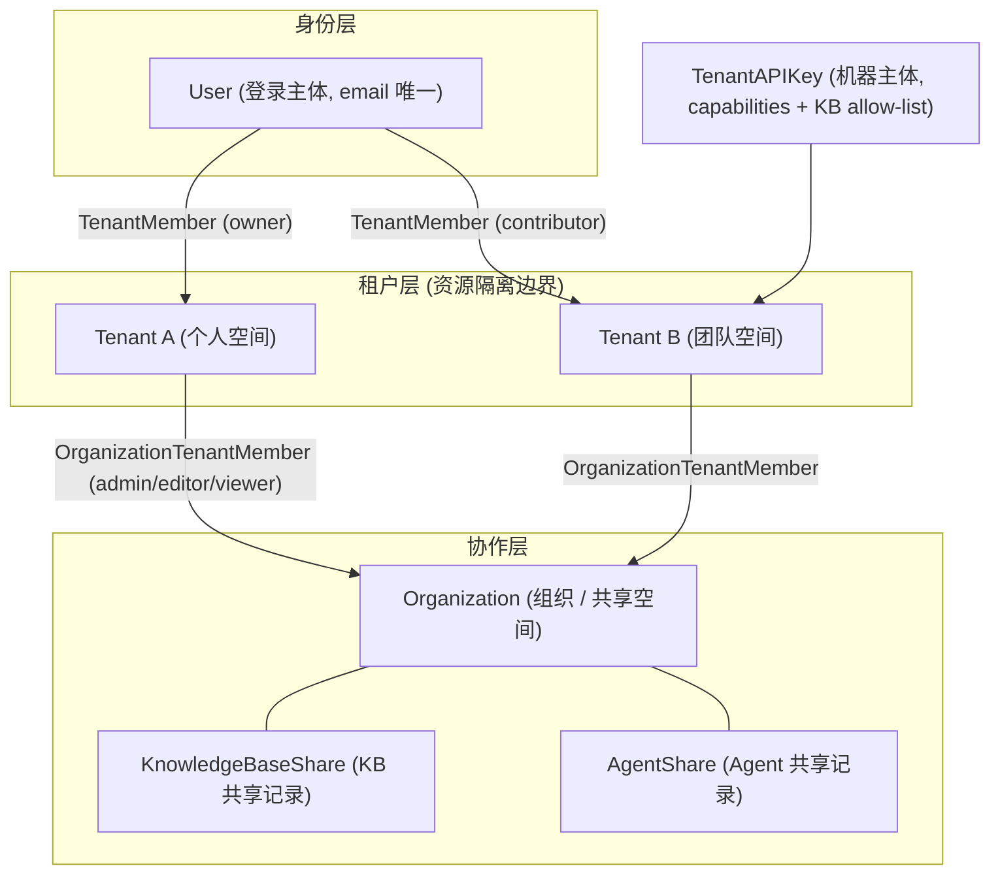
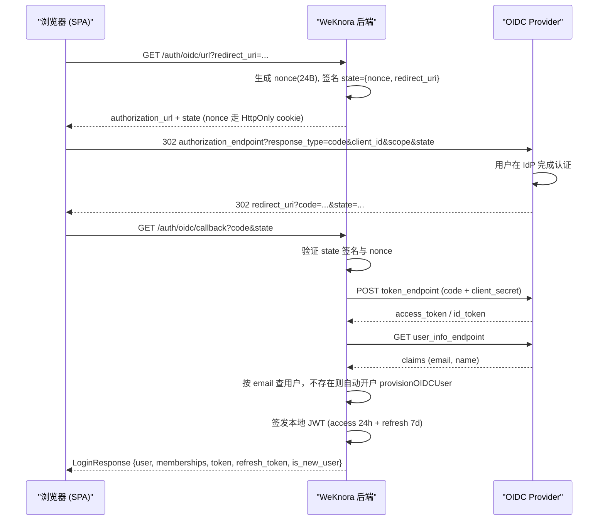
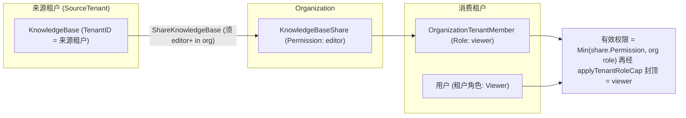

# Tenants, Users, and Authentication & Authorization

In WeKnora, a person (**User**) can belong to multiple **spaces** (called Tenant on the backend, referred to as workspace in the UI). A space is an isolation boundary: knowledge bases, models, Agents, and sessions all belong to a given space, and quotas are calculated per space too. If you want to share a knowledge base or Agent between two spaces, put them into the same **organization** (shared space).

The three things people ask about most often:

| What you want to do | How to do it |
| --- | --- |
| Bring a colleague in to use it together | Space settings → Members → Invite, and assign them a role (Owner / Admin / Contributor / Viewer) |
| Share a knowledge base with another team | Create an organization → add both spaces to it → "Share to organization" on the knowledge base |
| Let a program call the API | Space settings → API Key, check the capabilities you need (retrieve / chat / ingest / manage), and restrict which knowledge bases it can access if necessary |
| Manage the entire deployment (global settings, task queue, cross-space audit) | Requires **system administrator** identity, which is different from space Owner — see [Platform Administration and System Administrators](20-platform-admin.md) |
| Delete an entire space | Triggered by the **Owner** in space settings (`DELETE /tenants/:id`); this also wipes the space's knowledge bases, Agents, sessions, and member relationships, and cannot be undone |

<Screenshot
  src="/screenshots/settings-members.png"
  caption="Space member management: member roles and invitation entry point"
  hint="Show the member list, the role dropdown, and the 'Invite member' button — ideally with one pending invitation included." />

The one-sentence version of what the four roles can do: Viewer can only view and ask questions, Contributor can create knowledge bases and upload documents, Admin manages members and space settings, and Owner can additionally delete the space and transfer ownership. See the RBAC section below for the full matrix.

Technically, authentication supports three kinds of principals — password login, OIDC single sign-on, and API Keys — while authorization is implemented jointly by three orthogonal mechanisms: the in-space RBAC role ladder, resource ownership, and API Key capabilities. Each is expanded on layer by layer below.

## Conceptual Overview



Key points:

- One User can belong to multiple Tenants at the same time via the `tenant_members` table, with each membership relationship having its own independent role.
- Organization membership is at the **tenant level** (after the Plan 3 migration, `OrganizationTenantMember` is keyed by `tenant_id` rather than by user), and sharing likewise means "a given tenant shares a KB with a given organization."
- An API Key is a machine principal completely independent from JWT users, and does not reuse the tenant role ladder.

## 1. Data Model

### 1.1 Tenant (Tenant / Workspace)

`internal/types/tenant.go`:

```go
type Tenant struct {
    ID                      uint64               `json:"id" gorm:"primaryKey"`
    Name                    string               `json:"name"`
    Description             string               `json:"description"`
    Status                  string               `json:"status" gorm:"default:'active'"`
    RetrieverEngines        RetrieverEngines     `json:"retriever_engines" gorm:"type:json"`
    Business                string               `json:"business"`
    StorageQuota            int64                `json:"storage_quota" gorm:"default:10737418240"` // 默认 10GB
    StorageUsed             int64                `json:"storage_used"  gorm:"default:0"`
    ContextConfig           *ContextConfig       `json:"context_config" gorm:"type:jsonb"`
    WebSearchConfig         *WebSearchConfig     `json:"web_search_config" gorm:"type:jsonb"`
    ParserEngineConfig      *ParserEngineConfig  `json:"parser_engine_config" gorm:"type:jsonb"`
    Credentials             *CredentialsConfig   `json:"credentials" gorm:"type:jsonb"`
    StorageEngineConfig     *StorageEngineConfig `json:"storage_engine_config" gorm:"type:jsonb"`
    DefaultStorageBackendID *string              `json:"default_storage_backend_id,omitempty"`
    ChatHistoryConfig       *ChatHistoryConfig   `json:"chat_history_config" gorm:"type:jsonb"`
    RetrievalConfig         *RetrievalConfig     `json:"retrieval_config" gorm:"type:jsonb"`
    APIPrincipalConfig      *APIPrincipalConfig  `json:"-" gorm:"type:jsonb"`
    // CreatedAt / UpdatedAt / DeletedAt（软删除）
}
```

The tenant is the anchor point for quotas (`StorageQuota` / `StorageUsed`, default 10GB) and for various tenant-level configurations (retrieval engine, web search, parser engine, credentials, storage engine, chat history, etc.).

### 1.2 User

`internal/types/user.go`:

```go
type User struct {
    ID                  string          `json:"id" gorm:"type:varchar(36);primaryKey"`
    Username            string          `json:"username" gorm:"uniqueIndex;not null"`
    Email               string          `json:"email" gorm:"uniqueIndex;not null"`
    PasswordHash        string          `json:"-" gorm:"not null"`
    Avatar              string          `json:"avatar"`
    TenantID            uint64          `json:"tenant_id" gorm:"index"` // 首选/默认租户
    IsActive            bool            `json:"is_active" gorm:"default:true"`
    CanAccessAllTenants bool            `json:"can_access_all_tenants" gorm:"default:false"` // 跨租户超级用户
    IsSystemAdmin       bool            `json:"is_system_admin" gorm:"default:false;index"`  // 平台管理员
    Preferences         UserPreferences `json:"preferences" gorm:"type:jsonb"`
}

type UserPreferences struct {
    // 上次活跃的租户 ID，登录时用于恢复上下文
    LastActiveTenantID *uint64 `json:"last_active_tenant_id,omitempty"`
}
```

Two special flags:

- `CanAccessAllTenants`: cross-space superuser. **Both switches must be true at the same time** for this to take effect — the `CanAccessAllTenants` flag on the user row, and the deployment-level `tenant.enable_cross_tenant_access` / `WEKNORA_TENANT_ENABLE_CROSS_TENANT_ACCESS` (`middleware/access.go`'s `IsCrossTenantSuperuser()` checks the config first and then the user; when the config is turned off, this field is also forced to false in the login response). Once active, it can bypass space role checks and access cross-space endpoints such as `/tenants/all` and `/tenants/search`. Note that `POST /tenants` (creating a new space) is **not** a cross-space endpoint — any logged-in user can call it (subject to self-service creation policy and quota limits).
- `IsSystemAdmin`: platform-level administrator (system admin), independent of any tenant role, used for the `/system/admin/*` control plane. It governs the entire deployment rather than a single space; for how the first one is created and what it can do, see [Platform Administration and System Administrators](20-platform-admin.md).

### 1.3 TenantMember and Tenant Roles

`internal/types/tenant_member.go`:

```go
type TenantRole string

const (
    TenantRoleOwner       TenantRole = "owner"       // 完全控制：删除租户、转移所有权、管理 API Key、成员
    TenantRoleAdmin       TenantRole = "admin"       // 管理成员、模型、向量库、MCP、IM 等租户基础设施
    TenantRoleContributor TenantRole = "contributor" // 创建 KB / Agent，编辑自己创建的资源
    TenantRoleViewer      TenantRole = "viewer"      // 只读
)

var tenantRoleLevel = map[TenantRole]int{
    TenantRoleOwner: 40, TenantRoleAdmin: 30,
    TenantRoleContributor: 20, TenantRoleViewer: 10,
}

func (r TenantRole) HasPermission(required TenantRole) bool {
    return r.Level() >= required.Level()
}
```

```go
type TenantMember struct {
    ID        uint64
    UserID    string
    TenantID  uint64
    Role      TenantRole         // 默认 contributor
    Status    TenantMemberStatus // active / invited / suspended
    InvitedBy *string
    JoinedAt  time.Time
}
```

The login response returns a `Membership{TenantID, TenantName, Role}` projection list, which the frontend uses to render the workspace switcher.

### 1.4 TenantAPIKey

`internal/types/tenant_api_key.go`:

```go
type TenantAPIKey struct {
    ID               uint64
    TenantID         *uint64         // platform key 为 NULL
    ScopeType        APIKeyScopeType // "tenant" | "platform"
    Name             string
    KeyHash          string      `json:"-" gorm:"uniqueIndex"` // 查表用哈希
    APIKey           string      // 明文（落库前 AES-256-GCM 加密，见 BeforeSave/AfterFind）
    FullAccess       bool        // 全量访问（不受 capabilities 限制）
    KnowledgeBaseIDs StringArray // KB allow-list（空 = 不限制）
    Capabilities     StringArray // 能力列表
    LastUsedAt / ExpiresAt / RevokedAt *time.Time
}
```

- **Encryption at rest**: when `SYSTEM_AES_KEY` is configured, the `BeforeSave` hook encrypts the `api_key` column with AES-GCM before storing it, and `AfterFind` automatically decrypts it; lookups always go through the irreversible `KeyHash`.
- **Validation flow**: the request carries `X-API-Key` → the hash is computed → the table is looked up by `KeyHash` → `RevokedAt` / `ExpiresAt` are checked → `TenantAPIKeyScope{KeyID, ScopeType, FullAccess, KnowledgeBaseIDs, Capabilities}` is injected into the context, and subsequently read via `types.TenantAPIKeyScopeFromContext`.

### 1.5 Organization (Organization / Shared Space)

`internal/types/organization.go`:

```go
type Organization struct {
    ID                     string
    Name / Description / Avatar string
    OwnerID                string  // 创建者用户
    OwnerTenantID          uint64  // 拥有组织的租户
    InviteCode             string  `gorm:"uniqueIndex"` // 组织邀请码
    InviteCodeExpiresAt    *time.Time
    InviteCodeValidityDays int     // 允许 0(永久)/1/7/30，默认 7
    RequireApproval        bool    // 加入需审批
    Searchable             bool    // 是否可被搜索发现
    MemberLimit            int     // 默认 50
}

type OrganizationTenantMember struct { // 成员单位是"租户"
    OrganizationID       string
    TenantID             uint64
    Role                 OrgMemberRole // admin / editor / viewer，默认 viewer
    RepresentativeUserID string        // 代表用户（信息性字段）
}

const (
    OrgRoleAdmin  OrgMemberRole = "admin"  // 完全控制组织与共享资源
    OrgRoleEditor OrgMemberRole = "editor" // 可编辑共享 KB 内容，不能改组织设置
    OrgRoleViewer OrgMemberRole = "viewer" // 只读
)
```

## 2. Registration and Login

### 2.1 Registration Mode (invite-only)

`internal/handler/auth.go` + `internal/config/config.go`:

```go
type AuthConfig struct {
    RegistrationMode  string // "self_serve"（默认，公开注册） | "invite_only"（仅邀请）
    DefaultTenantMode string // "create_personal"（默认，自动建个人租户） | "tenantless"（无租户等待邀请）
}

func (c *AuthConfig) IsInviteOnly() bool {
    return c != nil && c.RegistrationMode == AuthRegistrationModeInviteOnly
}
```

The determination happens in two layers, and understanding this is key to explaining "I changed the env var but nothing happened":

**At startup** (`applyAuthAndTenantDefaults()`), `cfg.Auth.RegistrationMode` is synthesized: `DISABLE_REGISTRATION=true` rewrites it directly to `invite_only`, **overriding** whatever is in the YAML. The reason env overrides YAML here is to keep "the API rejects registration" and "the frontend hides the registration entry point" (the frontend reads `/auth/config`) as two gates that stay in sync — otherwise you'd get a button that's still there but returns a 403 when clicked.

**On every request** (`resolveRegistrationMode()`) only two sources are compared: the `auth.registration_mode` row in the database's `system_settings` table takes priority over the cfg value synthesized above, which in turn takes priority over the hardcoded fallback `self_serve`. `DISABLE_REGISTRATION` is **not** re-read on every request.

The consequence is: once a system administrator sets `auth.registration_mode` to `self_serve` in the UI, public registration is on even if the deployment still has `DISABLE_REGISTRATION=true` written somewhere. To fully turn it off, you need to reset that row in the database (`DELETE /system/admin/settings/auth.registration_mode`).

In `invite_only` mode, `POST /auth/register` returns 403, but that only blocks **self-service password registration** — the following two paths are unaffected:

- The **invite registration endpoint** `POST /auth/register-by-invite` (this is by design, see §2.3);
- **First-time OIDC login**: when `LoginWithOIDC()` can't find a matching email, it goes straight to `provisionOIDCUser()` to create an account, without ever reading the registration mode. In other words, once OIDC is enabled, `invite_only` doesn't block anyone in the IdP — to restrict scope you need to do it on the IdP side (application visibility / user groups), or just turn OIDC off entirely.

### 2.2 Password Registration / Login

- `POST /auth/register`: `{username(2-50), email, password}`; whether a personal tenant is automatically created depends on `DefaultTenantMode` (`TenantProvisioningCreatePersonal` / `TenantProvisioningTenantless`).
- `POST /auth/login`: `{email, password}`, returns `LoginResponse{user, active_tenant, memberships[], token, refresh_token}`; the active tenant is restored based on `Preferences.LastActiveTenantID`.
- Password requirements are enforced in three different places, and the strength is **not consistent** across them — when integrating, go by the strictest one:
  - **Registration page (frontend form)**: 8–32 characters, with at least 1 letter and 1 digit;
  - **`POST /auth/register` (backend)**: only has the binding's `min=6` — `Register()` **does not call** `ValidatePasswordPolicy`, so calling the API directly lets you set a 6-digit all-numeric password;
  - **`ValidatePasswordPolicy` (8–32 + letter + digit)**: only used for **password changes** (the password-change path in `user.go`) and for **system administrators resetting other users' passwords** (`handler/system.go`).

  In other words, registering via the UI is subject to the strict 8-character validation, while registering via the API is only bound by the 6-character minimum.

### 2.3 Invite Registration (register-by-invite)

`internal/handler/auth_register_by_invite.go`. A **shared invitation link** (share link, see §7.2) generated by a tenant Owner carries a token; the registration page uses that token to complete registration, even while the system is in `invite_only` mode:

```go
// POST /auth/register-by-invite
type registerByInviteRequest struct {
    Token    string `binding:"required"`
    Email    string `binding:"required,email"` // 注册者自填，与 token 不绑定
    Username string `binding:"required"`
    Password string `binding:"required,min=6"`
}
```

Flow: validate the token (`LookupByToken`) → check the email isn't already registered (returns 409 if it is) → create the user in `tenantless` mode → set the invited tenant as the user's primary tenant → `AcceptByToken` creates the `tenant_members` row (status `active`, role taken from the one specified in the invitation).

The companion endpoint `POST /auth/invitations/lookup` (no authentication required) returns the invitation context `{tenant_id, tenant_name, role, expires_at}` for display on the registration page; **it deliberately uses POST + body instead of GET + path, to avoid the token ending up in access logs**; an invalid/revoked token returns 410.

## 3. JWT Mechanism

Implemented in `internal/application/service/user.go`, using `github.com/golang-jwt/jwt` (HMAC-SHA256).

### 3.1 Secret Source

```go
func getJwtSecret() string {
    // 1) 环境变量 JWT_SECRET
    // 2) 否则启动时生成 32 字节安全随机密钥（Base64），进程重启后旧 token 失效
}
```

### 3.2 Issuance (Access + Refresh Dual Tokens)

```go
accessClaims := jwt.MapClaims{
    "user_id":   user.ID,
    "email":     user.Email,
    "tenant_id": activeTenantID, // 请求的租户作用域写死在 token 里
    "exp":       time.Now().Add(24 * time.Hour).Unix(),
    "iat":       time.Now().Unix(),
    "type":      "access",
}
refreshClaims := jwt.MapClaims{
    "user_id": user.ID,
    "exp":     time.Now().Add(7 * 24 * time.Hour).Unix(),
    "type":    "refresh",
}
```

| Token | Validity | Key Claims |
| --- | --- | --- |
| Access Token | 24 hours | `user_id` / `email` / `tenant_id` / `type=access` |
| Refresh Token | 7 days | `user_id` / `type=refresh` (does not include `tenant_id`) |

Both tokens are written to the `auth_tokens` table, used for **server-side revocation**.

### 3.3 Validation and Refresh

The `ValidateToken` check chain:

1. The signature algorithm must be from the HMAC family (guards against algorithm-confusion attacks);
2. A token with `type=refresh` **cannot** be used as an access token (`isRefreshTokenClaims`);
3. The `auth_tokens` table is checked for `IsRevoked` (logout = a revocation record);
4. `user_id` is extracted from the claims to load the user, and `tenant_id` is used as the active tenant.

**Switching tenants means reissuing tokens**: `SwitchTenant` validates the caller's active membership in the target tenant (except for cross-tenant superusers), then issues a new token pair carrying the new `tenant_id` claim, and makes a best effort to revoke the old refresh token.

## 4. API Key System

### 4.1 Capabilities List

`internal/types/tenant_api_key.go`. An API Key **does not reuse tenant roles**: a key either has `FullAccess`, or carries an explicit set of capabilities; routes with no declared policy deny API Keys by default (default-deny).

| Capability | Description |
| --- | --- |
| `retrieve` | Read/search knowledge base data (KB listing, knowledge details, hybrid-search, etc.) |
| `chat` | Session flows: create session, knowledge-chat / agent-chat, load and delete messages |
| `read_agents` | List and view Agents (excludes creation/modification) |
| `ingest` | Write content: upload documents, edit chunks / FAQs / tags / Wiki pages, bulk delete and move knowledge |
| `manage_kbs` | KB lifecycle: create / duplicate / copy / update / delete / initialize configuration |
| `manage_agents` | Create, delete, modify, and copy Agents |
| `message_history` | Search and view tenant-level chat history (`POST /messages/search` etc., independent from chat) |
| `manage_models` | Manage model definitions and credentials |
| `manage_mcp_services` | Manage MCP services and credentials |
| `manage_datasources` | Manage data source connectors and sync jobs |
| `manage_channels` | Manage Embed / IM channel integrations |
| `manage_vector_stores` | Manage vector stores and parsers |
| `manage_storage_backends` | Manage object storage backends |
| `manage_web_search` | Manage web search configuration |
| `run_evaluations` | Run and view evaluation jobs |
| `manage_members` | Manage tenant members and invitations |
| `manage_spaces` | Manage organization / shared-space membership |
| `manage_tenant_settings` | Read/write tenant integration settings |
| `system_tenants_read` / `system_tenants_manage` | Platform level: tenant management (platform key only) |
| `system_settings_read` / `system_settings_manage` | Platform level: system settings |
| `system_runtime_read` / `system_runtime_manage` | Platform level: runtime queue / tasks |
| `system_audit_read` | Platform level: audit log |

### 4.2 Route Declaration Mechanism

In `internal/router/rbac.go`, every route accessible via API Key is explicitly registered with an `APIKeyRoutePolicy` through `apiKeyGroup` / `apiKeyRoute` (`middleware.APIKeyRouteAuthorizer` is the single source of truth):

```go
// 策略构造器
apiKeyAny()                    // 任何有效 key
apiKeyFullAccess()             // 仅 FullAccess key
apiKeyPlatform(caps...)        // 仅 platform key + 指定能力
apiKeyRetrieve(base) / apiKeyChat(base) / apiKeyIngest(base) / ...
```

At startup, `assertAPIKeyPoliciesMatchRoutes` validates that every declared policy corresponds to an actually registered route, and panics on any configuration drift. Typical mappings evidenced by `router_api_key_capabilities_test.go`:

| Route | Required Capability |
| --- | --- |
| `POST /sessions`, `POST /knowledge-chat/:session_id`, `POST /agent-chat/:session_id`, `GET /messages/:session_id/load` | `chat` |
| `GET /agents`, `GET /agents/:id`, `GET /agents/:id/suggested-questions` | `read_agents` |
| `POST/PUT/DELETE /agents`, `POST /agents/:id/copy` | `manage_agents` |
| `PUT/DELETE /knowledge-bases/:id`, `POST /initialization/initialize/:kbId` | `manage_kbs` |
| `POST /messages/search`, `GET /messages/chat-history-stats` | `message_history` (not `chat`) |
| `GET /system/admin/settings` | platform key + `system_settings_read` |
| `POST /system/admin/runtime/queues/:queue/tasks/:task_id/actions/:action` | platform key + `system_runtime_manage` |

### 4.3 KB Allow-list

When `KnowledgeBaseIDs` is non-empty, the key can only reach the KBs on the list (evidenced by `knowledge_api_key_scope_test.go`):

```go
// 越界单个 KB → 403
requireTenantAPIKeyKnowledgeBase(ctx, "kb-2") // scope 只含 kb-1 → forbidden
// 批量操作中任一 KB 越界 → 整体 403（拒绝部分重叠）
requireTenantAPIKeyKnowledgeBases(ctx, "kb-1", "kb-2") // → forbidden
```

Other hard limits: a platform key cannot create other platform keys; the API Key principal does not participate in ownership determination (see §6).

## 5. OIDC Single Sign-On

### 5.1 Configuration

`OIDCAuthConfig` in `internal/config/config.go`:

| Config item | Description |
| --- | --- |
| `enable` | Whether OIDC is enabled |
| `issuer_url` | Issuer address |
| `discovery_url` | OpenID Connect Discovery address (`.well-known/openid-configuration`) |
| `provider_display_name` | Display name for the login button |
| `client_id` / `client_secret` | Client credentials (secret is serialized as `json:"-"`, not exposed to the frontend) |
| `authorization_endpoint` / `token_endpoint` / `user_info_endpoint` | Manually specified endpoints |
| `scopes` | Requested scopes (e.g. `openid email profile`) |
| `user_info_mapping.username` / `.email` | Claims field mapping (defaults to `name` / `email`) |

Endpoint resolution order: if both `authorization_endpoint` and `token_endpoint` are configured, use them directly; otherwise, discover them dynamically from `discovery_url`; if both are missing, an error is raised.

Routes (`internal/router/router.go`):

```go
r.GET("/auth/oidc/config",   handler.GetOIDCConfig)           // 前端探测是否启用
r.GET("/auth/oidc/url",      handler.GetOIDCAuthorizationURL) // 获取授权 URL
r.GET("/auth/oidc/callback", handler.OIDCRedirectCallback)    // 授权码回调
```

### 5.2 Flow and Security Design

`internal/application/service/user.go`:

- `GetOIDCAuthorizationURL`: generates a 24-byte random `nonce`, and uses `secutils.SignOIDCState` to sign `{nonce, redirect_uri}` **into the state** (guarding against CSRF / replay / callback-address tampering); the nonce is delivered via an HttpOnly cookie (omitted from the JSON response via `json:"-"`).
- `LoginWithOIDC`: exchanges the authorization code for a token → retrieves user info from the UserInfo endpoint (mapped according to `user_info_mapping`) → **matches a local user by email**; if none is found, `provisionOIDCUser` automatically creates an account → issues a local JWT pair identical in form to the password-login one.

Auto-provisioning details:

- The tenant mode is taken from `auth.default_tenant_mode` (`create_personal` automatically creates a personal tenant / `tenantless` waits for an invitation);
- Username candidates: OIDC username → email prefix → `oidc-user`, appending a `-1..-20` numeric suffix on conflict, and falling back to a Unix timestamp if still conflicting;
- A randomly generated 32-character password is written in (the user never knows it and can only log in via OIDC);
- The response includes `is_new_user` for the SPA to drive first-login onboarding; accounts with `IsActive=false` are denied login.



## 6. RBAC: Roles, Ownership, and the Guard Matrix

Authorization is composed of three orthogonal mechanisms, all converging in `rbacGuards` in `internal/router/rbac.go`:

1. **Role guards** (role-only): `Viewer()` / `Contributor()` / `Admin()` / `Owner()` / `SystemAdmin()`, asking "what is the caller's role in this tenant?"
2. **Ownership guards** (ownership-or-role): `OwnedKBOrAdmin()` etc., asking "is the caller the creator of **this specific resource**, or at least Admin+?"
3. **KB access guards** (KB-access): `KBAccessRead()` / `KBAccessWrite()`, asking "can the caller's tenant reach this KB?" (own it / organization-shared / visible via a shared Agent)

### 6.1 Role Capability Matrix

| Capability | Owner (40) | Admin (30) | Contributor (20) | Viewer (10) |
| --- | --- | --- | --- | --- |
| Delete tenant / transfer ownership / manage API Keys | ✓ | ✗ | ✗ | ✗ |
| Add/remove members, change roles, send invitations | ✓ | ✗ (handler restricted to Owner) | ✗ | ✗ |
| Configure tenant infrastructure (models / vector stores / IM / MCP / web search / storage backends / data sources) | ✓ | ✓ | ✗ | ✗ |
| Clear knowledge base contents (`DELETE /knowledge-bases/:id/knowledge`) | ✓ | ✓ | ✗ | ✗ |
| Modify/delete KB / Agent / knowledge / chunk / Wiki / tags created by **others** | ✓ | ✓ | ✗ | ✗ |
| Create KB / Agent; copy an Agent for oneself | ✓ | ✓ | ✓ | ✗ |
| Modify/delete a KB **created by oneself** and its sub-resources | ✓ | ✓ | ✓ | ✗ |
| Create/manage one's own sessions, start Q&A (`/sessions`, `/knowledge-chat`, `/agent-chat` are all Viewer+) | ✓ | ✓ | ✓ | ✓ |
| View member list / invitation list / KB list / knowledge / retrieval / preview | ✓ | ✓ | ✓ | ✓ |

The design comment at the top of `internal/router/rbac.go` summarizes the product semantics:

> - Owner / Admin: manage everything within the tenant;
> - Contributor: manages resources they created themselves; other people's resources are effectively read-only to them;
> - Viewer: everything is read-only;
> - Creating a new resource requires at least Contributor; configuring tenant infrastructure requires Admin+.

Two exceptions that are easy to trip over: **adding/removing members, changing roles, and sending invitations are Owner-only**, not even Admin (`routes_auth_tenant.go` attaches `g.Owner()` there, while the member list itself is Viewer+); **Viewer isn't "can't create anything at all"** — a session belongs to one's own working data, so a Viewer can still create sessions and ask questions; they just can't create knowledge bases or Agents.

### 6.2 Guard Selection Rules (Q1 / Q2)

`rbac.go` explicitly specifies the method for choosing a guard when adding a new route:

- **Q1: Does the resource have a creator?** Yes (KB, Agent, knowledge document, Chunk, WikiPage, FAQ entry, KB tag) → use `OwnedXxxOrAdmin` for mutation routes; No (Model, VectorStore, IM channel, WebSearchProvider, DataSource, MCPService, and other tenant-level infrastructure) → use `Admin()`; creation entry points (the resource doesn't exist yet) → `Contributor()`.
- **Q2: Is the side effect private or public?** Private (e.g. `POST /agents/:id/copy` only copies for oneself) → `Contributor()` is sufficient; public (sharing a KB to an organization, disabling a tenant-wide Agent, transferring ownership) → `OwnedXxxOrAdmin` or `Admin`.

### 6.3 Ownership Guard List

| Guard | Resolution path | Applicable routes |
| --- | --- | --- |
| `OwnedKBOrAdmin` | `:id` → KB.CreatorID | KB update / delete / pin / knowledge upload / tag CRUD |
| `OwnedKBOrAdminFromKbIDParam` | `:kbId` → KB.CreatorID | `/initialization/*` KB configuration routes |
| `OwnedAgentOrAdmin` | `:id` → Agent.CreatorID (built-in Agents have an empty creator, so only Admin+ can modify them) | Agent mutations |
| `OwnedKnowledgeKBOrAdmin` | knowledge `:id` → owning KB.CreatorID | Knowledge update / delete / re-parse / image editing |
| `OwnedChunkKBOrAdmin` / `...FromChunkID` | `:knowledge_id` or chunk `:id` → KB.CreatorID | Chunk mutations |
| `OwnedWikiKBOrAdmin` | `:kb_id` → KB.CreatorID | Wiki page CRUD |

Sub-resources must inherit the gating of their parent KB (the comment explicitly calls out a bug it once fixed where FAQ/Tag, agent share, and KB share were wired to the wrong axis).

### 6.4 Middleware Semantics (`internal/middleware/rbac.go`)

The decision order for `RequireRole` / `RequireOwnershipOrRole`:

1. An API Key principal is passed through directly (its authorization goes through the APIKeyGate described in §4.2, and a synthesized system user can never match `creator_id`);
2. Role satisfied → pass through;
3. Cross-tenant superuser (`IsCrossTenantSuperuser`) → pass through;
4. RBAC not enforced (`tenant.enable_rbac=false`, gradual-rollout mode) → log only, pass through;
5. The ownership guard runs a creator lookup: resource not found → pass through and let the handler return 404; lookup failed → 503; creator == current user → pass through;
6. Otherwise, 403 + audit log (`AuditActionAccessDenied = "rbac.access_denied"`).

The enforcement switch `TenantConfig.EnableRBAC`: `nil` or `true` = enforced (current default), `false` = log only, no denial (used during rollout transitions); can be overridden with the environment variable `WEKNORA_TENANT_ENABLE_RBAC`.

`RequireSystemAdmin`: the JWT user must have `IsSystemAdmin=true`; for API Keys, it must be a platform key (tenant keys always get 403).

### 6.5 KB Access Guards (Cross-Tenant Sharing Channel)

`middleware/kb_access.go` (wrapped by the `KBAccess*` family in `rbac.go`) unifies three access paths:

```text
1. 自有 KB                    → 等效 Admin 级完全访问
2. 组织共享 KB (Plan 3)       → 受共享权限封顶
3. 经共享 Agent 可见          → 仅只读（只在 KBAccessRead 层激活）
```

On success, the guard stores `(KB, effective tenant ID, permission)` in the context and **rewrites the request's tenant ID to the effective tenant**, so downstream handlers don't need to be aware of whether the KB is owned or shared. Variants `KBAccessReadFromKnowledgeIDParam` / `...FromChunkIDParam` support reverse-looking-up the KB from a knowledge / chunk ID. Read routes require at least `OrgRoleViewer`; write routes require at least `OrgRoleEditor`.

## 7. Tenant Members, Invitations, and Invitation Links

### 7.1 Member Management and Targeted Invitations

Handlers: `internal/handler/tenant_member.go`, `tenant_invitation.go`. The `/tenants/:id` group all attaches `PathTenantMatch()` (the URL tenant must match the active tenant in the token, except for superusers).

| Endpoint | Minimum role | Description |
| --- | --- | --- |
| `GET /tenants/:id/members` | Viewer | Paginated list of active members; `q` fuzzy-filters by email/username |
| `POST /tenants/:id/members` | Owner | Directly add an existing user `{email, role}` |
| `PUT /tenants/:id/members/:user_id` | Owner | Change role |
| `DELETE /tenants/:id/members/:user_id` | Owner | Remove member |
| `POST /tenants/:id/invitations` | Owner | Targeted invitation of an existing user `{email, role, message}` |
| `GET /tenants/:id/invitations` | Viewer | List invitations |
| `DELETE /tenants/:id/invitations/:inv_id` | Owner | Revoke an invitation |
| `GET /me/invitations` | Self | Invitation inbox |
| `POST /me/invitations/:inv_id/accept` / `.../decline` | Self | Accept / decline |

`TenantInvitation` state machine: `pending → accepted / declined / revoked / expired` (expiration is transitioned by a lazy sweep and audited as `rbac.invitation_expired`). Members and invitations have audit events across their whole lifecycle: `rbac.member_added` / `member_removed` / `member_role_changed` / `member_left` / `invitation_sent` / `invitation_accepted` / `invitation_declined` / `invitation_revoked` (`internal/types/audit_log.go`).

### 7.2 Shared Invitation Links (invite link)

`internal/handler/tenant_invite_link.go`. Stored in the same table as targeted invitations: an empty `InviteeUserID` means it's a shared link (usable by multiple people, counted via `AcceptedCount`), while a non-empty one means a targeted invitation.

- `POST /tenants/:id/invite-links` (Owner): `{role, message}` → returns `invite_url` (`{FrontendBaseURL}/register?token=...`, where `FrontendBaseURL` is taken from the YAML `frontend_base_url` → the environment variable `FRONTEND_BASE_URL` → falling back to a relative path);
- `GET /tenants/:id/invite-links` (Viewer) lists them; `DELETE /tenants/:id/invite-links/:inv_id` (Owner) revokes.

The link stays valid until it expires or is revoked, and combined with the `register-by-invite` endpoint from §2.3, it closes the account-creation loop under invite-only mode.

## 8. Organizations and Shared Spaces

### 8.1 Organization Lifecycle

`internal/application/service/organization.go`:

- When an organization is created, a unique `InviteCode` is generated, with a validity period `invite_code_validity_days ∈ {0(forever), 1, 7, 30}`, defaulting to 7 days (checked against the `ValidInviteCodeValidityDays` allowlist, with invalid values raising `ErrInvalidValidityDays`);
- `GetOrganizationByInviteCode` joins via an invite code (distinguishing `ErrInviteCodeNotFound` / `ErrInviteCodeExpired`); when `RequireApproval=true`, a pending join request is created;
- Organizations with `Searchable=true` can be discovered via `SearchSearchableOrganizations`;
- The invite code and the pending-approval count are only visible to "an org admin or owner tenant" (determined by the `isAdmin || isOwner` check in `internal/handler/organization.go`).

### 8.2 Invitation Search: By Space (Tenant), Not By User

After Plan 3, the unit of membership is the tenant, and a single user may belong to multiple spaces, so searching by username/email creates ambiguity about "which space the admin actually wants to invite." For this reason, `GET /organizations/:id/search-tenants` (callable only by org admins) **matches strictly by space name**:

```go
// SearchTenantsForInvite：
// 1. 校验调用者租户是组织 admin
// 2. 排除已在组织内的租户 (existingTenantIDs)
// 3. tenantService.SearchTenants 按名称搜索（pageSize = limit*2，limit 上限 50）
// 4. 插入序去重，丢弃解析不到名称的 defunct 租户，截断到 limit
```

The old endpoint `GET /organizations/:id/search-users` is kept as a backward-compatible shim, delegating directly to `SearchTenantsForInvite` (the response is already in the new tenant-candidate shape, marked `@Deprecated`).

`POST /organizations/:id/invite` (org admins only) adds a member directly: it prefers the `tenant_id` path (with an optional `representative_user_id` — if the representative user doesn't belong to the target tenant, that field is dropped with a warning rather than failing hard); it also supports the legacy SDK's `user_id` path (reverse-looking-up that user's tenant) for compatibility.

### 8.3 KB Sharing Model and Permission Calculation

`internal/types/organization.go` + `internal/application/service/kbshare.go`:

```go
type KnowledgeBaseShare struct {
    ID              string
    KnowledgeBaseID string
    OrganizationID  string
    SharedByUserID  string
    SourceTenantID  uint64        // 共享来源租户
    Permission      OrgMemberRole // 共享授予的最高权限（viewer/editor/admin）
}
// AgentShare 结构同形，面向 Agent。
```

**Prerequisite for sharing** (`ShareKnowledgeBase`): the caller's tenant must **own** the KB (`kb.TenantID == tenantID`), and must hold at least **editor** role in the target organization. Sharing again just updates the permission.

**Three exemption paths for managing a share** (`callerCanManageShare`, used for changing permissions / revoking a share):

1. The caller is the original sharer (same user ID);
2. The caller's tenant is the source tenant and the caller is a tenant Admin+ (ownership is tenant-level, so if the original sharer leaves, the tenant's Admins can still manage the share);
3. The caller's tenant is the admin of the target organization (an org admin can repair a share after the original sharer has left).

**Effective permission = intersection across multiple layers (take the minimum)**:

```go
// 最终权限 = Min(共享记录的 Permission, 调用者租户在组织中的 OrgMemberRole)
// 再叠加租户角色封顶：
func applyTenantRoleCap(p types.OrgMemberRole, callerTenantRole types.TenantRole) types.OrgMemberRole {
    // 租户内只是 Viewer 的用户，即使共享侧给到 editor+，也被压到 viewer
    if callerTenantRole == types.TenantRoleViewer && p.HasPermission(types.OrgRoleEditor) {
        return types.OrgRoleViewer
    }
    return p
}
```

Sharing-related operations are written to the KB activity feed: `kb.share_added` / `kb.share_permission_changed` / `kb.share_removed`.



## 9. Configuration Quick Reference

| Config item | Values | Default | Purpose |
| --- | --- | --- | --- |
| `auth.registration_mode` | `self_serve` / `invite_only` | `self_serve` | Public registration switch (hot-changeable via DB system_settings) |
| `auth.default_tenant_mode` | `create_personal` / `tenantless` | `create_personal` | Whether new users automatically get a personal tenant created |
| `tenant.enable_rbac` | `true` / `false` | `true` | RBAC enforcement / log-only mode |
| `JWT_SECRET` (environment variable) | Any string | Random 32 bytes | JWT HMAC secret |
| `SYSTEM_AES_KEY` (environment variable) | AES key | Not set | Encryption of API Key plaintext at rest |
| `oidc.*` | See §5.1 | Off | OIDC single sign-on |
| `frontend_base_url` / `FRONTEND_BASE_URL` | URL | Relative path | Invitation link registration page address |
| `Tenant.StorageQuota` | Bytes | 10737418240 (10GB) | Tenant storage quota |

## Implementation Reference

To locate things when reading the source, use the table below (paths relative to the repository root):

| Layer | File |
| --- | --- |
| Tenant model | `internal/types/tenant.go` |
| User model | `internal/types/user.go` |
| Tenant members and roles | `internal/types/tenant_member.go` |
| Tenant invitations | `internal/types/tenant_invitation.go` |
| API Key model and capabilities | `internal/types/tenant_api_key.go` |
| Organization / sharing model | `internal/types/organization.go` |
| Registration / login handler | `internal/handler/auth.go` |
| Invite registration handler | `internal/handler/auth_register_by_invite.go` |
| Member / invitation / invite link handlers | `internal/handler/tenant_member.go`, `tenant_invitation.go`, `tenant_invite_link.go` |
| Organization handler | `internal/handler/organization.go` |
| JWT / OIDC / user service | `internal/application/service/user.go` |
| Organization / KB sharing service | `internal/application/service/organization.go`, `kbshare.go` |
| RBAC middleware | `internal/middleware/rbac.go` |
| RBAC route guard matrix | `internal/router/rbac.go` |
| Auth config | `internal/config/config.go` (`AuthConfig` / `OIDCAuthConfig` / `TenantConfig`) |
