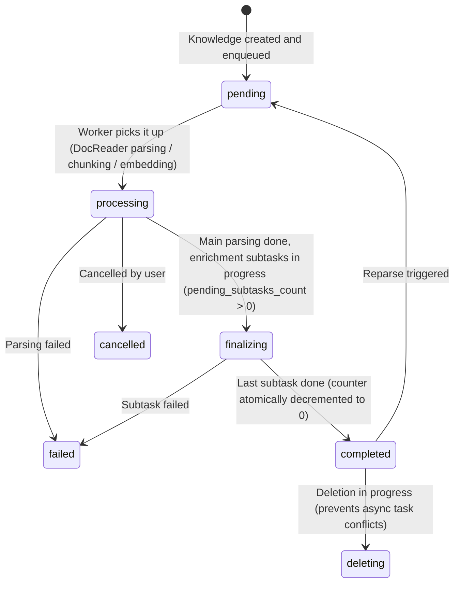

# Knowledge Bases & Knowledge Management

A knowledge base is the unit you use to organize content in WeKnora: a knowledge base holds a batch of related material and determines how that material is chunked, which vector model indexes it, and whether Wiki pages and a knowledge graph should be additionally generated. Every piece of content in a library — a file, a web URL, a hand-written Markdown page, a set of FAQs — is called a "knowledge item." After upload it is asynchronously parsed into chunks and indexed.

Splitting by knowledge base rather than lumping everything together has three main benefits: different material can use different chunking and model configurations; queries can be restricted to a specific scope; and permissions and sharing are also granted per library.

<Screenshot
  src="/screenshots/kb-document-list.png"
  caption="Knowledge base document list: parse status, tags, and batch operations"
  hint="Shows the document list page, including the parse-status column, tag column, top filter bar, and the batch-operations bar that appears after selection." />

## 0. Everyday operations

| What you want to do | Where to do it |
| --- | --- |
| Create a library, change chunk size and indexing toggles | The "Chunking" and "Indexing Strategy" tabs of the knowledge base edit dialog |
| Upload a file / import a web page / write one by hand | The upload area on the document list page, or the "New" dropdown |
| Organize documents with folders | The folder tree on the left of the document list; dragging a whole directory into the upload area preserves the directory structure (see §3.4) |
| Tag documents (multiple tags per document) | Edit in the detail view for a single document; use "Tags" in the batch-operations bar after selecting multiple (see §3.5) |
| Check parsing results, fix typos | Open a document → chunk list → edit chunks directly (see §3.6) |
| Add custom fields such as department, classification level | Custom metadata in the document detail view (see §3.1) |
| See who changed what | Knowledge base settings → Activity (see §6) |
| Copy an entire library / move documents to another library | "Copy" on the knowledge base list, or "Move" in the document batch operations (see §4) |

<Screenshot
  src="/screenshots/kb-settings.png"
  caption="Knowledge base settings: chunking parameters and indexing strategy toggles"
  hint="Shows chunk size/overlap/parent-child chunking settings, plus the four indexing toggles: vector, keyword, Wiki, and graph." />

## 1. Knowledge base model and configuration fields

### 1.1 KB types

`internal/types/knowledgebase.go`:

```go
const (
    KnowledgeBaseTypeDocument = "document" // Document type
    KnowledgeBaseTypeFAQ      = "faq"      // FAQ type
    KnowledgeBaseTypeWiki     = "wiki"     // Wiki type
)
```

When a KB is updated, any configuration that doesn't match its type is cleared (e.g., `FAQConfig` on a non-FAQ library). `VectorStoreID` uses the GORM `<-:create` tag, so it **cannot be changed after creation** (this prevents index/storage misalignment).

### 1.2 Configuration structure overview

```mermaid
graph TB
    KB["KnowledgeBase (id, name, type, tenant_id, creator_id)"]
    KB --> CC["ChunkingConfig (chunking)"]
    KB --> IS["IndexingStrategy (indexing pipeline toggles)"]
    KB --> EMB["EmbeddingModelID / SummaryModelID"]
    KB --> VLM["VLMConfig (vision model)"]
    KB --> ASR["ASRConfig (speech recognition)"]
    KB --> IMG["ImageProcessingConfig"]
    KB --> EXT["ExtractConfig (knowledge graph)"]
    KB --> FAQ["FAQConfig (FAQ type only)"]
    KB --> QG["QuestionGenerationConfig (question generation)"]
    KB --> WIKI["WikiConfig (when wiki_enabled is on)"]
    KB --> ST["StorageProviderConfig / StorageBackendID / StorageConfig(legacy)"]
    KB --> VS["VectorStoreID (immutable after creation)"]
    CC --> PCR["ParserEngineRules (choose parser engine by file type)"]
    CC --> PC["Parent-child chunking (parent_chunk_size / child_chunk_size)"]
    EXT --> GN["GraphNode / GraphRelation"]
    IS --> V["vector (default true)"]
    IS --> KW["keyword / BM25 (default true)"]
    IS --> WK["wiki (default false)"]
    IS --> GR["graph (default false)"]
```



### 1.3 ChunkingConfig (chunking configuration)

| Field | Type | Default | Description |
| --- | --- | --- | --- |
| `chunk_size` | int | required | Chunk size (character count) |
| `chunk_overlap` | int | - | Overlap between adjacent chunks |
| `separators` | []string | - | List of separators |
| `parser_engine_rules` | []ParserEngineRule | - | Specifies parser engine by file type: `{file_types, engine, xlsx_first_row_as_header?}` |
| `enable_parent_child` | bool | false | Enable the parent-child chunking strategy |
| `parent_chunk_size` | int | 4096 | Parent chunk size (used for returning context) |
| `child_chunk_size` | int | 384 | Child chunk size (used for embedding retrieval) |
| `strategy` | string | empty (= `legacy`) | Chunking strategy: `legacy` (legacy recursive splitting) / `auto` (profiler auto-selects a layer) / `heading` / `heuristic` / `recursive` (fixed at a specific layer); see [Chunking Mechanism](04-chunking.md) for details |
| `token_limit` | int | 0 | Token limit (0 = unlimited) |
| `languages` | []string | auto-detected | Language hint |
| `table_metadata_instructions` | string | - | Instructions for generating table metadata |

### 1.4 IndexingStrategy (indexing pipeline toggles)

| Field | Default | Description |
| --- | --- | --- |
| `vector_enabled` | true | Semantic vector retrieval |
| `keyword_enabled` | true | Keyword (BM25) retrieval |
| `wiki_enabled` | false | Wiki page generation |
| `graph_enabled` | false | Knowledge graph extraction |

### 1.5 Multimodal and enrichment configuration

**VLMConfig (Vision Language Model)**:

| Field | Description |
| --- | --- |
| `enabled` / `model_id` | New version: enable toggle + model ID |
| `description_language` | Language for image descriptions (empty = follows document language) |
| `custom_instructions` | KB-level guidance for interpreting images |
| `model_name` / `base_url` / `api_key` / `interface_type` | Legacy compatibility fields (ollama / openai) |

Enablement check: `Enabled && ModelID != ""`, or legacy `ModelName != "" && BaseURL != ""`.

**ASRConfig**: `enabled` / `model_id` / `language` (language hint, optional).

**ImageProcessingConfig**: `model_id`.

**QuestionGenerationConfig (question generation)**: `enabled`; `question_count` number of questions generated per chunk (default 3, max 10); `custom_instructions` target audience / style guidance.

**ExtractConfig (knowledge graph)**: `enabled`, `text`, `tags`, `nodes []*GraphNode{name, chunks, attributes}`, `relations []*GraphRelation{node1, node2, type}`, `custom_instructions` (domain extraction guidance).

**FAQConfig (FAQ libraries only)**: `index_mode` (`question_only` / `question_answer`, defaults to the latter), `question_index_mode` (`combined` / `separate`, defaults to combined); see the FAQ chapter for details.

**WikiConfig (knowledge bases with `indexing_strategy.wiki_enabled` turned on)** — note this is not exclusive to `type = "wiki"`: when a regular document library turns on Wiki indexing, `UpdateKnowledgeBase` automatically creates an empty `WikiConfig` for it to hold these adjustable options:

| Field | Default | Description |
| --- | --- | --- |
| `synthesis_model_id` | - | LLM used for Wiki generation |
| `max_pages_per_ingest` | 0 (unlimited) | Maximum pages created/updated per ingestion |
| `extraction_granularity` | `standard` | `focused` (main topics only) / `standard` / `exhaustive` (all entity concepts) |
| `content_instructions` / `extraction_instructions` | - | Guidance for generation and extraction style |
| `ingest_batch_size` / `ingest_map_parallel` / `ingest_reduce_parallel` / `ingest_max_inflight` | 5 / 10 / 10 / 4 | Ingestion concurrency parameters |

All `custom_instructions`-type fields are validated for length and legality via `validateKnowledgeBasePromptInstructions` on update (`internal/handler/knowledgebase.go`).

### 1.6 Storage configuration

- **StorageProviderConfig** (new): `provider ∈ {local, minio, cos, tos, s3, oss, ks3, obs}`;
- **StorageBackendID**: binds a specific storage backend instance;
- **StorageConfig** (legacy `cos_config` column): `secret_id / secret_key / region / bucket_name / app_id / path_prefix / provider / endpoint / use_ssl / force_path_style`.

### 1.7 KB computed fields

List / detail responses include: `knowledge_count`, `chunk_count`, `is_processing` (FAQ libraries), `processing_count` (number of knowledge items being processed, document libraries), `share_count` (number of organizations shared with), `creator_name`, `is_pinned` / `pinned_at` (current user's pin status).

There's also a storage field, `is_temporary`: it marks **ephemeral knowledge bases**, which are not shown in the normal knowledge base list. It's used internally by the system — a typical scenario is web search caching fetched pages as retrievable content. Manually creating a library never produces an ephemeral one.

## 2. KB routes and permissions

(See the "Tenants, Users, and Auth/Authorization" chapter for gate semantics; `KBAccessRead/Write` resolve organization sharing paths.)

| Method | Path | Handler | Gate |
| --- | --- | --- | --- |
| POST | `/knowledge-bases` | CreateKnowledgeBase | Contributor+ / API Key `manage_kbs` |
| GET | `/knowledge-bases` | ListKnowledgeBases | Viewer+ / `retrieve` |
| GET | `/knowledge-bases/:id` | GetKnowledgeBase | Viewer+ + KBAccessRead |
| PUT | `/knowledge-bases/:id` | UpdateKnowledgeBase | OwnedKBOrAdmin + KBAccessWrite |
| DELETE | `/knowledge-bases/:id` | DeleteKnowledgeBase | OwnedKBOrAdmin + KBAccessWrite |
| PUT | `/knowledge-bases/:id/pin` | TogglePinKnowledgeBase | Viewer+ + KBAccessRead |
| POST/GET | `/knowledge-bases/:id/hybrid-search` | HybridSearch | Viewer+ + KBAccessRead |
| POST | `/knowledge-bases/copy` | CopyKnowledgeBase | Contributor+ / `manage_kbs` |
| POST | `/knowledge-bases/:id/duplicate` | DuplicateKnowledgeBase | Contributor+ / `manage_kbs` + KBAccessRead |
| GET | `/knowledge-bases/copy/progress/:task_id` | GetKBCloneProgress | Viewer+ / `retrieve` or `manage_kbs` |
| GET | `/knowledge-bases/:id/move-targets` | ListMoveTargets | Viewer+ + KBAccessRead |
| GET | `/knowledge-bases/:id/activity` | ListKnowledgeBaseActivity | OwnedKBOrAdmin + KBAccessRead (JWT only) |

**Creation flow** (`internal/handler/knowledgebase.go`): Contributor check → tenant storage quota check → `EmbeddingModelID` validation → `VectorStoreID` binding validation → create → return KB + `vector_store_display`.

**Deletion cascade**: deleting a KB deletes, in order, all Knowledge items under it → Chunks → vector index → keyword index → Wiki pages → tags → stored files → soft-deletes the KB itself. An editor on the sharing side cannot delete the source KB (deletion requires owner-tenant + Admin-side permission).

## 3. Knowledge management

### 3.1 Model essentials

`internal/types/knowledge.go`. Key fields: `type` (`manual` hand-written Markdown / `faq` / file type), `source` / `channel` (ingestion channel), `parse_status`, `summary_status`, `enable_status`, `file_name/type/size/hash/path`, `storage_size`, `metadata` (JSON; manually created knowledge stores `ManualKnowledgeMetadata{content, format, status(draft/publish), version}`), `custom_metadata` (JSON, user-populated metadata), `last_faq_import_result`.

`metadata` and `custom_metadata` are deliberately kept separate (migration `000078`): the former is internal state and IDs written during ingestion, the latter is descriptive fields the user maintains themselves (department, classification level, version number, etc.). `custom_metadata` allows up to 20 fields, keys 1-64 characters, values are string/number/boolean/null and no longer than 1000 characters; `Knowledge.CustomMetadataText()` renders it as stably-sorted `key: value` text, which feeds into summary generation and document-level model context. Editing metadata automatically triggers a summary refresh.

Ingestion channel constants: `web`, `api`, `browser_extension`, `wechat`, `wecom`, `feishu`, `dingtalk`, `slack`, `im`, `notion`, `yuque`, `rss`.

Parse status state machine:



Summary has an independent status: `summary_status ∈ {none, pending, processing, completed, failed}`.

### 3.2 Knowledge routes

| Method | Path | Description | Gate |
| --- | --- | --- | --- |
| POST | `/knowledge-bases/:id/knowledge/file` | Upload file | OwnedKBOrAdmin + KBAccessWrite |
| POST | `/knowledge-bases/:id/knowledge/url` | URL import | Same as above |
| POST | `/knowledge-bases/:id/knowledge/manual` | Hand-written Markdown knowledge | Same as above |
| GET | `/knowledge-bases/:id/knowledge` | List (pagination + filters) | Viewer+ + KBAccessRead |
| DELETE | `/knowledge-bases/:id/knowledge` | Clear KB content | Admin + KBAccessWrite |
| GET | `/knowledge/:id`, `/knowledge/batch` | Detail / batch fetch | Viewer+ |
| GET | `/knowledge/:id/stages`, `/knowledge/:id/spans` | Processing stages / spans | Viewer+ |
| PUT / DELETE | `/knowledge/:id`, `/knowledge/manual/:id` | Update (incl. `custom_metadata`) / delete | OwnedKnowledgeKBOrAdmin + KBAccessWrite |
| POST | `/knowledge/:id/reparse`, `/knowledge/:id/cancel-parse` | Reparse / cancel parsing | Same as above |
| POST | `/knowledge/:id/regenerate-summary` | Regenerate document summary | Same as above |
| GET | `/knowledge/:id/download` | Download original file | Contributor+ + KBAccessWrite |
| GET | `/knowledge/:id/preview` | Preview file | Viewer+ + KBAccessRead |
| PUT | `/knowledge/tags` | Batch-update tags | Contributor+ / `ingest` |
| POST | `/knowledge/batch-reparse`, `/knowledge/batch-delete` | Batch reparse / delete | Contributor+ / `ingest` |
| POST | `/knowledge/move` | Move knowledge | Contributor+ / `ingest` |
| GET | `/knowledge/move/progress/:task_id` | Move progress | Viewer+ |

### 3.3 List filter parameters

`KnowledgeListFilter` in `internal/types/knowledge.go` + `internal/handler/knowledge.go`:

| Parameter | Description |
| --- | --- |
| `page` / `page_size` | Pagination (sorted by `updated_at DESC` by default) |
| `keyword` | Search by file name / title |
| `file_type` | Filter by file type (`pdf` / `manual` / `url` …) |
| `parse_status` | Filter by parse status |
| `source` | Filter by ingestion channel (`api` / `web` / `feishu` …) |
| `tag_id` | Filter by tag, comma-separated for multiple (**OR semantics**) |
| `updated_from` / `updated_to` | Update-time range (RFC3339) |
| `folder_path` | Filter by folder. **Whether this parameter is passed determines the list mode**: omitted = flat view across the whole library; empty string = knowledge base root directory (excluding subdirectories) |
| `folder_recursive` | Used together with `folder_path`; when `true`, documents in subdirectories are also returned |

### 3.4 Folder tree

As documents pile up, a flat list becomes hard to navigate, so knowledge bases support a **tree-structured folder system**, letting you organize content like a file manager.

How to use it:

- **Drag an entire directory into the upload area**: the directory structure is preserved as-is, with no need to manually create folders afterward;
- **Create / rename / move folders**: done via the folder tree on the left of the document list. Renaming updates the paths of subdirectories too; if the target path already exists, the two folders are merged; a folder cannot be moved into its own subdirectory;
- **Re-categorize documents**: select documents and move them to a target folder (or back to the root). This only changes categorization — it doesn't reparse or affect indexing;
- **Browse by directory**: the `folder_path` parameter on the list endpoint determines the view mode — omitted means flat view across the whole library, empty string means the root directory (excluding subdirectories), and pairing it with `folder_recursive=true` includes subdirectories too.

Folders and tags solve different problems and can be used together: **a folder is a single ownership** (a document belongs to exactly one directory, suited to organizing by project/source), while **a tag is many-to-many** (a document can carry multiple tags, suited to cross-cutting filters by topic, classification level, status). Both can serve as scope constraints during retrieval.

Implementation-wise, when an entire directory is dragged into the upload area, the directory structure is preserved: the path is stored in the `knowledges.folder_path` column (migration `000079`), and `file_name` retains only the file name. Earlier versions crammed the relative path into `file_name`, causing list titles to display as a long path string and making it impossible to query by directory; this was auto-backfilled during migration.

In the UI, the document list has a folder tree on the left, letting you browse, rename folders, and drag documents into other folders like a file manager. The corresponding endpoints are `GET/PUT /knowledge-bases/:id/knowledge/folders` and `POST /knowledge/folder` (see [API Reference](../04-api/02-api-knowledge.md)). Renaming a folder updates the paths of subdirectories too; if the target already exists, the two folders are merged.

<Screenshot
  src="/screenshots/kb-folder-tree.png"
  caption="Document list folder tree: browsing and re-categorizing by directory"
  hint="Shows the folder tree on the left, the document list for the current directory, and the entry points for renaming/moving folders." />

### 3.5 Tags (KnowledgeTag)

`internal/types/tag.go` + `internal/handler/tag.go`:

```go
type KnowledgeTag struct {
    ID              string // UUID
    SeqID           int64  // Auto-incrementing integer ID (used by the API)
    TenantID        uint64
    KnowledgeBaseID string
    Name            string // Unique within the KB
    Color           string
    SortOrder       int
}
type KnowledgeTagRelation struct { KnowledgeID, TagID string } // Many-to-many
```

**A document can carry multiple tags.** Originally it was single-tag (a single `knowledges.tag_id` column); migration `000063` switched to the association table `knowledge_tag_relations` — the existing single-tag data was migrated in at table-creation time, and then **the `knowledges.tag_id` column was dropped**. So currently:

- Read: `Knowledge.Tags` is batch-JOINed by `knowledge_id` at query time (`gorm:"-"`, not stored on the knowledges table);
- Write: full-replace semantics — `PUT /knowledge/tags` takes `{knowledge_id: [tag_ids]}`; the implementation first deletes all of that document's existing associations, then writes the new set;
- Filtering: `tag_ids` uses **OR semantics** (matching any one tag is enough to be returned); the SQL goes through `knowledges.id IN (SELECT knowledge_id FROM knowledge_tag_relations WHERE tag_id IN (...))`;
- FAQ entries follow a different path: an FAQ entry is itself a chunk, and its tag is stored on `chunks.tag_id` (**single tag**), which is a separate path from the document's multi-tag association table.

Routes for managing tags themselves: `GET /knowledge-bases/:id/tags` (Viewer+), `POST` (OwnedKBOrAdmin), `PUT/DELETE /knowledge-bases/:id/tags/:tag_id` (OwnedKBOrAdmin); the `tag_id` path parameter accepts both UUID and integer `seq_id`.

Two entry points on the frontend:

- **Batch tagging**: after selecting multiple documents in the document list, the "Tags" button in the batch-operations bar opens `BatchTagDialog.vue`. The dialog pre-selects tags **shared by all** selected documents, supports search, links directly to tag management, and refreshes the list on submit;
- **Setting tags on upload**: the upload confirmation dialog (`UploadConfirmDialog.vue`) lets you specify tags and parsing options directly before the file is ingested, avoiding an upload-then-edit round trip.

<Screenshot
  src="/screenshots/kb-batch-tag.png"
  caption="Batch tagging: tags shared by the selected documents are pre-selected"
  hint="Shows the tag dialog opened after selecting multiple documents, including the selected-tags area, search box, and the list of available tags." />

### 3.6 Chunk editing and version history

Parsing results aren't always perfect — tables with misaligned rows, OCR text run together, formulas losing symbols. This kind of problem used to require re-uploading the entire document; now you can edit chunk content directly in the document detail view. The index is rebuilt immediately after editing, and every change keeps a version history you can roll back to.

<Screenshot
  src="/screenshots/kb-chunk-edit.png"
  caption="Chunk editing: modify content, view version history, and roll back"
  hint="Shows the editing state of a chunk, the version history list (with editor and timestamp), and the rollback entry point." />

Implementation-wise (`internal/application/service/chunk.go`, migration `000078`):

Data model:

| Field / table | Purpose |
| --- | --- |
| `chunks.source_content` | The parser's raw output, **immutable**. History rows are lazily backfilled from `content` on the first manual edit |
| `chunks.content` | Currently effective content (used for retrieval and citation display) |
| `chunks.content_revision` | Incremented by 1 on every edit or rollback; used as an optimistic lock |
| `chunks.index_status` | `ready` / `processing` / `failed`; indicates whether the current content has been reflected in the retrieval store |
| `chunks.last_editor_id` | The operator who produced the current version |
| `chunk_revisions` table | Snapshots of overwritten historical versions (content, enabled state, editor, source, timestamp) |

Behavior notes:

- **Only `text`-type chunks are editable**; content cannot be empty after trimming whitespace, and has a 200,000-byte limit;
- **Optimistic concurrency**: a request can include `expected_revision`; if it doesn't match the current version, a 409 is returned, and the frontend prompts the user to refresh and retry;
- **No adding new images**: if the edited content contains an image URL that wasn't in the source content, the edit is rejected; when a Markdown reference to an image is removed, the corresponding OCR / caption subchunk is **disabled** rather than hard-deleted, so rolling back to a historical version can re-enable them;
- **Parent-child chunk consistency**: edits to a child chunk are applied back to the parent chunk by offset (the parent chunk's `source_content` remains immutable; replacements are applied in reverse order so length changes don't disrupt the coordinate system);
- **Index failures aren't hidden as success**: if index rebuilding fails, the edit is still saved as usual, but `index_status = failed`, and the UI surfaces this; resubmitting the same content triggers a retry;
- **Generated questions aren't lost**: after a content edit, existing retrieval questions are kept, just flagged as "not matching the current content version"; they can be rewritten individually (`PUT /chunks/by-id/:id/questions`) or regenerated in bulk (`POST /chunks/by-id/:id/questions/regenerate`);
- **Summary linkage**: changes to content or enabled state enqueue a document summary refresh, and `summary_status` moves to `pending`; this can also be manually triggered with `POST /knowledge/:id/regenerate-summary`.

A rollback (`POST /chunks/:knowledge_id/:id/revert`) is itself a new edit: the content of the target historical version is written as the current content, the version number keeps incrementing, and the previous content moves into the history list — so "rolling back a rollback" also works.

See [API Reference: Chunks and Tags](../04-api/02-api-chunks.md) for the endpoint list.

### 3.7 Download and preview security

The security mechanisms of `GET /knowledge/:id/preview` are locked in by tests in `internal/handler/knowledge_preview_security_test.go`:

| Control | Implementation | Purpose |
| --- | --- | --- |
| Forced `Content-Type: application/octet-stream` | Fixed response header | Prevents the browser from executing HTML/SVG as a page (guards against stored XSS) |
| `X-Content-Type-Options: nosniff` | Response header | Blocks MIME-sniffing bypasses |
| `Content-Disposition: attachment; filename=...` | Response header | Forces download instead of inline rendering |
| Path validation | `ValidateKBScopedStoragePath()` | The file path must fall within that KB's authorized storage scope (guards against path traversal / unauthorized reads) |
| Size limit | GetFile response body limit | Prevents oversized files from overwhelming the preview |

Test cases explicitly verify that even if a file's content is `<script>alert(1)</script>`, it's only ever transferred as a binary attachment. The download endpoint (`/knowledge/:id/download`) requires the higher Contributor+ level and goes through the KBAccessWrite gate.

## 4. Knowledge base copying and knowledge moving

### 4.1 Copy / Duplicate and preflight

`internal/application/service/knowledge_clone_move.go`; preflight rules are locked in by `internal/handler/knowledgebase_copy_preflight_test.go`:

- `POST /knowledge-bases/copy`: full-library copy (configuration + content), body takes `source_id`; an async task, progress checked via `GET /knowledge-bases/copy/progress/:task_id` (the activity stream logs `kb.clone_started` / `kb.clone_completed` / `kb.clone_failed`).
- `POST /knowledge-bases/:id/duplicate`: **copies configuration only** (not content / index / sharing records), the activity stream logs `kb.duplicated`.

Preflight (validation before copying, synchronous rejection):

1. Tenant isolation between source / target KB (cross-tenant is rejected);
2. Source KB existence;
3. **VectorStore compatibility**: `reuse_vectors` mode doesn't support KBs across different vector stores (vectors can't be moved directly);
4. **StorageBackend compatibility**: copying across storage backends isn't supported;
5. When called via API Key, both source and target KB must be on the allow-list.

### 4.2 Knowledge move gate

`POST /knowledge/move` supports two modes, with constraints validated at **both the handler and service layers** (evidenced by both `internal/handler/knowledge_move_gate_test.go` and `internal/application/service/knowledge_move_gate_test.go`):

- **`reuse_vectors` mode**: reuses existing vectors directly, **requires the source and target KB to be bound to the same VectorStore**;
- **`reparse` mode**: the target library reparses to generate vectors, allowing moves across vector stores.

The normalized semantics of the same-library check `SharesStoreWith()` (empty string is normalized to nil; nil means the environment-default store):

```text
nil & nil               → true   (both are env-store)
"" & nil                → true   (empty string normalized to nil)
"store-a" & "store-a"   → true
"store-a" & "store-b"   → false
"store-a" & nil         → false  (explicit binding vs env-store is not considered the same library)
```

`GET /knowledge-bases/:id/move-targets` returns candidate target libraries that satisfy the gate; the move runs as an async task, progress checked via `GET /knowledge/move/progress/:task_id`.

## 5. Knowledge processing pipeline

`internal/application/service/knowledge_create.go` / `knowledge_process.go` / `knowledge_process_config.go`:

```text
Upload (file/url/manual)
  → Create Knowledge (parse_status=pending) → Enqueued via Asynq
  → Worker: DocReader parsing → Chunking (ChunkingConfig)
      → Vector embedding    (indexing_strategy.vector_enabled)
      → Keyword indexing    (keyword_enabled)
      → Graph extraction    (graph_enabled + ExtractConfig)
      → Wiki generation     (wiki_enabled + WikiConfig)
      → Question generation (QuestionGenerationConfig.enabled)
  → parse_status=finalizing, pending_subtasks_count=N
  → After each enrichment subtask completes, atomically decrement; reaches zero → parse_status=completed
```

**Configuration merge priority** (`EffectiveProcessConfig`): `Knowledge.ProcessOverrides` (per-upload overrides, stored in the knowledge item's metadata as `KnowledgeProcessOverrides`, can override parser rules / chunking / VLM / ASR / question generation / graph toggles, etc.) > KB configuration > tenant defaults.

Chunk types (`internal/types/chunk.go`): `text`, `parent_text`, `image_ocr`, `image_caption`, `summary`, `entity`, `relationship`, `faq`, `web_search`, `table_summary`, `table_column`, `wiki_page`; chunks support an `is_enabled` toggle and `flags` bit flags (bit0 = recommendable).

## 6. Knowledge base activity stream (KB Activity)

The activity stream answers "who recently changed what in this library" — creating the library, changing configuration, uploading/deleting documents, editing chunks, sharing, Wiki updates: all of it is logged. The entry point is the "Activity" tab in knowledge base settings.

<Screenshot
  src="/screenshots/kb-activity.png"
  caption="Knowledge base activity stream: operation log in reverse chronological order"
  hint="Shows the activity list (operator, action, target document, time) and the expanded detail drawer." />

`internal/application/service/kb_activity.go` reuses the audit log system (`AuditLog`, with scope `knowledge_base`), recording via `recordKBActivity(ctx, audit, tenantID, kbID, action, targetType, targetID, outcome, details)`:

- **Activity actions** (`internal/types/audit_log.go`): `kb.created` / `kb.updated` / `kb.deleted` / `kb.duplicated` / `kb.clone_started` / `kb.clone_completed` / `kb.clone_failed`, `kb.share_added` / `kb.share_permission_changed` / `kb.share_removed`, plus knowledge- and chunk-level add/delete/modify actions;
- **Trigger source**: `kbActivityTaskMetadata{TaskID, Trigger}` from the context (`user` for user actions / `system` for background tasks) is automatically merged into details; `processing_status` is auto-populated based on outcome (accepted→pending, success→completed, partial→partial, failed/denied→failed, canceled→canceled);
- **Batch operation sample titles**: `kbActivityAppendSampleTitles` attaches up to 5 deduplicated titles to a batch operation (the first becomes `title`, the rest go into the `titles` array), keeping the activity stream readable and bounded;
- **Suppression mechanism**: `withKBActivitySuppressed(ctx)` lets internal cascading operations avoid producing duplicate activity records.

Query endpoint: `GET /knowledge-bases/:id/activity` (OwnedKBOrAdmin, JWT users only, not accessible via API Key).

## 7. Storage quota and usage

Quota is attached to the tenant (`internal/types/tenant.go`):

| Field | Default | Description |
| --- | --- | --- |
| `storage_quota` | 10737418240 (10GB) | Total tenant quota |
| `storage_used` | 0 | Amount used (covers original files, text, vectors, and index storage) |

Quota is checked before both creating a KB and uploading knowledge (`internal/handler/knowledgebase.go` creation validation chain); writes are rejected when the quota is exceeded; each knowledge record tracks its own `file_size` and `storage_size`, and usage is reclaimed on deletion.

## 8. Hybrid Search

`POST /knowledge-bases/:id/hybrid-search` (`internal/handler/knowledgebase.go` + `internal/application/service/knowledgebase_search*.go`) combines retrieval according to the KB's `IndexingStrategy`: vector (vector_enabled) + keyword BM25 (keyword_enabled), merged via rank fusion and reranked, optionally augmented with the knowledge graph (graph_enabled); multi-KB scenarios are fanned out concurrently by `knowledgebase_search_fanout.go` and merged by `knowledgebase_search_fusion.go`; the shared-KB search path is in `knowledgebase_search_shared.go`. FAQ libraries have a dedicated hit strategy (negative-example filtering / iterative recall) — see the FAQ chapter.

## Implementation reference

When reading the source, use the table below to locate things (paths relative to the repo root):

| Layer | File |
| --- | --- |
| KB model and configuration structures | `internal/types/knowledgebase.go`, `indexing_strategy.go` |
| Knowledge / Chunk / Tag models | `internal/types/knowledge.go`, `chunk.go`, `tag.go` |
| Processing configuration overrides | `internal/types/knowledge_process.go` |
| KB Handler | `internal/handler/knowledgebase.go` |
| Knowledge Handler | `internal/handler/knowledge.go` |
| Tag Handler | `internal/handler/tag.go` |
| KB service | `internal/application/service/knowledgebase.go` |
| Knowledge creation / processing pipeline | `internal/application/service/knowledge_create.go`, `knowledge_process.go`, `knowledge_process_config.go` |
| Copy and move | `internal/application/service/knowledge_clone_move.go` |
| Activity stream | `internal/application/service/kb_activity.go` |
| Routing and gates | `internal/router/router.go`, `internal/router/rbac.go` |
| Key test evidence | `internal/handler/knowledge_preview_security_test.go`, `knowledge_move_gate_test.go`, `knowledgebase_copy_preflight_test.go` |
