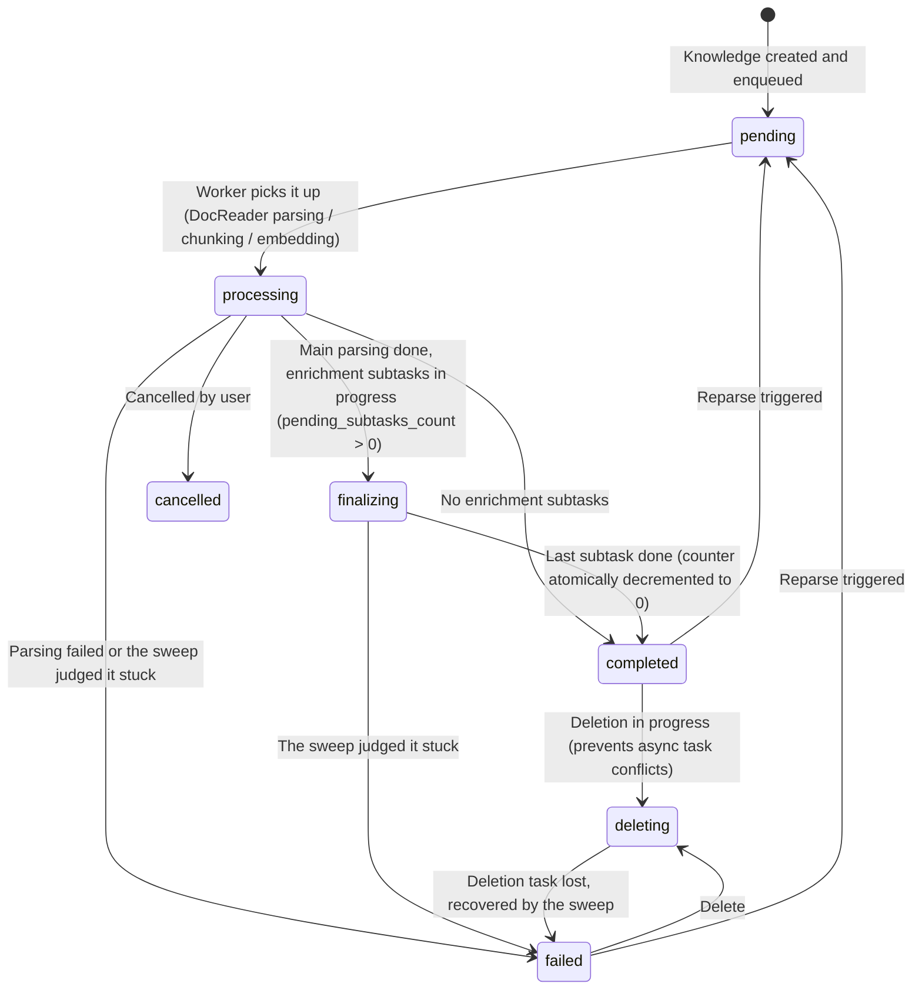

```mermaid
graph TB
    KB["KnowledgeBase (id, name, type, tenant_id, creator_id)"]
    KB --> CC["ChunkingConfig (chunking)"]
    KB --> IS["IndexingStrategy (indexing pipeline toggles)"]
    KB --> EMB["EmbeddingModelID / SummaryModelID"]
    KB --> VLM["VLMConfig (vision model)"]
    KB --> ASR["ASRConfig (speech recognition)"]
    KB --> IMG["ImageProcessingConfig"]
    KB --> EXT["ExtractConfig (knowledge graph)"]
    KB --> FAQ["FAQConfig (FAQ type only)"]
    KB --> QG["QuestionGenerationConfig (question generation)"]
    KB --> WIKI["WikiConfig (when wiki_enabled is on)"]
    KB --> ST["StorageProviderConfig / StorageBackendID / StorageConfig(legacy)"]
    KB --> VS["VectorStoreID (immutable after creation)"]
    CC --> PCR["ParserEngineRules (choose parser engine by file type)"]
    CC --> PC["Parent-child chunking (parent_chunk_size / child_chunk_size)"]
    EXT --> GN["GraphNode / GraphRelation"]
    IS --> V["vector (default true)"]
    IS --> KW["keyword / BM25 (default true)"]
    IS --> WK["wiki (default false)"]
    IS --> GR["graph (default false)"]
```

# Knowledge Bases & Knowledge Management

A knowledge base organizes related material and configures chunking, the embedding model, retrieval indexes, Wiki, and the knowledge graph in one place. Files, web pages, hand-written Markdown, FAQs, and other content are managed as knowledge items, which are parsed and indexed according to the configuration after ingestion.

Different knowledge bases can use independent processing configurations. Queries can be restricted to a specific retrieval scope, and member access and organization sharing are also granted per knowledge base.

<Screenshot
  src="/screenshots/kb-document-list.png"
  caption="Knowledge base document list: parse status, tags, and batch operations"
  hint="Shows the document list page, including the parse-status column, tag column, top filter bar and sort button, and the batch-operations bar that appears after selection (with tags, move, and batch download)." />

## Management entry points {#_0-everyday-operations}

| Operation | Where to do it |
| --- | --- |
| Create a library, change chunk size and indexing toggles | The "Chunking" and "Indexing Strategy" tabs of the knowledge base edit dialog |
| Upload files, import web pages, or write Markdown | The upload area on the document list page, or the "New" dropdown; upload progress is shown in the upload task panel at the bottom right |
| Change the document list order | "Sort" in the document list toolbar: update time, upload/creation time (newest uploads first by default), or file name |
| Check parsing progress or troubleshoot stuck documents | The status on the document card, or open the document's parsing timeline (see [Viewing parsing progress](#viewing-parsing-progress)) |
| Organize documents with folders | The folder tree on the left of the document list; uploading a whole directory preserves the directory structure (see [Folder tree](#_3-4-folder-tree)) |
| Tag documents (multiple tags per document) | Edit in the detail view for a single document; use "Tags" in the batch-operations bar after selecting multiple (see [Tags (KnowledgeTag)](#_3-5-tags-knowledgetag)) |
| Check parsing results, fix typos | Open a document → chunk list → edit chunks directly (see [Chunk editing and version history](#_3-6-chunk-editing-and-version-history)) |
| Add custom fields such as department, classification level | Custom metadata in the document detail view (see [Model essentials](#_3-1-model-essentials)) |
| View the operation log | Knowledge base settings → Activity (see [Knowledge base activity stream (KB Activity)](#_6-knowledge-base-activity-stream-kb-activity)) |
| Copy a knowledge base or move documents across libraries | "Copy" on the knowledge base list, or "Move" in the document batch operations (see [Knowledge base copying and knowledge moving](#_4-knowledge-base-copying-and-knowledge-moving)) |
| Batch download original files | After selecting documents, "Download selected" in the batch-operations bar (see [Batch download](#batch-downloading-original-files)) |

<Screenshot
  src="/screenshots/kb-settings.png"
  caption="Knowledge base settings: chunking parameters and indexing strategy toggles"
  hint="Shows chunk size/overlap/parent-child chunking settings, plus the four indexing toggles: vector, keyword, Wiki, and graph." />

## Creating a knowledge base and importing content

When creating a knowledge base, choose the content type, models, and indexing methods, then upload files, import web pages, or write Markdown. Use a document library for general material and an [FAQ library](17-faq.md) for standard Q&A. The vector store cannot be changed after creation, so decide on it before creating the library.

The upload confirmation page lets you set tags and the parsing options for this batch of files, including whether to generate document summaries (on by default; when turned off, parsing, indexing, and other processing still run as usual). Per-upload processing options take precedence over the knowledge base configuration, which in turn takes precedence over the space defaults. Existing documents must be re-parsed to use changed chunking parameters.

During batch uploads, the upload task panel at the bottom right of the page summarizes all files: up to 3 are transferred at the same time, and it shows the bytes uploaded, the remaining time, and the number of files that are searchable, processing, failed, or already existing. Individual files can be canceled or retried, and once all uploads have finished you can leave the page while parsing continues in the background. The upload timeout for large files is extended automatically based on file size.

<Screenshot
  src="/screenshots/kb-upload-tasks.png"
  caption="Upload task panel: overall progress of a batch upload and the status of each file"
  hint="Shows the floating panel at the bottom right: the progress ring and 'Uploading x/y' title at the top, the remaining time, the segmented progress bar for searchable/processing/failed/already existing, and the cancel and retry buttons in the file list." />

### Viewing parsing progress

The document list and cards show the parsing status of each document. When there has been no progress for more than 20 minutes, the status changes to "Queued" or "May be stuck": the former means tasks are still waiting in the queue and usually needs no action; the latter means no task is advancing the document anymore, so you can open the parsing timeline to see which stage it stopped at, or stop parsing and retry. Documents with no progress for a long time are automatically marked as failed by the system, with the error code `TASK_STALLED`.

The parsing timeline shows the duration and result of each stage. On failure, the error card at the top explains the stage and reason of the error and provides a retry entry point.

<Screenshot
  src="/screenshots/kb-parse-timeline.png"
  caption="Parsing timeline: stage durations, failure reasons, and stuck warnings"
  hint="Shows the document parsing timeline drawer: the stage waterfall (document parsing/chunking/embedding/multimodal/post-processing), the error card on failure (stage name, error code, backend reason, and retry button), and the 'No progress for N minutes' banner with the stop parsing button." />

## Organizing folders and tags

Folders archive documents by directory, and each document belongs to exactly one folder. Uploading a whole directory preserves its hierarchy; when you rename or move a folder in the folder tree, the paths of its subdirectories are updated too, and contents are merged when the target directory already exists. Moving a document to another folder within the same knowledge base only changes its categorization and does not reparse it.

Tags provide cross-cutting classification, and a document can be associated with multiple tags. Tags can be preset at upload time, or changed in bulk after selecting documents; the batch dialog pre-selects the tags shared by the selected documents. When filtering by multiple tags, documents matching any of the tags are returned.

With automatic tagging enabled, the system selects matching tags from the existing candidate tags when parsing completes. By default each document is associated with at most 3 tags, and documents that already have tags are skipped. The configuration only affects subsequent parsing and does not backfill historical documents, and a model failure does not block document completion.

<Screenshot
  src="/screenshots/kb-batch-tag.png"
  caption="Batch tagging: tags shared by the selected documents are pre-selected"
  hint="Shows the tag dialog opened after selecting multiple documents, including the selected-tags area, search box, and the list of available tags." />

## Editing chunks and adding metadata

Editing text chunks in the document detail view lets you fix parsing errors and rebuild the index. Every edit or rollback creates a new version; if another user has already updated the same chunk, the UI prompts you to refresh and retry. If the index update fails, the edited content is kept and a failure status is shown; submitting again retries.

Custom metadata adds information such as department, classification level, or version number, with up to 20 fields. Changing metadata triggers a summary refresh; see the reference section for detailed field lengths and supported types.

<Screenshot
  src="/screenshots/kb-chunk-edit.png"
  caption="Chunk editing: modify content, view version history, and roll back"
  hint="Shows the editing state of a chunk, the version history list (with editor and timestamp), and the rollback entry point." />

## Copying and moving content

Copying a knowledge base reuses its existing configuration and content. When moving across libraries, you can choose to reuse vectors or reparse: reuse requires both libraries to be bound to the same vector store, while reparsing allows using the target library's storage and processing configuration. Moves run as asynchronous tasks whose progress can be queried.

### Batch downloading original files

Select documents and click "Download selected" to package the selected documents' original files into a ZIP that preserves the knowledge base's folder structure, so after extraction you can re-upload by folder. Each batch is limited to 200 documents and 512 MiB of original files in total; items without an original file, such as web imports, are skipped. "Select loaded" only includes the documents currently loaded. Batch download has the same permissions as single-file download: it requires Contributor or above and edit permission on the knowledge base.

## Viewing activity and usage

"Activity" in the knowledge base settings records changes to configuration, documents, chunks, sharing, and Wiki. It is available to logged-in users who meet the resource management permissions, and cannot be accessed with an API Key. For operations initiated with an API Key, the Key name is shown below the operator.

For knowledge bases accessed through organization sharing with read-only (Viewer) permission, the UI hides the upload, edit, delete, and settings entry points.

Storage quota is calculated per workspace and covers files, text, vectors, and indexes. The quota is checked before creating a knowledge base and before uploading, and the corresponding usage is reclaimed after content is deleted.

<Screenshot
  src="/screenshots/kb-activity.png"
  caption="Knowledge base activity stream: operation log in reverse chronological order"
  hint="Shows the activity list (operator, action, target document, time) and the expanded detail drawer." />

## Configuration and API reference

### Knowledge base model and configuration fields {#_1-knowledge-base-model-and-configuration-fields}

#### KB types {#_1-1-kb-types}

`internal/types/knowledgebase.go`:

```go
const (
    KnowledgeBaseTypeDocument = "document" // Document type
    KnowledgeBaseTypeFAQ      = "faq"      // FAQ type
    KnowledgeBaseTypeWiki     = "wiki"     // Wiki type
)
```

When a KB is updated, any configuration that doesn't match its type is cleared (e.g., `FAQConfig` on a non-FAQ library). `VectorStoreID` uses the GORM `<-:create` tag, so it **cannot be changed after creation** (this prevents index/storage misalignment).

#### Configuration structure overview {#_1-2-configuration-structure-overview}



#### ChunkingConfig (chunking configuration) {#_1-3-chunkingconfig-chunking-configuration}

| Field | Type | Default | Description |
| --- | --- | --- | --- |
| `chunk_size` | int | required | Chunk size (character count) |
| `chunk_overlap` | int | - | Overlap between adjacent chunks |
| `separators` | []string | - | List of separators |
| `parser_engine_rules` | []ParserEngineRule | - | Specifies parser engine by file type: `{file_types, engine, xlsx_first_row_as_header?}` |
| `enable_parent_child` | bool | false | Enable the parent-child chunking strategy |
| `parent_chunk_size` | int | 4096 | Parent chunk size (used for returning context) |
| `child_chunk_size` | int | 384 | Child chunk size (used for embedding retrieval) |
| `strategy` | string | empty (= `legacy`) | Chunking strategy: `legacy` (legacy recursive splitting) / `auto` (profiler auto-selects a layer) / `heading` / `heuristic` / `recursive` (fixed at a specific layer); see [Chunking Mechanism](04-chunking.md) for details |
| `token_limit` | int | 0 | Token limit (0 = unlimited) |
| `languages` | []string | auto-detected | Language hint |
| `table_metadata_instructions` | string | - | Instructions for generating table metadata |

#### IndexingStrategy (indexing pipeline toggles) {#_1-4-indexingstrategy-indexing-pipeline-toggles}

| Field | Default | Description |
| --- | --- | --- |
| `vector_enabled` | true | Semantic vector retrieval |
| `keyword_enabled` | true | Keyword (BM25) retrieval |
| `wiki_enabled` | false | Wiki page generation |
| `graph_enabled` | false | Knowledge graph extraction |

#### Multimodal and enrichment configuration {#_1-5-multimodal-and-enrichment-configuration}

**VLMConfig (Vision Language Model)**:

| Field | Description |
| --- | --- |
| `enabled` / `model_id` | New version: enable toggle + model ID |
| `description_language` | Language for image descriptions (empty = follows document language) |
| `custom_instructions` | KB-level guidance for interpreting images |
| `model_name` / `base_url` / `api_key` / `interface_type` | Legacy compatibility fields (ollama / openai) |

Enablement check: `Enabled && ModelID != ""`, or legacy `ModelName != "" && BaseURL != ""`.

**ASRConfig**: `enabled` / `model_id` / `language` (language hint, optional).

**ImageProcessingConfig**: `model_id`.

**QuestionGenerationConfig (question generation)**: `enabled`; `question_count` number of questions generated per chunk (default 3, max 10); `custom_instructions` target audience / style guidance.

**ExtractConfig (knowledge graph)**: `enabled`, `text`, `tags`, `nodes []*GraphNode{name, chunks, attributes}`, `relations []*GraphRelation{node1, node2, type}`, `custom_instructions` (domain extraction guidance).

**FAQConfig (FAQ libraries only)**: `index_mode` (`question_only` / `question_answer`, defaults to the latter), `question_index_mode` (`combined` / `separate`, defaults to combined); see the FAQ chapter for details.

**WikiConfig (knowledge bases with `indexing_strategy.wiki_enabled` turned on)** — note this is not exclusive to `type = "wiki"`: when a regular document library turns on Wiki indexing, `UpdateKnowledgeBase` automatically creates an empty `WikiConfig` for it to hold these adjustable options:

| Field | Default | Description |
| --- | --- | --- |
| `synthesis_model_id` | - | LLM used for Wiki generation |
| `max_pages_per_ingest` | 0 (unlimited) | Maximum pages created/updated per ingestion |
| `extraction_granularity` | `standard` | `focused` (main topics only) / `standard` / `exhaustive` (all entity concepts) |
| `content_instructions` / `extraction_instructions` | - | Guidance for generation and extraction style |
| `ingest_batch_size` / `ingest_map_parallel` / `ingest_reduce_parallel` / `ingest_max_inflight` | 5 / 10 / 10 / 4 | Ingestion concurrency parameters |

All `custom_instructions`-type fields are validated for length and legality via `validateKnowledgeBasePromptInstructions` on update (`internal/handler/knowledgebase.go`).

#### Storage configuration {#_1-6-storage-configuration}

- **StorageProviderConfig** (new): `provider ∈ {local, minio, cos, tos, s3, oss, ks3, obs}`;
- **StorageBackendID**: binds a specific storage backend instance;
- **StorageConfig** (legacy `cos_config` column): `secret_id / secret_key / region / bucket_name / app_id / path_prefix / provider / endpoint / use_ssl / force_path_style`.

#### KB computed fields {#_1-7-kb-computed-fields}

List / detail responses include: `knowledge_count` (excluding documents being deleted, consistent with the document list), `chunk_count`, `is_processing` (FAQ libraries), `processing_count` (number of knowledge items being processed, document libraries), `share_count` (number of organizations shared with), `creator_name`, `is_pinned` / `pinned_at` (current user's pin status).

There's also a storage field, `is_temporary`: it marks **ephemeral knowledge bases**, which are not shown in the normal knowledge base list. It's used internally by the system — a typical scenario is web search caching fetched pages as retrievable content. Manually creating a library never produces an ephemeral one.

#### Automatic tagging

Enable automatic tagging in the tag-related settings of a document knowledge base: prepare the candidate tags first, then choose a chat model. After parsing completes, the system asynchronously selects matching tags from the existing ones and never creates new tags. `auto_tag_config` applies only to the document type:

| Field | Default | Description |
| --- | --- | --- |
| enabled | false | Enable automatic tagging |
| model_id | empty | When empty, the knowledge base's summary_model_id is used |
| max_tags | 3 | Maximum number of tags associated automatically per document, capped at 10 |
| skip_if_tagged | true | Skip documents that already have tags, including tags added manually or by a data source; when false, tags are appended incrementally |

The configuration only takes effect for documents parsed or re-parsed afterward, and does not backfill historical documents automatically. A model failure does not block document completion, and the asynchronous task is retried according to the queue policy. Candidate tags are the first 500 in the knowledge base's sort order; automatic association never removes manual tags. Data sources adding tags by source name is a separate mechanism.

#### AI-generated knowledge base description

A knowledge base has two descriptions: `description` is the user's hand-written "what this library is for," and `generated_profile` is the system's "what this library actually contains," derived from document profiles. Neither overwrites the other, and the agent reads both in its runtime context to decide which bound knowledge base a question should be searched in.

Generation has three layers, and only the last one calls the model:

1. **Document profile**: while producing the short summary, the document summary task also outputs a structured profile (`knowledges.profile`): a one-sentence gist, 3 to 5 topic keywords, the document type, and one typical question. It lives with the document and disappears when the document is deleted.
2. **Knowledge base aggregation**: pure database statistics — document count, file types, tag counts, topic keyword counts (normalized for case and punctuation), document type counts, typical questions sampled round-robin by topic, evenly sampled titles, plus a hash computed over the input. Deletion, moving, and re-parsing need no special handling; recomputing is exact.
3. **Description copy**: the aggregation (one to two thousand tokens, independent of the number of documents) is given to the model, which returns a gist, a merged topic list, and 3 to 5 typical questions. The model call is skipped when the aggregation hash has not changed.

`profile_config` applies only to the document type:

| Field | Default | Description |
| --- | --- | --- |
| enabled | false | Refresh automatically after documents are added/deleted or summaries are updated (30-second debounce, runs only once per window) |
| model_id | empty | When empty, the knowledge base's summary_model_id is used |
| custom_instructions | empty | Extra requirements appended to the system prompt, such as the target audience or terms to preserve |

Whether or not automatic refresh is enabled, you can click "Generate AI description" on the knowledge base settings page to generate one immediately, and adopt the gist as the hand-written description with one click. `generated_profile.status` is `ready` / `empty` (no parsed documents, the model is not called) / `failed` (the previous copy is kept and the error is recorded). Uploads with document summaries turned off only contribute titles, types, and tags, not topic keywords.

### Knowledge management {#_3-knowledge-management}

#### Model essentials {#_3-1-model-essentials}

`internal/types/knowledge.go`. Key fields: `type` (`manual` hand-written Markdown / `faq` / file type), `source` / `channel` (ingestion channel), `parse_status`, `summary_status`, `enable_status`, `file_name/type/size/hash/path`, `storage_size`, `metadata` (JSON; manually created knowledge stores `ManualKnowledgeMetadata{content, format, status(draft/publish), version}`), `custom_metadata` (JSON, user-populated metadata), `last_faq_import_result`.

`custom_metadata` stores descriptive fields the user maintains, such as department, classification level, and version number; `metadata` stores internal state and IDs of the processing flow. Custom metadata allows up to 20 fields, keys are 1–64 characters, values can be strings, numbers, booleans, or null, and are no longer than 1000 characters. Editing it automatically refreshes the summary.

In the implementation, `Knowledge.CustomMetadataText()` renders it as `key: value` text sorted by key, which feeds into summary generation and document-level model context. The field was introduced by migration `000078`.

Ingestion channel constants: `web`, `api`, `browser_extension`, `wechat`, `wecom`, `feishu`, `feishu_drive`, `lark_drive`, `dingtalk`, `slack`, `im`, `notion`, `confluence`, `yuque`, `rss`, `ima`.

Parse status state machine:



A single failed enrichment subtask (summary, question generation, graph, Wiki) does not make the document `failed`; the document enters `completed` after all subtasks finish. Documents stuck in `pending`, `processing`, `finalizing`, or `deleting` are recovered by a background sweep; see [Async Task System](../02-architecture/05-async-tasks.md#_7-3-fallback-housekeeping-sweep).

Summary has an independent status: `summary_status ∈ {none, pending, processing, completed, failed}`.

#### Knowledge routes {#_3-2-knowledge-routes}

| Method | Path | Description | Gate |
| --- | --- | --- | --- |
| POST | `/knowledge-bases/:id/knowledge/file` | Upload file | OwnedKBOrAdmin + KBAccessWrite |
| POST | `/knowledge-bases/:id/knowledge/url` | URL import | Same as above |
| POST | `/knowledge-bases/:id/knowledge/manual` | Hand-written Markdown knowledge | Same as above |
| GET | `/knowledge-bases/:id/knowledge` | List (pagination + filters + sorting) | Viewer+ + KBAccessRead |
| POST | `/knowledge-bases/:id/knowledge/batch-download` | Batch download original files (ZIP) | Contributor+ + KBAccessWrite |
| GET / PUT | `/knowledge-bases/:id/knowledge/folders` | Folder tree / rename or move a folder | Viewer+ + KBAccessRead / OwnedKBOrAdmin + KBAccessWrite |
| DELETE | `/knowledge-bases/:id/knowledge` | Clear KB content | Admin + KBAccessWrite |
| GET | `/knowledge/:id`, `/knowledge/batch` | Detail / batch fetch | Viewer+ |
| GET | `/knowledge/:id/stages`, `/knowledge/:id/spans` | Processing stages / spans | Viewer+ |
| PUT / DELETE | `/knowledge/:id`, `/knowledge/manual/:id` | Update (incl. `custom_metadata`) / delete | OwnedKnowledgeKBOrAdmin + KBAccessWrite |
| POST | `/knowledge/:id/reparse`, `/knowledge/:id/cancel-parse` | Reparse / cancel parsing | Same as above |
| POST | `/knowledge/:id/regenerate-summary` | Regenerate document summary | Same as above |
| GET | `/knowledge/:id/download` | Download original file | Contributor+ + KBAccessWrite |
| GET | `/knowledge/:id/preview` | Preview file | Viewer+ + KBAccessRead |
| PUT | `/knowledge/tags` | Batch-update tags | Contributor+ / `ingest` |
| POST | `/knowledge/batch-reparse`, `/knowledge/batch-delete` | Batch reparse / delete | Contributor+ / `ingest` |
| POST | `/knowledge/folder` | Put documents into a folder | Contributor+ / `ingest` |
| POST | `/knowledge/move` | Move knowledge | Contributor+ / `ingest` |
| GET | `/knowledge/move/progress/:task_id` | Move progress | Viewer+ |

#### List filter parameters {#_3-3-list-filter-parameters}

`KnowledgeListFilter` in `internal/types/knowledge.go` + `internal/handler/knowledge.go`:

| Parameter | Description |
| --- | --- |
| `page` / `page_size` | Pagination (default 1 / 20) |
| `sort_by` / `sort_order` | Sorting: `updated_at` / `created_at` / `file_name`, `asc` / `desc`; defaults to `created_at desc` |
| `keyword` | Search by file name / title |
| `file_type` | Filter by file type (`pdf` / `manual` / `url` …) |
| `parse_status` | Filter by parse status |
| `source` | Filter by ingestion channel (`api` / `web` / `feishu` …) |
| `tag_ids` | Filter by tag, comma-separated for multiple (**OR semantics**) |
| `start_time` / `end_time` | Update-time range (RFC3339) |
| `folder_path` | Filter by folder. **Whether this parameter is passed determines the list mode**: omitted = flat view across the whole library; empty string = knowledge base root directory (excluding subdirectories) |
| `folder_recursive` | Used together with `folder_path`; when `true`, documents in subdirectories are also returned |

#### Folder tree {#_3-4-folder-tree}

Folders organize documents by project, source, or directory hierarchy; the directory structure can be preserved at upload time, and folders can be renamed and moved after ingestion.

Folder operations:

- **Upload an entire directory**: the directory structure is preserved as-is, with no need to manually create folders afterward;
- **Create / rename / move folders**: done via the folder tree on the left of the document list. Renaming updates the paths of subdirectories too; if the target path already exists, the two folders are merged; a folder cannot be moved into its own subdirectory;
- **Re-categorize documents**: select documents and move them to a target folder (or back to the root). This only changes categorization — it doesn't reparse or affect indexing;
- **Browse by directory**: the `folder_path` parameter on the list endpoint determines the view mode — omitted means flat view across the whole library, empty string means the root directory (excluding subdirectories), and pairing it with `folder_recursive=true` includes subdirectories too.

Folders and tags solve different problems and can be used together: **a folder is a single ownership** (a document belongs to exactly one directory, suited to organizing by project/source), while **a tag is many-to-many** (a document can carry multiple tags, suited to cross-cutting filters by topic, classification level, status). Both can serve as scope constraints during retrieval.

The directory path is stored in `knowledges.folder_path`, and `file_name` stores only the file name. Migration `000079` backfilled directory paths from historical file names.

The folder endpoints are `GET/PUT /knowledge-bases/:id/knowledge/folders` and `POST /knowledge/folder`; see [Knowledge Base API](../04-api/02-api-knowledge.md) for details.

#### Tags (KnowledgeTag) {#_3-5-tags-knowledgetag}

`internal/types/tag.go` + `internal/handler/tag.go`:

```go
type KnowledgeTag struct {
    ID              string // UUID
    SeqID           int64  // Auto-incrementing integer ID (used by the API)
    TenantID        uint64
    KnowledgeBaseID string
    Name            string // Unique within the KB
    Color           string
    SortOrder       int
}
type KnowledgeTagRelation struct { KnowledgeID, TagID string } // Many-to-many
```

**A document can carry multiple tags.** Originally it was single-tag (a single `knowledges.tag_id` column); migration `000063` switched to the association table `knowledge_tag_relations` — the existing single-tag data was migrated in at table-creation time, and then **the `knowledges.tag_id` column was dropped**. So currently:

- Read: `Knowledge.Tags` is batch-JOINed by `knowledge_id` at query time (`gorm:"-"`, not stored on the knowledges table);
- Write: full-replace semantics — `PUT /knowledge/tags` takes `{knowledge_id: [tag_ids]}`; the implementation first deletes all of that document's existing associations, then writes the new set;
- Filtering: `tag_ids` uses **OR semantics** (matching any one tag is enough to be returned); the SQL goes through `knowledges.id IN (SELECT knowledge_id FROM knowledge_tag_relations WHERE tag_id IN (...))`;
- FAQ entries follow a different path: an FAQ entry is itself a chunk, and its tag is stored on `chunks.tag_id` (**single tag**), which is a separate path from the document's multi-tag association table.

Routes for managing tags themselves: `GET /knowledge-bases/:id/tags` (Viewer+), `POST` (OwnedKBOrAdmin), `PUT/DELETE /knowledge-bases/:id/tags/:tag_id` (OwnedKBOrAdmin); the `tag_id` path parameter accepts both UUID and integer `seq_id`.

Two entry points on the frontend:

- **Batch tagging**: after selecting multiple documents in the document list, the "Tags" button in the batch-operations bar opens `BatchTagDialog.vue`. The dialog pre-selects tags **shared by all** selected documents, supports search, links directly to tag management, and refreshes the list on submit;
- **Setting tags on upload**: the upload confirmation dialog (`UploadConfirmDialog.vue`) lets you specify tags and parsing options directly before the file is ingested, avoiding an upload-then-edit round trip.

#### Chunk editing and version history {#_3-6-chunk-editing-and-version-history}

In the document detail view you can edit chunk content to fix parsing errors in OCR, tables, or formulas. After saving, the index is rebuilt, and historical versions are kept for viewing and rollback.

Implementation-wise (`internal/application/service/chunk.go`, migration `000078`):

Data model:

| Field / table | Purpose |
| --- | --- |
| `chunks.source_content` | The parser's raw output, **immutable**. Not written when a chunk is created; lazily backfilled from `content` on the first manual edit |
| `chunks.content` | Currently effective content (used for retrieval and citation display) |
| `chunks.content_revision` | Incremented by 1 on every edit or rollback; used as an optimistic lock |
| `chunks.index_status` | `ready` / `processing` / `failed`; indicates whether the current content has been reflected in the retrieval store |
| `chunks.last_editor_id` | The operator who produced the current version |
| `chunk_revisions` table | Snapshots of overwritten historical versions (content, enabled state, editor, source, timestamp) |

Behavior notes:

- **Only `text`-type chunks are editable**; content cannot be empty after trimming whitespace, and has a 200,000-byte limit;
- **Optimistic concurrency**: a request can include `expected_revision`; if it doesn't match the current version, a 409 is returned, and the frontend prompts the user to refresh and retry;
- **No adding new images**: if the edited content contains an image URL that wasn't in the source content, the edit is rejected; when a Markdown reference to an image is removed, the corresponding OCR / caption subchunk is **disabled** rather than hard-deleted, so rolling back to a historical version can re-enable them;
- **Parent-child chunk consistency**: edits to a child chunk are applied back to the parent chunk by offset (the parent chunk's `source_content` remains immutable; replacements are applied in reverse order so length changes don't disrupt the coordinate system);
- **Index failure handling**: if index rebuilding fails, the row is still saved as usual, but `index_status = failed`, and the UI surfaces this; resubmitting the same content triggers a retry;
- **Generated questions are kept**: after a content edit, existing retrieval questions are kept, just flagged as "not matching the current content version"; they can be rewritten individually (`PUT /chunks/by-id/:id/questions`) or regenerated in bulk (`POST /chunks/by-id/:id/questions/regenerate`);
- **Summary linkage**: changes to content or enabled state enqueue a document summary refresh, and `summary_status` moves to `pending`; this can also be manually triggered with `POST /knowledge/:id/regenerate-summary`.

A rollback (`POST /chunks/:knowledge_id/:id/revert`) is itself a new edit: the content of the target historical version is written as the current content, the version number keeps incrementing, and the previous content moves into the history list — so "rolling back a rollback" also works.

See [API Reference: Chunks and Tags](../04-api/02-api-chunks.md) for the endpoint list.

#### Manual summary editing and chunk browsing

In the document content preview, you can edit the summary and save it to correct the automatic summary. When `description` is omitted in `PUT /knowledge/:id`, the original summary is kept, and an explicit empty string clears it; updating the summary is not the same as modifying the original document content. Use "Regenerate summary" when you need to regenerate it; content/metadata changes may also trigger a summary refresh.

Document chunks are loaded page by page, and switching documents or jumping from search results updates the pagination state. For the full fields, see the [Knowledge API](../04-api/02-api-knowledge.md) and the [Chunk API](../04-api/02-api-chunks.md).

#### Download and preview security {#_3-7-download-and-preview-security}

The security mechanisms of `GET /knowledge/:id/preview` are locked in by tests in `internal/handler/knowledge_preview_security_test.go`:

| Control | Implementation | Purpose |
| --- | --- | --- |
| `Content-Type` set by file extension | PDFs, images, text, and similar types are previewed inline by type; types that browsers can execute, such as HTML, SVG, XML, JS, and CSS, are forced to `application/octet-stream` | Prevents the browser from executing uploaded content as a page (guards against stored XSS) |
| `X-Content-Type-Options: nosniff` | Response header | Blocks MIME-sniffing bypasses |
| `Content-Disposition` | `attachment` for executable types, `inline` for the rest | Dangerous types can only be downloaded, never rendered inline |
| Path validation | `ValidateKBScopedStoragePath()` | The file path must fall within that KB's authorized storage scope (guards against path traversal / unauthorized reads) |
| Size limit | GetFile response body limit | Prevents oversized files from overwhelming the preview |

Test cases explicitly verify that even if an HTML file's content is `<script>alert(1)</script>`, it's only ever transferred as a binary attachment. The download endpoints (`/knowledge/:id/download` and the batch download `/knowledge-bases/:id/knowledge/batch-download`) require the higher Contributor+ level and go through the KBAccessWrite gate.

The preview returns the original file itself, and it can also be previewed when accessed through read-only sharing (a viewer via organization sharing, or visible through a shared agent). "Only Editor and above can download" is a product convenience restriction, not an access control boundary: anyone who can read a KB can obtain the original files in it.

### Knowledge base copying and knowledge moving {#_4-knowledge-base-copying-and-knowledge-moving}

#### Copy / Duplicate and preflight {#_4-1-copy-duplicate-and-preflight}

`internal/application/service/knowledge_clone_move.go`; preflight rules are locked in by `internal/handler/knowledgebase_copy_preflight_test.go`:

- `POST /knowledge-bases/copy`: full-library copy (configuration + content), body takes `source_id`; an async task, progress checked via `GET /knowledge-bases/copy/progress/:task_id` (the activity stream logs `kb.clone_started` / `kb.clone_completed` / `kb.clone_failed`).
- `POST /knowledge-bases/:id/duplicate`: **copies configuration only** (not content / index / sharing records), the activity stream logs `kb.duplicated`.

Preflight (validation before copying, synchronous rejection):

1. Tenant isolation between source / target KB (cross-tenant is rejected);
2. Source KB existence;
3. **VectorStore compatibility**: `reuse_vectors` mode doesn't support KBs across different vector stores (vectors can't be moved directly);
4. **StorageBackend compatibility**: copying across storage backends isn't supported;
5. When called via API Key, both source and target KB must be on the allow-list.

#### Knowledge move gate {#_4-2-knowledge-move-gate}

`POST /knowledge/move` supports two modes, with constraints validated at **both the handler and service layers** (evidenced by both `internal/handler/knowledge_move_gate_test.go` and `internal/application/service/knowledge_move_gate_test.go`):

- **`reuse_vectors` mode**: reuses existing vectors directly, **requires the source and target KB to be bound to the same VectorStore**;
- **`reparse` mode**: the target library reparses to generate vectors, allowing moves across vector stores.

The normalized semantics of the same-library check `SharesStoreWith()` (empty string is normalized to nil; nil means the environment-default store):

```text
nil & nil               → true   (both are env-store)
"" & nil                → true   (empty string normalized to nil)
"store-a" & "store-a"   → true
"store-a" & "store-b"   → false
"store-a" & nil         → false  (explicit binding vs env-store is not considered the same library)
```

`GET /knowledge-bases/:id/move-targets` returns candidate target libraries that satisfy the gate; the move runs as an async task, progress checked via `GET /knowledge/move/progress/:task_id`.

### Storage quota and usage {#_7-storage-quota-and-usage}

Quota is attached to the tenant (`internal/types/tenant.go`):

| Field | Default | Description |
| --- | --- | --- |
| `storage_quota` | 10737418240 (10GB) | Total tenant quota |
| `storage_used` | 0 | Amount used (covers original files, text, vectors, and index storage) |

Quota is checked before both creating a KB and uploading knowledge (`internal/handler/knowledgebase.go` creation validation chain); writes are rejected when the quota is exceeded; each knowledge record tracks its own `file_size` and `storage_size`, and usage is reclaimed on deletion.

### KB routes and permissions {#_2-kb-routes-and-permissions}

(See the "Tenants, Users, and Auth/Authorization" chapter for gate semantics; `KBAccessRead/Write` resolve organization sharing paths.)

| Method | Path | Handler | Gate |
| --- | --- | --- | --- |
| POST | `/knowledge-bases` | CreateKnowledgeBase | Contributor+ / API Key `manage_kbs` |
| GET | `/knowledge-bases` | ListKnowledgeBases | Viewer+ / `retrieve` |
| GET | `/knowledge-bases/:id` | GetKnowledgeBase | Viewer+ + KBAccessRead |
| PUT | `/knowledge-bases/:id` | UpdateKnowledgeBase | OwnedKBOrAdmin + KBAccessWrite |
| DELETE | `/knowledge-bases/:id` | DeleteKnowledgeBase | OwnedKBOrAdmin + KBAccessWrite |
| PUT | `/knowledge-bases/:id/pin` | TogglePinKnowledgeBase | Viewer+ + KBAccessRead |
| POST/GET | `/knowledge-bases/:id/hybrid-search` | HybridSearch | Viewer+ + KBAccessRead |
| POST | `/knowledge-bases/copy` | CopyKnowledgeBase | Contributor+ / `manage_kbs` |
| POST | `/knowledge-bases/:id/duplicate` | DuplicateKnowledgeBase | Contributor+ / `manage_kbs` + KBAccessRead |
| POST | `/knowledge-bases/:id/profile/generate` | GenerateKnowledgeBaseProfile | OwnedKBOrAdmin + KBAccessWrite / `manage_kbs` |
| GET | `/knowledge-bases/copy/progress/:task_id` | GetKBCloneProgress | Viewer+ / `retrieve` or `manage_kbs` |
| GET | `/knowledge-bases/:id/move-targets` | ListMoveTargets | Viewer+ + KBAccessRead |
| GET | `/knowledge-bases/:id/activity` | ListKnowledgeBaseActivity | OwnedKBOrAdmin + KBAccessRead (JWT only) |

**Creation flow** (`internal/handler/knowledgebase.go`): Contributor check → tenant storage quota check → `EmbeddingModelID` validation → `VectorStoreID` binding validation → create → return KB + `vector_store_display`.

**Deletion cascade**: deleting a KB deletes, in order, all Knowledge items under it → Chunks → vector index → keyword index → Wiki pages → tags → stored files → soft-deletes the KB itself. An editor on the sharing side cannot delete the source KB (deletion requires owner-tenant + Admin-side permission).

### Hybrid Search {#_8-hybrid-search}

`POST /knowledge-bases/:id/hybrid-search` (`internal/handler/knowledgebase.go` + `internal/application/service/knowledgebase_search*.go`) combines retrieval according to the KB's `IndexingStrategy`: vector (vector_enabled) + keyword BM25 (keyword_enabled), merged via rank fusion and reranked, optionally augmented with the knowledge graph (graph_enabled); multi-KB scenarios are fanned out concurrently by `knowledgebase_search_fanout.go` and merged by `knowledgebase_search_fusion.go`; the shared-KB search path is in `knowledgebase_search_shared.go`. FAQ libraries have a dedicated hit strategy (negative-example filtering / iterative recall) — see the FAQ chapter.

### Knowledge processing pipeline {#_5-knowledge-processing-pipeline}

`internal/application/service/knowledge_create.go` / `knowledge_process.go` / `knowledge_process_config.go`:

```text
Upload (file/url/manual)
  → Create Knowledge (parse_status=pending) → Enqueued via Asynq
  → Worker: DocReader parsing → Chunking (ChunkingConfig)
      → Vector embedding    (indexing_strategy.vector_enabled)
      → Keyword indexing    (keyword_enabled)
      → Graph extraction    (graph_enabled + ExtractConfig)
      → Wiki generation     (wiki_enabled + WikiConfig)
      → Question generation (QuestionGenerationConfig.enabled)
      → Document summary    (process_config.summary_enabled, on by default)
  → parse_status=finalizing, pending_subtasks_count=N
  → After each enrichment subtask completes, atomically decrement; reaches zero → parse_status=completed
```

**Configuration merge priority** (`EffectiveProcessConfig`): `Knowledge.ProcessOverrides` (per-upload overrides, stored in the knowledge item's metadata as `KnowledgeProcessOverrides`, can override parser rules / chunking / VLM / ASR / question generation / graph toggles / summary toggle, etc.) > KB configuration > tenant defaults.

Chunk types (`internal/types/chunk.go`): `text`, `parent_text`, `image_ocr`, `image_caption`, `summary`, `entity`, `relationship`, `faq`, `web_search`, `table_summary`, `table_column`, `wiki_page`; chunks support an `is_enabled` toggle and `flags` bit flags (bit0 = recommendable).

### Knowledge base activity stream (KB Activity) {#_6-knowledge-base-activity-stream-kb-activity}

The "Activity" tab in knowledge base settings records configuration changes, document uploads and deletions, chunk edits, sharing changes, and Wiki updates, including the operator, time, and outcome.

`internal/application/service/kb_activity.go` reuses the audit log system (`AuditLog`, with scope `knowledge_base`), recording via `recordKBActivity(ctx, audit, tenantID, kbID, action, targetType, targetID, outcome, details)`:

- **Activity actions** (`internal/types/audit_log.go`): `kb.created` / `kb.updated` / `kb.deleted` / `kb.duplicated` / `kb.clone_started` / `kb.clone_completed` / `kb.clone_failed`, `kb.share_added` / `kb.share_permission_changed` / `kb.share_removed`, plus knowledge- and chunk-level add/delete/modify actions;
- **Trigger source**: `kbActivityTaskMetadata{TaskID, Trigger}` from the context (`user` for user actions / `system` for background tasks) is automatically merged into details; `processing_status` is auto-populated based on outcome (accepted→pending, success→completed, partial→partial, failed/denied→failed, canceled→canceled);
- **API Key identity**: calls with `X-API-Key` write `details.api_key_id` / `details.api_key_name` (a snapshot of the name). The activity page additionally shows the Key name after the original initiator; JWT web operations do not add these two fields. Asynchronous tasks only put the Key's display identity into `TaskInitiator`, and do not restore the Key's permission scope into the worker;
- **Batch operation sample titles**: `kbActivityAppendSampleTitles` attaches up to 5 deduplicated titles to a batch operation (the first becomes `title`, the rest go into the `titles` array), keeping the activity stream readable and bounded;
- **Suppression mechanism**: `withKBActivitySuppressed(ctx)` lets internal cascading operations avoid producing duplicate activity records.

Query endpoint: `GET /knowledge-bases/:id/activity` (OwnedKBOrAdmin, JWT users only, not accessible via API Key).

## Implementation reference

All paths below are relative to the repo root:

| Layer | File |
| --- | --- |
| KB model and configuration structures | `internal/types/knowledgebase.go`, `indexing_strategy.go` |
| Knowledge / Chunk / Tag models | `internal/types/knowledge.go`, `chunk.go`, `tag.go` |
| Processing configuration overrides | `internal/types/knowledge_process.go` |
| KB Handler | `internal/handler/knowledgebase.go` |
| Knowledge Handler | `internal/handler/knowledge.go` |
| Tag Handler | `internal/handler/tag.go` |
| KB service | `internal/application/service/knowledgebase.go` |
| Knowledge creation / processing pipeline | `internal/application/service/knowledge_create.go`, `knowledge_process.go`, `knowledge_process_config.go` |
| Copy and move | `internal/application/service/knowledge_clone_move.go` |
| Activity stream | `internal/application/service/kb_activity.go` |
| Routing and gates | `internal/router/routes_knowledge.go`, `internal/router/rbac.go` |
| Key test evidence | `internal/handler/knowledge_preview_security_test.go`, `knowledge_move_gate_test.go`, `knowledgebase_copy_preflight_test.go` |
