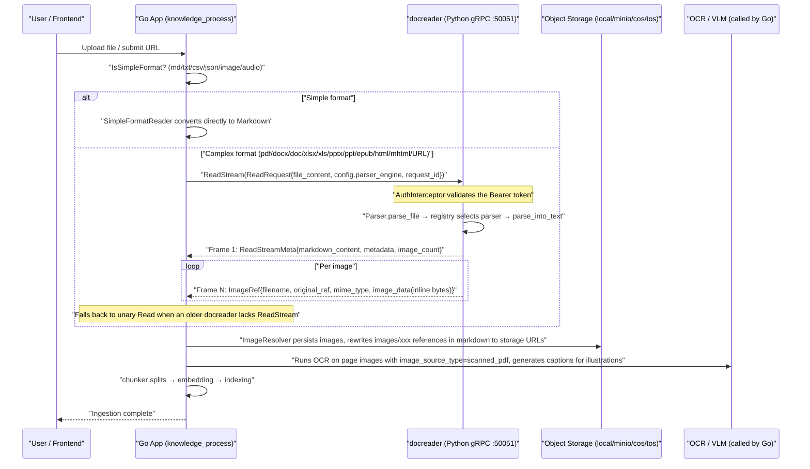
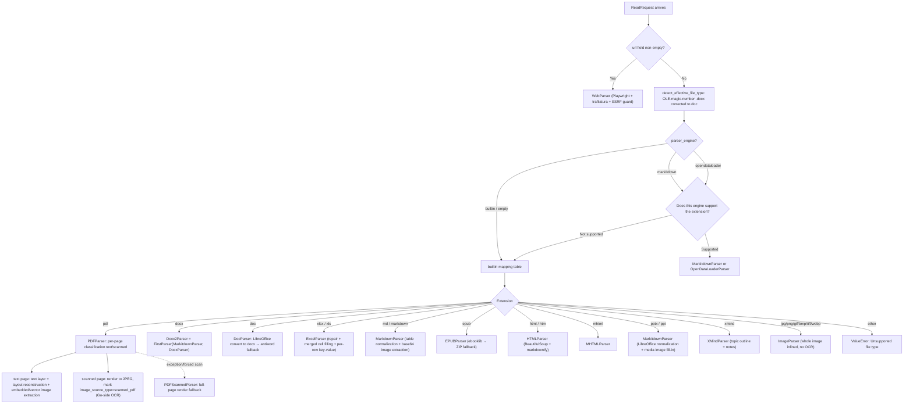

# Documentation Parsing Service — docreader

Document parsing converts uploaded files into searchable text and extracts raw image references. WeKnora supports many formats, and you can choose the parsing engine per file type; scanned documents, images, and audio additionally require the corresponding vision or speech model.

Supported formats:

| Category | Formats |
| --- | --- |
| Documents | PDF, Word (doc/docx), PPT (ppt/pptx), Excel (xls/xlsx), EPUB, XMind |
| Text | txt, Markdown, CSV, JSON |
| Web | Online URL scraping, local HTML / MHTML archives |
| Images | jpg, png, gif, bmp, tiff, webp (requires a vision model to understand content) |
| Audio | mp3, wav, m4a, flac, ogg (requires a speech recognition model) |

When parsing results aren't ideal, you can adjust:

- **Poor PDF layout reconstruction, misaligned tables**: in the knowledge base's parsing settings, specify a different parsing engine for `pdf` (MarkItDown / OpenDataLoader / MinerU);
- **Scanned documents with no text recognized**: confirm a vision model is configured, and force scanned-document mode if needed;
- **Excel's first row is column names but is treated as data**: enable "First row as header" for `xlsx`/`xls`;
- **Chunk content needs correcting**: edit the text in the chunk list; see [Knowledge Bases & Knowledge Management](02-knowledge-base.md#editing-chunks-and-adding-metadata).

## Parsing Mechanism and Configuration Reference

docreader is an independent Python gRPC service that converts files or URLs into Markdown and raw image references. The Go main service then handles chunking, image storage, OCR, image captioning, and vectorization.

The division of responsibilities between the parsing service and downstream processing is defined in `docreader/parser/base_parser.py`:

```python
class BaseParser(ABC):
    """Base parser interface.

    After the lightweight refactoring, BaseParser only extracts markdown text
    and raw image references from documents. Chunking, image storage, OCR,
    and VLM caption are handled by the Go App module.
    """
```

### Service Positioning and External Interface {#_1-service-positioning-and-external-interface}

#### Interface Protocol: Pure gRPC (No HTTP) {#_1-1-interface-protocol-pure-grpc-no-http}

The service entry point is `docreader/main.py`, which starts only a gRPC server (`grpc.server` + `ThreadPoolExecutor`), listening by default on port `50051`, and also registers the standard gRPC Health service (`grpc_health.v1`) for K8s / Docker health checks (paired with the `grpc_health_probe` binary in the image). **There is no HTTP interface at all**.

The proto definition is in `docreader/proto/docreader.proto`, with 3 RPCs in total:

```protobuf
service DocReader {
  rpc Read(ReadRequest) returns (ReadResponse) {}
  // Streaming version: sends 1 meta frame first (markdown/metadata/error), then 1 image per frame.
  // Avoids hitting the unary message size limit (RESOURCE_EXHAUSTED) with large scanned PDFs (hundreds of pages of images).
  rpc ReadStream(ReadRequest) returns (stream ReadStreamResponse) {}
  rpc ListEngines(ListEnginesRequest) returns (ListEnginesResponse) {}
}
```

`ReadRequest` is a unified request: set `file_content`/`file_name`/`file_type` for file mode, or `url`/`title` for URL mode; `config.parser_engine` specifies the engine (`builtin` / `markitdown` / `opendataloader`), and `config.parser_engine_overrides` passes engine-level override parameters (such as `pdf_force_scanned`, `odl_hybrid`).

`ReadResponse` returns `markdown_content` + `repeated ImageRef image_refs` (images are returned **inline as bytes**, `image_dir_path` is always an empty string — image persistence is entirely the Go App's responsibility; the original `image_storage` field 3 in the proto has been marked `reserved`).

The value of `ReadStream` (see `main.py::ReadStream` and `_iter_image_refs`): each frame is independent and small in size; the server decodes base64 and calls `images.pop(ref_path)` to free source data as it goes, so neither side needs to hold all images in memory at once, solving the peak-memory and message-size problems for large scanned PDFs. The Go side's `internal/infrastructure/docparser/grpc_parser.go` prefers calling `ReadStream`, and automatically falls back to unary `Read` when an older docreader version returns `Unimplemented`.

`ListEngines` is kept for backward compatibility only — a comment explicitly notes that the engine list is now managed on the Go side by `internal/infrastructure/docparser/engine_registry.go` (`docparser.ListAllEngines`); the Go App no longer calls this RPC, and remote engines like MinerU are handled natively by Go.

#### Authentication and TLS (auth.py) {#_1-2-authentication-and-tls-auth-py}

`docreader/auth.py` provides two layers of security, both enabled via environment variables:

**Token authentication (`AuthInterceptor`)**: enabled once `GRPC_AUTH_TOKEN` is set. Clients must carry `authorization: Bearer <token>` (or a bare token) in the metadata. Validation uses `hmac.compare_digest` to prevent timing attacks; a token shorter than 16 bytes triggers a warning. The two health-check methods (`/grpc.health.v1.Health/Check`, `/Watch`) pass through before authentication, ensuring health checks aren't affected. On authentication failure, `_make_abort_handler` constructs an abort handler matching the original RPC kind (unary/stream), returning `UNAUTHENTICATED` instead of letting the framework raise `INTERNAL`.

**TLS / mTLS (`load_tls_credentials`)**: when `GRPC_TLS_ENABLED=true`, `GRPC_TLS_CERT` / `GRPC_TLS_KEY` must be provided, with `GRPC_TLS_CA` optional; `GRPC_MTLS_REQUIRE_CLIENT_CERT=true` forces client certificates (when unset, it's auto-determined based on whether `GRPC_TLS_CA` is present). Any missing/failed TLS configuration raises `TLSConfigError`, which `main()` catches and then calls `sys.exit(1)` — **failing fast, refusing to silently degrade to plaintext**.

The Go-side client, in `docreader/client/auth.go` (`LoadAuthConfigFromEnv` reads the same-named environment variables `GRPC_TLS_ENABLED/CERT/KEY/CA/SERVER_NAME` and `GRPC_AUTH_TOKEN`), and `docreader/client/client.go`'s `NewClient` builds a connection with round_robin load balancing and a message size limit from `MAX_FILE_SIZE_MB`.

#### Interaction Timing with the Main Service {#_1-3-interaction-timing-with-the-main-service}

The Go App's `internal/application/service/knowledge_process.go` calls the parser at the docreader stage of the document ingestion pipeline (the timeout is controlled by the `docreader_call_timeout` config, preventing a hung docreader from tying up a worker for too long). Note: **md/markdown/txt/csv/json/images/audio are handled natively by the Go-side `SimpleFormatReader`, and do not go through docreader** (see `simpleFormats` in `internal/infrastructure/docparser/builtin_converter.go`).



---

### Parser Registration and Dispatch Mechanism {#_2-parser-registration-and-dispatch-mechanism}

#### Engine Registry (parser/registry.py) {#_2-1-engine-registry-parser-registry-py}

`ParserEngineRegistry` maintains a two-level mapping of `engine name → {file extension → parser class}`, and supports registering a `check_available` probe per engine (used by `ListEngines` to report availability and reasons for unavailability).

`_build_default_registry()` registers three engines:

| Engine | File Types | Description |
| --- | --- | --- |
| `builtin` | `docx`(Docx2Parser), `doc`(DocParser), `pdf`(PDFParser), `md`/`markdown`(MarkdownParser), `xlsx`/`xls`(ExcelParser), `pptx`/`ppt`(MarkitdownParser), `epub`(EPUBParser), `html`/`htm`(HTMLParser), `mhtml`(MHTMLParser), `xmind`(XMindParser), `jpg`/`jpeg`/`png`/`gif`/`bmp`/`tiff`/`webp`(ImageParser) | Built-in parsing engine; PPT/PPTX reuse the MarkItDown parser |
| `markitdown` | `md`, `markdown`, `pdf`, `docx`, `doc`, `pptx`, `ppt`, `xlsx`, `xls`, `csv` (all via MarkitdownParser) | Microsoft's MarkItDown library |
| `opendataloader` | `pdf`(OpenDataLoaderParser) | OpenDataLoader PDF layout analysis, requires Java 11+; `check_available` probes java, Python packages, and hybrid service health |

Dispatch rule (`get_parser_class`): if the engine requested doesn't support that file type, it **automatically falls back to the `builtin` engine**; if `builtin` doesn't support it either, a `ValueError("Unsupported file type")` is raised.

#### Facade and File Magic-Number Correction (parser/parser.py) {#_2-2-facade-and-file-magic-number-correction-parser-parser-py}

`Parser` is the facade class: `parse_file()` goes through the registry, `parse_url()` always uses `WebParser`. One important defensive mechanism is `detect_effective_file_type()` — OOXML `.docx` is actually a ZIP container, while old-style `.doc` is an OLE Compound File; WPS/Word tolerates renaming `.doc` to `.docx`, so a "docx" detected with an OLE magic-number header (`b"\xd0\xcf\x11\xe0\xa1\xb1\x1a\xe1"`) is force-routed to the DOC parser, avoiding feeding binary OLE data into the DOCX parser.

Engine override parameters `engine_overrides` (from the proto's `parser_engine_overrides`) are passed as `**kwargs` into the parser constructor — for example, `pdf_force_scanned` is captured by `PDFParser.__init__`.

#### Chained Parsers (parser/chain_parser.py) {#_2-3-chained-parsers-parser-chain-parser-py}

Two "chain of responsibility" combinators, both dynamically generating subclasses via the class factory `create(*parser_classes)`:

- **`FirstParser`**: tries multiple parsers in order, returning the result from the first one that produces `document.is_valid()` (i.e. `content != ""`); exceptions are caught and the next one is tried. Typical use case: `Docx2Parser = FirstParser.create(MarkitdownParser, DocxParser)`.
- **`PipelineParser`**: a pipeline where each parser's output text (re-encoded to bytes) becomes the next one's input, with `images`/`metadata` produced at each stage accumulated and merged. Typical use cases: `MarkdownParser = PipelineParser.create(MarkdownTableFormatter, MarkdownImageBase64)`, `WebParser = PipelineParser.create(StdWebParser, MarkdownParser)`, `MarkitdownParser = PipelineParser.create(StdMarkitdownParser, MarkdownParser)`.

#### Concurrency Model (parser/concurrency.py and elsewhere) {#_2-4-concurrency-model-parser-concurrency-py-and-elsewhere}

Concurrency control is layered into four levels:

1. **gRPC thread pool**: `ThreadPoolExecutor(max_workers=CONFIG.grpc_max_workers)` (default 4), i.e. at most 4 requests processed simultaneously.
2. **Named semaphore throttling** (`parser_worker_limit(name, max_workers)`): a process-level `threading.BoundedSemaphore` reused by name, limiting concurrency for heavy backends. Current throttle points: `"markitdown"` (default 1), `"opendataloader"` (default 1, each convert spins up a JVM), `"pdf_render"` (default 1). `max_workers <= 0` disables throttling.
3. **pdfium global lock** (`pdf_parser.py::_PDFIUM_LOCK`): the pdfium C library is process-global and **not thread-safe** — two gRPC workers parsing PDFs simultaneously can corrupt shared state or even deadlock the entire process (a request was once observed to hang permanently at "Parsing document with PDFParser"). Therefore **all pdfium operations (text extraction, page rendering, image extraction) are serialized behind this global lock**, and concurrent PDF uploads are processed as a queue; non-PDF parsers are unaffected.
4. **Process-level parallelism**:
   - PDF scanned-page rendering: `_render_pages_parallel` uses `ProcessPoolExecutor` (preferring the `forkserver` start method, to avoid the risks of forking a multi-threaded process) to distribute a single PDF's scanned pages across multiple worker processes for rendering (each process independently opens a `PdfDocument` from a temporary file), with parallelism controlled by `DOCREADER_PDF_RENDER_PARALLELISM` (default `min(4, cpu)`). This is the main lever for bringing down "1+ hour rendering for a large scanned document" on CPU-constrained containers; it transparently falls back to serial rendering on failure.
   - DOCX per-page parallelism: `docx_parser.py::Docx` distributes page tasks to a `ProcessPoolExecutor` + `Manager` shared list, with images passed across processes via `/tmp/docx_img_*` temp files, and finally encoded/uploaded together in the main process.
   - LibreOffice conversion (doc→docx, ppt→pptx, xls→xlsx): calls `soffice --headless` via `subprocess`, with each attempt using an independent `-env:UserInstallation=<temp profile>` to avoid silent failures from concurrent soffice instances fighting over the user profile lock, retrying 3 times with backoff on failure.

---

### Parsers in Detail {#_3-parsers-in-detail}

#### pdf_parser.py — PDFParser / PDFScannedParser (builtin engine's PDF) {#_3-1-pdf-parser-py-—-pdfparser-pdfscannedparser-builtin-engine-s-pdf}

**Dependencies**: `pypdfium2` (+ Pillow). No external service is needed (MinerU / Docling, etc.) — docreader itself does no OCR.

**Core design: per-page routing**. Each page is independently classified as `"text"` or `"scanned"` (`_classify_page`): the primary signal is **image area coverage ratio** (the bounding-box area of image objects on the page / page area, threshold `DOCREADER_PDF_SCAN_IMAGE_RATIO=0.5`) — a scanned page is essentially one large image covering the entire page, even if it carries a (often low-quality) embedded OCR text layer; the secondary signal is a text layer character count < `DOCREADER_PDF_SCAN_MIN_CHARS` (10) combined with some amount of image content. This design aligns with the routing approach of MinerU / Docling / DeepDoc, avoiding trusting a poor-quality text layer that would produce garbled RAG content.

Processing flow (`_route_locked`, three passes):

1. **Pass 1, text extraction + classification**: text pages go through the text layer. If `DOCREADER_PDF_LAYOUT_ORDERING=true` (default) and pdfium's plain text is not "well-formed" (`_plain_is_well_formed`), a **geometric layout reconstruction** is performed: glyph-level extraction (filtering hidden text render-mode 3, off-page glyphs — guarding against hidden-text prompt injection), recursive XY-cut column splitting (linearizing multi-column layouts by column), removal of margin/vertical watermark columns (arXiv sidebars), inferring inter-word spaces from character spacing (`WORD_GAP_WIDTH_RATIO`), and promoting large-font-size lines to Markdown headings based on line height relative to the page median (`DETECT_HEADINGS`). If the reconstruction result looks fragmented (a series of heuristics in `_should_prefer_plain`), it falls back to plain text. Afterward, `_postprocess_pdf_text` cleans up: placeholder characters like U+FFFE, arXiv watermark lines, page-number lines, and axis/legend debris from vector charts leaking into the text layer (`STRIP_CHART_TEXT_DEBRIS`). When a `Figure N` caption is detected on a text page, the **vector graphic region above the caption is also rendered to JPEG** (`RENDER_VECTOR_FIGURES`) and injected before the caption as ``.
2. **Pass 2, scanned-page rendering**: only renders scanned pages to JPEG (DPI `DOCREADER_PDF_RENDER_DPI=200`, quality `DOCREADER_PDF_JPEG_QUALITY=85`, long-edge clamp `DOCREADER_PDF_RENDER_MAX_EDGE=2000` px — preventing a PDF that declares an oversized page frame from rendering a 100+ MP image and hitting the gRPC limit), placeholdered in the markdown as ``, with metadata marking `image_source_type=scanned_pdf`, and **OCR is performed on these page images by the Go App** (the Go side's `image_multimodal.go` uses a dedicated `ocr_prompt` for `scanned_pdf` sources).
3. **Pass 3, embedded image extraction**: extracts embedded illustrations/charts from text pages (`EXTRACT_EMBEDDED_IMAGES`), filtered by minimum pixel size (80), minimum page-area ratio (1%), cross-page repeat rate (the same MD5 appearing on ≥50% of text pages is treated as a logo/watermark and removed), and a per-document cap (50 images), inserted into the markdown in top-to-bottom order within the page.

There's also `_strip_repeating_lines`, which conservatively removes cross-page repeating headers/footers (candidates are limited to the first/last line of each page, must be short, and must appear on ≥60% of text pages).

Any exception falls back to **`PDFScannedParser`**: a fallback parser that renders every page to JPEG (also used for `pdf_force_scanned` forced scanned mode, enabled via a per-upload override or `DOCREADER_PDF_FORCE_SCANNED`).

**Output**: Markdown (text-page text + image placeholders), an `images` dict, metadata (`page_count`/`scanned_page_count`/`text_page_count`/`embedded_image_count`/`vector_figure_count`/`image_source_type`).

**Limitations**: no table structure recognition (text-layer tables are output row by row); heading recognition is a font-size heuristic; scanned-page text relies entirely on Go-side OCR.

#### doc_parser.py — DocParser (old-style .doc Word) {#_3-2-doc-parser-py-—-docparser-old-style-doc-word}

Inherits from `Docx2Parser`, with a processing chain (tried in order):

1. `_parse_with_docx`: uses LibreOffice (`soffice --headless --convert-to docx`, independent profile + 3 retries) to convert DOC to DOCX, then parses via the parent class's DOCX chain (**the only path that can extract images**);
2. `_parse_with_antiword`: `antiword` command-line plain-text extraction (executed via `SandboxExecutor`, force-injecting proxy environment variables, defaulting to a `http://128.0.0.1:1` "black-hole proxy" to block unexpected outbound connections from the subprocess);
3. `_parse_with_textract`: **disabled** (textract has an SSRF vulnerability; the code is kept but commented out).

**Dependencies**: LibreOffice (soffice), antiword (already installed in the image); lookup paths support the `LIBREOFFICE_PATH`/`ANTIWORD_PATH` environment variables. External commands time out after 60 seconds by default; on timeout the whole process group is terminated (including child processes spawned by soffice), so leftover processes don't tie up the docreader worker. **Limitation**: without LibreOffice, it degrades to antiword plain-text extraction (no images, no table structure).

#### The Difference Between docx2_parser.py and docx_parser.py {#_3-3-the-difference-between-docx2-parser-py-and-docx-parser-py}

- **`Docx2Parser`** (the actual entry point for docx in the registry) has just 3 lines of core code: `FirstParser.create(MarkitdownParser, DocxParser)` — **tries MarkItDown first** (fast, good table-to-Markdown quality), falling back to the in-house `DocxParser` on failure or empty output.
- **`DocxParser`** (docx_parser.py, 1500+ lines) is an in-house python-docx-based parser:
  - patches python-docx with `load_from_xml_v2` (skipping relationships whose `target_ref` is `../NULL` and are corrupted, from python-docx issue #1105);
  - the `Docx` processing class detects page breaks (`lastRenderedPageBreak` / `w:br type="page"` / `sectPr`; documents with >1000 paragraphs switch to a "~25 paragraphs per page" heuristic mapping), **processed in parallel by page across multiple processes**;
  - extracts text and embedded images per paragraph (`a:blip/@r:embed` → related_part blob → PIL, skipping decorative images <50px, scaling images >1920px), preserving the original text/image order (`content_sequence`); images are inlined via the `_inline_upload` callback as base64 `images/<uuid>.<ext>`;
  - converts tables to HTML `<table>` (adjacent cells with identical text are merged into colspan);
  - falls back to `_parse_using_simple_method` on overall failure (pure python-docx sequential extraction of paragraphs + table rows, no images).
  - page limit `DOCREADER_DOCX_MAX_PAGES` (default 0 = unlimited).

#### excel_parser.py and Its Three Helper Modules (.xlsx / .xls) {#_3-4-excel-parser-py-and-its-three-helper-modules-xlsx-xls}

**`ExcelParser`** is based on pandas: reads a DataFrame per sheet, drops fully empty rows, and **converts each row into `column_name: value,column_name: value` key-value text**, with one `Chunk` per row (carrying start/end position). It strips out embedded-image function strings like WPS's `=DISPIMG("ID",mode)` and Office 365's `=_xlfn.IMAGE(...)` (`_IMAGE_FUNC_RE`). It does not extract images.

**Header mode**: XLSX and old-style XLS behavior has been unified — by default, row 1 is treated as data, with column names using letters `A`/`B`/`C` (to avoid mistaking a data row for a header and discarding it). If the sheet genuinely is a flat table where "the first row is column names," this can be enabled via a parser engine rule, `xlsx_first_row_as_header`: the first row is then promoted to column labels, and the key-value text becomes semantically meaningful, like `Name: Zhang San,Department: R&D`. Empty cells or embedded-image function values fall back to the column letter, and duplicate labels automatically get `_2`, `_3` suffixes appended to guarantee uniqueness.

This toggle is configured via the KB's `parser_engine_rules[].xlsx_first_row_as_header` setting (it can also be overridden per instance in the upload confirmation dialog); on the backend, `applyParserRuleOverrides()` only applies to rules for `xlsx`/`xls` where the engine is `builtin` (or left blank), and it's ultimately passed to docreader as `parser_engine_overrides`. The field type is `*bool`: `null` means falling back to the parser's default, an explicit `false` means turning it off.

The three helper modules handle real-world messy files:

- **`excel_convert.py`**: uses magic numbers / `inspect_excel_format` to detect the true format (xlsx/xls/xlsb/ods), selecting the pandas engine for each format (`xlrd`/`openpyxl`/`odf`); when unrecognizable (e.g. WPS `.et`, or a renamed csv), it normalizes via LibreOffice `convert-to xlsx` (`normalize_excel_bytes` tries the `.xlsx/.xls/.et/.csv` extensions in sequence).
- **`xlsx_merge.py`**: `fill_merged_cells_xlsx` un-merges merged cells and **copies the top-left primary value into every cell in the covered region** — openpyxl only stores a value in the top-left cell, and pandas would read the rest as NaN; after filling, row-based RAG chunks can retain their context.
- **`xlsx_repair.py`**: fixes common XLSX packaging issues — when `sharedStrings.xml`'s path casing/location is non-standard, it's renamed back into place; when the manifest references sharedStrings but it's missing from the package and the worksheet only uses inline strings, the reference is stripped from `[Content_Types].xml` and the workbook rels so openpyxl can read it.

Before XLSX is read, it always goes through `repair → fill_merged_cells` preprocessing, using `header=None` + A/B/C column letters as stable column names (for xls, it first tries treating the first row as a header, falling back to column letters when it encounters `Unnamed:` columns).

#### ppt_convert.py / pptx_media.py (.ppt / .pptx, serving the markitdown engine) {#_3-5-ppt-convert-py-pptx-media-py-ppt-pptx-serving-the-markitdown-engine}

The PPT family **has no dedicated parser** — it's handled by `MarkitdownParser`, with these two modules serving as its pre/post-processing helpers:

- **`ppt_convert.py`**: `normalize_ppt_bytes` determines by magic number (ZIP=pptx passes through directly; OLE=old-style ppt gets converted via LibreOffice `convert-to pptx`, independent profile + 3 retries). Without LibreOffice, it throws an error for .ppt directly, suggesting installation.
- **`pptx_media.py`**: a remedy for PPTX media that MarkItDown can't inline (especially WMF/EMF/SVG vector graphics) — it unpacks all resources under `ppt/media/`, rasterizes them to PNG in order using Pillow (bitmaps) or ImageMagick `convert` (vector, a catch-all for any format), then replaces the unresolved `` references in the markdown, in order, with `images/<uuid>.png` and inlines the image data.

#### image_parser.py — ImageParser (standalone image files) {#_3-6-image-parser-py-—-imageparser-standalone-image-files}

The simplest parser (29 lines): **does no OCR at all**. It inlines the whole image as base64 into `Document.images`, with the body text being just a single line, ``. **The OCR engine lives on the Go side** — docreader's Dockerfile comments explicitly state that "OCR/PaddleOCR-related dependencies have been removed"; on the Go side, OCR and captioning are done via `internal/infrastructure/docparser/paddleocr_vl_converter.go` / `paddleocr_vl_cloud_converter.go` (PaddleOCR-VL) and `image_multimodal.go`. Also note: Go's `simpleFormats` has already absorbed image formats for native Go handling, so docreader's ImageParser mainly serves SDK scenarios that call the gRPC directly.

#### markdown_parser.py — MarkdownParser (.md / .markdown) {#_3-7-markdown-parser-py-—-markdownparser-md-markdown}

`PipelineParser.create(MarkdownTableFormatter, MarkdownImageBase64)`:

- **`MarkdownTableFormatter`**: after automatic encoding detection (`endecode.decode_bytes`: utf-8 → gb18030 → gb2312 → gbk → big5 → ascii → latin-1), it normalizes tables — unifying `| cell |` spacing and alignment markers, with `normalize_spurious_table_prefixes` fixing the fake empty/separator-row prefixes produced by MarkItDown, and adding a `| --- |` GFM separator row to headerless Word tables.
- **`MarkdownImageBase64`**: extracts inline `` images into `images/<uuid>.<ext>` references + `Document.images` data (MIME subtypes support hyphenated formats like `x-emf`). Images that can't be decoded (for example, base64 immediately followed by a Chinese image caption) are skipped and logged, rather than failing the parse of the whole document.

This parser is also a shared post-processing stage of the MarkitdownParser / WebParser pipelines.

#### web_parser.py — WebParser (URL mode) {#_3-8-web-parser-py-—-webparser-url-mode}

`PipelineParser.create(StdWebParser, MarkdownParser)`. `StdWebParser` uses **Playwright (WebKit engine)** to render the page + **trafilatura** to extract the main content as Markdown:

- **Dual SSRF protection**: before navigation, `is_ssrf_safe_url(url)` validates it; then `page.route("**/*")` installs a route guard applying the same validation to **every sub-request and redirect target** (`utils/ssrf.py` mirrors the Go side's `internal/utils/security.go` policy: internal/loopback/link-local/cloud metadata domains, `.local`/`.internal` suffixes, direct IPs, IP-like hostnames, DNS-resolved restricted IPs, and dangerous ports are all blocked; the `SSRF_WHITELIST` / `SSRF_WHITELIST_EXTRA` environment variables allow exceptions).
- **SPA support**: after `domcontentloaded`, waits for networkidle (10s) + waits for `#app`/`main`/body to have ≥80 characters of visible text (15s), accommodating JS-rendered pages.
- **WeChat official account adaptation**: monkey-patches trafilatura's internal `utils.IMAGE_EXTENSION` (to recognize extensionless images from `mmbiz.qpic.cn/...wx_fmt=`) and `xpaths.BODY_XPATH` (prioritizing `#js_content` / `.rich_media_content`).
- **Fallback**: when trafilatura can't extract the main content, falls back to Playwright's visible text (≥50 characters) + page title.
- Proxying goes through `DOCREADER_EXTERNAL_HTTPS_PROXY`. Metadata extracts `title`.

#### mhtml_parser.py — MHTMLParser (.mhtml web archives) {#_3-9-mhtml-parser-py-—-mhtmlparser-mhtml-web-archives}

Uses the standard library's `email` module to parse the MIME structure: collects all `text/html` parts, **selecting the largest non-ad part** as the main content (filtered by a domain blacklist such as `googleads`/`doubleclick`); `image/*` parts are extracted into `images/...` (preferring the Content-Location filename, appending `_2` on conflict), with an alias table built from multiple spellings of `Content-Location`/`Content-ID`(`cid:`)/`X-Attachment-Id` (HTML-escaped, URL-encoded, basename, relative-path urljoin) to rewrite ``. HTML → Markdown uses BeautifulSoup (stripping script/style/noscript/iframe, unwrapping in-site links) + `markdownify`, followed by code-fence-aware blank-line normalization. If everything fails, it falls back to a ```` ```html ```` code block. Metadata: `source_format=mhtml`, `file_size`, `image_count`.

#### html_parser.py — HTMLParser (.html / .htm static web page files) {#_3-10-html-parser-py-—-htmlparser-html-htm-static-web-page-files}

HTML files uploaded directly by the user go through this path, separate from `parse_url()`'s online scraping: `HTMLParser = PipelineParser.create(HTMLToMarkdownParser, MarkdownParser)`.

- `HTMLToMarkdownParser` first decodes the raw bytes with `BeautifulSoup(content, "lxml")` — checking the BOM and any charset declared in the HTML first, then handing off to the unified Markdown conversion;
- HTML → Markdown reuses `MHTMLParser.html_to_markdown()`, but passes `extract_images=False` (a local HTML file has no MIME attachments to extract), `strip_internal_links=False` (keeps in-site links), and `fallback_to_raw_html=False` (returns empty rather than stuffing in an entire ```` ```html ```` block when conversion produces no content);
- Remote images referenced in the body via `` are filled in on the Go side: `internal/infrastructure/docparser/image_resolver.go` downloads these remote images with SSRF validation and re-uploads them to object storage, then rewrites the references, so they go through the same OCR / captioning pipeline as locally uploaded images.

#### xmind_parser.py — XMindParser (.xmind mind maps)

Reads `content.json` (new format) or `content.xml` (old format) from the XMind archive, with a 32 MiB limit per content file. Each sheet is output as a `# sheet title` section, the topic hierarchy becomes an indented Markdown list, plain-text notes are attached as blockquotes under their topics, and multiple sheets are separated by `---`. Images are not extracted; parsing fails when there are no renderable topics.

#### epub_parser.py — EPUBParser (.epub e-books) {#_3-11-epub-parser-py-—-epubparser-epub-e-books}

The primary path uses **ebooklib** (read in via a temp file): extracts DC metadata (title/author/publisher/language/description/date/isbn), preferring to process chapters in TOC order (each chapter takes its first h1/h2 as the chapter title, outputting `## chapter title` + markdownify-converted body text), with all `ITEM_IMAGE` extracted into `images/<uuid>.<ext>` and rewritten into `` via multiple path-alias variants; EPUB internal links (inter-chapter jumps, `#fragment`) are unwrapped to plain text only. If ebooklib fails, it falls back to **reading the ZIP directly**: html/xhtml files sorted by `chapter(\d+)` and converted one by one. Metadata includes `chapter_count`/`image_count`.

#### markitdown_parser.py — MarkitdownParser (markitdown engine) {#_3-12-markitdown-parser-py-—-markitdownparser-markitdown-engine}

`PipelineParser.create(StdMarkitdownParser, MarkdownParser)`. `StdMarkitdownParser` wraps Microsoft's **MarkItDown** library (`markitdown[docx,pdf,xls,xlsx]`): ppt/pptx are first normalized via `normalize_ppt_bytes`; conversion is first attempted with `keep_data_uris=True` (images kept as data URIs, to be extracted downstream by `MarkdownImageBase64`), falling back to `keep_data_uris=False` on failure; after pptx conversion, if the markdown still has unresolved image references, `attach_pptx_media_to_markdown` is called to fill them in. The whole thing is throttled by `parser_worker_limit("markitdown", DOCREADER_MARKITDOWN_MAX_WORKERS=1)`. **Limitation**: MarkItDown's PDF handling goes through pdfminer text extraction, which is useless for scanned documents (a comment in `parse_local.py --scanned` also notes that pdfminer can hang); table/layout reconstruction is weaker than the builtin PDF routing.

#### opendataloader_parser.py — OpenDataLoaderParser (opendataloader engine, PDF only) {#_3-13-opendataloader-parser-py-—-opendataloaderparser-opendataloader-engine-pdf-only}

Wraps the Apache-2.0 **opendataloader-pdf** (a Java-implemented layout analysis tool): each `convert()` call spins up a JVM (throttled by `parser_worker_limit("opendataloader", 1)`), producing markdown + an external image directory; it then collects all images under the output tree and builds an alias table (angle-bracket-wrapped `<images/foo.png>`, HTML entities, basename, `imageFileN` numbering alignment) to rewrite markdown image references. It supports **hybrid mode** (`DOCREADER_ODL_HYBRID=docling-fast`, etc.): calling an independently deployed `opendataloader-pdf-hybrid` HTTP service (`DOCREADER_ODL_HYBRID_URL`, default `http://127.0.0.1:5002`, corresponding to `docker/Dockerfile.odl-hybrid` on the Docker side), with an availability probe that retries (a fast 2s×1 probe; a 5s×6 probe before parsing to tolerate service cold starts). Output text <20 characters is judged a failure, and it **falls back to builtin's `PDFScannedParser`**. Availability check: `java` on PATH (needs Java 11+; the image has openjdk-17-jre-headless installed) + Python packages installed + hybrid healthy.

#### Parser Selection Decision Flow {#_3-14-parser-selection-decision-flow}



---

### Image Processing and Multimodal Division of Labor {#_4-image-processing-and-multimodal-division-of-labor}

The image contract on the docreader side is very simple: each parser returns images as `Document.images = {"images/<filename>": "<base64>"}`, with the markdown body referencing them relatively as ``.

`main.py` has two return paths:

- unary `Read`: `_resolve_images()` base64-decodes all images into **inline bytes** in `ImageRef.image_data`, returned all at once (`image_dir_path` is always empty — the historical "write to shared volume directory" pattern has been deprecated; a comment explicitly states *"The Go App is solely responsible for persisting images to the configured storage backend (local/minio/cos/tos)"*);
- streaming `ReadStream`: `_iter_image_refs()` yields them one at a time, `pop`-ping to free memory as it sends.

After the Go side takes over (`internal/infrastructure/docparser/image_resolver.go`): it uploads the inline bytes to object storage, rewrites the `images/...` references in markdown to storage URLs; then `internal/application/service/image_multimodal.go` decides based on the metadata's `image_source_type` — full-page images with `scanned_pdf` go through OCR (with a dedicated `ocr_prompt`), while regular illustrations go through VLM captioning. The custom image-parsing instructions configured on the knowledge base (`vlm_config.custom_instructions`) are only appended to the caption prompt, not the OCR prompt, so they don't interfere with OCR's output conventions (for example, an image with no text should be answered with `No text content`).

Inline HTML `<table>` elements in each parsing engine's output (common with MinerU, PaddleOCR-VL, and VLM OCR) are uniformly converted into Markdown tables before chunking; tables that can't be converted, such as those with merged cells, stay as HTML, but each row is placed on its own line so the chunker can split at row boundaries. **There is no VLM call anywhere inside docreader**; the `vlm_config`/`storage_config` fields in `models/read_config.py` are just empty shells kept for backward compatibility with the old constructor signature ("Legacy config kept for backward compatibility").

---

### The Relationship Between the splitter/ Chunker and the Go-side Chunker {#_5-the-relationship-between-the-splitter-chunker-and-the-go-side-chunker}

`docreader/splitter/splitter.py`'s `TextSplitter` is a recursive chunker with protected-pattern support:

- default `chunk_size=512`, `chunk_overlap=80`; the code comment explicitly states **"Aligned with internal/infrastructure/chunker/splitter.go (DefaultChunkOverlap = 80, DefaultChunkSize = 512). The Go splitter is now the production path; this Python splitter is kept for the docreader sidecar where it's still used."** — i.e. **chunking in the production pipeline happens on the Go side** (`internal/infrastructure/chunker/`, including heading_splitter, heuristic_splitter, header_tracker, etc.), and the Python version is kept only for sidecar scenarios/local debugging, with the algorithm/defaults on both sides kept in alignment.
- Splitting flow: recursively splits by separator priority (`\n`, `。`, spaces, character-level fallback) → uses `protected_regex` to extract unsplittable fragments (`$$...$$` math formulas, `` images, `[](...)` links, Markdown header+body rows, code block headers) → `_join` ensures protected fragments stay intact → `_merge` combines them according to chunk_size/overlap and produces `(start, end, text)` triples (which `restore_text` can losslessly reconstruct into the original text).
- `splitter/header_hook.py`'s `HeaderTracker` tracks Markdown table headers during merging: if a new chunk starts partway through a table body, it automatically prepends the header (including the separator row) into the chunk (skipped when column counts don't match, `header_column_mismatch`; an empty header row is filled in using the first data row's columns, matching the Go-side header_tracker's behavior), ensuring table chunks retrieved by RAG carry their own column-name context.

The gRPC response no longer returns chunks (`ReadResponse` has no chunk field); although `ExcelParser` does put per-row chunks into `Document.chunks`, the main pipeline only consumes `content`.

---

### Full Configuration Reference {#_6-full-configuration-reference}

#### config.py (`DocReaderConfig`, prints effective values at startup) {#_6-1-config-py-docreaderconfig-prints-effective-values-at-startup}

| Environment Variable (alias) | Default | Description |
| --- | --- | --- |
| `DOCREADER_GRPC_MAX_WORKERS` (`GRPC_MAX_WORKERS`) | 4 | gRPC thread pool concurrency |
| `DOCREADER_GRPC_MAX_FILE_SIZE_MB` (`MAX_FILE_SIZE_MB`) | 50 (MB) | gRPC send/receive message size limit (converted to bytes) |
| `DOCREADER_GRPC_PORT` (`PORT`) | 50051 | gRPC listen port |
| `DOCREADER_DOCX_MAX_PAGES` | 0 (unlimited) | Maximum DOCX pages processed |
| `DOCREADER_MARKITDOWN_MAX_WORKERS` | 1 | MarkItDown concurrency throttle (≤0 disables throttling) |
| `DOCREADER_ODL_MAX_WORKERS` | 1 | OpenDataLoader (JVM) concurrency throttle |
| `DOCREADER_ODL_HYBRID` | `off` | ODL hybrid mode (e.g. `docling-fast`) |
| `DOCREADER_ODL_HYBRID_URL` | `http://127.0.0.1:5002` | Hybrid service address |
| `DOCREADER_ODL_HYBRID_MODE` | `auto` | Hybrid mode parameter |
| `DOCREADER_ODL_HYBRID_FALLBACK` | false | Whether to fall back on hybrid failure |
| `DOCREADER_ODL_MARKDOWN_WITH_HTML` | false | Whether ODL markdown allows HTML |
| `DOCREADER_PDF_RENDER_MAX_WORKERS` | 1 | PDF rendering stage throttle (cross-request) |
| `DOCREADER_PDF_RENDER_PARALLELISM` | `min(4, cpu)` | Number of worker processes for scanned-page rendering within a single PDF |
| `DOCREADER_PDF_RENDER_DPI` | 200 | Scanned page render DPI |
| `DOCREADER_PDF_JPEG_QUALITY` | 85 | Page image JPEG quality |
| `DOCREADER_PDF_RENDER_MAX_EDGE` | 2000 | Long-edge pixel cap for rendered/extracted images (0 = unlimited) |
| `DOCREADER_EXTERNAL_HTTP_PROXY` / `DOCREADER_EXTERNAL_HTTPS_PROXY` (`EXTERNAL_HTTP_PROXY`/`EXTERNAL_HTTPS_PROXY`) | empty | External proxy (WebParser, DOC conversion subprocess) |
| `DOCREADER_IMAGE_OUTPUT_DIR` (`IMAGE_OUTPUT_DIR`) | `/tmp/docreader` | Temporary image directory (used as a fallback for local mode; the current main pipeline doesn't write to disk) |

#### PDF Routing Details (pdf_parser.py module-level environment variables, common ones only) {#_6-2-pdf-routing-details-pdf-parser-py-module-level-environment-variables-common-ones-only}

| Environment Variable | Default | Description |
| --- | --- | --- |
| `DOCREADER_PDF_SCAN_IMAGE_RATIO` | 0.5 | Image area coverage ratio ≥ this value classifies a page as scanned |
| `DOCREADER_PDF_SCAN_MIN_CHARS` | 10 | Below this character count is treated as no usable text layer |
| `DOCREADER_PDF_FORCE_SCANNED` | false | Treat all pages as scanned (also settable via the per-upload override `pdf_force_scanned`) |
| `DOCREADER_PDF_EXTRACT_EMBEDDED_IMAGES` | true | Extract embedded illustrations from text pages |
| `DOCREADER_PDF_EMBED_MIN_PIXELS` / `_EMBED_MIN_AREA_RATIO` / `_EMBED_REPEAT_PAGE_FRAC` / `_EMBED_MAX_IMAGES` | 80 / 0.01 / 0.5 / 50 | Embedded image filtering: minimum edge length / page-area ratio / logo detection repeat rate / per-document cap |
| `DOCREADER_PDF_LAYOUT_ORDERING` | true | Geometric layout reconstruction (multi-column reading order) |
| `DOCREADER_PDF_DETECT_HEADINGS` | true | Font-size heuristic heading detection |
| `DOCREADER_PDF_FILTER_HIDDEN_TEXT` | true | Filter invisible/off-page text (guards against prompt injection) |
| `DOCREADER_PDF_SANITIZE_TEXT` / `_STRIP_CHART_DEBRIS` | true | Clean up placeholder characters / chart debris lines |
| `DOCREADER_PDF_RENDER_VECTOR_FIGURES` | true | Render vector chart regions to JPEG |
| `DOCREADER_PDF_WORD_GAP_WIDTH_RATIO` / `_MARGIN_COL_WIDTH_RATIO` / `_MIN_HEADING_LINE_CHARS`, etc. | 0.4 / 0.12 / 8 | Layout-reconstruction fine-tuning parameters (see source constants section for details) |

#### Go-side Parsing Timeouts

The following environment variables apply to the Go main service, not the docreader container:

| Environment Variable | Type | Default | Description |
| --- | --- | --- | --- |
| `WEKNORA_DOCUMENT_PROCESS_TIMEOUT` | Go duration | `2h` | Total timeout for a single document processing task |
| `WEKNORA_DOCREADER_CALL_TIMEOUT` | Go duration | `30m` | Timeout for a single docreader call; must be smaller than the document processing timeout |
| `WEKNORA_PADDLEOCR_VL_TIMEOUT` | Go duration | `1000s` | HTTP request timeout for the self-hosted PaddleOCR-VL engine; empty, invalid, or non-positive values use the default |

When processing large files, leave headroom at each level from the inside out, for example PaddleOCR-VL `90m`, docreader `100m`, document processing `2h`.

#### Security and Miscellaneous {#_6-3-security-and-miscellaneous}

| Environment Variable | Description |
| --- | --- |
| `GRPC_AUTH_TOKEN` | When set, enables token authentication (metadata `authorization: Bearer <token>`) |
| `GRPC_TLS_ENABLED` / `GRPC_TLS_CERT` / `GRPC_TLS_KEY` / `GRPC_TLS_CA` / `GRPC_MTLS_REQUIRE_CLIENT_CERT` | TLS / mTLS; startup is refused if the configuration is invalid |
| `SSRF_WHITELIST` / `SSRF_WHITELIST_EXTRA` | SSRF whitelist (comma-separated, supports `*.suffix` and CIDR) |
| `SSRF_DNS_WHITELIST_ONLY` | When set to `true`, only host names on the whitelist may be accessed, and hosts not on the whitelist are rejected before DNS resolution; shares the same switch as the Go main service |
| `LOG_LEVEL` | Log level (default INFO; log format includes request_id and duration, see `utils/request.py`) |
| `LIBREOFFICE_PATH` / `ANTIWORD_PATH` | Overrides for the soffice / antiword executable paths |

---

### Deployment and Scaling Recommendations {#_7-deployment-and-scaling-recommendations}

#### Image and System Dependencies (docker/Dockerfile.docreader) {#_7-1-image-and-system-dependencies-docker-dockerfile-docreader}

Base image `python:3.10.18-bookworm`, a two-stage build (builder uses `uv sync --locked` to install dependencies + `scripts/generate_proto.sh` to generate pb code; runner copies the venv), `EXPOSE 50051`, `CMD ["uv", "run", "-m", "docreader.main"]`. Runtime system dependencies:

- **LibreOffice** (doc→docx, ppt→pptx, exceptional table→xlsx conversion) + a set of X/font libraries (libxinerama1, libfontconfig1, libcairo2, libcups2, etc.);
- **antiword** (.doc plain-text fallback);
- **openjdk-17-jre-headless** (OpenDataLoader PDF needs Java 11+);
- **Playwright WebKit**: `python -m playwright install webkit` + `install-deps webkit` — this is the only "model/browser binary download" step in the image (after the lightweight refactoring, **there's no OCR model download**; the Dockerfile comments explicitly state "OCR/PaddleOCR-related dependencies have been removed");
- **grpc_health_probe** (gRPC health-check probe, for container orchestration health checks);
- ImageMagick `convert`, if present, is used by `pptx_media.py` for WMF/EMF rasterization (an optional enhancement).

There are two more tools under `scripts/`: `generate_proto.sh` (uses grpc_tools.protoc to generate Python/Go code and fix import paths) and `parse_local.py` (calls Parser directly locally to debug parsing results, without going through gRPC; supports `--engine`, `--scanned`, `--out` to export markdown and images).

Python dependencies (locked via `pyproject.toml` + `uv.lock`): `grpcio`, `pypdfium2`, `markitdown[docx,pdf,xls,xlsx]`, `opendataloader-pdf`, `python-docx`, `pandas`/`openpyxl`/`xlrd`, `playwright`, `trafilatura`, `beautifulsoup4`/`markdownify`/`lxml`, `ebooklib`, `pillow`, `pydantic`, `textract` (disabled code path), etc.

#### Scaling and Tuning {#_7-2-scaling-and-tuning}

- **Horizontal scaling preferred**: the pdfium global lock means **PDF parsing is serialized within a single instance**, so PDF throughput mainly relies on scaling replicas. The Go client dials `dns:///` + `round_robin`, and under K8s a headless service is enough to balance load across replicas.
- **Single-instance vertical tuning**: with spare CPU, increase `DOCREADER_PDF_RENDER_PARALLELISM` (near-linear speedup for single-document rendering) and `DOCREADER_GRPC_MAX_WORKERS` (true concurrency for non-PDF formats); under memory constraints, prioritize ensuring the Go side uses `ReadStream` (the default behavior).
- **Large files**: `MAX_FILE_SIZE_MB` needs to be adjusted **in sync on both the Go client and docreader**; the size of scanned-page images is controlled by the three knobs `DOCREADER_PDF_RENDER_MAX_EDGE`/`_DPI`/`_JPEG_QUALITY`.
- **JVM/browser-class workload isolation**: OpenDataLoader spins up a JVM on every parse, and WebParser spins up WebKit every time — both are heavy processes; `DOCREADER_ODL_MAX_WORKERS` and `DOCREADER_MARKITDOWN_MAX_WORKERS` defaulting to 1 are conservative values, which can be relaxed or set to ≤0 to disable throttling when resources are ample. The ODL hybrid service (`Dockerfile.odl-hybrid`) should be deployed independently, with `DOCREADER_ODL_HYBRID_URL` configured accordingly.
- **Timeout protection**: the Go-side `WEKNORA_DOCREADER_CALL_TIMEOUT` (config file key `docreader_call_timeout`, default 30 minutes) limits each docreader call, preventing a hung docreader from tying up an ingestion worker for a long time; when large files need longer to parse, raise the document processing timeout accordingly (see [Go-side Parsing Timeouts](#go-side-parsing-timeouts)).
- **Security baseline**: enable `GRPC_AUTH_TOKEN` (≥16 bytes) + `GRPC_TLS_ENABLED` in production; without these, the service starts in plaintext + unauthenticated mode and prints a WARNING.

---

### anydoc Engine (In-Process Go Parsing, Bypassing docreader) {#_8-anydoc-engine-in-process-go-parsing-bypassing-docreader}

`anydoc` is an optional Go-side parsing engine: it links [anydoc](https://github.com/firecrawl/anydoc) (a document conversion library written in Rust) into the WeKnora main process via cgo and converts office documents directly into Markdown. Unlike the docreader described in the rest of this page, it **doesn't go through the Python service, doesn't cross processes, and doesn't call external binaries** — a good fit for lightweight deployments that don't want to deploy docreader, or for scenarios sensitive to parsing latency.

Supported file types: `doc`, `docx`, `docm`, `odt`, `rtf`, `ppt`, `pptx`, `pptm`, `odp`, `xls`, `xlsx`, `xlsm`, `ods`, `epub`, `csv`, `pdf`.

#### Enabling It {#_8-1-enabling-it}

The parsing library is a Rust static library and needs the Rust toolchain to build. The official Docker image (`wechatopenai/weknora-app`) and `docker compose build` **link anydoc by default**, so it can be selected directly on the settings page. A local `go build` does not link it by default: without `-tags anydoc`, the engine shows as unavailable in the "Parsing engine" list, and other engines are unaffected.

```bash
make build-anydoc                  # Build the static library + a binary with the anydoc tag
# Equivalent to:
scripts/build-anydoc-lib.sh && go build -tags anydoc ./cmd/server
```

The Docker image defaults to `WITH_ANYDOC=1`. To skip the Rust toolchain and shorten the build:

```bash
docker build -f docker/Dockerfile.app --build-arg WITH_ANYDOC=0 -t weknora-app .
# Or set WITH_ANYDOC=0 in .env, then run docker compose build
```

Explicit parsing rules take precedence. When no rules are configured and anydoc is linked, the complex formats it supports go through anydoc by default; PDF is the exception and still goes through builtin by default (anydoc only extracts the PDF text layer and loses images, tables, and layout, while builtin can detect scanned pages page by page and hand them to OCR). Simple formats continue to use the Go SimpleFormatReader. When anydoc is not linked, PPT/PPTX fall back to markitdown by default. If you need a fixed engine, specify it explicitly in the knowledge base's parsing settings (including assigning `pdf` to anydoc), rather than relying on the deployment's build options.

#### Capability Boundaries {#_8-2-capability-boundaries}

- **Scanned PDFs**: anydoc only extracts the PDF text layer. Scanned documents without a text layer report "OCR required"; if DocReader (builtin) is connected, AnydocReader automatically hands the file to builtin, which renders each page as JPEG and marks it `image_source_type=scanned_pdf`, so it still goes through Go-side OCR afterward. When DocReader is not connected, the conversion fails; use `builtin`, `mineru`, or `paddleocr_vl` instead.
- **Vertically merged cells are not backfilled**: docreader's `Docx2Parser` copies a vertically merged value into every row (see issue #2634), while anydoc outputs the value only in the starting row and leaves subsequent rows empty. For knowledge bases that depend on row-by-row table semantics, `builtin` is still more reliable.
- **Image positions**: when image extraction is enabled, embedded images in the document model are first rewritten as `images/image-N.ext` links and then handed to anydoc's official GFM serializer, so images stay in their original paragraph/table/list positions. Setting the engine override parameter `anydoc_extract_images=false` disables image extraction and uses faster plain-text rendering (embedded images degrade to alt text).
- **Does not handle URLs, images, or audio**: these remain the responsibility of `WebParser`, `SimpleFormatReader`, and the ASR pipeline.

#### Code Locations {#_8-3-code-locations}

| Path | Purpose |
| --- | --- |
| `internal/infrastructure/docparser/anydoc/` | Adapter layer: format mapping, availability checks, and the cgo / stub backends |
| `internal/infrastructure/docparser/anydoc_reader.go` | `DocReader` implementation: assembling conversion results and image references |
| `internal/infrastructure/docparser/engines.go` | Engine registration (metadata + Reader factory) |
| `third_party/anydoc-go/` | Vendored upstream Go bindings and C ABI shim (see that directory's README for the source and local changes) |

### MinerU Self-Hosted Engine (Direct Go Connection, Bypassing docreader) {#mineru-self-hosted}

The `mineru` engine is called directly by the Go App against a self-hosted MinerU service (`internal/infrastructure/docparser/mineru_converter.go`). MinerU 4.0 removed the old `/file_parse` endpoint in favor of the V1 API, so before each parse WeKnora first requests `GET {mineru_endpoint}/v1/health` and chooses the protocol based on the result:

| Probe result | Protocol | Flow |
| --- | --- | --- |
| `200` with `status=ok` | V1 (MinerU ≥ 4.0, `mineru_v1_client.go`) | `POST /v1/uploads` → upload the bytes to the returned `upload_url` → `POST /v1/uploads/{id}/complete` → `POST /v1/parse/jobs` (requesting only the `zip` artifact) → poll `GET /v1/parse/jobs/{id}` → `GET /v1/files/{id}/content` to download the zip, taking `markdown.md` and `images/` from it |
| `404` / `405` | Legacy (MinerU ≤ 3.x) | `POST /file_parse`, synchronously returning Markdown and base64 images |
| `503` with an error body | V1, but the service isn't ready | Fails immediately (commonly caused by a model preload failure), without falling back to the legacy protocol |

Upgrading MinerU requires no WeKnora configuration changes. How parameters map between the two protocols:

| Setting (`ParserEngineConfig`) | MinerU ≥ 4.0 | MinerU ≤ 3.x |
| --- | --- | --- |
| `mineru_endpoint` | V1 service address (e.g. `http://mineru:8000`) | Same |
| `mineru_server_api_key` | Sent as `Authorization: Bearer` when the service is started with `--api-key` | Not used |
| `mineru_tier` | `tier`: `flash` / `basic` / `standard` / `advanced`; leave empty to let the server choose the default tier (preferring `standard`) | Not used |
| `mineru_parse_method` | `ocr_mode` (`auto` / `txt` / `ocr`) | `parse_method` |
| `mineru_model`, `mineru_vlm_server_url`, `mineru_enable_formula`, `mineru_enable_table`, `mineru_language` | Ignored (4.0 removed these parameters; the VLM address is now configured in MinerU's `config.yaml`) | Sent as-is |

A few details of the V1 flow:

- Uploads include a `sha256sum`; when the server already has the same file, it is reused and the bytes are not sent again.
- The API Key is attached only when `upload_url` has the same origin as `mineru_endpoint` (same scheme, host, and port); cross-origin addresses (such as pre-signed object storage URLs issued by the official API) are sent without the Key and still go through SSRF validation.
- Polling starts at 2 seconds with exponential backoff, up to once every 30 seconds; the total duration is 1000 seconds, the same as the legacy protocol. On timeout or caller cancellation, `DELETE /v1/parse/jobs/{id}` is sent to cancel the server-side job.
- The MinerU V1 service keeps uploads and job status in process memory, so after a service restart, jobs being polled return 404 and the current parse fails immediately.
- On a V1 service, "Test connection" additionally requests the authenticated `GET /v1/parse/jobs?limit=1` to detect a missing or incorrect API Key (`/v1/health` itself does not check the Key).

`mineru_cloud` (mineru.net) still uses the `/api/v4/file-urls/batch` batch endpoint and is not affected by the 4.0 self-hosted service changes.

---

### Appendix: Key Facts Quick Reference

- **External interface**: gRPC only, port `50051` (`DOCREADER_GRPC_PORT`/`PORT`), RPCs: `Read` / `ReadStream` / `ListEngines` + the standard Health service.
- **Full set of file formats directly supported by docreader**: `pdf`, `docx`, `doc`, `xlsx`, `xls`, `pptx`, `ppt`, `xmind` (the markitdown engine additionally includes `csv`), `md`/`markdown`, `epub`, `html`/`htm`, `mhtml`, images `jpg/jpeg/png/gif/bmp/tiff/webp`, and URL web scraping; `txt`/`csv`/`json`/images/audio are handled natively in the main pipeline by the Go-side `SimpleFormatReader`, without going through this service.
- **OCR / VLM**: docreader has zero OCR, zero VLM internally; scanned pages and illustrations are returned as images, with OCR (PaddleOCR-VL) and captioning done by the Go App.
- **Image return**: inline bytes (`ImageRef.image_data`), with persistence to local/minio/cos/tos handled by Go.
- **Chunking**: the production path is on the Go-side chunker; the Python `TextSplitter` (512/80) is kept only for the sidecar and aligned with Go.
