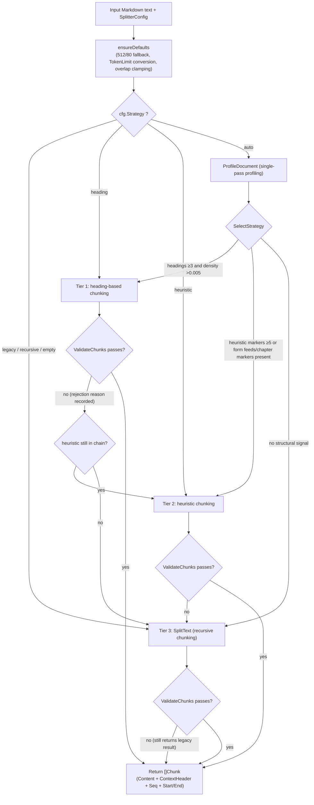
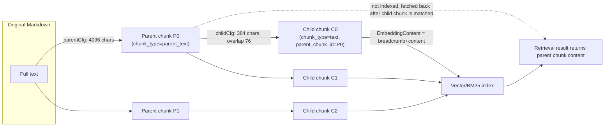

# Chunking Mechanism

Chunking divides a document into retrieval units. Smaller chunks help keep each one focused on a topic, while larger chunks preserve more context; chunk size and overlap need to be tuned based on document structure and retrieval results.

You can start with the UI defaults (chunk size 512 characters, overlap 80 characters, adaptive strategy), then adjust based on the symptoms below:

| Situation | Recommendation |
| --- | --- |
| Answers lack context or information is incomplete | Increase `chunk_size`, or enable parent-child chunking (retrieve child chunks, answer from parent chunks) |
| Retrieved chunks aren't very relevant to the question | Decrease `chunk_size` so each chunk stays focused on a single topic |
| Content is entry-based (FAQ, dictionary, parameter tables) | Set overlap to 0 to avoid adjacent entries contaminating each other |
| Content is long-form narrative (reports, papers) | Increase overlap to 150–200 to preserve semantic continuity across chunks |
| Preview the chunking result | Use `POST /api/v1/chunker/preview` to preview without writing to the database |

After changing the chunking configuration, existing documents must be re-parsed to use the new configuration.

## Parameter Quick Reference and Tuning Recommendations {#_10-parameter-quick-reference-and-tuning-recommendations}

| Scenario | strategy | chunk_size | chunk_overlap | Other |
|------|----------|------------|---------------|------|
| General documents (recommended starting point) | `auto` | 512 | 80 | — |
| Structured technical documentation / manuals | `auto` (will hit heading) | 512–1024 | 80 | Breadcrumbs apply automatically |
| OCR'd PDFs / plain-text books | `auto` (will hit heuristic) | 512–1024 | 80–150 | Specifying `languages` can reduce misdetection |
| Long narrative / argumentative documents | `auto` | 1000–2000 | 150–200 | Can be combined with parent-child chunking |
| Precise retrieval + long context | any | — | — | `enable_parent_child=true`, parent 4096 / child 384 |
| FAQ / atomic records | not applicable (FAQ KB chunks entry-by-entry) | — | 0 | `FAQIndexMode` controls whether answers are indexed |
| Embedding models with a strict token ceiling | any | — | — | Set `token_limit` to auto-convert to a character budget |
| Reproducing legacy-version behavior | `legacy` | original value | explicitly set to 64 | See the migration note in [ChunkingConfig (KB-level, overridable per upload)](#_1-1-chunkingconfig-kb-level-overridable-per-upload) |

## Chunking Mechanism Reference

WeKnora's chunking happens on the **Go side** (`internal/infrastructure/chunker` package), using an adaptive architecture of "document profiling → tiered strategy → result validation → progressive fallback." The Python side's `docreader/splitter/` retains a source-aligned recursive splitter for use by the docreader sidecar (the production main path is the Go implementation; a comment in `docreader/splitter/splitter.py` explicitly notes the two default values have been aligned).

### Configuration Model {#_1-configuration-model}

#### ChunkingConfig (KB-level, overridable per upload) {#_1-1-chunkingconfig-kb-level-overridable-per-upload}

`internal/types/knowledgebase.go`:

| Field | Type | Default | Description |
|------|------|--------|------|
| `chunk_size` | int | 512 (characters) | Target size for a single chunk. Roughly 100–130 English tokens / 300 Chinese tokens. For FAQ-style atomic content, 200–400 is recommended; for long narrative documents, 1000–2000 |
| `chunk_overlap` | int | 80 (~15%) | Number of overlapping characters between adjacent chunks. Can be set to 0 for atomic data, 150–200 for long narratives. Values exceeding `chunk_size/2` are clamped to half that |
| `separators` | []string | `["\n\n", "\n", "。"]` | Separator priority sequence for recursive chunking |
| `strategy` | string | `""` (= legacy) | Chunking strategy: `auto` / `heading` / `heuristic` / `recursive` / `legacy`, see [Adaptive Strategy: Three Tiers and the Fallback Chain](#_2-adaptive-strategy-three-tiers-and-the-fallback-chain) |
| `token_limit` | int | 0 (disabled) | Constrains chunk size by an approximate token count ceiling; when >0, converts to a character budget per language and takes the smaller value (0.9 safety factor) |
| `languages` | []string | empty (auto-detect) | Language hints for heuristic mode, e.g. `["zh"]`, `["en","de"]` |
| `enable_parent_child` | bool | false | Enables parent-child (two-level) chunking, see [Parent-Child Chunking (Multi-Granularity)](#_5-parent-child-chunking-multi-granularity) |
| `parent_chunk_size` | int | 4096 | Parent chunk size (parent-child mode only) |
| `child_chunk_size` | int | 384 | Child chunk size (parent-child mode only); child overlap is fixed at `child_size/5` (~20%) |
| `parser_engine_rules` | []ParserEngineRule | empty | File type → parser engine routing, along with parser-level switches such as `xlsx_first_row_as_header` (belongs to parsing rather than chunking, but shares this structure) |
| `table_metadata_instructions` | string | empty | Business guidance for CSV/Excel table summary generation |

The single source of truth for defaults is the `chunker` package constants (`splitter.go`):

```go
const (
    DefaultChunkSize    = 512
    DefaultChunkOverlap = 80
)
```

> Migration note (verbatim from source code comment): historically, the Go DefaultConfig used 64, knowledge.go used 50, and Python docreader used 100 as three different overlap defaults; these have now been unified to 80. For existing KBs where the DB stores `ChunkOverlap=0`, rebuilding the index will fall back to 80, and the embedding will no longer match the old value bit-for-bit.

#### SplitterConfig (runtime configuration) {#_1-2-splitterconfig-runtime-configuration}

The service layer maps `ChunkingConfig` to `chunker.SplitterConfig{ChunkSize, ChunkOverlap, Separators, Strategy, TokenLimit, Languages}` via `buildSplitterConfigFromChunking` (`knowledge_process.go`); the chunker package's internal `ensureDefaults` then applies further fallback logic:

- When `TokenLimit > 0`: `charBudget = CharsForTokenLimit(TokenLimit, lang)`; if smaller than `ChunkSize`, it takes precedence (`tokens.go`, character-to-token ratios: en 4.0, de 4.5, zh 1.7, mixed 3.0, with a 0.9 safety factor — ensuring chunks don't exceed the embedding model's token ceiling);
- When `ChunkOverlap > ChunkSize/2`, it is clamped to `ChunkSize/2`.

#### Relationship between IndexingStrategy and Chunking {#_1-3-relationship-between-indexingstrategy-and-chunking}

The four switches in `internal/types/indexing_strategy.go` determine which pipelines the chunking output flows into:

```go
type IndexingStrategy struct {
    VectorEnabled  bool // vector index
    KeywordEnabled bool // BM25 keyword index
    WikiEnabled    bool // Wiki generation
    GraphEnabled   bool // graph extraction
}
```

- When `NeedsChunks()` (any one enabled) is false, chunking is not needed;
- When `NeedsEmbedding()` (vector || keyword) is false, chunking only writes to the DB and skips `BatchIndex` (`skipStage(StageEmbedding)` in `processChunks`);
- Both Wiki and Graph consume text chunks as input during the post-processing stage.

### Adaptive Strategy: Three Tiers and the Fallback Chain {#_2-adaptive-strategy-three-tiers-and-the-fallback-chain}

The public entry point is `chunker.Split(text, cfg)` / `chunker.SplitWithDiagnostics` (`strategy.go`). The values of `cfg.Strategy` and how they're resolved (`resolveChainWithProfile`):

| Strategy value | Attempt chain (Tier Chain) | Description |
|-------------|----------------------|------|
| `auto` | Determined by the profiler; may be any subsequence of `[heading, heuristic, legacy]` | Recommended value; automatically selected based on document structure |
| `heading` | `[heading, legacy]` | Forces heading-based chunking, falls back to legacy on failure |
| `heuristic` | `[heuristic, legacy]` | Forces heuristic chunking |
| `recursive` | `[legacy]` | `recursive` is a public alias for `legacy` |
| `legacy` / `""` (empty) | `[legacy]` | The historical recursive chunker, kept as the backward-compatible default |

Each tier's output must pass the **Validator** (`validator.go`) to be accepted; otherwise the chain proceeds to the next tier. `legacy` is the final fallback — even if it also fails validation, its result is still returned (never returns empty):

Validator rejection rules:

| Rule | Rejection reason string |
|------|----------------|
| No output | `no chunks produced` |
| Document exceeds `2*chunkSize` but produces only 1 chunk | `single chunk for large document` |
| Non-trailing tiny chunks (<50 characters) exceed 1/4 of the total and number >2 | `too many tiny chunks` |
| Largest chunk is smaller than `chunkSize/4` (over-fragmentation) | `all chunks far below target size` |
| Largest chunk exceeds `2*chunkSize` (ignoring the budget) | `chunk exceeds 2x target size` |

#### Document Profiling (profiler.go) {#_2-1-document-profiling-profiler-go}

`ProfileDocument(text)` performs a single pass to produce a `DocProfile`: total characters/lines, mean and variance of line length, counts of Markdown headings at each level, numbered section count, count of short all-caps lines, consecutive blank-line blocks, form feed `\f` count, horizontal separator count, German/English/Chinese chapter marker counts, footer line count, whether tables/code are present, code ratio, and language detection (sampling the first 4096 bytes; `DetectLanguage` determines `zh/de/en/mixed` based on CJK-to-Latin ratio).

`SelectStrategy(profile)` assembles the attempt chain:

```go
// Tier 1 candidate: Markdown heading structure
if p.MdHeadingTotal >= 3 && p.HeadingDensity() > 0.005 && p.DominantHeadingLevel() > 0 {
    chain = append(chain, TierHeading)
}
// Tier 2 candidate: heuristic boundaries
if p.HeuristicMarkerTotal() >= 5 || p.FormFeedCount > 0 ||
    p.GermanChapterCount+p.EnglishChapterCount+p.ChineseChapterCount > 0 {
    chain = append(chain, TierHeuristic)
}
chain = append(chain, TierLegacy) // always the fallback
```

`DominantHeadingLevel` selects the primary split level: it prefers the "shallowest level that appears ≥3 times" (the document's true structural skeleton); otherwise it takes the deepest level that appears at all.

#### Chunking Decision Flowchart {#_2-2-chunking-decision-flowchart}



### The Three Chunking Algorithms in Detail {#_3-the-three-chunking-algorithms-in-detail}

#### Tier 1: Heading-Aware Chunking (heading_splitter.go) {#_3-1-tier-1-heading-aware-chunking-heading-splitter-go}

**Applies to**: Documents with well-formed Markdown heading structure (technical documentation, exported Word docs, bookmarked PDFs, etc.).

Algorithm:

1. Using `DominantHeadingLevel` as the primary level, `findHeadingBoundaries` finds all heading lines with `level <= primaryLevel` as segment boundaries (skipping pseudo-headings inside fenced code blocks); if there are ≤1 boundaries, it falls straight back to `SplitText`.
2. `HeadingHierarchy` (`heading_hierarchy.go`) maintains a 6-level heading stack: pushing a level-N heading pops all levels ≥N, and `BreadcrumbWithHashes()` outputs a breadcrumb like `"# Chapter One\n## Section 1.2"`.
3. For each section:
   - If `breadcrumb length + 2 + segment length <= ChunkSize`: the whole segment becomes one Chunk, with the breadcrumb placed in **`ContextHeader` (not in Content)**;
   - If too long: the segment is handed to `SplitText` for further splitting, and each sub-chunk uses `sectionBreadcrumbs` + `breadcrumbAtOffset` to obtain the "deepest heading path in effect at that offset" as its ContextHeader (sub-headings like `###`/`####` within a section are not flattened into the section-level heading).
4. `coalesceTinyChunks`: adjacent small chunks smaller than `ChunkSize/2` (floor 200) that share a heading prefix and are positionally contiguous (`cur.End == next.Start`) are merged — FAQ-style documents with many short subsections no longer collectively fall back to legacy due to "too many tiny chunks."

**Position invariant**: `End - Start == utf8.RuneCountInString(Content)` always holds (the breadcrumb is not counted in Content), and document reconstruction and UI highlighting depend on this.

#### Tier 2: Heuristic Boundary Chunking (heuristic_splitter.go + patterns.go) {#_3-2-tier-2-heuristic-boundary-chunking-heuristic-splitter-go-patterns-go}

**Applies to**: Documents without Markdown headings but with recognizable structural cues (OCR'd PDFs, plain-text manuals, scanned books, etc.).

First, all candidate boundaries are scanned (only the highest-priority match is kept at any given offset):

| Boundary type | Regex (patterns.go) | Priority |
|----------|---------------------|--------|
| Form feed `\f` | `FormFeedPattern` | 100 |
| Numbered section (`1.2.3 Title`, `IV. Results`) | `NumberedSectionPattern` | 90 |
| Chapter markers (`Chapter 3` / `Kapitel 2` / `第一章`, `第3节`) | `EnglishChapterPattern` / `GermanChapterPattern` / `ChineseChapterPattern` (filtered by the `Languages` hint; if empty, all are used) | 85 |
| Short all-caps heading line | `AllCapsHeadingPattern` | 70 |
| Visual separator (`---`, `===`, `***`) | `VisualSeparatorPattern` | 60 |
| Footer (`Page 3 of 10` / `Seite 3 von 10` / `页码 3`) | `PageFooterPattern` | 50 |
| ≥3 consecutive newlines | `ExcessiveBlanksPattern` | 40 |

Then:

- `dropBoundsInsideSpans`: boundaries falling **inside** a protected span (table/code block/formula, see [Tier 3: Recursive Chunking, legacy (splitter.go, ported from Python)](#_3-3-tier-3-recursive-chunking-legacy-splitter-go-ported-from-python)) are discarded; boundaries aligned to the edge are kept;
- **Greedy bin packing**: chunks accumulate along boundaries; once the accumulated content exceeds `ChunkSize` and already has ≥ `max(ChunkSize/4, 50)` content, a Chunk is emitted;
- Oversized spans between two boundaries are recursively handed to `SplitText`;
- Overlap alignment: `applyOverlapAligned` snaps preferentially to the nearest semantic boundary within the `[curEnd-2*overlap, curEnd)` window, falling back to a newline, so the next chunk doesn't start mid-word.

#### Tier 3: Recursive Chunking, legacy (splitter.go, ported from Python) {#_3-3-tier-3-recursive-chunking-legacy-splitter-go-ported-from-python}

This is the base implementation ported from `docreader/splitter/splitter.py`, and also serves as the fallback and "in-section re-splitting" engine for all tiers. Three steps:

**Step 1 — Protected span identification** (`protectedSpans`) — this content is never cut through the middle:

```go
var protectedPatterns = []*regexp.Regexp{
    regexp.MustCompile(`(?s)\$\$.*?\$\$`),                        // LaTeX block formulas
    regexp.MustCompile(`!\[[^\]\n]{0,200}\]\([^)\n]{1,500}\)`),   // Markdown images (single line, length-limited)
    regexp.MustCompile(`\[[^\]\n]{1,200}\]\([^)\n]{1,500}\)`),    // Markdown links (single line, length-limited)
    /* header row + separator row */ /* table data row */         // Markdown tables
    regexp.MustCompile("(?s)```(?:\\w+)?[\\r\\n].*?```"),          // fenced code blocks
    regexp.MustCompile("`[^`\\r\\n]+`"),                            // inline code
}
```

Image and link matching is limited to a single line, with link text of at most 200 characters and a URL of at most 500 characters (consistent with CommonMark's rule of not spanning blank lines). This way, a stray `[` left over from OCR won't pair with a distant `](` and turn an entire passage of body text into one unsplittable protected span.

Protected spans exceeding `maxProtectedSize = 7500` runes (oversized tables/code blocks) are force-split at a newline or space to avoid exceeding embedding API limits.

**Step 2 — Recursive separation** (`splitBySeparators`): splits by `Separators` priority order (default `\n\n` → `\n` → `。`); fragments still exceeding `ChunkSize` recursively apply the next-level separator (semantically consistent with the Python `_split`; separators are retained in the fragment).

**Step 3 — Merging and overlap** (`mergeUnits`): assembles small units into chunks; when `curLen + uLen + headersLen > chunkSize`, a chunk is emitted, and `computeOverlap` takes a trailing portion of the current chunk as the start of the next; absolute ceiling `absoluteMaxSize = 7500`.

What `computeOverlap` takes is a **semantic suffix**, not a fixed-length character slice:

- `ChunkOverlap` is a hard ceiling, not a target. The window takes `min(ChunkOverlap, ChunkSize - next unit length)` characters from the end of the chunk, then looks an additional 4 characters further back (`semanticOverlapLookbehind`, the length of the longest separator `\r\n\r\n`), to avoid missing a separator that's cut right at the window boundary; the last character of the candidate boundary must fall within the window (relative to the original window, ≥ -1), so the retained content never exceeds the ceiling;
- Boundary priority: paragraph separator (`\n\n`) > newline (`\n`) > sentence end (`。`, `？`, `！`, and English `. ` / `? ` / `! ` — English punctuation requires a following space, to avoid splitting `3.14` or `v1.2`). When priorities tie, the **earliest** one within the window is taken, to maximize effective overlap;
- The window can cut into the middle of a single `splitUnit` (the old implementation could only retain whole units, so ordinary paragraphs often degenerated to zero overlap), but it will not cross zero-width synthetic units where `start == end`, such as table header markers, in order to preserve the `Start/End` offset-to-Content correspondence invariant;
- Separators inside protected spans (code blocks, inline code `` ` ` ``, formulas, tables, images/links) don't count as boundaries; a boundary is also invalid if only whitespace remains after it;
- When no valid semantic boundary is found within the window, no overlap is retained, to avoid cutting in the middle of a word.

#### Table Handling: Header Tracking (header_tracker.go) {#_3-4-table-handling-header-tracking-header-tracker-go}

When a large Markdown table is split across multiple chunks, subsequent chunks lose the column-name context. `headerTracker` (ported from `docreader/splitter/header_hook.py`) solves this:

- Detects a "header row + separator row" (`| A | B |` + `| --- | --- |`) as the **active header**, which stays active until the table ends (a blank line, or a line not starting with `|`);
- When `mergeUnits` emits a new chunk, if the active header hasn't appeared in the overlap region/next unit and its column count matches (`headerAlreadyPresent` / `headerColumnMismatch`), the header is prepended to the new chunk as a `start==end` zero-width unit — every table fragment carries its own column names;
- An empty header (common with MarkItDown, `||` + `|---|---|`) is filled in using the first data row (`pendingExtend`);
- Table boundary awareness: if a new table row appears after `\n\n` at the end of a chunk, or a new row's column count doesn't match the header, the old header is ended and a chunk is forced (`headerEndedThisUnit`), preventing the previous table's header from contaminating the next table.

Additionally, inline HTML tables from all parser engines (MinerU, PaddleOCR-VL, VLM OCR, etc.) as well as from hand-written Markdown are converted to GFM Markdown tables before chunking by `NormalizeHTMLTables` in `docparser/html_table_normalizer.go`, so they enter the protection and header-tracking logic above. Tables with real merged cells (`rowspan`/`colspan` greater than 1) or that otherwise cannot be converted remain HTML, but each `<tr>` is put on its own line with blank lines before and after, so the chunker can split at row boundaries instead of hard-cutting at the 7500-character ceiling.

#### Image Handling {#_3-5-image-handling}

- Markdown image references `` are a protected pattern and are never cut through;
- `chunker.ExtractImageRefs(text)` (`splitter.go`) uses a regex supporting one level of nested parentheses to extract in-chunk image references, which `processChunks` uses to build chunk ↔ image associations;
- During the multimodal stage, each image generates two sub-chunks, `image_caption` / `image_ocr` (with `ParentChunkID` pointing to the text chunk), which are indexed separately — image semantics become retrievable, and a hit returns to the original text chunk.

### Context Header (ContextHeader) {#_4-context-header-contextheader}

`Chunk.ContextHeader` is a context string (heading breadcrumb) stored **separately** from Content:

```go
// internal/types/chunk.go
// ContextHeader is a Markdown heading breadcrumb prepended when indexing.
// It is persisted so a later content edit can rebuild the same index input.
ContextHeader string `json:"-" gorm:"type:text"`

func (c *Chunk) EmbeddingContent() string {
    body := strings.TrimSpace(c.Content)
    if c.ContextHeader == "" { return body }
    return c.ContextHeader + "\n\n" + body
}
```

Design points:

- **Only affects embedding, not the original text**: `processChunks` assembles the index content as `knowledge title + "\n" + chunk.EmbeddingContent()`, so the vector carries chapter context; while Content remains a verbatim slice of the original text, and the `StartAt/EndAt` offset invariant holds;
- **Persisted to the `chunks.context_header` column** (migration `000078`). In earlier versions this was an in-memory field (`gorm:"-"`) discarded once indexing finished; after manual chunk editing was introduced, re-indexing a single chunk must reproduce the same index input, so it was changed to be persisted. `json:"-"` is unchanged, so it's still not returned in API responses;
- For parent-child chunking, `mergeBreadcrumbs` (`strategy.go`) merges the parent/child breadcrumbs and removes duplicate leading lines, so child chunks get a finer-grained path than their parent.

### Parent-Child Chunking (Multi-Granularity) {#_5-parent-child-chunking-multi-granularity}

When `EnableParentChild = true`, two-level chunking is enabled (`chunker.SplitParentChild`, the strategy-aware version; the legacy version is `SplitTextParentChild`):

1. First, **parent chunks** are cut using `parentCfg` (default 4096 characters, reusing the configured overlap, inheriting Strategy);
2. Each parent chunk is then cut into **child chunks** using `childCfg` (default 384 characters, overlap = child chunk size / 5, inheriting Strategy);
3. Child chunk `Seq` is continuous across the whole document, `Start/End` is translated back to document-level offsets, and `ParentIndex` points to the parent chunk; if a parent chunk produces only a single child chunk identical to itself, no parent chunk is stored (`ParentIndex = -1`), to avoid redundancy.

Service-side persistence rules (`processChunks` in `knowledge_process.go`):

- Parent chunks → `ChunkTypeParentText`, **written to DB only, not entered into the vector index**; parent chunks are linked via a `PreChunkID/NextChunkID` chain;
- Child chunks → `ChunkTypeText` + `ParentChunkID`, the only granularity that gets embedded/indexed;
- At retrieval time, child chunks are matched but parent chunk content is returned — small-window precise matching plus large-window context.

`buildParentChildConfigs` specifically emphasizes that Strategy must be passed through: otherwise an empty Strategy resolves to the legacy tier, and parent/child chunks silently lose heading alignment and ContextHeader breadcrumbs.



### The Special Case of FAQ Chunking {#_6-the-special-case-of-faq-chunking}

FAQ knowledge bases **don't go through any chunking algorithm**: each Q&A pair is itself a `ChunkTypeFAQ` Chunk (`knowledge_faq.go`), with Content generated by `buildFAQChunkContent` according to the indexing mode:

```go
builder.WriteString(fmt.Sprintf("Q: %s\n", meta.StandardQuestion))
// Similar Questions: listed one by one
// Negative examples (NegativeQuestions) are not written into Content — must not be indexed
if mode == types.FAQIndexModeQuestionAnswer && len(meta.Answers) > 0 {
    // Answers: listed one by one
}
```

- Structured data is stored in `Chunk.Metadata` (`FAQChunkMetadata`); `ContentHash` (normalized SHA256) is used for import deduplication and clone delta sync;
- Indexing modes: `question_only` / `question_answer` (KB-level `FAQIndexMode`); question indexing mode `combined` (standard question + similar questions share one vector) / `separate` (each similar question gets its own vector, supporting incremental updates);
- The general recommendation of `chunk_overlap = 0` for FAQ scenarios naturally holds here — there is no overlap between entries.

### Integration with the Ingestion Pipeline {#_7-integration-with-the-ingestion-pipeline}

The call chain in `knowledge_process.go`:

```
processDocument
  └─ convert()                          // docreader → Markdown
  └─ imageResolver.ResolveAndStore()    // store images, rewrite URLs
  └─ buildSplitterConfigFromChunking()  // ChunkingConfig → SplitterConfig
  └─ chunker.Split / SplitParentChild   // the algorithms described in this document
  └─ processChunks()                    // build Chunk rows, EmbeddingContent → BatchIndex
```

The chunking stage has its own Span (`StageChunking`, recording `chunks_planned/chunks_written/total_text_chars`), with failure error code `ErrCodeChunkingFailed`.

### Debug Capability: POST /api/v1/chunker/preview (chunker_debug.go) {#_8-debug-capability-post-api-v1-chunker-preview-chunker-debug-go}

A read-only preview endpoint, used by the KB editor's "chunking debug panel" to test-run sample text before changing parameters — it **doesn't write to the DB, doesn't produce embeddings, and doesn't log text content**.

Request body:

```json
{
  "text": "sample text…",
  "chunking_config": {
    "chunk_size": 512, "chunk_overlap": 80,
    "separators": ["\n\n", "\n", "。"],
    "strategy": "auto", "token_limit": 0, "languages": ["zh"],
    "enable_parent_child": false,
    "parent_chunk_size": 4096, "child_chunk_size": 384
  }
}
```

When `enable_parent_child: true` is passed, the preview returns the **child chunks** (matching the granularity actually hit during retrieval), while the diagnostic information comes from the parent-chunk pass. Preview and ingestion share `chunker.NormalizeSplitterConfig()` and `chunker.DeriveParentChildConfigs()` to derive the configuration, avoiding a situation where "the preview looks fine but ingestion produces something different" — earlier, the preview always test-split at a single level, so for knowledge bases with parent-child chunking enabled, the preview result didn't match the real result.

Response (`PreviewChunkingResponse`):

| Field | Description |
|------|------|
| `selected_tier` | The tier that ultimately won (`heading`/`heuristic`/`legacy`) |
| `tier_chain` | The attempt chain for this run |
| `rejected` | Each rejected tier and the reason given by the Validator (`TierRejection{tier, reason}`) |
| `profile` | The full `DocProfile` (comes from the strategy selection process when `auto`; computed on demand for an explicit strategy) |
| `chunks[]` | Each chunk's `seq/start/end/size_chars/size_tokens_approx/context_header/content` |
| `stats` | `count/avg_chars/min_chars/max_chars/stddev_chars`, computed over the **full** chunk set; if truncated, includes `truncated_to` |

Safeguards (constants): input ceiling `previewMaxChars = 64k` runes (returns 413), returned chunk count ceiling `previewMaxChunks = 500` (statistics are still computed over the full set), timeout `previewTimeout = 5s` (the splitter doesn't accept a context, so after timeout the handler returns 504 but the worker goroutine runs to completion naturally — the 64k ceiling is the main safeguard). Diagnostic information is produced by `chunker.SplitWithDiagnostics`, whose JSON shape is part of the public API.

Route registration (`internal/router/routes_knowledge.go`):

```go
g.apiKeyRoute(r, http.MethodPost, "/chunker/preview",
    apiKeyRetrieve(apiKeyIngest(apiKeyFullAccess())), g.Viewer(), handler.PreviewChunking)
```

### The Python-Side Chunker (docreader/splitter/) {#_9-the-python-side-chunker-docreader-splitter}

The `TextSplitter` in `docreader/splitter/splitter.py` is the prototype for the Go legacy implementation, and is still kept around for the docreader sidecar:

- Defaults are aligned with Go: `DEFAULT_CHUNK_SIZE = 512`, `DEFAULT_CHUNK_OVERLAP = 80`; the constructor's default separators are `["\n", "。", " "]`, with a character-level split as the final fallback;
- Uses the same set of protected regexes (formulas/images/links/table headers/table rows/code blocks); `_split` (recursive separation) → `_split_protected` + `_join` (protected-span isolation) → `_merge` (overlap merging + `HeaderTracker` header prepending);
- Produces `(start, end, text)` triples and asserts `"".join(splits) == text` for full reconstruction; `restore_text` demonstrates the de-overlap reconstruction algorithm;
- `HeaderTracker` in `docreader/splitter/header_hook.py` behaves identically to the Go `header_tracker.go` (header detection, empty-header completion, ending on column-count mismatch).

## Implementation Reference

Source code involved:

| Module | File |
|------|------|
| Strategy entry point and fallback chain | `internal/infrastructure/chunker/strategy.go` |
| Document profiling | `internal/infrastructure/chunker/profiler.go` |
| Tier 1 heading-based chunking | `internal/infrastructure/chunker/heading_splitter.go`, `heading_hierarchy.go` |
| Tier 2 heuristic chunking | `internal/infrastructure/chunker/heuristic_splitter.go`, `patterns.go` |
| Tier 3 recursive chunking (legacy) | `internal/infrastructure/chunker/splitter.go` |
| Header tracking | `internal/infrastructure/chunker/header_tracker.go` |
| Result validation | `internal/infrastructure/chunker/validator.go` |
| Token estimation | `internal/infrastructure/chunker/tokens.go` |
| Configuration structures | `internal/types/knowledgebase.go` (`ChunkingConfig`), `internal/types/indexing_strategy.go` |
| Pipeline integration | `internal/application/service/knowledge_process.go` (`buildSplitterConfigFromChunking` / `buildParentChildConfigs` / `processChunks`) |
| Debug endpoint | `internal/handler/chunker_debug.go` (`POST /api/v1/chunker/preview`) |
| Python side | `docreader/splitter/splitter.py`, `docreader/splitter/header_hook.py` |
