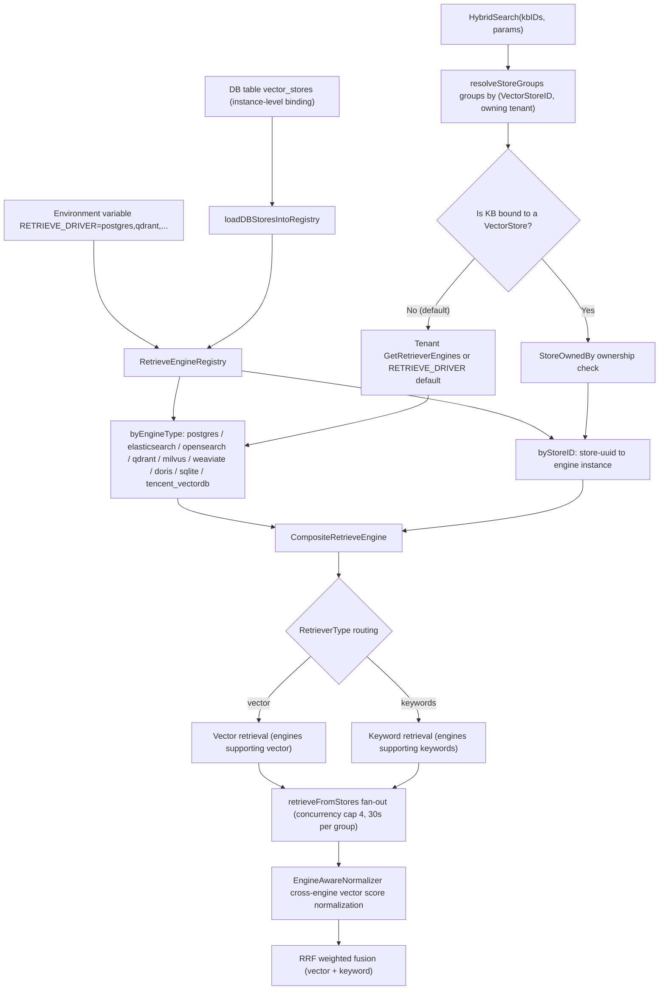
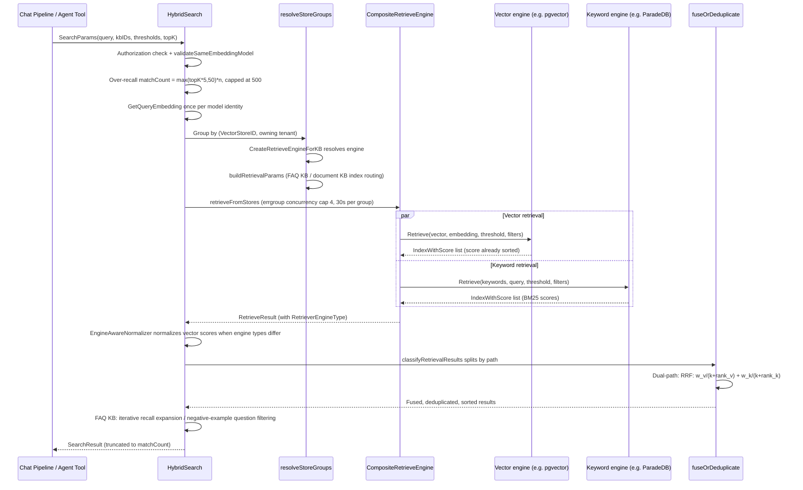

# Retrieval Engines & Vector Storage (Retrieval Engines)

Where vectors are stored and how keyword search works is determined by the "retrieval engine." WeKnora supports 10 backends, but **most deployments don't need to choose**: the default PostgreSQL (ParadeDB image bundled with pgvector + BM25) can do both vector and keyword search, shares a database with business data, and has the lowest operational cost.

Typical reasons to switch:

| Situation | Consideration |
| --- | --- |
| Single-machine / desktop edition, don't want to run a database | SQLite (embedded, zero dependencies) |
| Vector scale reaches tens of millions, needs independent scaling | Qdrant, Milvus |
| Company already has an Elasticsearch / OpenSearch stack | Reuse the existing cluster |
| Need to store data separately per knowledge base | Keep the default engine, and register an instance in "Settings → Vector Storage" bound to a specific knowledge base |

Switching engines requires rebuilding the index, and once a knowledge base is created, its bound vector store can't be changed. Below is a detailed, engine-by-engine breakdown of retrieval capabilities, index-building methods, filtering capabilities, and configuration methods. Source locations are as follows:

| Component | Source Location |
|------|----------|
| Engine registration (env + DB store) | `internal/container/container.go` (`initRetrieveEngineRegistry`), `engine_factory.go` |
| Registry / composite engine / factory | `internal/application/service/retriever/` (`registry.go`, `composite.go`, `factory.go`, `normalizer.go`) |
| Individual engine implementations | `internal/application/repository/retriever/{postgres,sqlite,elasticsearch,opensearch,qdrant,milvus,weaviate,doris,tencentvectordb,neo4j}` |
| Hybrid retrieval scheduling & fusion | `internal/application/service/knowledgebase_search*.go` |
| Engine type constants | `internal/types/retriever.go` |
| Tenant default engine | `internal/types/tenant.go` (`GetDefaultRetrieverEngines`) |
| Environment variable list | `.env.example` (section C1), `docker-compose.yml` |

## 1. Layered Architecture: Repository → KVHybridRetrieveEngine → Composite → Registry

Each backend implements `interfaces.RetrieveEngineRepository` (`EngineType()` / `Support()` / `Save` / `BatchSave` / `Retrieve` / `DeleteBy*` / `CopyIndices` / `BatchUpdateChunkEnabledStatus` / `BatchUpdateChunkTagID` / `EstimateStorageSize`). Above it, in order:

- **KVHybridRetrieveEngine** (`retriever/keywords_vector_hybrid_indexer.go`): wraps the Repository into a `RetrieveEngineService`, responsible for computing embeddings during indexing according to the supported retrieval types and writing them;
- **CompositeRetrieveEngine** (`retriever/composite.go`): a composite pattern. `Retrieve` routes by each `RetrieveParams.RetrieverType` (`vector` / `keywords`) to the first engine that supports that type and executes concurrently; write operations like `Index` / `Delete` / `CopyIndices` are broadcast to all member engines;
- **RetrieveEngineRegistry** (`retriever/registry.go`): a dual-index registry — `byEngineType` (an "env store" driven by the `RETRIEVE_DRIVER` environment variable, one per type) and `byStoreID` (instance-level registration driven by the database `VectorStore` table; the same engine type can register multiple instances, e.g. two ES clusters).

#### On-demand reconstruction (rehydrate)

If a vector store happens to be unavailable at startup (the backend hasn't come up yet, network jitter), it won't enter `byStoreID`; after that, all knowledge base retrievals bound to that store — and even deleting the knowledge base — will keep failing. The registry therefore supports **on-demand reconstruction**:

- When `GetOrLoadByStoreID` misses, it builds the engine on the spot using the injected `VectorStoreRepository` + `EngineFactory` and registers it; if either the repository or the factory is nil, it falls back to a plain lookup;
- A single build has an `EngineBuildTimeout` (10s) cap, and `singleflight` merges concurrent requests into a single build;
- A failed build enters a `rebuildCooldown` (30s) cooldown, to avoid every request waiting out a full timeout when the backend stays down;
- A `storeGen` generation counter guards against races: it's sampled before the build starts, and the result is only published if the generation hasn't changed, so registrations or deletions that happen during the build won't be overwritten by a stale result.

When deleting a knowledge base, if the engine isn't ready yet, it also takes this reconstruction retry path instead of failing outright.

### 1.1 Engine Registration: initRetrieveEngineRegistry

`internal/container/container.go`. At startup it parses `RETRIEVE_DRIVER` (comma-separated), builds a client for each driver in turn, and calls `registry.Register(retriever.NewKVHybridRetrieveEngine(repo, engineType))`; if a single driver fails to initialize, only a log entry is recorded and startup is not blocked. Then `loadDBStoresIntoRegistry` loads tenant-created vector store instances from the `vector_stores` table, builds the engine via `createEngineServiceFromStore` (`engine_factory.go`), and registers it with `RegisterWithStoreID`.

### 1.2 Engine Selection During Retrieval

The retrieval entry point `HybridSearch` (`knowledgebase_search.go`) selects the engine based on the KB's binding relationship:

1. `resolveStoreGroups` groups the KBs participating in retrieval by `(VectorStoreID, owning tenant)`;
2. For each group, `retriever.CreateRetrieveEngineForKB` (`factory.go`) is called:
   - If the KB isn't bound to a store (`VectorStoreID` is empty, the current default) → use the tenant's `GetRetrieverEngines()`: if the tenant has configured `RetrieverEngines.Engines`, use that; otherwise `GetDefaultRetrieverEngines()` generates it from the `RETRIEVE_DRIVER` environment variable (`internal/types/tenant.go`);
   - If the KB is bound to a store → first `ownership.StoreOwnedBy` validates tenant ownership (preventing cross-tenant probing; on failure returns `ErrVectorStoreForbidden`), then `registry.GetByStoreID` retrieves the instance (returns `ErrVectorStoreNotFound` if not registered), wrapped into a single-member Composite;
3. `buildRetrievalParams` generates vector and keyword `RetrieveParams` based on the engine's `SupportRetriever` capability and the KB type (FAQ knowledge bases only go through the FAQ vector index; document knowledge bases go through the default vector index + keyword index);
4. With multiple groups, `retrieveFromStores` uses an errgroup for concurrent fan-out (cap of 4 groups, per-group timeout `MULTI_STORE_RETRIEVE_TIMEOUT_SEC`, default 30s); when results span engine types, score normalization is applied.



## 2. Engine-by-Engine Breakdown

Engine type constants are in `internal/types/retriever.go`: `postgres`, `elasticsearch`, `opensearch`, `qdrant`, `milvus`, `weaviate`, `doris`, `sqlite`, `tencent_vectordb` (there are also `infinity` and `elasticfaiss` legacy enum values with no deployable implementation). Unless otherwise noted, all engines' `Support()` returns both `[keywords, vector]` types.

### 2.1 PostgreSQL (pgvector + ParadeDB) — Default Engine

`internal/application/repository/retriever/postgres/repository.go`. Data shares a database with the business data (the `embeddings` table, managed by GORM).

- **Vector retrieval**: pgvector `halfvec` (half precision, 2 bytes/dimension). The `embedding` column has no fixed dimension; the HNSW index is built on the expression `(embedding::halfvec(dim)) halfvec_cosine_ops` — **the ORDER BY expression must exactly match the index expression** (explicit cast on both sides), otherwise it degrades to a sequential scan (the source comment cites pgvector issue #702/#835). The query first uses a subquery to fetch `expandedTopK` (TopK*2, clamped to [100,200], to avoid a large LIMIT dragging down HNSW) candidates, computing `distance = embedding <=> query`, then filters by `distance <= 1-threshold`, with `score = 1 - distance`. Within the transaction, `SET LOCAL hnsw.ef_search` (≥40) and `SET LOCAL hnsw.iterative_scan = strict_order` (pgvector ≥ 0.8, keeps replenishing recall under selective filtering) are set; on older versions where the GUC doesn't exist, it automatically degrades and retries.
- **Keyword retrieval**: ParadeDB `pg_search` BM25 — `content ||| query` (matches any token) + `paradedb.score(id) as score`.
- **Filtering**: `knowledge_base_id` / `knowledge_id` / `tag_id` IN filtering (AND semantics), `is_enabled` is NULL or true.
- **Index building**: `BatchSave` + `ON CONFLICT DO NOTHING`; deletion is a physical delete by chunk/source/knowledge ID.

### 2.2 SQLite (FTS5 + sqlite-vec) — Lightweight Single-Machine

`internal/application/repository/retriever/sqlite/repository.go`. A fully embedded solution with zero external dependencies.

- **Vector retrieval**: the `sqlite-vec` extension (cgo bindings), **one vec0 virtual table per dimension**: `CREATE VIRTUAL TABLE ... USING vec0(embedding float[dim] distance_metric=cosine)`; the query is `WHERE v.embedding MATCH ?` (serialized query vector) `ORDER BY v.distance`, `score = 1 - distance`. At startup, `ensureExistingVecTables` creates missing virtual tables based on existing data dimensions.
- **Keyword retrieval**: an FTS5 contentless table `lite_embeddings_fts`; at write time it's manually **tokenized with bigrams** (friendly to Chinese), and queries are also bigram-tokenized via `sanitizeFTS5Query` before `MATCH`.
- **Filtering**: KB/knowledge/tag/is_enabled filtering on the main table `lite_embeddings`. Filter conditions on the vector path must **take effect before top-k** — written as a subquery `v.rowid IN (SELECT ... FROM lite_embeddings filtered WHERE ...)` rather than filtering after a JOIN; otherwise vec0 fetches the globally nearest k rows first and then most get filtered out, causing "matches exist but recall is empty" when a specific knowledge base or tag is specified;
- **Error propagation**: if either retrieval path errors, the error is returned directly rather than stuffing an empty result with an `Error` field and continuing — the latter would be treated by the upper layer as "retrieval succeeded but no hits";
- **Threshold**: a vector threshold of 0 is treated as no filtering, rather than filtering out all results.
- Suitable for the desktop edition / development environment / very small-scale deployments.

### 2.3 Elasticsearch v8

`internal/application/repository/retriever/elasticsearch/v8/repository.go`. A typed client, single index (`ELASTICSEARCH_INDEX`, default `WeKnora`), documents contain a `dense_vector` embedding field.

- **Vector retrieval**: a `script_score` query, script `cosineSimilarity(params.query_vector, 'embedding')` (Lucene forbids negative final scores, actual range is [0,1]); threshold filtering happens on the application side.
- **Keyword retrieval**: a `match` query on the content field (BM25).
- **Filtering**: bool filter (KB/knowledge/tag ID terms; `is_enabled` uses must_not for inverse matching — historical data without this field is treated as enabled); at startup, mapping is probed to determine whether the ID field needs a `.keyword` suffix.
- **Index building**: bulk write via the Bulk API; empty vectors are rejected.

### 2.4 Elasticsearch v7 — Keyword-Only

`internal/application/repository/retriever/elasticsearch/v7/repository.go`. Note: **`Support()` returns only `[keywords]`** — the v7 driver in WeKnora is registered only as a BM25 keyword engine (the code retains the `script_score cosineSimilarity` vector query construction, but the declared capability doesn't include vector, so Composite won't route vector requests to it). When vector retrieval is needed, it should be paired with another driver (e.g. `RETRIEVE_DRIVER=postgres,elasticsearch_v7`) or upgraded to v8.

### 2.5 OpenSearch

`internal/application/repository/retriever/opensearch/` (split across multiple files: `repository.go`, `retrieve.go`, `query.go`, `mapping.go`, `crud.go`, etc.). The most fully engineered driver.

- **Version gating** `probeVersion`: rejects ES distributions and OS 1.x / 2.0-2.3 (Lucene HNSW preview versions); 2.4-2.10 is accepted with a warning; 2.11+ / 3.x is accepted cleanly (primarily tested on 3.3.2). `probeKNNPlugin` requires all nodes to have the `opensearch-knn` plugin installed.
- **Vector retrieval**: the k-NN plugin's `knn` query (`query.go buildKNNQuery`); k-NN's `COSINESIMIL` space type returns `(1+cosine)/2`, naturally in [0,1].
- **Keyword retrieval**: `match` on content (BM25). Hybrid doesn't go through OS's native hybrid pipeline — it's uniformly handed off to the upper-layer RRF fusion (explicitly noted in a `query.go` comment).
- **Index building**: `mapping.go` declares mapping (the `knn_vector` field with method/engine parameters); mapping fingerprint is validated at startup, drift reports `ErrConfigInvalid`; alias management + `copy.go` supports reindexing; index create/rebuild events are written to an audit log via AuditSink.
- Configuration includes `OPENSEARCH_INSECURE_SKIP_VERIFY` and an SSRF-safe transport layer (`transport.go`).

### 2.6 Qdrant

`internal/application/repository/retriever/qdrant/repository.go`. A gRPC client (default port 6334).

- **Collection management**: **one collection per dimension**: `{QDRANT_COLLECTION|weknora_embeddings}_{dim}`, Distance=Cosine; payload fields (kb_id/knowledge_id/chunk_id/tag_id, etc.) have keyword indexes built; content has a **multilingual tokenizer full-text index** built.
- **Vector retrieval**: the `Query` API, score is the normalized vector dot product (≈cosine, [0,1] under IR embedding), threshold is pushed down via score_threshold.
- **Keyword retrieval**: after local `tokenizeQuery` tokenization, each token is turned into a `MatchText(content, token)` **should (OR) filter**, and `Scroll` iterates the collection of the matching dimension to fetch results; no BM25 scoring (hits are simply returned, scoring is determined by the upper-layer RRF rank).
- **Filtering**: `getBaseFilter` uses `MatchKeywords` for exact filtering on KB/knowledge/tag/is_enabled.
- Configuration: `QDRANT_HOST` / `QDRANT_PORT` / `QDRANT_API_KEY` / `QDRANT_USE_TLS`.

### 2.7 Milvus

`internal/application/repository/retriever/milvus/repository.go`.

- **Collection management**: one collection per dimension (`{MILVUS_COLLECTION|weknora_embeddings}_{dim}`). The schema contains a dense vector `embedding` (HNSW index, M=16 efConstruction=128, metric determined by `MILVUS_METRIC_TYPE`: IP default / COSINE) and a sparse vector `content_sparse` — automatically generated from content via a **built-in BM25 Function** (`entity.FunctionTypeBM25`), paired with `AutoIndex(BM25)`.
- **Vector retrieval**: `Search` + `WithANNSField(embedding)`; COSINE mode has a raw range of [-1,1], making it the only engine that requires `(score+1)/2` normalization.
- **Keyword retrieval**: BM25 sparse-vector retrieval against `content_sparse` (Milvus 2.5+ native full-text search).
- **Filtering**: `filter.go` constructs boolean expressions (kb/knowledge/tag/is_enabled).
- **Enable/disable sync**: `BatchUpdateChunkEnabledStatus` updates collection by collection; failures are aggregated with `errors.Join` and **returned as an error** rather than just logged as a warning — chunks already disabled in the primary database must never remain retrievable due to a silently failed index update.
- Configuration: `MILVUS_ADDRESS` / `MILVUS_USERNAME` / `MILVUS_PASSWORD` / `MILVUS_DB_NAME` / `MILVUS_METRIC_TYPE` (changing this requires rebuilding the collection).

### 2.8 Weaviate

`internal/application/repository/retriever/weaviate/repository.go`. Dual channel, HTTP + gRPC.

- **Class management**: dynamically creates a Class (resolved via `WEAVIATE_COLLECTION`), supports ReplicationConfig / ShardingConfig.
- **Vector retrieval**: GraphQL `nearVector` + `WithCertainty(threshold)`; certainty = `(2-distance)/2`, naturally [0,1], threshold pushed down natively.
- **Keyword retrieval**: GraphQL **BM25** query (`Bm25ArgBuilder`).
- **Filtering**: GraphQL where filter on KB/knowledge/tag/is_enabled.
- Configuration: `WEAVIATE_HOST` / `WEAVIATE_GRPC_ADDRESS` / `WEAVIATE_SCHEME` / `WEAVIATE_AUTH_ENABLED` + `WEAVIATE_API_KEY`.

### 2.9 Apache Doris (4.1+)

`internal/application/repository/retriever/doris/` (`repository.go` at 699 lines + `schema.go` + `structs.go`). Connects to the FE via the MySQL protocol (9030); HTTP (8030) uses Stream Load (an SSRF-safe client).

- **Table creation**: one table per dimension (prefix `DORIS_TABLE_PREFIX|weknora_embeddings`); `schema.go` generates the DDL: an ANN index using HNSW + `inner_product` (vectors are unit-normalized before write/query, equivalent to cosine); the content column has an **inverted index with a chinese parser declared** (no application-side tokenization needed). After DDL, it polls until the ANN index is ready.
- **Compatibility mode** `DORIS_COMPAT_MODE`: `auto` (probes) / `inner_product_duplicate` (DUPLICATE KEY table + `inner_product_approximate`) / `legacy` (`1 - cosine_distance_approximate`); can't be switched after table creation.
- **Vector retrieval**: `inner_product_approximate(embedding, query)` (equivalent to cosine after normalization) or the legacy formula, with SQL LIMIT TopK.
- **Keyword retrieval**: `content MATCH_ANY ?` via the inverted index.
- **Writes**: DUPLICATE KEY tables maintain replace semantics via explicit delete + insert by id; enabled/tag updates go through Stream Load partial update.
- Configuration: `DORIS_ADDR` / `DORIS_HTTP_PORT` / `DORIS_DATABASE` / `DORIS_USERNAME` / `DORIS_PASSWORD` / `DORIS_TABLE_PREFIX` / `DORIS_COMPAT_MODE`.

### 2.10 Tencent Cloud VectorDB

`internal/application/repository/retriever/tencentvectordb/repository.go`. RpcClient, EventualConsistency, 10s timeout.

- **Collection management**: one collection per dimension (`{TENCENT_VECTORDB_COLLECTION|weknora_embeddings}_{dim}`), a trio of indexes: dense vector HNSW+COSINE (M=16, efConstruction=200), **sparse vector SPARSE_INVERTED+IP** (server-side BM25), and a scalar FILTER index (id primary key + content/source/chunk/knowledge/kb/tag filter fields).
- **Vector retrieval**: Search COSINE, SDK range is [-1,1] (IR embedding is actually [0,1]).
- **Keyword retrieval**: local `encoder.SparseEncoder` (BM25) encodes the query into a sparse vector, performs sparse retrieval against the `sparse_vector` field, iterating over all collections of the matching dimension.
- Configuration: `TENCENT_VECTORDB_ADDR` / `TENCENT_VECTORDB_USERNAME` / `TENCENT_VECTORDB_API_KEY` / `TENCENT_VECTORDB_DATABASE` / `TENCENT_VECTORDB_COLLECTION`. If any of the three core settings is missing, registration is skipped.

### 2.11 Neo4j — Graph Retrieval (Outside the Registry System)

`internal/application/repository/retriever/neo4j/repository.go` implements `RetrieveGraphRepository` (`SearchNode(ctx, NameSpace, entities)`), not a vector/keyword engine: it retrieves entity nodes and relationships by `NameSpace{KnowledgeBase, Knowledge}`, serving the `ENTITY_SEARCH` stage of the chat pipeline (GraphRAG). Enabled via `NEO4J_ENABLE=true` + `NEO4J_URI`/`NEO4J_USERNAME`/`NEO4J_PASSWORD`.

## 3. Capability Matrix and Selection Comparison

| Engine | RETRIEVE_DRIVER value | Vector retrieval | Keyword/full-text | Keyword scoring | Chinese tokenization | Dimension management | Threshold push-down | Deployment complexity | Use case |
|------|-------------------|----------|------------|-----------|---------|----------|---------|-----------|----------|
| PostgreSQL | `postgres` | pgvector halfvec + HNSW expression index | ParadeDB BM25 (`\|\|\|`) | BM25 (paradedb.score) | ParadeDB tokenizer | Single table with mixed dimensions, expression index casts per dimension | Distance threshold within SQL | Low (built into default image) | Default choice; shares a database with business data, transactionally consistent |
| SQLite | `sqlite` | sqlite-vec vec0 (cosine) | FTS5 contentless | FTS5 | Application-side bigram | One vec0 virtual table per dimension | Application side | Very low (embedded) | Desktop edition / development / micro deployments |
| Elasticsearch v8 | `elasticsearch_v8` | script_score cosineSimilarity | match (BM25) | BM25 | ES analyzer | dense_vector single index | Application side | Medium | Already have an ES 8 cluster |
| Elasticsearch v7 | `elasticsearch_v7` | Not supported (Support only returns keywords) | match (BM25) | BM25 | ES analyzer | — | — | Medium | Existing ES 7, keyword engine only, needs to be combined with another vector engine |
| OpenSearch | `opensearch` | k-NN plugin knn (HNSW) | match (BM25) | BM25 | OS analyzer | knn_vector declarative mapping + fingerprint validation | Native k-NN | Medium | Production ES-family solutions needing audit/alias/reindex; version 2.11+/3.x |
| Qdrant | `qdrant` | Native HNSW Cosine | Full-text index MatchText (token OR) | No scoring (Scroll returns on hit, relies on RRF rank) | Multilingual tokenizer | One collection per dimension | Native score_threshold | Medium | Vector-first scenarios needing payload filtering |
| Milvus | `milvus` | HNSW (IP/COSINE) | BM25 Function sparse vector | BM25 | Milvus analyzer | One collection per dimension | Application side | Medium-high | Large-scale vectors, needs native BM25 hybrid search |
| Weaviate | `weaviate` | nearVector (certainty) | Native BM25 | BM25 | Weaviate tokenizer | Dynamic Class | Native certainty | Medium | GraphQL ecosystem, needs replica/shard configuration |
| Doris | `doris` | ANN HNSW inner_product/cosine | Inverted index MATCH_ANY | Inverted index hit | chinese parser declared at table creation | One table per dimension | Within SQL | High | Existing Doris data warehouse, retrieval and analytics combined |
| Tencent Cloud VectorDB | `tencent_vectordb` | HNSW COSINE | Sparse vector BM25 (SPARSE_INVERTED) | BM25 | SDK SparseEncoder | One collection per dimension | Application side | Low (cloud-hosted) | Tencent Cloud-hosted, ops-free |

> Note: regardless of whether an engine itself provides "hybrid retrieval," WeKnora's hybrid approach is always a **unified upper-layer RRF fusion** (`knowledgebase_search_fusion.go`) — vector and keyword retrieval are each performed independently, then merged with rank-weighted combining (see §5); each engine therefore only needs to provide the two single-mode retrieval types separately.

## 4. Embedding Dimension Management

WeKnora allows different KBs to use different embedding models (with varying dimensions); each engine's dimension isolation strategy:

| Engine | Strategy |
|------|------|
| PostgreSQL | Single table `embeddings` with mixed storage, a per-row `dimension` column; HNSW is built on the `embedding::halfvec(dim)` expression, and retrieval uses `WHERE dimension = ?` + a same-dimension cast to hit the corresponding index |
| SQLite | One `vec0` virtual table per dimension (automatically created at startup based on existing data dimensions) |
| Qdrant / Milvus / TencentVectorDB | One collection per dimension: `{base}_{dim}`, lazily created via `ensureCollection` on first write (a sync.Map remembers already-created dimensions) |
| Doris | One table per dimension: `{prefix}_{dim}`; `schema.go` generates the DDL and polls until the ANN index is ready |
| Elasticsearch / OpenSearch | A single index with `dense_vector`/`knn_vector` mapping (`ELASTICSEARCH_INDEX` / `OPENSEARCH_INDEX`), dimension fixed in the mapping |

Consistency on the retrieval side is guaranteed by `validateSameEmbeddingModel` (`knowledgebase_search_shared.go`): all KBs in a single multi-KB retrieval must share the same embedding model identity (`model.Name + BaseURL`, equivalent across tenants), otherwise the request is rejected — avoiding incomparable scores across vector spaces. Query vectors are grouped by model identity and computed only once (`ResolveEmbeddingModelKeys` + `GetQueryEmbedding`), then propagated to all store groups via `params.QueryEmbedding`, eliminating duplicate embedding API calls.

## 5. Hybrid Retrieval Scoring and Normalization

### 5.1 Cross-Engine Vector Score Normalization (EngineAwareNormalizer)

`internal/application/service/retriever/normalizer.go`. When there's a multi-store fan-out and results span engine types (`hasMixedEngineTypes`), each engine's vector scores are mapped to a unified [0,1]:

| Engine | Raw range | Normalization |
|------|---------|--------|
| Milvus (COSINE) | [-1, 1] raw cosine | `(score + 1) / 2` then clamp01 |
| Elasticsearch v8 | [0, 1] (Lucene script_score non-negative invariant) | passthrough clamp01 |
| OpenSearch | [0, 1] (k-NN COSINESIMIL already computes `(1+cos)/2`) | passthrough clamp01 |
| Weaviate | [0, 1] (certainty is defined as `(2-distance)/2`) | passthrough clamp01 |
| Postgres / SQLite / Qdrant / TencentVectorDB / Doris | Theoretically [-1,1], IR-normalized embeddings actually [0,1] | passthrough clamp01 |
| Unknown engine | — | clamp01 fallback + one WARN per request |

**Keyword (BM25) scores are not normalized** — their range has no upper bound, and compressing them would collapse the long tail; downstream RRF is rank-based and naturally immune to scale differences. `clamp01` also handles NaN/Inf, protecting the strict weak ordering invariant of downstream sorting. Results within the same engine keep their native scale (directly comparable, no unnecessary transformation).

### 5.2 RRF Weighted Fusion

`knowledgebase_search_fusion.go`. When both vector and keyword paths have results:

```go
// fuseWithRRF
rrfScore = vectorWeight/(rrfK + vectorRank) + keywordWeight/(rrfK + keywordRank)
```

- rank is the 1-indexed rank of each path's results (each engine already returns results sorted by score);
- `rrfK`, `vectorWeight`, `keywordWeight` come from the tenant's `RetrievalConfig` (`GetEffectiveRRFK` / `GetEffectiveRRFWeights` provide defaults);
- When there's only a single-path result, RRF isn't used; `deduplicateByScore` keeps the highest raw score per chunk (important for FAQ embedding similarity semantics, e.g. `FAQDirectAnswerThreshold` compares directly against this score).

The composite score after fusion (rerank model score 0.6 + retrieval base score 0.3 + source weight 0.1, MMR, FAQ/Wiki weighting) happens in the `CHUNK_RERANK` stage of the chat pipeline — see §3.4 of the "Full Retrieval-QA Pipeline" document.

## 6. Configuration Summary

Core switches (`.env.example` section C1, `docker-compose.yml`):

| Environment variable | Default | Description |
|----------|------|------|
| `RETRIEVE_DRIVER` | `postgres` | Comma-separated multiple drivers: `postgres` / `sqlite` / `elasticsearch_v7` / `elasticsearch_v8` / `opensearch` / `qdrant` / `milvus` / `weaviate` / `doris` / `tencent_vectordb`. With multiple drivers, writes are broadcast to all of them, and retrieval is routed by type |
| `MULTI_STORE_RETRIEVE_TIMEOUT_SEC` | 30 | Per-group timeout for parallel multi-store retrieval |
| `ELASTICSEARCH_ADDR` / `_USERNAME` / `_PASSWORD` / `_INDEX` | — / `WeKnora` | Shared by ES v7/v8 |
| `OPENSEARCH_ADDR` / `_USERNAME` / `_PASSWORD` / `_INDEX` / `_INSECURE_SKIP_VERIFY` | — | OpenSearch |
| `QDRANT_HOST` / `_PORT` / `_COLLECTION` / `_API_KEY` / `_USE_TLS` | `localhost` / 6334 / `weknora_embeddings` | Qdrant (gRPC port) |
| `MILVUS_ADDRESS` / `_COLLECTION` / `_METRIC_TYPE` / `_USERNAME` / `_PASSWORD` / `_DB_NAME` | `localhost:19530` / `weknora_embeddings` / `IP` | Collection must be rebuilt after changing the metric |
| `WEAVIATE_HOST` / `_GRPC_ADDRESS` / `_SCHEME` / `_AUTH_ENABLED` / `_API_KEY` / `_COLLECTION` | `weaviate:8080` / `weaviate:50051` / `http` | Use the service name inside the container |
| `DORIS_ADDR` / `_HTTP_PORT` / `_DATABASE` / `_USERNAME` / `_PASSWORD` / `_TABLE_PREFIX` / `_COMPAT_MODE` | `doris-fe:9030` / 8030 / `weknora` / `root` / — / `weknora_embeddings` / `auto` | Doris 4.1+; compat mode can't be switched after table creation |
| `TENCENT_VECTORDB_ADDR` / `_USERNAME` / `_API_KEY` / `_DATABASE` / `_COLLECTION` | — | Registration is skipped if any of the three core settings is missing |
| `NEO4J_ENABLE` / `NEO4J_URI` / `_USERNAME` / `_PASSWORD` | `false` / `bolt://neo4j:7687` | Graph retrieval (independent of the vector engine system) |

Besides environment variables (env store, process-level global), you can also create a `VectorStore` record (DB store) for a tenant in the admin panel and bind it to a specific KB — the same engine type can connect to multiple cluster instances, and retrieval is automatically routed based on the KB's binding, with tenant ownership validation (§1.2).

## 7. Retrieval Execution Data Flow


