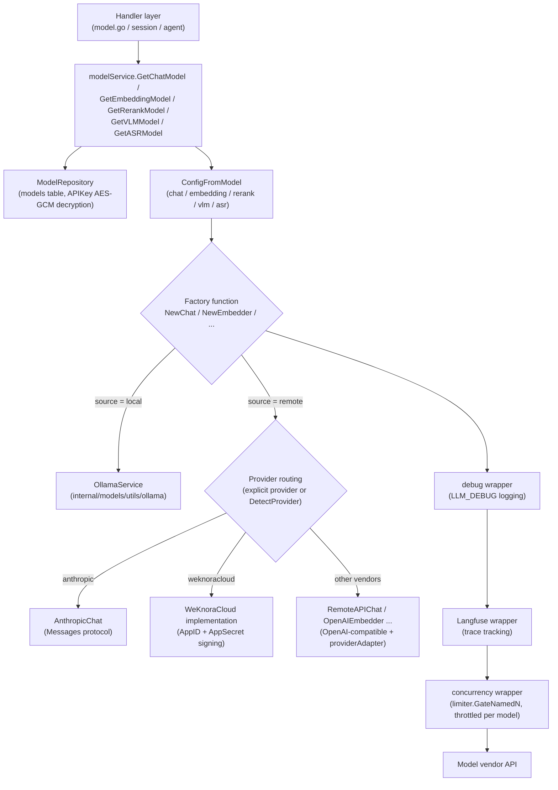

# Model Management

WeKnora is not tied to any single model vendor: the five capability categories — conversation, embedding, reranking, image understanding, and speech transcription — are all abstracted into a unified "model" concept. You add models under "Settings → Models," then select them as needed within knowledge bases and Agents. Local Ollama and 20+ remote vendors (OpenAI, DeepSeek, Tongyi, Zhipu, Hunyuan, Gemini, SiliconFlow, etc.) can be mixed and matched — for example, using a small local model for embedding while using a large remote model for answering.

<Screenshot
  src="/screenshots/settings-models.png"
  caption="Model settings: manage added models by type"
  hint="Shows the model list (name, type, source, default flag) and the 'Add Model' form, including connectivity test results." />

Two things to keep in mind when adding a model:

- **Don't change the embedding model once it's set.** It determines the meaning and dimensionality of the vectors in the index — switching it afterward makes old data unsearchable, requiring a full index rebuild;
- **Click Test before saving.** A model that can't connect will only surface errors when you actually ask a question after saving, which makes troubleshooting much harder.

Below we cover model types, the Provider abstraction, configuration fields, the built-in model mechanism, concurrency throttling, connectivity testing, and usage statistics.

## Model Types and Purposes

Model types are defined in `internal/types/model.go`:

```go
const (
    ModelTypeEmbedding   ModelType = "Embedding"   // Embedding model
    ModelTypeRerank      ModelType = "Rerank"      // Rerank model
    ModelTypeKnowledgeQA ModelType = "KnowledgeQA" // KnowledgeQA model
    ModelTypeVLLM        ModelType = "VLLM"        // VLLM model
    ModelTypeASR         ModelType = "ASR"         // ASR model
)
```

| Type | Frontend Identifier | Client Package | Interface | Purpose |
|------|---------|---------|------|------|
| `KnowledgeQA` | `chat` | `internal/models/chat` | `Chat` / `ChatStream` (supports Tools, Thinking, multimodal messages) | Knowledge Q&A, Agent reasoning, summarization / question generation / graph extraction, and every other LLM call |
| `Embedding` | `embedding` | `internal/models/embedding` | `Embed` / `BatchEmbed` (includes `GetDimensions`) | Text vectorization, feeding vector search indexing and querying |
| `Rerank` | `rerank` | `internal/models/rerank` | `Rerank(query, documents)` returns `RankResult` | Fine-grained reranking of retrieval results |
| `VLLM` | `vllm` | `internal/models/vlm` | `Predict(imgBytes, prompt)` | Vision-Language Model (VLM), for document image understanding / multimodal parsing |
| `ASR` | `asr` | `internal/models/asr` | `Transcribe(audioBytes, fileName)` returns text with segment-level timestamps | Audio transcription (Automatic Speech Recognition) |

The front-end/back-end type mapping is defined in `modelTypeToFrontend()` in `internal/handler/model.go` (`KnowledgeQA -> chat`, etc.).

The model source (`ModelSource`) has two core values: `local` (spun up via local Ollama) and `remote` (remote API); other legacy values (`aliyun`, `zhipu`, `openai`, etc.) are retained for compatibility, and their routing behavior is equivalent to `remote` + the corresponding provider.

## Provider Abstraction

`internal/models/provider/provider.go` defines a unified registry for multi-vendor adaptation:

```go
type Provider interface {
    // Info returns the vendor's metadata
    Info() ProviderInfo
    // ValidateConfig validates the vendor's configuration
    ValidateConfig(config *Config) error
}
```

Each vendor registers itself via `Register()` inside its own file's `init()` function (e.g. `provider/openai.go`, `provider/aliyun.go`). `ProviderInfo` carries `DisplayName`, `Description`, `DefaultURLs` broken down by model type, the supported `ModelTypes`, `RequiresAuth`, and optional `ExtraFields` (for example, Azure OpenAI declares an extra `api_version` field, defaulting to `2024-10-21`).

### Supported Vendor List

`AllProviders()` (`provider/provider.go`) returns the full list (26 total, each vendor registering itself in its own file's `init()`). Ollama, listed as the last row in the table, is not part of this list — it follows the independent `source=local` path, and is only included here for reference:

| Provider ID | Name | Notes |
|---------------|------|------|
| `generic` | Generic | Any OpenAI-compatible / custom deployment (default fallback) |
| `weknoracloud` | WeKnoraCloud | WeKnora cloud service (hardcoded to `https://weknora.weixin.qq.com`, uses AppID/AppSecret credentials) |
| `aliyun` | Alibaba Cloud DashScope | |
| `zhipu` | Zhipu AI (GLM series) | |
| `volcengine` | Volcengine Ark | |
| `hunyuan` | Tencent Hunyuan | |
| `siliconflow` | SiliconFlow | |
| `deepseek` | DeepSeek | |
| `minimax` | MiniMax | |
| `moonshot` | Moonshot AI (Kimi) | |
| `modelscope` | ModelScope | |
| `qianfan` | Baidu Qianfan | |
| `qiniu` | Qiniu Cloud | |
| `openai` | OpenAI | Full support for all five model types |
| `anthropic` | Anthropic Claude | Independent Messages protocol implementation |
| `gemini` | Google Gemini | Embedding uses a dedicated API |
| `openrouter` | OpenRouter | |
| `requesty` | Requesty | |
| `jina` | Jina AI | Embedding and Rerank |
| `mimo` | Xiaomi MiMo | |
| `longcat` | Meituan LongCat AI | |
| `lkeap` | Tencent Cloud LKEAP (Knowledge Engine Atomic Capabilities) | Provides a dedicated Rerank implementation |
| `gpustack` | GPUStack (self-hosted deployment) | |
| `nvidia` | NVIDIA | Dedicated Embedding / Rerank implementations |
| `novita` | Novita AI | |
| `azure_openai` | Azure OpenAI | Extra `api_version` field |
| `ollama` (source=`local`) | Local Ollama models | Not a member of the Provider registry; routed via `ModelSourceLocal` |

When a model doesn't explicitly specify a provider, `DetectProvider(baseURL)` automatically identifies it based on BaseURL domain characteristics (e.g. `dashscope.aliyuncs.com -> aliyun`, `api.anthropic.com -> anthropic`), falling back to `generic` if detection fails.

### Protocol Routing

`NewRemoteChat` in `internal/models/chat/chat.go`:

```go
func NewRemoteChat(config *ChatConfig) (Chat, error) {
    providerName := provider.ProviderName(config.Provider)
    if providerName == "" {
        providerName = provider.DetectProvider(config.BaseURL)
    }
    if providerName == provider.ProviderAnthropic {
        return NewAnthropicChat(config) // Independent Messages protocol
    }
    return NewRemoteAPIChat(config) // Unified OpenAI-compatible protocol + providerAdapter
}
```

- **Ollama** (`source=local`): `chat/ollama.go`, `embedding/ollama.go`, and `vlm/ollama.go` connect directly to the local Ollama instance via `OllamaService` in `internal/models/utils/ollama`.
- **Anthropic**: `chat/anthropic.go` implements the Messages protocol.
- **All other remote vendors**: uniformly routed through the OpenAI-compatible Chat Completions implementation in `chat/remote_api.go`, with vendor-specific differences (thinking encoding, parameter compatibility, etc.) handled by the `providerAdapter` resolved at construction time.
- **Embedding** has more dedicated implementations: Alibaba Cloud multimodal (`tongyi-embedding-vision-*` uses a dedicated DashScope endpoint, while pure-text models are automatically rewritten to the `/compatible-mode/v1` OpenAI-compatible endpoint), Volcengine multimodal, Jina, Azure OpenAI, NVIDIA, Gemini, Zhipu, and WeKnoraCloud; everything else is OpenAI-compatible (`embedding/openai.go`).
- **Rerank** dedicated implementations: Aliyun, Zhipu, Jina, NVIDIA, WeKnoraCloud, LKEAP, and Volcengine, with `NewOpenAIReranker` (a generic `/rerank`-style interface) as the default. Two vendors have additional adaptations:
  - **LKEAP**: Tencent Cloud's `RunRerank` limits each call to a maximum of 60 documents, with the combined length of Query and Docs not exceeding 2000 characters. `lkeapRerankBatches` automatically splits calls into batches according to these two limits and backfills the global index, so callers don't need to be aware of the batching; if a single document itself exceeds the limit, it errors out directly and points to the offending index.
  - **Volcengine**: when the candidate set exceeds the interface's per-call document limit, it's automatically split into multiple batches scored **concurrently** and then merged (see `volcengineRerankMaxConcurrency` for the concurrency cap), so candidates are never silently truncated.
  - **NVIDIA**: the interface returns raw logits rather than [0,1] probabilities. `normalizeNvidiaLogit` uses a numerically stable sigmoid to normalize them (negative numbers go through the `e^x/(1+e^x)` branch to avoid overflow) — otherwise threshold configurations such as `RerankThreshold` would be completely ineffective for this vendor.
- **ASR**: all vendors uniformly use the OpenAI-compatible `/v1/audio/transcriptions` endpoint (`asr/asr.go`: `NewASR` calls `NewOpenAIASR` directly).

## Model Call Chain



The factory functions wrap the real client in three decorators, applied in sequence (see `chat.NewChat` / `embedding.NewEmbedder` / `vlm.NewVLM`):

```go
c, err = wrapChatDebug(c, err)
c, err = wrapChatLangfuse(c, err)
// Outermost: hold the per-model concurrency slot only around the real
// provider round-trip, so the wait is excluded from debug/langfuse timing.
return wrapChatConcurrency(c, config.MaxConcurrency, err)
```

## Model Configuration Fields

`Parameters` on the model entity `types.Model` (`ModelParameters` in `internal/types/model.go`):

| Name | Type | Default | Description |
|------|------|--------|------|
| `base_url` | string | Empty (falls back to the Provider's `DefaultURLs`) | Model API address; validated against SSRF (`ValidateURLForSSRF`) on create/update |
| `api_key` | string | Empty | API key, **stored AES-256-GCM encrypted** (`ModelParameters.Value/Scan`), modifiable only via the `PUT /models/:id/credentials` sub-resource |
| `interface_type` | string | Empty (VLM: defaults to `ollama` for local, `openai` for remote) | Interface protocol type |
| `embedding_parameters.dimension` | int | 0 | Vector dimensionality |
| `embedding_parameters.truncate_prompt_tokens` | int | 0 | Number of tokens to truncate input to |
| `embedding_parameters.supports_dimension_override` | bool | false | Whether request-level dimension override (the `dimensions` parameter) is supported |
| `parameter_size` | string | Empty | Ollama model parameter scale (e.g. "7B"), maintained by the backend, not editable from the frontend |
| `provider` | string | Empty (auto-detected from BaseURL) | Vendor identifier |
| `extra_config` | map[string]string | nil | Vendor-specific configuration (e.g. Azure's `api_version`) |
| `custom_headers` | map[string]string | nil | Additional custom HTTP headers (similar to the OpenAI SDK's `extra_headers`; reserved headers like `Authorization` and `api-key` are ignored at runtime) |
| `supports_vision` | bool | false | Whether the Chat model accepts multimodal image input |
| `max_concurrency` | int | 0 (falls back to the global `model.max_concurrency`) | Concurrency cap for this model's background tasks (only applies to chat/vlm/embedding) |
| `app_id` / `app_secret` | string | Empty | WeKnoraCloud-specific credentials; `app_secret` is stored AES-encrypted |

Model-level fields also include `name` (the actual model name used at call time), `display_name`, `type`, `source`, `is_default` (unique per default within the same `(tenant_id, type)` bucket), `is_builtin`, `managed_by`, and `status` (`active` / `downloading` / `download_failed`).

### Management API (`internal/router/router.go`)

| Method & Path | Description |
|-------------|------|
| `GET /models/providers` | Query the list of supported vendors by `model_type` (`ListModelProviders`) |
| `POST /models` / `GET /models` / `GET /models/:id` / `PUT /models/:id` / `DELETE /models/:id` | Model CRUD |
| `PUT /models/:id/credentials`, `DELETE /models/:id/credentials/:field` | Credentials sub-resource; any `api_key` in the `PUT /models/:id` request body is forcibly ignored, with a warning logged |
| `POST /models/:id/debug` | Model debugging (see below) |
| `GET /models/weknoracloud/status` | WeKnoraCloud credential status |

## Built-in Model Mechanism

`internal/types/builtin_models_config.go` implements declarative built-in models: at startup it reads `config/builtin_models.yaml` (or the path specified by `BUILTIN_MODELS_CONFIG`; see `config/builtin_models.yaml.example` for a template) and UPSERTs each entry into the `models` table, with `is_builtin=true`, `managed_by="yaml"`, and a default `tenant_id=10000` (`DefaultBuiltinModelTenantID`), visible to all tenants.

Key behaviors (`LoadBuiltinModelsConfig`):

- Any string field supports `${ENV_NAME}` environment variable interpolation; unset variables are left as the literal string so configuration errors are exposed rather than hidden.
- On every startup, rows are UPSERTed by `id`, forcibly resetting `deleted_at` to NULL (an entry reappearing in the file is thus revived).
- **Drift cleanup**: rows with `managed_by='yaml'` whose id is no longer present in the file are soft-deleted — removing an entry from the YAML is the standard way to decommission a built-in model.
- Once an admin takes over a row at runtime (clearing `managed_by`), the YAML loader skips that row ("preserving runtime override").
- An entry with `is_default: true` first clears any other defaults within the same `(tenant_id, type)` bucket, keeping the uniqueness invariant consistent with the API path.
- Validation rules: id must be non-empty and ≤64 characters (`ModelIDMaxLen`), type must be one of `KnowledgeQA | Embedding | Rerank | VLLM | ASR`, and status must be valid or empty; if YAML parsing fails, reconciliation is aborted (no drift cleanup is performed).

YAML example (excerpted from `builtin_models.yaml.example`):

```yaml
builtin_models:
  - id: builtin-llm-default
    type: KnowledgeQA
    source: remote
    is_default: true
    name: ${LLM_MODEL_NAME}
    parameters:
      base_url: ${LLM_BASE_URL}
      api_key: ${LLM_API_KEY}
      provider: ${LLM_PROVIDER}
```

### Local Model Downloads (Ollama)

The lifecycle of local models is managed by `OllamaService` in `internal/models/utils/ollama/ollama.go` (`IsModelAvailable` / `PullModel` / `EnsureModelAvailable` / `ListModelsDetailed` / `DeleteModel`, etc.), with HTTP entry points in `internal/handler/initialization.go`:

| Path | Description |
|------|------|
| `GET /initialization/ollama/status` | Ollama service availability |
| `GET /initialization/ollama/models` | List locally available models |
| `POST /initialization/ollama/models/check` | Batch-check whether models have already been downloaded |
| `POST /initialization/ollama/models/download` | Asynchronous download (`downloadModelAsync` + `pullModelWithProgress`, writes model `status=downloading`) |
| `GET /initialization/ollama/download/progress/:taskId`, `GET /initialization/ollama/download/tasks` | Download progress / task list |

> Note: `cmd/download/duckdb/duckdb.go` is unrelated to models — it pre-downloads DuckDB's `spatial` and `excel` extensions at image build time, for use by data analysis tools. Model weight downloads only happen via the Ollama path.

## Concurrency and Throttling (limiter)

`internal/models/limiter` provides a **distributed, per-model-ID background concurrency gate**. Its core design (from the `limiter.go` package comment): the shared scarce resource is the model vendor's request budget, so throttling happens at the model client layer — the only place that can see all task types — rather than at the asynq queue layer.

- **Redis backend** (`NewRedisLimiter`): a self-healing distributed semaphore. Each held slot is a ZSET member (a unique token) with a score equal to its lease expiration time; the `acquireScript` Lua script atomically cleans up expired leases, counts them, and admits within the limit. Leases have a 30s TTL, and holders heartbeat-renew every TTL/3 (also renewing the ZSET key's own TTL); if a process crashes, its lease naturally expires and is reclaimed. **Any backend error fails open** — a limiter malfunction must never block model traffic.
- **Local backend** (`NewLocalLimiter`): an in-process counting semaphore for Lite mode (single process, no Redis).
- **Only background tasks are throttled**: `GateNamedN` (`governor.go`) only queues when `types.IsBackgroundTask(ctx)` is true (asynq workers: summarization, question generation, graph extraction, multimodal enrichment, etc.) — interactive user requests are never blocked by the gate.
- The limit is taken first from the model's own `parameters.max_concurrency`, falling back to the process-level default `model.max_concurrency` when it's 0 (which can be hot-updated at runtime via system settings through `SetGlobalLimit`).
- Runtime observability: `GET /system/admin/runtime/queues` (`internal/handler/system.go`) returns `limiter.RuntimeStats()`'s per-model `active / waiting / limit` (for the Redis backend, `active` is cluster-wide while `waiting` is process-local).

## Model Health Checks / Connectivity Testing

There are two mechanisms, both of which hold credentials server-side and never send plaintext keys back to the client:

1. **Test Connection** (`internal/handler/initialization.go`, backing the "Test connection" button on the model create/edit form):
   - `POST /initialization/remote/check` — Chat models (`CheckRemoteModel` / `checkChatModelConnection`)
   - `POST /initialization/embedding/test` — Embedding (`TestEmbeddingModel`)
   - `POST /initialization/rerank/check` — Rerank (`CheckRerankModel`)
   - `POST /initialization/asr/check` — ASR (`CheckASRModel`)
   - `POST /initialization/multimodal/test` — VLM multimodal parsing (`TestMultimodalFunction`)

   The request body `ModelTestRequest` can include a `modelId`: `fillSecretsFromStoredModel` fills in any missing `APIKey` / `AppSecret` in the request from the stored model (after decryption), enabling "change the BaseURL, verify with the existing key in one click" — the frontend never needs, and cannot obtain, the plaintext key. `buildTestModel` converts the request into a temporary `*types.Model` that is **never persisted**, sharing the same `ConfigFromModel` mapping used by the production path.

2. **Model Debugger** (`POST /models/:id/debug`, `ModelHandler.DebugModel`): issues a real call against a saved model, by type, and returns the full normalized response — Chat runs in streaming mode and aggregates `stream_events` / thinking observations; Embedding returns the vector and its dimensionality; Rerank returns the scoring results; VLM / ASR accept uploaded files. The response includes `elapsed_ms`, a redacted request preview (`redactedDebugConfig` masks fields like secret/token/api_key), and `observations`.

## Purpose of rerank_server_demo.py

`rerank_server_demo.py` at the repository root is a **minimal reference implementation of a self-hosted Rerank service**: FastAPI + HuggingFace `AutoModelForSequenceClassification`, exposing `POST /rerank`, with a request body of `{query, documents}` and a response of `{"results": [{index, document: {text}, score}]}`.

It deliberately names the scoring field `score` rather than `relevance_score`, in order to validate the Go client's compatibility — `RankResult.UnmarshalJSON` in `internal/models/rerank/reranker.go` prioritizes reading `relevance_score`, falling back to `score` if it's missing; `DocumentInfo.UnmarshalJSON` likewise supports both a plain string and a `{text}` object format. As a result, any private rerank service implementing this protocol can be integrated into WeKnora via the `generic` provider.

## Model Usage Statistics

- **Token usage**: `types.TokenUsage` (`internal/types/chat.go`) records `prompt_tokens / completion_tokens / total_tokens` along with a prompt-cache breakdown (`cache_read_tokens / cache_write_tokens / cache_miss_tokens / cache_status`). Every Chat implementation emits a unified structured log line via `logUsage` in `internal/models/chat/usage.go`:

  ```go
  logger.Infof(ctx,
      "[LLM Usage] model=%s, purpose=%s, prompt_prefix=%s, prompt_tokens=%d, completion_tokens=%d, ...",
      ...)
  ```

  where `purpose` comes from `types.WithLLMCallMetadata` (e.g. `web_fetch_summary`, `entity_extraction`), allowing aggregation by purpose.
- **Trace tracking**: when Langfuse is enabled, every model type has a `langfuse_wrapper.go` decorator that reports each call (including usage) as a trace/span.
- **Streaming responses**: usage is returned with the final `StreamResponse` event (the model debugger aggregates it into the `usage` field).
- **Concurrency watermark**: as described above, `GET /system/admin/runtime/queues` exposes real-time per-model `active / waiting / limit`.
