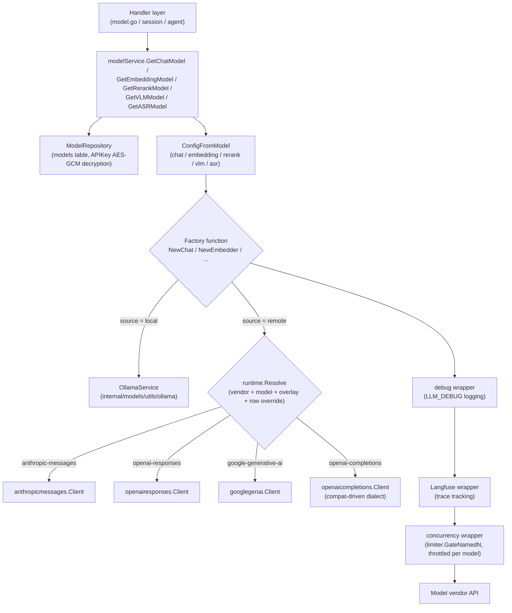

# Model Management

Add chat, embedding, rerank, vision, and speech models under "Settings → Models," then select them as needed in knowledge bases or agents. Local Ollama and remote models can be mixed and matched — for example, a local model can generate embeddings while a remote model generates answers.

<Screenshot
  src="/screenshots/settings-models.png"
  caption="Model settings: manage added models by type"
  hint="Shows the model list (name, type, vendor icon and name, default flag) and the 'Add Model' entry point." />

When adding a model, check the connection settings and index compatibility:

- **Changing the embedding model requires rebuilding the index.** The model determines the semantic space and dimensionality of the vectors, so old and new vectors can't be mixed directly;
- **Test the connection before saving.** Confirm that the service address, credentials, and model name work before using the model in a knowledge base or agent.

Model types, configuration fields, and usage status are described below.

## Choosing a Model Type

| Type | Purpose |
| --- | --- |
| Chat model | Generates Q&A answers, summaries, and agent reasoning |
| Embedding model | Converts documents and questions into vectors for semantic retrieval |
| Rerank model | Reorders retrieved chunks |
| Vision model | Recognizes images in documents or conversations |
| Speech model | Transcribes audio into text |

## Adding and Verifying a Connection

When adding a model, first choose its type and source: "API" connects to a remote service, and "Ollama" uses a local model (rerank models don't support Ollama). Configure a remote model as follows:

1. **Choose a service provider.** The list only shows vendors that support the current model type; once one is selected, you can jump to that vendor's or model's documentation page. If there's no matching vendor, choose "Custom (OpenAI-compatible)".
2. **Enter the model name.** You can pick from the vendor's built-in model catalog, where options are labeled with context window, embedding dimensions, and reasoning and vision capabilities; you can also type a model name that isn't in the catalog. When you pick a catalog model, the context window, max output tokens, vision support, and embedding dimensions are filled in automatically wherever they're still empty.
3. **Enter the Base URL and API Key**, plus any extra fields the vendor requires (see [Vendor Extra Fields](#vendor-extra-fields)). If access goes through an enterprise gateway, you can add custom request headers.
4. **Check "How this model is called".** For chat and vision models, the panel shows live the request protocol, where the capabilities come from (built-in model profile or vendor defaults), the request URL, the thinking toggle parameter, the available thinking effort levels, the context window, and max output tokens, so you can confirm before saving how the configuration will be called.
5. **Test the connection, then save.** The test uses the configuration currently filled in the form, so there's no need to save first; when editing an existing model, the separately saved API Key is used. If you change the configuration after testing, test again.

<Screenshot
  src="/screenshots/model-editor-catalog.png"
  caption="Adding a model: pick a model from the vendor catalog and review how it will be called"
  hint="Open the 'Add Model' drawer, choose the chat type and the API source, pick a Chinese vendor as the service provider (e.g. Alibaba Cloud DashScope), and expand the model name dropdown to show the context window / reasoning / vision labels, while also revealing the 'How this model is called' panel below (request protocol, capabilities source, available thinking effort levels) and the 'Test Connection' button at the bottom." />

"Advanced Options" also lets you set:

| Option | Applicable types | Description |
| --- | --- | --- |
| Embedding dimension / Custom Output Dimension | Embedding | The dimension must match the index. Only turn on "Custom Output Dimension" when you're sure the model supports specifying a dimension |
| Context Window | Chat, vision | Leave empty to use the default of 200000. Enter the real value from the vendor's documentation; a value that's too large means the agent's history compression never triggers and the upstream rejects the request outright |
| Supports Vision / Multimodal | Chat | Whether the model accepts image input |
| Max output tokens | Chat, vision | Output cap for a single reply; leave empty to keep the catalog's default for that model |
| Background concurrency limit | Chat, vision, embedding | Limits the concurrency of background tasks such as document ingestion and enrichment against this model; 0 or empty uses the global default, and interactive chat is unaffected |
| Advanced → Protocol override | Chat, vision | Forces a specific request protocol; usually keep it on "Auto" |
| Advanced → Remote model name | Remote models | The model ID actually sent to the vendor; fill it in when it differs from the model name |
| Advanced → Protocol compat override (JSON) | Remote models | Corrects request fields where a particular API disagrees with the catalog defaults, e.g. `{"max_tokens_field": "max_tokens"}`; leave empty for no override. For syntax and fields, see [Protocol Compatibility Overrides](#protocol-compatibility-overrides-compat-json) |

If a chat model saved by an older version carries a `thinking_control` setting, the advanced section additionally shows "Thinking parameter format (legacy)"; switching it to "Follow catalog default" lets the model catalog decide how the thinking parameters are written.

The model catalog determines whether a chat model can think and which thinking effort levels are available (a subset of Off, Auto, Minimal, Low, Medium, High, Extra high, and Max). When the effort level selected in an agent or conversation isn't supported by the model, it's adjusted to the closest available level.

### Protocol Compatibility Overrides (compat JSON)

Even among "OpenAI-compatible" APIs, vendors disagree on request fields: some only accept `max_tokens`, some use different fields to toggle thinking, and reasoning models may reject `temperature`. These differences are already recorded in the model catalog for built-in vendors and cataloged models, so you usually don't need to fill this in. The option lives under "Advanced Options → Advanced" for remote models (except WeKnora Cloud), and you only need a manual override in these cases:

- A self-hosted inference service (vLLM, SGLang, etc.) or a relay gateway whose API behavior differs from the vendor defaults;
- A model the vendor just released isn't cataloged yet, the "How this model is called" panel shows "Vendor defaults (model not in the catalog)", and calls fail;
- The vendor changed its API and you need a temporary fix before upgrading.

#### How to Fill It In

1. **Check the protocol first.** Fields for chat and vision models depend on the "Request protocol" shown in the "How this model is called" panel, and only fields of that protocol are accepted; if you change the "Protocol override", the JSON must also switch to the new protocol's fields. Embedding, rerank, and speech models each use their own set of fields, independent of the protocol.
2. **Only write the keys you want to change.** Keys you leave out keep the catalog defaults. Objects such as `extra_body` are merged key by key, and arrays are replaced whole.
3. **Validated on save.** The input must be a JSON object. A misspelled key name, a wrong value type, or a nonexistent enum value makes the save fail with the reason, instead of erroring only at chat time.
4. **Test after changing.** "Test Connection" uses the configuration currently in the form, with no need to save first.

Overrides here take precedence over vendor defaults and the model catalog; the legacy "thinking parameter format" and "remote model name" still apply last. For models the catalog marks as not supporting thinking, thinking-related fields are ignored.

`extra_body` only adds fields WeKnora hasn't written, and cannot override fields WeKnora generates, such as `model`, `messages`, and `max_tokens`.

#### Common Scenarios

| Symptom | What to fill in |
| --- | --- |
| Error saying `max_completion_tokens` isn't recognized | `{"max_tokens_field": "max_tokens"}` |
| Reasoning model rejects `temperature` / `top_p` | `{"supports_temperature": false}` |
| API only accepts a fixed temperature (e.g. 1) | `{"fixed_temperature": 1}` |
| Thinking can't be turned on or off for a hybrid-thinking model such as Qwen3 deployed with vLLM / SGLang | `{"thinking_format": "chat-template-kwargs"}` |
| Gateway doesn't support returning usage in streams, so streaming requests fail | `{"supports_usage_in_streaming": false}` |
| Gateway rejects the message structure with images | `{"supports_multi_content": false}` (only text is sent; images are dropped) |
| Need to include a vendor-specific parameter, such as Alibaba Cloud web search | `{"extra_body": {"enable_search": true}}` |
| Error when replaying thinking content in multi-turn conversations | `{"replay_reasoning_content": false}` |
| Self-hosted embedding service only accepts 16 items per request | `{"max_batch_size": 16}` |
| Embedding or rerank service responds slowly and needs a longer timeout | `{"request_timeout_seconds": 120}` |
| Self-hosted rerank service returns unnormalized scores (logits) | `{"score_scale": "logit"}` |

#### Field Reference

"Protocol default" in the tables below is the value when there's no vendor, catalog entry, or override; the actual value for a specific vendor is whatever the "How this model is called" panel shows.

**OpenAI Chat Completions (`openai-completions`)**: used by the vast majority of "OpenAI-compatible" vendors, self-hosted services, and gateways.

| Field | Type | Protocol default | Description |
| --- | --- | --- | --- |
| `max_tokens_field` | string | `max_completion_tokens` | Field name for the output cap: `max_tokens` or `max_completion_tokens`; only one of them is sent |
| `thinking_format` | string | `none` | How the thinking toggle is written: `none` sends nothing; `openai` only sends `reasoning_effort`; `thinking-type` sends `{"thinking": {"type": ...}}`; `enable-thinking` sends `enable_thinking` (together with the budget field); `chat-template-kwargs` sends `chat_template_kwargs.enable_thinking` (vLLM / SGLang); `openrouter` sends `{"reasoning": ...}` |
| `thinking_enabled_value` | string | `enabled` | The `type` value used to turn thinking on with the `thinking-type` format (e.g. MiniMax uses `adaptive`) |
| `thinking_always_send` | bool | false | Send the toggle even when no thinking preference is specified |
| `thinking_disable_on_non_stream` | bool | false | Force thinking off for non-streaming calls (some models only allow thinking when streaming) |
| `thinking_budget_field` | string | Empty | Field name for the thinking budget, e.g. `thinking_budget`; nothing is sent when empty |
| `thinking_budget_excludes_effort` | bool | false | Set to true when the vendor doesn't allow the budget and `reasoning_effort` together; only the thinking effort is kept |
| `supports_reasoning_effort` | bool | false | Whether to also send the thinking effort |
| `reasoning_effort_field` | string | `reasoning_effort` | Field name for the thinking effort |
| `supports_developer_role` | bool | false | Use the `developer` role for reasoning models' system prompts instead |
| `supports_store` | bool | false | Send `store: false`, asking the server not to retain the conversation |
| `supports_usage_in_streaming` | bool | true | Include `stream_options.include_usage` in streaming requests to count usage |
| `supports_temperature` | bool | true | When false, no sampling parameters are sent (temperature, top_p, penalties) |
| `fixed_temperature` | number | None | A fixed temperature value to always send |
| `supports_seed` | bool | true | Whether to send `seed` |
| `tool_choice_modes` | string[] | `none`, `auto`, `required`, `function` | Allowed `tool_choice` values |
| `supports_parallel_tool_calls` | bool | true | Whether to send `parallel_tool_calls` |
| `supports_response_format` | bool | true | Whether to send `response_format` when JSON output is needed |
| `supports_multi_content` | bool | true | When false, mixed text-and-image messages keep only the text parts |
| `replay_reasoning_content` | bool | true | Send earlier thinking content back to the model in multi-turn conversations |
| `reasoning_fields` | string[] | `reasoning_content`, `reasoning`, `reasoning_text` | Fields to read thinking text from in the response; the first present one is used, in order |
| `tool_call_extra_fields` | string[] | Empty | Extra fields in tool calls that must be sent back verbatim (e.g. `extra_content` when calling Gemini through the OpenAI-compatible endpoint) |
| `prompt_cache_key` | bool | false | Send `prompt_cache_key` so the same session hits the prompt cache |
| `cache_control_format` | string | Empty | When set to `anthropic`, cache breakpoints are inserted in Anthropic format |
| `prompt_cache_accounting` | bool | false | The vendor returns cache-hit usage, which is used for accounting |
| `extra_body` | object | Empty | Fields appended to every request |

**OpenAI Responses (`openai-responses`)**: used by default for the official OpenAI API (`api.openai.com`).

| Field | Type | Protocol default | Description |
| --- | --- | --- | --- |
| `supports_developer_role` | bool | true | Use the `developer` role for the system prompt |
| `supports_max_output_tokens` | bool | true | Whether to send `max_output_tokens` |
| `supports_reasoning_summary` | bool | true | Whether to request a reasoning summary |
| `supports_encrypted_reasoning` | bool | true | Whether to request and send back encrypted reasoning content |
| `supports_store` | bool | true | Send `store: false` |
| `supports_temperature` | bool | true | When false, no sampling parameters are sent |
| `prompt_cache_key` | bool | true | Send a prompt cache key |
| `supports_long_cache_retention` | bool | true | Allow 24-hour long cache retention |
| `supports_parallel_tool_calls` | bool | true | Whether to send `parallel_tool_calls` |
| `extra_body` | object | Empty | Fields appended to every request |

**Anthropic Messages (`anthropic-messages`)**: Anthropic, plus compatible APIs whose `base_url` ends with `/anthropic`.

| Field | Type | Protocol default | Description |
| --- | --- | --- | --- |
| `thinking_mode` | string | `budget` | `budget` enables thinking with a budget; `adaptive` lets the model decide, with the effort passed via `output_config.effort` |
| `supports_effort` | bool | false | Whether to send the thinking effort |
| `thinking_budgets` | object | minimal 1024, low 2048, medium 8192, high 16384, xhigh 32768, max 63999 | `budget_tokens` for each thinking effort level; keys are `minimal`/`low`/`medium`/`high`/`xhigh`/`max` |
| `default_max_tokens` | int | 4096 | `max_tokens` used when no output cap is set (required by this protocol) |
| `supports_temperature` | bool | true | Whether to send temperature |
| `temperature_with_thinking` | bool | false | Whether to still send temperature when thinking is on |
| `supports_top_p` | bool | true | Whether to send `top_p` |
| `supports_cache_control` | bool | true | Whether to insert cache breakpoints |
| `supports_cache_control_on_tools` | bool | true | Whether to insert cache breakpoints on tool definitions |
| `long_cache_ttl` | string | `1h` | Lifetime of the long cache |
| `version` | string | `2023-06-01` | The `anthropic-version` request header |
| `beta_headers` | string[] | Empty | Additional `anthropic-beta` request headers |
| `interleaved_thinking_beta` | string | `interleaved-thinking-2025-05-14` | Beta flag added when thinking and tools are used together; an empty string means it's not sent |
| `prompt_cache_accounting` | bool | true | The vendor returns cache-hit usage |
| `extra_body` | object | Empty | Fields appended to every request |

**Gemini (`google-generative-ai`)**: the native Gemini API.

| Field | Type | Protocol default | Description |
| --- | --- | --- | --- |
| `thinking_mode` | string | `budget` | `budget` sends `thinkingBudget` (Gemini 2.5); `level` sends `thinkingLevel` (Gemini 3 onward); `none` sends no thinking configuration |
| `thinking_budgets` | object | minimal 128, low 2048, medium 8192, high 24576, xhigh 32768, max 32768 | `thinkingBudget` for each thinking effort level |
| `include_thoughts` | bool | true | Whether to return thinking content |
| `supports_seed` | bool | true | Whether to send `seed` |
| `supports_penalty` | bool | true | Whether to send frequency / presence penalties |
| `extra_generation_config` | object | Empty | Fields appended to `generationConfig` |
| `prompt_cache_accounting` | bool | true | The vendor returns cache-hit usage |
| `api_version_prefix` | string | `/v1beta` | Version path appended when `base_url` only contains the host |

**Embedding models**

| Field | Type | Protocol default | Description |
| --- | --- | --- | --- |
| `api` | string | Vendor default | Embedding protocol: `openai-embeddings`, `dashscope-embeddings`, `ark-embeddings`, `google-embeddings` |
| `path` | string | Empty | Path appended after `base_url` |
| `send_encoding_format` | bool | false | Whether to send `encoding_format: "float"` |
| `dimensions_field` | string | Empty | Field name for specifying the output dimension; only sent when "Custom Output Dimension" is on |
| `truncate_field` / `truncate_value` | string | Empty | Toggle field and value that make the server truncate overly long input |
| `input_type_field` | string | Empty | Field name that distinguishes "document" from "query" |
| `input_type_values` | object | Empty | Values for the two input kinds, `document` and `query` |
| `max_batch_size` | int | 0 (unlimited) | Maximum number of items per request; larger inputs are batched automatically |
| `max_input_chars` | int | 0 (unlimited) | Maximum number of characters per input item |
| `accepts_truncate_prompt_tokens` | bool | false | Whether the service supports vLLM's `truncate_prompt_tokens` |
| `request_timeout_seconds` | int | 60 | Per-request timeout (seconds) |
| `extra_body` | object | Empty | Fields appended to every request |

**Rerank models**

| Field | Type | Protocol default | Description |
| --- | --- | --- | --- |
| `path` | string | Empty | Path appended after `base_url` |
| `send_top_n` | bool | false | Whether to send `top_n` (all documents are returned when it's not sent) |
| `send_return_documents` | bool | false | Whether to ask the server to return the original document text |
| `score_scale` | string | `probability` | Meaning of the score: `probability` (0–1) or `logit` (unnormalized). Setting it wrong makes the relevance threshold ineffective |
| `truncate` | string | Empty | Server-side truncation setting (e.g. NIM's `END`) |
| `max_documents` / `max_query_chars` / `max_document_chars` / `max_request_chars` | int | 0 (unlimited) | Per-request caps on document count, query length, single-document length, and total length; larger inputs are batched automatically |
| `max_concurrency` | int | 0 (use the default) | Number of requests sent concurrently after batching |
| `accepts_truncate_prompt_tokens` | bool | false | Whether the service supports vLLM's `truncate_prompt_tokens` |
| `request_timeout_seconds` | int | 0 (no separate limit) | Per-request timeout (seconds) |
| `extra_body` | object | Empty | Fields appended to every request |

**Speech recognition models**

| Field | Type | Protocol default | Description |
| --- | --- | --- | --- |
| `api` | string | Vendor default | `openai-transcriptions` (uploads the audio file) or `openai-chat-audio` (carries the audio in a chat request) |
| `path` | string | `/audio/transcriptions` | Path appended after `base_url` |
| `response_format` | string | Empty | The `response_format` to send; use `verbose_json` when segmented results are needed |
| `language_param` | string | Empty | Where the language hint goes: `form`, `header`, `asr_options`; not sent when empty |
| `max_file_bytes` / `max_encoded_bytes` | int | 0 (unlimited) | Size caps for the audio file and its base64-encoded form |
| `formats` | string[] | Empty (unlimited) | Accepted audio extensions (without the dot) |
| `request_timeout_seconds` | int | 300 | Per-request timeout (seconds) |

## Built-in Vendors

There are 27 built-in vendors, and local models can additionally be connected via Ollama. The model types each vendor supports are listed below (✓ means supported):

| Vendor | ID | Chat | Embedding | Rerank | Vision | Speech |
| --- | --- | :-: | :-: | :-: | :-: | :-: |
| Custom (OpenAI-compatible) | `generic` | ✓ | ✓ | ✓ | ✓ | ✓ |
| WeKnora Cloud | `weknoracloud` | ✓ | ✓ | ✓ | ✓ | |
| Alibaba Cloud DashScope | `aliyun` | ✓ | ✓ | ✓ | ✓ | ✓ |
| Zhipu BigModel | `zhipu` | ✓ | ✓ | ✓ | ✓ | ✓ |
| Volcengine | `volcengine` | ✓ | ✓ | ✓ | ✓ | |
| Tencent Hunyuan | `hunyuan` | ✓ | ✓ | | | |
| SiliconFlow | `siliconflow` | ✓ | ✓ | ✓ | ✓ | ✓ |
| MiniMax | `minimax` | ✓ | | | | ✓ |
| Moonshot AI | `moonshot` | ✓ | | | ✓ | |
| Xiaomi MiMo | `mimo` | ✓ | | | | ✓ |
| ModelScope | `modelscope` | ✓ | ✓ | | ✓ | |
| Baidu Qianfan | `qianfan` | ✓ | ✓ | ✓ | ✓ | |
| Qiniu Cloud | `qiniu` | ✓ | | | | |
| Meituan LongCat | `longcat` | ✓ | | | | |
| Tencent Cloud LKEAP | `lkeap` | ✓ | | ✓ | | |
| DeepSeek | `deepseek` | ✓ | | | | |
| OpenAI | `openai` | ✓ | ✓ | | ✓ | ✓ |
| Azure OpenAI | `azure_openai` | ✓ | ✓ | | ✓ | |
| Anthropic | `anthropic` | ✓ | | | | |
| Google Gemini | `gemini` | ✓ | ✓ | | | |
| OpenRouter | `openrouter` | ✓ | ✓ | ✓ | ✓ | ✓ |
| LiteLLM | `litellm` | ✓ | ✓ | ✓ | ✓ | ✓ |
| Requesty | `requesty` | ✓ | ✓ | | ✓ | ✓ |
| Jina | `jina` | | ✓ | ✓ | | |
| NVIDIA | `nvidia` | ✓ | ✓ | ✓ | ✓ | |
| Novita AI | `novita` | ✓ | ✓ | ✓ | ✓ | |
| GPUStack | `gpustack` | ✓ | ✓ | ✓ | ✓ | ✓ |

"Vision" in the table means the vendor can be selected under the vision model type; whether a chat model itself accepts images is determined by the model catalog and the "Supports Vision / Multimodal" toggle. WeKnora Cloud requires saving the cloud service credentials in settings first, and the model name can be `chat`, `embedding`, `rerank`, or `vlm`.

The vendor list, default addresses, and model catalog are delivered by the server (`GET /api/v1/models/providers`), and operators can modify or add vendors through the [deployment overlay](#deployment-overlay-config-models-json).

## Viewing References and Adjusting Configuration

Knowledge bases and agents store references to models. Check the dependency details before deleting a model; built-in models are managed by YAML configuration and should be maintained in the configuration file.

The model debugger sends real requests to a saved model and shows the elapsed time, the redacted request, and the response, which you can use to check embedding dimensions, rerank scores, or streaming output. For chat models that can think, you can choose a thinking effort level in the debugger, and the result shows the actual request protocol and thinking toggle parameters. Call volume and cache usage can be viewed alongside [Observability and Auditing](16-observability.md).

## Configuration and Call Reference

### Model Types and Purposes

Model types are defined in `internal/types/model.go`:

```go
const (
    ModelTypeEmbedding   ModelType = "Embedding"   // Embedding model
    ModelTypeRerank      ModelType = "Rerank"      // Rerank model
    ModelTypeKnowledgeQA ModelType = "KnowledgeQA" // KnowledgeQA model
    ModelTypeVLLM        ModelType = "VLLM"        // VLLM model
    ModelTypeASR         ModelType = "ASR"         // ASR model
)
```

| Type | Frontend Identifier | Client Package | Interface | Purpose |
|------|---------|---------|------|------|
| `KnowledgeQA` | `chat` | `internal/models/chat` | `Chat` / `ChatStream` (supports Tools, Thinking, multimodal messages) | Knowledge Q&A, Agent reasoning, summarization / question generation / graph extraction, and every other LLM call |
| `Embedding` | `embedding` | `internal/models/embedding` | `Embed` / `BatchEmbed` (includes `GetDimensions`) | Text vectorization, feeding vector search indexing and querying |
| `Rerank` | `rerank` | `internal/models/rerank` | `Rerank(query, documents)` returns `RankResult` | Fine-grained reranking of retrieval results |
| `VLLM` | `vllm` | `internal/models/vlm` | `Predict(imgBytes, prompt)` | Vision-Language Model (VLM), for document image understanding / multimodal parsing |
| `ASR` | `asr` | `internal/models/asr` | `Transcribe(audioBytes, fileName)` returns text, with segment-level timestamps when the model provides them (e.g. OpenAI `whisper-1`) | Audio transcription (Automatic Speech Recognition) |

The front-end/back-end type mapping is defined in `modelTypeToFrontend()` in `internal/handler/model_catalog.go` (`KnowledgeQA -> chat`, etc.). The REST endpoint for creating a model stores `type` as-is, so callers should pass the backend value (`KnowledgeQA`, etc.); the `model_type` query parameter accepts either form.

The model source (`ModelSource`) has two core values: `local` (spun up via local Ollama) and `remote` (remote API); other legacy values (`aliyun`, `zhipu`, `openai`, etc.) are retained for compatibility, and their routing behavior is equivalent to `remote` + the corresponding provider.

### Model Configuration Fields

`Parameters` on the model entity `types.Model` (`ModelParameters` in `internal/types/model.go`):

| Name | Type | Default | Description |
|------|------|--------|------|
| `base_url` | string | Empty (uses the vendor's default address) | Model API address; validated against SSRF (`ValidateURLForSSRF`) on create/update |
| `api_key` | string | Empty | API key, **stored AES-256-GCM encrypted** (`ModelParameters.Value/Scan`). It can be submitted with the create request; afterward it can only be modified via the `PUT /models/:id/credentials` sub-resource |
| `interface_type` | string | Empty (VLM: defaults to `ollama` for local, `openai` for remote) | Interface protocol type |
| `embedding_parameters.dimension` | int | 0 | Vector dimensionality |
| `embedding_parameters.truncate_prompt_tokens` | int | 0 | Number of tokens for server-side truncation. This is a vLLM extension parameter, only sent to `generic` and `gpustack` (the historical value 511 is used when it's 0); hosted vendors don't document it, so it's never sent to them |
| `embedding_parameters.supports_dimension_override` | bool | false | Whether to specify the vector dimension in the request. The field name depends on the vendor (`dimensions` for the OpenAI family, `outputDimensionality` for Gemini, `parameters.dimension` for DashScope multimodal); models whose vendor documentation lacks this parameter (NVIDIA NIM, Hunyuan, Novita, ada-002, etc.) never send it, even if checked |
| `parameter_size` | string | Empty | Ollama model parameter scale (e.g. "7B"), maintained by the backend, not editable from the frontend |
| `provider` | string | Empty (auto-detected from BaseURL) | Vendor ID; see [Built-in Vendors](#built-in-vendors) for values |
| `extra_config` | map[string]string | nil | Vendor extra fields (see the next section); reserved keys are `api` (forces the chat protocol), `remote_model_name` (remote model name), and `thinking_control` (legacy thinking parameter format) |
| `spec` | object | nil | Per-row catalog override: `api`, `reasoning`, `input`, `context_window`, `max_output_tokens`, `thinking_levels`, `compat` (flat, protocol-specific JSON) |
| `custom_headers` | map[string]string | nil | Additional custom HTTP headers (similar to the OpenAI SDK's `extra_headers`; reserved headers like `Authorization` and `api-key` are ignored at runtime) |
| `supports_vision` | bool | false | Whether the Chat model accepts multimodal image input |
| `context_window` | int | 0 (falls back to 200000) | Chat/VLM context window (tokens). The agent loads and compresses history against this limit; enter the window size the service actually supports, since a value that's too high keeps compression from triggering in time |
| `max_output_tokens` | int | 0 (keeps the catalog default) | Output cap for a single Chat/VLM reply |
| `max_concurrency` | int | 0 (falls back to the global `model.max_concurrency`) | Concurrency cap for this model's background tasks (only applies to chat/vlm/embedding) |
| `app_id` / `app_secret` | string | Empty | WeKnora Cloud credentials; the second secret for LKEAP / Volcengine rerank is also stored in `app_secret`. `app_secret` is stored AES-encrypted |

Model-level fields also include `name` (the actual model name used at call time), `display_name`, `type`, `source`, `is_default` (unique per default within the same `(tenant_id, type)` bucket), `is_builtin`, `managed_by`, and `status` (`active` / `downloading` / `download_failed`).

Query responses for remote chat and vision models include `capabilities` (protocol, whether the model can think, available thinking levels, context window, etc.), resolved by the server from the catalog.

### Vendor Extra Fields

Vendors declare extra fields in their definitions, and the editor renders them dynamically; values are stored in `extra_config` (fields marked as secrets aren't echoed back — only whether they're configured is returned):

| Vendor | Field | Applicable types | Description |
| --- | --- | --- | --- |
| Azure OpenAI | `api_version` | All | Leave empty to use the `/openai/v1` data plane; enter a version (e.g. `2025-04-01-preview`) to use the legacy `/openai/deployments/{deployment name}` path |
| Tencent Cloud LKEAP | SecretKey (required, stored encrypted as a secret), `region` (default `ap-guangzhou`) | Rerank | The rerank API uses TC3 signing; put the SecretId in the API Key field |
| Volcengine | SecretKey (required, stored encrypted as a secret), `region` (default `cn-beijing`), `instruction` | Rerank | The rerank API uses AK/SK signing; put the Access Key ID in the API Key field; `instruction` defaults to the console's original text |
| Custom, GPUStack, LiteLLM | `score_scale` | Rerank | "Rerank score scale": `probability` (0~1 relevance, BGE-style) or `logit` (unbounded scores, Qwen3-Reranker-style, converted to 0~1 before being compared with the rerank threshold). Choose based on the model actually deployed behind the endpoint |
| Custom, GPUStack | `truncate_prompt_tokens` | Rerank | vLLM extension parameter, not sent by default; only fill it in when the backend errors because documents are too long |

#### Management API (`internal/router/routes_infra.go`)

| Method & Path | Description |
|-------------|------|
| `GET /models/providers` | Query supported vendor definitions by `model_type` (including icons, default addresses, extra fields, and model catalog) |
| `GET` / `POST /models/catalog/resolve` | Resolve how a row configuration is actually called (protocol, thinking levels, context) — the editor's "How this model is called" |
| `POST /models` / `GET /models` / `GET /models/:id` / `PUT /models/:id` / `DELETE /models/:id` | Model CRUD |
| `PUT /models/:id/credentials`, `DELETE /models/:id/credentials/:field` | Credentials sub-resource; any `api_key` in the `PUT /models/:id` request body is forcibly ignored, with a warning logged |
| `POST /models/:id/debug` | Model debugging (see below) |
| `GET /models/weknoracloud/status` | WeKnora Cloud credential status |

For full requests and responses, see [API Reference: Models and Initialization](../04-api/02-api-model-system.md).

### Model Health Checks / Connectivity Testing

There are two mechanisms, both of which hold credentials server-side and never send plaintext keys back to the client:

1. **Test Connection** (`internal/handler/initialization.go`, backing the "Test Connection" button in the model editor):
   - `POST /initialization/remote/check` — Chat models (`CheckRemoteModel` / `checkChatModelConnection`)
   - `POST /initialization/embedding/test` — Embedding (`TestEmbeddingModel`)
   - `POST /initialization/rerank/check` — Rerank (`CheckRerankModel`)
   - `POST /initialization/asr/check` — ASR (`CheckASRModel`)
   - `POST /initialization/multimodal/test` — VLM multimodal parsing (`TestMultimodalFunction`)

   The request body `ModelTestRequest` can include a `modelId`: `fillSecretsFromStoredModel` fills in any `APIKey` / `AppSecret`, `extraConfig`, and `spec` missing from the request using the stored model (after decryption), enabling "change the BaseURL, verify with the existing key in one click" — the frontend never needs, and cannot obtain, the plaintext key. `buildTestModel` converts the request into a temporary `*types.Model` that is **never persisted**, sharing the same `ConfigFromModel` mapping used by the production path.

2. **Model Debugger** (`POST /models/:id/debug`, `ModelHandler.DebugModel`): issues a real call against a saved model, by type, and returns the full normalized response — Chat runs in streaming mode, can take a thinking effort level (`options.reasoning_effort`), and aggregates observations such as the protocol and thinking toggle parameters; Embedding returns the vector and its dimensionality; Rerank returns the scoring results; VLM / ASR accept uploaded files. The response includes `elapsed_ms`, a redacted request preview, and `observations`.

### Built-in Model Mechanism

`internal/types/builtin_models_config.go` implements declarative built-in models: at startup it reads `config/builtin_models.yaml` (or the path specified by `BUILTIN_MODELS_CONFIG`; see `config/builtin_models.yaml.example` for a template) and UPSERTs each entry into the `models` table, with `is_builtin=true`, `managed_by="yaml"`, and a default `tenant_id=10000` (`DefaultBuiltinModelTenantID`), visible to all tenants.

Key behaviors (`LoadBuiltinModelsConfig`):

- Any string field supports `${ENV_NAME}` environment variable interpolation; unset variables are left as the literal string so configuration errors are exposed rather than hidden.
- On every startup, rows are UPSERTed by `id`, forcibly resetting `deleted_at` to NULL (an entry reappearing in the file is thus revived).
- **Drift cleanup**: rows with `managed_by='yaml'` whose id is no longer present in the file are soft-deleted — removing an entry from the YAML is the standard way to decommission a built-in model.
- Once an admin takes over a row at runtime (clearing `managed_by`), the YAML loader skips that row ("preserving runtime override").
- An entry with `is_default: true` first clears any other defaults within the same `(tenant_id, type)` bucket, keeping the uniqueness invariant consistent with the API path.
- Validation rules: id must be non-empty and ≤64 characters (`ModelIDMaxLen`), type must be one of `KnowledgeQA | Embedding | Rerank | VLLM | ASR`, and status must be valid or empty; if YAML parsing fails, reconciliation is aborted (no drift cleanup is performed).
- `parameters` go through the same catalog validation as the REST API (`runtime.ValidateRow`): rows that can't be resolved (unknown protocol, misspelled compat key, invalid thinking level) only log a WARN and don't block startup.

YAML example (excerpted from `builtin_models.yaml.example`):

```yaml
builtin_models:
  - id: builtin-llm-default
    type: KnowledgeQA
    source: remote
    is_default: true
    name: ${LLM_MODEL_NAME}
    parameters:
      base_url: ${LLM_BASE_URL}
      api_key: ${LLM_API_KEY}
      provider: ${LLM_PROVIDER}
      context_window: 200000     # optional; defaults to 200K when omitted
```

#### Local Model Downloads (Ollama)

Local embedding and chat share the same `OLLAMA_BASE_URL`; for embedding model names and environment variables, see the [configuration docs](../01-getting-started/04-configuration.md).

The lifecycle of local models is managed by `OllamaService` in `internal/models/utils/ollama/ollama.go` (`IsModelAvailable` / `PullModel` / `EnsureModelAvailable` / `ListModelsDetailed` / `DeleteModel`, etc.), with HTTP entry points in `internal/handler/initialization.go`:

| Path | Description |
|------|------|
| `GET /initialization/ollama/status` | Ollama service availability |
| `GET /initialization/ollama/models` | List locally available models |
| `POST /initialization/ollama/models/check` | Batch-check whether models have already been downloaded |
| `POST /initialization/ollama/models/download` | Asynchronous download (`downloadModelAsync` + `pullModelWithProgress`, writes model `status=downloading`) |
| `GET /initialization/ollama/download/progress/:taskId`, `GET /initialization/ollama/download/tasks` | Download progress / task list |

> Note: `cmd/download/duckdb/duckdb.go` is unrelated to models — it pre-downloads DuckDB's `spatial` and `excel` extensions at image build time, for use by data analysis tools. Model weight downloads only happen via the Ollama path.

### Deployment Overlay `config/models.json` {#deployment-overlay-config-models-json}

You can add vendors, change addresses, and add models without changing code: copy `config/models.json.example` to `config/models.json` (or point `MODELS_CONFIG` at a path). `providers` is keyed by vendor ID: known IDs are patched, and new IDs declare new vendors.

| Field | Description |
| --- | --- |
| `name` / `names` / `description` / `descriptions` / `website` | Display name, per-language names and descriptions, official website |
| `api` | Default chat protocol (`openai-completions`, `openai-responses`, `anthropic-messages`, `google-generative-ai`) |
| `base_url` / `base_urls` | Default address; `base_urls` sets one per `chat`, `embedding`, `rerank`, `vlm`, `asr` |
| `api_key` | Deployment-level key, used when the model row has no saved key; supports `${ENV}` / `$ENV` interpolation, and unset variables expand to empty |
| `auth` / `requires_auth` | Authentication method (`bearer`, `api-key`, `x-api-key`, `x-goog-api-key`, `none`) and whether a key is required |
| `headers` | Additional request headers |
| `model_types` / `url_patterns` | Model types a new vendor supports; old rows without a provider are matched to a vendor by URL substring |
| `compat` / `thinking_levels` | Vendor-level protocol compat switches and thinking level mapping |
| `models` | Upserted by ID: for an existing ID only the fields written are overridden, while unwritten `reasoning`, `thinking_levels`, `compat`, and `input` stay as they are; a new ID creates a whole new entry |
| `model_overrides` | Patches existing entries by ID (e.g. `context_window`, `max_output_tokens`) |
| `icon` | An inline `<svg …>` string, or a `.svg` path relative to the overlay file's directory; absolute paths aren't accepted, the path can't escape that directory, and the file must not exceed 256 KB (icons are delivered as data URIs to everyone who can open the models page) |

The overlay is validated as a whole at startup before taking effect: if it contains an unknown key, an invalid authentication method, or a model entry that can't be resolved, the entire overlay is ignored, the startup log prints `Load models catalog overlay failed`, and the service keeps using the built-in catalog. File changes aren't watched at the moment, so restart the service after editing. Model data is never pulled from outside at runtime; behavioral facts such as field names and thinking formats are maintained by hand.

The overlay only changes vendor definitions and the model catalog; each model still stores its own URL, API Key, extra fields, and `spec`, and existing models' IDs and references are never modified.

### Model Catalog Maintenance by System Administrators

"Settings → System Administration → Model catalog" shows all catalog models: the list shows each model's vendor, type, context window / max output, capabilities (thinking, image and other inputs), and configuration source (built-in / deployment file / admin change), and can be filtered by vendor and type, or narrowed to entries an admin has changed. Wildcard match rules are listed after each vendor's specific models; they only provide default parameters and don't appear in the picker.

Admin changes are stored separately in the database, with this precedence: **built-in catalog → deployment file read at startup → admin changes → a single model's explicit configuration**. The page never rewrites the mounted configuration file; changes to the deployment file still require a restart, and all instances should use the same file.

Common operations take effect on save: this instance switches to the complete catalog immediately, and other instances check the version every 5 seconds and sync; if validation fails or the database errors, the catalog previously in effect is kept. If another admin published first, a 409 is returned, and the page shows a notice and refreshes to the latest version.

- **Edit a model**: click a model in the list to change, in the drawer, its display name, context window, and whether it's hidden from the picker; for chat models you can also change max output, input modalities (image / audio / video — a model with image checked can be used as a vision model), whether thinking is supported, and the thinking levels; for Embedding models you can change the vector dimension (prefilled when adding a model). Each field shows its default (the value from the deployment file or built-in catalog) and marks fields an admin has changed; clearing an input restores the default. "Values by layer" below compares the built-in catalog, the deployment file, and the value currently in effect. "Restore defaults" removes all admin changes for that model at once.
  - Thinking levels are shown as resolved by the server (with the vendor level mapping and protocol capabilities already merged). Unchecking writes a `null` marker meaning unsupported; re-checking restores the vendor mapping's live value; levels identical to the default aren't written as overrides and keep following the vendor. Leaving "Off" unchecked means the model always thinks. Custom mappings from levels to vendor values are still maintained in the JSON editor.
- **Add model**: add a model missing from the catalog for a vendor (vendor, type, model ID, and optionally a display name and default parameters; thinking levels follow the vendor default and can be adjusted after adding). Admin-added models can be deleted from the edit drawer.
- **JSON editing** ("More" menu): edit the admin-changes document in `models.json` format directly (max 1 MiB; a top-level `_comment` is supported and removed on publish), suitable for bulk adjustments or migration. First click "Check changes" to have the server validate it and list the entries to be added, modified, or removed along with the changed fields; after confirming, click "Publish N changes". "Import JSON" loads a file into this editor and only publishes after you confirm; "Export changes" downloads the admin changes currently in effect.
- **Version history** ("More" menu): keeps the 20 most recent versions, showing the publisher, time, and number of models changed; "Restore" publishes a new version with that version's content.

The catalog document is for metadata management. The console doesn't accept vendor `api_key`, `headers`, `base_url` / `base_urls`, `url_patterns`, `auth`, or server icon file paths; these are still maintained in the model configuration / deployment file (environment variable references are also only expanded in these fields of the deployment file, and `$` in the console document is treated as plain text). Console icons only accept inline SVG. The `version + providers: array` structure of the generated file `models.generated.json` can't be imported directly as an override document; write it using the `providers: object` structure of `config/models.json.example` instead.

After the catalog is updated, reopening the model editor refreshes the vendor and model options. The model management page has a "Model catalog" entry reserved for system administrators. Catalog models are never automatically created as configured models, and `deprecated` only hides the dropdown option; explicit values on existing models, such as the context window, are kept and never rewritten in bulk. Catalog values such as API / compat that aren't overridden by a single row affect model clients created afterward; clients already created keep using their original snapshot.

### Model Usage Statistics

- **Token usage**: `types.TokenUsage` (`internal/types/chat.go`) records `prompt_tokens / completion_tokens / total_tokens` along with a prompt-cache breakdown (`cache_read_tokens / cache_write_tokens / cache_miss_tokens / cache_status`). Every protocol client emits a unified structured log line via `LogUsage` in `internal/models/api/usage_log.go`:

  ```go
  logger.Infof(ctx,
      "[LLM Usage] model=%s, purpose=%s, prompt_prefix=%s, prompt_tokens=%d, completion_tokens=%d, ...",
      ...)
  ```

  where `purpose` comes from `types.WithLLMCallMetadata` (e.g. `document_summary`, `entity_extraction`), allowing aggregation by purpose.
- **Trace tracking**: when Langfuse is enabled, every model type has a `langfuse_wrapper.go` decorator that reports each call (including usage) as a trace/span.
- **Streaming responses**: usage is returned with the final `StreamResponse` event (the model debugger aggregates it into the `usage` field).
- **Concurrency watermark**: `GET /system/admin/runtime/queues` exposes real-time per-model `active / waiting / limit` (see [Concurrency and Throttling](#concurrency-and-throttling-limiter) below).

## Model Invocation and Implementation Reference

### Layered Structure

Model integration is split across protocol, vendor, catalog, and runtime layers:

| Layer | Location | Responsibility |
|----|------|------|
| Protocol layer | `internal/models/api/<protocol>` | One package per wire protocol. Chat: `openaicompletions`, `openairesponses`, `anthropicmessages`, `googlegenai`; rerank: `cohererank`, `dashscoperank`, `nimrerank`, `tencentlkeap`, `volcengineknowledge`; embedding: `openaiembeddings`, `dashscopeembeddings`, `arkembeddings`, `googleembeddings`; speech: `openaitranscriptions`, `openaichataudio`. Each owns its request/response structures and parsing, and doesn't depend on vendor definitions or the model catalog |
| Vendor layer | `internal/models/providers/<id>.go` | One definition per vendor, declaring supported model types, default addresses per type, authentication method, extra fields, protocol compat defaults, and special endpoint hooks; icons live in `providers/assets/` and are listed explicitly in `Builtins()` in `builtin.go` |
| Catalog layer | `internal/models/catalog` | Loads the generated model catalog `catalog/data/models.generated.json` and looks up entries by type and model name; contains no vendor behavior |
| Runtime | `internal/models/runtime` | Combines vendor definitions and the catalog, applies the deployment overlay (`overlay.go`), merges a single model's configuration, selects the protocol, assembles authentication and endpoints, and isolates legacy field inference |

The merge order of `runtime.Resolve(Ref{Provider, Model, BaseURL, ModelType, Extra, Override})`, from lowest to highest:

1. Protocol defaults (`DefaultOpenAICompletions()`, etc.);
2. Vendor-level `Compat` (declared in `providers/<id>.go`, e.g. DeepSeek's `max_tokens_field: max_tokens`; the deployment overlay's vendor-level `compat` is also at this layer);
3. The matched catalog entry (exact id → `aliases` → `match` wildcard, longest literal prefix first; the deployment overlay's `models` / `model_overrides` are already merged into the catalog);
4. `parameters.spec` on the model row (the protocol override and compat JSON under "Advanced" in the editor);
5. The `extra_config.api` forced protocol, the `extra_config.thinking_control` legacy thinking encoding, and `extra_config.remote_model_name`.

Vendor parameters are maintained according to vendor documentation; the comments in each `providers/<id>.go` list the basis and documentation links, and the `source` field of catalog entries records where they came from. The corresponding outbound JSON is pinned by each protocol package's golden tests (e.g. `openaicompletions/golden_test.go`).

For each protocol's compat fields, protocol defaults, and common usage, see [Protocol Compatibility Overrides](#protocol-compatibility-overrides-compat-json); the struct definitions are in `internal/models/api/compat_settings.go` (chat protocols) and `embeddings_settings.go`, `rerank_settings.go`, and `transcriptions_settings.go` in the same directory.

Thinking effort is normalized internally to `off / auto / minimal / low / medium / high / xhigh / max`, and each model's `thinking_levels` maps the normalized levels to vendor values (`null` means unsupported, and `"off": null` means thinking can't be turned off, as with DeepSeek Reasoner, QwQ, and Kimi K3). When the requested level isn't supported, the nearest supported level is used, searching upward first and then downward.

#### Protocol Selection

Anthropic uses the Messages protocol; Gemini uses the native `generateContent` by default (it stays OpenAI-compatible when `base_url` points to `/v1beta/openai`); OpenAI uses the Responses protocol on `api.openai.com`, while relays/proxies stay on Chat Completions; any vendor whose `base_url` ends with `/anthropic` automatically switches to the Messages protocol (the Anthropic-compatible endpoints of MiniMax, Zhipu, and Kimi). An explicit per-row choice in `spec.api` takes precedence over URL and vendor inference; the legacy-compatible `extra_config.api` still has the highest priority. `extra_config.api` can force the chat protocol and only applies to chat / VLM rows; protocol overrides for embedding rows are written in `"api"` inside `spec.compat`, with an embedding protocol as the value (`openai-embeddings`, `dashscope-embeddings`, `ark-embeddings`, `google-embeddings`).

Catalog entries are looked up by model type: an embedding row only matches embedding entries and never picks up chat compat from a chat wildcard with the same prefix (such as DashScope's `qwen3*` or OpenAI's `gpt-5*`). New ids not yet in the catalog and dated snapshots resolve with vendor defaults as usual.

There's also a gate on the write side: `runtime.ValidateRow` resolves the row configuration (for all model types) when a model is created / updated (REST) and when `config/builtin_models.yaml` is loaded (startup), so unknown protocols, misspelled compat keys, and invalid thinking levels are rejected at write time (YAML rows only log a WARN and don't block startup, to avoid a single restart taking production models offline).

For the development workflow for adding vendors and maintaining the model catalog and vendor behavior, see the [Extension Points Guide](../06-development/03-extension-points.md#_4-adding-a-new-model-provider-internal-models-provider).

### Behavior Changes When Upgrading from v0.8.0

Model rows in an existing database **need no migration at all**: the `parameters` column only gained an optional `spec` field, every `provider` value from v0.8.0 is still registered, the historical `extra_config` keys (every value of `thinking_control`, `remote_model_name`, `api_version`, `secret_key`, `region`, `instruction`, `truncate_prompt_tokens`) keep their semantics, and model ids no longer in the catalog (custom fine-tunes, retired models) still resolve as usual and keep their thinking toggle. This is pinned by `internal/models/runtime/legacy_rows_test.go` and `internal/types/legacy_persisted_json_test.go`.

The runtime behavior of the following existing model rows changes, so let users know when upgrading.

Chat models (per-vendor assertions in `internal/models/parity/parity_test.go`):

1. **`extra_config.api` becomes a reserved key.** It's now the protocol selector (`openai-completions` / `openai-responses` / `anthropic-messages` / `google-generative-ai` / `ollama`), and an invalid value returns 400 when a model is created or updated. Only rows produced by calling REST by hand or writing YAML are affected; delete the key or change it to a valid value before upgrading.
2. **Azure OpenAI rows without `api_version` now use the `/openai/v1` GA data plane** instead of `/openai/deployments/{model}/...?api-version=2024-10-21`. To keep the old path, explicitly fill in an `api_version` in the extra fields.
3. **First-party traffic to `api.openai.com` now uses the Responses protocol.** Relays / gateways still use Chat Completions.
4. **The output cap field is corrected per documentation for 7 vendors**: hunyuan, modelscope, qiniu, requesty, longcat, and novita change from `max_completion_tokens` back to `max_tokens`, while moonshot changes the other way to `max_completion_tokens`. aliyun stays on `max_completion_tokens`.

Rerank models (per-vendor outbound requests in `internal/models/rerank/wire_test.go`):

1. **OpenAI no longer appears in the rerank vendor list.** OpenAI has no rerank API; create relays that sit behind an OpenAI-style address and provide their own rerank as `generic` rows. Existing rows still resolve as usual.
2. **Volcengine rerank takes at most 200 items per call** (the old implementation split at 50), and the default instruction becomes the console's original text `Whether the document answers the query or matches the content retrieval intent`. Rows that already saved an instruction in their extra fields are unaffected.

Embedding models (per-vendor outbound requests in `internal/models/embedding/wire_test.go`):

1. **Hosted vendors no longer receive `truncate_prompt_tokens`**; `generic` and `gpustack` still send it.
2. **NVIDIA NIM retrieval queries now use `input_type: query`** (the document side is still `passage`, so existing indexes are unaffected), overly long input is truncated with `truncate: END`, and `dimensions` is no longer sent; the catalog removed `nv-embed-v1`, `llama-3.2-nemoretriever-300m-embed-v1`, and `baai/bge-m3`, which NVIDIA has taken offline.
3. **Alibaba Cloud routes by model**: text models use `/compatible-mode/v1/embeddings`, while `qwen3-vl-embedding`, `qwen2.5-vl-embedding`, `tongyi-embedding-vision*`, and `multimodal-embedding*` use the native multimodal API. When `base_url` only contains the host, or uses the international site or a workspace domain, that host is kept.
4. **Volcengine Ark's text embedding API has been archived and taken offline.** Rows still using `doubao-embedding-text*` / `doubao-embedding-large-text*` are now sent to `/api/v3/embeddings` from the archived documentation, and everything else uses the multimodal API.
5. **Gemini's dimension reduction goes into `embedContentConfig.outputDimensionality`**, instead of sending `output_dimensionality` at the top level of the request.
6. **SiliconFlow takes at most 32 items per call, and DashScope `text-embedding-v1/v2` at most 25**, with larger inputs batched automatically; v1/v2 are fixed at 1536 dimensions and don't send `dimensions`.
7. **Jina's `task`, Gemini's `taskType`, OpenRouter's `input_type`, Volcengine's `instructions`, and the DashScope native API's `text_type` / `instruct` are not sent**, so that new and old vectors in the same knowledge base don't end up in different spaces.

Speech models (per-vendor outbound forms in `internal/models/asr/wire_test.go`):

1. **`response_format=verbose_json` is no longer always sent.** Only models documented as supporting it (OpenAI `whisper-1`) return segments; self-hosted rows that need segments can write `{"response_format": "verbose_json"}` in `spec.compat`.
2. **Size and format are checked against vendor documentation before upload**: OpenAI / Zhipu / OpenRouter 25 MB, Requesty 32 MB, SiliconFlow / MiniMax 50 MB; Alibaba Cloud and Xiaomi count 10 MB against the base64-encoded `data:` URI. Zhipu and Xiaomi only accept wav/mp3.
3. **A reply without a `text` field is an error**; silent audio returns an empty `text` string and is handled normally.
4. **New vendors with speech support**: with the OpenAI-compatible shape (multipart upload), openai, siliconflow, gpustack, generic, Zhipu (`glm-asr-2512`, single file ≤30 seconds), MiniMax (`asr-1.0`), OpenRouter, Requesty, and LiteLLM; passing audio through the chat API, Alibaba Cloud `qwen3-asr-flash` and Xiaomi `mimo-v2.5-asr`. Other Alibaba Cloud speech model names are rejected with an explanation.
5. **The knowledge base's "Audio language hint" is sent to vendors that support it** (OpenAI / Requesty / OpenRouter / GPUStack / generic / MiniMax / Alibaba Cloud / Xiaomi); Zhipu, SiliconFlow, and LiteLLM don't support the parameter, so it isn't sent. `auto` is equivalent to leaving it empty.

The following services don't support speech transcription yet: Volcengine Doubao Speech, Qianfan, Qiniu, Novita, Tencent Cloud ASR, NVIDIA Riva, Gemini, and Azure OpenAI (audio transcription is only offered in the v1 preview API).

### Model Call Chain



The factory functions wrap the real client in three decorators, applied in sequence (see `chat.NewChat` / `embedding.NewEmbedder` / `vlm.NewVLM`):

```go
c, err = wrapChatDebug(c, err)
c, err = wrapChatLangfuse(c, err)
// Outermost: hold the per-model concurrency slot only around the real
// provider round-trip, so the wait is excluded from debug/langfuse timing.
return wrapChatConcurrency(c, config.MaxConcurrency, err)
```

### Concurrency and Throttling (limiter) {#concurrency-and-throttling-limiter}

`internal/models/limiter` provides a **distributed, per-model-ID background concurrency gate**. Its core design (from the `limiter.go` package comment): the shared scarce resource is the model vendor's request budget, so throttling happens at the model client layer — the only place that can see all task types — rather than at the asynq queue layer.

- **Redis backend** (`NewRedisLimiter`): a self-healing distributed semaphore. Each held slot is a ZSET member (a unique token) with a score equal to its lease expiration time; the `acquireScript` Lua script atomically cleans up expired leases, counts them, and admits within the limit. Leases have a 30s TTL, and holders heartbeat-renew every TTL/3 (also renewing the ZSET key's own TTL); if a process crashes, its lease naturally expires and is reclaimed. **Any backend error fails open** — a limiter malfunction must never block model traffic.
- **Local backend** (`NewLocalLimiter`): an in-process counting semaphore for Lite mode (single process, no Redis).
- **Only background tasks are throttled**: `GateNamedN` (`governor.go`) only queues when `types.IsBackgroundTask(ctx)` is true (asynq workers: summarization, question generation, graph extraction, multimodal enrichment, etc.) — interactive user requests are never blocked by the gate.
- The limit is taken first from the model's own `parameters.max_concurrency`, falling back to the process-level default `model.max_concurrency` when it's 0 (which can be hot-updated at runtime via system settings through `SetGlobalLimit`).
- Runtime observability: `GET /system/admin/runtime/queues` (`internal/handler/system.go`) returns `limiter.RuntimeStats()`'s per-model `active / waiting / limit` (for the Redis backend, `active` is cluster-wide while `waiting` is process-local).

### Purpose of rerank_server_demo.py

`rerank_server_demo.py` at the repository root is a **minimal reference implementation of a self-hosted Rerank service**: FastAPI + HuggingFace `AutoModelForSequenceClassification`, exposing `POST /rerank`, with a request body of `{query, documents}` and a response of `{"results": [{index, document: {text}, score}]}`.

The demo service returns a `score` field, which can be used to validate client compatibility. The `cohererank` protocol (`internal/models/api/cohererank`) reads `relevance_score` first and falls back to `score` when it's missing; `document` accepts both a plain string and a `{text}` object. Any private rerank service following this protocol can be integrated via the `generic` provider.
