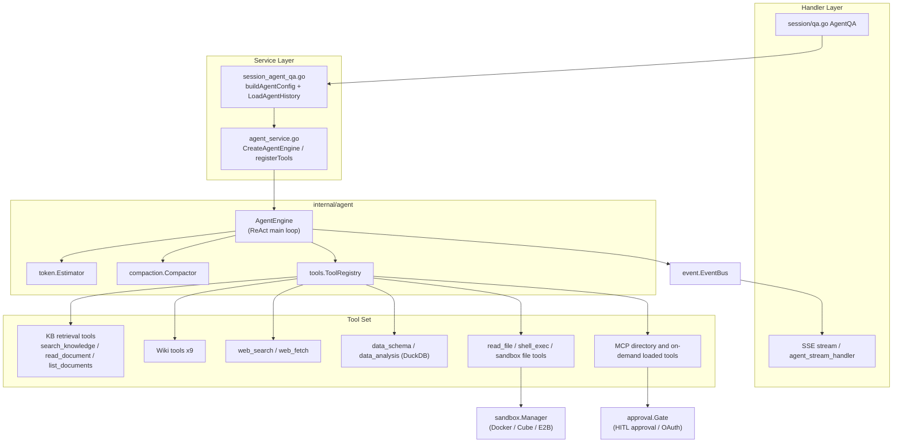
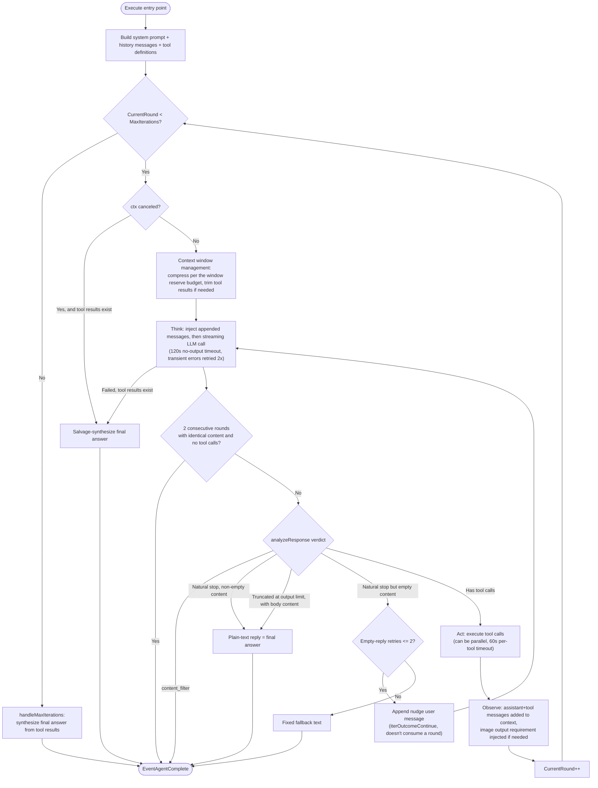
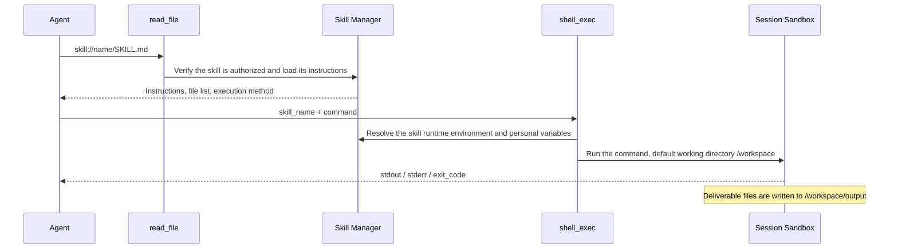

# Agent Engine

For how prompt sections, template references and custom body text are maintained, see [Chat Prompt Assembly and Editable Scope](../06-development/05-agent-prompts.md); for browser pairing and deployment, see [Local Browser](../05-clients/09-local-browser.md).

Agents can combine knowledge base retrieval, web search and external tools to handle multi-step tasks, such as comparing the terms of several contracts. Smart reasoning mode picks tools based on the question and runs multiple rounds of calls, then generates the answer from the results it gathers.

At the top of the chat box you can choose Quick Answer or Smart Reasoning:

| Mode | Suited to | Execution characteristics |
| --- | --- | --- |
| Quick answer (quick-answer) | Fact lookups based on documents | Generates the answer after retrieval, usually with fewer calls |
| Smart reasoning (smart-reasoning) | Cross-document analysis, web queries or tool operations | May run multiple rounds of calls; time and usage depend on the task |

On the "Agents" page you can create custom Agents: choose the mode and model, scope the knowledge bases, and configure the prompt, web search, MCP tools and skills. Once saved, an Agent can be used in web chat, or bound to IM or embed channels.

<Screenshot
  src="/screenshots/agent-editor.png"
  caption="Custom Agent configuration: mode, model, knowledge scope, and tools"
  hint="Shows the Agent editor dialog, including mode selection, model selection, knowledge base scope, the web search toggle, and MCP tool checkboxes." />

<Screenshot
  src="/screenshots/agent-chat.png"
  caption="Agent conversation: reasoning process and tool-call timeline"
  hint="Shows one round of an Agent's response, including expanded thinking steps, tool-call cards, and citations in the final answer." />

The configuration determines which resources and tools an Agent can access; actual calls are still constrained by the permissions of the current user or channel.

## Creating and Using Agents

1. Create a new Agent on the "Agents" page and choose Quick Answer or Smart Reasoning mode.
2. Choose the model, knowledge base scope and prompt. Type presets pre-fill the configuration, which you can still adjust before saving.
3. Enable web search or select MCP tools depending on the task; running skill scripts also requires binding a sandbox with the skills installed.
4. After saving, select the Agent on the chat page, ask a question, and check the answer's sources and tool results.

For a first try you can simply pick a built-in Agent. Quick Answer suits document lookups; the Data Analysis Agent targets CSV and Excel; the Wiki Agent is for browsing and maintaining Wiki content.

The reasoning effort (`reasoning_effort`) configured on an Agent is the default; during a conversation you can adjust it temporarily in the input box, and while a Smart Reasoning answer is being generated you can keep adding requirements. See [Sessions and Conversation Experience](18-chat-experience.md).

## Setting the Scope of Resources and Tools

An Agent can use all, specified or disabled knowledge base and skill scopes. Mentions in the conversation select the resources for this turn or hint at a preferred skill, but cannot bypass existing authorization; the @skill and @MCP menus in the input box only list resources available to the Agent actually running this turn — when using a shared Agent, they list the source space's skills and the MCP services explicitly selected by that Agent. Web search is constrained both by the Agent configuration and by the per-request toggle for this turn.

Once an Agent is shared through an organization, recipients use the source space's models and resources within the authorized scope. Shared Agents are read-only, and recipients cannot modify their configuration. When a recipient uses one:

- The model configured on the Agent is always used; `summary_model_id` in the request is ignored;
- An Agent with no MCP selection mode set does not use MCP services;
- Conversation records are written to the conversation-record knowledge base in the recipient's own space, not to the source space;
- Recipients can see the Agent's capabilities and resource scope (model, knowledge bases, MCP, web search), but not its prompt or creator.

When an Agent with skills enabled is shared, the skills run in the source space's sandbox with the environment variables the administrator configured for them, and members can have the Agent read those values out. For sharing rules, see [Spaces and Permissions](01-tenant-auth.md).

## Handling Tool Approval and Authorization

MCP tools that require manual approval show an approval card before execution, where the user can approve, reject or modify the arguments. The default wait limit is 10 minutes; a rejection, timeout or cancellation is returned as the tool result, and the Agent can continue from there. This approval mechanism applies only to MCP tools.

When an MCP service requires OAuth authorization, you can complete it within the current conversation, and the system retries the tool call once it succeeds.

## Using Skills, Attachments and Memory

With a sandbox bound, Smart Reasoning can read attachments, run scripts and generate files. Downloadable artifacts should be written to `/workspace/output`, and can be previewed and downloaded in the session once the answer completes. After each answer, the system records a git checkpoint of `/workspace`, which forking and rewinding a session use to restore the workspace of the corresponding turn; sessions in the desktop app that use a local directory directly don't record checkpoints, so forking and rewinding only affect the conversation. For installation and variable configuration, see [Skill Catalog and Sandbox](22-skills-sandbox.md); for attachment operations, see [Sessions and Conversation Experience](18-chat-experience.md).

Long-term memory is isolated per space and per caller, and an Agent can turn memory reads and writes off on its own; see [Cross-session Long-term Memory](23-memory.md) for the full description.

## Configuration Reference

### Custom Agents {#_7-custom-agents}

#### Modes and Type Presets {#_7-1-modes-and-type-presets}

`CustomAgent` (`internal/types/custom_agent.go`) has two runtime modes (`Config.AgentMode`):

- `quick-answer`: the classic RAG pipeline (retrieve → assemble context → single-shot generation), which never enters the Agent engine;
- `smart-reasoning`: ReAct Agent mode; `IsAgentMode()` returns true and forces `MultiTurnEnabled = true`.

Under smart-reasoning you can also pick a **type preset** (`Config.AgentType`, defined in `config/agent_type_presets.yaml`, loaded via `internal/types/agent_type_preset.go`). Presets only **pre-fill the form** in the editor — the user can override anything:

| Preset ID | System prompt template | Temperature | Max iterations | Pre-filled tools | KB filter |
| --- | --- | --- | --- | --- | --- |
| `rag-qa` | `progressive_rag_agent` | 0.7 | 30 | search_knowledge, read_document, list_documents | Derived from tools: any_of vector/keyword |
| `wiki-qa` | `wiki_researcher` | 0.7 | 30 | wiki_search, wiki_read_page, read_document, wiki_flag_issue | Derived from tools: any_of wiki |
| `hybrid-rag-wiki` | `hybrid_rag_wiki_agent` | 0.7 | 40 | wiki_search, wiki_read_page, search_knowledge, read_document, list_documents, wiki_flag_issue | any_of vector/keyword/wiki |
| `data-analysis` | `data_analyst` | 0.3 | 30 | data_schema, data_analysis; web search off; restricted to csv/xlsx file types | Explicit `none_of: [faq]` |
| `custom` | none | — | — | Nothing pre-filled | Unrestricted |

`thinking` and `todo_write` are not included in the preset tools by default and must be selected manually when needed; enabling them increases token overhead.

#### Configurable Options (CustomAgentConfig) {#_7-2-configurable-options-customagentconfig}

The main fields of `CustomAgentConfig` in `internal/types/custom_agent.go` (the `CreateAgent`/`UpdateAgent` handlers accept this struct directly):

| Category | Field | Description / default (EnsureDefaults) |
| --- | --- | --- |
| Basic | `agent_mode` | `quick-answer` / `smart-reasoning` |
| Basic | `agent_type` | Preset category under smart-reasoning; empty/unknown is treated as custom |
| Basic | `system_prompt` / `system_prompt_id` | Direct content takes priority; a custom Agent's template reference is resolved at request time by `ResolveCustomAgentPrompts` |
| Basic | `context_template` / `context_template_id` | The assembly template for retrieved snippets in normal mode |
| Model | `model_id`, `rerank_model_id`, `temperature`, `max_completion_tokens`, `thinking`, `reasoning_effort`, `citation_enabled` | temperature<0 → 0.7; max_completion_tokens=0 uses the runtime default: quick-answer 2048, smart-reasoning 4096, smart-reasoning with a bound sandbox 24576; with a bound sandbox, an explicit value below 8192 is executed as 8192; `reasoning_effort` takes `off`/`auto`/`minimal`/`low`/`medium`/`high`/`xhigh`/`max` and, when set, takes priority over `thinking` (`thinking: true` is equivalent to `auto`); levels the model doesn't support are automatically adjusted to the nearest one at call time; when neither is set, thinking is off; a single conversation can temporarily override it with the request field `reasoning_effort`; citation defaults to true if unset |
| Agent | `max_iterations` | Defaults to 10; a negative value means unlimited rounds (service-layer cap 100) |
| Agent | `llm_call_timeout` | Seconds a single streaming model call may go without any output; 0 uses the default 120s; the total duration is controlled by the model transport layer |
| Agent | `allowed_tools` | Tool whitelist; falls back to DefaultAllowedTools if empty |
| MCP | `mcp_selection_mode` (all/selected/none), `mcp_services`, `mcp_auth_wait_timeout` | OAuth wait in seconds; <=0 uses the Gate default |
| Skills | `skills_selection_mode` (all/selected/none), `selected_skills`, `sandbox_config_id` | Selects the space sandbox and its installed skills; see [Skill Catalog and Sandbox](22-skills-sandbox.md) |
| Memory | `memory_enabled` | nil inherits the space setting; false disables memory reads and writes for this Agent |
| Knowledge base | `kb_selection_mode` (all/selected/none), `knowledge_bases`, `retrieve_kb_only_when_mentioned`, `retain_retrieval_history` | When retain=true, historical KB retrieval results are not redacted |
| Multimodal | `image_upload_enabled`, `vlm_model_id`, `audio_upload_enabled`, `asr_model_id`, `image_storage_provider` | VLM is also used to describe images returned by MCP tools |
| Files | `supported_file_types`, `chat_parser_engine_rules`, `attachment_image_understanding`, `attachment_ocr_max_pages`, `attachment_parse_wait_timeout_sec` | Data-analysis-type Agents commonly restrict to csv/xlsx |
| FAQ | `faq_priority_enabled`, `faq_direct_answer_threshold`, `faq_score_boost` | — |
| Web | `web_search_enabled`, `web_search_max_results`, `web_search_provider_id`, `web_fetch_enabled`, `web_fetch_top_n` | max_results defaults to 5; `web_fetch_*` only applies to the quick-answer pipeline — in smart reasoning, the model calls `web_fetch` on its own |
| Multi-turn | `multi_turn_enabled`, `history_turns` | history_turns defaults to 5 and only constrains normal mode (KnowledgeQA); smart-reasoning forces multi_turn, loads history according to the context window, and does not read history_turns |
| Retrieval | `embedding_top_k` (10), `keyword_threshold` (0.3), `vector_threshold` (0.5), `rerank_top_k` (5), `rerank_threshold` | Defaults in parentheses |
| Advanced | `enable_query_expansion`, `enable_rewrite`, `rewrite_prompt_*`, `query_understand_model_id`, `fallback_strategy` (defaults to model), `fallback_response`, `fallback_prompt`, `intent_prompts`, `data_analysis_enabled` | Mainly affects the quick-answer pipeline |
| Suggestions | `question_suggestions` (starters / follow_ups) | starters default to 6 items in hybrid mode; follow_ups default to off, 3 items |

The handler layer (`internal/handler/custom_agent.go`) provides `CreateAgent`, `GetAgent`, `ListAgents`, `UpdateAgent`, `DeleteAgent`, `CopyAgent`, `GetPlaceholders` (returns the placeholder list from `types.PlaceholdersByField(PromptFieldAgentSystemPrompt)`), `GetAgentTypePresets` (the i18n'd preset list), and `GetSuggestedQuestions`. On create/update, `authorizeAgentKnowledgeScope` validates a restricted API key's KB scope: `kb_selection_mode: all` is a flat 403 for a KB-restricted key, `selected` is authorized entry by entry.

Runtime mapping: `buildAgentConfig` (`session_agent_qa.go`) converts `CustomAgentConfig` into the engine's `types.AgentConfig` (`internal/types/agent.go`), additionally layering in: web search requires both the Agent and the request to enable it (`customAgent.Config.WebSearchEnabled && req.WebSearchEnabled`); the web provider falls back to the tenant default; `SearchTargets` is unified from the KB/@document/@tag scope; `MaxContextTokens` falls back to 200000; per-turn priority hints for `@Skill` and `@MCP` (without removing other configured resources) (a shared Agent's @MCP mentions can only land within the Agent's preset set). Additionally, a rerank model is only required when `search_knowledge` is actually available (`agentRequiresRerankModel`; the legacy names `knowledge_search` / `grep_chunks` also count once normalized via `SuccessorToolName`).

#### Sharing Mechanism (agent_share) {#_7-3-sharing-mechanism-agent-share}

`internal/application/service/agent_share.go`: an Agent can be shared with an **Organization**:

- Only the Agent's owning tenant can share it (`ErrNotAgentOwner`); the sharer's tenant must be an Editor+ member of the organization;
- Before sharing, the Agent's configuration is validated for completeness: it must have a `model_id`; if `search_knowledge` is among its tools (or its tool set is empty and falls back to the default set) and the KB scope isn't disabled, it must also have a `rerank_model_id`, otherwise `ErrAgentNotConfigured`;
- **Permission is forced to read-only**: `permission = types.OrgRoleViewer` (cross-tenant editing is out of scope for v1); re-sharing updates idempotently;
- The receiving tenant can disable a given shared Agent locally via `TenantDisabledSharedAgentRepository`;
- When chatting with a shared Agent (`session_agent_qa.go`), retrieval and model scope switch to the **Agent's owning tenant** (`resolveRetrievalTenantID`), so the sharer's KB becomes available to the user, while the user's own MCP @mentions are restricted to the Agent's preset set.

### Built-in Agents (config/builtin_agents.yaml) {#_8-built-in-agents-config-builtin-agents-yaml}

Built-in Agents are defined in `config/builtin_agents.yaml`; at startup, `types.LoadBuiltinAgentsConfig` loads it and rebuilds the `BuiltinAgentRegistry` (`internal/types/builtin_agent_config.go`), supporting multi-language names and descriptions for default/zh-CN/zh-TW/ja-JP/ko-KR; `system_prompt_id`/`context_template_id` are resolved into actual template content at startup via `ResolveBuiltinAgentPromptRefs`.

| ID | Name (zh-CN) | agent_mode / agent_type | Key configuration |
| --- | --- | --- | --- |
| `builtin-quick-answer` | Quick Answer | `quick-answer` | Templates `default_kb` + `default_context`; temperature 0.7; FAQ priority (direct-answer threshold 0.9, boost 1.2); query expansion + rewrite; web search on, 5 results; does not enter the Agent engine |
| `builtin-smart-reasoning` | Smart Reasoning | `smart-reasoning` / `rag-qa` | `max_iterations: 50`; tools: search_knowledge, read_document, list_documents, query_knowledge_graph; web search on; multi-turn (history loaded according to the context window) |
| `builtin-data-analyst` | Data Analyst | `smart-reasoning` / `data-analysis` | Template `data_analyst`; temperature 0.3; `max_iterations: 30`; tools limited to data_schema + data_analysis; restricted to csv/xlsx; web search off; multi-turn (history loaded according to the context window) |
| `builtin-wiki-researcher` | Wiki Q&A | `smart-reasoning` / `wiki-qa` | Template `wiki_researcher`; `max_iterations: 30`; tools: wiki_search, wiki_read_page, read_document, wiki_flag_issue (read-only + issue-flagging); web search off |
| `builtin-wiki-fixer` | Wiki Revision | `smart-reasoning` / `custom` | Template `wiki_fixer`; `retain_retrieval_history: true` (revision needs to remember page content across turns); 9 tools in total: wiki_search, wiki_read_page, read_document, wiki_write_page, wiki_replace_text, wiki_rename_page, wiki_delete_page, wiki_read_issue, wiki_update_issue (excluding wiki_flag_issue); `kb_selection_mode: selected` |
| `builtin-skill-installer` | Skill Installer | `smart-reasoning` / `custom` | Template `skill_installer`; temperature 0.2; `max_completion_tokens: 24576`; `max_iterations: 30`; tools: shell_exec, write_skill_file, edit_skill_file; `kb_selection_mode: none`; invoked by the sandbox configuration's skill upload flow |

Additional notes (from `internal/types/custom_agent.go`):

- `builtin-wiki-fixer` and `builtin-skill-installer` don't appear in the user-visible Agent list (`builtinAgentIDsOrdered` excludes them) — the former is invoked programmatically by the Wiki editor and the latter by the skill upload flow, though both are still reachable via `GetAgentByID`;
- `builtinAgentIDsOrdered` also still reserves ID constant slots for `builtin-deep-researcher`, `builtin-knowledge-graph-expert`, `builtin-document-assistant`, etc., but the current YAML doesn't define those entries — the registry defers to the YAML as the source of truth;
- Every entry in `builtin_agents.yaml` other than Quick Answer carries a `reflection_enabled` flag (`true` for the Data Analyst, `false` for the rest), but **the backend currently doesn't consume this field** — there's no corresponding struct field or reference anywhere under `internal/`; it only exists in the YAML and in the frontend type definitions. In other words, it has no effect on the Agent's actual behavior right now — seeing it set to `true` doesn't mean there's an extra reflection round happening.

Incidentally, the constants `WikiSummaryPrompt`, `WikiKnowledgeExtractPrompt`, `WikiTaxonomyPlanPrompt`, etc. in `internal/agent/prompts_wiki.go` belong to the **Wiki ingest pipeline** (LLM-generated wiki page/taxonomy planning at document ingestion time), complementing the wiki-type Agents' runtime tools: the former produces Wiki content, the latter consumes and maintains it.

### Suggested Questions (Starters and Follow-ups) {#_10-suggested-questions-starters-and-follow-ups}

The chat box surfaces clickable questions in two places: **starters** shown when a session is still empty, and **follow-up suggestions** shown after each answer completes. This configuration belongs entirely to the Agent (`QuestionSuggestionConfig`, `internal/types/custom_agent.go`) — channel settings can only suppress display, not change the content strategy.

#### Configuration Options

Both groups of settings are independently toggled; `mode` determines where the questions come from:

| mode | Source | Applies to |
| --- | --- | --- |
| `curated` | Only the hand-written `items` | Starters |
| `knowledge` | Pulled from knowledge base content | Starters, follow-ups |
| `generated` | Generated by the model based on the conversation | Follow-ups |
| `hybrid` (default) | A mix of the above sources | Starters, follow-ups |

| Setting | Default | Description |
| --- | --- | --- |
| `starters.enabled` / `mode` / `items` / `count` | On / `hybrid` / empty / 6 | Starter questions; `count` ranges from 1–8 |
| `follow_ups.enabled` / `mode` / `count` | Off / `hybrid` / 3 | Follow-up suggestions; `count` ranges from 1–5 |
| `follow_ups.model_id` | Empty (uses the session model) | The model used to generate follow-ups; a smaller model can be specified to save cost |
| `follow_ups.categories` | All three selected | Restricts question type: `clarify` / `deepen` / `action` |
| `follow_ups.max_context_turns` | 2 | How many prior turns to look back at when generating, 1–5 |
| `follow_ups.additional_instruction` | Empty | Business constraints appended to the generation prompt, up to 2000 characters |
| `follow_ups.suppress_on_fallback` | On | Suppresses suggestions when the answer used a fallback strategy |
| `follow_ups.suppress_when_answer_asks_question` | On | Suppresses suggestions when the answer itself asks the user a question (to avoid two questions competing) |
| `follow_ups.knowledge_fallback` | On | Falls back to KB-sourced questions if generation fails |
| `follow_ups.allow_regenerate` | Off | Whether the user can manually request a new batch |

Follow-ups identical to the question the user just asked (ignoring case, whitespace and common punctuation) are removed, and knowledge-base-sourced candidates top up the count. After the user clicks a suggested question that came from the knowledge base, Smart Reasoning mode first searches that question's source knowledge base or document before answering.

#### Generation, Caching, and Analytics

- Results are stored in the `message_suggestion_sets` table, cached by `(assistant_message_id, placement, config_hash, locale)` — `config_hash` folds a digest of "the Agent configuration currently in effect" into the cache key, so a config change naturally produces a fresh batch instead of reading a stale cache; `locale` caches each language separately;
- States: `generating` → `ready`, plus `suppressed` (skipped per the suppression rules above) and `failed`; `lease_until` prevents multiple instances from generating the same batch redundantly;
- Endpoints: `GET /sessions/:id/messages/:message_id/suggestions` reads, `POST` on the same path triggers generation (idempotent), and `POST /sessions/:session_id/suggestion-events` reports analytics events;
- Tracked events: `impression` / `click` / `dismiss` / `regenerate`, stored in `message_suggestion_events`. The next user message sent after a click carries a `SuggestionAttribution` (`suggestion_set_id` + `question_id`), so analytics can distinguish "clicked a suggestion" from "typed the same question independently."

## Execution Mechanism Reference

### Overview and Architecture {#_1-overview-and-architecture}

#### Core Components {#_1-1-core-components}

| Component | Source location | Responsibility |
| --- | --- | --- |
| `AgentEngine` | `internal/agent/engine.go` | Drives the main ReAct loop; holds config, the tool registry, the chat model, the event bus, etc. |
| `ToolRegistry` | `internal/agent/tools/registry.go` | Tool registration, lookup, parameter validation, execution, output truncation, resource cleanup |
| Built-in tool set | `internal/agent/tools/*.go` | Built-in tools registered by capability + dynamic MCP tools |
| Token estimation and compression | `internal/agent/token/` + `internal/agent/compaction/` | `Estimator` (BPE-based estimation) and long-turn context compression (sandbox tool history) |
| Memory consolidation | `internal/application/service/memory/` | Cross-session long-term memory: extraction, recall, topic promotion, document affinity, consolidation |
| Skills system | `internal/agent/skills/` | Discovery, loading, and script execution for SKILL.md (Progressive Disclosure) |
| Execution sandbox | `internal/sandbox/` | Docker / Cube / E2B session-level isolated execution and security validation for skill scripts and `shell_exec` |
| Tool approval | `internal/agent/approval/gate.go` | Human-in-the-loop (HITL) approval for dangerous MCP tools and in-session OAuth authorization |
| Agent service layer | `internal/application/service/agent_service.go` | Assembles the engine: registers tools, resolves KB metadata, initializes skills/sandbox/VLM |
| Session Q&A entry point | `internal/application/service/session_agent_qa.go` | Builds a runtime `AgentConfig` from a `CustomAgent` and executes it |
| History reconstruction | `internal/application/service/agent_history.go` | Rebuilds multi-turn LLM context from the DB (`LoadAgentHistory`) |

The `AgentEngine` struct definition (`internal/agent/engine.go`, excerpt):

```go
type AgentEngine struct {
	config               *types.AgentConfig
	toolRegistry         *agenttools.ToolRegistry
	chatModel            chat.Chat
	eventBus             *event.EventBus
	knowledgeBasesInfo   []*KnowledgeBaseInfo    // Detailed knowledge base information for prompt
	selectedDocs         []*SelectedDocumentInfo // User-selected documents (via @ mention)
	pinnedMCPServices    []*PinnedMCPServiceInfo // User @mentioned MCP services for this turn
	pinnedSkills         []*PinnedSkillInfo      // User @mentioned skills for this turn
	questionOrigin       *QuestionOriginInfo     // Source of a picked suggested question, if any
	memoryPrompt         string                  // Long-term memory envelope appended to the system prompt
	skillsManager        *skills.Manager         // Skills manager for Progressive Disclosure (optional)
	tokenEstimator       *agenttoken.Estimator   // Token estimator for context window management, calibrated
	compactor            *compaction.Compactor   // Summarizes older history to fit the context window (nil = disabled)
	checkpointSink       types.ContextCheckpointSink // persists compactions that end on a stored turn
	modelContext         *modelcontext.Registry  // single request-local boundary for every model handle
	steerSink            types.SteerSink         // lets users append messages into the running turn
	// ... the rest is runtime state such as estimate calibration and overflow recovery
}
```

Engine responsibilities and constraints:

1. **The engine is stateless across turns.** The comments in the engine source explicitly state: conversation history is rebuilt from the DB each turn by the caller via `service.LoadAgentHistory`, and passed into `Execute` as `llmContext`; the engine itself keeps no cache, system-prompt storage, or cross-turn buffer.
2. **Event-driven output.** The engine never writes SSE directly. All output (thoughts, tool calls, tool results, the final answer, completion events) is emitted through the `event.EventBus`, and subscribers in the Handler layer convert it into an SSE stream and persist it. Relevant event types include `EventAgentThought`, `EventAgentFinalAnswer`, `EventAgentToolCall`, `EventAgentToolResult`, `EventAgentTool`, `EventAgentComplete`, and `EventError`.
3. **Reference/resource aliasing.** `modelContext` (`modelcontext.Registry`, see `internal/modelcontext/`) runs `EncodeMessages` on messages before every LLM call, replacing persistent IDs (chunk/document/web UUIDs) with short aliases (`cN`/`dN`/`bN`/`wN`, `res://NNNN`), then decodes them again on the way out during streaming. This way the model never sees a real UUID. The encoding order (resource handles before source aliases) is fixed inside the `Registry` and cannot be reversed by callers (see the type comment in `registry.go`): otherwise document UUIDs embedded in wiki summary page slugs would be mistakenly replaced by citation compression with aliases like `d1`, creating dead links.
4. **Observability.** Each execution opens a Langfuse span hierarchy: `agent.execute` → `agent.round.N` → `agent.tool.<name>`, capturing the round number, token usage, and a preview of tool output (truncated to 4000 runes), among other things. SQL parameters for `database_query` are redacted in both Langfuse and the UI hint (`toolHintSensitiveArgs`).

#### Component Relationship Diagram {#_1-2-component-relationship-diagram}



#### Building the System Prompt {#_1-3-building-the-system-prompt}

`BuildSystemPromptSections` in `internal/agent/prompts.go` first selects the base template: explicit content takes priority; otherwise `pure` is used when there's no knowledge base, and `rag` when there is one. It then concatenates, in order, the sections for mid-run additions, runtime conventions, sources, tools, output, skills, memory and the citation protocol. The skills section is only added when `read_file` is available, usable skills exist, and the Agent is not in skill-installation mode.

The current turn's knowledge base summary, pinned documents, date and session information are placed by `observe.go` into the user message's `runtime_context`, and are not persisted to history; general answering rules live in the system sections. `@MCP` / `@Skill` produce priority-use hints for authorized resources, without automatically excluding other available sources.

Section order, placeholders, saving of template references and message-role boundaries are maintained in one place in [Chat Prompt Assembly](../06-development/05-agent-prompts.md).

### The ReAct Loop, Phase by Phase {#_2-the-react-loop-phase-by-phase}

#### Entry Point: Execute {#_2-1-entry-point-execute}

`AgentEngine.Execute` (`internal/agent/engine.go`) flow:

1. `defer e.toolRegistry.Cleanup(ctx)` — at the end of execution, clean up any tool implementing `types.Cleanable` (e.g. `data_analysis` drops the DuckDB tables it created for this session);
2. Opens a Langfuse `agent.execute` span;
3. Initializes `types.AgentState` (`RoundSteps`, `KnowledgeRefs`, `IsComplete=false`, `CurrentRound=0`);
4. `buildSystemPrompt` + `buildMessagesWithLLMContext` (system + history + current user message, with image URLs attached);
5. `buildToolsForLLM` converts the tools in the registry into function-calling definitions;
6. Enters `executeLoop`.

#### Main Loop: executeLoop and runReActIteration {#_2-2-main-loop-executeloop-and-runreactiteration}

```go
for state.CurrentRound < e.config.MaxIterations {
    // ctx cancellation check → salvage-synthesize a final answer if tool results already exist
    outcome, iterErr := e.runReActIteration(...)
    switch outcome {
    case iterOutcomeContinue: continue loop   // retry on empty reply, doesn't consume a round
    case iterOutcomeBreak:    break loop      // terminate (natural stop/stuck/canceled/content filter)
    case iterOutcomeNext:     state.CurrentRound++
    }
}
if !state.IsComplete && ctx.Err() == nil {
    e.handleMaxIterations(ctx, query, state, sessionID) // fallback: synthesize a final answer
}
```

`executeLoop` uses `defer emitCompletion()` to guarantee that **exactly one `EventAgentComplete` is emitted on every exit path** (using `context.WithoutCancel` so the event still reaches the client after the user clicks "stop"). This event carries `state.RoundSteps`, which the stream handler writes into the assistant message's `AgentSteps` field for persistence.

Each `runReActIteration` internally runs through four phases:

**① Think**: first performs context-window management (see [Memory and Context Compression](#_4-memory-and-context-compression)), then writes any `inject` messages the user appended during the run into history and attaches them to the end of the message list (see [Appending Messages to a Running Answer](../04-api/02-api-chat.md#steer)), then `callLLMWithRetry` (`internal/agent/think.go`):

- `agenttools.SanitizeMessages` fixes issues like consecutive same-role messages or orphaned tool results;
- Streams the LLM call (`streamThinkingToEventBus`); the call is only canceled after `defaultLLMStallTimeout = 120s` pass without any output (overridable via `AgentConfig.LLMCallTimeout`), so long rounds that keep producing output aren't subject to a total duration limit — the total duration is bounded by the model transport layer;
- Transient errors (429/5xx/timeout/overloaded, etc., see `transientErrorMarkers`) are retried up to `maxLLMRetries = 2` times, backing off 1s then 2s;
- If retries still fail but tool results already exist, it **gracefully degrades**: `streamFinalAnswerToEventBus` synthesizes a final answer from the existing tool results, and `state.IsComplete = true`.

During streaming: the `reasoning_content` channel (DeepSeek, etc.) and embedded `<think>` blocks (split out by `ThinkStreamSplitter`) are both routed to the "thinking" area (`EventAgentThought`); regular content is optimistically streamed straight to the final-answer area (`EventAgentFinalAnswer`) — if this round subsequently issues a tool call, that text is treated by the UI as a preamble and moved into the step tree, while still being retained as that round's `Thought`.

**② Analyze**: `analyzeResponse` (`internal/agent/observe.go`) checks the stopping conditions:

- `finish_reason == "content_filter"` with no tool calls → terminate; the answer is the filtered content or a fixed apology message;
- Natural stop (`isNaturalStopFinishReason`: `stop` / `end_turn` / `stop_sequence`) with no tool calls → **the Agent ends**, and the plain-text reply is the final answer (**there is no dedicated final_answer tool**; any `final_answer` tool call left over in legacy history data is filtered out on replay by `filterNonTerminalToolCalls`);
- Natural stop but empty content → appends a nudge user message, `"Please provide your complete answer now as plain text."`, and retries, up to `maxEmptyResponseRetries = 2` times (returns `iterOutcomeContinue`, doesn't consume a round); no terminal answer event is emitted during the retries, and only once retries are exhausted is the fixed fallback text used as the sole final answer;
- Truncated by the output limit (`finish_reason` is `length` / `max_tokens` / `max_output_tokens`) with body content and no tool calls → delivers the content produced before truncation and ends this round, with a `truncated` flag on the answer event and the `AgentStep`; if there's no body content at truncation (only thinking content), it's retried as an empty reply; after `maxConsecutiveLengthRounds = 3` consecutive truncated rounds (usually truncated inside tool-call arguments) it stops, and if there's no body content, returns a fixed notice suggesting narrowing the question or raising `max_completion_tokens`;
- If there are user-appended `inject` messages when the round is about to stop naturally, this round's reply is kept as an intermediate answer and the Agent continues after reading the appended content; in this case one extra round is allowed even if the iteration limit has been reached (`maxSteerOverruns = 1`).

There's also a **stuck-detection** check before Analyze: if `maxRepeatedResponseRounds = 2` consecutive rounds return exactly the same content (including consecutive empty ones) with no tool calls (usually caused by an unhandled finish reason), it forcibly terminates and uses that content as the final answer, falling back to the fixed fallback text when the content is empty.

**③ Act**: `executeToolCalls` (`internal/agent/act.go`) executes all of this round's tool calls:

- When `AgentConfig.ParallelToolCalls == true` and there are ≥ 2 calls, they run **in parallel** via `errgroup` (best-effort — a single failure doesn't cancel its siblings), with results filled back in original order;
- Each call first goes through `NormalizeToolCallID`, then has its JSON arguments parsed — a parse failure is first repaired via `RepairJSON` and retried; if it still fails, an error result with a hint is returned (`"[Analyze the error above and try a different approach.]"`), letting the model try a different approach instead of failing the whole round;
- A single tool execution times out after `defaultToolExecTimeout = 60s`; `shell_exec` uses `shellExecToolTimeout = 10m5s` (slightly longer than the command's own 600s cap, so that a structured timeout result can be returned), and `local_browser`'s manual-takeover steps use a separate wait duration; `ToolExecContext` additionally carries an `ApprovalCtx` without that timeout, for legitimate long waits like MCP human approval/OAuth;
- Emits `EventAgentToolCall` (with a localized display-name hint, e.g. `Search web("...")`), `EventAgentToolResult`, and `EventAgentTool` events. Tool execution failures are likewise sent to the client as a `tool_result` (`success: false` and `error`) rather than as an `error` event, and the Agent continues based on the error.

**④ Observe**: `appendToolResults` (`internal/agent/observe.go`) appends this round to the message array per the OpenAI protocol: one assistant message carrying `tool_calls`, plus one `role:"tool"` message per result (content aliased via `modelContext.ModelToolResultForTool`). If any successful tool result this round contains a Markdown image, a `## Retrieved Image Output Requirement` note is also appended to the system message (`internal/agent/image_requirement.go`), forcing the final answer to carry the relevant images verbatim. `state.CurrentRound++` then advances to the next round.

#### Summary of Termination Conditions and Max Iterations {#_2-3-summary-of-termination-conditions-and-max-iterations}

| Termination path | Trigger condition | Source of final answer |
| --- | --- | --- |
| Natural stop | finish_reason ∈ {stop, end_turn, stop_sequence}, no tool calls, non-empty content | This round's plain-text reply |
| Empty-reply exhaustion | Natural stop but empty content; nudge retried 2 times and still empty | Fixed fallback text |
| Output truncation | Truncated by the output limit with body content and no tool calls | The content before truncation (with a `truncated` flag) |
| Consecutive truncation | 3 consecutive rounds truncated at the output limit | The last body content or a fixed notice |
| Content filter | finish_reason == content_filter, no tool calls | Filtered content or safety notice |
| Stuck detection | 2 consecutive rounds with identical content and no tool calls | The repeated content itself |
| User cancel / timeout | ctx.Done(); salvage-synthesized if tool results already exist | Synthesized answer or partial steps retained |
| Unrecoverable LLM failure | Retries exhausted; degrades to a synthesized answer if tool results exist, otherwise errors | Synthesized answer / error event |
| Max iterations reached | `CurrentRound == MaxIterations` (unlimited rounds when `max_iterations` is negative) | `handleMaxIterations` → synthesized via `streamFinalAnswerToEventBus` |

Multiple layers of default max-iteration values:

- Service layer `ValidateConfig`: falls back to 5 when `0`, a negative value means unlimited rounds, hard cap `MAX_ITERATIONS = 100` (`internal/application/service/agent_service.go`);
- `CustomAgent.EnsureDefaults`: defaults to 10 when unconfigured (`internal/types/custom_agent.go`);
- Built-in Agents: Smart Reasoning 50, Data Analyst 30, Wiki Q&A/Revision 30 (`config/builtin_agents.yaml`).

Once the cap is reached, `handleMaxIterations` goes through `internal/agent/finalize.go` and reuses the current message list — keeping the original message roles, images and tool-call pairings — then appends a wrap-up request to generate the final answer; this call provides no tools, sets `tool_choice=none`, and disables thinking.

#### ReAct Loop Flow Diagram {#_2-4-react-loop-flow-diagram}



### Complete Reference of Built-in Tools {#_3-complete-reference-of-built-in-tools}

#### Tool Summary Table {#_3-1-tool-summary-table}

Tool name constants are defined in `internal/agent/tools/definitions.go`. The table below covers every built-in tool (the parameter column only lists schema fields; `*` marks required):

| Tool name | Key parameters | Behavior / return value |
| --- | --- | --- |
| `thinking` | `thought`\*, `next_thought_needed`\*, `thought_number`\*, `total_thoughts`\*, `is_revision`, `revises_thought`, `branch_from_thought`, `branch_id`, `needs_more_thoughts` | Sequential Thinking: records/revises/branches thinking steps; returns thinking progress (including `incomplete_steps`); notes that tool names and the final answer must not appear in the thinking itself |
| `todo_write` | `task`, `steps[]`\* (`id`/`description`/`status`: pending/in_progress/completed) | Creates/updates a plan for retrieval-type tasks only (summarization is left to `thinking`); returns the formatted plan with `display_type: "plan"` |
| `search_knowledge` | `query`\* (one natural-language question or phrase; write exact terms in keyword mode), `mode` (`hybrid` default / `semantic` / `keyword`), `knowledge_base_ids[]` (`bN`, up to 10), `limit` (default 10, cap 30) | The single knowledge base retrieval entry point: `hybrid` uses RRF fusion of vector + keyword, `semantic` uses vector only, and `keyword` is served by the keyword index (BM25 / engine keyword retrieval) — it no longer runs unindexed regex scans over the chunks table; recall thresholds and the candidate pool come from the global `conversation.vector_threshold` / `keyword_threshold` / `embedding_top_k` (0.2 / 0.3 / 30 in the bundled `config.yaml`, falling back to 0.6 / 0.5 / 30 when unconfigured), and the Agent's own thresholds are not read; when a rerank model is available, results are reranked (the scored text is "document title + chunk body", except for FAQ; the threshold defaults to 0.3, and when nothing passes it, the best candidates scoring ≥ 0.15 are kept), then de-duplicated with MMR (λ=0.7); when the rerank rejects everything, results carry `rerank_rejected` with a hint to switch to `keyword` for identifier-like terms; results carry short `cN`/`dN` IDs, are deduplicated within the same call, and each document's metadata header is only output once; when a selected KB lacks the corresponding index, it degrades per KB instead of erroring: `keyword` on an FAQ KB or a vector-only KB falls back to semantic retrieval, `semantic` on a keyword-only KB falls back to keyword retrieval, and `requested_mode` and `mode_fallbacks` in the result indicate which KBs degraded and why; it only errors when there's no chunk index at all in scope (e.g. all KBs are Wiki-only) |
| `read_document` | `id`\* (a `dN` document handle or a `cN` chunk handle), `offset` (position in reading order, starting at 0 — not a chunk index; page with the returned `next_offset`), `limit` (default 20, cap 100), `query` (in-document search: split on whitespace into multiple terms; a chunk must contain all of them, in any order, case-insensitive), `regex` (treat the whole `query` as a single regex, case-insensitive), `context` (how many adjacent chunks to include on each side of a `cN`, cap 5) | Always returns the document metadata header first (title, type, parse_status, chunk count, metadata), then chunks as needed: `dN` pages through from `offset`; `cN` reads that chunk, optionally with surrounding `context` (neighbors are taken in chunk_index order, unaffected by indexes occupied by parent chunks, summaries or image chunks); with `query`, it searches within the owning document even when `id` is a `cN`, returning matching chunks with one chunk of context on each side (at most 20 matches), plus a hint when nothing matches; a single page or search result stays within 80% of the tool output budget, with the rest read via `next_offset`; FAQ entries are read the same way; validates the KB is within searchTargets and the @mention scope |
| `list_documents` | `knowledge_base_id`\* (`bN`), `keyword` (filter by title or filename substring), `page` (default 1), `page_size` (default 20, cap 100) | Lists the documents of a single knowledge base page by page, returning `dN` handles that can be passed straight to `read_document` |
| `query_knowledge_graph` | `knowledge_base_ids[]`\* (1–10 `bN`s), `query`\* | Concurrently queries each KB's knowledge graph for entities and relations; only offered to the model when a graph-enabled KB exists in scope (removed when `agent_service.go` assembles the whitelist), with capability requirement `all_of: [graph]` |
| `database_query` | `sql`\* (SELECT-only) | Read-only queries against a whitelist of tables (`knowledge_bases`/`knowledges`/`chunks`), auto-injecting a tenant_id filter and `deleted_at IS NULL`; SQL parameters are redacted in the UI/Langfuse |
| `data_schema` | `knowledge_id`\* (`dN`) | Reads a CSV/Excel file's `table_summary` + `table_column` typed chunks, returning column info and row count; also tells the model that in `data_analysis` the document is always accessed under the table name `dataset` |
| `data_analysis` | `knowledge_id`\*, `sql`\* | Loads CSV/Excel into DuckDB and runs SQL. The document is selected by `knowledge_id`, and the SQL always references it by the table name `dataset` (each query creates a temporary view on its own connection, mapped to the physical table, so the model never needs to write a document ID in SQL); multi-sheet Excel is merged into a single table exposing a `__sheet_name` column; auto-corrects case/whitespace differences in column names; drops the tables it created on session Cleanup |
| `web_search` | `query`\*, optional `count` (not exceeding the configured cap, at most 20), `country` (two-letter country code or `ALL`), `freshness` (`pd`/`pw`/`pm`/`py`; Brave also supports date ranges), `content` | Web search, directly returning the provider's titles, snippets and short `wN` page IDs; knowledge base or web retrieval is chosen according to the task, and Agent search no longer performs automatic RAG compression; `country`/`freshness` are only supported by Brave and Serply, and other providers return an error when they're passed; `content=true` fetches the top 3 results in parallel within 15 seconds, taking a 5000-character body excerpt from each |
| `web_fetch` | `items[]`\* (each item has `url`\*=`wN` or an HTTP(S) URL, and optional `offset`, `limit`; `limit` counts characters, defaults to and is capped at 8000, and multiple items share the output budget) | Concurrently fetches up to 8 web pages (SSRF-safe client + DNS pinning, rendering via chromedp when needed), directly returning Markdown or supported text bodies; 60s timeout. Paginates by characters, continuing with `next_offset`; the full body is saved at `full_output_path` (a `web://` address, readable only within the same session), which `read_file` can read line by line across turns; returns per-URL `success`/`failed`/`skipped` status with retryable error codes (e.g. `snapshot_expired` for an expired snapshot); partial failures don't affect other pages |
| `read_file` | `path`\*, `offset` (1-based line number), `limit` (default 2000 lines), `max_bytes` (cap 64 KiB, 50 KiB for web snapshots); web pages can take `line_offset` | Reads workspace text, skill:// resources and web:// page snapshots, continuing per the result |
| `shell_exec` | `command`\*; optional `skill_name`, `work_dir`, `timeout_sec`, `stdin` (≤ 64 KiB), `max_output_bytes` (default 16 KiB, cap 64 KiB), `max_stderr_bytes` (default 8 KiB, cap 16 KiB), `env` | Runs a command in the current session's sandbox, with default working directory `/workspace`; when a skill is specified, resolves the skill directory and variables |
| `list_sandbox_files` | `path`, `max_entries` (default 200, cap 500) | Browses sandbox files and available artifacts; only offered when `shell_exec` isn't registered |
| `write_sandbox_file` | `path`\*, `content`\*, `mode` (`overwrite` default / `append`) | Writes or appends a workspace file; cannot write to `/workspace/input` |
| `edit_sandbox_file` | `path`\*, `edits`\* (each item has `old_string`\*, `new_string`\*, `replace_all`) | Batch exact replacements based on the original version |
| `search_memory` | `query`\*, `limit` (default 10, cap 20) | Searches long-term memory within the current caller's scope |
| `search_conversations` | `query`\*, `limit` (default 5, cap 8) | Searches the current caller's past conversations; the scope is determined by the caller's identity, and no scope parameter is accepted |
| `wiki_search` | `query`\* (case-insensitive POSIX regex, e.g. `stardust\|skyvault`; text that isn't a valid regex, such as `C++`, is matched literally), `regex` (`false` forces literal matching, `true` requires a valid regex), `knowledge_base_ids[]` (`bN`), `limit` (default 10 per KB, cap 50); the legacy parameters `queries[]` and `knowledge_base_id` are still accepted | Searches Wiki pages (title/slug/aliases/summary/content), returning page slugs tagged with `bN` and their summaries; pages already returned earlier are still listed, but with the summary omitted |
| `wiki_read_page` | `slugs[]`\* | Reads a Wiki page's full text, metadata, and inbound/outbound links by slug (linked pages include a summary, omitted if already seen); the knowledge base is routed automatically by slug; an `index` slug returns a table-of-contents overview grouped by type (top 20 per type) |
| `wiki_write_page` | `slug`\*, `title`\*, `summary`\*, `content`\*, `page_type`\*, `aliases[]`, `source_refs[]` | Creates a new wiki page or fully overwrites an existing one; normalizes and validates the slug before writing; handles outbound links automatically |
| `wiki_replace_text` | `slug`\*, `old_text`\*, `new_text`\*, `source_refs[]` | Precise text replacement, suited to small revisions |
| `wiki_rename_page` | `slug`\*, `new_slug`\* | Renames a slug and cascades the update to all pages that link to it |
| `wiki_delete_page` | `slug`\* | Deletes a page and automatically cleans up inbound links from other pages to prevent dead links |
| `wiki_flag_issue` | `slug`\*, `issue_type`\* (mixed_entities/contradictory_facts/out_of_date/other), `description`\*, `suspected_knowledge_ids[]` | Flags a page for factual errors, entity confusion, etc., recording an issue for manual or automated maintenance |
| `wiki_read_issue` | `issue_id` / `slug` | Views the detail of a specific issue, or lists the pending issues for a page |
| `wiki_update_issue` | `issue_id`\*, `status`\* (resolved/ignored/pending) | Updates an issue's status |
| `discover_mcp_tools` / `call_mcp_tool` | Discover: `mode`\* (`list_servers`/`list_tools`/`describe`/`search`), `server_id`, `tool_name`, `query`, `cursor`, `limit` (1–50), `refresh`; call: `tool_ref`\*, `arguments`\* | Queries the directory, reads full definitions and calls tools on demand; see [MCP Tool Directory](08-mcp.md#mcp-tool-directory) |
| `mcp_...` (dynamic, with a stable hash suffix) | Determined by the MCP service's InputSchema | External functions published once their definition has been read; the description names the service and the original tool name, permissions are re-checked at execution time, and they can be gated behind human approval and in-session OAuth |
| `local_browser` | `method`\* (`observe`, `snapshot`, `navigate`, `click`, `fill`, `tab_*`, `evaluate`, `request_help`, etc.); the remaining fields depend on the method | Operates the local browser the user has connected; only registered when the request enables `local_browser_enabled` and the deployment has browser access enabled; see [Local Browser](../05-clients/09-local-browser.md) |
| `write_skill_file` / `edit_skill_file` | Write: `path`\*, `content`\* (≤ 256 KiB); edit: `path`\*, `old_string`\*, `new_string`\*, `replace_all` | Only used by the built-in skill installer in installation mode, and can only modify the directory of the skill being installed |

The default tool whitelist `DefaultAllowedTools()` (the fallback when an Agent has no `allowed_tools` configured): `search_knowledge`, `read_document`, `list_documents`, `search_conversations`. `web_search` / `web_fetch` and `search_memory` aren't governed by the whitelist: at registration they're first stripped from the whitelist, then injected according to the web search toggle and the memory toggle (which the space, the user and the Agent must all allow), respectively.

**Compatibility with legacy tool names**: `knowledge_search` and `grep_chunks` have been merged into `search_knowledge`; `list_knowledge_chunks`, `get_document_info` and `wiki_read_source_doc` have been merged into `read_document`. `legacyToolSuccessors` in `definitions.go` records this mapping, and at tool registration `NormalizeAllowedTools` automatically rewrites legacy names in saved Agent configurations, presets and API calls to the new tools, with no data migration needed; legacy tool names recorded in historical messages still render correctly.

**Availability of the document reading tools**: `read_document` and `list_documents` read the persisted chunks, and every knowledge base writes chunks regardless of its indexing strategy, so they're registered whenever a vector/keyword KB or a Wiki KB is in scope (`documentToolSet` in `agent_service.go`), letting Wiki Agents read back the source text; `search_knowledge` still requires a vector or keyword index. These two tools are marked `Auxiliary` in the capability table: they work with Wiki-only KBs, but they don't pull Wiki-only KBs into a RAG Agent's "all knowledge bases" scope, and they only count toward the derived KB filter when there are no other knowledge base tools. The @file / @tag scope of `list_documents` applies before pagination: tags are pushed down into the database filter, specified documents are read directly by ID, and `total_docs` and `next_page` only count documents within the scope.

**Recommended retrieval workflow**: `search_knowledge` (pick `mode` per the question: `hybrid` by default, `keyword` for exact terms / error messages / identifiers, `semantic` for paraphrased or conceptual questions) → `read_document` (page through the context by `dN`, or locate within the document using `query`) → cite with `cN` handles in the answer. For Wiki knowledge bases, it's `wiki_search` → `wiki_read_page` → `read_document` to read back the original source.

#### The Tool Registry (ToolRegistry) {#_3-2-the-tool-registry-toolregistry}

`internal/agent/tools/registry.go`:

- **Registration**: `RegisterTool` follows a **first-wins** policy — a later registration under the same name is rejected, preventing an MCP service from hijacking a built-in tool via a name collision (corresponds to security advisory GHSA-67q9-58vj-32qx);
- **Definition export**: `GetFunctionDefinitions` sorts by tool name, ensuring the tools payload sent to the LLM is byte-identical across requests, so it hits provider prompt caches that rely on prefix matching (e.g. Qwen's explicit cache);
- **Execution pipeline**: `ExecuteTool` = `CastParams` (converts common LLM type slips like `"true"` to `true`) → `ValidateParams` (pre-validates against the JSON Schema, saving a wasted execution + LLM round trip) → `tool.Execute` → output truncation;
- **Output truncation**: `TruncateToolOutput` (`truncate.go`) defaults to `DefaultMaxToolOutput = 24000` **runes** (overridable via `AgentConfig.MaxToolOutputChars`; tools such as `shell_exec` and `discover_mcp_tools` can declare a higher cap of their own); over the limit, it keeps the first 70% and last 30% with a truncation marker in between, preventing a large result from polluting the context;
- **Error hints**: when a tool's argument JSON can't be parsed, `"[Analyze the error above and try a different approach.]"` is appended to the returned result, nudging the LLM to change strategy; other failures directly return the tool's own error message;
- **Cleanup**: `Cleanup` iterates over tools implementing `types.Cleanable` and releases their resources.

#### Capability Mechanism and Config-driven Enable/Disable {#_3-3-capability-mechanism-and-config-driven-enable-disable}

`internal/agent/tools/capabilities.go` is the Go mirror of the frontend's `frontend/src/utils/tool-capabilities.ts`, declaring each tool's KB capability requirements:

```go
var ToolCapabilityRequirements = map[string]ToolRequirement{
	"thinking":   {},
	"todo_write": {},
	"search_knowledge":      {AnyOf: []KBCapability{CapVector, CapKeyword}, ConsumesFiles: true},
	"read_document":         documentReaderRequirement, // AnyOf vector/keyword/wiki, Auxiliary
	"query_knowledge_graph": {AllOf: []KBCapability{CapGraph}, ConsumesFiles: true},
	"list_documents":        documentReaderRequirement,
	// Retired names keep their original requirement (wiki_read_source_doc matches read_document), so a stored config that has not been normalized yet still passes the capability check
	// ...
	"wiki_search":          {AllOf: []KBCapability{CapWiki}},
	// ...
	"data_analysis": {AnyOf: []KBCapability{CapVector, CapKeyword}, ConsumesFiles: true},
}
```

The capability enum is `vector` / `keyword` / `wiki` / `graph` / `faq`. This drives:

- `DeriveKBFilterForAgent(agentMode, allowedTools)`: the selectable-KB filter predicate in the Agent editor / `@` menu; `quick-answer` mode implicitly requires `vector|keyword`;
- `KBSatisfiesToolRequirements`: the backend's last line of defense — even a client that bypasses the frontend can't hand an incompatible KB to a tool;
- `ToolsConsumeFiles`: decides whether the chat input box shows the `@file` list.

**Runtime enable/disable logic** (`registerTools` in `agent_service.go`):

1. Starts from `config.AllowedTools` (the user-editable whitelist; presets only pre-fill the initial value), first rewriting legacy tool names to their new names via `NormalizeAllowedTools`; falls back to `DefaultAllowedTools()` if empty; for read-only calls through a shared Agent, or when there's no writable Wiki KB in scope, the Wiki write tools (`wiki_write_page`, `wiki_replace_text`, `wiki_rename_page`, `wiki_delete_page`, `wiki_flag_issue`, `wiki_update_issue`) are removed;
2. If this turn has **no knowledge-retrieval scope at all** (Pure Agent mode), all KB/Wiki/data tools are filtered out; if web search is also off, `todo_write` is dropped too;
3. Injection per runtime toggles: when web search is enabled, `web_search` + `web_fetch` are appended; when memory is available, `search_memory` is appended (if it's listed in the whitelist, it's stripped first anyway);
4. **Hard safety net**: scans the real capabilities of each KB in `SearchTargets` — no wiki KB means all wiki tools are dropped; no vector/keyword KB means `search_knowledge`, `query_knowledge_graph` and `database_query` are dropped, and if there's also no wiki KB, `read_document` and `list_documents` are dropped as well; no graph-enabled KB means `query_knowledge_graph` is dropped (guarding against stale configuration, e.g. wiki tools were checked earlier and then the KB was swapped to a non-wiki one);
5. After deduplication, tools are instantiated and registered one by one; MCP tools are registered separately per `MCPSelectionMode` (all/selected/none); sandbox shell/file tools are registered according to session capabilities (`list_sandbox_files` isn't registered when `shell_exec` is present), and `read_file` additionally layers in skills and the web-page data source; `local_browser` and the skill installer's file tools follow their own registration conditions; legacy skill tool names are only recognized for compatibility and are no longer registered.

### Memory and Context Compression {#_4-memory-and-context-compression}

Long-term memory is saved across sessions per space and per caller, and is configured separately from the session-history compression described below. For enabling it and managing personal memories, see [Cross-session Long-term Memory](23-memory.md); for the full interface, see the [Memory API](../04-api/02-api-memory.md).

#### Token Budget and Estimator {#_4-1-token-budget-and-estimator}

- Context budget: `AgentConfig.MaxContextTokens`, falling back to `types.DefaultMaxContextTokens = 200000` when `buildAgentConfig` leaves it unset;
- `token.Estimator` (`internal/agent/token/estimator.go`) estimates using tiktoken's **cl100k_base** encoding, with constants `perMessageOverhead = 3` and `perConversationTail = 3`; on an encoding failure it falls back to an approximation of `len(s)/4`;
- **Authoritative values take priority**: the true token count is whatever the model API's `Usage` reports. The engine's `estimateCurrentTokens` uses the previous round's reported `lastUsage.TotalTokens` as a baseline, and only does an incremental BPE estimate for new messages (the assistant reply + tool results); a full estimate is only done on the first round, when no Usage exists yet.
- **Estimation calibration**: cl100k isn't every model's tokenizer — Chinese under cl100k comes to roughly 1 token per character, versus about 0.6 for Qwen and DeepSeek, while English and JSON are largely consistent. The estimator therefore carries a calibration factor (`Estimator.SetScale`, clamped to 0.5–1.5) that applies only to text; the fixed per-message overhead and the fixed estimate for images aren't scaled. The factor is measured by the engine between two adjacent requests within the same conversation turn: both requests have the same tool definitions, system prompt and existing messages, so the increase in prompt tokens reported by the model corresponds only to the newly appended messages (the previous reply, tool results, appended messages); dividing it by the estimate for those messages yields the factor for conversation content, unaffected by how each provider renders tool definitions. Samples are not counted when compression or tool-result trimming happened in between, when the sample contains images, when the ratio is implausible (< 0.3 or > 3), or when the accumulated samples total fewer than 256 estimated tokens. The measured factor is saved with this turn's usage as `context_token_scale` (even if the model didn't report total tokens); when no factor was measured this turn (e.g. it ended after a single request without calling any tools), the factor from the start of the turn is carried over, so the latest turn always carries the latest factor; on the next turn, `LoadAgentHistory` takes the most recent message carrying a factor, prices history with it, and hands the factor to the engine as its starting point. The loader, the first-round compression check and the compactor (the raw-retention budget and the summary input cap) share the same estimator, and thus the same yardstick: calibrating only the compression check but not loading would make the loader drop turns first. The first-round compression check still counts only messages, not tool definitions.

#### Context Compression and Overflow Recovery {#_4-2-context-compression-and-overflow-recovery}

`manageContextWindow` (`internal/agent/observe.go`) calls `compaction.Compactor` before every Think phase. MaxContextTokens is taken first from the Agent configuration, then from the model's parameters.context_window, finally falling back to 200000. The trigger threshold is the window minus the reserve; the reserve is at least 16384 and grows with this turn's output budget: `max(completion budget + 4096, 16384)`.

Compression selects the recent messages to keep by token budget, with KeepRecentTokens=20000 by default, lowered to a quarter of the usable window for small windows. Long ReAct sessions can be split inside the current turn; the cut point never separates an assistant tool call from its tool results, and the first half of a split turn is summarized on its own to explain the retained second half.

The previous summary takes part in the update, and older history produces a structured summary; the result is placed as a marked user message between the system message and the retained tail. The summary budget is computed from the reserve, the model's output cap and the retention budget, rather than being fixed at 2000. The summary call uses the streaming interface and, like the engine's own conversation rounds, only sets a stall timeout: it's canceled only after a stretch with no output at all (default 120 seconds, following `LLMCallTimeout`), and the total duration is left to the model transport layer. The earlier 60-second total timeout would cut off large requests that were prefilling and producing output normally. The model's thinking output also counts as progress but isn't included in the summary; an error reported in the stream counts as a failed attempt. Each summary is attempted at most 2 times, with no retry once this turn has been canceled; on failure it falls back to a raw-text archive marked degraded. The raw archive is bound by the summary budget just like the summary, keeping messages from the newest backward and noting how many were omitted, so the context still shrinks even when degraded.

**Summary input cap**. History can fill the entire window, and the part to be summarized may exceed what a single summary request can hold. An over-window request gets rejected and degrades into a raw archive, and a degraded result doesn't write a checkpoint, so the next turn fails the same way again. `Prepare` therefore keeps only the newest messages that fit into one request (the window minus the reply budget, the previous summary and the prompt, with a further 10% margin), and notes in the prompt how many earlier messages were omitted; file paths are still extracted from all the messages to be summarized. The omitted count is recorded in `Result.Omitted` and is visible in the engine logs.

`internal/agent/compaction/fileops.go` mechanically extracts the file read/write paths from the compressed messages and inherits the file list of the previous summary, so the model doesn't forget artifacts already written to disk. Normal reads use read_file; legacy read tool names in history are still recognized for compatibility.

If it's still over budget after compression, tool results are trimmed as a last resort, with a tool-result budget of 20% of the window, clamped to 8192–32768 tokens. When there's nothing to compress or less than 5% would be freed, the current message count is recorded to avoid repeatedly spending model calls at the same context size. A successful compression clears the old usage baseline and emits a context_compacted event, which includes the before/after token and message counts, the reason, split_turn and degraded.

**Checkpoint persistence**. When the history portion of a summary ends exactly at the end of a persisted turn, the engine writes that summary back to the turn's assistant message as a checkpoint (`messages.context_checkpoint`), and the next turn starts directly from it instead of re-summarizing the same history. When history messages are rebuilt, they carry the assistant message ID of the turn they belong to (`chat.Message.TurnID`, not sent over the wire), which is used to decide whether the cut point falls on a turn boundary. A checkpoint isn't written in these cases: the cut point falls inside a persisted turn (e.g. stopping at an appended message); the summary covers only the current turn. When the history summary falls back to a raw archive, it's still written, marked `degraded`: otherwise, while the summarizer keeps failing, every turn would reload the same history, compress it again, and fail again; once written, the next compression hands it to the model as the previous summary to reorganize. The summary of the first half of a split turn isn't written as a checkpoint, since that turn will be replayed in full next time. When compression is abandoned because less than 5% would be freed, this turn's context stays unchanged, but as long as the history portion yields a checkpoint it's still written, so the next turn doesn't re-summarize the same history. The write updates only this column, and it's treated as a failure when no assistant row of that session matches; on failure it only logs, without affecting the current turn. Reverse pagination of history and fetching the latest checkpoint per session both use the index `idx_messages_session_created_id (session_id, created_at DESC, id DESC)`: fetching the checkpoint scans back from the newest row and stops at the first checkpoint it finds. This index (migration 000106) is created with `CREATE INDEX CONCURRENTLY`, so upgrades don't block writes to messages; an interrupted creation leaves an INVALID index, which must be dropped before rerunning the migration. The checkpoint is stored on the turn it covers, so when a session fork copies that turn it's copied along with it, and when that turn is rewound or deleted, the checkpoint becomes invalid as well.

When the provider reports a context overflow (by error or by a response-truncation criterion), compression can also be forced and the call retried once. Truncation caused solely by generation exhausting the completion budget shouldn't be misjudged as a context overflow. See `internal/agent/compaction/overflow.go` for provider-specific error detection.

#### Conversation History (agent_history) {#_4-3-conversation-history-agent-history}

Cross-turn history is rebuilt every round from the messages table by `LoadAgentHistory` (`internal/application/service/agent_history.go`) — the DB is the sole source of truth, with no Redis/in-memory cache:

- History is loaded by token budget rather than by number of turns, and `history_turns` has no effect in Agent mode. The budget is the entire context window (`agent.HistoryTokenBudget`), deliberately larger than the compression threshold: turns the loader can't fit are neither replayed nor summarized, which amounts to losing them; if the budget only reached the threshold, the loader would trim old turns first, the request might never cross the threshold again, neither compression nor checkpoints would happen, and the session would degrade into a sliding window. With the budget at the window size, the portion above the threshold is summarized by the first-round compression and written as a checkpoint; the next turn starts from the new checkpoint and history shrinks back accordingly; compression only happens again when the session fills up again, turns after the checkpoint are never missing, and compression never happens in two consecutive turns;
- When the session has checkpoints (see [Context Compression and Overflow Recovery](#_4-2-context-compression-and-overflow-recovery)), the latest one is used: its turn and all earlier turns are replaced by a single summary message placed at the very beginning of history, and the turns after it are replayed as-is. When the checkpoint's turn wasn't read (the budget filled up first), the `(created_at, id)` order of the assistant rows determines which turns come after it. When the checkpoint query fails, it falls back to history without a checkpoint;
- Reads page by page from newest to oldest by `(created_at, id)` (200 rows per page, at most 5000 rows per load), pairs user/assistant by `RequestID`, and keeps only complete rounds where the assistant is finished (`IsCompleted`). Reading stops as soon as a checkpoint is reached or the budget is full, so long sessions aren't read out in full. When reading doesn't reach the start of the session and the oldest row isn't a user message, the turn that row belongs to lacks its original question and is discarded;
- Turns are placed into the budget from the newest backward, stopping at the first turn that doesn't fit, so the retained turns are contiguous. The newest turn is kept even if it alone exceeds the budget, leaving the splitting to compression. Each turn is priced and returned as the engine actually sends it (`agent.HistoryAsSent`): without `RetainRetrievalHistory`, KB/Wiki results in history are sent only as a one-line placeholder, so they also count as one line against the budget and stay in memory as one line (results such as `search_knowledge` are already compacted to one line when persisted; the difference lies mainly in `wiki_read_page` / `wiki_search`, which are stored in full). The corresponding database rows are released as soon as each turn is replayed, so during paginated reading roughly one page of database rows plus the history to be sent is resident at any one time;
- Each round is expanded into: the user message (including image captions and attachment prompts; ignoring the `RenderedContent` snapshot so as not to carry an old rendering protocol into the context) → each `AgentStep` containing tool calls expanded into an assistant message (with tool_calls) plus its tool messages → a final, normalized final-answer assistant message at the end (with `<think>` blocks stripped);
- Tool messages in history are compressed via `CompactToolOutputForHistory` (`internal/agent/tools/persist.go`): large payloads carrying a `display_type` are replaced with a one-line summary, e.g. a `search_knowledge` result becomes `"Knowledge search returned N result(s) (details omitted from history)"` and `read_document`'s chunk list becomes `"Listed 20/87 chunks from X (content omitted from history)"`; results of sandbox tools such as `shell_exec` and `read_file` are rebuilt in their original structure rather than compacted into one line.

Once inside the engine, `buildMessagesWithLLMContext` also performs **historical KB result redaction** (`redactHistoryKBResults`): unless the Agent has `RetainRetrievalHistory` enabled, the results of KB-type tools in historical rounds (`search_knowledge`, `read_document`, `list_documents`, `query_knowledge_graph`, `wiki_search`, `wiki_read_page`, plus the legacy names that may remain in history: `knowledge_search`, `grep_chunks`, `list_knowledge_chunks`, `get_document_info`, `wiki_read_source_doc`) are all replaced with `"[Previous retrieval result omitted — knowledge base may have changed. Please perform a fresh search.]"`, forcing the model to run a fresh search against a KB that may have changed.

On the persistence side, `SanitizeAgentStepsForStorage` strips LLM-only large payloads from `AgentSteps` before writing to the DB / replaying via SSE, keeping only the compact summary.

### The Skills System {#_5-the-skills-system}

For usage steps, installation sources, sandbox connection, network policy and environment variables, see [Skill Catalog and Sandbox](22-skills-sandbox.md). Skills depend on the space sandbox configuration selected by the Agent.

#### Progressive Loading and Scope {#_5-1-progressive-loading-and-scope}

A skill package contains a `SKILL.md` with YAML frontmatter, plus resources such as scripts/templates. The model first sees the name and description (Level 1), then reads the full instructions via `read_file(path="skill://<name>/SKILL.md")` (Level 2), and reads additional resources as needed (Level 3). The read result also gives the actual execution method, the available files and the skill directory information.

`skills_selection_mode` is all/selected/none; for selected, the skills are specified by selected_skills. At runtime, only skills that are installed and available in the selected sandbox are exposed. `@skill` only records an authorized mention as a priority item for this turn; it doesn't narrow the original whitelist, nor does it authorize a skill that isn't otherwise available.

The unified entry points are `read_file` and `shell_exec(skill_name=..., command=...)`; the legacy `read_skill` and `execute_skill_script` are no longer registered. Skill file URIs are not shell paths; to run a script inside the package, use the directory given in the read result or `$WEKNORA_SKILL_DIR`. When no space sandbox configuration is selected, script execution is unavailable; the Lite desktop app on macOS uses the [local sandbox](22-skills-sandbox.md#lite-host) instead.

#### Session Environment and Files {#_5-2-session-environment-and-files}

Docker, Cube and E2B all provide session-level sandboxes. Attachment staging, shell execution and artifact collection reuse the same instance; the sandbox identity is bound to the session, and tool arguments cannot switch to another space's runtime environment. The default execution account is root inside the sandbox, and the isolation boundary is the sandbox itself. Docker is off by default; for the conditions for enabling it, see [Skill Catalog and Sandbox](22-skills-sandbox.md#choose-a-sandbox-backend).

| Path | Purpose |
| --- | --- |
| `/workspace/input` | Staging area for chat attachments |
| `/workspace` | Working files and scripts used in this or later turns |
| `/workspace/output` | Deliverable files that can be collected, previewed and downloaded |
| `skill://<name>/...` | Read address for skill package resources |
| `web://...` | Web page snapshots persisted for this session, readable even without a sandbox |

The sandbox idle TTL and skill image updates or rebuilds affect temporary state in the instance. For conversation artifact collection, see [Sessions and Conversation Experience](18-chat-experience.md); for the interfaces, see the [Sandbox and Skills API](../04-api/02-api-sandbox-skills.md).

#### File Tool Contract {#_5-3-file-tool-contract}

- **Write**: `write_sandbox_file` only writes files under /workspace, excluding the read-only input directory /workspace/input; it supports overwrite/append, up to 8 MiB per file. The model's output allowance is used for budgeting before generation, not as a predicted byte threshold for rejecting complete file contents. Truncated tool calls are rejected before execution, so half the content is never written into a file.
- **Read**: `read_file` uses a 1-based offset line number, with limit defaulting to 2000 lines, bounded by max_bytes and the tool output budget; when truncated, continue from the returned next_offset. Workspace text is capped at 64 KiB per page, and web snapshots at 50 KiB per page, with over-long lines continued via line_offset. Binary content is never returned directly as text.
- **Edit**: `edit_sandbox_file` accepts `edits:[{old_string,new_string,replace_all?}]`, with all matches resolved against the same original version; if any match fails, is ambiguous or overlaps another, the whole batch is rejected with no partial writes.
- **Concurrency**: append/edit are read-modify-write operations, serialized per session and file path; different paths can still run in parallel.
- **Skill packages**: the ordinary workspace file tools don't modify installed skill packages directly. Installation and maintenance use dedicated skill-writing tools, which aren't a general-purpose file-editing entry point for ordinary Agents.

Constraints live in the tool descriptions; the system prompt only covers tool selection and cross-tool flows. The underlying file cache is keyed on the session, path, size, mtime and a file-change epoch, so stale content isn't read back after an equal-length edit.

#### Execution Flow {#_5-4-execution-flow}



### The Tool Approval Mechanism (Human-in-the-Loop) {#_6-the-tool-approval-mechanism-human-in-the-loop}

MCP tool approval is implemented in `internal/agent/approval/gate.go`.

**Approval scope**: the approval gate (`approval.MCPApproval`) **only applies to MCP tools** — `MCPTool.Execute` (`internal/agent/tools/mcp_tool.go`) asks `gate.NeedsApproval(tenantID, serviceID, toolName)` before actually calling the MCP service; built-in tools never go through approval. Which MCP tools need approval is decided by the `Checker` (the `MCPToolApprovalService` in the DB, adapted via `approval.Adapter`) based on tenant + service + tool name.

**Fail-close by default**: when the `NeedsApproval` checker errors out, it **requires approval** by default (safer for a HITL feature); the environment variable `WEKNORA_AGENT_TOOL_APPROVAL_FAIL_OPEN=true` restores the old permissive behavior.

**Approval flow** (`RequestAndWait`):

1. Generates a `pendingID` (UUID) and registers a waiter in an in-memory map;
2. Emits `EventToolApprovalRequired` via the EventBus (carrying the service name, MCP tool name, argument JSON, timeout in seconds, tool_call_id, etc.), which pops an approval card in the frontend;
3. Blocks waiting on whichever comes first: the user's `Resolve`, a timeout (default **10 minutes**, configurable via `cfg.Agent.ToolApprovalTimeoutSeconds`), or cancellation of the request ctx; the outcome is always notified to the UI via `EventToolApprovalResolved`;
4. `Decision` supports `Approved`, `Reason`, and `ModifiedArgs` — the user can **modify the tool's arguments** while approving, and MCPTool re-parses and executes with the modified arguments;
5. Rejection/timeout/cancellation are all returned to the LLM as a tool failure result (rather than aborting the whole Agent run).

**Coordinating long waits with timeouts**: normal tool execution has a 60s timeout, but approval may take much longer. The engine passes a round-level ctx **without** the per-tool timeout into `ToolExecContext.ApprovalCtx` for the approval wait; once approved, MCPTool derives a brand-new execution timeout window from `ApprovalCtx`, avoiding a situation where the approval wait eats the whole budget and the call times out the instant it's approved.

**Cross-instance support**: a waiter lives in the memory of the instance that started the wait; once Redis is configured, if `Resolve` misses locally, it broadcasts via the Pub/Sub channel `weknora:mcp_approval:resolve` (optionally suffixed with `WEKNORA_REDIS_NAMESPACE` to isolate multiple deployments) to all replicas, and whichever instance holds the waiter delivers it, acking back through a per-pending reply channel with a nonce, so the HTTP layer can accurately distinguish `ok` / `not_found` / `tenant_mismatch` / `user_mismatch` / `already_resolved`. Without Redis it degrades to single-process semantics (requires sticky sessions).

**Authorization check**: `Resolve` verifies the tenant matches; if the waiter was registered with a `userID`, the caller must supply the same non-empty userID (an empty one counts as a mismatch, fail-closed), preventing a bystander from approving on behalf of the session's owner.

**In-session OAuth**: the same Gate also provides `RequestOAuthAndWait` — when the MCP transport layer returns an "authorization required" error (rather than checking the approval table), it emits `EventMCPOAuthRequired` so the user can complete OAuth right in the conversation; the wait cap comes from the Agent's configured `MCPAuthWaitTimeout` (`internal/agent/tools/mcp_oauth.go`), and the tool call is automatically retried after authorization succeeds.

### The Relationship Between Agent Mode and Regular RAG Q&A Mode {#_9-the-relationship-between-agent-mode-and-regular-rag-q-a-mode}

#### Two Q&A Paths {#_9-1-two-q-a-paths}

The router layer (`internal/router/routes_chat.go`) registers two entry points:

```go
knowledgeChat.POST("/:session_id", handler.KnowledgeQA)  // /knowledge-chat/:session_id
agentChat.POST("/:session_id", handler.AgentQA)          // /agent-chat/:session_id
```

Both eventually converge on the unified execution flow `executeQA(reqCtx, mode, generateTitle)` in `internal/handler/session/qa.go`, where `mode` is one of:

```go
const (
	qaModeNormal qaMode = iota // KnowledgeQA pipeline (RAG / pure chat)
	qaModeAgent                // Agent engine with tool calling
)
```

#### Mode Decision Logic {#_9-2-mode-decision-logic}

`Handler.AgentQA` selects the execution mode in the following order:

1. Parses the request and resolves the `CustomAgent` corresponding to `agent_id` via `resolveAgent` (including permission checks for built-in and shared Agents);
2. **`CustomAgent.IsAgentMode()` takes priority over the `agent_enabled` field in the request** — that is, only `Config.AgentMode == "smart-reasoning"` goes through the Agent path; a `quick-answer`-type Agent is downgraded even if it's hit via `/agent-chat`;
3. If Agent mode applies but `customAgent == nil` (a typical scenario: the frontend's localStorage `selectedAgentId` was cleared but the toggle remained on), it returns early with a 400 `"agent_id is required when agent mode is enabled"`, avoiding an obscure error deep in the async flow;
4. If it applies → `executeQA(reqCtx, qaModeAgent, true)`; otherwise logs `"Agent mode disabled, delegating to normal mode"` and takes the `qaModeNormal` path.

The embed channel (`delegateEmbedChat` in `internal/handler/embed_channel.go`) works the same way: only `agentMode && ch.AgentID != types.BuiltinQuickAnswerID` forwards to `AgentQA`; otherwise it goes to `KnowledgeQA`.

#### Differences Between the Two Paths {#_9-3-differences-between-the-two-paths}

| Dimension | Regular RAG (qaModeNormal) | Agent (qaModeAgent) |
| --- | --- | --- |
| Execution engine | The KnowledgeQA chat pipeline (intent recognition → rewrite → retrieval → rerank → assemble context → single generation) | `AgentEngine.Execute`'s multi-round ReAct loop |
| Retrieval approach | A fixed vector/keyword hybrid retrieval pipeline | The LLM autonomously picks tools (semantic/regex/graph/wiki/web/SQL...), possibly across multiple rounds |
| Service entry point | `sessionService.KnowledgeQA` | `sessionService.AgentQA` (**requires** `req.CustomAgent != nil`) |
| History | The pipeline's own multi-turn rewrite and history assembly | `LoadAgentHistory` rebuilds message-level assistant+tool history |
| Result persistence | A single answer | The answer + `AgentSteps` (the thought/tool-call tree), replayable via SSE |
| KB compatibility | Implicitly requires a vector or keyword index (`quickAnswerKBFilter`) | Derived from the capabilities of `allowed_tools` |

Before entering the engine, `sessionService.AgentQA` (`internal/application/service/session_agent_qa.go`) also handles: tenant switching for shared Agents, vision-model routing (passing images directly if the model supports vision, otherwise folding a VLM description into the query), merging referenced context/attachment content into the query, and initializing the rerank model as needed. Execution is asynchronous, with events streamed back to the Handler layer via the EventBus.

### Key Constants Quick Reference {#_11-key-constants-quick-reference}

| Constant | Value | Location |
| --- | --- | --- |
| `MAX_ITERATIONS` (service-layer cap) | 100 | `internal/application/service/agent_service.go` |
| `defaultLLMStallTimeout` | 120s (cap on consecutive time without output, not total duration) | `internal/agent/const.go` |
| `defaultToolExecTimeout` | 60s | `internal/agent/const.go` |
| `shellExecToolTimeout` | 10m5s | `internal/agent/const.go` |
| `maxLLMRetries` | 2 | `internal/agent/const.go` |
| `maxEmptyResponseRetries` | 2 | `internal/agent/const.go` |
| `maxRepeatedResponseRounds` | 2 | `internal/agent/const.go` |
| `maxConsecutiveLengthRounds` | 3 | `internal/agent/const.go` |
| `DefaultMaxToolOutput` | 24000 runes (70% head / 30% tail) | `internal/agent/tools/truncate.go` |
| `DefaultMaxContextTokens` | 200000 | `internal/types/agent.go` |
| `DefaultReserveTokens` | 16384 (increased when the output budget is larger) | `internal/agent/compaction/settings.go` |
| `DefaultKeepRecentTokens` | 20000 (lowered for small windows) | `internal/agent/compaction/settings.go` |
| Default approval timeout | 10 minutes | `internal/agent/approval/gate.go` |
| shell_exec default timeout | 120s, cap 600s; resource limits come from the sandbox backend configuration | `internal/agent/tools/shell_exec.go` |
| Skill naming limits | name ≤ 64, description ≤ 1024 | `internal/agent/skills/skill.go` |
