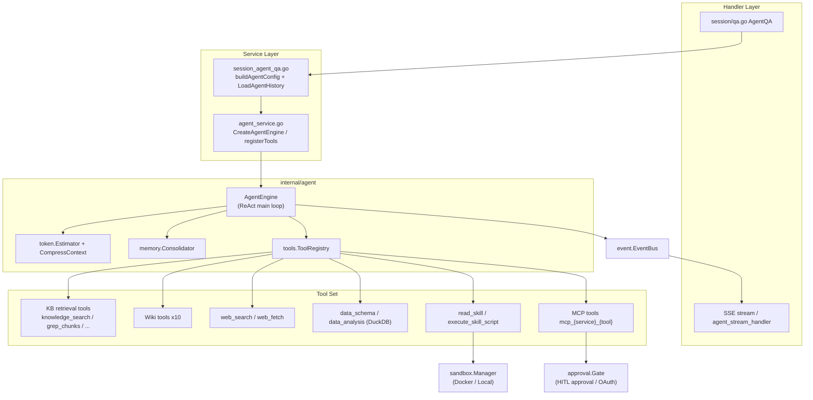
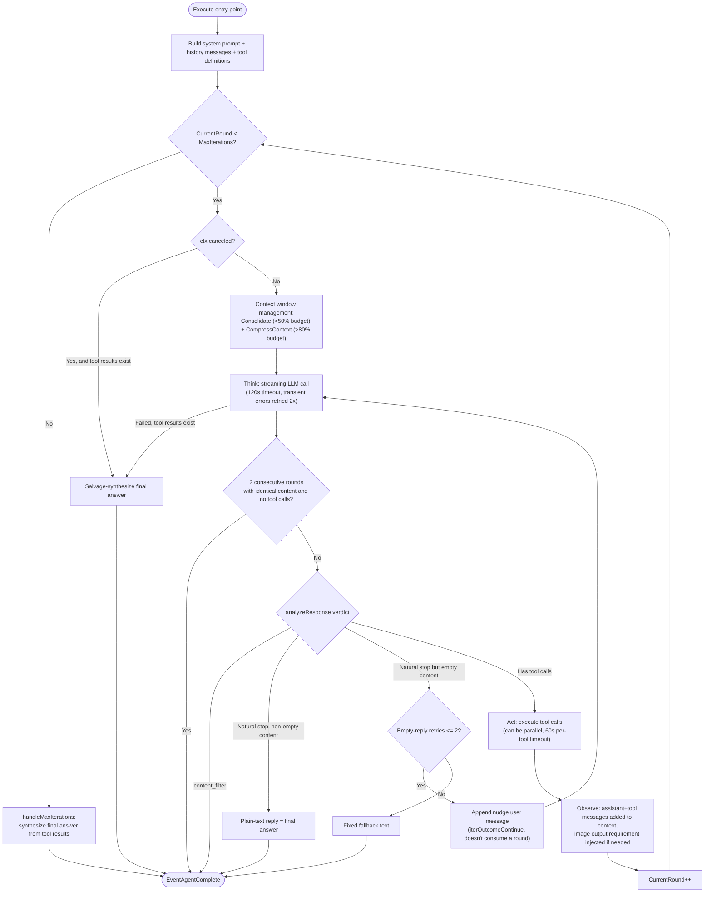
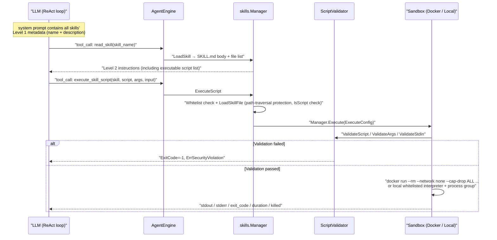

# Agent Engine

A regular Q&A flow is "retrieve once, answer once" — it falls short for questions that need multiple steps, such as "compare the payment terms in these three contracts, and also check the latest industry conventions." Agents solve exactly this class of problem: they decide on their own how many rounds of retrieval to run, whether to search the web, and whether to call external tools — thinking and acting iteratively until they've gathered enough grounding to answer.

WeKnora offers two modes, switchable at the top of the chat box:

| Mode | Best for | Cost |
| --- | --- | --- |
| Quick answer (quick-answer) | Factual questions where the answer is directly in the documents | Single retrieval round, fast and cheap |
| Smart reasoning (smart-reasoning) | Multi-step, cross-document questions, or ones needing web access or tool calls | Multiple model calls, slower and more expensive |

Besides the built-in Agents, you can create your own on the "Agents" page: choose a mode and model, scope the available knowledge bases, toggle web search, attach MCP tools and skills, and write a dedicated system prompt. A custom Agent can be used in web chat, or bound to an IM channel or a web widget to serve external users.

<Screenshot
  src="/screenshots/agent-editor.png"
  caption="Custom Agent configuration: mode, model, knowledge scope, and tools"
  hint="Shows the Agent editor dialog, including mode selection, model selection, knowledge base scope, the web search toggle, and MCP tool checkboxes." />

<Screenshot
  src="/screenshots/agent-chat.png"
  caption="Agent conversation: reasoning process and tool-call timeline"
  hint="Shows one round of an Agent's response, including expanded thinking steps, tool-call cards, and citations in the final answer." />

The sections below cover, in order: the overall architecture of the Agent engine, the ReAct loop, all built-in tools, memory and context compression, the skills system and sandbox, tool approval, custom/built-in Agent configuration, and how the Agent mode relates to the regular RAG Q&A mode.

## 1. Overview and Architecture

### 1.1 Core Components

| Component | Source location | Responsibility |
| --- | --- | --- |
| `AgentEngine` | `internal/agent/engine.go` | Drives the main ReAct loop; holds config, the tool registry, the chat model, the event bus, etc. |
| `ToolRegistry` | `internal/agent/tools/registry.go` | Tool registration, lookup, parameter validation, execution, output truncation, resource cleanup |
| Built-in tool set | `internal/agent/tools/*.go` | 24 built-in tools + dynamically registered MCP tools |
| Token estimation and compression | `internal/agent/token/` | `Estimator` (BPE-based estimation) and `CompressContext` (sliding-window trimming) |
| Memory consolidation | `internal/agent/memory/consolidator.go` | LLM-driven history summarization (Memory Consolidation) |
| Skills system | `internal/agent/skills/` | Discovery, loading, and script execution for SKILL.md (Progressive Disclosure) |
| Execution sandbox | `internal/sandbox/` | Docker / Local isolated execution and security validation for skill scripts |
| Tool approval | `internal/agent/approval/gate.go` | Human-in-the-loop (HITL) approval for dangerous MCP tools and in-session OAuth authorization |
| Agent service layer | `internal/application/service/agent_service.go` | Assembles the engine: registers tools, resolves KB metadata, initializes skills/sandbox/VLM |
| Session Q&A entry point | `internal/application/service/session_agent_qa.go` | Builds a runtime `AgentConfig` from a `CustomAgent` and executes it |
| History reconstruction | `internal/application/service/agent_history.go` | Rebuilds multi-turn LLM context from the DB (`LoadAgentHistory`) |

The `AgentEngine` struct definition (`internal/agent/engine.go`):

```go
type AgentEngine struct {
	config               *types.AgentConfig
	toolRegistry         *agenttools.ToolRegistry
	chatModel            chat.Chat
	eventBus             *event.EventBus
	knowledgeBasesInfo   []*KnowledgeBaseInfo      // Detailed knowledge base information for prompt
	selectedDocs         []*SelectedDocumentInfo   // User-selected documents (via @ mention)
	pinnedMCPServices    []*PinnedMCPServiceInfo   // User @mentioned MCP services for this turn
	pinnedSkills         []*PinnedSkillInfo        // User @mentioned skills for this turn
	sessionID            string
	systemPromptTemplate string
	skillsManager        *skills.Manager           // Skills manager for Progressive Disclosure (optional)
	appConfig            *appconfig.Config
	imageDescriber       ImageDescriberFunc        // VLM function for describing images in tool results
	tokenEstimator       *agenttoken.Estimator     // Token estimator for context window management
	memoryConsolidator   *agentmemory.Consolidator // Memory consolidator for LLM-powered summarization
	lastUsage            types.TokenUsage          // Token usage from the most recent LLM call
	lastSentMsgCount     int
	resourceRefs         *llmresource.Registry
	sourceRefs           *llmreference.Registry
}
```

A few key design points:

1. **The engine is stateless across turns.** The comments in the engine source explicitly state: conversation history is rebuilt from the DB each turn by the caller via `service.LoadAgentHistory`, and passed into `Execute` as `llmContext`; the engine itself keeps no cache, system-prompt storage, or cross-turn buffer.
2. **Event-driven output.** The engine never writes SSE directly. All output (thoughts, tool calls, tool results, the final answer, completion events) is emitted through the `event.EventBus`, and subscribers in the Handler layer convert it into an SSE stream and persist it. Relevant event types include `EventAgentThought`, `EventAgentFinalAnswer`, `EventAgentToolCall`, `EventAgentToolResult`, `EventAgentTool`, `EventAgentComplete`, and `EventError`.
3. **Reference/resource aliasing.** `resourceRefs` (`llmresource.Registry`) and `sourceRefs` (`llmreference.Registry`) encode messages before every LLM call, replacing persistent IDs (chunk/document/web UUIDs) with short aliases (`cN`/`dN`/`bN`/`wN`, `res://NNNN`), then decode them again on the way out during streaming. This way the model never sees a real UUID. `think.go` specifically notes the encoding order: `resourceRefs` must be encoded before `sourceRefs`, otherwise document UUIDs embedded in wiki summary page slugs would be mistakenly replaced by citation compression with aliases like `d1`, creating dead links.
4. **Observability.** Each execution opens a Langfuse span hierarchy: `agent.execute` → `agent.round.N` → `agent.tool.<name>`, capturing the round number, token usage, and a preview of tool output (truncated to 4000 runes), among other things. SQL parameters for `database_query` are redacted in both Langfuse and the UI hint (`toolHintSensitiveArgs`).

### 1.2 Component Relationship Diagram



### 1.3 Building the System Prompt

`BuildSystemPromptWithOptions` in `internal/agent/prompts.go` selects a template by the following priority:

1. The Agent has a custom system prompt configured (`AgentConfig.UseCustomSystemPrompt` or a non-empty `SystemPrompt`) → use it directly;
2. No knowledge bases are bound at all → `GetPureAgentSystemPrompt` (the template with mode `pure` in `config/prompt_templates/agent_system_prompt.yaml`);
3. Otherwise → `GetProgressiveRAGSystemPrompt` (the template with mode `rag`).

Placeholders supported by the template (`renderPromptPlaceholdersWithStatus`):

| Placeholder | Expands to |
| --- | --- |
| `{{knowledge_bases}}` | Legacy placeholder; now expands to a line pointing to `<bound_knowledge_bases>` inside `<runtime_context>` (KB details have moved into the user message) |
| `{{web_search_status}}` | `Enabled` / `Disabled` |
| `{{current_time}}` | Current time in RFC3339 |
| `{{language}}` | The user's language name (e.g. "Chinese (Simplified)") |
| `{{skills}}` | Cleared; skill metadata is appended separately by `formatSkillsMetadata` |

When skills are enabled, `formatSkillsMetadata` appends an "Available Skills" section at the end of the system prompt (Level 1 metadata plus a mandatory Skill Matching Protocol), and explains how to use the `read_skill` / `execute_skill_script` tools.

**Runtime context (`runtime_context`)**: unlike the system prompt, the full details of bound KBs (capabilities, recent documents/FAQ lists), @-mentioned pinned documents, the current time, and the session ID are injected as an XML block `<runtime_context scope="this_turn">` into the **current turn's user message** (`buildRuntimeContextBlock` in `internal/agent/observe.go`), and are **not persisted** to history — this avoids a stale scope contaminating subsequent turns. The block also always carries two fixed instructions:

- `<communication_instruction>`: forbids internal tool names and internal IDs from appearing in the answer/thoughts (it must say "keyword search" rather than `grep_chunks`, etc.);
- `<answer_instruction>`: once there's enough information, write out the complete answer directly in plain text and stop (don't issue further tool calls) — this is the Agent's termination protocol.

When the user @-mentions an MCP service or skill, `buildMustUseBlock` additionally injects a `<must_use>` block, forcing the model to use the corresponding prefixed MCP tool or to `read_skill` first.

## 2. The ReAct Loop, Phase by Phase

### 2.1 Entry Point: Execute

`AgentEngine.Execute` (`internal/agent/engine.go`) flow:

1. `defer e.toolRegistry.Cleanup(ctx)` — at the end of execution, clean up any tool implementing `types.Cleanable` (e.g. `data_analysis` drops the DuckDB tables it created for this session);
2. Opens a Langfuse `agent.execute` span;
3. Initializes `types.AgentState` (`RoundSteps`, `KnowledgeRefs`, `IsComplete=false`, `CurrentRound=0`);
4. `buildSystemPrompt` + `buildMessagesWithLLMContext` (system + history + current user message, with image URLs attached);
5. `buildToolsForLLM` converts the tools in the registry into function-calling definitions;
6. Enters `executeLoop`.

### 2.2 Main Loop: executeLoop and runReActIteration

```go
for state.CurrentRound < e.config.MaxIterations {
    // ctx cancellation check → salvage-synthesize a final answer if tool results already exist
    outcome, iterErr := e.runReActIteration(...)
    switch outcome {
    case iterOutcomeContinue: continue loop   // retry on empty reply, doesn't consume a round
    case iterOutcomeBreak:    break loop      // terminate (natural stop/stuck/canceled/content filter)
    case iterOutcomeNext:     state.CurrentRound++
    }
}
if !state.IsComplete && ctx.Err() == nil {
    e.handleMaxIterations(ctx, query, state, sessionID) // fallback: synthesize a final answer
}
```

`executeLoop` uses `defer emitCompletion()` to guarantee that **exactly one `EventAgentComplete` is emitted on every exit path** (using `context.WithoutCancel` so the event still reaches the client after the user clicks "stop"). This event carries `state.RoundSteps`, which the stream handler writes into the assistant message's `AgentSteps` field for persistence.

Each `runReActIteration` internally runs through four phases:

**① Think**: first performs context-window management (see Section 4), then `callLLMWithRetry` (`internal/agent/think.go`):

- `agenttools.SanitizeMessages` fixes issues like consecutive same-role messages or orphaned tool results;
- Streams the LLM call (`streamThinkingToEventBus`); a single call times out after `defaultLLMCallTimeout = 120s` (overridable via `AgentConfig.LLMCallTimeout`);
- Transient errors (429/5xx/timeout/overloaded, etc., see `transientErrorMarkers`) are retried up to `maxLLMRetries = 2` times, backing off 1s then 2s;
- If retries still fail but tool results already exist, it **gracefully degrades**: `streamFinalAnswerToEventBus` synthesizes a final answer from the existing tool results, and `state.IsComplete = true`.

During streaming: the `reasoning_content` channel (DeepSeek, etc.) and embedded `<think>` blocks (split out by `ThinkStreamSplitter`) are both routed to the "thinking" area (`EventAgentThought`); regular content is optimistically streamed straight to the final-answer area (`EventAgentFinalAnswer`) — if this round subsequently issues a tool call, that text is treated by the UI as a preamble and moved into the step tree, while still being retained as that round's `Thought`.

**② Analyze**: `analyzeResponse` (`internal/agent/observe.go`) checks the stopping conditions:

- `finish_reason == "content_filter"` with no tool calls → terminate; the answer is the filtered content or a fixed apology message;
- Natural stop (`isNaturalStopFinishReason`: `stop` / `end_turn` / `stop_sequence`) with no tool calls → **the Agent ends**, and the plain-text reply is the final answer (**there is no dedicated final_answer tool**; any `final_answer` tool call left over in legacy history data is filtered out on replay by `filterNonTerminalToolCalls`);
- Natural stop but empty content → appends a nudge user message, `"Please provide your complete answer now as plain text."`, and retries, up to `maxEmptyResponseRetries = 2` times (returns `iterOutcomeContinue`, doesn't consume a round); once retries are exhausted, terminates with a fixed fallback message.

There's also a **stuck-detection** check before Analyze: if `maxRepeatedResponseRounds = 2` consecutive rounds return exactly the same content with no tool calls (usually caused by an unhandled finish reason), it forcibly terminates and uses that content as the final answer.

**③ Act**: `executeToolCalls` (`internal/agent/act.go`) executes all of this round's tool calls:

- When `AgentConfig.ParallelToolCalls == true` and there are ≥ 2 calls, they run **in parallel** via `errgroup` (best-effort — a single failure doesn't cancel its siblings), with results filled back in original order;
- Each call first goes through `NormalizeToolCallID`, then has its JSON arguments parsed — a parse failure is first repaired via `RepairJSON` and retried; if it still fails, an error result with a hint is returned (`"[Analyze the error above and try a different approach.]"`), letting the model try a different approach instead of failing the whole round;
- A single tool execution times out after `defaultToolExecTimeout = 60s`; `ToolExecContext` additionally carries an `ApprovalCtx` without that timeout, for legitimate long waits like MCP human approval/OAuth;
- Emits `EventAgentToolCall` (with a localized display-name hint, e.g. `Search web("...")`), `EventAgentToolResult`, and `EventAgentTool` events.

**④ Observe**: `appendToolResults` (`internal/agent/observe.go`) appends this round to the message array per the OpenAI protocol: one assistant message carrying `tool_calls`, plus one `role:"tool"` message per result (content aliased via `sourceRefs.ModelOutput`). If any successful tool result this round contains a Markdown image, a `## Retrieved Image Output Requirement` note is also appended to the system message (`internal/agent/image_requirement.go`), forcing the final answer to carry the relevant images verbatim. `state.CurrentRound++` then advances to the next round.

### 2.3 Summary of Termination Conditions and Max Iterations

| Termination path | Trigger condition | Source of final answer |
| --- | --- | --- |
| Natural stop | finish_reason ∈ {stop, end_turn, stop_sequence}, no tool calls, non-empty content | This round's plain-text reply |
| Empty-reply exhaustion | Natural stop but empty content; nudge retried 2 times and still empty | Fixed fallback text |
| Content filter | finish_reason == content_filter, no tool calls | Filtered content or safety notice |
| Stuck detection | 2 consecutive rounds with identical content and no tool calls | The repeated content itself |
| User cancel / timeout | ctx.Done(); salvage-synthesized if tool results already exist | Synthesized answer or partial steps retained |
| Unrecoverable LLM failure | Retries exhausted; degrades to a synthesized answer if tool results exist, otherwise errors | Synthesized answer / error event |
| Max iterations reached | `CurrentRound == MaxIterations` | `handleMaxIterations` → synthesized via `streamFinalAnswerToEventBus` |

Multiple layers of default max-iteration values:

- Engine-level default `DefaultAgentMaxIterations = 20` (`internal/agent/const.go`);
- Service layer `ValidateConfig`: falls back to 5 when `<= 0`, hard cap `MAX_ITERATIONS = 100` (`internal/application/service/agent_service.go`);
- `CustomAgent.EnsureDefaults`: defaults to 10 when unconfigured (`internal/types/custom_agent.go`);
- Built-in Agents: Smart Reasoning 50, Data Analyst 30, Wiki Q&A/Revision 30 (`config/builtin_agents.yaml`).

Once the cap is reached, `handleMaxIterations` feeds all tool results as a user message into the LLM via a dedicated synthesis prompt (`internal/agent/finalize.go`) to generate the complete answer (thinking is disabled during synthesis); if the retrieved results contain Markdown images, the image output requirement is appended as well.

### 2.4 ReAct Loop Flow Diagram



## 3. Complete Reference of Built-in Tools

### 3.1 Tool Summary Table

Tool name constants are defined in `internal/agent/tools/definitions.go`. The table below covers every built-in tool (the parameter column only lists schema fields; `*` marks required):

| Tool name | Key parameters | Behavior / return value |
| --- | --- | --- |
| `thinking` | `thought`\*, `next_thought_needed`\*, `thought_number`\*, `total_thoughts`\*, `is_revision`, `revises_thought`, `branch_from_thought`, `branch_id`, `needs_more_thoughts` | Sequential Thinking: records/revises/branches thinking steps; returns thinking progress (including `incomplete_steps`); notes that tool names and the final answer must not appear in the thinking itself |
| `todo_write` | `task`, `steps[]`\* (`id`/`description`/`status`: pending/in_progress/completed) | Creates/updates a plan for retrieval-type tasks only (summarization is left to `thinking`); returns the formatted plan with `display_type: "plan"` |
| `knowledge_search` | `queries[]`\* (1–5 semantic questions), `knowledge_base_ids[]` | Semantic/vector retrieval, with optional rerank; defaults topK=5, vector threshold 0.6, keyword threshold 0.5; the `minScore` parameter can still be passed (defaulting to 0.3) but **post-filtering is now skipped** — since `HybridSearch` switched to RRF fusion, scores now fall in the [0, ~0.033] range, so the old [0,1] threshold no longer applies; threshold filtering is now done by each engine before RRF, and the rerank stage has its own `rerankThreshold()` (preferring the global config). Results carry short `cN`/`dN` IDs; chunks already seen in this session are deduplicated/compressed |
| `grep_chunks` | `query`\* (single POSIX regex, supports `\|` alternation) | Case-insensitive regex matching directly in the DB (PostgreSQL `~*` / MySQL `REGEXP`); capped at 30 results, MMR (λ=0.7) de-redundancy applied above 10; returns `<match>` fragments and a per-document aggregated summary (up to 20 lines); already-seen chunks are marked `already_seen` |
| `list_knowledge_chunks` | `faq_id` / `chunk_id` / `knowledge_id` (pick one), `limit` (default 20, cap 100), `offset` | Reads a single FAQ/chunk, or paginates through all chunks of a document; validates the KB is within searchTargets and the @mention scope |
| `query_knowledge_graph` | `knowledge_base_ids[]`\* (1–10 `bN`s), `query`\* | Concurrently queries each KB's knowledge graph for entities and relations; a KB with no configured graph degrades to a normal-retrieval result |
| `get_document_info` | `knowledge_ids[]` (`dN`), `faq_ids[]` (`cN`) (at least one) | Concurrently returns bulk document metadata (title, type, size, parse_status, chunk count) or standard FAQ questions/answers |
| `database_query` | SQL (SELECT-only) | Read-only queries against a whitelist of tables (`knowledge_bases`/`knowledges`/`chunks`), auto-injecting a tenant_id filter and `deleted_at IS NULL`; SQL parameters are redacted in the UI/Langfuse |
| `data_schema` | `knowledge_id`\* (`dN`) | Reads a CSV/Excel file's `table_summary` + `table_column` typed chunks, returning table name, column info, and row count |
| `data_analysis` | `knowledge_id`\*, `sql`\* | Loads CSV/Excel into DuckDB and runs SQL; multi-sheet Excel is merged into a single table exposing a `__sheet_name` column; auto-corrects case/whitespace differences in column names; drops the tables it created on session Cleanup |
| `web_search` | `query`\* | Web search; the description enforces a "KB First" rule (must run grep_chunks + knowledge_search first); results are RAG-compressed, cached into a session-scoped temporary knowledge base, and returned as short `wN` page IDs |
| `web_fetch` | `items[]`\* (each item is `url`=`wN`, `prompt`) | Concurrently fetches web pages (SSRF-safe client + DNS pinning, rendering via chromedp when needed), extracts the main content, then summarizes it per the prompt using a small model; 60s timeout. Returns per-URL `success`/`failed`/`skipped` status with retryable error codes; partial failures don't affect other pages |
| `read_skill` | `skill_name`\*, `file_path` | Reads the full SKILL.md text (Level 2) or a specific file within the skill's directory (Level 3), and lists executable scripts in the directory |
| `execute_skill_script` | `skill_name`\*, `script_path`\*, `args[]`, `input` (stdin) | Executes a skill script in the sandbox, returning stdout/stderr/exit code/duration/killed |
| `wiki_search` | `queries[]`\* (regex), `limit` (default 10), `knowledge_base_id` | POSIX regex search over wiki pages (title/content/slug/summary), returning pages tagged with `bN` and their summaries; already-seen slugs deduplicated |
| `wiki_read_page` | `slugs[]`\*, `knowledge_base_id` | Reads a wiki page's full text, metadata, and inbound/outbound links by slug (linked pages include a summary, omitted if already seen); an `index` slug returns a table-of-contents overview grouped by type (top 20 per type) |
| `wiki_read_source_doc` | `knowledge_id`\* (`dN`), `query` (regex), `start_chunk_index`, `end_chunk_index` | Deep-reads a wiki page's source document: regex filtering, or a continuous chunk-index range; returns the start of the document if neither is provided |
| `wiki_write_page` | `slug`\*, `title`\*, `summary`\*, `content`\*, `page_type`\*, `aliases[]`, `source_refs[]` | Creates a new wiki page or fully overwrites an existing one; normalizes and validates the slug before writing; handles outbound links automatically |
| `wiki_replace_text` | `slug`\*, `old_text`\*, `new_text`\*, `source_refs[]` | Precise text replacement, suited to small revisions |
| `wiki_rename_page` | `slug`\*, `new_slug`\* | Renames a slug and cascades the update to all pages that link to it |
| `wiki_delete_page` | `slug`\* | Deletes a page and automatically cleans up inbound links from other pages to prevent dead links |
| `wiki_flag_issue` | `slug`\*, `issue_type`\* (mixed_entities/contradictory_facts/out_of_date/other), `description`\*, `suspected_knowledge_ids[]` | Flags a page for factual errors, entity confusion, etc., recording an issue for manual or automated maintenance |
| `wiki_read_issue` | `issue_id` / `slug` | Views the detail of a specific issue, or lists the pending issues for a page |
| `wiki_update_issue` | `issue_id`\*, `status`\* (resolved/ignored/pending) | Updates an issue's status |
| `mcp_{service}_{tool}` (dynamic) | Determined by the MCP service's InputSchema | Wraps an external MCP tool; description is prefixed with `[MCP Service: X (external)]` to flag it as an untrusted source; can be gated behind human approval and in-session OAuth |

The default tool whitelist `DefaultAllowedTools()` (the fallback for legacy Agents with no `allowed_tools` configured): `thinking`, `todo_write`, `knowledge_search`, `grep_chunks`, `list_knowledge_chunks`, `query_knowledge_graph`, `get_document_info`, `database_query`, `data_analysis`, `data_schema`.

### 3.2 The Tool Registry (ToolRegistry)

`internal/agent/tools/registry.go`:

- **Registration**: `RegisterTool` follows a **first-wins** policy — a later registration under the same name is rejected, preventing an MCP service from hijacking a built-in tool via a name collision (corresponds to security advisory GHSA-67q9-58vj-32qx);
- **Definition export**: `GetFunctionDefinitions` sorts by tool name, ensuring the tools payload sent to the LLM is byte-identical across requests, so it hits provider prompt caches that rely on prefix matching (e.g. Qwen's explicit cache);
- **Execution pipeline**: `ExecuteTool` = `CastParams` (converts common LLM type slips like `"true"` to `true`) → `ValidateParams` (pre-validates against the JSON Schema, saving a wasted execution + LLM round trip) → `tool.Execute` → output truncation;
- **Output truncation**: `TruncateToolOutput` (`truncate.go`) defaults to `DefaultMaxToolOutput = 16000` **runes** (overridable via `AgentConfig.MaxToolOutputChars`); over the limit, it keeps the first 70% and last 30% with a truncation marker in between, preventing a large result from polluting the context;
- **Error hints**: failed results always get `"[Analyze the error above and try a different approach.]"` appended, nudging the LLM to change strategy;
- **Cleanup**: `Cleanup` iterates over tools implementing `types.Cleanable` and releases their resources.

### 3.3 Capability Mechanism and Config-driven Enable/Disable

`internal/agent/tools/capabilities.go` is the Go mirror of the frontend's `frontend/src/utils/tool-capabilities.ts`, declaring each tool's KB capability requirements:

```go
var ToolCapabilityRequirements = map[string]ToolRequirement{
	"thinking":   {},
	"todo_write": {},
	"knowledge_search":      {AnyOf: []KBCapability{CapVector, CapKeyword}, ConsumesFiles: true},
	"grep_chunks":           {AnyOf: []KBCapability{CapVector, CapKeyword}, ConsumesFiles: true},
	// ...
	"wiki_search":          {AllOf: []KBCapability{CapWiki}},
	// ...
	"data_analysis": {AnyOf: []KBCapability{CapVector, CapKeyword}, ConsumesFiles: true},
}
```

The capability enum is `vector` / `keyword` / `wiki` / `graph` / `faq`. This drives:

- `DeriveKBFilterForAgent(agentMode, allowedTools)`: the selectable-KB filter predicate in the Agent editor / `@` menu; `quick-answer` mode implicitly requires `vector|keyword`;
- `KBSatisfiesToolRequirements`: the backend's last line of defense — even a client that bypasses the frontend can't hand an incompatible KB to a tool;
- `ToolsConsumeFiles`: decides whether the chat input box shows the `@file` list.

**Runtime enable/disable logic** (`registerTools` in `agent_service.go`) follows a "**filter only, never inject**" principle:

1. Starts from `config.AllowedTools` (the user-editable whitelist; presets only pre-fill the initial value); falls back to `DefaultAllowedTools()` if empty;
2. If this turn has **no knowledge-retrieval scope at all** (Pure Agent mode), all KB/Wiki/data tools are filtered out; if web search is also off, `todo_write` is dropped too;
3. When `WebSearchEnabled`, `web_search` + `web_fetch` are auto-appended;
4. **Hard safety net**: scans the real capabilities of each KB in `SearchTargets` — no wiki KB means all wiki tools are dropped; no vector/keyword KB means all RAG tools are dropped (guarding against stale configuration, e.g. wiki tools were checked earlier and then the KB was swapped to a non-wiki one);
5. After deduplication, tools are instantiated and registered one by one; MCP tools are registered separately per `MCPSelectionMode` (all/selected/none); skill tools (`read_skill`, `execute_skill_script`) are registered when the skills manager initializes, and `execute_skill_script` is only registered when the sandbox isn't disabled.

## 4. Memory and Context Compression

### 4.1 Token Budget and Estimator

- Context budget: `AgentConfig.MaxContextTokens`, falling back to `types.DefaultMaxContextTokens = 200000` when `buildAgentConfig` leaves it unset;
- `token.Estimator` (`internal/agent/token/estimator.go`) estimates using tiktoken's **cl100k_base** encoding, with constants `perMessageOverhead = 3` and `perConversationTail = 3`; on an encoding failure it falls back to an approximation of `len(s)/4`;
- **Authoritative values take priority**: the true token count is whatever the model API's `Usage` reports. The engine's `estimateCurrentTokens` uses the previous round's reported `lastUsage.TotalTokens` as a baseline, and only does an incremental BPE estimate for new messages (the assistant reply + tool results); a full estimate is only done on the first round, when no Usage exists yet.

### 4.2 Two-Tier Compression Strategy

`manageContextWindow` (`internal/agent/observe.go`) runs before every Think phase:

**Tier 1: LLM memory consolidation (`memory.Consolidator`)** — triggered when the estimated token count exceeds `MaxContextTokens × 0.5` (`DefaultConsolidationThreshold = 0.5`):

- Preserved: the system prompt (first message), the **current turn** (the last user message and everything after it), plus recent history reclaimed from the tail within a token budget (`findKeepBoundary` targets `targetTokens = maxTokens × 0.5 × 0.6`, reserving 500 tokens for the summary, and **when reclaiming, an assistant message with tool_calls and its tool results are always treated as one indivisible group**);
- The remaining, older history is summarized by the LLM (temperature 0.3, `MaxTokens: 2000`, 60s timeout per call, up to `maxConsolidationAttempts = 3` attempts); the summary must preserve key facts, tool results, user intent, and error-handling steps, targeting under 30% of the original length;
- The summary is inserted as a system message: `[Memory Summary - N earlier messages consolidated]`;
- If the LLM fails all three attempts, it degrades to `rawArchive` (a truncated plain-text archive) — it never silently drops information.

**Tier 2: sliding-window trimming (`token.CompressContext`)** — runs regardless of whether consolidation happened, whenever tokens exceed `MaxContextTokens × 0.8` (`DefaultContextThresholdRatio = 0.8`):

- Likewise preserves the system message and the tail of the current turn;
- The middle history is grouped by `groupToolMessages` (an assistant message with tool_calls plus its following tool results form one group), and groups are discarded whole starting from the **oldest group**, until the freed tokens reach `currentTokens - threshold`.

### 4.3 Conversation History (agent_history)

Cross-turn history is rebuilt every round from the messages table by `LoadAgentHistory` (`internal/application/service/agent_history.go`) — the DB is the sole source of truth, with no Redis/in-memory cache:

- Fetches `HistoryTurns × 4` (minimum 50) raw messages, pairs user/assistant by `RequestID`, keeps only complete rounds where the assistant is finished (`IsCompleted`), sorts by time, and takes the most recent `HistoryTurns` rounds;
- Each round is expanded into: the user message (including image captions and attachment prompts; **deliberately ignoring** the `RenderedContent` snapshot to avoid contaminating with an old protocol) → each `AgentStep` containing tool calls expanded into an assistant message (with tool_calls) plus its tool messages → a final, normalized final-answer assistant message at the end (with `<think>` blocks stripped);
- Tool messages in history are compressed via `CompactToolOutputForHistory` (`internal/agent/tools/persist.go`): large payloads carrying a `display_type` (e.g. `knowledge_chunks_list`'s chunks, `grep_results`'s chunk_results) are replaced with a one-line summary (e.g. `"Listed 20/87 chunks from X (content omitted from history)"`).

Once inside the engine, `buildMessagesWithLLMContext` also performs **historical KB result redaction** (`redactHistoryKBResults`): unless the Agent has `RetainRetrievalHistory` enabled, the results of KB-type tools in historical rounds (`knowledge_search`, `grep_chunks`, `list_knowledge_chunks`, `query_knowledge_graph`, `get_document_info`, `wiki_search`, `wiki_read_page`, `wiki_read_source_doc`) are all replaced with `"[Previous retrieval result omitted — knowledge base may have changed. Please perform a fresh search.]"`, forcing the model to run a fresh search against a KB that may have changed.

On the persistence side, `SanitizeAgentStepsForStorage` strips LLM-only large payloads from `AgentSteps` before writing to the DB / replaying via SSE, keeping only the compact summary.

## 5. The Skills System

### 5.1 Skill File Format

A skill is a directory whose core is `SKILL.md`, following Claude's **Progressive Disclosure** specification (`internal/agent/skills/skill.go`):

```markdown
---
name: pdf-processing
description: Extract text and tables from PDF files, fill forms, merge documents. Use when ...
---
# PDF Processing
(Body content is the Level 2 instructions...)
```

- **Level 1 (metadata)**: the `name` + `description` in the frontmatter, all injected into the system prompt at startup;
- **Level 2 (instructions)**: the body of SKILL.md, loaded on demand via `read_skill` once the model judges a match;
- **Level 3 (resources)**: other files in the directory (documents, scripts), used via `read_skill(file_path=...)` or `execute_skill_script`.

Validation rules (`Skill.Validate`): `name` ≤ 64 characters, Unicode letters/digits/hyphens only, the reserved words `anthropic`/`claude` are forbidden, XML tags are forbidden; `description` ≤ 1024 characters, XML tags forbidden. Scripts are recognized by extension (`.py`/`.sh`/`.bash`/`.js`/`.ts`/`.rb`/`.pl`/`.php`).

### 5.2 Storage Locations and Loading

| Location | Contents | Purpose |
| --- | --- | --- |
| `skills/preloaded/` | `citation-generator`, `data-processor` (with scripts like analyze.py), `doc-coauthoring`, `document-analyzer`, `openmaic-classroom` (interactive lesson generation) | Server-side preloaded skills that an Agent can select |
| `examples/skills/pdf-processing/` | SKILL.md + `scripts/analyze_form.py`, `scripts/extract_text.py` | A custom-skill example |
| `cli/skills/` | `weknora-shared`, `weknora-rag-search` (embedded into the CLI binary via `//go:embed`, extracted by `weknora skills install`) | Skills for external Agents to use the WeKnora CLI |

The resolution order for the preload directory (`getPreloadedSkillsDir`, `internal/application/service/skill_service.go`): the `WEKNORA_SKILLS_DIR` environment variable → the default directory next to the executable → the current working directory → the relative default path.

Loading chain: `skills.Loader.DiscoverSkills` scans each skill directory for subdirectories containing a `SKILL.md`, parsing and caching the frontmatter metadata; `Manager` handles the enabled toggle, `allowedSkills` whitelist filtering, `LoadSkill` (Level 2), and `ReadSkillFile`/`ListSkillFiles` (Level 3, with path-traversal protection: rejects `..` and absolute paths after Clean, and verifies the final absolute path is still inside the skill directory).

Enable/disable on the Agent side happens in `configureSkillsFromAgent` (`internal/application/service/session_agent_qa.go`):

- **Skills are entirely unavailable when the sandbox is off** (`WEKNORA_SANDBOX_MODE` empty or `disabled`);
- `SkillsSelectionMode`: `all` = all preloaded skills, `selected` = the `SelectedSkills` whitelist, `none`/empty = disabled;
- A user's `@skill` mention narrows this turn's whitelist to the mentioned set via `applyPerRequestSkillScope`, injected as `PinnedSkillInfo` into the `<must_use>` block ("Must call read_skill(...) before answering").

### 5.3 Relationship to the Sandbox (internal/sandbox)

`execute_skill_script` → `skills.Manager.ExecuteScript` → `sandbox.Manager.Execute`. The sandbox is configured via environment variables:

| Environment variable | Meaning | Default |
| --- | --- | --- |
| `WEKNORA_SANDBOX_MODE` | `docker` / `local` / `disabled` | `disabled` |
| `WEKNORA_SANDBOX_DOCKER_IMAGE` | Docker sandbox image | `wechatopenai/weknora-sandbox:latest` |
| `WEKNORA_SANDBOX_TIMEOUT` | Execution timeout (seconds) | 60 |

**Manager and validator** (`internal/sandbox/manager.go`, `validator.go`): before every execution, unless `SkipValidation` is set, the `ScriptValidator` runs four categories of static checks — any hit rejects execution with `ErrSecurityViolation`:

1. **Script content**: a dangerous-command blacklist (`rm -rf /`, `mkfs`, `dd if=/dev/zero`, etc.), dangerous pattern regexes, network-access signatures (`curl`/`wget`/`nc`/`requests.get`/`fetch(`/`axios`, etc.), and reverse-shell patterns;
2. **Arguments**: detection of shell operators (`&&`, `;`, `|`, redirection, newlines, etc.) and command substitution injection (`` `cmd` ``, `$(cmd)`);
3. **stdin**: detection of embedded shell commands;
4. The combined entry point `ValidateAll`.

**Docker sandbox** (`docker.go`, isolated via `docker run --rm`):

- `--user 1000:1000` non-root, `--cap-drop ALL`, `--security-opt no-new-privileges`, `--pids-limit 100`;
- `--network none` by default (unless `AllowNetwork` is set);
- Resource limits: memory defaults to `DefaultMemoryLimit = 256MB` (`--memory` + `--memory-swap` set to the same value to disable swap), CPU defaults to `DefaultCPULimit = 1.0` core;
- The skill directory is mounted read-only at `/workspace`; optionally a `--read-only` root filesystem + a 64MB noexec tmpfs;
- The interpreter is chosen by extension (`.py`→`python3`, etc.).

**Local sandbox** (`local.go` / `local_unix.go`, the fallback when Docker is unavailable): an interpreter whitelist (default `python`/`python3`/`node`/`bash` plus safe commands like `cat`/`grep`), the script must be an absolute path and can optionally be restricted to `AllowedPaths`, a minimized environment, and `Setpgid` to create a process group so the whole group can be `SIGKILL`ed on timeout.

At Manager initialization: `docker` mode first probes `docker version` — if available, it asynchronously pre-pulls the image; if unavailable and fallback is allowed, it degrades to local. `disabled` mode's `disabledSandbox` rejects any execution.

### 5.4 Skill Execution Sequence Diagram



## 6. The Tool Approval Mechanism (Human-in-the-Loop)

The approval code lives in `internal/agent/approval/gate.go` (issue #1173). Key points:

**Approval scope**: the approval gate (`approval.MCPApproval`) **only applies to MCP tools** — `MCPTool.Execute` (`internal/agent/tools/mcp_tool.go`) asks `gate.NeedsApproval(tenantID, serviceID, toolName)` before actually calling the MCP service; built-in tools never go through approval. Which MCP tools need approval is decided by the `Checker` (the `MCPToolApprovalService` in the DB, adapted via `approval.Adapter`) based on tenant + service + tool name.

**Fail-close by default**: when the `NeedsApproval` checker errors out, it **requires approval** by default (safer for a HITL feature); the environment variable `WEKNORA_AGENT_TOOL_APPROVAL_FAIL_OPEN=true` restores the old permissive behavior.

**Approval flow** (`RequestAndWait`):

1. Generates a `pendingID` (UUID) and registers a waiter in an in-memory map;
2. Emits `EventToolApprovalRequired` via the EventBus (carrying the service name, MCP tool name, argument JSON, timeout in seconds, tool_call_id, etc.), which pops an approval card in the frontend;
3. Blocks waiting on whichever comes first: the user's `Resolve`, a timeout (default **10 minutes**, configurable via `cfg.Agent.ToolApprovalTimeoutSeconds`), or cancellation of the request ctx; the outcome is always notified to the UI via `EventToolApprovalResolved`;
4. `Decision` supports `Approved`, `Reason`, and `ModifiedArgs` — the user can **modify the tool's arguments** while approving, and MCPTool re-parses and executes with the modified arguments;
5. Rejection/timeout/cancellation are all returned to the LLM as a tool failure result (rather than aborting the whole Agent run).

**Coordinating long waits with timeouts**: normal tool execution has a 60s timeout, but approval may take much longer. The engine passes a round-level ctx **without** the per-tool timeout into `ToolExecContext.ApprovalCtx` for the approval wait; once approved, MCPTool derives a brand-new execution timeout window from `ApprovalCtx`, avoiding a situation where the approval wait eats the whole budget and the call times out the instant it's approved.

**Cross-instance support**: a waiter lives in the memory of the instance that started the wait; once Redis is configured, if `Resolve` misses locally, it broadcasts via the Pub/Sub channel `weknora:mcp_approval:resolve` (optionally suffixed with `WEKNORA_REDIS_NAMESPACE` to isolate multiple deployments) to all replicas, and whichever instance holds the waiter delivers it, acking back through a per-pending reply channel with a nonce, so the HTTP layer can accurately distinguish `ok` / `not_found` / `tenant_mismatch` / `user_mismatch` / `already_resolved`. Without Redis it degrades to single-process semantics (requires sticky sessions).

**Authorization check**: `Resolve` verifies the tenant matches; if the waiter was registered with a `userID`, the caller must supply the same non-empty userID (an empty one counts as a mismatch, fail-closed), preventing a bystander from approving on behalf of the session's owner.

**In-session OAuth**: the same Gate also provides `RequestOAuthAndWait` — when the MCP transport layer returns an "authorization required" error (rather than checking the approval table), it emits `EventMCPOAuthRequired` so the user can complete OAuth right in the conversation; the wait cap comes from the Agent's configured `MCPAuthWaitTimeout` (`internal/agent/tools/mcp_oauth.go`), and the tool call is automatically retried after authorization succeeds.

## 7. Custom Agents

### 7.1 Modes and Type Presets

`CustomAgent` (`internal/types/custom_agent.go`) has two runtime modes (`Config.AgentMode`):

- `quick-answer`: the classic RAG pipeline (retrieve → assemble context → single-shot generation), which never enters the Agent engine;
- `smart-reasoning`: ReAct Agent mode; `IsAgentMode()` returns true and forces `MultiTurnEnabled = true`.

Under smart-reasoning you can also pick a **type preset** (`Config.AgentType`, defined in `config/agent_type_presets.yaml`, loaded via `internal/types/agent_type_preset.go`). Presets only **pre-fill the form** in the editor — the user can override anything:

| Preset ID | System prompt template | Temperature | Max iterations | Pre-filled tools | KB filter |
| --- | --- | --- | --- | --- | --- |
| `rag-qa` | `progressive_rag_agent` | 0.7 | 30 | knowledge_search, grep_chunks, list_knowledge_chunks, get_document_info | Derived from tools: any_of vector/keyword |
| `wiki-qa` | `wiki_researcher` | 0.7 | 30 | wiki_search, wiki_read_page, wiki_read_source_doc, wiki_flag_issue | Derived from tools: any_of wiki |
| `hybrid-rag-wiki` | `hybrid_rag_wiki_agent` | 0.7 | 40 | wiki_search, wiki_read_page, knowledge_search, grep_chunks, list_knowledge_chunks, get_document_info, wiki_flag_issue | any_of vector/keyword/wiki |
| `data-analysis` | `data_analyst` | 0.3 | 30 | data_schema, data_analysis; web search off; restricted to csv/xlsx file types | Explicit `none_of: [faq]` |
| `custom` | none | — | — | Nothing pre-filled | Unrestricted |

Note that `thinking` / `todo_write` are deliberately excluded from each preset's default tools (they carry a heavy token cost, so must be enabled manually when needed).

### 7.2 Configurable Options (CustomAgentConfig)

The main fields of `CustomAgentConfig` in `internal/types/custom_agent.go` (the `CreateAgent`/`UpdateAgent` handlers accept this struct directly):

| Category | Field | Description / default (EnsureDefaults) |
| --- | --- | --- |
| Basic | `agent_mode` | `quick-answer` / `smart-reasoning` |
| Basic | `agent_type` | Preset category under smart-reasoning; empty/unknown is treated as custom |
| Basic | `system_prompt` / `system_prompt_id` | Direct content or template ID (resolved at startup via `ResolveBuiltinAgentPromptRefs`, etc.) |
| Basic | `context_template` / `context_template_id` | The assembly template for retrieved snippets in normal mode |
| Model | `model_id`, `rerank_model_id`, `temperature`, `max_completion_tokens`, `thinking`, `citation_enabled` | temperature<0 → 0.7; max_completion_tokens defaults to 2048; thinking defaults to false if unset; citation defaults to true if unset |
| Agent | `max_iterations` | Defaults to 10 (service-layer cap 100) |
| Agent | `llm_call_timeout` | Seconds for a single LLM call; 0 uses the global default (120s) |
| Agent | `allowed_tools` | Tool whitelist; falls back to DefaultAllowedTools if empty |
| MCP | `mcp_selection_mode` (all/selected/none), `mcp_services`, `mcp_auth_wait_timeout` | OAuth wait in seconds; <=0 uses the Gate default |
| Skills | `skills_selection_mode` (all/selected/none), `selected_skills` | Forced unavailable when the sandbox is disabled |
| Knowledge base | `kb_selection_mode` (all/selected/none), `knowledge_bases`, `retrieve_kb_only_when_mentioned`, `retain_retrieval_history` | When retain=true, historical KB retrieval results are not redacted |
| Multimodal | `image_upload_enabled`, `vlm_model_id`, `audio_upload_enabled`, `asr_model_id`, `image_storage_provider` | VLM is also used to describe images returned by MCP tools |
| Files | `supported_file_types`, `chat_parser_engine_rules`, `attachment_image_understanding`, `attachment_ocr_max_pages`, `attachment_parse_wait_timeout_sec` | Data-analysis-type Agents commonly restrict to csv/xlsx |
| FAQ | `faq_priority_enabled`, `faq_direct_answer_threshold`, `faq_score_boost` | — |
| Web | `web_search_enabled`, `web_search_max_results`, `web_search_provider_id`, `web_fetch_enabled`, `web_fetch_top_n` | max_results defaults to 5 |
| Multi-turn | `multi_turn_enabled`, `history_turns` | history_turns defaults to 5; smart-reasoning forces multi_turn |
| Retrieval | `embedding_top_k` (10), `keyword_threshold` (0.3), `vector_threshold` (0.5), `rerank_top_k` (5), `rerank_threshold` | Defaults in parentheses |
| Advanced | `enable_query_expansion`, `enable_rewrite`, `rewrite_prompt_*`, `query_understand_model_id`, `fallback_strategy` (defaults to model), `fallback_response`, `fallback_prompt`, `intent_prompts`, `data_analysis_enabled` | Mainly affects the quick-answer pipeline |
| Suggestions | `question_suggestions` (starters / follow_ups) | starters default to 6 items in hybrid mode; follow_ups default to off, 3 items |

The handler layer (`internal/handler/custom_agent.go`) provides `CreateAgent`, `GetAgent`, `ListAgents`, `UpdateAgent`, `DeleteAgent`, `CopyAgent`, `GetPlaceholders` (returns the placeholder list from `types.PlaceholdersByField(PromptFieldAgentSystemPrompt)`), `GetAgentTypePresets` (the i18n'd preset list), and `GetSuggestedQuestions`. On create/update, `authorizeAgentKnowledgeScope` validates a restricted API key's KB scope: `kb_selection_mode: all` is a flat 403 for a KB-restricted key, `selected` is authorized entry by entry.

Runtime mapping: `buildAgentConfig` (`session_agent_qa.go`) converts `CustomAgentConfig` into the engine's `types.AgentConfig` (`internal/types/agent.go`), additionally layering in: web search requires both the Agent and the request to enable it (`customAgent.Config.WebSearchEnabled && req.WebSearchEnabled`); the web provider falls back to the tenant default; `SearchTargets` is unified from the KB/@document/@tag scope; `MaxContextTokens` falls back to 200000; per-turn narrowing of @Skill/@MCP pins (a shared Agent's @MCP mentions can only land within the Agent's preset set). Additionally, a rerank model is only required when `knowledge_search` is actually available (`agentRequiresRerankModel`).

### 7.3 Sharing Mechanism (agent_share)

`internal/application/service/agent_share.go`: an Agent can be shared with an **Organization**:

- Only the Agent's owning tenant can share it (`ErrNotAgentOwner`); the sharer's tenant must be an Editor+ member of the organization;
- Before sharing, the Agent's configuration is validated for completeness: it must have a `model_id`; if `knowledge_search` is among its tools (or its tool set is empty and falls back to the default set) and the KB scope isn't disabled, it must also have a `rerank_model_id`, otherwise `ErrAgentNotConfigured`;
- **Permission is forced to read-only**: `permission = types.OrgRoleViewer` (cross-tenant editing is out of scope for v1); re-sharing updates idempotently;
- The receiving tenant can disable a given shared Agent locally via `TenantDisabledSharedAgentRepository`;
- When chatting with a shared Agent (`session_agent_qa.go`), retrieval and model scope switch to the **Agent's owning tenant** (`resolveRetrievalTenantID`), so the sharer's KB becomes available to the user, while the user's own MCP @mentions are restricted to the Agent's preset set.

## 8. Built-in Agents (config/builtin_agents.yaml)

Built-in Agents are defined in `config/builtin_agents.yaml`; at startup, `types.LoadBuiltinAgentsConfig` loads it and rebuilds the `BuiltinAgentRegistry` (`internal/types/builtin_agent_config.go`), supporting multi-language names and descriptions for default/zh-CN/zh-TW/ja-JP/ko-KR; `system_prompt_id`/`context_template_id` are resolved into actual template content at startup via `ResolveBuiltinAgentPromptRefs`.

| ID | Name (zh-CN) | agent_mode / agent_type | Key configuration |
| --- | --- | --- | --- |
| `builtin-quick-answer` | Quick Answer | `quick-answer` | Templates `default_kb` + `default_context`; temperature 0.7; FAQ priority (direct-answer threshold 0.9, boost 1.2); query expansion + rewrite; web search on, 5 results; does not enter the Agent engine |
| `builtin-smart-reasoning` | Smart Reasoning | `smart-reasoning` / `rag-qa` | `max_iterations: 50`; tools: knowledge_search, grep_chunks, list_knowledge_chunks, query_knowledge_graph, get_document_info; web search on; 5 turns of multi-turn history |
| `builtin-data-analyst` | Data Analyst | `smart-reasoning` / `data-analysis` | Template `data_analyst`; temperature 0.3; `max_iterations: 30`; tools limited to data_schema + data_analysis; restricted to csv/xlsx; web search off; 10 turns of history |
| `builtin-wiki-researcher` | Wiki Q&A | `smart-reasoning` / `wiki-qa` | Template `wiki_researcher`; `max_iterations: 30`; tools: wiki_search, wiki_read_page, wiki_read_source_doc, wiki_flag_issue (read-only + issue-flagging); web search off |
| `builtin-wiki-fixer` | Wiki Revision | `smart-reasoning` / `custom` | Template `wiki_fixer`; `retain_retrieval_history: true` (revision needs to remember page content across turns); includes all 9 wiki write operations (wiki_write_page, wiki_replace_text, wiki_rename_page, wiki_delete_page, wiki_read_issue, wiki_update_issue, etc.); `kb_selection_mode: selected` |

Two additional notes (from `internal/types/custom_agent.go`):

- `builtin-wiki-fixer` **deliberately does not appear** in the user-visible Agent list (`builtinAgentIDsOrdered` excludes it) — it's an internal Agent invoked programmatically by the Wiki editor, though it's still reachable via `GetAgentByID`;
- `builtinAgentIDsOrdered` also still reserves ID constant slots for `builtin-deep-researcher`, `builtin-knowledge-graph-expert`, `builtin-document-assistant`, etc., but the current YAML doesn't define those entries — the registry defers to the YAML as the source of truth;
- Every entry in `builtin_agents.yaml` carries a `reflection_enabled` flag (`true` for the Data Analyst, `false` for the rest), but **the backend currently doesn't consume this field** — there's no corresponding struct field or reference anywhere under `internal/`; it only exists in the YAML and in the frontend type definitions. In other words, it has no effect on the Agent's actual behavior right now — seeing it set to `true` doesn't mean there's an extra reflection round happening.

Incidentally, the constants `WikiSummaryPrompt`, `WikiKnowledgeExtractPrompt`, `WikiTaxonomyPlanPrompt`, etc. in `internal/agent/prompts_wiki.go` belong to the **Wiki ingest pipeline** (LLM-generated wiki page/taxonomy planning at document ingestion time), complementing the wiki-type Agents' runtime tools: the former produces Wiki content, the latter consumes and maintains it.

## 9. The Relationship Between Agent Mode and Regular RAG Q&A Mode

### 9.1 Two Q&A Paths

The router layer (`internal/router/router.go`) registers two entry points:

```go
knowledgeChat.POST("/:session_id", handler.KnowledgeQA)  // /knowledge-chat/:session_id
agentChat.POST("/:session_id", handler.AgentQA)          // /agent-chat/:session_id
```

Both eventually converge on the unified execution flow `executeQA(reqCtx, mode, generateTitle)` in `internal/handler/session/qa.go`, where `mode` is one of:

```go
const (
	qaModeNormal qaMode = iota // KnowledgeQA pipeline (RAG / pure chat)
	qaModeAgent                // Agent engine with tool calling
)
```

### 9.2 Mode Decision Logic

The decision inside `Handler.AgentQA` (actual code logic):

1. Parses the request and resolves the `CustomAgent` corresponding to `agent_id` via `resolveAgent` (including permission checks for built-in and shared Agents);
2. **`CustomAgent.IsAgentMode()` takes priority over the `agent_enabled` field in the request** — that is, only `Config.AgentMode == "smart-reasoning"` goes through the Agent path; a `quick-answer`-type Agent is downgraded even if it's hit via `/agent-chat`;
3. If Agent mode applies but `customAgent == nil` (a typical scenario: the frontend's localStorage `selectedAgentId` was cleared but the toggle remained on), it returns early with a 400 `"agent_id is required when agent mode is enabled"`, avoiding an obscure error deep in the async flow;
4. If it applies → `executeQA(reqCtx, qaModeAgent, true)`; otherwise logs `"Agent mode disabled, delegating to normal mode"` and takes the `qaModeNormal` path.

The embed channel (`delegateEmbedChat` in `internal/handler/embed_channel.go`) works the same way: only `agentMode && ch.AgentID != types.BuiltinQuickAnswerID` forwards to `AgentQA`; otherwise it goes to `KnowledgeQA`.

### 9.3 Differences Between the Two Paths

| Dimension | Regular RAG (qaModeNormal) | Agent (qaModeAgent) |
| --- | --- | --- |
| Execution engine | The KnowledgeQA chat pipeline (intent recognition → rewrite → retrieval → rerank → assemble context → single generation) | `AgentEngine.Execute`'s multi-round ReAct loop |
| Retrieval approach | A fixed vector/keyword hybrid retrieval pipeline | The LLM autonomously picks tools (semantic/regex/graph/wiki/web/SQL...), possibly across multiple rounds |
| Service entry point | `sessionService.KnowledgeQA` | `sessionService.AgentQA` (**requires** `req.CustomAgent != nil`) |
| History | The pipeline's own multi-turn rewrite and history assembly | `LoadAgentHistory` rebuilds message-level assistant+tool history |
| Result persistence | A single answer | The answer + `AgentSteps` (the thought/tool-call tree), replayable via SSE |
| KB compatibility | Implicitly requires a vector or keyword index (`quickAnswerKBFilter`) | Derived from the capabilities of `allowed_tools` |

Before entering the engine, `sessionService.AgentQA` (`internal/application/service/session_agent_qa.go`) also handles: tenant switching for shared Agents, vision-model routing (passing images directly if the model supports vision, otherwise folding a VLM description into the query), merging referenced context/attachment content into the query, and initializing the rerank model as needed. Execution is asynchronous, with events streamed back to the Handler layer via the EventBus.

## 10. Suggested Questions (Starters and Follow-ups)

The chat box surfaces clickable questions in two places: **starters** shown when a session is still empty, and **follow-up suggestions** shown after each answer completes. This configuration belongs entirely to the Agent (`QuestionSuggestionConfig`, `internal/types/custom_agent.go`) — channel settings can only suppress display, not change the content strategy.

### Configuration Options

Both groups of settings are independently toggled; `mode` determines where the questions come from:

| mode | Source |
| --- | --- |
| `curated` | Only the hand-written `items` |
| `knowledge` | Pulled from knowledge base content |
| `generated` | Generated by the model |
| `hybrid` (default) | A mix of the above |

| Setting | Default | Description |
| --- | --- | --- |
| `starters.enabled` / `mode` / `items` / `count` | — / `hybrid` / empty / 6 | Starter questions |
| `follow_ups.enabled` / `mode` / `count` | — / `hybrid` / 3 | Follow-up suggestions |
| `follow_ups.model_id` | Empty (uses the session model) | The model used to generate follow-ups; a smaller model can be specified to save cost |
| `follow_ups.categories` | Empty | Restricts question type: `clarify` / `deepen` / `action` |
| `follow_ups.max_context_turns` | 2 | How many prior turns to look back at when generating |
| `follow_ups.additional_instruction` | Empty | Business constraints appended to the generation prompt |
| `follow_ups.suppress_on_fallback` | — | Suppresses suggestions when the answer used a fallback strategy |
| `follow_ups.suppress_when_answer_asks_question` | — | Suppresses suggestions when the answer itself asks the user a question (to avoid two questions competing) |
| `follow_ups.knowledge_fallback` | — | Falls back to KB-sourced questions if generation fails |
| `follow_ups.allow_regenerate` | — | Whether the user can manually request a new batch |

### Generation, Caching, and Analytics

- Results are stored in the `message_suggestion_sets` table, cached by `(assistant_message_id, placement, config_hash, locale)` — `config_hash` folds a digest of "the Agent configuration currently in effect" into the cache key, so a config change naturally produces a fresh batch instead of reading a stale cache; `locale` caches each language separately;
- States: `generating` → `ready`, plus `suppressed` (skipped per the suppression rules above) and `failed`; `lease_until` prevents multiple instances from generating the same batch redundantly;
- Endpoints: `GET /sessions/:id/messages/:message_id/suggestions` reads, `POST` on the same path triggers generation (idempotent), and `POST /sessions/:session_id/suggestion-events` reports analytics events;
- Tracked events: `impression` / `click` / `dismiss` / `regenerate`, stored in `message_suggestion_events`. The next user message sent after a click carries a `SuggestionAttribution` (`suggestion_set_id` + `question_id`), so analytics can distinguish "clicked a suggestion" from "typed the same question independently."

## 11. Key Constants Quick Reference

| Constant | Value | Location |
| --- | --- | --- |
| `DefaultAgentMaxIterations` | 20 | `internal/agent/const.go` |
| `MAX_ITERATIONS` (service-layer cap) | 100 | `internal/application/service/agent_service.go` |
| `defaultLLMCallTimeout` | 120s | `internal/agent/const.go` |
| `defaultToolExecTimeout` | 60s | `internal/agent/const.go` |
| `maxLLMRetries` | 2 | `internal/agent/const.go` |
| `maxEmptyResponseRetries` | 2 | `internal/agent/const.go` |
| `maxRepeatedResponseRounds` | 2 | `internal/agent/const.go` |
| `DefaultMaxToolOutput` | 16000 runes (70% head / 30% tail) | `internal/agent/tools/truncate.go` |
| `DefaultMaxContextTokens` | 200000 | `internal/types/agent.go` |
| `DefaultConsolidationThreshold` | 0.5 | `internal/agent/memory/consolidator.go` |
| `DefaultContextThresholdRatio` | 0.8 | `internal/agent/token/compress.go` |
| Default approval timeout | 10 minutes | `internal/agent/approval/gate.go` |
| Default sandbox limits | 60s / 256MB / 1 CPU / 100 pids | `internal/sandbox/sandbox.go`, `docker.go` |
| Skill naming limits | name ≤ 64, description ≤ 1024 | `internal/agent/skills/skill.go` |
