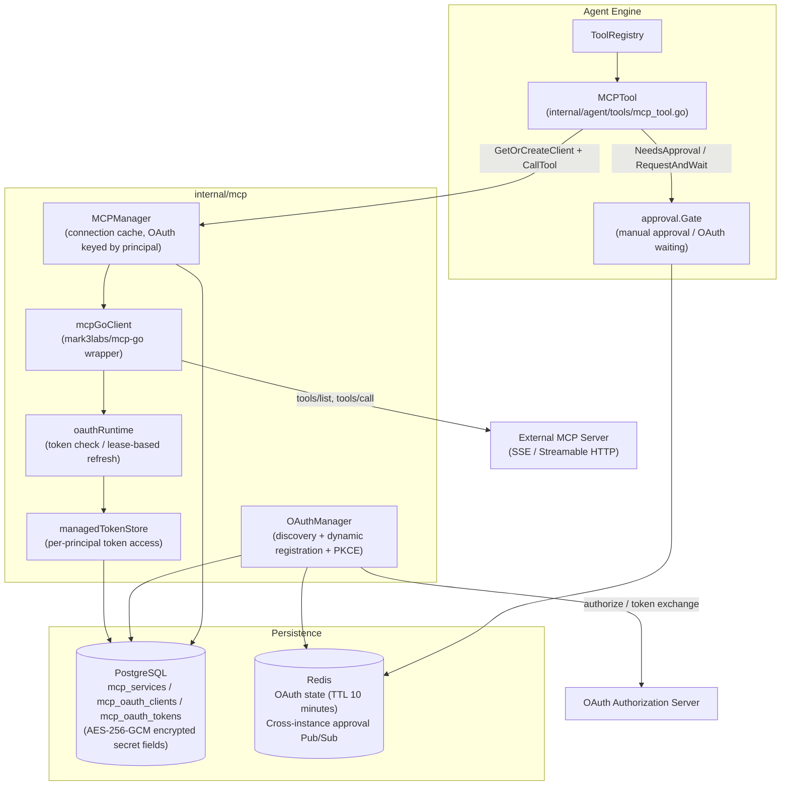
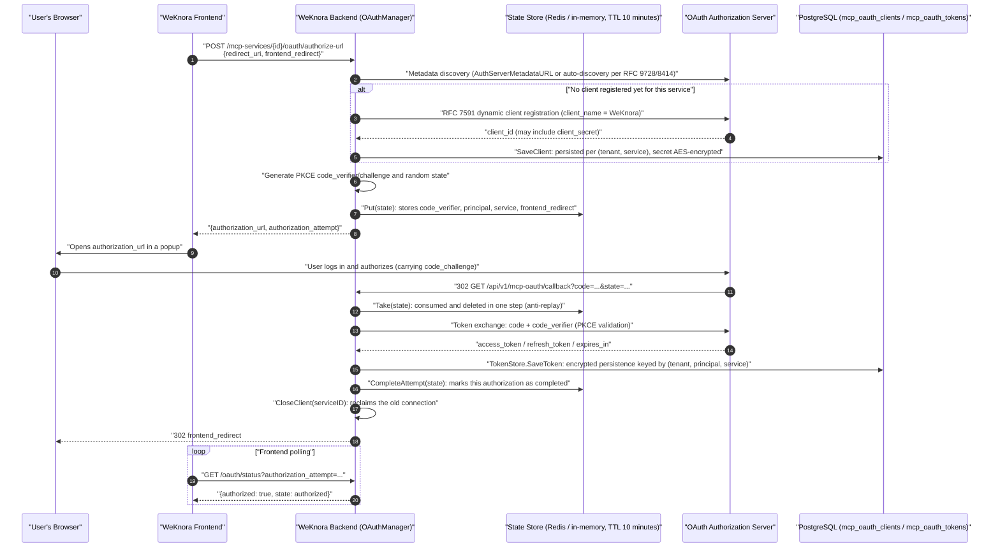
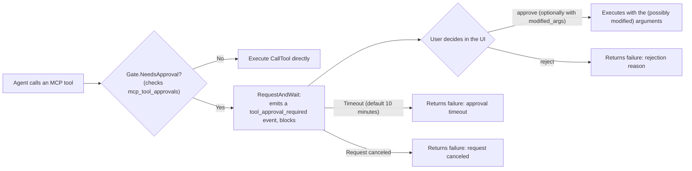
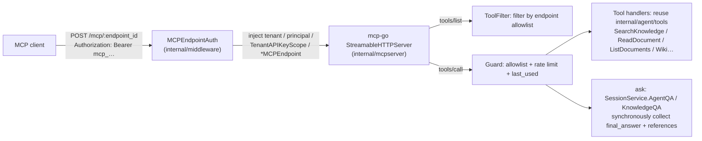

# MCP (Model Context Protocol) Integration

MCP connects agents with external tools. WeKnora can connect to external MCP services, and it also provides its own MCP Server for other clients to call:

1. **WeKnora as an MCP client**: In "Toolbox → MCP Services", connect to any external MCP server (SSE / Streamable HTTP); its tools are loaded on demand through a catalog for the Agent to call during conversations. Supports three authentication strategies — API Key / Bearer / OAuth 2.0 (including dynamic client registration and PKCE) — per-tool enable/disable and manual approval, and in-conversation OAuth authorization.
2. **WeKnora as an MCP Server**: In "Settings → Publish & Integrations → MCP Server", create one or more MCP endpoints for the current space. Each endpoint has its own token, knowledge base scope, and tool list, and MCP clients such as Claude Desktop, Cursor, Claude Code, and VS Code Copilot connect directly over Streamable HTTP, with no extra process to deploy. The Python service in the repository's `mcp-server/` directory is the old approach and has been marked deprecated.

Connecting external services extends the tools available to WeKnora agents; running the WeKnora MCP Server lets external clients use knowledge base retrieval, Q&A, and management capabilities.

A space Admin creates a service under "Toolbox → MCP Services" in the sidebar (the old "Settings → MCP Services" link redirects here automatically), fills in the connection, syncs the tools and writes the usage instructions, then selects the services an agent needs. When write or outbound operations need to be controlled, enable manual approval for the corresponding tools, and a confirmation card is shown before each call.

<Screenshot
  src="/screenshots/mcp-services.png"
  caption="MCP service configuration: connecting external tool services and the tool list"
  hint="Shows the MCP service list, a service's configuration form (URL, authentication method), and the tool list discovered after a connectivity test." />

The connection methods, authentication configuration, and tool scope are described below.

---

## Connecting External Tools

Creating a service takes two steps:

1. **Connection settings**: enter a name and the service URL, choose SSE or Streamable HTTP transport, and configure authentication (None / Custom Header, API Key / Token, OAuth 2.0) as well as timeout and retries. You can also use "Import from code" to paste a standard `mcpServers` JSON and fill in the form automatically; stdio configurations containing only `command` / `args` are not supported. After saving, you can test the connection; for OAuth services, clicking "Authorize" saves automatically first and then starts authorization for the current user.
2. **Tools and usage instructions**: connect and fetch the Tools; the system saves the full tool descriptions and parameter definitions. Then fill in the "usage instructions" describing the service's purpose, applicable scenarios, and key constraints. Once tools are synced, you can click "AI Generate" to produce a concise description based on the enabled tools, review it, and save. In the tool list, "Enable tool" and "Require approval" can be set per tool; changes take effect immediately, and refreshing the catalog does not overwrite these settings.

The model reads the service's usage instructions first and then loads specific tools on demand, so the usage instructions directly affect whether the Agent picks the right service. OAuth services are authorized separately per caller. When a tool requires approval, check the arguments in the conversation and confirm; once a tool is disabled individually, it is not executed at runtime. WeKnora's MCP client does not support the stdio transport.

## Serving External Clients

Create an endpoint under "Settings → Publish & Integrations → MCP Server": enter a name, select the accessible knowledge bases (leave empty for all), check the tools to expose, and optionally specify the default Agent used by `ask` (the built-in quick Q&A is used when left empty) and the per-minute call limit (60 by default). After creation, the token and the address `/mcp/<endpoint_id>` are shown once, and the page also provides the `mcpServers` configuration for Cursor / VS Code / Claude Desktop, a one-line command for Claude Code, and how clients that only support stdio can bridge through `mcp-remote`.

When you use a custom reverse proxy, forward `/mcp/` as-is to the WeKnora backend in addition to `/api/`, preserve the `Authorization` and MCP protocol headers, disable response buffering, and set sufficiently long read/write timeouts for long-lived connections. The repository's bundled Nginx, Vite dev, and preview configurations already include this proxy, so you can connect using the website domain directly without separately exposing backend port 8080.

<Screenshot
  src="/screenshots/mcp-server-endpoint.png"
  caption="Publish & Integrations → MCP Server: the address, token, and client configuration after creating an endpoint"
  hint="The result page after creating an endpoint: the one-time token and /mcp/<endpoint_id> address, the mcpServers configuration for Cursor / Claude Desktop, and the Claude Code command; the endpoint's knowledge base scope and the four tool groups are visible in the background." />

A space can have multiple endpoints. For example, give the support team an endpoint with only retrieval and Q&A enabled that sees only two knowledge bases, and give the content team another endpoint with the write tools enabled. Tokens can be rotated and endpoints disabled at any time; after an endpoint is deleted, clients using it are disconnected immediately.

The tools an endpoint exposes are selected in four groups, with only the read-only tools enabled by default:

| Group | Tools | Description |
|---|---|---|
| Retrieval and reading | `list_knowledge_bases`, `search_knowledge`, `grep_chunks`, `list_documents`, `read_document` | Knowledge base parameters accept either an ID or a name; `search_knowledge` uses `mode` (hybrid / semantic / keyword) to choose the retrieval method and can set `limit` (default 10, maximum 30); `grep_chunks` keeps case-insensitive regex semantics: literal words extracted from the pattern are used as search terms against the keyword index (knowledge bases without a keyword index use the semantic index for candidates instead), then each candidate is checked against the regex, so every returned chunk matches the pattern; patterns without any literal word (such as `^\d+$`) are rejected; `read_document` pages through a document with `offset` / `limit`, or uses `query` to find a phrase within it |
| Q&A | `ask` | Only runs the default Agent configured on the endpoint (clients cannot choose the Agent; the built-in quick Q&A is used when none is configured). The server creates the session automatically and returns the complete answer with citations plus a `session_id`, which you pass back to continue the conversation; web search is not enabled |
| Wiki | `wiki_search`, `wiki_read_page`, `wiki_index` | Only apply to knowledge bases with Wiki enabled; the `query` of `wiki_search` keeps its existing regex semantics (case-insensitive), and text that is not a valid regex is matched literally; `regex=false` forces literal matching, and `regex=true` requires a valid regex |
| Write | `add_document`, `update_document`, `delete_document` | Off by default; supports Markdown text or URL import |

Results of the existing MCP tools reuse the REST/IM resource link conversion: image references in body text, Wiki content, and structured data are converted, after permission checks, into directly accessible HTTP(S) links, without adding tools or changing an endpoint's tool list. The `references[].images` of `ask` keep the image URL, caption, and OCR text, and the text citation list also includes the image links, so image information is not lost when a body excerpt is truncated.

For local or private storage, configure an `APP_EXTERNAL_URL` that external clients can reach, and make sure the reverse proxy forwards `/r/`. `resource://` images keep using time-limited `/r/<token>` links; other storage addresses use the HTTP(S) URL generated by the corresponding storage service. Within one tool call, the same resource is converted only once, and the returned links are not written back to documents or session records. When an accessible link cannot be generated, the original reference is kept and the text result is not interrupted.

Before generating a link, the endpoint's knowledge base scope, sharing permissions, the space the resource belongs to, and valid document bindings are checked again, following the permission rules for knowledge base image previews; endpoints not restricted to specific knowledge bases are judged by the knowledge bases the caller can view, so images from shared knowledge bases retrieved by `ask` through an agent can be converted as well; original uploaded files do not get download links just because they appear in the result text. Historical storage paths with existing bindings can be converted. For historical documents lacking image bindings, an admin with permission must re-parse the document and then search again; file permissions are not granted automatically based only on editable body text or `image_info`.

> **`grep_chunks` recall is capped.** It fetches candidates from the index, at most 30 per call, then filters them with the regex, so every returned chunk matches the pattern, but the results are not guaranteed to be exhaustive: matches that exist in the knowledge base may not make it into the candidate pool. There are three typical cases that are easy to miss: for combined patterns like `foo.*bar`, candidates are ranked by relevance to foo and bar, so chunks where they actually appear next to each other may not rank in the top 30; for patterns that are almost only symbols, like `C++`, the only extracted literal word is `C`, which has almost no discriminating power in the index; and knowledge bases without a keyword index use the semantic index for candidates, so literal matches depend more on luck. The old implementation ran a full-table regex scan over the chunks table, which guaranteed "if it exists, it will be found," but it was too expensive at large data volumes and has been removed. When you need an exhaustive search within a document, use the `query` of `read_document`, which scans the entire document sequentially.

The tool implementations directly reuse the Agent's native tools (`internal/agent/tools/`), and authentication reuses the API Key scope model: an endpoint is converted into a scope that contains only capabilities such as retrieve / chat / ingest and is restricted to its knowledge base range, so the backend services check it exactly as they check a restricted API Key. For implementation details, see the built-in MCP Server reference below.

## Integration Comparison {#side-by-side-comparison-of-the-two-directions}

| Dimension | WeKnora as an MCP Client | WeKnora as an MCP Server |
|---|---|---|
| Code location | `internal/mcp/` + handler/service/repository + `internal/agent/tools/` | `internal/mcpserver/` + `internal/middleware/mcp_endpoint_auth.go` + `internal/handler/mcp_endpoint.go` |
| Protocol library | `github.com/mark3labs/mcp-go` (client) | `github.com/mark3labs/mcp-go` (server, Streamable HTTP, stateless mode) |
| Transport | SSE, Streamable HTTP (stdio disabled for security) | Streamable HTTP; stdio clients bridge through `mcp-remote` |
| Authentication | API Key / Bearer / OAuth 2.0 (DCR + PKCE, AES-encrypted tokens, isolated per principal) | Inbound `Authorization: Bearer mcp_…`, a separate token per endpoint (stored as SHA-256, rotatable) |
| Security controls | Per-tool manual approval, SSRF validation, untrusted-output prefixing, DTO-level secret isolation | Endpoint-level tool allowlist (checked on both listing and calling), knowledge base scope, per-minute rate limiting, token shown only once |
| Consumer | The WeKnora Agent (called automatically during conversations) | Any MCP client such as Claude Desktop / Cursor / Claude Code / VS Code Copilot |

## Configuration and Implementation Reference

### MCP Client Reference {#part-1-weknora-as-an-mcp-client}

#### Overall Architecture {#_1-1-overall-architecture}

MCP client-related code is distributed as follows:

| Layer | Path | Responsibility |
|---|---|---|
| Protocol client | `internal/mcp/client.go`, `types.go`, `errors.go` | Wraps the `MCPClient` interface (Connect / Initialize / ListTools / CallTool / ListResources / ReadResource) based on `github.com/mark3labs/mcp-go` |
| Connection management | `internal/mcp/manager.go` | `MCPManager` caches and reuses connections; OAuth services isolate connections per principal |
| OAuth | `internal/mcp/oauth_manager.go`, `oauth_lifecycle.go`, `oauth_state.go`, `oauth_tokenstore.go` | Authorization code flow orchestration, token lifecycle and refresh, in-flight state storage, token persistence |
| Data model | `internal/types/mcp.go`, `internal/types/mcp_oauth.go` | `MCPService`, `MCPAuthConfig`, `MCPToolApproval`, `MCPOAuthClient`, `MCPOAuthToken` (with AES encryption hooks) |
| HTTP layer | `internal/handler/mcp_service.go`, `mcp_credentials.go`, `mcp_oauth.go`, `internal/handler/dto/mcp.go` | MCP service CRUD, credential sub-resources, OAuth authorization and approval-resolution endpoints; DTOs ensure responses never leak secrets |
| Business layer | `internal/application/service/mcp_service.go`, `mcp_tool_approval_service.go` | Service CRUD, connection testing, connection reclamation after credential changes, approval policy |
| Repository layer | `internal/application/repository/mcp_service.go`, `mcp_oauth.go`, `mcp_tool_approval_repository.go` | GORM persistence (`mcp_services` / `mcp_oauth_clients` / `mcp_oauth_tokens` / tool approval tables) |
| Agent integration | `internal/agent/tools/mcp_tool.go`, `mcp_oauth.go`, `internal/agent/approval/gate.go` | Wraps MCP tools as Agent Tools, the manual approval gate, and in-conversation OAuth waiting |



#### Data Model and Transport Types {#_1-2-data-model-and-transport-types}

The core entity `MCPService` defined in `internal/types/mcp.go`:

```go
type MCPService struct {
    ID             string             `json:"id"                     gorm:"type:varchar(36);primaryKey"`
    TenantID       uint64             `json:"tenant_id"              gorm:"uniqueIndex:idx_tenant_name"`
    Name           string             `json:"name"                   gorm:"type:varchar(255);not null;uniqueIndex:idx_tenant_name"`
    Enabled        bool               `json:"enabled"                gorm:"default:true;index"`
    TransportType  MCPTransportType   `json:"transport_type"         gorm:"type:varchar(50);not null"`
    URL            *string            `json:"url,omitempty"          gorm:"type:varchar(512)"`
    Headers        MCPHeaders         `json:"headers"                gorm:"type:json"`
    AuthConfig     *MCPAuthConfig     `json:"auth_config"            gorm:"type:json"`
    AdvancedConfig *MCPAdvancedConfig `json:"advanced_config"        gorm:"type:json"`
    IsBuiltin      bool               `json:"is_builtin"             gorm:"default:false"`
    // ... StdioConfig / EnvVars / timestamps / soft delete
}
```

Transport types (`MCPTransportType`):

| Transport type | Constant value | Status | Description |
|---|---|---|---|
| SSE | `sse` | ✅ Supported | Server-Sent Events; `client.NewSSEMCPClient` / `client.NewOAuthSSEClient` for OAuth |
| Streamable HTTP | `http-streamable` | ✅ Supported | MCP Streamable HTTP; `client.NewStreamableHttpClient` / `client.NewOAuthStreamableHttpClient` for OAuth |
| Stdio | `stdio` | ❌ **Disabled** | For security reasons (command injection risk), uniformly rejected in four places — `NewMCPClient`, `MCPManager.GetOrCreateClient`, `CreateMCPService`, `UpdateMCPService` — with: `"stdio transport is disabled for security reasons"` |

> Note: The type system still retains the `MCPTransportStdio` constant and the `StdioConfig` (`command` + `args`) fields, and `mcp_tool.go` still has a stdio connection-release branch, but every runtime entry point for creating a stdio client is blocked — in practice only SSE and Streamable HTTP are usable.

Advanced configuration `MCPAdvancedConfig` (defaults from `types.GetDefaultAdvancedConfig()`): `timeout` 30 seconds, `retry_count` 3, `retry_delay` 1 second. `timeout` governs both the HTTP client timeout and the initialize handshake timeout (capped at 60 seconds in `manager.go`). A single Agent tool call has a 60-second window by default; when a service's `timeout` is greater than 60 seconds, the CallTool window for that service is extended accordingly, and a value below 60 seconds does not shorten it (`callToolTimeout` in `internal/agent/tools/mcp_tool.go`).

#### Authentication Strategies {#_1-3-authentication-strategies}

`MCPAuthConfig.AuthType` defines four strategies (`internal/types/mcp.go`):

| `auth_type` | Behavior (`applyAuthHeaders` in `internal/mcp/client.go`) |
|---|---|
| `""` (none) | No authentication. Backward-compatible: if legacy data contains `api_key` / `token`, the corresponding header is still injected per the old behavior |
| `api_key` | Injects `<APIKeyHeader>: <APIKey>`; header name defaults to `X-API-Key`, customizable via the non-secret field `api_key_header` |
| `bearer` | Injects `Authorization: Bearer <Token>` |
| `oauth` | Per-user (principal) OAuth 2.0 authorization code flow; tokens stored in `mcp_oauth_tokens` — see 1.6 for details |

The strategies are **mutually exclusive** — `applyAuthHeaders` only injects the header for the selected `AuthType` (the old implementation used to send both api_key and bearer at once). `custom_headers` is structural configuration that is always layered on top and can override the strategy header.

**Secret encryption at rest**: `MCPAuthConfig` implements `driver.Valuer` / `sql.Scanner` — on write, if `SYSTEM_AES_KEY` is configured, `APIKey` and `Token` are first encrypted with AES-256-GCM (with an `enc:v1:` prefix); on read, they are transparently decrypted. If decryption fails (key lost/rotated), the field is treated as "not configured" and logged — the ciphertext is never used as if it were plaintext.

#### Connection Lifecycle and MCPManager {#_1-4-connection-lifecycle-and-mcpmanager}

`MCPManager` in `internal/mcp/manager.go` maintains a `map[cacheKey]MCPClient` connection cache:

- **Cache key** (the `cacheKey` function): non-OAuth services share one connection keyed by `service.ID`; OAuth services get **one connection per identity**, keyed by `service.ID + "\x00" + principal.StorageID()`, ensuring each user connects with their own token.
- **GetOrCreateClient**: checks the cache first (reused only if `IsConnected()`); on a miss, `NewMCPClient` → `Connect` (using the manager's long-lived context, since SSE needs a persistent connection) → `Initialize` (subject to the timeout) → stored in the cache. For OAuth services, `TenantID` and `MCPOAuthPrincipalFromContext` are extracted from the context (mapped to a per-visitor principal in embed scenarios).
- **CloseClient(serviceID)**: disconnects and removes all cached connections for that service — including every per-principal OAuth connection in the `serviceID\x00principal` form. This is called after credential changes, service disable/config changes, and OAuth authorization completion/revocation, to force a reconnect on the next call.
- **Background cleanup**: `removeDisconnectedClients()` runs once every 5 minutes to remove disconnected clients.
- **Self-healing on session invalidation**: `checkErrorAndDisconnectIfNeeded` in `client.go` recognizes server-returned `"Invalid session ID"` / `"No active connection"` errors (both SSE and Streamable HTTP use `Mcp-Session-Id` sessions) and proactively disconnects so the next call rebuilds the session; the `OnConnectionLost` callback works the same way.

The client identity in the `Initialize` handshake:

```go
ClientInfo: mcp.Implementation{ Name: "WeKnora", Version: "1.0.0" }
```

#### REST API Endpoints {#_1-5-rest-api-endpoints}

Routes are registered in `RegisterMCPServiceRoutes` in `internal/router/router.go` (all mounted under `/api/v1`):

| Method | Path | Permission | Description |
|---|---|---|---|
| POST | `/mcp-services` | Admin+ | Create an MCP service (URL is validated for SSRF via `secutils.ValidateURLForSSRF`) |
| GET | `/mcp-services` | Viewer+ | List MCP services in the current space (including builtin) |
| GET | `/mcp-services/{id}` | Viewer+ | Service details (redacted via DTO) |
| PUT | `/mcp-services/{id}` | Admin+ | Update a service; the main PUT **ignores** `auth_config.api_key` / `auth_config.token` (logs a deprecated warning) |
| DELETE | `/mcp-services/{id}` | Admin+ | Delete a service (soft delete, `CloseClient` called first) |
| POST | `/mcp-services/{id}/test` | Admin+ | Connectivity test: temporary client Connect + Initialize + ListTools + ListResources; returns `MCPTestResult` (including an `oauth_required` flag) |
| GET | `/mcp-services/{id}/tools` | Viewer+ | Fetch the tool list for an MCP service |
| GET | `/mcp-services/{id}/resources` | Viewer+ | Fetch the resource list for an MCP service |
| PUT | `/mcp-services/{id}/credentials` | Admin+ | Write `api_key` / `token` credentials (see below) |
| DELETE | `/mcp-services/{id}/credentials/{field}` | Admin+ | Clear a single credential field (`api_key` or `token`), idempotent, returns 204 on success |
| GET | `/mcp-services/{id}/tool-approvals` | Viewer+ | List the tool approval policies for a service |
| PUT | `/mcp-services/{id}/tool-approvals/{tool_name}` | Admin+ | Update a tool's enable/approval settings: `{"enabled":bool,"require_approval":bool}`, at least one of them |
| POST | `/mcp-services/{id}/oauth/authorize-url` | Viewer+ | Start OAuth authorization for the current user, returns `authorization_url` and `authorization_attempt` |
| GET | `/mcp-services/{id}/oauth/status` | Viewer+ | Query authorization status; when the `authorization_attempt` parameter is present, only that specific authorization flow is recognized |
| DELETE | `/mcp-services/{id}/oauth/token` | Viewer+ | Revoke the current user's token for that service, and reclaim the connection |
| GET | `/mcp-oauth/callback` | **Public** | Authorization server callback (authenticated by the single-use `state` parameter), registered outside the `/mcp-services` group to avoid conflicting with the `:id` route |
| POST | `/agent/tool-approvals/{pending_id}` | Viewer+ | Approve/reject a pending tool call, `{"decision": "approve"\|"reject", "reason"?, "modified_args"?}` |
| POST | `/agent/mcp-oauth-resolutions/{pending_id}` | Viewer+ | Resume a suspended Agent after in-conversation OAuth completes (`{"service_id", "decision": "authorize"\|"cancel"}`) |
| POST | `/agent/mcp-oauth-resolutions/{pending_id}/cancel` | Viewer+ | Proactively skip the in-conversation OAuth prompt |

The embed channel has corresponding session-level routes as well (`/embed/sessions/{session_id}/mcp-oauth-resolutions/...`, `/embed/sessions/{session_id}/mcp-services/{id}/oauth/...`; see `internal/handler/embed_channel.go` and router.go).

##### Credential Sub-resource (mcp_credentials.go)

Secrets (`api_key` / `token`) **do not go through the main PUT** — they go through a dedicated `/credentials` sub-resource. The comments in `internal/handler/mcp_credentials.go` give three reasons:

1. The main PUT body never carries secrets — this eliminates, at the contract level, bugs like "a masked value gets written back and overwrites the real secret";
2. Saving the edit dialog (changing timeout / enabled, etc.) can never accidentally clobber already-configured credentials;
3. "Is it configured" metadata is returned with the main resource (`MCPServiceResponse.Credentials`'s `{"api_key": {"configured": bool}, "token": {...}}`), so no extra GET is needed.

Fields in the PUT body use pointer semantics: **omitted = keep the existing value**, **empty string = no-op** (use DELETE to remove), non-empty = replace. After a successful credential change, `UpdateMCPCredentials` calls `CloseClient` to reclaim the connection, so the new credentials take effect on the next call. On the response side, `internal/handler/dto/mcp.go`'s `MCPServiceResponse` guarantees **at compile time** that no secret field is included (`MCPAuthConfigResponse` has no `APIKey` / `Token` fields).

#### The Full OAuth 2.0 Authorization Flow {#_1-6-the-full-oauth-2-0-authorization-flow}

When an MCP server requires OAuth (`auth_type: "oauth"`), WeKnora implements the full authorization code flow: **RFC 9728 / RFC 8414 discovery → RFC 7591 dynamic client registration → Authorization Code + PKCE → encrypted token persistence → automatic refresh with a distributed lease**. Tokens are isolated per `(tenant_id, principal_type, principal_id, service_id)` — for the same service, each user (or embed visitor, IM user, or other principal — see `internal/types/principal.go`) holds their own token.

##### Authorization Sequence



##### Flow Highlights (mapped to source)

- **Discovery and dynamic registration** (`internal/mcp/oauth_manager.go`): `StartAuthorization` first builds a `transport.OAuthHandler` (when `AuthServerMetadataURL` is empty, mcp-go auto-discovers the authorization server from the MCP URL); if no client exists yet in the `mcp_oauth_clients` table for that `(tenant, service)`, it calls `h.RegisterClient(ctx, "WeKnora")` to perform a one-time RFC 7591 registration and persists it via `SaveClient` — all users subsequently reuse the same client_id.
- **PKCE**: `transport.GenerateCodeVerifier()` / `GenerateCodeChallenge()` / `GenerateState()`; `code_verifier` is a secret and is **only stored in server-side state** (the comments in `internal/mcp/oauth_state.go` explicitly forbid encoding it into the state parameter).
- **State storage** (`oauth_state.go`): when Redis is available, writes to `weknora:mcp_oauth_state:<state>` (supports the `WEKNORA_REDIS_NAMESPACE` namespace, so the callback can land on any backend replica); Lite mode falls back to an in-memory map with GC. TTL is fixed at 10 minutes; `Take` is a **consume-on-read** single-use operation. A separate `OAuthAttempt` record without secrets is also stored; `CompleteAttempt` only sets `Completed=true` after the token is successfully persisted — so a status query for a fresh popup (`status?authorization_attempt=`) **can never be mistakenly matched against a historical token as already completed**.
- **Callback** (`CompleteAuthorization` in `oauth_manager.go` + `Callback` in `internal/handler/mcp_oauth.go`): the callback route is public and unauthenticated, relying on the single-use state for authentication. Because the browser's request context is canceled by Gin once the redirect is received, the token exchange uses `context.WithoutCancel` plus a 60-second timeout (`oauthCallbackTimeout`) to detach it from the request lifecycle. After a successful exchange, `CloseClient(serviceID)` reclaims the connection that might carry old registration info, and finally the result is encoded in the URL fragment (`#mcp_oauth_result=success` / `#mcp_oauth_error=...`) and redirected back to the frontend.
- **CSRF check on the rebuilt handler**: since the handler is reconstructed for the callback request, `h.SetExpectedState(state)` must be called to re-inject the expected state before mcp-go's CSRF validation can pass.

##### Encrypted Token Storage (oauth_tokenstore.go + types/mcp_oauth.go)

The `MCPOAuthToken` model for the `mcp_oauth_tokens` table: unique index on `(tenant_id, principal_type, principal_id, service_id)`; `AccessToken` / `RefreshToken` are encrypted with AES-256-GCM via the GORM hooks `BeforeCreate` / `BeforeSave` (`SYSTEM_AES_KEY`), decrypted in `AfterFind`, and both fields are `json:"-"` so they never appear in API responses. The `client_secret` in `mcp_oauth_clients` is likewise encrypted.

`internal/mcp/oauth_tokenstore.go` provides two layers of TokenStore:

- `dbTokenStore`: implements mcp-go's `transport.TokenStore` interface; after a successful authorization/refresh, mcp-go calls back into `SaveToken` to persist it (defaults `TokenType` to `Bearer` if missing, converts `ExpiresIn` into `ExpiresAt`).
- `managedTokenStore`: the wrapper actually used by the runtime transport — **`GetToken` strips out `ExpiresAt`**, so mcp-go always believes the token hasn't expired, disabling the dependency library's own auto-refresh. Refresh decisions are handled entirely by WeKnora's own coordinated lifecycle (otherwise the cross-instance lease would be bypassed, and refresh failures would collapse into a generic authorization-required error).

##### Token Refresh and Cross-instance Leasing (oauth_lifecycle.go)

Every MCP operation (Connect / Initialize / ListTools / CallTool / …) goes through the generic wrapper `oauthCall` in `client.go`:

```go
// Before the operation: a pre-check via ensureFresh(force=false);
// On a 401 during the operation: force ensureFresh(force=true) to refresh once and retry once;
// Other errors are not retried, to avoid triggering duplicate tool side effects under network ambiguity.
```

The rules in `oauthRuntime.ensureFresh`:

- Expiry pre-check uses a **30-second skew** (`oauthRefreshSkew`): if `ExpiresAt` is within 30 seconds, refresh is treated as needed; but a **token without a refresh_token is used for its full real lifetime** — the skew doesn't shorten its life.
- If expired and there's no refresh_token → the token row is deleted and an `OAuthReauthorizationRequiredError` is returned (the user needs to reauthorize).
- When a refresh is needed, it goes through `refreshWithLease`: a **database-level refresh lease** is implemented on the `mcp_oauth_tokens` row using the two columns `refresh_lease_id` / `refresh_lease_until` (45 seconds by default, floating up with the HTTP timeout); `TryAcquireTokenRefreshLease` uses a conditional UPDATE to claim it. Instances that fail to acquire the lease poll every 100ms, and if they observe that the token material has already been updated by a concurrent refresher and is not near expiry, they reuse it directly — **under multi-instance deployment, the same refresh_token is only ever consumed once** (safe against refresh token rotation).
- Tiered refresh failure handling (`permanentRefreshFailure`): `invalid_grant` / `invalid_token` / `bad_refresh_token` / `expired_token` (or HTTP 400) → permanent failure, delete the token and require reauthorization; `invalid_client` / `unauthorized_client` (or HTTP 401) → also delete the dynamic registration record from `mcp_oauth_clients` (re-registered on the next authorization); others (network jitter, etc.) → an `OAuthRefreshTemporaryError`, **the token is preserved** and surfaced as an operational failure, without popping a new authorization window.

`AuthorizationStatus` exposes the above states as three possibilities: `authorized` (currently usable) / `refreshable` (expired but has a refresh_token) / `reauth_required`.

##### Guiding the User When "The Server Requires OAuth"

If a service is **not** configured for OAuth, but the target MCP server returns a 401 during the handshake carrying RFC 9728 protected-resource metadata, `asOAuthRequired` in `client.go` wraps it into an `OAuthRequiredError`; `TestMCPService` (`mcpTestFailure` in `internal/application/service/mcp_service.go`) uses this to set `oauth_required: true` in the test result, so the UI can guide the user to switch the authentication method to OAuth instead of showing a bare 401. Note: **a bare 401 without metadata does not get misdirected toward OAuth** (it might just be a wrong API key).

##### In-conversation OAuth

When the Agent calls an OAuth MCP tool during a conversation and the current user hasn't yet authorized, it doesn't simply fail (`internal/agent/tools/mcp_oauth.go`):

1. `getOrCreateMCPClientWithOAuthRetry` catches authorization-required-type errors (`isAuthorizationRequired`);
2. Via `approval.Gate.RequestOAuthAndWait`, an `EventMCPOAuthRequired` event is emitted to the frontend EventBus (containing `pending_id`, the service and tool name, and a timeout in seconds), and it **blocks and waits**; the wait duration is taken from the Agent's configured `mcp_auth_wait_timeout` (`internal/types/custom_agent.go`), falling back to the Gate's default timeout if unconfigured;
3. After the user completes the standard flow described in 1.6 in the popup authorization window, the frontend calls `POST /agent/mcp-oauth-resolutions/{pending_id}`; the handler (`ResolveMCPOAuth` in `mcp_oauth.go`) **first verifies that `(tenant, principal, service)` actually holds a token** before proceeding (otherwise 409), to avoid failing again after resumption; the user can also `cancel` to skip;
4. Once released, `CloseClient` reconnects and retries the original call once; on timeout/cancel, a rejection decision is returned instead.
5. **Non-interactive channels** (IM bots, etc., where the context carries the `types.WithMCPOAuthNonInteractive` flag) do not block: `emitMCPOAuthRequiredNotice` only sends a single notification event with `TimeoutSeconds: 0`, prompting the user to authorize out-of-band via the web console, and the Agent skips that tool and continues.

#### Tool Discovery and Agent Integration (mcp_tool.go) {#_1-7-tool-discovery-and-agent-integration-mcp-tool-go}

When an Agent starts up, `internal/application/service/agent_service.go` selects MCP services according to the Agent's configuration:

| `mcp_selection_mode` | Behavior |
|---|---|
| `all` (default) | Registers all enabled MCP services under the tenant (including builtin) |
| `selected` | Registers only the services listed in `mcp_services` |
| `none` | Registers no MCP tools |

In production, the persistent catalog with on-demand loading is used by default. When there are no historical tools to restore, the model is initially given only `discover_mcp_tools` and a source summary of the authorized services; the corresponding functions and `call_mcp_tool` are exposed only after a usable complete definition has been obtained. Not all upstream schemas are sent to the model at once.

1. `PrepareMCPTools` pre-reads the persisted snapshot and does not open upstream connections for preloading; a missing or stale catalog is shown with the corresponding status. Completing the catalog at runtime is still subject to permissions and the OAuth principal.
2. The model locates tools via `list_tools` / `search`, then calls `describe` to get the full tool definition and a `tool_ref`. A list summary cannot be used directly as a call definition.
3. Tools that have been described are published as regular functions before the next model request; a new engine can restore used tools from the session history, or call them through the `call_mcp_tool` proxy.
4. At execution time, the service, principal, tool policy, and parameter schema are checked again before entering the approval/OAuth/remote call chain. The catalog cache does not cache permission decisions.

Function names use a stable hash suffix of the service ID and the original tool name to avoid collisions after sanitization; references are bound to a specific schema, and must be re-read after the definition changes. Schema validation does not access external URLs or files, and arguments modified during approval are validated as well. Service descriptions and tool results are treated as external data and cannot override the user's request or expand permissions.

A mention only expresses a preference and does not change the Agent's `all / selected / none` scope. Exposing all functions at once is kept as a compatibility path, not the production default.

##### Managing the Persistent Catalog {#mcp-tool-directory}

The settings page saves the connection first, then edits the usage instructions and syncs the tools. An existing catalog can be viewed offline; after the connection or authentication changes, the old snapshot is marked `stale` and must be refreshed before it can be used at runtime, and a failed refresh never overwrites the previous snapshot with an incomplete catalog.

| Content | Storage location and updates |
| --- | --- |
| Manual usage instructions | `mcp_services.usage_instructions`; not overwritten by refresh. `description` is kept only for legacy compatibility |
| Upstream description, service identity, complete tools/schema | `mcp_metadata`; saved atomically after a complete fetch succeeds |
| Per-tool enable and approval | `mcp_tool_approvals`; independent of catalog refresh |
| Catalog isolation | `(tenant_id, service_id, principal)`; static authentication is shared within the space, OAuth is isolated per effective authorized principal |

`GET /mcp-services/:id/metadata` only reads the cache and returns `data:null` when not yet synced; `POST /mcp-services/:id/metadata/refresh` explicitly connects to the upstream to sync. Refreshing with static authentication requires Admin or the corresponding management capability, and OAuth users can refresh the catalog of their own authorization. The endpoint prefix is `/api/v1`; see [MCP API](../04-api/02-api-agent-mcp.md).

At runtime, `list_tools(refresh=true)` re-fetches the upstream and tries to save a snapshot for the current principal, rather than just re-reading the database. Refresh has timeout and catalog size limits, and a failure keeps the error status; a successful cache read does not imply that the upstream is currently reachable. Services that had no complete catalog before the upgrade need an initial sync.

#### Manual Tool Approval (issue #1173) {#_1-8-manual-tool-approval-issue-1173}

**Approval granularity**: the `(tenant_id, service_id, tool_name)` triple, with one `MCPToolApproval` record holding `enabled` and `require_approval`, which determine respectively whether the tool is available and whether calls require approval. The tool list itself comes from the MCP `ListTools` call — this table only stores overrides (per the comment in `internal/types/mcp.go`). The repository layer (`internal/application/repository/mcp_tool_approval_repository.go`) performs an atomic upsert via `ON CONFLICT (tenant_id, service_id, tool_name)`; `IsRequired` treats a missing record as "approval not required."

**Approval flow** (`internal/agent/approval/gate.go`):



Key implementation points:

- **Blocking and resumption**: `RequestAndWait` generates a `pending_id`, emits an `EventToolApprovalRequired` event to the EventBus (containing the tool name, parameter JSON, and timeout in seconds), and waits on an in-memory waiter; the user resolves it via `POST /agent/tool-approvals/{pending_id}` with `decision: approve|reject`. After approval is granted, `mcp_tool.go` **re-derives a fresh full tool execution timeout from the ApprovalCtx** (since approval may have consumed the original 60-second budget).
- **Argument modification**: `approve` may include `modified_args` (must be a non-null JSON object — the handler explicitly rejects `"null"`), which replaces the original arguments before execution.
- **Authorization**: resolution validates the tenant and session owner (`ErrTenantMismatch` / `ErrUserMismatch`; an empty userID is treated as a mismatch, fail-closed); a duplicate resolution returns `ErrAlreadyResolved`.
- **Cross-instance**: the waiter lives in the memory of the instance that initiated the wait; when Redis is configured, a resolution landing on a different replica is broadcast via the `weknora:mcp_approval:resolve` Pub/Sub channel, and the owning instance delivers the decision and acknowledges via a per-pending reply channel (a 3-second window), so the HTTP status code remains accurate across instances; without Redis, it falls back to single-instance behavior (requiring sticky sessions).
- **Timeout and failure policy**: the wait timeout defaults to 10 minutes, configurable via `config.Agent.ToolApprovalTimeoutSeconds`. The approval check defaults to **fail-close** — if the DB query errors out, it's treated as "approval required"; setting `WEKNORA_AGENT_TOOL_APPROVAL_FAIL_OPEN=true` restores the old fail-open behavior.

#### Enabling and Disabling Individual Tools

In an MCP service's tool list, you can disable a single tool while keeping the service's other tools. A missing record is treated as enabled=true; disabling affects runtime tool registration and is checked again at call time, so sessions that are already open cannot keep calling a disabled tool.

`PUT /mcp-services/:id/tool-approvals/:tool_name` accepts at least one of enabled and require_approval; fields not passed keep their current values. Turning off manual approval is not the same as disabling a tool; see the corresponding [API reference](../04-api/02-api-agent-mcp.md).

#### Builtin MCP Services {#_1-9-builtin-mcp-services}

The `mcp_services.is_builtin` flag (introduced by migration `migrations/versioned/000017_mcp_builtin.up.sql`) marks services shared across spaces:

- **Visibility**: every query in the repository layer uses `tenant_id = ? OR is_builtin = true` (`internal/application/repository/mcp_service.go`), so builtin rows are visible to all tenants.
- **Immutability**: `UpdateMCPService` / `DeleteMCPService` / `UpdateMCPCredentials` / `ClearMCPCredential` all reject builtin rows outright ("builtin MCP services cannot be updated/deleted/have credentials modified").
- **Response redaction**: `dto.NewMCPServiceResponse` additionally strips `URL` / `Headers` / `EnvVars` / `StdioConfig` / `AuthConfig` and the `Credentials` metadata for builtin services — these fields could expose how the platform side configures the upstream provider, and must not leak to individual tenants.

There's no hardcoded list of builtin MCP presets in the code (the `builtin_agents.yaml` / `builtin_models.yaml.example` files under `config/` are unrelated to MCP); builtin rows are provisioned directly in the database by the platform operator (`is_builtin = true`) — the application layer is only responsible for displaying and protecting them per the rules above.

---

### Built-in MCP Server Reference {#part-2-weknora-as-an-mcp-server}

#### Data Model and Management API

The `mcp_endpoints` table (PostgreSQL migration `000102_mcp_endpoints`, SQLite `000022_mcp_endpoints`) has one row per endpoint: `tenant_id`, `name`, `description`, `enabled`, `token_hash` (SHA-256), `token_hint` (prefix for display), `knowledge_base_ids` (an empty array means all knowledge bases in the space), `tools` (allowlist), `default_agent_id` (empty means the built-in quick Q&A), `rate_limit_per_minute` (default 60, maximum 6000), `last_used_at`. The types are defined in `internal/types/mcp_endpoint.go`, and the tool catalog in `internal/types/mcp_endpoint_tools.go`.

The management API is mounted at `/api/v1/mcp-endpoints`; reading requires Viewer, changes require Admin, and an API Key needs the `manage_channels` capability (for fields and examples, see [MCP API](../04-api/02-api-agent-mcp.md#mcp-server-endpoints)):

| Method | Path | Description |
|---|---|---|
| GET | `/mcp-endpoints` | List |
| GET | `/mcp-endpoints/tools` | Tool catalog (groups, default selection) |
| POST | `/mcp-endpoints` | Create; the response includes a one-time `token` |
| GET / PUT / DELETE | `/mcp-endpoints/:endpoint_id` | Details / update / delete |
| POST | `/mcp-endpoints/:endpoint_id/rotate-token` | Rotate the token; the response includes the new `token` |

An endpoint token is a new credential, so a restricted API Key can only create, modify, or rotate endpoints that do not exceed its own permissions: the endpoint's knowledge bases must be within the Key's knowledge base allowlist (when the Key has an allowlist, the endpoint cannot be left empty, since empty means all knowledge bases in the space), and the capabilities required by the endpoint's tools (retrieve / chat / ingest, etc.) must also be ones the Key already has; otherwise 403 is returned.

#### Request Path



- The public route `/mcp/:endpoint_id` is registered before the global Auth middleware, at the same level as the embed public routes; after `MCPEndpointAuth` resolves the token, it uses `applyAuthSession` to write the tenant, a synthetic user, the `mcp_endpoint` principal, and the `TenantAPIKeyScope` derived from the endpoint (`types.MCPEndpointScope`), which downstream services use for knowledge base scope and capability checks.
- There is only one global `MCPServer` instance, which registers the complete tool catalog; `WithToolFilter` filters `tools/list` by the endpoint in the request context, and `WithToolHandlerMiddleware` re-checks the allowlist on `tools/call` and applies a per-endpoint sliding-window rate limit (Redis first, with a local fallback).
- The transport uses `WithStateLess(true)`, so any replica can handle any request and clients do not need to keep an `Mcp-Session-Id`.
- Sessions of the `ask` tool are owned by `mcp_endpoint:<tenant>:<endpoint>`, and when continuing a conversation, the `session_id` is checked to belong to the same endpoint; a single answer is capped at 4 minutes.
- Document-level tools (list, read, write) first resolve permissions with `access.ResolveKB` and then run under the space that owns the knowledge base, so knowledge bases shared through an organization can also be read and written, and new documents land in the owner's space.

#### Client Configuration Examples

```json
{
  "mcpServers": {
    "weknora-docs": {
      "url": "https://your-weknora.example.com/mcp/<endpoint_id>",
      "headers": { "Authorization": "Bearer mcp_xxxxxxxx" }
    }
  }
}
```

Claude Code:

```bash
claude mcp add --transport http weknora-docs https://your-weknora.example.com/mcp/<endpoint_id> --header "Authorization: Bearer mcp_xxxxxxxx"
```

Clients that only support stdio:

```json
{
  "mcpServers": {
    "weknora-docs": {
      "command": "npx",
      "args": ["-y", "mcp-remote", "https://your-weknora.example.com/mcp/<endpoint_id>", "--header", "Authorization: Bearer mcp_xxxxxxxx"]
    }
  }
}
```

### Python MCP Server Reference (Legacy, Deprecated) {#part-2-weknora-as-an-mcp-server-mcp-server}

::: warning Deprecated
The Python service under `mcp-server/` is the approach that predates the built-in MCP Server: each process is bound to a single API Key, can only access one space, and its tools map one-to-one to REST endpoints. New deployments should use the built-in MCP Server above; this section is only a reference for users still on the old approach, and the directory will be removed in a later version.
:::


`mcp-server/` is a standalone Python package, PyPI name **`tencent-weknora-mcp`** (currently 1.1.1, Python ≥ 3.10, depending on `mcp>=2,<3`, `requests>=2.31.0`, `starlette`, `uvicorn`), with the core implementation in `mcp-server/weknora_mcp_server.py`: `WeKnoraClient` uses a `requests.Session` carrying `X-API-Key` to call the WeKnora REST API, and `MCPServer("weknora-server", version="1.1.1")` registers tools and serves them externally over the chosen transport.

::: warning Package Name and API Changes (v1.1.x)
- The official package name is `tencent-weknora-mcp` (published by Tencent/WeKnora via Trusted Publishing); the earlier community package `weknora-mcp` is no longer used. The command-line entry points remain `weknora-mcp-server` / `weknora-server`.
- The implementation has been migrated to the mcp 2.x high-level API: tools are plain functions decorated with `@mcp.tool()`, with the input JSON Schema automatically inferred from type annotations, descriptions taken from docstrings, and return values auto-serialized. The old `handle_list_tools()` / `handle_call_tool()` dispatch style has been removed — extending the tool set now only requires adding a new decorated function.
- Blocking network I/O (`chat` / `agent_chat`) is dispatched to a thread pool so it doesn't block the asyncio event loop.
:::

#### Installation Methods {#_2-1-installation-methods}

The following commands are consistent with `mcp-server/setup.py`, `pyproject.toml`, `Dockerfile`, and `INSTALL.md`:

**Running from source**:

```bash
cd mcp-server
pip install -r requirements.txt
python main.py            # or python run.py / python run_server.py
```

**Installing from PyPI** (provides two console entry points, `weknora-mcp-server` and `weknora-server`):

```bash
pip install tencent-weknora-mcp
weknora-mcp-server

# Or run directly with uvx, with no pre-install
uvx --from tencent-weknora-mcp weknora-mcp-server
```

**Local development install**:

```bash
cd mcp-server
pip install -e .          # editable mode; or pip install .
weknora-mcp-server
```

**Docker** (`mcp-server/Dockerfile`, based on `python:3.11-slim`, starts with the Streamable HTTP transport by default and exposes port 8000):

```dockerfile
ENV MCP_HOST=0.0.0.0
ENV MCP_PORT=8000
ENV WEKNORA_BASE_URL=http://app:8080/api/v1
EXPOSE 8000
CMD ["weknora-mcp-server", "--transport", "http", "--host", "0.0.0.0", "--port", "8000"]
```

When running the container, `MCP_SERVER_AUTH_TOKEN` must be injected (the HTTP transport refuses to start without it — see 2.3).

The division of labor among the three entry scripts: `main.py` is the fully-featured main entry point (`--check-only` environment check, `--verbose`, `--transport/--host/--port`); `run.py` is a simplified script that delegates to `main.sync_main`; `run_server.py` goes through `weknora_mcp_server.run` (the stdio alias).

::: tip Diagnostic Output Under stdio Transport
The stdio transport treats stdout as the protocol channel, so any stray `print` will pollute the protocol stream and cause the client to conclude the server "failed to start." For this reason, all diagnostic output in the entry scripts is written to stderr (#2371). If you write your own launch wrapper, be sure to follow the same convention.
:::

#### Environment Variables {#_2-2-environment-variables}

All are based on what `weknora_mcp_server.py` / `upload_paths.py` actually reads:

| Environment variable | Default | Description |
|---|---|---|
| `WEKNORA_BASE_URL` | `http://localhost:8080/api/v1` | Base URL for the WeKnora API |
| `WEKNORA_API_KEY` | empty | Tenant API key, sent via the `X-API-Key` header |
| `WEKNORA_CHAT_TIMEOUT` | `300` | SSE read timeout (seconds) for chat / agent_chat; falls back to 300 on an invalid value |
| `WEKNORA_VERIFY_SSL` | `true` | Set to `false` to disable SSL certificate verification (only for development environments with self-signed certs) |
| `MCP_TRANSPORT` | `stdio` | Transport type: `stdio` / `sse` / `http` (the CLI `--transport` flag takes precedence) |
| `MCP_HOST` | `127.0.0.1` | Bind address for network transports |
| `MCP_PORT` | `8000` | Bind port for network transports |
| `MCP_SERVER_AUTH_TOKEN` | empty | Shared secret **required for SSE/HTTP transport**; the process exits immediately (`sys.exit(1)`) if unconfigured |
| `MCP_ALLOWED_UPLOAD_DIRS` | empty | Comma-separated directory whitelist restricting which local paths `create_knowledge_from_file` can read |

#### Transport Types and Network Authentication {#_2-3-transport-types-and-network-authentication}

`main()` supports three transports (priority: `--transport` CLI argument > `MCP_TRANSPORT` environment variable > default stdio):

| Transport | Endpoint | Use case |
|---|---|---|
| `stdio` | stdin/stdout pipe | Local clients such as Claude Desktop, VS Code Copilot (default) |
| `sse` | `http://host:port/sse` (messages sent back via `/sse/messages/`) | Legacy remote MCP clients |
| `http` | `http://host:port/mcp` | Streamable HTTP (MCP 2025-03-26 spec), runs with `stateless_http` by default |

The SSE message-callback path is explicitly set via `SSE_MESSAGE_PATH = "/sse/messages/"`: after migrating to mcp 2.x, the default path no longer matches the actual mount point, which would otherwise cause the client to time out during initialization.

SSE and HTTP transports are both authenticated by a single `MCPAuthMiddleware` (ASGI middleware): the client must carry an `Authorization: Bearer <MCP_SERVER_AUTH_TOKEN>` or `X-MCP-Auth-Token` header, compared using `secrets.compare_digest` to prevent timing attacks, returning 401 on failure; `require_network_transport_auth` ensures a network transport simply cannot start without a token.

#### List of Exposed MCP Tools {#_2-4-list-of-exposed-mcp-tools}

31 tools in total, corresponding to the functions decorated with `@mcp.tool()` in `weknora_mcp_server.py` (a `*` in the parameter column marks a required parameter; the `WeKnoraClient.update_knowledge_base` method exists but is **not registered** as a tool):

**Tenant Management**

| Tool name | Parameters | Description |
|---|---|---|
| `create_tenant` | `name`\*, `description`\*, `business`\*, `retriever_engines` | Creates a tenant; defaults to postgres' combined keywords + vector engines if no retrieval engine is specified |
| `list_tenants` | none | Lists all tenants |

**Knowledge Base Management**

| Tool name | Parameters | Description |
|---|---|---|
| `create_knowledge_base` | `name`\*, `description`\*, `embedding_model_id`, `summary_model_id` | Creates a knowledge base; default chunking: `chunk_size` 1000, `chunk_overlap` 200, separator `["."]`, multimodal enabled |
| `list_knowledge_bases` | none | Lists the current tenant's own knowledge bases |
| `list_shared_knowledge_bases` | none | Lists knowledge bases shared with the current tenant via organizations/shared spaces |
| `get_knowledge_base` | `kb_id`\* | Knowledge base details |
| `delete_knowledge_base` | `kb_id`\* | Deletes a knowledge base |
| `hybrid_search` | `kb_id`\*, `query`\*, `vector_threshold`(0.5), `keyword_threshold`(0.3), `match_count`(5) | Hybrid vector + keyword search; `kb_id` accepts either a UUID **or a name** (auto-resolved via `resolve_kb_id`) |

**Knowledge Management**

| Tool name | Parameters | Description |
|---|---|---|
| `create_knowledge_from_file` | `kb_id`\*, `file_path`\*, `enable_multimodel`(true), `file_name` | Imports knowledge from a local file on the server; `file_name` can be a name with directories such as `docs/spec/design.pdf`, placing it into the corresponding knowledge base folder; the path is validated via `upload_paths.resolve_upload_file_path` (see 2.6) |
| `create_knowledge_from_url` | `kb_id`\*, `url`\*, `enable_multimodel`(true) | Imports knowledge from a web URL |
| `create_knowledge_from_text` | kb_id, title, content required; tag_ids, status | Creates manual knowledge from Markdown; status defaults to publish, draft only saves |
| `update_knowledge_from_text` | knowledge_id, content required; title, status | Updates manual Markdown; an empty title keeps the original title, publish re-indexes, draft saves a draft |
| `list_knowledge` | `kb_id`\*, `page`(1), `page_size`(20), `folder_path`, `folder_scope` | Paginated listing of knowledge entries; `folder_path` filters by folder (`""` is the root) |
| `get_knowledge` | `knowledge_id`\* | Knowledge entry details |
| `delete_knowledge` | `knowledge_id`\* | Deletes a knowledge entry |

**Model Management**

| Tool name | Parameters | Description |
|---|---|---|
| `create_model` | `name`\*, `type`\*, `description`\*, `source`("local"), `base_url`, `api_key`, `is_default`(false) | Creates a model configuration; `type` is one of KnowledgeQA / Embedding / Rerank |
| `list_models` | none | Lists all models |
| `get_model` | `model_id`\* | Model details |

**Session Management**

| Tool name | Parameters | Description |
|---|---|---|
| `create_session` | `kb_id`\*, `max_rounds`(5), `enable_rewrite`(true), `fallback_response`, `summary_model_id`, `title`, `description` | Creates a chat session bound to a knowledge base (with built-in policies such as `embedding_top_k` 10, `keyword_threshold` 0.5, `vector_threshold` 0.7) |
| `get_session` | `session_id`\* | Session details |
| `list_sessions` | `page`(1), `page_size`(20) | Lists sessions |
| `delete_session` | `session_id`\* | Deletes a session |

**Conversation**

| Tool name | Parameters | Description |
|---|---|---|
| `chat` | `session_id`\*, `query`\*, `knowledge_base_ids`, `web_search_enabled`(false) | RAG pipeline (`/knowledge-chat/{session_id}`): retrieves relevant chunks then has the LLM summarize; consumes the SSE stream and assembles it into `{answer, references}`; strongly recommended to pass `knowledge_base_ids` (name or UUID) |
| `agent_chat` | `session_id`\*, `query`\*, `agent_id`\*, `knowledge_base_ids`, `web_search_enabled`(false) | Agent pipeline (`/agent-chat/{session_id}`): the Agent autonomously calls tools; includes a pre-check — when the Agent's `kb_selection_mode` is `none` or `selected` with no builtin knowledge base, and `knowledge_base_ids` wasn't passed, it directly reports the available knowledge bases instead of surfacing an obscure backend error |
| `list_agents` | `page`(1), `page_size`(50) | Lists the custom Agents available to the current tenant |
| `get_agent` | `agent_id`\* | Views an Agent's full configuration by UUID or name (used to check `kb_selection_mode`) |

**Chunk Management**

| Tool name | Parameters | Description |
|---|---|---|
| `list_chunks` | `knowledge_id`\*, `page`(1), `page_size`(20) | Lists the text chunks of a knowledge entry |
| `delete_chunk` | `knowledge_id`\*, `chunk_id`\* | Deletes a chunk |

**Wiki (read-only)**

| Tool name | Parameters | Description |
|---|---|---|
| `wiki_search` | `kb_id`\*, `query`\*, `limit`(10) | Full-text search over Wiki pages (title, slug, summary, snippets) |
| `wiki_read_page` | `kb_id`\*, `slug`\* | Reads the full Markdown of a page by slug, along with metadata and inbound/outbound links |
| `wiki_index_view` | `kb_id`\*, `limit`(50) | A structured Wiki index grouped by type (entity / concept / summary, etc.) |

Convenience features: `resolve_kb_id` / `resolve_agent_id` resolve human-readable names (case-insensitive) into UUIDs, so `hybrid_search` / `chat` / `agent_chat` / `create_session` / `get_agent` all accept either a name or a UUID. Name resolution checks both owned and shared knowledge bases, so shared knowledge bases can also be referenced directly by name; `resolve_agent_id` also accepts non-UUID Agent identifiers. All tool results are returned as formatted-JSON `TextContent`; exceptions are caught and returned as `Error executing <name>: ...` text.

#### Configuration in Claude Desktop and Similar Clients {#_2-5-configuration-in-claude-desktop-and-similar-clients}

stdio transport (Claude Desktop's `claude_desktop_config.json`):

```json
{
  "mcpServers": {
    "weknora": {
      "command": "python",
      "args": ["/path/to/WeKnora/mcp-server/main.py"],
      "env": {
        "WEKNORA_BASE_URL": "http://localhost:8080/api/v1",
        "WEKNORA_API_KEY": "your-weknora-api-key"
      }
    }
  }
}
```

If already installed from PyPI, `command` can simply be `weknora-mcp-server`, or run it install-free via `uvx`:

```json
{
  "mcpServers": {
    "weknora": {
      "command": "uvx",
      "args": ["--from", "tencent-weknora-mcp", "weknora-mcp-server"],
      "env": {
        "WEKNORA_BASE_URL": "http://localhost:8080/api/v1",
        "WEKNORA_API_KEY": "your-weknora-api-key"
      }
    }
  }
}
```

For remote deployments (Docker / `--transport http`), the client connects to `http://<host>:8000/mcp` carrying `Authorization: Bearer <MCP_SERVER_AUTH_TOKEN>`.

As an aside: the main WeKnora application (Part 1) can also connect as an MCP client to this mcp-server — just create a new Streamable HTTP service under "Toolbox → MCP Services" pointing at the `/mcp` endpoint, choose "API Key / Token" as the authentication method, enter `Authorization` as the header name and `Bearer <MCP_SERVER_AUTH_TOKEN>` as the secret value, letting a WeKnora Agent operate a separate WeKnora instance.

#### File Upload Path Security (upload_paths.py) {#_2-6-file-upload-path-security-upload-paths-py}

`create_knowledge_from_file` reads local files **on the machine running the MCP server process**; `mcp-server/upload_paths.py` guards these paths as follows:

- Rejects empty paths and paths containing `\x00`; after `os.path.realpath` normalization, the path must be an existing regular file;
- Directory whitelist: `MCP_ALLOWED_UPLOAD_DIRS` (comma-separated), when explicitly configured, takes precedence; when unconfigured, **network transports (sse/http) default to only allowing the current working directory** (to prevent arbitrary disk reads by remote callers), while stdio transport is unrestricted by default (since a local client already has that machine's permissions);
- `_path_within_root` uses `os.path.commonpath` to check containment, guarding against `..` traversal and symlink escapes.

---
