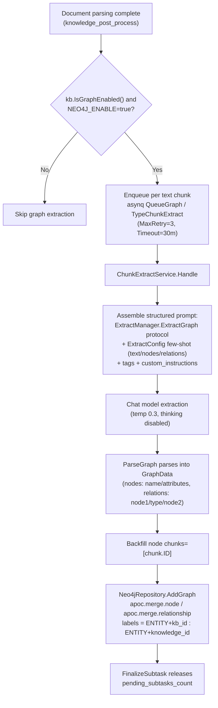
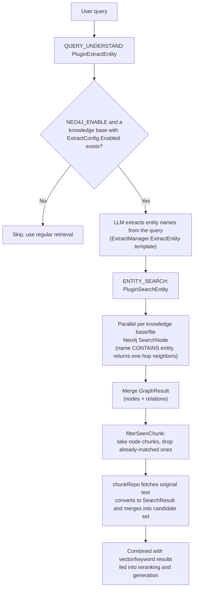

# Knowledge Graph

Vector retrieval excels at finding "passages with similar meaning," but it's not well suited to answering "what is the relationship between A and B?" That's the gap the knowledge graph fills: when a document is ingested, an LLM extracts the entities and relationships within it and stores them as a graph; when a question is asked, the graph is traversed to pull in additional relevant chunks, which are handed to the model together with the rest of the context to produce an answer.

This is well suited to relationship-dense material (people, organizations, product lines, contract clauses that reference one another), but makes little difference for ordinary Q&A scenarios. The trade-off is that ingestion requires an extra LLM call and Neo4j must be deployed.

<Screenshot
  src="/screenshots/kg-graph.png"
  caption="Knowledge graph view: entities and relationships"
  hint="Shows the entity-relationship graph on the knowledge base's Graph tab; nodes can be clicked to view associated documents." />

The graph storage backend is **Neo4j** (the only implementation, and it depends on the APOC plugin; there is no integration with other graph databases such as Nebula in the codebase).

## Enabling the configuration

The knowledge graph feature requires **two levels of switches** to be satisfied simultaneously:

### 1. Global switch: Neo4j environment variables

`NEO4J_ENABLE` is the sole global switch for the knowledge graph (per the `docker-compose.yml` comment: `ENABLE_GRAPH_RAG` was superseded by `NEO4J_ENABLE` as of v0.1.6, and the Go main application no longer reads it).

| Name | Type | Default | Description |
|------|------|--------|------|
| `NEO4J_ENABLE` | string | empty (disabled) | Set to `true` to enable the knowledge graph; both `initNeo4jClient` in `internal/container/container.go` and the task-enqueuing / retrieval pipeline check it |
| `NEO4J_URI` | string | `bolt://neo4j:7687` | Neo4j connection address |
| `NEO4J_USERNAME` | string | `neo4j` | Username |
| `NEO4J_PASSWORD` | string | `password` | Password |

On startup, `initNeo4jClient` retries up to 30 times (2s interval) to establish and verify the connection; when not enabled, it returns a `nil` driver, at which point every method on `Neo4jRepository` degrades to a no-op (logging `NOT SUPPORT RETRIEVE GRAPH`). The `GET /system` info endpoint reports `"Neo4j"` or `"Not Enabled"` via `getGraphDatabaseEngine()` (`internal/handler/system.go`).

The docker-compose `neo4j` service ships with APOC preinstalled: `NEO4JLABS_PLUGINS=["apoc"]` (graph writes rely on `apoc.merge.node` / `apoc.merge.relationship`, and deletions rely on `apoc.periodic.iterate`).

### 2. Knowledge-base–level switch: IndexingStrategy + ExtractConfig

`internal/types/knowledgebase.go`:

```go
// IsGraphEnabled checks if knowledge graph extraction is enabled.
// Requires both the IndexingStrategy flag and a valid ExtractConfig.
func (kb *KnowledgeBase) IsGraphEnabled() bool {
    return kb != nil && kb.IndexingStrategy.GraphEnabled &&
        kb.ExtractConfig != nil && kb.ExtractConfig.Enabled
}
```

- `IndexingStrategy.GraphEnabled` (`internal/types/indexing_strategy.go`): the graph switch within the knowledge base's indexing strategy, `false` by default; the legacy field `ExtractConfig.Enabled` is synced one-way into `IndexingStrategy.GraphEnabled` on read (the legacy sync near line 635 of `knowledgebase.go`).
- `ExtractConfig` (`internal/types/knowledgebase.go`) carries the few-shot configuration for extraction:

| Name | Type | Default | Description |
|------|------|--------|------|
| `enabled` | bool | false | Whether extraction is enabled |
| `text` | string | empty | Original few-shot example text |
| `tags` | []string | nil | Set of relationship-type tags |
| `nodes` | []*GraphNode | nil | Example entity nodes (name / attributes) |
| `relations` | []*GraphRelation | nil | Example relationships (node1 / node2 / type) |
| `custom_instructions` | string | empty | Domain-specific custom extraction instructions (appended to the system prompt; the structured output protocol remains under system control) |

Configuration-wizard helper APIs (`internal/handler/initialization.go`, routes at `internal/router/router.go` lines 914-916):

- `POST /initialization/extract/text-relation` (`ExtractTextRelations`): runs a trial relationship extraction over a piece of text (≤5000 characters) using the selected tags, for previewing the results;
- `POST /initialization/extract/fabri-text` / `fabri-tag` (`FabriText` / `FabriTag`): has the LLM generate example text / recommended tags, helping users quickly build up an `ExtractConfig`.

## Entity-relationship extraction flow (build time)

### Triggering and task orchestration

Once document parsing completes, `internal/application/service/knowledge_post_process.go` counts each text chunk during the enrichment fan-out stage (`graphChunkCount = len(textChunks)` when `eff.GraphEnabled`), and calls `NewChunkExtractTask` in `internal/application/service/extract.go` to enqueue a task per chunk:

```go
func NewChunkExtractTask(...) (bool, error) {
    if strings.ToLower(os.Getenv("NEO4J_ENABLE")) != "true" {
        logger.Warn(ctx, "NEO4J is not enabled, skip chunk extract task")
        return false, nil
    }
    ...
    task := asynq.NewTask(types.TypeChunkExtract, payload,
        asynq.Queue(types.QueueGraph), asynq.MaxRetry(3), asynq.Timeout(30*time.Minute))
    ...
}
```

The task runs on its own asynq `QueueGraph` queue, with one LLM call per chunk (the source comment calls it "the most expensive step in the enrichment fan-out"), constrained by a model-level background concurrency limiter; tasks that are cancelled, deleted, or superseded by a new parsing attempt (`attemptSuperseded`) are skipped and release the parent task's `pending_subtasks_count` count.

### Extraction execution (ChunkExtractService.Handle)

`internal/application/service/extract.go`:

1. Loads the chunk, the knowledge base, and file-level `ProcessOverrides`, then uses `ResolveProcessConfig` to resolve the effective `ExtractConfig` (skipped if not enabled).
2. Assembles a structured prompt template: the system-protocol portion comes from `config.ExtractManager.ExtractGraph` (`extract.extract_graph` in `config/config.yaml`, a multi-step instruction covering entity extraction + attribute enrichment + relationship extraction), layered with the knowledge base's `custom_instructions`, `tags`, and the `ExtractConfig`'s few-shot examples (`Text/Nodes/Relations`).
3. `chatpipeline.NewExtractor(chatModel, template).Extract(ctx, chunk.Content)` calls the Chat model (`temperature 0.3`, `max_tokens 4096`, thinking disabled), which `Formater.ParseGraph` parses into `types.GraphData` (`internal/types/extract_graph.go`):

```go
type GraphNode struct {
    Name       string   `json:"name,omitempty"`
    Chunks     []string `json:"chunks,omitempty"`
    Attributes []string `json:"attributes,omitempty"`
}
type GraphRelation struct {
    Node1 string `json:"node1,omitempty"`
    Node2 string `json:"node2,omitempty"`
    Type  string `json:"type,omitempty"`
}
```

4. Each node's `node.Chunks = []string{chunk.ID}` is backfilled, and then `graphEngine.AddGraph(ctx, NameSpace{KnowledgeBase, Knowledge}, ...)` writes it into Neo4j.
5. The whole process is tracked by a SpanTracker (a `postprocess.graph.chunk[i]` sub-span recording the node/relation counts and samples).

### Storage backend: Neo4j

`internal/application/repository/retriever/neo4j/repository.go` implements `interfaces.RetrieveGraphRepository` (`AddGraph` / `DelGraph` / `SearchNode`):

- **Namespace as label**: `NameSpace{KnowledgeBase, Knowledge}` maps to the node labels `ENTITY<kb_id>` and `ENTITY<knowledge_id>` (hyphens replaced with underscores); node properties include `name`, `kg` (knowledge_id), `attributes`, and `chunks`.
- Writes use an APOC idempotent merge, unioning the `chunks` for entities sharing the same name:

```cypher
UNWIND $data AS row
CALL apoc.merge.node(row.labels, {name: row.name, kg: row.knowledge_id}, row.props, {}) YIELD node
SET node.chunks = apoc.coll.union(node.chunks, row.chunks)
```

- When a piece of knowledge or a knowledge base is deleted (`knowledge_delete.go`, `knowledgebase.go`), `DelGraph` is called, which uses `apoc.periodic.iterate` to delete edges and nodes in parallel batches of 1000.

## Graph-augmented retrieval (GraphRAG)

The traditional chat pipeline (`internal/application/service/chat_pipeline`) has two plugins:

1. **PluginExtractEntity** (`extract_entity.go`, hooked into the `QUERY_UNDERSTAND` event): when `NEO4J_ENABLE=true`, it first filters down to the knowledge bases with `ExtractConfig.Enabled` (stored into `chatManage.EntityKBIDs` / `EntityKnowledge`), then uses the `ExtractManager.ExtractEntity` template plus the Chat model to extract entity names from the **user's query**, storing them into `chatManage.Entity`.
2. **PluginSearchEntity** (`search_entity.go`, hooked into the `ENTITY_SEARCH` event): for each graph-enabled knowledge base / file, it calls `graphRepo.SearchNode` in parallel — a Cypher query using `n.name CONTAINS nodeText` to fuzzy-match entities and return their one-hop neighbors and relationships, merged into `chatManage.GraphResult`; afterward, `filterSeenChunk` pulls the `chunks` carried by the graph nodes (excluding ones already matched by vector retrieval), fetches the original text from `chunkRepo`, converts it to `SearchResult`, and merges it into the candidate set — implementing an "entity → associated chunk" graph-based supplementary recall.

Agent mode, meanwhile, provides a `query_knowledge_graph` tool (`internal/agent/tools/query_knowledge_graph.go`): it checks whether each knowledge base has the graph configured (`ExtractConfig.Nodes/Relations` non-empty), runs retrieval concurrently across multiple knowledge bases, deduplicates and ranks by chunk, and includes each knowledge base's graph configuration status (entity-type / relationship-type lists) in the output; knowledge bases without a graph configured fall back to plain hybrid retrieval results.

## Flow diagrams

### Build flow



### Query flow



## Visualization

- **Mermaid diagram generation**: `graphBuilder` in `internal/application/service/graph.go` is an in-memory implementation of the `types.GraphBuilder` interface (LLM extracts entities → extracts relationships → computes relationship weights via PMI×0.6 + Strength×0.4, normalized to 1-10 → computes entity degree → builds a chunk-association graph); its `generateKnowledgeGraphDiagram` uses DFS to find connected components and outputs a Mermaid `graph TD` subgraph (high-frequency entities are highlighted, relationships with strength >7 use bold arrows). Note: `NewGraphBuilder` is currently not invoked by container wiring (there are no other references in the repository) — it is a standalone/legacy graph-building and visualization implementation; the generated Mermaid diagram is output to the log.
- **External API**: the knowledge graph itself has no dedicated visualization REST endpoint; the structured output of the `query_knowledge_graph` tool (`graph_configs`, result list) is available for the Agent front end to render. `GET /wiki/graph` (`wikiHandler.GetGraph`) is the Wiki feature's own graph endpoint and is unrelated to the entity-relationship graph discussed in this document.
- **Prompt templates**: `config/prompt_templates/graph_extraction.yaml` provides templates such as `default_extract_entities` (an enumeration of entity types — Person/Organization/Location/… — and the JSON output protocol), which are resolved via `extract_entities_prompt_id` / `extract_relationships_prompt_id` in `internal/config/config.go` into `Conversation.ExtractEntitiesPrompt` / `ExtractRelationshipsPrompt`, for use by the in-memory `graphBuilder` above; the production asynchronous extraction path uses the `extract.extract_graph` / `extract.extract_entity` templates in `config.yaml` (`ExtractManagerConfig`).
