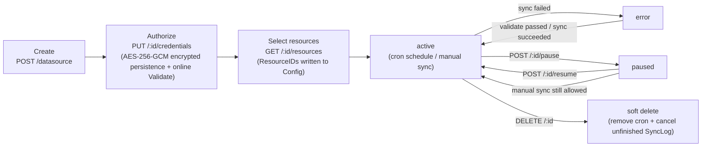
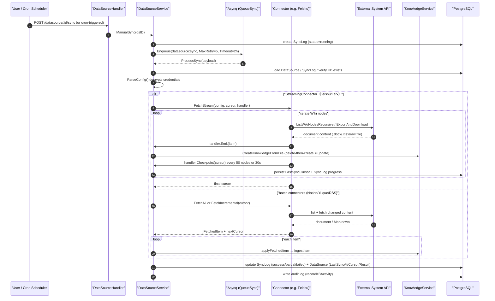

# Data Source Import (Data Source)

Team knowledge often lives in Feishu, Notion, or Yuque, and a one-time manual import quickly goes stale. Data sources exist to solve **continuous synchronization**: bind an account once, and afterward new and modified content is automatically synced into the knowledge base on schedule — deleted documents are taken down in sync as well.

Usage: data sources are **attached to a knowledge base**, not managed in global settings — open the target knowledge base → edit settings → the "Data Source" tab (only appears in edit mode) → create a new connection → fill in credentials and authorize → select the spaces/directories to sync → set the sync interval. The first sync is a full sync; afterward, items are pulled incrementally based on modification time.

<Screenshot
  src="/screenshots/datasource-sync.png"
  caption="Data Sources: connection list and sync status"
  hint="Shows configured data sources (type, target knowledge base, last sync time, status) and the sync log entry point." />

It is not a one-time import tool, but a complete "connector + scheduler + incremental sync + knowledge ingestion" pipeline:

- Connector framework and implementations: `internal/datasource/` (`connector.go`, `scheduler.go`, `httpclient.go`, `errors.go`, implementations under `connector/`)
- HTTP interface layer: `internal/handler/datasource.go`, `internal/handler/datasource_credentials.go`
- Business service layer: `internal/application/service/datasource_service.go`
- Data model: `internal/types/datasource.go`

## Core Abstraction: the Connector Interface

All connectors must implement the `Connector` interface in `internal/datasource/connector.go`:

```go
type Connector interface {
    // Type returns the connector type identifier (e.g. "feishu", "notion")
    Type() string
    // Validate verifies the config and credentials by actually calling the external API
    Validate(ctx context.Context, config *types.DataSourceConfig) error
    // ListResources lists synchronizable resources (documents, spaces, folders, etc.).
    // parentID enables lazy loading of hierarchical resources: "" = top level; non-empty = direct children of that resource
    ListResources(ctx context.Context, config *types.DataSourceConfig, parentID string) ([]types.Resource, error)
    // ResolveResourceAncestors resolves the ancestor chain of selected resources for deep-selection echo in the lazy-loaded picker
    ResolveResourceAncestors(ctx context.Context, config *types.DataSourceConfig, resourceIDs []string) ([]string, error)
    // FetchAll performs a full sync of the given resources
    FetchAll(ctx context.Context, config *types.DataSourceConfig, resourceIDs []string) ([]types.FetchedItem, error)
    // FetchIncremental performs cursor-based incremental sync, returning changed items and the new cursor for the next sync
    FetchIncremental(ctx context.Context, config *types.DataSourceConfig, cursor *types.SyncCursor) ([]types.FetchedItem, *types.SyncCursor, error)
}
```

### Optional extension: StreamingConnector (streaming, resumable sync)

For large-scale syncs (e.g., a Feishu Wiki with thousands of documents), `connector.go` also defines an optional `StreamingConnector` interface. A connector that implements it no longer accumulates every item in memory at once — instead it "fetches, ingests, and checkpoints the cursor" as it goes:

```go
type StreamHandler interface {
    // Emit stores one fetched item; returning an error aborts the whole stream
    Emit(ctx context.Context, item types.FetchedItem) error
    // Checkpoint persists a cursor snapshot (must be a fully restorable snapshot, not an incremental one)
    Checkpoint(ctx context.Context, cursor *types.SyncCursor) error
}

type StreamingConnector interface {
    Connector
    FetchStream(ctx context.Context, config *types.DataSourceConfig,
        cursor *types.SyncCursor, h StreamHandler) (*types.SyncCursor, error)
}
```

Value (see source code comments, corresponding to issue Tencent/WeKnora#2136): when a sync task times out (the Asynq task timeout is 2 hours), it can **resume** from the last checkpoint instead of starting over from scratch; at the same time, memory usage is bounded at the "single item" level. Currently only the **Feishu/Lark connector** implements `StreamingConnector`.

### ConnectorRegistry: registration and lookup

`ConnectorRegistry` is a simple `map[string]Connector` registry. Actual registration happens in `initConnectorRegistry()` in `internal/container/container.go`:

```go
registry.Register(feishuConnector.NewConnector(feishuConnector.RegionFeishu))  // feishu
registry.Register(feishuConnector.NewConnector(feishuConnector.RegionLark))    // lark (international edition, same implementation with a different Region)
registry.Register(notionConnector.NewConnector())                              // notion
registry.Register(yuqueConnector.NewConnector())                               // yuque
registry.Register(rssConnector.NewConnector())                                 // rss
```

> Note: the `ConnectorMetadataRegistry` in `connector.go` defines additional connector metadata for frontend display purposes (Confluence, GitHub, Google Drive, OneDrive, DingTalk, Web Crawler, Slack, IMAP, etc.), but **currently only 5 connector types are actually registered and usable in the codebase: `feishu`, `lark`, `notion`, `yuque`, `rss`** (feishu/lark share the same implementation). Unregistered types are rejected by `connectorRegistry.Get()` with `ErrConnectorNotFound` when creating a data source.

## Data Model (internal/types/datasource.go)

| Struct | Description |
| --- | --- |
| `DataSource` | Data source configuration entity (table `data_sources`). Key fields: `Type` (connector type), `Config` (JSONB, containing encrypted credentials), `SyncSchedule` (cron expression), `SyncMode` (`incremental`/`full`), `Status` (`active`/`paused`/`error`/`deleted`), `ConflictStrategy`, `SyncDeletions`, `LastSyncCursor` (incremental cursor, JSONB), `LastSyncAt`, `LastSyncResult`, `SyncLogRetentionDays` |
| `SyncLog` | Record of a single sync run (table `sync_logs`). Status: `running`/`success`/`partial`/`failed`/`canceled`; counts: `ItemsTotal/Created/Updated/Deleted/Skipped/Failed`; `Result` stores the `SyncResult` JSON |
| `DataSourceConfig` | Decrypted configuration struct: `Type` + `Credentials map[string]interface{}` + `ResourceIDs []string` (selected resources) + `Settings map[string]interface{}` (non-secret configuration) |
| `Resource` | A selectable resource from the external system: `ExternalID`, `Name`, `Type`, `URL`, `ParentID`, `HasChildren`, `ModifiedAt`, `Metadata` |
| `FetchedItem` | A single fetched document: `ExternalID`, `Title`, `Content []byte`, `ContentType`, `FileName`, `URL`, `UpdatedAt`, `Metadata`, `IsDeleted`, `SourceResourceID` |
| `SyncCursor` | Incremental cursor: `LastSyncTime` + `ConnectorCursor map[string]interface{}` (connector-specific structure) |
| `SyncResult` | Sync result summary + `Errors []SyncItemError` (failure samples, capped at 100, see `maxSyncResultErrors`) |
| `SyncItemError` | User-facing failure sample: a stable i18n `Code` + interpolation `Params` + fallback `Message`; the raw API status code/response body is kept only in server-side logs |
| `DataSourceSyncPayload` | Asynq task payload: `DataSourceID`, `TenantID`, `SyncLogID`, `ForceFull`, `Trigger` (`manual`/`schedule`) |

## Encrypted Credential Storage

Credential security is a key design focus of this module, implemented across three places:

**1. Encryption on write — `DataSourceConfig.ToJSON()`** (`internal/types/datasource.go`):

```go
// When SYSTEM_AES_KEY is configured, every string value in Credentials is
// AES-256-GCM encrypted before serialization. This is the only write path for
// credentials into the DB (GORM's JSON type is a byte passthrough), so encrypting
if key := utils.GetAESKey(); key != nil && len(out.Credentials) > 0 {
    ...
    if enc, err := utils.EncryptAESGCM(s, key); err == nil { encCreds[k] = enc }
}
```

**2. Decryption on read — `DataSource.ParseConfig()`**: transparently handles three cases — an empty string is returned as-is; legacy plaintext without the `enc:v1:` prefix is returned as-is (no migration needed); ciphertext is decrypted with `SYSTEM_AES_KEY`. If decryption fails (key lost/rotated), it does **not** fail the row load — instead that field is cleared, the UI shows "credentials not configured," and the user just re-enters them without losing the data source's other settings.

**3. A dedicated credentials sub-resource — `internal/handler/datasource_credentials.go`**: credentials are not handled via the regular `PUT /datasource/:id` — instead they go through a separate `/credentials` sub-resource, and are **replaced atomically as a whole** (field-level PATCH is not allowed, since a "half-configured connector auth" makes no sense):

- `PUT /api/v1/datasource/:id/credentials` — replaces the entire credentials map; immediately after replacement, the connector's `Validate` is called for an online check (a bad token is surfaced right away, rather than waiting for the next scheduled sync)
- `DELETE /api/v1/datasource/:id/credentials/credentials` — clears everything
- The response **never** returns the ciphertext/plaintext — only `{"credentials": {"configured": true/false}}`; the list/detail endpoints also strip `Credentials` by construction when serialized via `dto.NewDataSourceResponse`

The regular update endpoint `UpdateDataSource` (`datasource_service.go`) **always preserves the credentials already stored in the database**, even if the request body includes credentials — those are ignored and a warning is logged. Additionally, `StripNonSecretCredentials` strips out any non-secret fields mistakenly placed under credentials (currently only RSS's `feed_urls`, which belongs under `Settings`).

## Data Source Lifecycle and REST API

Routes are registered in `RegisterDataSourceRoutes` in `internal/router/router.go` (read operations require Viewer+, write operations require Admin+):

| Method & Path | Permission | Description |
| --- | --- | --- |
| `GET /api/v1/datasource/types` | Viewer | List of available connector metadata (`ListAvailableConnectors`, sorted by Priority) |
| `POST /api/v1/datasource/validate-credentials` | Admin | Test connectivity with raw credentials (not persisted), for the "Test Connection" button in the creation wizard |
| `POST /api/v1/datasource` | Admin | Create a data source (verify KB belongs to tenant → verify connector type → online Validate → persist → register cron) |
| `GET /api/v1/datasource?kb_id=` | Viewer | List data sources by knowledge base (includes the most recent SyncLog) |
| `GET /api/v1/datasource/:id` | Viewer | Details |
| `PUT /api/v1/datasource/:id` | Admin | Update (credentials fields are ignored; online validation is only triggered if the config actually changed and credentials already exist; cron is updated accordingly) |
| `DELETE /api/v1/datasource/:id` | Admin | Soft delete + remove cron + cancel pending/running SyncLogs |
| `PUT /api/v1/datasource/:id/credentials` | Admin | Atomically replace credentials (see above) |
| `DELETE /api/v1/datasource/:id/credentials/:field` | Admin | Clear credentials (field only accepts `credentials`) |
| `POST /api/v1/datasource/:id/validate` | Admin | Run a connectivity test against an existing data source; sets `status=error` on failure, clears error status on success |
| `GET /api/v1/datasource/:id/resources?parent_id=` | Viewer | List selectable resources from the external system (parent_id supports lazy expansion) |
| `POST /api/v1/datasource/:id/resource-ancestors` | Viewer | Resolve the ancestor chain of selected resources (to reflect deeply nested selections when editing) |
| `POST /api/v1/datasource/:id/sync` | Admin | Manually trigger a sync (creates a SyncLog + enqueues an Asynq task) |
| `POST /api/v1/datasource/:id/pause` / `resume` | Admin | Pause/resume (also removes/re-registers cron) |
| `GET /api/v1/datasource/:id/logs`, `GET /api/v1/datasource/logs/:log_id` | Viewer | Sync history |

All `:id` paths first go through `getOwnedDataSource` → `getOwnedKnowledgeBase` for **tenant isolation** checks (the data source's owning KB must belong to the current tenant, and pass the KB authorization check for the API key).

Lifecycle state transitions:



## Sync Scheduling (internal/datasource/scheduler.go)

`Scheduler` is based on `robfig/cron` (`cron.WithSeconds()`, supporting 6-field, second-level expressions) and maintains a cron entry for every active data source with a `SyncSchedule` configured; on service startup, `Start()` loads all active data sources from the DB and registers them in bulk.

Because robfig/cron fires based on **absolute wall-clock time** (e.g., `0 0 * * * *` always fires on the hour), all instances in a multi-instance deployment fire simultaneously. Deduplication relies on two layers:

1. **DB-level overlap prevention**: `syncLogRepo.HasRunningSync` — if the previous sync is still running, the current run is skipped (prevents overlapping executions when sync duration exceeds the cron interval).
2. **Redis-level cross-instance dedup**: a deterministic `asynq.TaskID = "dssync:<dsID>:<yyyyMMddHHmm>"` (truncated to the minute). All instances produce the same TaskID within the same minute; Redis guarantees only one enqueue succeeds, and the rest get `asynq.ErrTaskIDConflict`, with the corresponding SyncLog marked `canceled` ("deduplicated: another instance enqueued first").

Enqueue parameters: queue `types.QueueSync`, `MaxRetry(5)`, `Timeout(2*time.Hour)`. The task type is `types.TypeDataSourceSync` (`"datasource:sync"`), consumed by `mux.HandleFunc(types.TypeDataSourceSync, params.DataSourceService.ProcessSync)` in `internal/router/task.go`.

## Sync Execution and Knowledge Ingestion (datasource_service.go)

`ProcessSync` is the Asynq task handler; the full flow is shown in the sequence diagram below. Key points:

- **Defensive cancellation**: if the data source or knowledge base has already been deleted, the SyncLog is set to `canceled` and nil is returned (no further retries).
- **Two fetch paths**: connectors implementing `StreamingConnector` go through `processSyncStreaming` (streaming); otherwise, `ForceFull || SyncMode==full` goes through `FetchAll`, or with a cursor from `ParseSyncCursor()`, through `FetchIncremental` (batch).
- **Cursor strategy for the streaming path** (`streamStartCursor`): a user-triggered full sync discards the cursor and fetches everything on its **first attempt**; Asynq **retries** (attempt > 0) as well as all incremental syncs resume from the last checkpoint.
- **Ingestion core, `applyFetchedItem` → `ingestItem`**:
  - Items with `IsDeleted=true` only increment the `result.Deleted` counter — the actual knowledge base entry is **intentionally not deleted** (to prevent accidental data loss from a connector misjudgment or reconfiguration; the user must explicitly delete it in the KB UI);
  - Items with `Content` bytes are wrapped into a `multipart.FileHeader` and go through `KnowledgeService.CreateKnowledgeFromFile` (the full document parsing pipeline); items with only a `URL` go through `CreateKnowledgeFromURL`, downloaded and parsed by WeKnora;
  - **Update = delete then recreate**: if an existing knowledge entry is found via the `external_id` metadata, it is first `DeleteKnowledge`'d and then rebuilt, counted as Updated;
  - Duplicate files (`DuplicateKnowledgeError`) are counted as Skipped, not as a failure;
  - Every item automatically gets metadata attached: `external_id`, `source_resource_id`, `datasource_id`, plus any metadata added by the connector.
- **Automatic tagging**: `resolveAutoTagIDs` finds-or-creates a tag in the target KB based on the data source's name, and attaches it to all synced items, making it easy to identify the source within the KB; a tagging failure does not block the sync.
- **Result status**: if all items fail → `failed` (`allFetchedItemsFailedError`); if some RSS feeds fail (`PartialFetchError`) or the streaming path has failed documents → `partial`; otherwise → `success`. Failure samples are kept as `SyncItemError`, capped at 100.
- If a fetch fails but the connector still returned a new cursor (e.g., RSS), it is still persisted, avoiding a forced full re-fetch after a transient failure.



## Connector Implementation Details

### Connector Capability Comparison

| | Feishu / Lark | Notion | Yuque | RSS / Atom |
| --- | --- | --- | --- | --- |
| Source directory | `internal/datasource/connector/feishu/` | `connector/notion/` | `connector/yuque/` | `connector/rss/` |
| Type identifier | `feishu` / `lark` | `notion` | `yuque` | `rss` |
| Auth method | Self-built enterprise app `app_id` + `app_secret` (tenant_access_token) | Internal Integration Token (`api_key`) | Personal/team Token (`api_token`, `X-Auth-Token` header) | No auth, or custom request headers (`auth_headers`) |
| Credential fields | `app_id`, `app_secret`, `base_url` (optional override) | `api_key` (`base_url` goes under Settings) | `api_token`, `base_url` (optional, for private deployments) | `auth_headers` (optional, a credential); `feed_urls` belongs under Settings |
| Resource model | Wiki space → node tree (lazy-loaded, composite ID `spaceID:nodeToken`) | Full page/database tree (returned in one call with parent relationships) | Flat list of knowledge bases (book/repo) | One resource per feed URL (flat) |
| Content format | Export API → `.docx`/`.xlsx` file; drive files downloaded as-is | Block → Markdown; databases converted to Markdown tables; attachments downloaded | Raw `body` Markdown (`.md`) | Readability full-text extraction → HTML→Markdown |
| Incremental mechanism | Compared by node `obj_edit_time` (cursor: `SpaceNodeTimes`) | Compared by page/record `last_edited_time` (cursor: `PageEditTimes`) | Compared by document `content_updated_at` (cursor: `BookDocTimes`) | Dual-layer comparison: feed signal fingerprint + content SHA-256 fingerprint |
| Deletion detection | Supported (present in cursor, absent from current tree → `IsDeleted`; deletion detection is skipped when part of the listing fails) | Supported (distinguishes "deleted at source" from "deselected by user" — the latter is not reported as a deletion) | Supported | Not supported (feeds naturally roll off old entries) |
| Streaming resumable sync | Yes (`StreamingConnector`, checkpoint every 50 nodes or 30 seconds) | No | No | No |
| Rate-limit handling | 429 reads `Retry-After` + exponential backoff (2s/4s/8s, up to 3 retries); 5xx retried | — | 300ms delay between each `GetDocDetail` call (personal token ~100 req/5min) | — |
| Partial failure | A single failed document generates a placeholder item with error metadata, sync continues | A single failed page is logged and skipped | A single failed document generates a placeholder item | A single failed feed → `PartialFetchError`; only fails overall if all feeds fail |

### Feishu / Lark (`connector/feishu/`)

Feishu and Lark (the international version, open.larksuite.com) are the same product deployed on two isolated clouds — their Wiki/docx/drive APIs are identical, so they **share the same connector code**, with the `Region` struct in `region.go` selecting the cloud (`RegionFeishu` / `RegionLark`, corresponding to type `feishu` / `lark`, and API domains `open.feishu.cn` / `open.larksuite.com` respectively). The `base_url` credential field can explicitly override this (for compatibility with legacy data sources where a feishu connector was historically pointed at larksuite).

- **Authentication** (`client.go`): `POST /open-apis/auth/v3/tenant_access_token/internal` exchanges for a tenant_access_token, cached with a mutex and refreshed on expiry.
- **Resource listing** (`ListResources`): three levels of lazy loading — `parentID==""` lists Wiki spaces; `parentID==spaceID` lists the space's top-level nodes; `parentID=="spaceID:nodeToken"` lists that node's children. Earlier versions eagerly recursed the entire tree, which timed out on large Wikis (issue #1672); recursion now only happens during sync. `ResolveResourceAncestors` walks up via `GetWikiNode`'s `parent_node_token` one level at a time, O(depth), to reflect deeply nested selections.
- **Content fetching** (`fetchNodeContent`) dispatches by `obj_type`:
  - `docx`/`doc` → asynchronous export API (`POST /drive/v1/export_tasks`) exports `.docx`;
  - `sheet`/`bitable` → exports `.xlsx`;
  - `file` → downloads the raw drive file (PDF/Word/images, etc.);
  - `mindnote`/`slides` → **skipped** (no content-reading API), with a summary log emitted via `fetchTally` (`discovered/fetched/failed/skipped_unsupported by_type`) explaining "why only 3 of the 13 discovered documents were synced" (issue #2136).
- **Incremental logic**: cursor `feishuCursor.SpaceNodeTimes` (`resourceID → nodeToken → editTime`). Change detection uses `obj_edit_time` (document content edit time), **not** `node_edit_time` (which only reflects title changes or moves). Nodes that fail to fetch **do not advance the cursor** (the old editTime is kept, so prev != current next time and a retry is forced), preventing a document from being permanently skipped due to a transient export failure.
- **FetchStream**: unifies the full/incremental paths (cursor==nil means full sync); the cursor is checkpointed every `feishuStreamCheckpointInterval = 50` nodes processed, or whenever more than `feishuStreamCheckpointMaxInterval = 30s` has passed since the last checkpoint — the latter guards against the scenario of "few documents, but each export is extremely slow (rate-limited)," which could otherwise go without a single checkpoint before the 2-hour timeout.
- **Error classification** (`feishuFailure`): classifies raw errors into stable i18n codes (`feishu_auth_or_permission` / `feishu_rate_limited` / `feishu_timeout` / `feishu_server_unavailable` / `feishu_api_error`(+code) / `sync_failed`) for localized display on the frontend; the raw status/body/log_id is kept only in server-side logs.

### Notion (`connector/notion/`)

- **Authentication**: Internal Integration Token (credential field `api_key`), API version `NotionAPIVersion = "2026-03-11"`, default `https://api.notion.com` (overridable via `Settings.base_url`).
- **Resource listing**: the Search API fetches all visible pages and databases in one call, returning a full tree with `ParentID` set (so lazy-load requests with `parentID != ""` return empty directly; `ResolveResourceAncestors` similarly has nothing to do). `resolveParentID` handles the `data_source` object from the 2025-09-03+ API: its `parent` points to the containing database, but the real workspace location depends on `database_parent`.
- **Fetching**: `fetchPage` recursively processes pages — `GetBlockChildrenAll` fetches blocks → `BlocksToMarkdown` (`markdown.go`) converts to Markdown; `file_upload`-type file blocks first go through `ResolveBlock` to get a temporary download URL; **attachments** (PDFs etc. — excluding images, which are already inlined in Markdown as ``) are downloaded as separate items; `child_page` / `child_database` blocks are recursed into. Databases come in two forms: an entire database is rendered as one Markdown table (`buildDatabaseItem`, with a per-record block-content appendix), while a database record appearing on its own is rendered as "property list + block content" (`buildRecordItem`). Property extraction (`propertyToString`) generically follows the `type` chain, covering all 22 property types; property names are sorted alphabetically to ensure deterministic incremental comparisons.
- **Incremental logic**: on the first sync (empty cursor), it simply delegates to `FetchAll` and builds the cursor from the returned items' `UpdatedAt`; subsequent syncs use `discoverAllResources` with the Search API + BFS to enumerate all descendants under the selected roots, comparing `last_edited_time` page by page. Databases go through `fetchDatabaseIncremental`: if any record changed, the entire table is rebuilt.
- **Distinguishing deletion from deselection**: a page that has disappeared at the source is reported as `IsDeleted`; a page that is still visible but no longer reachable because the user deselected an ancestor goes into the excluded set and is **not** falsely reported as deleted. `computeExcludedSet` also ensures that "new pages the user has never seen" are not excluded — a selected parent node automatically picks up new child pages.

### Yuque (`connector/yuque/`)

- **Authentication**: a personal Token (Yuque Settings → Token) or a team Token, credential field `api_token` (header `X-Auth-Token`) + optional `base_url` (for a private, self-hosted domain; `https://` is auto-prepended if the scheme is missing).
- **Resource listing**: `GET /api/v2/user` determines the token's identity — `type=="Group"` means a team token, which lists team repos directly; otherwise it lists personal repos plus repos of groups the user has joined (Yuque returns 404 if the user hasn't joined any group, which is treated as empty). Outputs a flat list of `book` resources, stably sorted by ExternalID.
- **Fetching** (`walk`, shared by full and incremental sync): `ListBookDocs` lists documents → filters out `type != "Doc"` (skipping Sheet/Thread/Board/Table) and `status != "1"` (skipping drafts) → sleeps 300ms between each `GetDocDetail` call to avoid rate limiting → when `format` is `markdown`/`lake`, the raw `body` Markdown is ingested (other formats such as html are defensively skipped and logged with `skip_reason`).
- **Incremental logic**: cursor `yuqueCursor.BookDocTimes` (`bookID → docID → content_updated_at`); unchanged items are skipped. Deletion detection: present in the cursor but absent from the current list → `IsDeleted`.

### RSS / Atom (`connector/rss/`)

- **Configuration**: `feed_urls` (newline/comma-separated, deduplicated) is stored under **Settings** (non-secret, directly editable in the UI); `auth_headers` (one `Name: Value` per line, attached only to feed requests, never sent to third-party article pages) is stored under **Credentials** and encrypted. `HasConfiguredCredentials` has a special case for RSS: only `auth_headers` counts as configured credentials.
- **Fetching**: `gofeed` parses RSS/Atom/JSON feeds; when an entry has a link, the original article page is fetched and run through the readability extractor — if successful, the full text is used; otherwise it falls back to the feed's own content (`content:encoded`/`description`); HTML is converted to Markdown via `html-to-markdown/v2`. The entry ID is taken as the first non-empty value among `GUID > Link > Title`.
- **Incremental logic**: dual-layer fingerprinting — first compare the feed-side signal fingerprint (`feedSignalFingerprint`; if unchanged, the original article page isn't even fetched); then compare the SHA-256 fingerprint of the fetched content. **Deletion sync is not supported** (feeds naturally roll off old entries).
- **Partial failure**: if a single feed's fetch/parse fails, the old cursor is retained for it (`copyFeedCursor`) and the remaining feeds continue processing; the overall result is reported as `datasource.PartialFetchError` (SyncLog records `partial`); the whole sync only fails if every feed fails.

## Security Restrictions (internal/datasource/httpclient.go and errors.go)

`httpclient.go` provides two SSRF protection entry points shared by all connectors:

```go
// ValidateConnectorBaseURL applies SSRF policy validation to the connector base_url (empty passes through; the caller applies defaults)
func ValidateConnectorBaseURL(rawURL string) error {
    ...
    if err := utils.ValidateURLForSSRF(url); err != nil { ... }
}

// NewConnectorHTTPClient returns an HTTP client with redirect- and dial-time SSRF protection
func NewConnectorHTTPClient(timeout time.Duration) *http.Client {
    cfg := utils.DefaultSSRFSafeHTTPClientConfig()
    cfg.Timeout = timeout
    return utils.NewSSRFSafeHTTPClient(cfg)
}
```

The underlying `internal/utils/security.go` rejects targets such as private-network addresses, loopback addresses, and link-local addresses, and re-validates on **every redirect and at actual dial time** (not just the initial URL), preventing a malicious feed or custom base_url from directing WeKnora at an internal service. Each connector's `parseXXXConfig` calls `ValidateConnectorBaseURL` on its base_url.

`errors.go` defines module-level sentinel errors (`ErrConnectorNotFound`, `ErrDataSourceInvalid`, `ErrInvalidCredentials`, `ErrSyncFailed`, etc.) and `PartialFetchError` (some resources succeeded, some failed; the caller should process the items obtained so far, persist the cursor, and present `Details` to the user as a partial status).

## References

- Connector development guide (maintained alongside the code): `internal/datasource/CONNECTOR_IMPLEMENTATION_GUIDE.md`
- Module documentation (maintained alongside the code): `internal/datasource/README.md`
