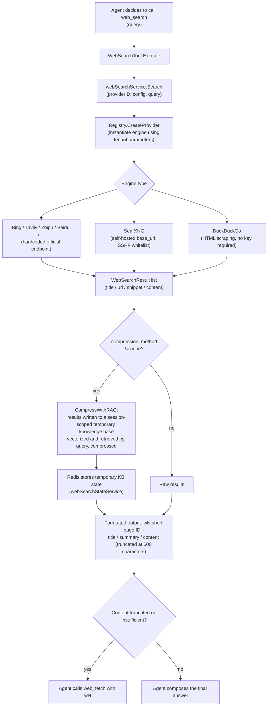
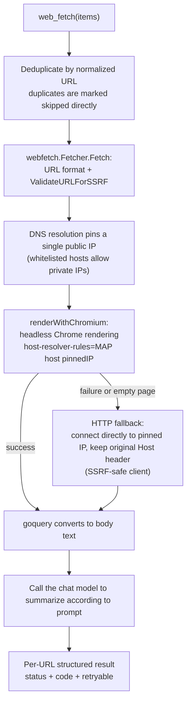

# Web Search and Web Scraping

When knowledge base retrieval isn't enough to answer a question, WeKnora's Agent can rely on two tools — `web_search` (internet search) and `web_fetch` (web scraping + LLM analysis) — to get real-time information. The underlying implementation is spread across `internal/infrastructure/web_search` (search engine adapter layer), `internal/infrastructure/web_fetch` (lightweight fetcher), and `internal/agent/tools` (Agent tool layer), with `docker/searxng` providing an optional self-hosted meta search engine.

## Interface Abstraction

Search capability is defined by two interface layers (`internal/types/interfaces/web_search.go`):

```go
// WebSearchProvider defines the interface for web search providers
type WebSearchProvider interface {
    Name() string
    Search(ctx context.Context, query string, maxResults int, includeDate bool) ([]*types.WebSearchResult, error)
}

// WebSearchService defines the interface for web search services
type WebSearchService interface {
    Search(ctx context.Context, providerID string, config *types.WebSearchConfig, query string) ([]*types.WebSearchResult, error)
    CompressWithRAG(ctx context.Context, sessionID string, tempKBID string, questions []string, ...) (...)
}
```

`internal/infrastructure/web_search/registry.go` maintains a registry mapping **provider type -> factory function**, with instances created at call time based on per-tenant parameters:

```go
type ProviderFactory func(params types.WebSearchProviderParameters) (interfaces.WebSearchProvider, error)

func (r *Registry) Register(id string, factory ProviderFactory)
func (r *Registry) CreateProvider(providerType string, params types.WebSearchProviderParameters) (interfaces.WebSearchProvider, error)
```

## Supported Search Engines

Engines are registered in `internal/container/container.go`:

```go
registry.Register("duckduckgo", infra_web_search.NewDuckDuckGoProvider)
registry.Register("google", infra_web_search.NewGoogleProvider)
registry.Register("bing", infra_web_search.NewBingProvider)
registry.Register("tavily", infra_web_search.NewTavilyProvider)
registry.Register("ollama", infra_web_search.NewOllamaProvider)
registry.Register("baidu", infra_web_search.NewBaiduProvider)
registry.Register("searxng", infra_web_search.NewSearxngProvider)
registry.Register("keenable", infra_web_search.NewKeenableProvider)
registry.Register("zhipu", infra_web_search.NewZhipuProvider)
```

| Engine | Source File | API Key Required | Endpoint | Notes |
|------|---------|-----------------|------|------|
| DuckDuckGo | `duckduckgo.go` | No | HTML scraping first, API as fallback | Free; supports `proxy_url` |
| Google | `google.go` | Yes (also requires `engine_id`) | Google Custom Search API (official SDK `customsearch/v1`) | |
| Bing | `bing.go` | Yes | `https://api.bing.microsoft.com/v7.0/search` (hardcoded) | |
| Tavily | `tavily.go` | Yes | `https://api.tavily.com/search` (hardcoded) | |
| Ollama Web Search | `ollama.go` | Yes | `https://ollama.com/api/web_search` (hardcoded) | Up to 10 results |
| Baidu Qianfan AI Search | `baidu.go` | Yes | `https://qianfan.baidubce.com/v2/ai_search/web_search` (hardcoded) | |
| SearXNG | `searxng.go` | No | Tenant-supplied `base_url` (self-hosted instance) | The only engine allowing a custom address, subject to SSRF validation |
| Keenable | `keenable.go` | Optional | `https://api.keenable.ai` (hardcoded) | Without a key, uses a public rate-limited endpoint; with a key, rate limits are lifted |
| Zhipu Search | `zhipu.go` | Yes | `https://open.bigmodel.cn/api/paas/v4/web_search` (hardcoded), default engine `search_std` | |

Except for SearXNG, all engine endpoints are hardcoded and cannot be configured by tenants — this is the first line of defense against SSRF (source comment: `Not configurable by tenants — prevents SSRF`).

## Search Engine Configuration (Provider Entity)

Each workspace can create multiple search engine configuration instances (e.g. "Production Bing", "Test Google"), stored as `WebSearchProviderEntity` (`internal/types/web_search_provider.go`) in the `web_search_providers` table, referenced by the Agent via ID. The parameter structure `WebSearchProviderParameters`:

| Name | Type | Default | Description |
|------|------|--------|------|
| `api_key` | string | empty | Search service key, encrypted with AES-GCM before storage; can only be modified via the `/credentials` subresource, never returned in responses |
| `engine_id` | string | empty | Required only for Google Custom Search |
| `base_url` | string | empty | SearXNG only: self-hosted instance address; validated via `utils.ValidateURLForSSRF`, internal addresses must be added to `SSRF_WHITELIST` |
| `proxy_url` | string | empty | Optional outbound HTTP/HTTPS proxy (tunnels traffic only, does not replace the API endpoint), also subject to SSRF validation |
| `extra_config` | map[string]string | nil | Reserved for extension |

CRUD routes (`RegisterWebSearchProviderRoutes`, `internal/router/router.go`): create/read/update/delete under `/web-search-providers`, `POST /test` (probes the external service using stored credentials, requires Admin permission), `POST /:id/test`, `PUT /:id/credentials`; there's also `GET /web-search/providers`, which returns the catalog of available engine types.

## SSRF Protection for Outbound Requests

`NewSearchHTTPClient` in `internal/infrastructure/web_search/proxy.go` builds a unified secure HTTP client for all engines:

- `DialContext` uses `utils.SSRFSafeDialContext` (validates the target IP at dial time, preventing DNS rebinding);
- Each redirect hop is re-validated with `ssrfSafeRedirect` calling `ValidateURLForSSRF`, and exceeding the maximum hop count fails immediately;
- An explicit `proxy_url` must pass SSRF validation; if not configured, it falls back to `ProxyFromEnvironment`.

## Search Tool Invocation Flow

The Agent tool `web_search` (`internal/agent/tools/web_search.go`) follows the "KB First" rule (it must run `grep_chunks` + `knowledge_search` first). Its execution chain:



Key points (all found in `web_search.go`):

- **RAG compression**: `CompressWithRAG` injects search results into a hidden, session-scoped temporary knowledge base (not shown in the UI, cleaned up after use), using vector retrieval to extract fragments relevant to the query, avoiding stuffing an entire page into the context; the temporary KB's `tempKBID / seenURLs / knowledgeIDs` state is persisted in Redis via `WebSearchStateService`, reused across multiple searches within a session without re-indexing.
- Result URLs are presented to the model as **wN short IDs**, and `web_fetch` uses the same ID to retrieve the full page.
- The provider is determined by the `providerID` resolved from the Agent's configuration, falling back to the tenant default if empty.

## Web Scraping (web_fetch)

### Agent Tool: chromedp Rendering + LLM Analysis

Scraping capability has been consolidated into a single implementation in `internal/infrastructure/web_fetch`; the Agent tool (`internal/agent/tools/web_fetch.go`) is now only responsible for batch orchestration, LLM analysis, and structured results — previously, the tool layer and the infrastructure layer each had their own copy of scraping code, which made it easy for security policy to drift.

`WebFetchTool` accepts `{items: [{url: "wN", prompt}]}` batch tasks and processes them concurrently:



Structured failure semantics are the focus of this iteration:

- Each URL returns its own status (`success` / `failed` / `skipped`), so **partial failures don't drag down the whole batch** — content from successful pages remains usable as normal;
- Failures come with a stable, machine-readable error code and a retryable flag (`web_fetch.FetchError`): `invalid_url`, `dns_failed`, `connection_timeout`, `tls_failed`, `http_403`, `http_429`, `http_5xx`, `http_status`, `ssrf_rejected`, `redirect_rejected`, `read_failed`, `html_parse_failed`, `empty_content`, `connection_failed`;
- The tool output ends with a "Next Steps" guidance section: when everything fails, it explicitly instructs the model to fall back to `web_search`'s titles/summaries to answer, to state that the pages weren't verified, and to lower confidence on dynamic facts like prices or inventory; when some fail, it instructs the model to use the successful evidence directly and not to retry non-retryable errors. This keeps the model from spiraling into repeated searches or making things up when a page can't be fetched;
- Duplicate URLs within the same batch are only fetched once.

Security design highlights:

- **DNS pinning**: during validation, a safe IP is resolved and pinned; chromedp uses `--host-resolver-rules="MAP host ip"` to force Chrome to reuse that IP, and the HTTP fallback path connects directly to that IP while preserving the original `Host`/SNI — neither path can re-resolve, eliminating DNS rebinding;
- Timeout of 60s (`fetchTimeout`; the chat pipeline's inline fetch uses a shorter `pipelineFetchTimeout` of 15s), single-page read cap of 100KB (`maxBodySize`); GitHub `blob` links are automatically rewritten to `raw.githubusercontent.com`;
- LLM calls carry `purpose=web_fetch_summary` metadata for usage attribution.

### Shared Fetcher: `internal/infrastructure/web_fetch`

`fetcher.go` serves both the Agent tool and the chat pipeline (the `WEB_FETCH` stage fetches body text for high-scoring web pages): SSRF validation + `utils.NewSSRFSafeHTTPClient` (revalidates on each redirect hop) + browser-emulating request headers + read cap, with body text extraction using goquery to strip `script/style/nav/footer/header/iframe/img` before extracting plain text. `ErrorDetails(err)` maps internal errors to the error code table above, which callers use to decide whether to retry.

> On readability: `codeberg.org/readeck/go-readability/v2` (go.mod) is currently used by the RSS data source connector (`extractArticle` in `internal/datasource/connector/rss/client.go`, for cleaning article page body content); `web_fetch` uses goquery for body extraction.

## The Role of docker/searxng

SearXNG is a self-hosted meta search engine (aggregating multiple upstream engines). WeKnora packages it as a **default, API-key-free optional search backend** in the `searxng` / `full` profile of `docker-compose.yml`:

- `docker/searxng/settings.yml`: key customizations include enabling `json` in `search.formats` (the WeKnora backend uses `/search?format=json`), `server.limiter: false` (disables IP rate limiting, otherwise the backend would get throttled; re-enable it with an allowlist configured if deploying publicly), and `secret_key` is replaced by the entrypoint script using the `SEARXNG_SECRET` environment variable.
- The `searxng-init` helper container first copies the template into a dedicated volume, preventing SearXNG's entrypoint script from doing an in-place sed that would write the resolved secret back into the repository's working tree.
- The application container adds the `searxng` hostname to the SSRF whitelist by default: `SSRF_WHITELIST_EXTRA=searxng,qdrant,...`, so tenants configuring `base_url: http://searxng:8080` works out of the box.
- Client timeout is 12s (`defaultSearxngTimeout`), slightly higher than SearXNG's `outgoing.max_request_timeout: 10.0`, so that a slow upstream engine surfaces as a SearXNG-side error rather than a client-side cancellation. `ValidateSearxngBaseURL` is shared between the "save" and "use" code paths, ensuring consistent configuration validation.

## How to Add a New Search Engine

1. Create a new `<engine>.go` file under `internal/infrastructure/web_search/`, implementing `interfaces.WebSearchProvider` (`Name()` + `Search()`), and provide a factory function `func New<Engine>Provider(params types.WebSearchProviderParameters) (interfaces.WebSearchProvider, error)`; official endpoints should be hardcoded as constants, and the HTTP client should be constructed with `NewSearchHTTPClient(timeout, params.ProxyURL)`.
2. Add a `WebSearchProviderType` constant in `internal/types/web_search_provider.go`.
3. Append `registry.Register("<engine>", infra_web_search.New<Engine>Provider)` at the registration point in `internal/container/container.go`.
4. If key/extra parameter validation is needed, add it in the web search provider service's parameter validation branch (refer to the shared validation pattern in `ValidateSearxngBaseURL`), and add display information to the frontend's `GET /web-search/providers` catalog.
5. Write unit tests using `httptest` to mock the upstream service, referencing `searxng_test.go` / `zhipu_test.go`.
