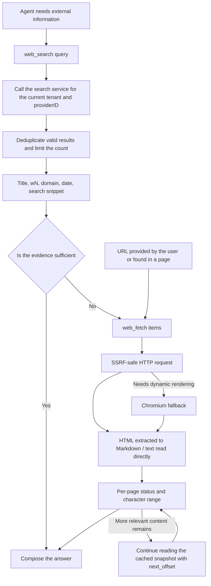

# Web Search and Web Scraping

Web search supplements the information available outside the knowledge base. The Agent finds results with `web_search`, then reads page bodies with `web_fetch`. You can connect a search service or deploy SearXNG yourself.

Under "Settings → Web Search", pick a provider, fill in the credentials and test the connection, then select that search configuration in the Agent. The number of search results is bounded by the Agent's maximum results setting.

## Supported Search Engines

Engines are registered in `registerWebSearchProviders` in `internal/container/container.go`:

```go
registry.Register("duckduckgo", infra_web_search.NewDuckDuckGoProvider)
registry.Register("google", infra_web_search.NewGoogleProvider)
registry.Register("bing", infra_web_search.NewBingProvider)
registry.Register("tavily", infra_web_search.NewTavilyProvider)
registry.Register("ollama", infra_web_search.NewOllamaProvider)
registry.Register("baidu", infra_web_search.NewBaiduProvider)
registry.Register("searxng", infra_web_search.NewSearxngProvider)
registry.Register("keenable", infra_web_search.NewKeenableProvider)
registry.Register("zhipu", infra_web_search.NewZhipuProvider)
registry.Register("exa", infra_web_search.NewExaProvider)
registry.Register("metaso", infra_web_search.NewMetasoProvider)
registry.Register("bocha", infra_web_search.NewBochaProvider)
registry.Register("brave", infra_web_search.NewBraveProvider)
registry.Register("serply", infra_web_search.NewSerplyProvider)
```

| Engine | Source File | API Key Required | Endpoint | Notes |
|------|---------|-----------------|------|------|
| DuckDuckGo | `duckduckgo.go` | No | HTML scraping first, API as fallback | Free; supports `proxy_url` |
| Google | `google.go` | Yes (also requires `engine_id`) | Google Custom Search API (official SDK `customsearch/v1`) | |
| Bing | `bing.go` | Yes | `https://api.bing.microsoft.com/v7.0/search` (hardcoded) | |
| Tavily | `tavily.go` | Yes | `https://api.tavily.com/search` (hardcoded) | |
| Ollama Web Search | `ollama.go` | Yes | `https://ollama.com/api/web_search` (hardcoded) | Up to 10 results |
| Baidu Qianfan AI Search | `baidu.go` | Yes | `https://qianfan.baidubce.com/v2/ai_search/web_search` (hardcoded) | |
| SearXNG | `searxng.go` | No | Tenant-supplied `base_url` (self-hosted instance) | The only engine allowing a custom address, subject to SSRF validation |
| Keenable | `keenable.go` | Optional | `https://api.keenable.ai` (hardcoded) | Without a key, uses a public rate-limited endpoint; with a key, rate limits are lifted |
| Zhipu Search | `zhipu.go` | Yes | `https://open.bigmodel.cn/api/paas/v4/web_search` (hardcoded), default engine `search_std` | |
| Metaso | `metaso.go` | Yes | `https://metaso.cn/api/v1/search` | extra_config.scope selects the resource scope, default webpage |
| Exa | `exa.go` | Yes | `https://api.exa.ai/search` | Highlights by default; use extra_config.include_text to get the body text |
| Bocha | `bocha.go` | Yes | `https://api.bochaai.com/v1/web-search` | extra_config.freshness, summary |
| Brave Search | `brave.go` | Yes | `https://api.search.brave.com/res/v1/web/search` | Supports per-call country/freshness |
| Serply | `serply.go` | Yes | `https://api.serply.io/v1/search` | Google results; supports per-call country/freshness (pd/pw/pm/py only) |

14 engines are currently registered.

| Provider extra config | Values |
| --- | --- |
| Metaso scope | webpage (default), document, scholar, podcast, video, image |
| Exa include_text | String boolean, e.g. `"true"`; body text is not fetched by default |
| Bocha freshness | noLimit (default), oneDay, oneWeek, oneMonth, oneYear |
| Bocha summary | A summary is requested by default; set to `"false"` to turn it off |
| Brave per-call filters | country/freshness are `web_search` tool parameters, see below; their values differ from the fields in Bocha's fixed configuration |
| Serply per-call filters | Same as Brave; country maps to Google's gl, freshness only accepts pd/pw/pm/py and does not support date ranges |

Except for SearXNG, all engine endpoints are hardcoded and cannot be configured by tenants — this is the first line of defense against SSRF (source comment: `Not configurable by tenants — prevents SSRF`).

## Search Engine Configuration (Provider Entity)

Each workspace can create multiple search engine configuration instances (e.g. "Production Bing", "Test Google"), stored as `WebSearchProviderEntity` (`internal/types/web_search_provider.go`) in the `web_search_providers` table, referenced by the Agent via ID. The parameter structure `WebSearchProviderParameters`:

| Name | Type | Default | Description |
|------|------|--------|------|
| `api_key` | string | empty | Search service key, encrypted with AES-GCM before storage; can only be modified via the `/credentials` subresource, never returned in responses |
| `engine_id` | string | empty | Required only for Google Custom Search |
| `base_url` | string | empty | SearXNG only: self-hosted instance address; validated via `utils.ValidateURLForSSRF`, internal addresses must be added to `SSRF_WHITELIST` |
| `proxy_url` | string | empty | Optional outbound HTTP/HTTPS proxy (tunnels traffic only, does not replace the API endpoint), also subject to SSRF validation |
| `extra_config` | map[string]string | nil | Provider-specific parameters, such as Metaso scope, Exa include_text, Bocha freshness/summary |

CRUD routes (`RegisterWebSearchProviderRoutes`, `internal/router/routes_infra.go`): create/read/update/delete under `/web-search-providers`, `POST /test` (probes the connection with unsaved parameters), `POST /:id/test` (tests a saved configuration), `PUT /:id/credentials` and `DELETE /:id/credentials/:field`; the test and write operations all require Admin. There's also `GET /web-search/providers`, which returns the catalog of available engine types. See the [Infrastructure API](../04-api/02-api-infra.md) for the full interface.

## Agent Search and Page Reading

`web_search` discovers sources, and `web_fetch` reads the selected pages. When the user names a web page, the Agent can read it directly; when the user asks for external or real-time information, it can search directly. Whether the knowledge base needs to be searched depends on task relevance and the tools currently available; calling `search_knowledge` first is no longer mandatory.



### web_search

Example calls:

```json
{"query":"Python release notes","count":5}
{"query":"Rust release notes","country":"DE","freshness":"pw","content":true}
```

- `count` sets the number of results, ranging from 1 to the maximum results configured for the current Agent (at most 20); when omitted, the existing Agent default applies.
- `country` / `freshness` take effect through the Brave and Serply providers. Country accepts a two-letter code or `ALL`; freshness accepts `pd` / `pw` / `pm` / `py` or `YYYY-MM-DDtoYYYY-MM-DD`. When `country` is omitted, the parameter is not sent to Brave (Brave itself defaults to US); an explicit `ALL` means global results. Serply's `country` maps to Google's `gl` (when omitted or `ALL`, `gl` is not sent and Google decides the region), and `freshness` only accepts `pd` / `pw` / `pm` / `py`. Other providers don't support these filters yet; passing them explicitly returns an error instead of being silently ignored. For parameter values, see the [official Brave API documentation](https://api-dashboard.search.brave.com/api-reference/web/search/get).
- `content` is off by default. When set to `true`, the body text of the top 3 results is fetched in parallel (a 15-second budget for the whole batch, an excerpt of at most 5,000 characters per page); the remaining results keep their search snippets, and `web_fetch` is needed to read those pages. A failed fetch still keeps the snippet; the full body text location is returned via `full_output_path`. Search and standalone `web_fetch` share the snapshots of the current turn, and a short timeout won't cancel a shared fetch that is in progress.
- Brave's relative `age` is kept as-is, to avoid faking "2 days ago" into a precise publication date.
- Empty queries, invalid URLs and duplicate results are removed; the maximum result count comes from the Agent configuration, capped at 20.
- Agent search no longer calls `CompressWithRAG`, does not create a temporary knowledge base, and does not depend on embedding/rerank models or temporary state in Redis. The RAG compression configuration of the chat quick-answer pipeline is still handled by that pipeline.
- The model output contains the title, domain, available date and the wN page ID. Snippets and provider content are marked as search evidence not verified against the page; each passage is at most 1,500 characters, with an evidence budget of 16,000 characters for the whole batch.

### web_fetch

Example call:

```json
{"items":[{"url":"w1"},{"url":"https://example.com/guide","limit":4000}]}
```

- Accepts known wN page IDs as well as HTTP(S) URLs provided by the user or found in pages. Short IDs are restored at the model context boundary; the UI and persisted results keep the real URL.
- The `prompt` parameter has been removed; the tool schema only exposes `url`, `offset` and `limit`. A second model is no longer called for summarization — the main Agent analyzes the page body directly.
- HTML body text is first extracted with Readability; on success the full extraction result is converted directly, and only on failure does it fall back to main/article/body, avoiding the loss of adjacent paragraphs from a second selection of inner `.content` nodes. After conversion to Markdown, headings, paragraphs, links, tables and code are preserved. Relative links are resolved against the final HTTP URL; embedded resources are not downloaded automatically.
- Plain text, Markdown and JSON/XML are read directly, so `<...>` isn't dropped as HTML. Binary formats are explicitly reported as `unsupported_content`.
- HTTP comes first, and the existing Chromium fallback for dynamic pages is kept. Network requests still go through the shared SSRF validation, the safe client and DNS pinning.
- At most 8 items per batch; items with the same normalized URL, offset and limit are deduplicated. Each item independently returns `success` / `failed` / `skipped`, and partial failures keep the successful body text.
- `offset` is a 0-based Unicode character offset; `limit` defaults to and is capped at 8,000. The batch allocates body space according to the output budget and returns `offset`, `returned_chars`, `content_length` and `truncated`; when content remains, `next_offset` is returned.
- Continue reading with the same URL and `offset=next_offset`. The in-memory cache holds at most 8 page snapshots, used only for character-based continuation within this run; after a snapshot is evicted, the same full body text can still be read via the returned `full_output_path` without re-fetching the page. Legacy character-based continuation returns a retryable `snapshot_expired` when the cache has expired (re-fetch from offset 0, or use `read_file` instead), avoiding stitching together different versions of a page. Continuations within the same batch wait for the first fetch to finish.
- After fetching, the full Markdown is saved to the file storage of the tenant that owns the session, and a `full_output_path` in `web://...` format is returned. `read_file` can read these files across turns without enabling the sandbox. The body text is bound to the assistant message that produced it, and reads check the tenant, session owner, session, message and the web-page-specific binding; regular attachments cannot be read as web pages. They become inaccessible once the message or session is deleted, and the storage retention policy matches that of existing soft-deleted message attachments.
- A save failure doesn't discard body text that was already fetched: the result includes `storage_error`, and continuation is then limited to this turn's in-memory cache. A single saved Markdown file is capped at 8 MiB.
- `read_file`'s `offset` is a 1-based line number, `limit` is at most 2,000 lines, web page reads are capped at 50 KiB and remain subject to the Agent output budget. When an overly long single line is hit, `next_offset` and `next_line_offset` are returned; use `offset` plus `line_offset` to continue reading that line. This way an Agent without a sandbox doesn't need to run a shell either.
- The Agent's per-page download cap is 2 MiB; exceeding it reports `body_too_large`, rather than passing off silently truncated HTML as a complete page. The request timeout is still 60 seconds, and Agent fetches accept HTTP 2xx responses.
- Failures still return a stable error code and a retryable flag. Transient failures can reasonably be retried; for permanent failures the Agent can pick other relevant sources, and state the gap when evidence is insufficient. A whole-batch failure does not force research to stop, nor can it be treated as successful verification.
- When web access is turned off, neither tool is registered at runtime, regardless of whether a legacy `allowed_tools` lists them. Failed pages are no longer shown as successful web page citations.

The shared fetcher's quick-answer path keeps using `NewPipelineFetcher`: a 15-second timeout, a 100 KiB download cap, HTTP-only, and the original plain-text extraction.

## The Role of docker/searxng

SearXNG is a self-hosted meta search engine (aggregating multiple upstream engines). WeKnora packages it as a **default, API-key-free optional search backend** in the `searxng` / `full` profile of `docker-compose.yml`:

- `docker/searxng/settings.yml`: key customizations include enabling `json` in `search.formats` (the WeKnora backend uses `/search?format=json`), `server.limiter: false` (disables IP rate limiting, otherwise the backend would get throttled; re-enable it with an allowlist configured if deploying publicly), and `secret_key` is replaced by the entrypoint script using the `SEARXNG_SECRET` environment variable.
- The `searxng-init` helper container first copies the template into a dedicated volume, preventing SearXNG's entrypoint script from doing an in-place sed that would write the resolved secret back into the repository's working tree.
- The host port is controlled by `SEARXNG_PORT` (default 8888) and `SEARXNG_BIND` (default `127.0.0.1`). Don't set `SEARXNG_PORT` to the same value as `APP_PORT` (default 8080): on Linux, when both publish the same port, requests to `localhost:8080` may hit SearXNG first, and the login endpoint will return SearXNG's HTML 404.
- The application container adds the `searxng` hostname to the SSRF whitelist by default: `SSRF_WHITELIST_EXTRA=searxng,qdrant,...`, so tenants configuring `base_url: http://searxng:8080` works out of the box.
- Client timeout is 12s (`defaultSearxngTimeout`), slightly higher than SearXNG's `outgoing.max_request_timeout: 10.0`, so that a slow upstream engine surfaces as a SearXNG-side error rather than a client-side cancellation. `ValidateSearxngBaseURL` is shared between the "save" and "use" code paths, ensuring consistent configuration validation.

## Implementation and Extension Reference

### SSRF Protection for Outbound Requests

`NewSearchHTTPClient` in `internal/infrastructure/web_search/proxy.go` builds a unified secure HTTP client for all engines:

- `DialContext` uses `utils.SSRFSafeDialContext` (validates the target IP at dial time, preventing DNS rebinding);
- Each redirect hop is re-validated with `ssrfSafeRedirect` calling `ValidateURLForSSRF`, and exceeding the maximum hop count fails immediately;
- An explicit `proxy_url` must pass SSRF validation; if not configured, it falls back to `ProxyFromEnvironment`.

With `SSRF_DNS_WHITELIST_ONLY` enabled, the search service domains, the SearXNG hostname, and the domains of web pages that `web_fetch` reads must all be added to `SSRF_WHITELIST`; otherwise they are rejected before the DNS lookup. See the [Configuration Reference](../01-getting-started/04-configuration.md) for details.

### Interface Abstraction

Search capability is defined by two interface layers (`internal/types/interfaces/web_search.go`):

```go
// WebSearchProvider defines the interface for web search providers
type WebSearchProvider interface {
    Name() string
    Search(ctx context.Context, query string, maxResults int, includeDate bool) ([]*types.WebSearchResult, error)
}

// WebSearchService defines the interface for web search services
type WebSearchService interface {
    Search(ctx context.Context, providerID string, config *types.WebSearchConfig, query string) ([]*types.WebSearchResult, error)
    CompressWithRAG(ctx context.Context, sessionID string, tempKBID string, questions []string, ...) (...)
}
```

`internal/infrastructure/web_search/registry.go` maintains a registry mapping **provider type -> factory function**, with instances created at call time based on per-tenant parameters:

```go
type ProviderFactory func(params types.WebSearchProviderParameters) (interfaces.WebSearchProvider, error)

func (r *Registry) Register(id string, factory ProviderFactory)
func (r *Registry) CreateProvider(providerType string, params types.WebSearchProviderParameters) (interfaces.WebSearchProvider, error)
```

### How to Add a New Search Engine

1. Create a new `<engine>.go` file under `internal/infrastructure/web_search/`, implementing `interfaces.WebSearchProvider` (`Name()` + `Search()`), and provide a factory function `func New<Engine>Provider(params types.WebSearchProviderParameters) (interfaces.WebSearchProvider, error)`; official endpoints should be hardcoded as constants, and the HTTP client should be constructed with `NewSearchHTTPClient(timeout, params.ProxyURL)`.
2. Add a `WebSearchProviderType` constant in `internal/types/web_search_provider.go`.
3. Append `registry.Register("<engine>", infra_web_search.New<Engine>Provider)` at the registration point in `internal/container/container.go`.
4. If key/extra parameter validation is needed, add it in the web search provider service's parameter validation branch (refer to the shared validation pattern in `ValidateSearxngBaseURL`), and add display information to the frontend's `GET /web-search/providers` catalog.
5. Write unit tests using `httptest` to mock the upstream service, referencing `searxng_test.go` / `zhipu_test.go`.
