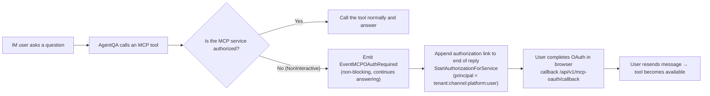
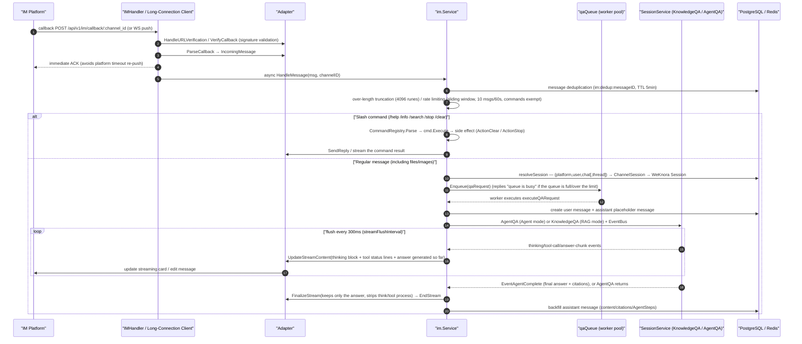

# IM Integration

IM Integration connects Agents to chat platforms such as WeCom, Feishu, DingTalk, Slack and Telegram. Users can ask the bot questions on the platform, and WeKnora runs retrieval and answers according to the bound Agent's configuration.

Under "Settings → IM Integration", create a new channel, select a platform, fill in the app credentials and bind an Agent, then enable it. Webhook mode requires filling the callback address into the platform's backend; long-connection mode doesn't need a public-facing callback address for receiving messages. Each channel can set its own "Reply Language", which pins the language the Agent replies in on that channel; when left empty, the deployment's default language is used.

<Screenshot
  src="/screenshots/im-channels.png"
  caption="IM channel configuration: platform, credentials, and bound Agent"
  hint="Shows the channel list and a channel's configuration form (platform type, credentials, bound Agent, callback address)." />

Supported platforms can also import received files into a knowledge base, and provide built-in commands such as `/help`. The exact behavior depends on platform capabilities and channel configuration.

## Supported Platforms and Capability Comparison

`validIMPlatforms` in `internal/handler/im.go` defines the 10 valid platforms. Per-platform capabilities (based on each `factory.go` and the adapters' compile-time assertions):

| Platform | Connection Mode (default in bold) | Streaming Reply (StreamSender) | File Download (FileDownloader) | Thread/Topic (ThreadID) | Main Credential Fields (credentials JSON) |
| --- | --- | --- | --- | --- | --- |
| WeCom `wecom` | **websocket** (Smart Bot long connection) / webhook (self-built app callback) | websocket mode only | Both modes supported | No | websocket: `bot_id`, `bot_secret`, `ws_endpoint`, `bot_name`; webhook: `corp_id`, `agent_secret`, `token`, `encoding_aes_key`, `corp_agent_id`, `api_base_url` |
| Feishu `feishu` | **websocket** (long-connection event stream) / webhook | Yes (streaming cards) | Yes | Yes (`root_id`; top-level messages use their own `message_id`) | `app_id`, `app_secret`, `verification_token`, `encrypt_key` |
| Lark `lark` | Same as Feishu (same adapter, `RegionLark` points to open.larksuite.com) | Yes | Yes | Yes | Same as Feishu |
| Slack `slack` | **websocket** (Socket Mode) / webhook (Events API) | Yes | Yes | Yes (`thread_ts`) | websocket: `app_token` + `bot_token`; webhook: `bot_token` + `signing_secret` |
| Telegram `telegram` | **websocket** (long polling via getUpdates) / webhook | Yes (message editing) | Yes | Yes (`message_thread_id` for Forum Topics) | `bot_token`; webhook also has `secret_token` |
| DingTalk `dingtalk` | **websocket** (Stream mode; the only mode supported since v0.8.2 — upgrade migration 000096 switches webhook channels to websocket, and Stream must be enabled in the DingTalk developer console) | Yes (AI cards) | Yes | No | `client_id`, `client_secret`, `card_template_id` |
| Mattermost `mattermost` | **webhook** (only supports Outgoing Webhook + REST API) | Yes | Yes | Yes (`root_id`) | `site_url`, `bot_token`, `outgoing_token` (required), `bot_user_id`, `post_to_main` |
| WeChat `wechat` (iLink bot) | **longpoll** (forced; on creation the backend forces `mode=longpoll`, `output_mode=full`) | No (only full output) | Yes | No | `bot_token`, `ilink_bot_id` (both required) |
| QQ Bot `qqbot` | **websocket** (only mode supported) | No | No | No | `app_id`, `client_secret`, `api_base_url`, `gateway_url` |
| Yunzhijia `yunzhijia` | **webhook** / websocket (WS address derived from `send_msg_url`) | No | Yes | Yes (top-level msgId / replies use replyRootMsgId) | `send_msg_url` (required), `secret`, `app_id`, `app_secret`, `allowed_webhook_host_suffix`, `timeout_seconds` |

## Built-in Command System

The command framework lives in `command.go` / `command_registry.go`: commands only declare intent (`CommandResult.Action`), while side effects are executed by the Service; `LooksLikeCommand` distinguishes a "command attempt" (`/help`) from path text that should pass through to QA (`/api/v2/users`) — the former replies "unknown command" if unregistered, while the latter proceeds normally into QA.

All commands registered in `NewService`:

| Command | Implementation File | Function | Side Effect |
| --- | --- | --- | --- |
| `/help [command name]` | `cmd_help.go` | Lists all available commands, or shows detailed usage for a specific command | None |
| `/info` | `cmd_info.go` | Shows info and capabilities of the currently bound Agent: Agent/RAG mode, the list of enabled knowledge bases (`KBSelectionMode` all/selected/none), Skills, MCP services, web search toggle, output mode | None |
| `/search <keyword>` | `cmd_search.go` | Performs a direct hybrid search (vector + keyword) across the knowledge bases reachable by the Agent, returning raw excerpts (**not AI-summarized**); shows up to 5 results, 200 runes each, with a match-percentage. Knowledge base scope is consistent with the QA pipeline's `resolveKnowledgeBasesFromAgent` (including Agent-mode capability filtering) | None |
| `/stop` | `cmd_stop.go` | Aborts the currently in-progress answer (can interrupt a long ReAct reasoning chain) | `ActionStop`: first removes the request from the queue or cancels the local in-flight request; then writes a stop event to the StreamManager (same mechanism as the Web UI's StopSession — supports **cross-instance** stopping via the `im:inflight:` mapping to look up sessionID/messageID); finally writes a Redis `im:stop:` marker as a fallback for requests that are "queued but not yet executed" |
| `/clear` | `cmd_clear.go` | Clears conversation memory | `ActionClear`: soft-deletes the current `ChannelSession`; the next message creates a brand-new WeKnora session |

## Group Chat and Direct Message Behavior

- `ChatType` is determined by the adapter: `direct` (direct message, empty `ChatID`) or `group`.
- **Feishu/Lark**: in group chats, the bot usually needs to be @-mentioned (group message text received via the long connection carries an `@_user_N` prefix, which the adapter strips in a loop before processing); replies in group chats prefer reply-in-thread (topic reply), and fall back to a plain message if the group doesn't support topics (error code 230071, etc. — see the fallback logic in `adapter.go`).
- **Slack**: group chat messages come from `AppMentionEvent` (@-mentioning the bot) as well as channel/group `MessageEvent`s (filtering out bot messages with a non-empty `BotID`, and non-`file_share` subtypes); replies are always posted in a thread (`thread_ts` for a top-level message uses its own timestamp).
- **Telegram**: `group`/`supergroup` are treated as group chats, with the `@botname` mention prefix stripped; replies include `reply_to_message_id`.
- **Mattermost**: the Outgoing Webhook trigger word must be the **first word** of the message, otherwise the callback parses to an empty message (there's targeted troubleshooting logging for this in `handler/im.go`); the `post_to_main` credential controls whether replies go to the main channel or the thread.
- Session isolation: in `user` mode, the same user in a "direct message" vs. "group A" vs. "group B" gets separate `ChannelSession`s (the key includes `chat_id`); in `thread` mode, all users within the same thread share a session.

## File Message Handling

Files and images are handled as QA attachments: document content is provided to the model, and images are recognized directly when the model supports it. As a result, the bot replies normally based on the attachment content even if the channel has no file knowledge base configured.

`knowledge_base_id` only determines whether attachments are additionally saved to a knowledge base. It must be a knowledge base in the channel's space (a restricted API key additionally requires it to be on its knowledge base allowlist); otherwise creating or updating the channel returns 400. Once configured, the save task runs in the background, doesn't affect the current QA reply, and doesn't send extra "ingested" or "parsing complete" messages. At most the first 500 lines of parsed text are kept, capped at 32 KiB; when either limit is hit, the model receives a generic truncation notice. When an attachment can't be read, the platform doesn't support downloading, or the file exceeds 32 MiB, the bot asks the user to describe it in text instead or to resend it.

## Image External Links in Replies (resource:// Rewriting)

When an answer references a knowledge-base image, the body text contains an internal reference like `resource://`, `local://`, or `minio://`, which IM clients can't fetch directly. `rewriteStorageURLs` (`internal/im/service.go`) rewrites these into an accessible http(s) URL before sending:

- If the resolved result is **not** http(s) (e.g. it's still an internal `storage://` path), the original reference is kept and an actionable WARN is logged, rather than sending a link to the IM side that's guaranteed to fail to load;
- A successful rewrite is logged at INFO level (including the signed URL, for troubleshooting — at the cost that anyone with log access could use that link within its validity window).

To get images displaying correctly, choose one of two options:

1. **Make the storage backend publicly reachable**: use a public endpoint for object storage (or set `MINIO_ENDPOINT` to a public host); `resource://` will fall back to the backend's presigned URL;
2. **Configure `APP_EXTERNAL_URL`**: `resource://` is rewritten to `<APP_EXTERNAL_URL>/r/<token>`, and the request is proxied back to the app via nginx's `location ^~ /r/`. The official frontend image already includes this location; a self-built reverse proxy must add it, or the request will fall through to the SPA fallback and return a blank page.

The default MinIO intranet deployment (`minio:9000`) and the `local` backend can only use the second option. If an IM channel is enabled but `APP_EXTERNAL_URL` is empty, `LoadAndStartChannels` prints a one-time startup warning (`imImageConfigWarning`).

If images still don't display, work through the troubleshooting table in [External Access to Images and Files](21-file-access.md) — it summarizes the four URL forms and how to obtain them for each channel.

## MCP OAuth Authorization Notification (Identity Binding)

In the IM scenario, there's no interactive frontend available to complete in-session OAuth authorization for MCP services, so:

- `withIMIdentity` tags the context with `MCPOAuthNonInteractive` — when the Agent encounters an unauthorized OAuth MCP service, it **doesn't block and wait**, but instead emits a one-time `EventMCPOAuthRequired` event;
- `handleMessageStream` collects these events (deduplicated by ServiceID); once the answer completes, `buildIMMCPAuthNotice` generates an authorization notice appended to the end of the reply: if `APP_EXTERNAL_URL` is configured and OAuthManager is available, a dedicated authorization link is generated for each service (callback address `<APP_EXTERNAL_URL>/api/v1/mcp-oauth/callback`, with the principal being `PrincipalIMUser` — i.e., authorization is bound to "tenant+channel+platform+IM user"); otherwise, the user is directed to complete authorization in the WeKnora admin console;
- After the user clicks the link and completes authorization, simply **resending the original message** lets them use that MCP service.



## Configuration and Runtime Reference

### Channel Model and Configuration (internal/im/types.go)

An `IMChannel` (table `im_channels`) binds a platform bot to an Agent:

| Field | Description |
| --- | --- |
| `AgentID` | The bound custom agent; answers follow that Agent's configuration (model, knowledge bases, Skills, MCP, web search) |
| `Platform` / `Mode` | Platform and connection mode. Defaults: mattermost/yunzhijia → `webhook`, wechat → `longpoll` (and forces `output_mode=full`), others → `websocket` |
| `OutputMode` | `stream` (default, streaming) or `full` (reply once with the complete answer) |
| `Locale` | Reply language: `zh-CN` / `en-US` / `ja-JP` / `ko-KR` / `ru-RU`; other values return 400. When empty (the default), `WEKNORA_LANGUAGE` is used, falling back to `zh-CN` when that isn't set. The `Accept-Language` header on IM callback requests comes from the platform rather than the person asking, so it plays no part in choosing the reply language |
| `KnowledgeBaseID` | Optional "file knowledge base." Whether or not it is configured, files/images are downloaded for QA to understand; when configured, they are additionally ingested in the background (see below) |
| `SessionMode` | `user` (default, maps sessions by platform+user+chat) or `thread` (maps by platform+thread+chat, with a new session for each top-level message) |
| `BotIdentity` | A unique bot identifier derived from platform+mode+credentials (`computeBotIdentity`, e.g. `feishu:<app_id>`, `telegram:<botID>`, `wecom:ws:<bot_id>`); a database unique index prevents the same bot from being configured on two channels (`checkDuplicateBot` returns a `duplicate_bot:`-prefixed error → HTTP 409) |
| `Credentials` | JSONB credentials. The list interface (`IMChannelSummary`) **never returns credential contents**, only a `credentials_configured` boolean |

`ChannelSession` (table `im_channel_sessions`) maps `(platform, user_id, chat_id, thread_id, tenant_id)` to a WeKnora `session_id`, providing conversation continuity on the IM side. If the underlying Session was deleted from the Web UI, `HandleMessage` detects `ErrSessionNotFound`, soft-deletes the stale mapping, and automatically rebuilds it (fixing the "bot permanently disconnected" issue in #1046, #1499).

#### Channel Management API (internal/handler/im.go + routes_agent.go)

| Method & Path | Description |
| --- | --- |
| `POST /api/v1/agents/:id/im-channels` | Create a channel for an Agent (validates platform legality, fills in default mode/output_mode) |
| `GET /api/v1/agents/:id/im-channels` | List an Agent's channels (excludes credentials) |
| `GET /api/v1/im-channels` | Cross-Agent channel overview within the tenant |
| `PUT /api/v1/im-channels/:id` | Partial update (name/mode/output_mode/locale/session_mode/knowledge_base_id/credentials/enabled/agent_id); passing an empty string for `knowledge_base_id` unbinds the file knowledge base |
| `DELETE /api/v1/im-channels/:id` | Delete |
| `POST /api/v1/im-channels/:id/toggle` | Enable/disable |
| `POST /api/v1/wechat/qrcode`, `POST /api/v1/wechat/qrcode/status` | WeChat (iLink) QR-code binding: generate a QR code and poll its status |
| `GET / POST /api/v1/im/callback/:channel_id` | **Platform callback address** (configured in each platform's backend under webhook mode; validated by the platform's own signature check, no WeKnora API Key needed) |

The webhook-mode setup consists of filling `https://<your-domain>/api/v1/im/callback/<channel_id>` into the platform's event subscription/callback address field. WeKnora first responds to the platform's URL verification challenge (`HandleURLVerification`, e.g. Feishu's challenge echo, WeCom's echostr decryption), after which every callback passes through `VerifyCallback` signature validation. WebSocket/long-connection mode doesn't need a public-facing callback address, since WeKnora actively connects to the platform's gateway.

#### Feishu/Lark Reverse Proxy

credentials.api_base_url overrides the API origin and is also used as the bootstrap domain of the long-connection SDK. When empty, the default Feishu/Lark cloud addresses are used respectively; on a private network you can set `https://feishu-proxy.example.com`, without appending a specific API path at the end. The proxy should forward both the platform API and the long-connection bootstrap requests, and the WebSocket address returned in the bootstrap response must also be reachable from the WeKnora server. Proxying only the web console does not solve server-to-Feishu network issues.

```json
{"platform":"feishu","mode":"websocket","credentials":{"app_id":"<app-id>","app_secret":"<app-secret>","api_base_url":"https://feishu-proxy.example.com"}}
```

With session_mode=thread, Yunzhijia reuses sessions per topic: a top-level message starts a new thread, and replies continue along the root message's thread. DingTalk rich-text messages have their readable content extracted; images in Feishu post messages go through image handling. output_mode=full can show the intermediate process and output progress, while answer_only keeps just the final answer.

#### Long-Connection Reliability: Leader Election and Supervisor

- **Multi-instance leader election** (`service.go`): for websocket/longpoll channels, in a multi-instance deployment (with Redis), `SETNX im:ws:leader:<channelID>` (TTL 15s, renewed every 5s) ensures **only one instance** maintains the long connection; non-leader instances retry the lock every 10s, and if the leader goes down, another instance takes over automatically. After a longpoll channel stops, it keeps the lock until it expires, letting the TTL run out naturally, to avoid brief double-writes between old and new instances. When renewal fails (leadership is lost), it goes through `handleWSLeadershipLoss`: first stopping this instance's adapter, then putting the channel back into the lock-retry loop — before retrying, it re-reads the channel row from the database, so a channel deleted, disabled, or reconfigured in the meantime won't be revived by the old runtime.
- **Connection keep-alive** (`RunSupervised` in `supervisor.go`): some SDKs' (DingTalk, Feishu) internal reconnection can end up in a state where the connection object exists but receives no messages. The Supervisor proactively rebuilds the connection every 6 hours (`defaultRecycleInterval`), and retries failed connections with a 5s backoff, bounding the worst-case downtime to the recycle interval.
- **Yunzhijia long connection** (`yunzhijia/websocket.go`): sends a heartbeat every 15s; if no data at all is received within 45s, the connection is deemed dead and reconnected; a single connection is proactively rebuilt after being held for at most 6 hours. Reconnects back off at 1s, 2s, 5s, 10s, 30s, 60s.

### Multi-Instance Deployment Notes

All distributed state is centrally defined as Redis key prefix constants in `service.go`:

| Redis Key | Purpose |
| --- | --- |
| `im:ws:leader:<channelID>` | WebSocket/long-polling channel leader election (TTL 15s, renewed every 5s, lock retry every 10s) |
| `im:dedup:<messageID>` | Cross-instance message deduplication (TTL 5min) |
| `im:stop:<userKey>` | Cross-instance /stop pre-execution marker (TTL 30s) |
| `im:inflight:<userKey>` | userKey → `sessionID:messageID` mapping, used for cross-instance /stop to write a StreamManager stop event |
| `im:queue:user:<userKey>` | Global per-user queue count |
| `im:ratelimit:<key>` | Sliding-window rate limiting (ZSET) |
| `im:global:active` | Global concurrent QA worker count (atomic Lua INCR+check, TTL 5min self-healing) |

Without Redis (Lite/single-instance mode), all of the above fall back to local in-memory implementations — functionality is unchanged, only the cross-instance semantics are lost.

### Message Processing Flow

Both `IMCallback` (webhook) and long-connection callbacks ultimately flow into `Service.HandleMessage`, then proceed through the queue into QA execution:



Key details (all in `service.go`):

- **Deduplication**: `MessageID` is written to Redis `im:dedup:` (TTL 5 minutes) or a local `sync.Map` (single-instance mode); callbacks re-pushed by the IM platform are simply skipped.
- **Rate limiting**: sliding-window rate limiting keyed by `channelID:userID:chatID[:threadID]` (default 10 messages within 60s, overridable via `config.IM`); **slash commands bypass rate limiting**, so a user can still `/stop` during a storm.
- **QA queue** (`qaqueue.go`): a bounded queue + fixed worker pool (default workers=5, queue cap 50, per-user queue cap 3, queue timeout 60s); across multiple instances, Redis counters implement a **global per-user cap** (`im:queue:user:`) and an optional **global concurrency gate** (`im:global:active` + Lua script, `GlobalMaxWorkers` config), applying backpressure to the downstream LLM. When the queue position is > 0, a "queued" notice is replied first.
- **Session resolution**: `user` mode shares a session per user, with titles like "John Doe · Group Chat 1a2b3c4d"; `thread` mode creates one session per top-level message/topic (Slack thread, Feishu topic group, Telegram Forum Topic, Mattermost root_id). The session title is generated asynchronously on the first message (`GenerateTitleAsync`).
- **Identity injection** (`withIMIdentity`): since IM callbacks go through platform signatures rather than WeKnora's login state, a synthetic identity is injected — `system-<tenantID>` + `PrincipalIMUser` (`tenantID:channelID:platform:userID`) + Viewer role — so that logic depending on UserID (e.g. organization-shared knowledge bases) works correctly; this also marks `MCPOAuthNonInteractive` (see [MCP OAuth Authorization Notification](#mcp-oauth-authorization-notification-identity-binding)).
- **Streaming rendering** (`handleMessageStream` + `think.go` + `tool_display.go`): subscribes to EventBus events `EventAgentThought` (thinking), `EventAgentToolCall`/`EventAgentToolResult` (tool status lines — internal tools are filtered via `isToolVisibleToUser`; Quick QA only shows the two RAG-pipeline tools `query_understand`/`knowledge_search`), `EventAgentFinalAnswer` (answer chunks), `EventAgentReferences` (citations), and `EventAgentComplete`. In Agent mode, an "optimistic answer" that's followed by another tool call gets **retracted** back into the thinking block (`retractAgentLiveAnswer`, consistent with the Web UI's superseded-preamble behavior). Buffered content is pushed as a whole block every 300ms (`UpdateStreamContent` uses replacement semantics); `holdbackCutoff` withholds incomplete `provider://` URLs, Markdown images, and XML tags that straddle chunk boundaries, to avoid flickering half-rendered content. The final `FinalizeStream` keeps only the answer text (`StripThinkBlocks`), strips out `<kb/>`, `<web/>` citation tags and `<image>` XML, and rewrites `provider://` storage URLs into accessible links (`cleanIMContent` / `rewriteStorageURLs`).
- **Stream finalization**: in Agent mode, either receiving `EventAgentComplete` or the AgentQA call returning (whichever comes first) ends the streaming reply, so the card doesn't get stuck on "Generating"; errors produced after the completion event are still collected and attached to the final reply. The answer stream of Quick QA (KnowledgeQA) is asynchronous, and the end of the stream is what counts. Feishu streaming cards stay active during long-running QA and are not reclaimed early by expiry cleanup.
- **Non-streaming path**: when a channel has `output_mode=full`, the adapter doesn't support `StreamSender`, or `StartStream` fails, it falls back to `runQA`, aggregating the complete answer and sending it once via `SendReply`.
- **Quoted messages** (`Quote`, currently populated by adapters such as WeCom's long connection): a quoted text message is wrapped in `<quoted_message>` and injected into the LLM context (capped at 500 runes, distinguishing "quoting the bot's own reply"); when quoting non-text content like images/files/videos, the injected content is an instruction explicitly telling the model it cannot view that content, preventing the model from guessing at content it can't read.

### Architecture Overview

#### Adapter Interface (internal/im/adapter.go)

Each platform adapter implements a unified `Adapter` interface, condensing platform differences into four methods:

```go
type Adapter interface {
    Platform() Platform
    // VerifyCallback validates the callback request's signature/token
    VerifyCallback(c *gin.Context) error
    // ParseCallback parses the platform's raw callback into a unified IncomingMessage (returns nil for non-message events)
    ParseCallback(c *gin.Context) (*IncomingMessage, error)
    // SendReply sends the reply back to the IM platform
    SendReply(ctx context.Context, incoming *IncomingMessage, reply *ReplyMessage) error
    // HandleURLVerification handles the platform's URL verification challenge
    HandleURLVerification(c *gin.Context) bool
}
```

Two **optional** extension interfaces determine platform capability differences:

- `StreamSender` — streaming replies (`StartStream` → `UpdateStreamContent` (whole-block replacement semantics) → `FinalizeStream` (keeps only the final answer, stripping thinking/tool process) → `EndStream`). Implemented by: Feishu/Lark (streaming cards), DingTalk (AI cards, requires `card_template_id`), Slack, Telegram (message editing), Mattermost, WeCom WebSocket mode.
- `FileDownloader` — downloads files/images sent by users from the platform (`DownloadFile`). Implemented by: all platforms except the QQ bot (both WeCom modes support it).

The unified message model `IncomingMessage` carries fields such as `Platform`, `MessageType` (`text`/`file`/`image`), `UserID`, `ChatID`, `ChatType` (`direct`/`group`), `Content`, `MessageID` (for deduplication), `FileKey`/`FileName`/`FileSize`, `ThreadID` (topic/thread ID), `Quote` (quoted message), and more.

#### Service Orchestration (internal/im/service.go)

`im.Service` is the message-processing hub, responsible for (as noted in the source comments):

1. Receiving the unified `IncomingMessage` from the Adapter;
2. Resolving or creating a WeKnora Session for that IM channel;
3. Dispatching slash commands first (these don't enter the QA pipeline);
4. Calling the WeKnora QA pipeline (`KnowledgeQA` / `AgentQA`) for normal messages;
5. Collecting the streamed answer and sending it back via the Adapter.

Platform adapters are registered through `AdapterFactory` (see `registerIMAdapterFactories` in `internal/container/container.go`):

```go
imService.RegisterAdapterFactory("wecom", wecom.NewFactory())
imService.RegisterAdapterFactory("feishu", feishu.NewFactory(feishu.RegionFeishu))
imService.RegisterAdapterFactory("lark", feishu.NewFactory(feishu.RegionLark)) // Lark shares the same adapter as Feishu, only the API domain differs
imService.RegisterAdapterFactory("slack", slack.NewFactory())
imService.RegisterAdapterFactory("telegram", telegram.NewFactory())
imService.RegisterAdapterFactory("dingtalk", dingtalk.NewFactory())
imService.RegisterAdapterFactory("mattermost", mattermost.NewFactory())
imService.RegisterAdapterFactory("wechat", wechat.NewFactory())
imService.RegisterAdapterFactory("qqbot", qqbot.NewFactory())
imService.RegisterAdapterFactory("yunzhijia", yunzhijia.NewFactory())
```

## Implementation Reference

- Core framework and orchestration: `internal/im/` (`adapter.go`, `service.go`, `supervisor.go`, `command*.go`, `qaqueue.go`, `session/stream/think/tool_display`, etc.)
- Per-platform adapters: `internal/im/{wecom,feishu,dingtalk,slack,telegram,mattermost,wechat,qqbot,yunzhijia}/`
- HTTP interface layer: `internal/handler/im.go`
- Routes: `RegisterIMRoutes` / `RegisterIMChannelRoutes` in `internal/router/routes_agent.go`
