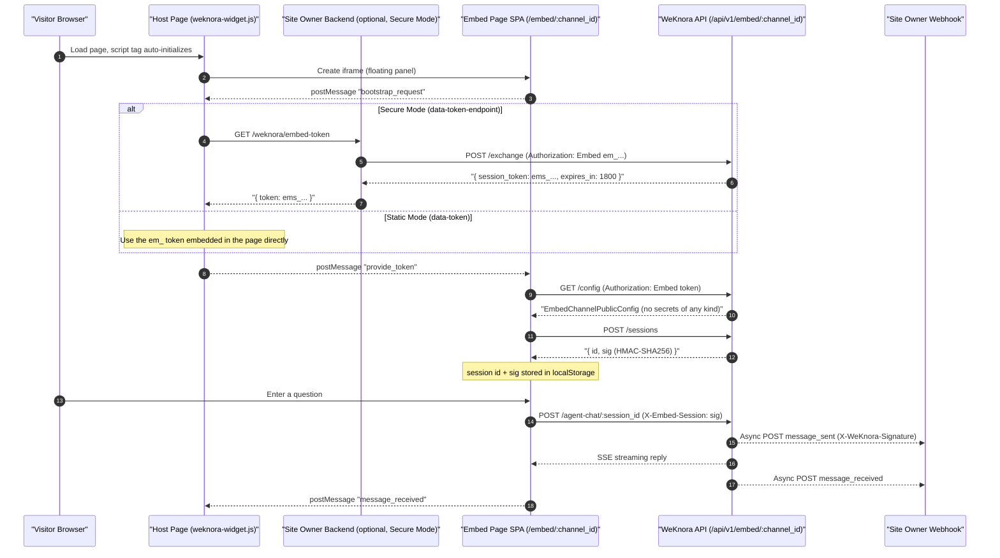

# Web Embed (Embed Channel)

Want to add an "Ask the docs" support widget to your own website or help center? Use the embed channel: create a channel in WeKnora and bind it to an Agent, get a `<script>` snippet to paste into your webpage, and visitors won't need a WeKnora account to chat.

Configuration path: "Settings → Web Embed" → create a new channel → bind an Agent → fill in the allowed embedding domain whitelist → copy the code snippet. Before going live, be sure to configure the domain whitelist and rate limiting properly, otherwise anyone could grab your channel address and burn through your model quota.

<Screenshot
  src="/screenshots/embed-channel.png"
  caption="Web embed channel: configuration, code snippet, and widget appearance"
  hint="Show the channel configuration (bound Agent, allowed domains, appearance settings) and the generated script snippet; if possible, also attach a screenshot of the widget expanded on a webpage." />

The following covers the entire chain: channel creation and configuration, public config delivery, anonymous sessions and token exchange, Origin validation, rate limiting, and optional webhook event callbacks.

Images on the visitor side go through a channel-scoped authentication proxy, different from the main site; if images don't display, see [External Access to Images and Files](21-file-access.md).

## Data Model

`EmbedChannel` in `internal/types/embed_channel.go` is the complete definition of a channel (table `embed_channels`, soft delete, with a partial unique index on `publish_token`):

```go
type EmbedChannel struct {
    ID                     string         // UUID primary key
    TenantID               uint64         // owning tenant
    AgentID                string         // bound Agent (default builtin-quick-answer)
    Name                   string         // channel name
    Enabled                bool           // whether enabled
    PublishToken           string         // long-lived publish token, "em_" prefix
    AllowedOrigins         JSON           // list of allowed origins (JSONB)
    WelcomeMessage         string         // welcome message
    RateLimitPerMinute     int            // per-IP rate limit per minute (default 30)
    RateLimitPerDay        int            // channel-level daily rate limit (default 10000)
    PrimaryColor           string         // theme color
    PageTitle              string         // page title
    HeaderTitleMode        string         // "channel" | "session"
    ShowSuggestedQuestions bool           // suggested questions toggle
    WidgetPosition         string         // widget position
    AllowWebSearch         bool           // allow web search
    AllowFileUpload        bool           // allow file/image upload
    DefaultLocale          string         // default locale
    WebhookURL             string         // outbound webhook (HTTPS)
    WebhookSecret          string         // HMAC-SHA256 signing secret
    ...
}
```

### Channel Configuration Options

When creating/updating a channel (`embedChannelRequest` in `internal/handler/embed_channel.go`), the following can be configured:

| Option | Type | Default | Description |
| --- | --- | --- | --- |
| `name` | string | — | Channel display name |
| `enabled` | bool | `true` | Channel toggle; when off, all public endpoints deny access |
| `agent_id` | string | `builtin-quick-answer` | Bound Agent, determines knowledge base scope and conversational capability |
| `allowed_origins` | string[] | — | **At least one required**. Supports three forms: full `http(s)://` Origin, subdomain wildcard `*.example.com`, full wildcard `*` (allowed only in development mode, rejected in production) |
| `welcome_message` | string | empty | Welcome message shown when the widget is opened |
| `rate_limit_per_minute` | int | `30` | Per-IP request limit per minute |
| `rate_limit_per_day` | int | `10000` | Channel-level total daily request limit |
| `primary_color` | string | — | Widget theme color (CSS color value, e.g. `#0052d9`) |
| `page_title` | string | empty | Browser title of the embed page |
| `header_title_mode` | string | `channel` | Title mode: `channel` (fixed channel name) / `session` (auto-generated per session) |
| `show_suggested_questions` | bool | `true` | Whether to show suggested questions |
| `widget_position` | string | `bottom-right` | `bottom-right` \| `bottom-left` \| `top-right` \| `top-left` |
| `allow_web_search` | bool | `false` | Whether the visitor side has a web search toggle |
| `allow_file_upload` | bool | `false` | Whether the visitor side can upload images/files |
| `default_locale` | string | empty (follows browser) | `zh-CN` \| `en-US` \| `ko-KR` \| `ru-RU` |
| `webhook_url` | string | empty | Event callback address, **must be HTTPS and pass SSRF validation** (internal/link-local addresses forbidden) |
| `webhook_secret` | string | empty | Webhook signing secret (never echoed back in API responses) |

## Management API (Requires Login Authentication)

Registered by `RegisterEmbedChannelRoutes` (`internal/router/router.go`), supports the `ManageChannels` capability for API Keys:

| Method | Path | Permission | Description |
| --- | --- | --- | --- |
| POST | `/api/v1/agents/:id/embed-channels` | Admin | Create a channel for an Agent |
| GET | `/api/v1/agents/:id/embed-channels` | Viewer | List channels for an Agent |
| GET | `/api/v1/embed-channels` | Viewer | List all channels for the tenant |
| GET | `/api/v1/embed-channels/:channel_id` | Viewer | Channel details (including `publish_token`) |
| PUT | `/api/v1/embed-channels/:channel_id` | Admin | Update channel configuration |
| DELETE | `/api/v1/embed-channels/:channel_id` | Admin | Delete channel (soft delete) |
| POST | `/api/v1/embed-channels/:channel_id/rotate-token` | Admin | Rotate `publish_token` (old token and all issued session signatures are immediately invalidated) |
| POST | `/api/v1/embed-channels/:channel_id/preview-session` | Viewer | Issue a short-lived preview session token (for previewing the widget in the admin console) |
| GET | `/api/v1/embed-channels/:channel_id/stats` | Viewer | Channel session statistics |

## Public API (Anonymous Access, Embed Authentication)

Registered by `RegisterEmbedPublicRoutes` under the `/api/v1/embed/:channel_id` prefix, all routes go through the `middleware.EmbedAuth` middleware (token validation + Origin validation + rate limiting):

```go
embed := r.Group("/api/v1/embed/:channel_id", middleware.EmbedAuth(embedService, tenantService, redisClient))
{
    embed.POST("/exchange", embedHandler.ExchangeEmbedSession)
    embed.GET("/config", embedHandler.GetEmbedConfig)
    embed.GET("/suggested-questions", embedHandler.GetEmbedSuggestedQuestions)
    embed.GET("/chunks/:chunk_id", embedHandler.GetEmbedChunk)
    embed.POST("/sessions", embedHandler.CreateEmbedSession)
    embed.POST("/knowledge-chat/:session_id", embedHandler.EmbedKnowledgeChat)
    embed.POST("/agent-chat/:session_id", embedHandler.EmbedAgentChat)
    embed.GET("/messages/:session_id/load", embedHandler.EmbedLoadMessages)
    embed.POST("/sessions/:session_id/stop", embedHandler.EmbedStopSession)
    embed.POST("/sessions/:session_id/events", embedHandler.EmbedRelayWebhookEvent)
    // routes for message suggested questions, MCP OAuth, tool approval, file serving, etc. omitted
    embed.GET("/files", newFileServeHandler(...))
}
```

### Public Config Delivery

`GET /api/v1/embed/:channel_id/config` returns `EmbedChannelPublicConfig` (`internal/types/embed_channel.go`) — containing only the display and capability information needed to render the widget:

- Delivered: `channel_id`, `name`, `display_title` (resolved server-side in the order `PageTitle → Name → AgentName → "AI Assistant"`), `agent_id/agent_name/agent_avatar`, `knowledge_base_ids`, `welcome_message`, `primary_color`, `header_title_mode`, `show_suggested_questions`, `widget_position`, `allow_web_search`, `allow_file_upload`, `agent_web_search_enabled`, `agent_image_upload_enabled`, `default_locale`, etc.;
- **Never delivered**: `publish_token`, `webhook_url`, `webhook_secret`.

## Authentication and Anonymous Sessions

### Two Types of Tokens

| Token | Prefix | Lifetime | Purpose |
| --- | --- | --- | --- |
| Publish Token | `em_` | Long-lived (until rotated) | Channel publish token, can be embedded directly in the page (static mode), or kept only in the site owner's backend (secure mode) |
| Session Token | `ems_` | **30 minutes** (Redis TTL) | Short-lived token exchanged from the publish token via `/exchange`, used on the browser side |

All public endpoints carry the token via the `Authorization: Embed <token>` request header (**query string is not accepted**). The `EmbedAuth` middleware (`internal/middleware/embed_auth.go`) executes in sequence:

1. Look up the channel by `channel_id`, validate that the token matches `publish_token`, or look it up as a session token in Redis (key `embed:session:{token}`) and verify it belongs to this channel;
2. Validate the channel is `enabled`;
3. Validate that the request `Origin` matches `allowed_origins` (an empty list rejects everything; `*` only in development mode; `*.example.com` suffix wildcard; otherwise exact match, case-insensitive);
4. Rate limiting (Redis Lua script, sliding window):
   - Per-IP ≤ `RateLimitPerMinute` per minute;
   - Channel-wide ≤ `max(RateLimitPerMinute × 20, 120)` per minute — prevents attackers from rotating IPs to bypass the per-IP limit;
   - Channel daily total ≤ `RateLimitPerDay`.

### Token Exchange (Core of Secure Mode)

`POST /api/v1/embed/:channel_id/exchange`, request header `Authorization: Embed em_xxx` (**only accepts publish token**, session tokens are rejected). Response:

```json
{ "success": true, "data": { "session_token": "ems_...", "expires_in": 1800 } }
```

See `IssueSessionToken` in `internal/application/service/embed_session.go` for the implementation: a random 32-byte base64 value with an `ems_` prefix, written to Redis with a 30-minute TTL.

### Anonymous Session Establishment

`POST /api/v1/embed/:channel_id/sessions` creates a chat session, returning:

```json
{ "success": true, "data": { "id": "<session_uuid>", "sig": "<HMAC-SHA256 base64>" } }
```

- The session is written to the `sessions` table, with `Description` marked as `embed_channel:{channel_id}`, and `UserID` uses an opaque visitor identifier generated by `EmbedSessionPrincipal(tenantID, channelID, sessionID).StorageID()`;
- `sig` is the **session signature**: `HMAC-SHA256(channel.PublishToken, "{channel_id}|{session_id}")`. From then on, every access to `/sessions/:session_id/*` must carry the request header `X-Embed-Session: <sig>`, which the server compares in constant time (`internal/handler/embed_channel.go`). This prevents impersonating someone else's session using only the session_id; rotating the publish token invalidates all signatures at once.

The frontend can also attach `X-Embed-Visitor: <uuid>` for per-visitor statistics. The session id and sig are cached to `localStorage` keyed by channel, so the session is restored directly on page refresh (`frontend/src/composables/useEmbedBridge.ts`).

## Webhook Callbacks

Channels configured with `webhook_url` will POST JSON to the site owner's backend on the following events (`internal/application/service/embed_webhook.go`):

| Event | Trigger | Payload Fields |
| --- | --- | --- |
| `message_sent` | Visitor sends a question | `type`, `channel_id`, `session_id`, `timestamp`, `query` |
| `message_received` | Assistant finishes replying | `type`, `channel_id`, `session_id`, `timestamp`, `content` |

Security and delivery semantics:

- When `webhook_secret` is configured, a signature header `X-WeKnora-Signature: sha256=<hex(HMAC-SHA256(secret, raw_body))>` is attached;
- The URL must be HTTPS; outbound requests go through an SSRF-safe client (re-validated on each redirect, up to 5 hops), with a 5-second timeout and a User-Agent of `WeKnora-Embed-Webhook/1.0`;
- Delivery is asynchronous best-effort; failures are only logged, **not retried**;
- The frontend can also explicitly forward events via `POST /api/v1/embed/:channel_id/sessions/:session_id/events`.

## Frontend Widget Integration

The widget SDK is a dependency-free loader script `frontend/public/weknora-widget.js` (served from the WeKnora service root path after deployment), responsible for rendering the floating button + iframe panel; the iframe points to the embed page SPA `/embed/{channel_id}` (entry point `frontend/src/embed-main.ts`).

### Method 1: Static Token Mode (Simplest, Token Exposed in the Page)

```html
<script
  src="https://your-weknora.example.com/weknora-widget.js"
  data-channel="your-channel-UUID"
  data-token="em_your_publish_token"
  data-position="bottom-right"
  data-primary-color="#07C05F"
  data-title="AI Assistant"
></script>
```

The publish token is written directly in the page HTML, visible to any visitor; rotating the token requires updating all deployed pages in sync. Suitable for internal sites or low-sensitivity scenarios.

### Method 2: Secure Mode (Recommended)

The publish token is kept only in the site owner's own backend; the page points via `data-token-endpoint` to an exchange endpoint on the site owner's backend:

```html
<script
  src="https://your-weknora.example.com/weknora-widget.js"
  data-channel="your-channel-UUID"
  data-token-endpoint="https://your-backend.example.com/weknora/embed-token"
  data-position="bottom-right"
></script>
```

The site owner's backend implements this endpoint: the server holds the `em_` token, calls `POST /api/v1/embed/{channel_id}/exchange` to exchange it for an `ems_` short-lived token, and returns `{ "token": "ems_...", "expiresIn": 1800 }`. The widget automatically refreshes the token at about 80% of the TTL (no earlier than 30 seconds) (see `scheduleRefresh` in `weknora-widget.js`). **The publish token never reaches the browser.**

Other optional attributes: `data-base-url` (derived from the script src by default), `data-width` / `data-height` (panel dimensions, default 400×600), `data-sandbox` (iframe sandbox policy; when embedding cross-origin, `allow-scripts allow-forms allow-popups allow-modals allow-same-origin` is added automatically).

### Method 3: Programmatic API

```html
<script src="https://your-weknora.example.com/weknora-widget.js"></script>
<script>
  WeKnora.init({
    channel: 'channel-UUID',
    tokenEndpoint: 'https://your-backend.example.com/weknora/embed-token', // or token: 'em_...'
    position: 'bottom-right',
    primaryColor: '#07C05F',
    title: 'AI Assistant',
    baseUrl: 'https://your-weknora.example.com',
  });
  WeKnora.setContext({ userId: 'u_123', page: location.pathname }); // context is injected with every question
  WeKnora.setLocale('en-US');
  WeKnora.openWithQuery('How do I reset my password?');   // open the panel and automatically send the question
  WeKnora.on('ready', () => console.log('widget ready'));
  // others: WeKnora.open() / close() / toggle() / destroy() / off(event, fn)
</script>
```

### Direct iframe Integration

You can also embed an iframe directly without the loader (in this case the token must be provided via URL/postMessage, generally the loader is recommended instead):

```html
<iframe src="https://your-weknora.example.com/embed/channel-UUID"
        width="400" height="600" style="border:none"></iframe>
```

### postMessage Bridge Protocol

The host page (loader) and the embedded page within the iframe communicate via `postMessage`, with both sides performing strict Origin validation (the loader only sends messages to the derived `embedOrigin`, never using `*`; the embed page pins the origin on the first trusted message — see `frontend/src/composables/useEmbedBridge.ts`):

- Host → iframe (`source: "weknora-host"`): `provide_token` (deliver token), `set_context`, `set_locale`, `open_with_query`;
- iframe → Host (`source: "weknora-embed"`): `ready`, `bootstrap_request` (request token), `message_sent`, `message_received`.

## End-to-End Sequence



## Security Summary

- **Origin whitelist**: when `allowed_origins` is empty, all requests are rejected; `*` wildcard is only available in development mode; `*.example.com` subdomain wildcard is supported.
- **Dual-token system**: in secure mode, the publish token never leaves the server; the browser only holds a 30-minute short-lived `ems_` token.
- **Session signature**: the `X-Embed-Session` HMAC signature binds the session to the (channel, session, current publish token) triple; rotating the token revokes all of them at once.
- **Three-tier rate limiting**: per-IP/minute, per-channel/minute (20× per-IP, floor of 120), per-channel/day, implemented atomically with Redis Lua.
- **Webhook SSRF protection**: HTTPS only, internal addresses rejected, redirect validated hop by hop, 5-second timeout.

## Implementation Reference

To locate the source when reading it, use the table below (paths relative to the repository root):

| Layer | File |
| --- | --- |
| Data structures | `internal/types/embed_channel.go` |
| HTTP Handler | `internal/handler/embed_channel.go` |
| Channel service | `internal/application/service/embed_channel.go` |
| Anonymous session/token | `internal/application/service/embed_session.go` |
| Webhook dispatch | `internal/application/service/embed_webhook.go` |
| Auth middleware | `internal/middleware/embed_auth.go` |
| Route registration | `internal/router/router.go` (`RegisterEmbedPublicRoutes` / `RegisterEmbedChannelRoutes`) |
| Widget loader (SDK) | `frontend/public/weknora-widget.js` |
| Embed page SPA entry | `frontend/src/embed-main.ts`, `frontend/src/composables/useEmbedBridge.ts`, `useEmbedChatSession.ts` |
| Database migration | `migrations/versioned/000060_embed_channels.up.sql` |
