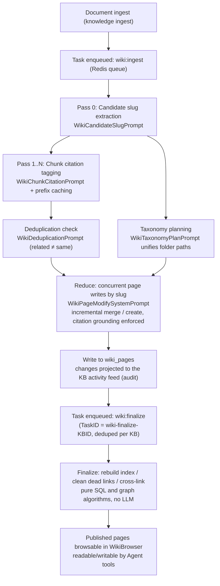

# Wiki Capability

Wiki organizes knowledge base material into interlinked Markdown pages. Once documents are ingested, the model extracts entries such as people, products, and concepts, and generates pages with source citations, making it easy to browse by topic.

Users can edit generated pages directly, view historical versions, and roll back. Agents can also read and maintain pages through the Wiki tools; the access scope is still determined by knowledge base permissions.

<Screenshot
  src="/screenshots/wiki-browser.png"
  caption="Wiki browser: folder tree on the left, generated entry pages and sources on the right"
  hint="Shows the folder tree grouped by type on the left, an entity page's body, in-page wiki links, and source document citations." />

## Enabling and Browsing the Wiki {#how-to-enable-it}

1. Edit the knowledge base → open **Wiki** under "Indexing Strategy";
2. Upload documents (existing documents are included too — no need to re-upload);
3. Wait for generation. Wiki generation is asynchronous and can take a while when there are many documents; the knowledge base breadcrumb shows an "Indexing" indicator;
4. Once done, go to the knowledge base's **Wiki** tab to browse; the **Graph** tab shows the link relationships between entries.

Wiki generation adds model calls, and usage depends on document volume and extraction density. You can choose `focused`, `standard`, or `exhaustive` in the knowledge base's Wiki configuration; see [Extraction Granularity](#extraction-granularity) for details.

<Screenshot
  src="/screenshots/wiki-graph.png"
  caption="Wiki graph view: link relationships between entries"
  hint="Shows the graph overview mode, with nodes colored by page type, clickable to jump to a specific page." />

## Editing and Rolling Back Pages

After editing the body of a Wiki page, you can view its version history and compare changes. History records distinguish auto-generated, Agent, manual-edit, and revert sources. Rolling back creates a new version with the selected historical content, and the version number keeps increasing.

The system cleans up old auto-generated versions first: prunable snapshots are cleaned up once there are 50 historical versions, and all sources are cleaned up at the hard cap of 200. Content that needs to be kept long-term should be archived separately. Versions written before the upgrade, or versions that have already been cleaned up, have no snapshot: when you select such a version, the history panel shows a notice instead of a diff; when the comparison baseline is missing, the full text of the selected version is shown directly. Comparing and rolling back other versions is unaffected.

## Viewing Changes and Generation Status

Records of page creation, updates, deletion, and batch generation are all shown under "Knowledge Base → Settings → Activity." You can check the indexing status while documents are being processed; after a service restart, the system recovers persisted pending Wiki tasks. When a knowledge base is deleted, its Wiki pages, folders, issues, and version history are cleaned up with it. For API compatibility and the recovery mechanism, see the reference sections.

## Version and Runtime Reference

### Manual Editing and Version History

Wiki pages support manual editing and version rollback, so users can correct generated content and see each version's source, actor, and time. Version records were introduced by migration `000075`.

#### Version Source and Actor {#who-made-each-version}

`wiki_pages` carries two provenance fields; `last_edit_source` marks the author type of the **current version**:

| `edit_source` | Meaning |
| --- | --- |
| `pipeline` | Written by the wiki generation pipeline (legacy rows with an empty string are treated as `pipeline`) |
| `agent` | Written by the Agent via tools like `wiki_write_page` / `wiki_replace_text` |
| `user` | Edited manually in the editor |
| `revert` | A version produced by a revert |

The paired `last_editor_id` records who performed the action (empty when written by the background pipeline). The UI uses this to show the edit source of each version.

#### Snapshots and Rollback

- Before a page is overwritten, the **old version** is first snapshotted in full into `wiki_page_revisions` (title, body, summary, page type, status, aliases, plus that version's author and timestamp); only the current version lives in `wiki_pages`. A unique index on `(page_id, version)` combined with `ON CONFLICT DO NOTHING` makes the "snapshot then update" write path idempotent under retries;
- `GET /revisions/*slug` lists historical versions (newest first, body excluded, with the current version number attached); `?version=N` fetches that version's full text, for diffing;
- `POST /revert` with `{slug, version}` reverts. Reverting creates a new version using the target version's content, the version number keeps increasing, and `edit_source` is set to `revert`, so a revert can itself be reverted. Reverting to the current version returns 400 (usually meaning the frontend is working from a stale history list).

#### History Retention Policy

Version history is cleaned up against a two-tier cap (`internal/types/wiki_page.go`):

- **Soft cap of 50 versions**: only prunes "prunable" snapshots — those written by `pipeline` and legacy empty-source rows;
- **Hard cap of 200 versions**: prunes regardless of author, ensuring even a page maintained purely by hand has bounded storage.

Until the hard cap is reached, the system cleans up auto-generated history first and keeps manual edit records.

<Screenshot
  src="/screenshots/wiki-revision-history.png"
  caption="Wiki page version history: version list broken down by source, with a revert entry point"
  hint="Shows the history drawer for a wiki page, including version number, edit source (pipeline/manual/Agent/revert), editor, and timestamp, plus compare/revert buttons." />

### Operation History (Knowledge Base Activity Feed)

Wiki used to maintain its own operation log (the `wiki_log_entries` table + `GET /wiki/log` endpoint + a log tab in WikiBrowser). This feed overlapped with the knowledge base activity feed and has been removed entirely in migration `000077_remove_wiki_log`: the table was dropped, legacy `page_type = 'log'` pages were deleted along with it, and `log` is no longer a valid page type.

Now the **knowledge base activity feed is the single entry point for operation history**:

- at the end of an ingest batch, `wiki_ingest_batch.go` tallies the counts of each action type in that batch and calls `service.RecordWikiContentActivity()` to record a `wiki_content_changed` activity;
- when a page is manually created/updated/deleted in WikiBrowser, `internal/handler/wiki_page.go` likewise projects `manual_create` / `manual_update` / `manual_delete` into the activity feed;
- activity records land in the audit log system (`kb_activity.go` → `AuditLogService`), viewable under "Knowledge Base → Settings → Activity," with the same retention policy as other audit logs (see [Observability and Auditing](16-observability.md));
- writes are best-effort: a failed activity record does not fail the wiki edit itself.

Upgrade note: if any external integration still calls `GET /api/v1/knowledgebase/:kb_id/wiki/log`, switch it to the knowledge base activity feed endpoint `GET /api/v1/knowledge-bases/:id/activity`.

### Failure Recovery

`internal/container/recover_pending_wiki_tasks.go` closes the gap left at service startup by Lite mode (the in-process `SyncTaskExecutor`) or by a Redis enqueue interruption:

1. scans the persisted `task_pending_ops` table for pending combinations where `scope = knowledge_base` and `task_type ∈ {wiki:ingest, wiki:finalize}`;
2. cleans up leftover rows for deleted KBs or KBs whose tenant has been deleted (fail-closed);
3. re-enqueues trigger tasks for each active KB: `wiki:ingest` without a TaskID (allowing multiple concurrent batches), and `wiki:finalize` using `"wiki-finalize-" + KB_ID` for deduplication (only one finalize retained per KB). Redundant enqueuing is harmless — ingest claims disjoint rows, and finalize merges within its lane.

Other protections while running:

- **Tenant deleted**: ingest / finalize tasks check whether the tenant still exists before calling the model; if the tenant has been deleted, that knowledge base's queue is discarded and no further model requests are made;
- **Wiki can't run**: if, when triggered, the knowledge base turns out to have Wiki disabled, no synthesis model, or a deleted model, the not-yet-claimed ingest operations are cleared and the corresponding documents are released, so documents don't stay stuck in "Indexing";
- **Trigger task lost**: knowledge bases that only have persisted operations but no trigger task are re-triggered by a background sweep, at most once per knowledge base per sweep threshold period;
- **Transient error retries**: model calls that hit 408/429/5xx, timeouts, connection resets, or a 403 carrying rate-limit wording (such as "调用频率超限" or `rate limit`) are retried with exponential backoff; authentication-type 403s are not retried;
- **Failure count priority**: when claiming pending documents, documents with fewer failures are processed first, so repeatedly failing documents don't block new ones.

## Page and API Reference

### Page Model and Hierarchy

#### Page Types (PageType)

`internal/types/wiki_page.go` defines 6 page types:

| Type | Description |
| --- | --- |
| `summary` | Summary page for a single source document (slug shaped like `summary/<knowledge-uuid>`) |
| `entity` | Entity page (person, organization, product, technology, etc.) |
| `concept` | Concept/topic page |
| `index` | Wiki-level index page (metadata) |
| `synthesis` | Synthesis/analysis page, **created only by the Agent via the `wiki_write_page` tool** |
| `comparison` | Comparison page, **created only by the Agent via the `wiki_write_page` tool** |

Page status (`WikiPageStatus`): `draft` / `published` (default) / `archived`.

#### Folder Hierarchy

Migration `000061_wiki_page_hierarchy.up.sql` introduces a standalone `wiki_folders` table (adjacency-list model):

- `WikiFolder` organizes the tree via `ParentID` (empty string = root) plus a materialized `Path` (a `/`-joined chain of names); empty folders can exist independently, letting users lay out the skeleton first;
- `WikiPage.FolderID` is the **single source of truth** for which page belongs where (FK → `wiki_folders.id`, empty string means the wiki root);
- `CategoryPath` / `WikiPath` / `Depth` / `SortOrder` on the page are **cached projections** derived from the folder chain;
- Model-generated category paths go at most 3 levels deep (constant `WikiCategoryMaxDepth = 3`); `CleanWikiCategoryPath()` normalizes full-width separators (`／`, `｜` → `/`) and strips type labels such as "实体" (entity) and "概念" (concept);
- When a page is placed in a user-created folder, the folder path is used as the category path as-is, and folders named "概念", "Concepts", and the like are not stripped as type labels.

#### Key Fields

- `Slug`: the page's unique identifier within a KB (see next section);
- `SourceRefs`: source citations, formatted as `"<knowledge_id>|<doc_title>"`; `ChunkRefs`: chunk-level evidence citations;
- `InLinks` / `OutLinks`: wiki-link backward/forward links maintaining the graph structure; `GET /graph` supports both a global and an ego view;
- `Aliases`: alternate names (used for search and for pointing old names to their post-merge target); `Version`: version number.

### Publishing and Access

All Wiki routes are mounted under `/api/v1/knowledgebase/:kb_id/wiki` (`internal/router/routes_knowledge.go`); **there is no public, unauthenticated access mode** — both reads and writes are gated by RBAC and KB access control:

#### Read Endpoints (Viewer + KBAccessRead)

| Method | Path | Description |
| --- | --- | --- |
| GET | `/pages` | List pages |
| GET | `/pages/*slug` | Fetch a single page by slug |
| GET | `/folders` | Folder tree |
| GET | `/index` | Index page |
| GET | `/graph` | Link graph (global overview / ego mode) |
| GET | `/stats` | Statistics |
| GET | `/search?q=...` | Search |
| GET | `/lint` / `/issues` | Quality check results / issue list |
| GET | `/revisions/*slug` | List version history; `?version=N` fetches that version's full text |

`KBAccessRead` covers: KB owners, organization sharing, and access granted through a shared Agent.

#### Write Endpoints (OwnedWikiKBOrAdmin + KBAccessWrite)

| Method | Path | Description |
| --- | --- | --- |
| POST / PUT / DELETE | `/pages`, `/pages/*slug` | Create / update / delete a page |
| POST / PUT / DELETE | `/folders`, `/folders/:folder_id` | Folder management |
| PUT | `/move-page` | Move a page to a folder |
| POST | `/rebuild-links` | Rebuild the link graph |
| POST | `/auto-fix` | Trigger auto-fix |
| PUT | `/issues/:issue_id/status` | Update issue status |
| POST | `/revert` | Revert to a specific version (body: `{slug, version}`) |

Write access is determined by KB ownership: contributors can manage a wiki as long as they own that KB; otherwise, 403. API key scenarios map to `ingest` / `retrieve` capabilities.

The frontend provides the browsing UI via `WikiBrowser.vue`; while a document is being parsed, `wikiStatusRefresh.ts` polls `parse_status` (`pending` / `processing` / `finalizing`), continuing to poll if parsing has finished but the summary is still being generated. The folder tree's expansion state is maintained separately by `wikiDirectoryState.ts`: after a new folder is created or data is refreshed, `expandWikiDirectoryPath()` marks each level along the current path as "user-expanded," preventing the whole tree from collapsing back to its default folded state on refresh.

### Relationship with the Agent

Agents can read and modify pages and handle issues through the following 9 Wiki tools (reading back source documents reuses the general-purpose `read_document`); the tool definitions live in `internal/agent/tools/definitions.go`:

| Tool | Purpose | Key parameters |
| --- | --- | --- |
| `wiki_read_page` | Batch-read full page content by slug | `slugs: string[]` |
| `wiki_search` | Search pages (title / slug / aliases / summary / content; `query` is interpreted as a case-insensitive POSIX regex, and text that isn't a valid regex, such as `C++`, is matched literally; `regex=false` forces literal matching) | `query`, `regex?`, `knowledge_base_ids?`, `limit?` (the legacy parameters `queries` and `knowledge_base_id` are still accepted) |
| `wiki_write_page` | Create/overwrite a whole page (`synthesis` and `comparison` pages can only be created this way) | `slug`, `title`, `summary`, `content`, `page_type`, `aliases?`, `source_refs?` |
| `wiki_replace_text` | Exact in-page text replacement | `slug`, `old_text`, `new_text` |
| `wiki_rename_page` | Rename a slug, auto-updating backlinks | `slug`, `new_slug` |
| `wiki_delete_page` | Delete a page and clean up dead links | `slug` |
| `read_document` | Read back the original source document: a metadata header + chunks, which can be paged or searched within the document via `query` (replaces the former `wiki_read_source_doc`; also available for Wiki-only knowledge bases, since chunks are always persisted) | `id` (`dN` / `cN`), `offset?`, `limit?`, `query?`, `regex?`, `context?` |
| `wiki_flag_issue` | Flag a page issue | `slug`, `issue_type ∈ {mixed_entities, contradictory_facts, out_of_date, other}`, `description` |
| `wiki_read_issue` | View issue details | issue ID |
| `wiki_update_issue` | Update issue status | issue ID, `status ∈ {pending, ignored, resolved}` |

The recommended reading order is `wiki_search` → `wiki_read_page` → `read_document`: locate the page first, then read the whole page, and go back to the `cN` chunks of the original source when an exact citation is needed. Tool output is XML-like (`<wiki_page><metadata>...<summary>...<content>...`); the frontend's `parseWikiToolReferences()` in `frontend/src/utils/wikiToolReferences.ts` parses it into reference cards rendered inline in the conversation.

Supporting mechanisms:

- **Wiki Scope**: within an Agent session, a whitelist of wiki KBs is maintained; an `@mention` can narrow scope to specific documents/tags, and tool execution automatically filters `source_refs` accordingly (`internal/agent/tools/wiki_tools.go`);
- **Write permission**: the search scope only needs read permission, while the modifying tools (`wiki_write_page`, `wiki_replace_text`, `wiki_rename_page`, `wiki_delete_page`, `wiki_flag_issue`, `wiki_update_issue`) only act on knowledge bases the caller can edit, i.e. knowledge bases in their own space, or knowledge bases shared through an organization with editor permission or above. The caller itself must also have write permission: a space role of Contributor or above, and a restricted API key needs the `ingest` capability. IM, web embed, and MCP endpoints running as Viewer are therefore read-only. When there's no editable wiki knowledge base in scope, these tools aren't registered. Shared agents are always read-only;
- **Wiki Fixer**: a built-in Agent (`types.BuiltinWikiFixerID`) responsible for auto-fixing wiki issues (dead links, entity confusion, etc.). Cross-tenant access to a shared KB requires a tenant role of Editor or above, and is automatically elevated into the source tenant's context (`internal/handler/session/wiki_fixer_scope.go`). After elevation it uses the built-in default configuration scoped to that single KB, with MCP, skills, sandbox, and web search disabled, and the model falls back to that KB's own model; the caller's custom fixer configuration is never carried into the source space;
- **Issue loop**: the `wiki_page_issues` table, the lint endpoint, and `auto-fix` together let both humans and the Agent report and resolve issues.

### Generation Pipeline

Wiki generation is **triggered by document ingestion (knowledge ingest)** and runs asynchronously through a Redis task queue. Task types are defined in `internal/types/task.go`:

```go
TypeWikiIngest   = "wiki:ingest"
TypeWikiFinalize = "wiki:finalize"
```

The pipeline has four stages overall (Map-Reduce structure):

| Stage | Task | What it does | LLM prompt (`internal/agent/prompts_wiki.go`) |
| --- | --- | --- | --- |
| Pass 0: Candidate extraction | `wiki:ingest` | Extracts a candidate slug skeleton from the document (JSON of entities + concepts) | `WikiCandidateSlugPrompt` |
| Pass 1..N: Chunk citation | `wiki:ingest` | Tags citations to candidate slugs chunk by chunk, outputting `{ citations: {"slug": ["c001", ...]}, new_slugs: [...] }`; reuses prefix caching for the long shared prefix | `WikiChunkCitationPrompt` |
| Reduce: Page merging | `wiki:ingest` | Incrementally updates or merges pages by slug, outputting `SUMMARY: ...` plus Markdown body; strictly grounded, no hallucination, deduplicated, no self-links | `WikiPageModifySystemPrompt` + `WikiPageModifyUserPrompt` |
| Finalize: Wrap-up | `wiki:finalize` | Rebuilds the index page, cleans up dead links, fills in cross-links, prunes folders — pure SQL/graph algorithms, **no LLM calls** | — |

Supporting prompts:

- `WikiTaxonomyPlanPrompt`: plans folder paths uniformly for all entities/concepts in the same batch (at most 2 levels, prefers reusing existing folders), keeping the folder tree coherent;
- `WikiDeduplicationPrompt`: determines whether a newly extracted item refers to the same thing as an existing page, following the core principle **"related ≠ same"**, returning `{ merges: { "entity/new": "entity/existing" } }`. Names and aliases are compared in both directions (name against alias, alias against alias), but a shared alias or abbreviation alone is not enough to conclude that two items are the same thing.

Other deduplication and write rules:

- **Same-name reuse across types**: on re-parsing, the model may classify the same thing as `concept/X` first and `entity/X` later. When there's no page of the same type, a page of the other type whose normalized title is identical is updated directly, instead of creating a twin page;
- **Referenced images carry descriptions**: when the Reduce stage reads referenced chunks, image captions / OCR text are inlined into the chunk content, so the model can judge whether an image is relevant to the page;
- **Truncated full-page rewrites**: when a full-page rewrite is truncated by the output length limit, it's continued for up to 3 rounds and stitched together seamlessly; if it's still unfinished, the write is abandoned and a warning is logged, so a half-written page is never saved;
- **Single Chinese characters aren't auto-linked**: pages whose title is a single Chinese character can still exist, but that character isn't automatically linked in other pages' body text, avoiding false links inside words such as "风沙" or "核心".

#### Extraction Granularity

`WikiExtractionGranularity` in `WikiConfig` (stored in the `knowledge_bases.wiki_config` JSONB column) controls extraction density:

| Granularity | Behavior |
| --- | --- |
| `focused` | Only 3–7 major topics |
| `standard` (default) | Topics plus entities/concepts that are substantively discussed (a paragraph, multiple mentions, or 2–3+ sentences) |
| `exhaustive` | Enumerates every named thing and every recognized concept |

#### Concurrency and Batching

`WikiConfig` parameters (`internal/types/wiki_page.go`):

| Parameter | Default | Description |
| --- | --- | --- |
| `IngestBatchSize` | 5 | Number of pending documents claimed per batch |
| `IngestMapParallel` | 10 | errgroup concurrency for the Map stage (extraction + citation per document) |
| `IngestReduceParallel` | 10 | Concurrency for the Reduce stage (writing a page per slug) |
| `IngestMaxInflight` | 4 | Max concurrent batches per KB (ensures fairness across KBs) |

When the folder-planning stage computes embeddings for folders and entries, it batches requests by `BATCH_EMBED_SIZE` like any other embedding call, so the model service never rejects a single oversized input.

#### Generation Flow Diagram



### Slug Mechanism

- **Format**: `<type>/<name>`, e.g. `entity/acme-corp`, `concept/rag`, `summary/<knowledge-uuid>`; lowercase, hyphen-separated, non-Latin names get romanized/pinyinized;
- **Uniqueness**: enforced by a database unique index (`000037_wiki_and_indexing.up.sql`):

  ```sql
  CREATE UNIQUE INDEX idx_kb_slug ON wiki_pages (knowledge_base_id, slug) WHERE deleted_at IS NULL
  ```

  meaning the slug is unique **within a single knowledge base**, but can repeat across KBs;
- **Stability**: when a document is updated and re-extracted, the prompt forces the model to reuse the old slug —

  > If an entity or concept from the previous extraction still exists in the current document, **reuse its exact slug** from the previous list. Do NOT generate a new slug for the same thing.

  New slugs are only generated for genuinely new things; items that disappeared are simply no longer emitted;
- **Slug Handles (handle proxying)**: during ingest LLM calls, high-entropy real slugs (especially UUID-bearing `summary/...` ones) are replaced with short handles (`ref-1`, `ref-2`); the model outputs `[[ref-1|title]]`, which the backend then resolves back to the real slug, avoiding transcription errors on UUIDs by the model (`internal/application/service/wiki_slug_handles.go`);
- **Reference usage**: wiki citations in Agent responses appear as `[[slug|title]]`; `InLinks`/`OutLinks` maintain the page graph by slug; renaming a slug (via the `wiki_rename_page` tool) automatically updates all backlinks.

## Implementation Reference

All paths below are relative to the repository root:

| Layer | File |
| --- | --- |
| Data structures | `internal/types/wiki_page.go` |
| HTTP Handler | `internal/handler/wiki_page.go` |
| Generation pipeline | `internal/application/service/wiki_ingest.go`, `wiki_ingest_batch.go`, `wiki_ingest_cite.go`, `wiki_ingest_dedup.go`, `wiki_ingest_taxonomy.go` |
| Page service | `internal/application/service/wiki_page.go`, `wiki_linkify.go`, `wiki_lint.go`, `wiki_slug_handles.go` |
| LLM prompts | `internal/agent/prompts_wiki.go` |
| Agent tools | `internal/agent/tools/wiki_*.go` (registered in `internal/agent/tools/definitions.go`) |
| Failure recovery | `internal/container/recover_pending_wiki_tasks.go` |
| Routing | `RegisterWikiPageRoutes` in `internal/router/routes_knowledge.go` (behavioral tests in `internal/router/router_wiki_test.go`) |
| Database migrations | `migrations/versioned/000037_wiki_and_indexing.up.sql`, `000061_wiki_page_hierarchy.up.sql`, `000077_remove_wiki_log.up.sql` |
| Frontend | `frontend/src/views/knowledge/wiki/WikiBrowser.vue`, `frontend/src/api/wiki/`, `frontend/src/utils/wikiToolReferences.ts` |
