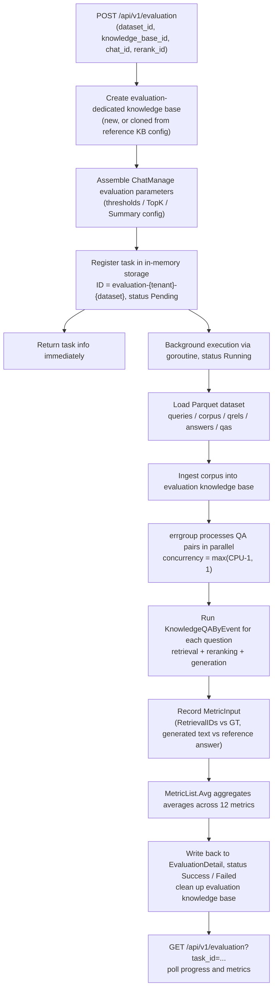

# Evaluation

Switch out the embedding model, toggle reranking on or off, bump up the chunk size — did any of these changes actually make things better? That's exactly what the evaluation capability answers: prepare a QA dataset with ground-truth answers, and WeKnora will automatically build a temporary knowledge base, ingest the corpus, run the full retrieval + generation pipeline question by question, and finally produce a set of comparable scores (Precision / Recall / NDCG / MRR / MAP on the retrieval side, BLEU / ROUGE on the generation side).

::: tip API only for now
Evaluation doesn't yet have a dedicated UI entry point. It's triggered via `POST /api/v1/evaluation` and polled via `GET /api/v1/evaluation?task_id=...`, both requiring Admin permission. The dataset is in Parquet format — see the format requirements below.
:::

Usage tip: keep the dataset fixed and change only one variable at a time (e.g., only swap the embedding model), then compare the same set of metrics — otherwise it's hard to attribute score changes to a specific cause.

## API

`internal/router/router.go`:

```go
evaluationRoutes := g.apiKeyGroup(r.Group("/evaluation"), apiKeyRunEvaluations(apiKeyFullAccess()))
{
    evaluationRoutes.POST("", g.Admin(), handler.Evaluation)
    evaluationRoutes.GET("", g.Viewer(), handler.GetEvaluationResult)
}
```

| Method | Path | Permission | Description |
| --- | --- | --- | --- |
| POST | `/api/v1/evaluation` | Admin (API Key needs the `RunEvaluations` capability) | Creates an evaluation task and immediately returns the task info |
| GET | `/api/v1/evaluation?task_id=...` | Viewer | Queries task status, progress, and metric results |

### Creating an evaluation task

Request parameters (`internal/handler/evaluation.go`):

```go
type EvaluationRequest struct {
    DatasetID       string `json:"dataset_id"`        // Dataset ID, defaults to "default"
    KnowledgeBaseID string `json:"knowledge_base_id"` // Reference knowledge base (reuses its configuration)
    ChatModelID     string `json:"chat_id"`           // Chat model
    RerankModelID   string `json:"rerank_id"`         // Rerank model
}
```

| Parameter | Required | Default behavior |
| --- | --- | --- |
| `dataset_id` | No | Uses the built-in `default` dataset (`dataset/samples/`) if omitted |
| `knowledge_base_id` | No | If not provided, creates a new evaluation-dedicated knowledge base; if provided, copies its configuration to create the evaluation KB |
| `chat_id` | No | Automatically selects the default Chat model if omitted |
| `rerank_id` | No | Automatically selects the default Rerank model if omitted |

The task ID format is `evaluation-{tenantID}-{datasetID}`. Task object (`internal/types/evaluation.go`):

```go
type EvaluationTask struct {
    ID        string           `json:"id"`
    TenantID  uint64           `json:"tenant_id"`
    DatasetID string           `json:"dataset_id"`
    StartTime time.Time        `json:"start_time"`
    Status    EvaluationStatue `json:"status"`
    ErrMsg    string           `json:"err_msg,omitempty"`
    Total     int              `json:"total,omitempty"`    // Total number of samples
    Finished  int              `json:"finished,omitempty"` // Number of completed samples
}
```

Task status enum (note: spelled `EvaluationStatue` in the source code):

```go
const (
    EvaluationStatuePending EvaluationStatue = iota // 0 pending
    EvaluationStatueRunning                          // 1 running
    EvaluationStatueSuccess                          // 2 success
    EvaluationStatueFailed                           // 3 failed
)
```

## Evaluation flow

In `internal/application/service/evaluation.go`, the POST endpoint **synchronously handles preparation, then runs the evaluation asynchronously**:

1. **Knowledge base preparation**: creates a new evaluation-dedicated knowledge base (or clones one from a reference KB's configuration), taking the default Embedding and LLM models;
2. **Parameter assembly**: assembles the `ChatManage` evaluation parameters from the system configuration — `VectorThreshold`, `KeywordThreshold`, `EmbeddingTopK`, `RerankTopK`, `RerankThreshold`, `MaxRounds`, `SummaryConfig` (MaxTokens / TopK / TopP / RepeatPenalty / Prompt / ContextTemplate, etc.), `FallbackResponse`, the query rewrite prompt, and so on;
3. **Task registration**: registers the task in in-memory storage under its task ID with status `Pending`, then returns the response immediately;
4. **Background execution** (goroutine): ingests the dataset corpus into the evaluation KB → evaluates each QA pair in parallel → aggregates the metrics → cleans up resources.

Concurrency is set to `max(GOMAXPROCS - 1, 1)` (rate-limited via errgroup):

```go
var g errgroup.Group
metricHook := NewHookMetric(len(dataset))
g.SetLimit(max(runtime.GOMAXPROCS(0)-1, 1))
for i, qaPair := range dataset {
    g.Go(func() error {
        // 1. Clone the ChatManage configuration
        // 2. Run the full KnowledgeQAByEvent pipeline (retrieval + reranking + generation)
        // 3. Record the MetricInput (retrieved passage IDs, generated text, ground truth)
        // 4. Lock and update the finished progress counter
    })
}
g.Wait()
```

Each sample produces one `MetricInput` (`internal/types/evaluation.go`):

```go
type MetricInput struct {
    RetrievalGT    [][]int // Retrieval ground truth (list of relevant passage IDs)
    RetrievalIDs   []int   // Passage IDs actually returned by retrieval
    GeneratedTexts string  // Model-generated text
    GeneratedGT    string  // Reference answer
}
```

`metric_hook.go` iterates over all registered metric calculators for each sample to compute the scores; finally, `Avg()` averages every metric across all samples and writes the result into `MetricResult`.

::: warning The meaning of RetrievalIDs
`RetrievalIDs` must be the **passage IDs from the dataset** — they cannot be the retrieval result's raw `ChunkIndex`, since that's merely the chunk's sequence number within the knowledge base and has no correspondence to the passage ID. Using it directly would make every retrieval metric come out as 0. That's why `recordFinish` performs a bidirectional containment match between each retrieved passage's text and the ground-truth passages for that sample, reverse-looks-up the corresponding pid, and deduplicates. When the rerank result is empty, it falls back to the raw retrieval result, so the whole sample doesn't get recorded as "nothing retrieved."

Ingesting the corpus must also **synchronously wait for indexing to complete** (`CreateKnowledgeFromPassageSync`): if ingestion is asynchronous, the evaluation queries would run before indexing finishes, which likewise shows up as metrics stuck at 0. Also note that the passage list length is allocated as `maxPID + 1`, since pids are 0-based and inclusive of the last index.

### Evaluation flow diagram



## Metrics list

The metric registry is in `internal/application/service/metric_hook.go`, with 12 metrics total across two groups. Text is first tokenized in `metric/common.go`: Chinese text is segmented with Jieba, English text is split on whitespace, and sentences are split on `。` / `.`.

### Retrieval Metrics

| Metric | Field | Implementation file | Meaning |
| --- | --- | --- | --- |
| Precision | `precision` | `metric/precision.go` | Retrieval precision: number of relevant documents hit / total number of retrieved results, averaged over the GT set |
| Recall | `recall` | `metric/recall.go` | Retrieval recall: number of relevant documents hit / total number of relevant documents |
| NDCG@3 | `ndcg3` | `metric/ndcg.go` | Normalized Discounted Cumulative Gain (top 3), rewards ranking relevant documents higher |
| NDCG@10 | `ndcg10` | `metric/ndcg.go` | Same as above, top 10 |
| MRR | `mrr` | `metric/mrr.go` | Average of the reciprocal rank of the first relevant document: `sum(1/rank) / N` |
| MAP | `map` | `metric/map.go` | Mean Average Precision: accumulates `Precision@k` at every hit position, then normalizes |

NDCG core calculation (`metric/ndcg.go`):

```go
// DCG = sum((2^rel_i - 1) / log2(i+2)), where rel is 0/1
dcg += (math.Pow(2, float64(relevance)) - 1) / math.Log2(float64(i+2))
// NDCG = DCG / IDCG (the DCG of the ideal ranking)
```

MRR core calculation (`metric/mrr.go`):

```go
for i, predID := range ids {
    if _, ok := gtSet[predID]; ok {
        sumRR += 1.0 / float64(i+1) // reciprocal of the first hit position
        break
    }
}
```

### Generation Metrics

| Metric | Field | Implementation file | Meaning |
| --- | --- | --- | --- |
| BLEU-1 | `bleu1` | `metric/bleu.go` | 1-gram precision (weight `[1.0, 0, 0, 0]`) |
| BLEU-2 | `bleu2` | `metric/bleu.go` | 1/2-gram at 50% each (weight `[0.5, 0.5, 0, 0]`) |
| BLEU-4 | `bleu4` | `metric/bleu.go` | Equal weighting of 1–4-grams (`[0.25, 0.25, 0.25, 0.25]`), includes brevity penalty |
| ROUGE-1 | `rouge1` | `metric/rouge.go` | Unigram overlap F1 |
| ROUGE-2 | `rouge2` | `metric/rouge.go` | Bigram overlap F1 |
| ROUGE-L | `rougel` | `metric/rouge.go` | Longest Common Subsequence (LCS) F1 |

BLEU core (`metric/bleu.go`): the weighted geometric mean of the modified n-gram precisions, multiplied by the brevity penalty `bp * exp(sum(w_i * log(p_i)))`. ROUGE uses F1: `F1 = 2PR / (P + R + 1e-8)` (`metric/rouge_score.go`).

## Dataset format

The dataset service (`internal/application/service/dataset.go`) loads 5 **Parquet** files from `./dataset/samples/`:

| File | Schema | Meaning |
| --- | --- | --- |
| `queries.parquet` | `id: int64, text: string` | Question set |
| `corpus.parquet` | `id: int64, text: string` | Corpus passages (ingested into the knowledge base during evaluation) |
| `answers.parquet` | `id: int64, text: string` | Reference answers |
| `qrels.parquet` | `qid: int64, pid: int64` | Ground-truth question → relevant passage associations (used by retrieval metrics) |
| `qas.parquet` | `qid: int64, aid: int64` | Question → answer mapping (used by generation metrics) |

The corresponding Go structs:

```go
type TextInfo struct {
    ID   int64  `parquet:"id"`
    Text string `parquet:"text"`
}
type RelsInfo struct {
    QID int64 `parquet:"qid"`
    PID int64 `parquet:"pid"`
}
type QaInfo struct {
    QID int64 `parquet:"qid"`
    AID int64 `parquet:"aid"`
}
```

After loading, these are assembled into per-sample `QAPair` records (`internal/types/dataset.go`):

```go
type QAPair struct {
    QID      int      // Question ID
    Question string   // Question text
    PIDs     []int    // IDs of relevant passages (ground truth)
    Passages []string // Passage text
    AID      int      // Answer ID
    Answer   string   // Reference answer text
}
```

To use a custom dataset, simply generate Parquet files with the same names following the schema above. During loading, the service prints summary statistics (number of questions, number of corpus entries, average number of relevant passages, answer coverage, etc.).

## Querying results

`GET /api/v1/evaluation?task_id=evaluation-{tenant}-{dataset}` returns an `EvaluationDetail`:

```json
{
  "success": true,
  "data": {
    "task": {
      "id": "evaluation-1-default",
      "dataset_id": "default",
      "status": 2,
      "total": 100,
      "finished": 100
    },
    "params": { "...": "snapshot of the ChatManage evaluation parameters" },
    "metric": {
      "retrieval_metrics": {
        "precision": 0.85, "recall": 0.92,
        "ndcg3": 0.88, "ndcg10": 0.86,
        "mrr": 0.95, "map": 0.87
      },
      "generation_metrics": {
        "bleu1": 0.72, "bleu2": 0.65, "bleu4": 0.58,
        "rouge1": 0.78, "rouge2": 0.71, "rougel": 0.75
      }
    }
  }
}
```

While the task is running, you can poll this endpoint to get `finished / total` progress; when `status = 3`, `err_msg` carries the failure reason.

> **Note**: Evaluation results are stored **in memory** (`evaluationMemoryStorage`: `map[string]*EvaluationDetail` + `sync.RWMutex`, see `internal/application/service/evaluation.go`). Tasks and results are lost on service restart, and the evaluation must be re-run.

## Implementation reference

For navigating the source code, use the table below (paths relative to the repository root):

| Layer | File |
| --- | --- |
| HTTP Handler | `internal/handler/evaluation.go` |
| Evaluation service | `internal/application/service/evaluation.go` |
| Metric registration and aggregation | `internal/application/service/metric_hook.go` |
| Metric implementations | `internal/application/service/metric/` (`precision.go`, `recall.go`, `ndcg.go`, `mrr.go`, `map.go`, `bleu.go`, `rouge.go`, `rouge_score.go`, `common.go`) |
| Dataset loading | `internal/application/service/dataset.go`, `internal/handler/dataset.go` |
| Type definitions | `internal/types/evaluation.go`, `internal/types/dataset.go` |
| Built-in sample dataset | `dataset/samples/` (Parquet files) |
| Route registration | `RegisterEvaluationRoutes` in `internal/router/router.go` |
