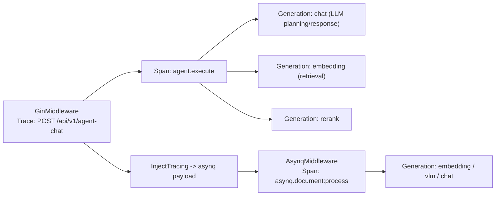
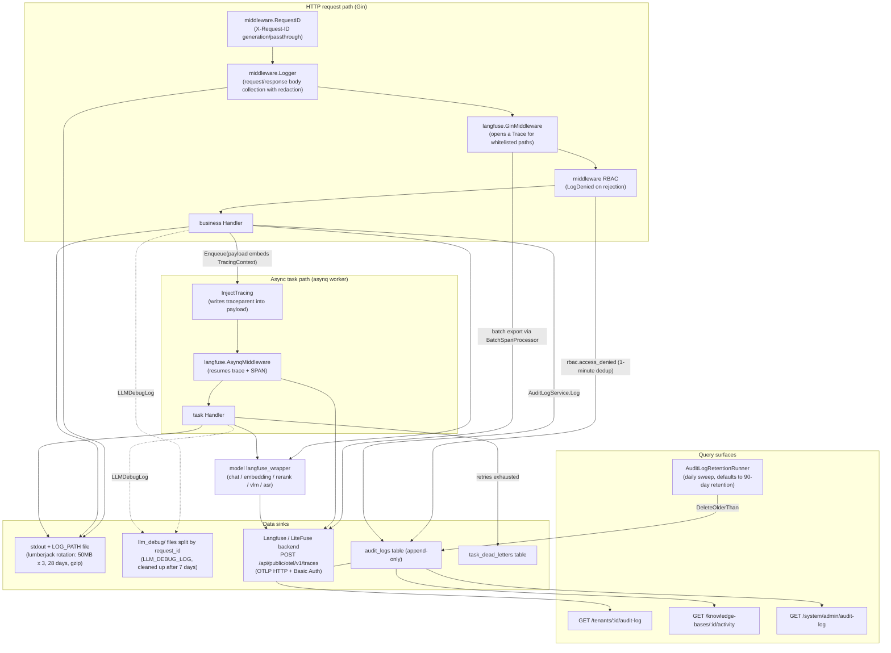

# Observability and Auditing

Logs and call tracing are used to analyze request errors, latency, and model usage; audit logs record resource changes; the task queue dashboard is used to inspect background backlogs, failures, and retries.

| Troubleshooting goal | Where to look |
| --- | --- |
| What a given Q&A retrieved, how many model calls it made, and how many tokens it used | Once Langfuse is integrated, view the full call chain in Langfuse |
| Changes to knowledge bases, members, or system settings | The knowledge base settings "Activity" tab, and "Settings → Audit Log" |
| Whether background parsing, summarization, or wiki tasks are piling up or failing | "Settings → Runtime Queue" |
| Whether the service is alive | `GET /health` |
| Correlating service logs for the same request | Search logs by the `X-Request-ID` response header |

<Screenshot
  src="/screenshots/queue-dashboard.png"
  caption="Runtime task queue: backlog, failures, and retries per queue"
  hint="Shows the queue dashboard, including queue names, pending/in-progress/failed counts, and dead-letter task action entry points." />

<Screenshot
  src="/screenshots/observability-langfuse.png"
  caption="Langfuse trace: the full call chain of a single Q&A"
  hint="Shows the expanded view of a trace in Langfuse, including retrieval, reranking, and generation spans along with token usage." />

When troubleshooting a request, first get the `X-Request-ID` from the response header, then use it to correlate logs and trace records.

## Operations Quick Reference {#_8-operations-quick-reference}

| What you want to know… | Where to look |
| --- | --- |
| What happened across the full chain for a given request | grep the application logs by the `X-Request-ID` response header; with `LLM_DEBUG_LOG` enabled, check `llm_debug/<request_id>.log` |
| The LLM call tree and token consumption for a chat/parse operation | Langfuse UI (trace names `POST /api/v1/agent-chat` or `asynq.document:process`) |
| Who changed what and when | Space audit log at `/tenants/:id/audit-log`; KB activity at `/knowledge-bases/:id/activity`; platform audit log at `/system/admin/audit-log` |
| Why a given document keeps failing | The `task_dead_letters` table (scope=knowledge/knowledge_base) + the `last_error` field of archived tasks in the runtime dashboard |
| Whether the service is alive | `GET /health` (200 `{"status":"ok"}`) |
| Whether configuration loaded as expected | The `[startup-env]` banner in the startup logs (`internal/runtime/startup.go`; sensitive values only show their length) |

## Health Checks {#_6-health-checks}

`internal/router/router.go` registers an unauthenticated health probe (the public path whitelist in `internal/middleware/auth.go` includes `/health`):

```go
// internal/router/router.go
r.GET("/health", func(c *gin.Context) {
    c.JSON(200, gin.H{"status": "ok"})
})
```

This is a pure liveness probe (it does not check DB/Redis dependencies), suitable as a target for container / LB health checks. Both `langfuse.shouldTrace` and request-log sampling exclude it as well, to avoid probe noise. Process uptime is exposed to the ops dashboard via `MarkServerStarted`/`ServerUptime` in `internal/runtime/server.go`.

## Logging, Tracing, and Auditing Reference

### Logging System (`internal/logger`) {#_2-logging-system-internal-logger}

#### Format and Levels {#_2-1-format-and-levels}

- The underlying implementation is a **private** logrus instance (`appLogger`, which avoids external dependencies mutating the global logrus instance and causing log loss), with a custom `CustomFormatter`.
- Default single-line format: `LEVEL[timestamp] [request_id fields...] caller | message`, where caller is `file:line[function name]` (`addCaller`).
- A template can be supplied via the `LOG_FORMAT` environment variable, with placeholders: `%d`=timestamp, `%level`=level, `%thread`=goroutine ID (only fetched when the template actually references it, to avoid running `runtime.Stack` on every log line), `%logger`=caller, `%traceId`=request_id, `%msg`=message+structured fields. A single-pass `strings.NewReplacer` avoids double-substitution issues.
- Level is controlled by `LOG_LEVEL` (`debug`/`info`/`warn`/`error`/`fatal`; **defaults to debug** when unset or invalid).
- Color: ANSI color is enabled when stdout is a terminal; disabled for non-terminal output (Docker log collection); when writing to a file, `ansiStripWriter` strips ANSI sequences to keep the output plain text.
- Structured field API: `logger.WithField(ctx, k, v)` / `WithFields` store an entry with fields attached into the context (`types.LoggerContextKey`), and subsequent calls to `logger.Infof(ctx, ...)` automatically carry them; `WarnWithFields` is dedicated to audit-related events (cross-tenant probing, invariant violations), making it easier for log aggregators to index by tenant/resource.
- `CloneContext` copies the key context values (tenant/user/request_id/role/language, etc.) when spawning a background goroutine, while also preserving both the Langfuse `*Trace` handle and the **active OTel span**, preventing child spans from becoming orphaned traces.

#### Output and Rotation {#_2-2-output-and-rotation}

`ConfigureFromEnv()` (runs at init time, and can be re-invoked after `main` loads `.env`): always writes to stdout; when `LOG_PATH` is non-empty (or automatically, when running as a macOS `.app` bundle, falls back to `~/Library/Logs/<App>/<App>.log`), it additionally writes to disk via lumberjack:

```go
// internal/logger/logger.go openLogFile()
return &lumberjack.Logger{
    Filename:   logPath,
    MaxSize:    50, // megabytes
    MaxBackups: 3,
    MaxAge:     28, // days
    Compress:   true,
}, nil
```

#### LLM Debug Logging (`internal/logger/llm_logger.go`) {#_2-3-llm-debug-logging-internal-logger-llm-logger-go}

When `LLM_DEBUG_LOG=true|1|<directory>` is enabled, every model call (Chat / Chat Stream / Embedding / Rerank / VLM) writes its **complete** input messages, tool calls, output, and errors to the `llm_debug/` directory, with **all calls sharing the same request_id appended to the same file** (`<request_id>.log`), making it easy to reconstruct all model interactions within a single session. Files older than 7 days in the directory are cleaned up in the background at startup (`cleanupOldDebugFiles`).

#### Request Logging Middleware (`internal/middleware/logger.go`) {#_2-4-request-logging-middleware-internal-middleware-logger-go}

- `RequestID()`: reads or generates `X-Request-ID`, writes it back into the response header, and places the request_id together with a field-tagged logger into both the gin context and the `http.Request` context — enabling full-chain log correlation by request_id (including passthrough tagged via the asynq worker's session labels).
- `Logger()`: records method, path (with query parameters scrubbed of OAuth-sensitive params like `token`/`code`/`state` via `sanitizeQuery`), status_code, latency, client_ip, size, and up to 10KB of request/response body. Request/response bodies are redacted via `sensitiveFieldRegex` (values of fields like password/token/api_key/secret/private_key are replaced with `"***"`, compatible with both snake_case and camelCase); SSE response bodies are recorded as `[SSE streaming response, skipped]`; `/assets/` and wiki stats polling paths are skipped entirely.
- Trusted proxies: `r.SetTrustedProxies(...)` (`WEKNORA_TRUSTED_PROXIES`) prevents forged `X-Forwarded-For` headers from bypassing `ClientIP`-based rate limiting.

### Langfuse Tracing (`internal/tracing/langfuse`) {#_3-langfuse-tracing-internal-tracing-langfuse}

Distributed tracing uses the OpenTelemetry Go SDK, writing span attributes according to Langfuse semantic conventions (`langfuse.observation.*`) and exporting them via OTLP/HTTP to `POST <host>/api/public/otel/v1/traces`; it works with Langfuse v3+ and LiteFuse. Tracing is off by default; when it is not enabled, the related entry points do not export anything.

#### Configuration (Environment Variables, `config.go`) {#_3-1-configuration-environment-variables-config-go}

| Environment Variable | Default | Description |
| --- | --- | --- |
| `LANGFUSE_ENABLED` | Auto-enabled when public/secret keys are present | Master switch (consistent with the Python SDK's convention) |
| `LANGFUSE_HOST` | `https://cloud.langfuse.com` | Langfuse/LiteFuse base URL (can be self-hosted) |
| `LANGFUSE_PUBLIC_KEY` / `LANGFUSE_SECRET_KEY` | — | Basic Auth project credentials |
| `LANGFUSE_RELEASE` / `LANGFUSE_ENVIRONMENT` | — | Attached to every trace for filtering in the UI |
| `LANGFUSE_FLUSH_AT` | 15 | Batch export batch size (`BatchSpanProcessor`'s `MaxExportBatchSize`) |
| `LANGFUSE_FLUSH_INTERVAL` | 3s | Maximum interval for batch export (`BatchTimeout`) |
| `LANGFUSE_QUEUE_SIZE` | 2048 | In-memory buffer cap (prevents unbounded growth when the endpoint is unreachable) |
| `LANGFUSE_REQUEST_TIMEOUT` | 10s | HTTP timeout for a single ingestion request |
| `LANGFUSE_SAMPLE_RATE` | 1.0 | Sampling rate for `ParentBased(TraceIDRatioBased)`, 0..1 |
| `LANGFUSE_DEBUG` | false | Verbose logging for batch-send errors |

#### Exporter (`exporter.go`) {#_3-2-exporter-exporter-go}

An OTLP/HTTP exporter with `Authorization: Basic base64(public:secret)`; this exporter uses its own HTTP client, which does not go through SSRF protection and is not subject to the whitelist even when `SSRF_DNS_WHITELIST_ONLY` is enabled; the `x-langfuse-ingestion-version: 4` header is required for the OTel direct-write path of Langfuse v3/LiteFuse (its absence returns a 400), and `x-langfuse-sdk-name/version` are compatibility markers. `Manager` (`manager.go`) holds its own independent `TracerProvider` (with a `service.name=weknora` resource), and does not call `otel.SetTextMapPropagator` or any other global OTel mutation, so as not to affect other OTel instrumentation elsewhere in the process; the W3C `TraceContext` propagator is a package-private value.

#### Observation Model and Instrumentation Points {#_3-3-observation-model-and-instrumentation-points}

There are three handle types (`tracer.go`): `Trace` (the root, one per request), `Span` (a non-LLM logical unit of work), and `Generation` (a single model call, including `TokenUsage` token statistics and streaming time-to-first-token via `MarkCompletionStart`). Parent-child relationships are established automatically via the OTel span context; when there's no active trace, an auto-trace is opened automatically to prevent orphaned spans.

Main instrumentation points:

| Point | Source | Output |
| --- | --- | --- |
| HTTP entry point | `middleware.go` `GinMiddleware` | Opens a root Trace for `shouldTrace`-whitelisted paths (knowledge-chat / agent-chat / knowledge-search / various ingestion POST/PUT endpoints / FAQ import / wiki auto-fix / evaluation / initialization detection, etc.), named `METHOD /path`, with metadata containing http.method/path/query/request_id, and output containing status and response.size; extracts the upstream W3C `traceparent` header to inherit the caller's trace id |
| asynq worker | `asynq.go` `AsynqMiddleware` | Restores the traceparent from the payload to resume the HTTP trace, or otherwise opens a new `asynq.<task_type>` trace; wraps it in a SPAN with metadata containing task_id/queue/retry/max_retry/payload_bytes; the payload preview is limited to the first 1KB |
| Enqueue-side injection | `asynq.go` `InjectTracing` + `internal/types/tracing.go` `TracingContext` | Embeds the traceparent and user/session labels as `lf_*` JSON fields into the task payload, carrying them across process boundaries |
| Model calls | `internal/models/{chat,embedding,rerank,vlm,asr}/langfuse_wrapper.go` | One Generation per call (model name, input, parameters, output, token usage, errors) |
| Retrieval/rerank summaries | `retrieval_obs.go` | `SummarizeRetrieveOutput` / `SummarizeSearchResults` and similar functions compress retrieval results into a top-25 preview (rank/chunk_id/score/160-character preview), avoiding dumping full text into the trace |
| Agent execution | `internal/agent/engine.go`, `act.go` | SPANs such as agent.execute, kept in the same tree as the HTTP root trace via `logger.CloneContext` |

Reported content (span attributes, `events.go`): `langfuse.observation.type/input/output/metadata/model.name/model.parameters/usage_details/completion_start_time`, `langfuse.trace.name/input/output/metadata/tags`, `user.id` (explicit user or `tenant:<id>`), `session.id`, `langfuse.environment/release`.



#### Per-Turn Usage, Call Purpose, and Caching

Each model call still produces its own Generation; a message's usage stores the aggregated token usage for that turn, the Agent completion event returns it via turn_usage, and it remains readable when a historical message is reopened. prompt_tokens, completion_tokens, and total_tokens are totals; cached_tokens is a compatibility alias for cache_read_tokens, and cache_read/write/miss are breakdowns of input tokens that must not be added on top of prompt_tokens.

cache_reported and cache_status distinguish hit, miss, unreported, and unsupported; an unreported status must not be counted as a cache miss. Generation metadata records call_purpose and a prompt prefix fingerprint, used to tell apart purposes such as answering, rewriting, and summarization, and to explain cache changes.

Prompt assembly puts stable instructions first and dynamic conversation content last; providers that support it get cache markers. Hits still depend on the provider protocol, the model, and the request prefix, so caching is not guaranteed on every request. When troubleshooting, first compare the call purpose, prefix fingerprint, and model, then check the reported status.

Sandbox calls also have Langfuse spans, which link instance operations and tool execution time into the current trace so you can tell waiting on the sandbox apart from waiting on the model. Background sandbox maintenance (such as session reclamation) only records child spans when a parent trace already exists and never creates a trace of its own; skill installation, deletion, and maintenance tasks open their own traces. When tracing is disabled, nothing is exported to Langfuse.

### Audit Logs {#_4-audit-logs}

#### Data Model (`internal/types/audit_log.go`) {#_4-1-data-model-internal-types-audit-log-go}

The `audit_logs` table is **append-only** (no UpdatedAt, no soft delete), with a monotonic id serving as both primary key and cursor:

| Field | Type | Description |
| --- | --- | --- |
| `id` | uint64 auto-increment | Primary key + pagination cursor (`WHERE id < after_id ORDER BY id DESC`) |
| `tenant_id` | uint64 | Space; `0` = system-scope event |
| `actor_user_id` / `actor_role` | varchar | The actor and their role at the time (empty for system-triggered events) |
| `action` | varchar(64) | Dot-separated name `<area>.<event>` (see 4.2) |
| `scope_type` / `scope_id` | varchar | Resource scope (e.g. `knowledge_base` + kbID, which drives the KB activity page) |
| `target_type` / `target_id` / `target_user_id` | varchar | The specific target resource / user |
| `request_path` / `request_method` | varchar | Route template (not the raw URL, to prevent cursor bloat; the raw URL is stored in Details.raw_path) |
| `outcome` | varchar(16) | `success` / `accepted` (accepted asynchronously, not yet in a terminal state) / `denied` / `failed` / `partial` / `canceled` |
| `details` | jsonb | Action-specific payload; secret values are **never** stored (e.g. vector_store only records the names of changed fields). Knowledge base activity initiated by an API Key additionally records `api_key_id` / `api_key_name` (a snapshot of the name, never the plaintext key) |
| `created_at` | timestamp | Basis for retention-policy sweeps |

#### List of Audit Actions {#_4-2-list-of-audit-actions}

| Group | Actions |
| --- | --- |
| RBAC / members | `rbac.member_added`, `rbac.member_removed`, `rbac.member_role_changed`, `rbac.member_left`, `rbac.access_denied`, `rbac.invitation_sent`, `rbac.invitation_accepted`, `rbac.invitation_declined`, `rbac.invitation_revoked`, `rbac.invitation_expired` |
| Vector store | `vector_store.created`, `vector_store.updated`, `vector_store.deleted` |
| OpenSearch-derived resources | `opensearch.index_created`, `opensearch.index_deleted`, `opensearch.reindex_executed` |
| System administration (tenant_id=0) | `system.setting_changed`, `system.admin_promoted`, `system.admin_revoked`, `system.user_created`, `system.user_password_reset`, `system.api_key_created`, `system.api_key_revoked` |
| Runtime queue operations (tenant_id=0) | `system.queue_task_retried`, `system.queue_task_deleted`, `system.queue_task_run_now`, `system.queue_task_cancelled`, `system.queue_archived_purged` |
| Knowledge base | `kb.created`, `kb.updated`, `kb.deleted`, `kb.duplicated`, `kb.clone_started`, `kb.clone_completed`, `kb.clone_failed`, `kb.share_added`, `kb.share_permission_changed`, `kb.share_removed` |
| Knowledge | `knowledge.created`, `knowledge.updated`, `knowledge.deleted`, `knowledge.batch_deleted`, `knowledge.reparse_started`, `knowledge.parse_canceled`, `knowledge.move_started`, `knowledge.move_completed`, `knowledge.move_failed` |
| Tags / data sources | `tag.created`, `tag.updated`, `tag.deleted`, `datasource.created`, `datasource.updated`, `datasource.deleted`, `datasource.sync_started`, `datasource.sync_completed`, `datasource.sync_failed`, `datasource.paused`, `datasource.resumed` |
| Wiki / FAQ | `wiki.content_changed`, `faq.import_started`, `faq.import_completed`, `faq.import_failed` |

#### Write Path (Service + Middleware) {#_4-3-write-path-service-middleware}

- `auditLogService.Log` (`internal/application/service/audit_log.go`) is the canonical write entry point: defaults `outcome=success`, populates `CreatedAt`; **write failures are only logged as ERROR and never propagated upward** — an audit failure must never interrupt a business operation.
- `LogDenied` records RBAC middleware rejections: it dedups using a **1-minute sliding window** keyed by `(tenant_id, actor, action=rbac.access_denied, route template)` (`denyDedupWindow`, `repo.CountSinceForDedup`), preventing a probing client from flooding the table (100 RPS hitting the same endpoint only produces 1 row per minute); the route template rather than the raw URL is used as the dedup key, to prevent traversing UUIDs to bypass the window. The stderr-side `[rbac] role insufficient` log is unaffected by dedup and is written on every rejection.
- `middleware/audit_provider.go`'s `AuditServiceProvider` injects the service into the gin context (key `weknora.audit_service`); the RBAC middleware retrieves it via `AuditServiceFromContext`, which is nil-safe (Lite mode can run without audit configured).

#### Query API (`internal/handler/audit_log.go`) {#_4-4-query-api-internal-handler-audit-log-go}

| Route | Permission | Description |
| --- | --- | --- |
| `GET /api/v1/tenants/:id/audit-log` | PathTenantMatch + Admin | Space-level audit stream; only returns rows with `scope_type=''` (`UnscopedOnly`) |
| `GET /api/v1/knowledge-bases/:id/activity` | KB creator or space Admin, and must be in the owning space (organization-shared consumers cannot read it) | KB activity projection filtered by `scope_type=knowledge_base` + `scope_id=kbID` |
| `GET /api/v1/system/admin/audit-log` | SystemAdmin (+ platform API Key with `system.audit_read`) | Platform-level events with `tenant_id=0` (settings / promote / queue operations, etc.) |

Common query parameters: `after_id` (cursor, returns rows with a smaller id), `limit` (1–100, default 50, hard cap `auditLogListLimitMax=100`), and exact filters on `action` / `outcome` / `actor`. The response includes `next_cursor` (the smallest id on the page; 0 means the end has been reached).

#### Retention Policy (`internal/application/service/audit_log_retention.go`) {#_4-5-retention-policy-internal-application-service-audit-log-retention-go}

- Configuration: `audit.retention_days` (YAML) / `WEKNORA_AUDIT_RETENTION_DAYS` (env override); defaults to **90 days** when the `audit:` section is omitted; an explicit 0 disables sweeping (for compliance scenarios with out-of-band archival), and a negative value triggers a config validation error.
- `AuditLogRetentionRunner`: a bare `time.Ticker`-based background goroutine (no cron / asynq dependency), with a 10-minute startup delay (to avoid migration and startup traffic), after which it runs `Purge` → `DeleteOlderThan(now - retention_days)` **every 24h** (a single indexed DELETE with a 30s timeout). Deletion counts are logged at INFO, failures at WARN (retried on the next cycle). It's wired up by `internal/container/container.go` and registered as a `ResourceCleaner` for graceful shutdown (`Stop` is idempotent, and returns immediately if never Started).

### Rate Limiting (`internal/ratelimit` and Middleware) {#_5-rate-limiting-internal-ratelimit-and-middleware}

#### General-Purpose Sliding-Window Limiter (`internal/ratelimit/limiter.go`) {#_5-1-general-purpose-sliding-window-limiter-internal-ratelimit-limiter-go}

- Redis-first: a Lua script atomically performs "evict expired ZSET members → `ZCARD` count → `ZADD` + `PEXPIRE` if under the limit," sharing budget across multiple instances; members are keyed as `<instanceID>:<ms>` to guarantee uniqueness.
- When Redis is unavailable (error, or Lite mode without Redis), it **automatically falls back** to an in-process `localLimiter` (a `sync.Map` plus a per-key timestamp array), with `StartCleanup` periodically evicting empty keys.
- `max` is passed in on each `Allow` call, so the same limiter can apply different budgets to different keys (e.g. separate quotas per embed channel).
- Consumers: the Web embed public interface (two limiters — per-minute and per-24h — keyed by channel+ClientIP, in `internal/middleware/embed_auth.go`) and the IM service (`internal/im/service.go`).

#### Public Authentication Endpoint IP Rate Limiting (`internal/middleware/auth_public_ratelimit.go`) {#_5-2-public-authentication-endpoint-ip-rate-limiting-internal-middleware-auth-public-ratelimit-go}

`PublicAuthRateLimit()` protects unauthenticated invitation-link endpoints (`/auth/invitations/lookup`, `/auth/register-by-invite`): an in-process sliding window allowing **30 requests/minute per IP** (a shared bucket across both endpoints), returning 429 (`ErrTooManyRequests`) when exceeded. This is a purely local implementation (suited to low-traffic endpoints); the code comments note that a Redis-backed version from `internal/ratelimit` should be used instead if horizontal scaling is needed.

### Model Usage-by-Reference Statistics (`internal/application/repository/model_usage.go`) {#_7-model-usage-by-reference-statistics-internal-application-repository-model-usage-go}

This file provides **usage-by-reference** queries — answering "which resources are currently using a given model" — used to protect against deleting a model that's still in use, rather than token-usage billing:

- `scopeKnowledgeBasesByModelID`: matches against any of the model-binding fields in `knowledge_bases` — `embedding_model_id`, `summary_model_id`, `image_processing_config.model_id`, `vlm_config.model_id`, `asr_config.model_id`, `wiki_config.synthesis_model_id`, `auto_tag_config.model_id` (using the `->>` JSON operator on Postgres and `json_extract` on SQLite, equivalent across both dialects).
- `scopeCustomAgentsByModelID`: matches against `model_id`, `rerank_model_id`, `vlm_model_id`, `asr_model_id`, `query_understand_model_id`, and `question_suggestions.follow_ups.model_id` within `custom_agents.config`.
- Space long-term memory configuration: `extract_model_id` and `embedding_model_id` in `memory_config` also count as references, and appear in `long_term_memory.bindings`.
- Consumers: `ListModelUsages` in the `knowledgebase.go` / `custom_agent.go` repositories reuses the scopes above and returns a minimal projection of the active objects within the tenant (`id`, `name`, merged `bindings`), capped at `ModelUsageListLimit` (50). The deletion guard in `internal/application/service/model.go` decides whether to block based on `knowledge_base_total` / `agent_total` and the long-term memory bindings, and returns the truncated lists, the totals, and `long_term_memory` together in `error.details` of the HTTP 400 response.

Token-level model usage, on the other hand, is reported via the `usage_details` field of a Langfuse Generation (`TokenUsage`: input/output/total/cache_*), and can be aggregated by model / user (`tenant:<id>`) / session in the Langfuse UI.

### Observability Data Flow Overview {#_1-observability-data-flow-overview}



## Implementation Reference

All paths below are relative to the repository root:

| Capability | Source Path |
| --- | --- |
| Application logging | `internal/logger/logger.go` |
| LLM call debug logging | `internal/logger/llm_logger.go` |
| Request logging / RequestID middleware | `internal/middleware/logger.go` |
| Langfuse tracing (OTel SDK) | `internal/tracing/langfuse/` (`config.go`, `manager.go`, `exporter.go`, `tracer.go`, `middleware.go`, `asynq.go`, `events.go`, `retrieval_obs.go`, `context.go`) |
| Cross-process trace carrier | `internal/types/tracing.go` |
| Audit log handler / service / repo | `internal/handler/audit_log.go`, `internal/application/service/audit_log.go`, `internal/application/repository/audit_log.go` |
| Audit retention policy | `internal/application/service/audit_log_retention.go`, `internal/config/config.go` (`applyAuditDefaults`) |
| Audit actions / model | `internal/types/audit_log.go` |
| Rate limiting | `internal/ratelimit/limiter.go`, `internal/middleware/auth_public_ratelimit.go` |
| Health check | `internal/router/router.go` (`GET /health`) |
| Model usage-by-reference statistics | `internal/application/repository/model_usage.go` |
