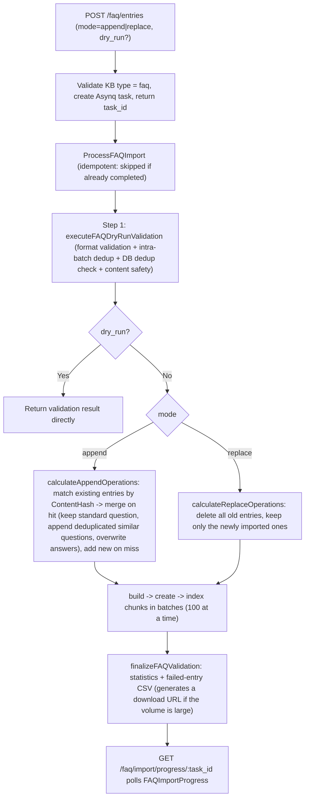
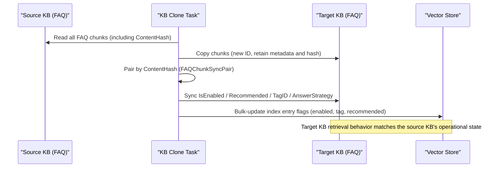

Segue a tradução completa do documento, com toda a estrutura markdown preservada.

---

# FAQ Capability

Some questions have fixed answers — return policies, reimbursement procedures, common error handling. For this kind of content, going through document retrieval is actually less reliable; it's more robust to maintain it directly as Q&A pairs: when building the knowledge base, set the type to **FAQ**, and enter entries as "standard question + similar questions + negative questions + answer". When a query comes in, it matches against questions rather than document fragments — a hit returns the prepared answer directly.

Common usage: first bulk-import common questions from historical support tickets via Excel / CSV, then add similar questions in the UI; for questions prone to false matches, add negative questions. The FAQ knowledge base can be retrieved by the same Agent alongside document knowledge bases, forming a pattern of "check the standard answer first, fall back to documents if not found."

<Screenshot
  src="/screenshots/faq-management.png"
  caption="FAQ Management: entry list, filtering, and bulk import"
  hint="Shows the FAQ entry list (standard question, similar question count, tags, status) along with the import entry point / import result notification." />

The sections below cover the FAQ entry model, API, import/export, the deduplication and normalization algorithm, retrieval hit strategy, the differences from regular knowledge, and the state synchronization mechanism in clone / sharing scenarios.

## 1. Data Model

### 1.1 Storage Form: FAQ Entry = One Chunk

An FAQ entry is **not a separate table**: each entry is a `Chunk` record (`chunk_type = "faq"`), attached to a `Knowledge` record of type `faq` within that KB (this Knowledge is automatically created the first time an entry is created). The entry's structured content is stored in `Chunk.Metadata` (JSON):

```go
// internal/types/faq.go
type FAQChunkMetadata struct {
    StandardQuestion  string         `json:"standard_question"`
    SimilarQuestions  []string       `json:"similar_questions,omitempty"`
    NegativeQuestions []string       `json:"negative_questions,omitempty"` // Negative questions: filtered out on match
    Answers           []string       `json:"answers,omitempty"`
    AnswerStrategy    AnswerStrategy `json:"answer_strategy,omitempty"`    // all | random
    Version           int            `json:"version,omitempty"`            // Incremented on every update
    Source            string         `json:"source,omitempty"`
}

const (
    AnswerStrategyAll    AnswerStrategy = "all"    // Return all answers
    AnswerStrategyRandom AnswerStrategy = "random" // Return one at random
)
```

Common fields reused on Chunk: `SeqID` (auto-incrementing integer, the entry ID exposed in the external API), `TagID` (category tag, default tag name constant `UntaggedTagName = "Uncategorized"`), `IsEnabled` (disable switch), `Flags` (bit0 `ChunkFlagRecommended` — whether it can be recommended), `ContentHash` (deduplication hash, see §3).

### 1.2 API Projection: FAQEntry

```go
type FAQEntry struct {
    ID                int64          `json:"id"`        // chunk.SeqID
    ChunkID           string         `json:"chunk_id"`
    KnowledgeID       string         `json:"knowledge_id"`
    KnowledgeBaseID   string         `json:"knowledge_base_id"`
    TagID             int64          `json:"tag_id"`
    TagName           string         `json:"tag_name"`
    IsEnabled         bool           `json:"is_enabled"`
    IsRecommended     bool           `json:"is_recommended"`
    StandardQuestion  string         `json:"standard_question"`
    SimilarQuestions  []string       `json:"similar_questions"`
    NegativeQuestions []string       `json:"negative_questions"`
    Answers           []string       `json:"answers"`
    AnswerStrategy    AnswerStrategy `json:"answer_strategy"`
    IndexMode         FAQIndexMode   `json:"index_mode"`
    Score             float64        `json:"score,omitempty"`            // Retrieval score
    MatchType         MatchType      `json:"match_type,omitempty"`
    MatchedQuestion   string         `json:"matched_question,omitempty"` // The actual question text that was matched
}
```

### 1.3 KB-Level FAQ Configuration (FAQConfig)

| Setting | Values | Default | Description |
| --- | --- | --- | --- |
| `index_mode` | `question_only` / `question_answer` | `question_answer` | Whether the indexed content includes the answer |
| `question_index_mode` | `combined` / `separate` | `combined` | Whether the standard question + similar questions are combined into a single index entry, or each question gets its own index entry |

In `separate` mode, each similar question generates its own index entry, with `SourceID = fmt.Sprintf("%s-%s", chunk.ID, hashQuestion(similarQ))`, supporting fine-grained addition/removal at the similar-question level.

## 2. API Endpoints

`internal/handler/faq.go` (routes registered in `internal/router/router.go`; KB access control is the same as for the knowledge base: reads go through KBAccessRead, writes through KBAccessWrite; API Keys require `ingest` / `retrieve` capability):

| Method | Path | Function |
| --- | --- | --- |
| GET | `/knowledge-bases/:id/faq/entries` | List entries (pagination / tag / keyword) |
| GET | `/knowledge-bases/:id/faq/entries/:entry_id` | Single entry detail |
| POST | `/knowledge-bases/:id/faq/entry` | Synchronously create a single entry |
| PUT | `/knowledge-bases/:id/faq/entries/:entry_id` | Update a single entry (incremental indexing) |
| POST | `/knowledge-bases/:id/faq/entries` | Bulk import / update (async, append/replace) |
| POST | `/knowledge-bases/:id/faq/entries/:entry_id/similar-questions` | Append similar questions |
| PUT | `/knowledge-bases/:id/faq/entries/fields` | Bulk update fields (enable / recommend / strategy) |
| PUT | `/knowledge-bases/:id/faq/entries/tags` | Bulk update tags |
| DELETE | `/knowledge-bases/:id/faq/entries` | Bulk delete |
| POST | `/knowledge-bases/:id/faq/search` | FAQ retrieval (hybrid search) |
| GET | `/knowledge-bases/:id/faq/entries/export` | Export (CSV / JSON) |
| GET | `/faq/import/progress/:task_id` | Import task progress |
| PUT | `/knowledge-bases/:id/faq/import/last-result/display` | Import result panel display state (open/close) |

List query parameters: `page` / `page_size`, `tag_id` (single tag) or `tag_ids` (comma-separated, OR semantics), `keyword` + `search_field` (`standard_question` / `similar_questions` / `answers`, searches all fields if omitted), `sort_order` (`asc`, descending by default).

**Write validation** (`sanitizeFAQEntryPayload` + `checkFAQQuestionDuplicate`): standard question is required; at least one answer is required; `answer_strategy` can only be `all` / `random` (default `all`); similar questions / negative questions / answers are trimmed of whitespace and deduplicated; and a four-level duplicate check is performed — similar questions vs. standard question, similar questions against each other, negative questions vs. standard question and similar questions, and cross-entry conflicts within the DB (returns detailed conflict information).

## 3. Normalization and Content Hashing (Deduplication Core)

FAQ adopts a layered design of "**store the original text, judge equality by the normalized text**":

```go
// Writing: DB keeps the original data, ContentHash is based on the normalized copy
func (c *Chunk) SetFAQMetadata(meta *FAQChunkMetadata) error {
    meta.Sanitize()                          // Basic cleanup only
    c.Metadata, _ = json.Marshal(meta)
    normalized := meta.Normalize()           // Normalized copy
    c.ContentHash = CalculateFAQContentHash(normalized)
    return nil
}
```

The processing chain of `NormalizeQuestion` (order-sensitive): trim leading/trailing whitespace → remove URLs → convert to lowercase → strip leading/trailing punctuation (`？。，；、：！?.,;!:'"`, etc.) → **convert Traditional Chinese to Simplified** → **convert full-width to half-width characters** → smart spacing (remove spaces between Chinese characters, keep spaces between English/numbers).

`CalculateFAQContentHash` = SHA256(normalized standard question + sorted similar questions + sorted negative questions + sorted answers). `internal/types/faq_test.go` locks in the key invariants of the hash: case- and punctuation-insensitive, Traditional/Simplified-insensitive, full-width/half-width-insensitive, array-order-insensitive, and consistent between the write and read paths. This hash is used for pairing entries during import deduplication and clone synchronization.

## 4. Bulk Import

`internal/application/service/knowledge_faq_import.go`. Entry point `POST /knowledge-bases/:id/faq/entries`:

```go
type FAQBatchUpsertPayload struct {
    Entries     []FAQEntryPayload `json:"entries" binding:"required"` // Can also be pulled from object storage via EntriesURL
    Mode        string            `json:"mode" binding:"oneof=append replace"`
    KnowledgeID string            `json:"knowledge_id"`
    TaskID      string            `json:"task_id"` // Optional, auto-generates a UUID if not provided
    DryRun      bool              `json:"dry_run"` // Validate only, don't persist
}
```

Import fields (CSV template columns, symmetric with the export format, multiple values separated by `##`): standard question (required), similar questions, negative questions, answer (required), whether to reply with all answers, whether disabled, whether recommendation is disallowed, category (default "Uncategorized").



Statistics fields on the progress object `FAQImportProgress`: `success_count` / `failed_count` / `partial_failed_count` (similar or negative questions were dropped but the entry was still imported) / `skipped_count` (duplicates skipped) / `merged_count` / `added_count`, `failed_entries[]` (includes failure reason and original content) along with `failed_entries_url`, `import_mode`, `processing_time`; task status `pending → processing → completed / failed`.

Export supports two formats: CSV (columns: category, question, similar questions, negative questions, bot answer, whether to reply with all answers, whether disabled, whether recommendation is disallowed; includes BOM to ensure Excel UTF-8 compatibility) and JSON (`FAQExportEntry`, compatible with the import payload, supporting an "export → edit → re-import" loop).

## 5. Differences from Regular Knowledge (Documents)

| Dimension | FAQ | Document |
| --- | --- | --- |
| KB Type | `faq` | `document` |
| Knowledge.Type | `faq` (usually one aggregate Knowledge per KB) | file / `manual` / URL |
| Chunk source | Structured entries entered directly by the user | Automatically chunked by the parser |
| Chunk.ChunkType | `faq` | `text` / `image_ocr` / `summary`, etc. |
| Metadata | `FAQChunkMetadata` (question / answer / negative questions / strategy) | Document metadata (AI-generated questions, etc.) |
| Chunk.Content | Composed by `buildFAQChunkContent`: `"Q: standard question\nSimilar Questions:\n- ..."`; the `question_answer` mode appends `Answers`; **negative questions are never written into Content (not part of the index)** | Original text fragment |
| ContentHash | Normalized deduplication hash (core mechanism) | Generally not used |
| Indexing granularity | One or more index entries depending on `question_index_mode` | One index entry per chunk (parent-child chunking is a separate case) |
| Processing pipeline | Synchronous single-entry creation / asynchronous bulk import, indexing takes effect immediately | Asynchronous DocReader parsing pipeline |
| Retrieval post-processing | Negative-match filtering + iterative recall (see §6) | Standard fusion reranking |
| State switches | `is_enabled` + `is_recommended` (Flags) + `answer_strategy` | `enable_status` |

Entry updates go through **incremental indexing** (`incrementalIndexFAQEntry`): only the changed parts are re-embedded — the standard question changing triggers reindexing; similar questions are diffed one by one for add/remove; an answer change only triggers reindexing in `question_answer` mode; `SourceID` is used to precisely delete stale index entries.

## 6. Retrieval Hit Strategy

`SearchFAQ` in `internal/handler/faq.go` + `internal/application/service/knowledgebase_search_faq.go`:

```go
type FAQSearchRequest struct {
    QueryText            string  `binding:"required"`
    VectorThreshold      float64 // Vector similarity threshold (default 0.7)
    MatchCount           int     // Number of results to return (default 10, max 50)
    FirstPriorityTagIDs  []int64 // First-priority tags (ranked first in results)
    SecondPriorityTagIDs []int64 // Second-priority tags
    OnlyRecommended      bool    // Only return recommendable entries
}
```

Hit process:

1. **Hybrid recall**: after normalizing the query text, perform vector retrieval + BM25 keyword retrieval, then merge and deduplicate;
2. **Two-tier tag priority**: entries matching `FirstPriorityTagIDs` are ranked first, followed by `SecondPriorityTagIDs`;
3. **Negative-match filtering** (`filterByNegativeQuestions`): if the query text exactly matches (case-insensitive) any negative question of an entry → that entry is removed from the results. A typical scenario: a user asks "doesn't support X?", avoiding a return of an entry about "supports X";
4. **Iterative recall** (`applyFAQPostProcessing`): when the number of unique entries after filtering is below `match_count` and the vector results are maxed out, `iterativeRetrieveWithDeduplication` is triggered — up to 5 iterations, doubling TopK each time, with deduplication and negative-match filtering caches, terminating early if no new results appear;
5. Results include `score`, `match_type`, `matched_question` (whether the actual hit was the standard question or which similar question), and answers are returned according to `answer_strategy` (all / random).

Non-FAQ type KBs skip this post-processing entirely (`if kb.Type != types.KnowledgeBaseTypeFAQ { return chunks, nil }`), so regular hybrid retrieval is unaffected; the agent retrieval chain also goes through this post-processing path on FAQ knowledge bases.

## 7. Clone / Sharing Synchronization Mechanism

`internal/application/service/faq_clone_sync.go`. Trigger scenarios: **knowledge base cloning (copy)** and **shared knowledge base content synchronization** — the FAQ chunks in the target KB produced by cloning are new records, and operational state (enable/disable, recommended, tags, answer strategy) needs to stay aligned with the source KB:

- **Pairing**: source / target entries are matched by `ContentHash`, producing `FAQChunkSyncPair{SrcChunkID, DstChunkID}` (the normalized hash ensures Traditional/Simplified, full-width/half-width, and ordering differences don't break the pairing, as validated by `internal/types/faq_sync_test.go`);
- **Synchronized content**: `IsEnabled` enable/disable state, the `ChunkFlagRecommended` bit of `Flags`, `TagID` tag assignment, `AnswerStrategy` answer strategy;
- **Index-side effect**: after the DB update, the `enabled` / `tag` / `recommended` flags of the corresponding index entries in the vector store are refreshed in bulk, so retrieval filtering takes effect immediately (diff computation is in `internal/application/repository/chunk_faq_diff_test.go`).



## Implementation Reference

To navigate the source code, use the table below to locate things (paths relative to the repository root):

| Layer | File |
| --- | --- |
| FAQ types and normalization / hashing | `internal/types/faq.go` (and `faq_test.go`, `faq_sync_test.go`) |
| FAQ Handler | `internal/handler/faq.go` |
| Entry CRUD / export service | `internal/application/service/knowledge_faq.go` |
| Async import service | `internal/application/service/knowledge_faq_import.go` |
| Clone / sync | `internal/application/service/faq_clone_sync.go` |
| FAQ retrieval post-processing | `internal/application/service/knowledgebase_search_faq.go` |
| KB-level FAQ config | `internal/types/knowledgebase.go` (`FAQConfig`) |
