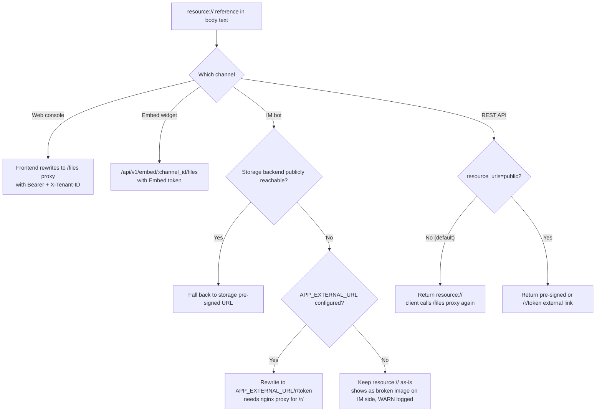

# External Access to Images and Files

"The image in the answer shows fine on the web, but it's a broken image in WeCom" / "The image URL in the citation from the API is `resource://xxx`, and the frontend can't load it" — this is the most common type of issue. The cause isn't a broken image; it's that **different channels can obtain different forms of URLs**, and they need to be matched by channel.

This article explains the four forms and how to obtain each one per channel, with a symptom-based troubleshooting table at the end.

## 1. The four forms

Images and attachments in the knowledge base are stored in object storage. The body text doesn't write the storage path directly — it writes an internal reference instead. When delivered externally, this gets converted into one of the following:

| Form | Looks like | Who can access it | Validity period |
| --- | --- | --- | --- |
| **Internal reference** | `resource://<handle>` | No one can access it directly; this is a stable handle for server-side use | — |
| **Authenticated proxy** | `/files`, `/api/v1/knowledge-bases/:id/files`, `/api/v1/embed/:channel_id/files` | Clients with the corresponding credentials (login session / KB access / Embed token) | Depends on the credential |
| **Capability short link** | `/r/<token>` | Anyone who gets the link (**anonymously readable**) | Grant issued by WeKnora, 2 hours |
| **Storage pre-signed link** | http(s) link given directly by the storage backend | Anyone who gets the link (**anonymously readable**) | Determined by storage; MinIO defaults to 24 hours |

The latter two are "load once you have it" external links, at the cost that **anyone** can read that file within the validity period — don't write them into logs or forward them to people who shouldn't see them.

::: tip Why not unify everything into external links
External links either depend on the storage backend itself being publicly reachable, or require issuing an anonymous grant. The default MinIO deployment (`minio:9000` is an internal address) satisfies neither, while the web frontend already has a login session, so going through the authenticated proxy is both safer and simpler. That's why the default form is internal reference + authenticated proxy, and external links are opt-in.
:::

## 2. How each channel obtains it

### Web console

The frontend rewrites `resource://` and `provider://` references into authenticated proxy addresses (`frontend/src/utils/protectedFileAccess.ts`), choosing the path based on context: normal scenarios go through `/files` (Bearer + `X-Tenant-ID`); knowledge bases shared across tenants go through `/api/v1/knowledge-bases/:id/files` (determined by KB access rights, able to read images under the owning tenant). This path requires no additional configuration.

### IM bots (the most problem-prone one)

IM platforms can't carry WeKnora's credentials, so they must be given a **publicly accessible http(s) URL**. Before sending, `rewriteStorageURLs()` attempts to rewrite it, choosing one of two options:

1. **The storage backend itself is publicly reachable** — object storage uses a public endpoint, or `MINIO_ENDPOINT` is set to a public host. In this case it falls back to a storage pre-signed URL, requiring no additional configuration;
2. **`APP_EXTERNAL_URL` is configured** — the reference is rewritten to `<APP_EXTERNAL_URL>/r/<token>`, and the request is proxied back to the app via nginx's `location ^~ /r/`. The official frontend image already includes this location block; self-built reverse proxies must add it, otherwise requests fall into the SPA fallback and return a blank page.

The default MinIO internal deployment and `local` storage can only use the second option. When neither is satisfied, the rewrite will **keep the original reference** and log an actionable WARN — it's better not to rewrite than to send a link that's guaranteed to fail loading on the IM side. Additionally, when an IM channel is enabled but `APP_EXTERNAL_URL` is empty, the service prints a warning once at startup.

### Embed widget

Visitors are anonymous, so images go through the channel-scoped authenticated proxy `/api/v1/embed/:channel_id/files` (the Embed token injects the channel's tenant, and the handler verifies the request path belongs to that tenant). Embed channels **force the use of internal references**, and won't rewrite even if the deployment default is `public` or the request carries `?resource_urls=public` — otherwise it would be equivalent to handing anonymous visitors an anonymous external link, bypassing the channel's own authentication.

### REST API and SDK

By default, `resource://` is returned, and the client needs to call the `/files` proxy again. If a third-party app wants to render directly, it can request external links:

- Single request: `?resource_urls=public`
- Whole deployment: `RESOURCE_URL_MODE=public`

The per-request parameter takes precedence over the environment variable, so even after setting the deployment default to `public`, you can still use `?resource_urls=handle` to fall back individually. For the interfaces that support this parameter, its scope of coverage, and its security boundaries, see the "File Reference Forms" section of the [API Overview](../04-api/01-api-overview.md).

Two limitations worth remembering: **an API Key scoped to a specific knowledge base will get a 403 when using `public`** (such keys are already forbidden from accessing the `/files` proxy, so getting an anonymous external link would be equivalent to bypassing that same restriction); **when the external link capability isn't available, the reference stays as `resource://`**, and the client can still fall back to the proxy.

## 3. Troubleshooting by symptom

| Symptom | Most likely cause | What to do |
| --- | --- | --- |
| Image is broken/blank in IM | `APP_EXTERNAL_URL` not configured and storage isn't publicly reachable | Configure `APP_EXTERNAL_URL`, confirm nginx proxies `/r/`; check the app logs for a `rewriteStorageURLs no-op` WARN |
| The IM image link opens but returns a blank page | nginx is missing `location ^~ /r/`, request falls into the SPA fallback | Add that location block (already included in the official frontend image), see [Web Frontend](../05-clients/01-frontend.md) |
| `APP_EXTERNAL_URL` is set to an internal address or `localhost` | The IM platform is on the public side and can't reach it | Change it to an address reachable by the IM platform; for local development use ngrok / cloudflared / frp |
| The image URL returned by the API is `resource://` | This is the internal reference by default | Add `?resource_urls=public`, or call the `/files` proxy |
| Added `resource_urls=public` but still returns `resource://` | Deployment lacks external link capability (e.g., `local` storage without `APP_EXTERNAL_URL`) | Satisfy the external link conditions, or use the `/files` proxy instead |
| Added `resource_urls=public` and got a 403 | Using a knowledge-base-scoped API Key | Switch to `handle` mode, or use a full-access Key instead |
| Image doesn't display in the embed widget, but works fine on the web | The widget goes through the channel proxy, different from the main site's credentials | Confirm the widget page carries a valid Embed token; `resource_urls=public` has no effect on embed channels (by design) |
| The external link stops working after a while | External links are time-limited (grant 2 hours / MinIO pre-signed 24 hours) | Don't cache the external link itself; fetch it again when needed. The same file will reuse the same link within its validity period |
| Image 404 on the web frontend, logs show tenant mismatch | The image in a cross-tenant shared library exists under the owning tenant | This scenario should go through `/api/v1/knowledge-bases/:id/files`; confirm the frontend is getting the KB-scoped proxy address |

## 4. Related configuration

| Configuration | Purpose |
| --- | --- |
| `APP_EXTERNAL_URL` | The externally reachable address for IM channel image external links; the prerequisite for rewriting `resource://` into `<APP_EXTERNAL_URL>/r/<token>` |
| `RESOURCE_URL_MODE` | The default form of file references in API responses (`handle` / `public`) |
| `MINIO_ENDPOINT` and other storage endpoints | When set to a public address, external links can be provided by storage pre-signing, without depending on `APP_EXTERNAL_URL` |
| `SYSTEM_AES_KEY` | Recommended to configure: enables reusable grant rows, stable direct link URLs, and reduces write pressure on read endpoints |

## 5. Related sections

- [IM Integration](12-im-integration.md): rewrite logic and startup warnings
- [Web Embed](13-embed-channel.md): channel authentication and anonymous sessions
- [API Overview](../04-api/01-api-overview.md): the full semantics of `resource_urls`
- [Configuration Reference](../01-getting-started/04-configuration.md): the environment variables above
- [Web Frontend](../05-clients/01-frontend.md): nginx's `/files` and `/r/` proxies

---
