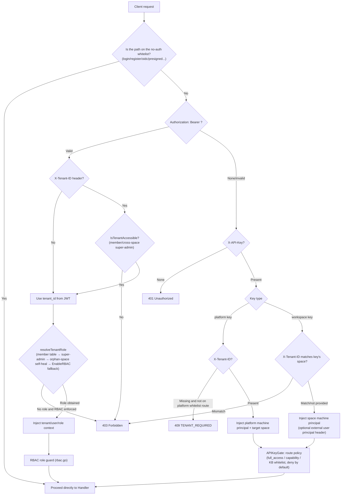

# API Overview

This section describes the general conventions of the WeKnora HTTP API: Base URL, authentication methods, response structure, error codes, pagination, SSE, and rate limiting.

## Base URL and version prefix

- All business APIs are mounted under the `/api/v1` prefix (`r.Group("/api/v1")` in `router.go`).
- Health check: `GET /health` (no authentication required), returns `{"status":"ok"}`.
- Swagger UI: `GET /swagger/*any`, only registered in non-`release` mode (`GIN_MODE != release`).
- Special paths outside authentication: `GET|HEAD /r/:token` (short-lived resource authorization URL), `GET /files` (authenticated file proxy), `GET|HEAD /api/v1/files/presigned` (HMAC-signed URL, no authentication required), `GET /api/v1/files/presigned-preview` (Admin diagnostics).

```
BASE=http://localhost:8080
```

## Authentication methods

Authentication is handled uniformly by the `Auth` middleware in `internal/middleware/auth.go`, attempted in the following order:

### 1. JWT Bearer (Web users)

```
Authorization: Bearer <access_token>
```

- Obtained via `POST /api/v1/auth/login` (or register / auto-setup / OIDC) to get a `token` and `refresh_token`; `POST /api/v1/auth/refresh` issues a new token.
- Optional request header `X-Tenant-ID: <tenant_id>`: switches the target space outside the one referenced by the JWT (must be an active member of that space, or hold the `CanAccessAllTenants` cross-space super-admin attribute). A malformed or `0` value returns 400 directly.
- If the JWT resolves no space at all and the endpoint is not on the "no space needed" whitelist (e.g., `/auth/me`, `/me/invitations`, etc.), a 409 `{"code":"TENANT_REQUIRED"}` is returned.

### 2. API Key (machine principal)

```
X-API-Key: <api_key>
```

- Space-level (workspace) key: created via `POST /api/v1/tenants/:id/api-keys`, bound to a single space; carrying `X-Tenant-ID` pointing to a different space returns 403.
- Platform-level key: created via `POST /api/v1/system/admin/api-keys`, must carry `X-Tenant-ID` to select the target space (except for `/system/admin/*`, `/tenants/all|search`, `POST /tenants`), otherwise returns 409 `TENANT_REQUIRED`.
- Authorization model (`internal/middleware/api_key_gate.go`, deny by default): every `/api/v1` route must explicitly declare an API key policy; routes without a declaration are 403 for any key.
  - `full_access` key: full authority within the space (machine equivalent of Owner).
  - Scoped key: allowed per capability, and constrained by the `knowledge_base_ids` whitelist. Capability constants are in `internal/types/tenant_api_key.go`: `retrieve`, `ingest`, `chat`, `read_agents`, `manage_kbs`, `manage_agents`, `message_history`, `manage_models`, `manage_mcp_services`, `manage_datasources`, `manage_channels`, `manage_vector_stores`, `manage_storage_backends`, `manage_web_search`, `run_evaluations`, `manage_members`, `manage_spaces`, `manage_tenant_settings`; platform capabilities: `system_tenants_read/manage`, `system_settings_read/manage`, `system_runtime_read/manage`, `system_audit_read`.
- External user principal (optional, configured per space via `api-principal-config`):
  - `direct` mode: `X-External-User-ID: <external user ID>` (≤128 characters).
  - `signed_token` mode: `X-External-User-Token: <HS256 JWT>`, requires `aud=weknora`, `exp` (lifetime ≤24h), the `tenant_id` claim matching the target space, and `sub` being the external user ID.

### 3. Embed publish token (anonymous embed endpoints)

The `/api/v1/embed/:channel_id/*` public routes use a separate `EmbedAuth` middleware (`internal/middleware/embed_auth.go`):

```
Authorization: Embed <publish_token or session_token>
```

- `POST /embed/:channel_id/exchange` exchanges a publish token for a short-lived session token; session-level operations additionally require `X-Embed-Session: <sig>` (the signed handle returned when the session was created).
- IM callback routes (`/api/v1/im/callback/:channel_id`) are registered before the global authentication middleware, using each IM platform's own signature verification.

### Authentication flow diagram



## Roles and permission model (RBAC)

`internal/middleware/rbac.go` + `internal/middleware/access.go`:

| Role | Description |
| --- | --- |
| `owner` | Space owner: space lifecycle, API keys, member management |
| `admin` | Space administrator: model/infrastructure/channel and other space-level configuration |
| `contributor` | Contributor: can create KBs/Agents, can modify resources they **created themselves** |
| `viewer` | Read-only member: reading and session usage |
| SystemAdmin | Platform-level administrator (`User.IsSystemAdmin`), independent of space role, guards `/system/admin/*`, always enforced |

- In the documentation, "Viewer+ / Contributor+ / Admin+ / Owner" denotes the minimum role requirement; "creator OR Admin+" corresponds to `RequireOwnershipOrRole` (a Contributor can only modify KBs/Agents/content they created).
- When `cfg.Tenant.EnableRBAC=false`, the role guard only logs and does not block (fail-open rollout); the SystemAdmin guard is unaffected by this switch.
- KB-level access guard `KBAccessRead/Write` (`internal/middleware/kb_access.go`): resolves three access categories — "owned / organization-shared / visible via a shared Agent" — and rewrites the request context's tenant to the KB's owning space.
- An API key principal short-circuits the JWT role guard; its actual permissions are determined entirely by APIKeyGate (capability + KB whitelist).
- Rejected requests are written to the audit log (`middleware.AuditServiceProvider`, deduplicated with a 1-minute sliding window).

## Common response format and error codes

Most handlers return:

```json
{ "success": true, "data": { ... } }
```

List-type endpoints commonly include additional fields: `total`, `page`, `page_size`. A few exceptions: some read endpoints under `/system/admin/*` return raw rows/arrays directly (unwrapped), while `/system/info` and others use `{"code":0,"msg":"success","data":...}`.

Errors are uniformly output by `internal/middleware/error_handler.go` (`AppError` in `internal/errors/errors.go`):

```json
{ "success": false, "error": { "code": 1003, "message": "...", "details": null } }
```

The middleware layer (authentication/RBAC) returns `{"error": "..."}` directly (some include a string `"code"`, such as `TENANT_REQUIRED`).

| Error code | Meaning | HTTP |
| --- | --- | --- |
| 1000 | ErrBadRequest — bad request | 400 |
| 1001 | ErrUnauthorized — not authenticated | 401 |
| 1002 | ErrForbidden — no permission | 403 |
| 1003 | ErrNotFound — resource does not exist | 404 |
| 1004 | ErrMethodNotAllowed | 405 |
| 1005 | ErrConflict — conflict | 409 |
| 1006 | ErrTooManyRequests — rate limit/quota | 429 |
| 1007 | ErrInternalServer — internal error | 500 |
| 1008 | ErrServiceUnavailable — temporarily unavailable | 503 |
| 1009 | ErrTimeout — timeout | — |
| 1010 | ErrValidation — parameter validation failed | 400 |
| 2000-2005 | Space category: does not exist/already exists/deactivated/name required/invalid status/self-service creation disabled | 404/409/403/… |
| 2100-2103 | Agent category: missing thinking model/missing allowed tools/invalid iteration count (1-20)/invalid temperature (0-2) | 400 |
| 2200-2201 | VectorStore binding invalid / currently unavailable | 400 |

There are also non-coded errors: `types.StorageQuotaExceededError` (storage quota exceeded), `types.DuplicateKnowledgeError` (duplicate file/URL; upload endpoints return 409 with `data` carrying the existing Knowledge).

## Pagination convention

`internal/handler/list_pagination.go`:

| Parameter | Type | Required | Description |
| --- | --- | --- | --- |
| `page` | int | No | Page number, defaults to 1, must be ≥1 |
| `page_size` | int | No | Items per page, defaults to 20, range 1-100 |

Out-of-range or invalid values return a validation error (code 1010). List responses carry `total/page/page_size`. Some endpoints use cursor-based pagination: audit logs (`after_id`+`limit`, response carries `next_cursor`), system runtime tasks (`cursor`+`page_size`, response carries `next_cursor/has_more`), Wiki index/log (`cursor`+`limit`).

## Streaming interface protocol (SSE)

Chat-type endpoints (`POST /api/v1/knowledge-chat/:session_id`, `POST /api/v1/agent-chat/:session_id`, `GET /api/v1/sessions/continue-stream/:session_id`, and the corresponding embed-side routes) return Server-Sent Events:

```
Content-Type: text/event-stream
Cache-Control: no-cache
Connection: keep-alive
X-Accel-Buffering: no
```

Each event is `event: message`, with `data:` being the `types.StreamResponse` JSON:

| Field | Type | Description |
| --- | --- | --- |
| `id` | string | Request ID |
| `response_type` | string | `answer` / `references` / `thinking` / `tool_call` / `tool_result` / `reflection` / `session_title` / `agent_query` / `tool_approval_required` / `tool_approval_resolved` / `mcp_oauth_required` / `mcp_oauth_resolved` / `error` / `complete` |
| `content` | string | Incremental text |
| `done` | bool | Whether this event type has ended |
| `knowledge_references` | []SearchResult | References carried by `references` events |
| `tool_calls` | []LLMToolCall | Tool call events |
| `session_id` / `assistant_message_id` | string | Carried by `agent_query` events |
| `usage` | TokenUsage | `prompt_tokens/completion_tokens/total_tokens/cache_*` |
| `finish_reason` | string | Reason for ending |

The stream terminates with `response_type:"complete"` (`done:true`); on error it terminates with `response_type:"error"` (`done:true`). `continue-stream` uses a replay-plus-100ms-polling resumption semantics for catching up on increments (`?message_id=` is required).

## File reference form (resource_urls)

Images/attachments referenced in answers and retrieval results are, by default, returned as internal handles `resource://<handle>`; clients must call the authenticated `/files` proxy again to obtain the content. Third-party apps that want a "ready-to-render" link can switch to direct-link mode:

| Scope | Usage |
| --- | --- |
| Single request | Add `?resource_urls=public` to the URL |
| Entire deployment | Environment variable `RESOURCE_URL_MODE=public` |

Only `handle` (default) and `public` are valid values; passing any other value returns 400. The single-request parameter takes precedence over the environment variable, so even after setting the deployment default to `public`, you can still revert to `handle` for a single request via `?resource_urls=handle`.

Endpoints supporting this parameter: `POST /knowledge-chat/{session_id}`, `POST /agent-chat/{session_id}`, `GET /sessions/continue-stream/{session_id}`, `GET /messages/{session_id}/load`, `POST /knowledge-search`. The rewrite covers the answer body, `knowledge_references` (including `image_info`), Agent execution steps and tool results, as well as image attachments on messages; in streaming responses, references truncated across chunks are buffered first and then rewritten, so the client always receives a complete link.

A few things to know before using this:

- **Requires external-link capability**: direct links come from storage-backend presigned URLs, or `APP_EXTERNAL_URL` + `/r/<token>`. When neither is available (e.g., local storage without `APP_EXTERNAL_URL` set), the reference remains as `resource://` unchanged, and the client can still fall back to `/files`;
- **Direct links are time-limited and anonymously readable** (WeKnora-issued grants last 2 hours, MinIO presigned URLs last 24 hours); anyone who obtains the link can read it before it expires — do not write it into logs or forward it to anyone who shouldn't see it;
- **Not supported by embed channels**: endpoints under `/api/v1/embed/...` force `handle`; visitor images continue to go through the channel-scoped authenticated proxy;
- **API Keys scoped to a specific knowledge base return 403 with `public`**: such keys are already forbidden from accessing the `/files` proxy, and obtaining an anonymous direct link would be equivalent to bypassing that same restriction;
- **Direct links for the same file are reused within their validity period**; repeated requests do not reissue credentials, allowing client and CDN caches to hit.

For which form each channel (Web / IM / embedded widget / API) receives, and how to troubleshoot when images fail to load, see [External Access to Images and Files](../03-features/21-file-access.md).

## Rate limiting

| Surface | Limit | Source |
| --- | --- | --- |
| Public share-link endpoints (`/auth/invitations/lookup`, `/auth/register-by-invite`) | 30 requests/minute per IP (both endpoints share the quota); 429 when exceeded (code 1006) | `internal/middleware/auth_public_ratelimit.go` |
| Embed public routes | `rate_limit_per_minute` (default 30) per (channel, IP)/minute; channel-level `rate_limit_per_minute*20` (minimum 120)/minute; channel-level `rate_limit_per_day` (default 10000)/day; 429 when exceeded | `internal/middleware/embed_auth.go` |
| Reverse-proxy trust | Only trusts `X-Forwarded-For` from `WEKNORA_TRUSTED_PROXIES` (default loopback + private network ranges), preventing forged IPs from bypassing rate limiting | `router.go` `trustedProxies()` |

There is no global rate limiting on other business endpoints; quota-related rejections such as self-service space creation also use 429 (code 1006).

## API group navigation

| Group | Documentation | Main prefix |
| --- | --- | --- |
| Authentication and users | [02-api-auth.md](./02-api-auth.md) | `/auth`, `/me/invitations` |
| Tenants (spaces) and members | [02-api-tenant.md](./02-api-tenant.md) | `/tenants` |
| Organizations and sharing | [02-api-org.md](./02-api-org.md) | `/organizations`, `/shared-*`, `/knowledge-bases/:id/shares`, `/agents/:id/shares` |
| Knowledge bases and knowledge | [02-api-knowledge.md](./02-api-knowledge.md) | `/knowledge-bases`, `/knowledge`, knowledge base folders |
| Chunks and tags | [02-api-chunks.md](./02-api-chunks.md) | `/chunks`, `/knowledge-bases/:id/tags`, `/chunker/preview` |
| FAQ and Wiki | [02-api-faq-wiki.md](./02-api-faq-wiki.md) | `/knowledge-bases/:id/faq`, `/faq`, `/knowledgebase/:kb_id/wiki` |
| Sessions, messages, and chat | [02-api-chat.md](./02-api-chat.md) | `/sessions`, `/messages`, `/knowledge-chat`, `/agent-chat`, `/knowledge-search` |
| Models and initialization | [02-api-model-system.md](./02-api-model-system.md) | `/models`, `/initialization`, `/evaluation`, `/weknoracloud` |
| System and platform administration | [02-api-system.md](./02-api-system.md) | `/system`, `/system/admin` |
| Infrastructure and data sources | [02-api-infra.md](./02-api-infra.md) | `/vector-stores`, `/storage-backends`, `/web-search-providers`, `/datasource` |
| Agent, MCP, and skills | [02-api-agent-mcp.md](./02-api-agent-mcp.md) | `/agents`, `/mcp-services`, `/agent`, `/skills`, `/user/favorites` |
| IM, Embed, and file services | [02-api-channels.md](./02-api-channels.md) | `/im`, `/im-channels`, `/wechat`, `/embed-channels`, `/embed`, `/files`, `/r/:token` |
