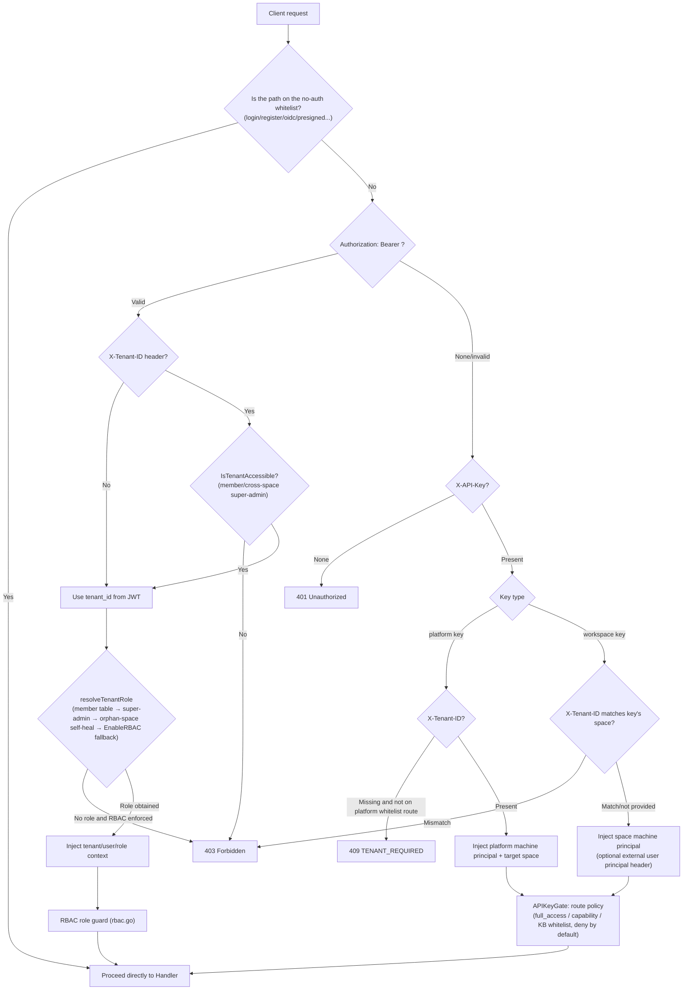

# API Overview

The WeKnora HTTP API uses the `/api/v1` prefix and supports JWT, API Key, and Embed token authentication; the built-in MCP Server endpoints additionally use endpoint tokens. Before calling the resource endpoints, choose credentials according to your client type, and follow the common conventions for responses, error handling, pagination, and streaming events.

## Base URL and version prefix

- All business APIs are mounted under the `/api/v1` prefix (`r.Group("/api/v1")` in `router.go`).
- Health check: `GET /health` (no authentication required), returns `{"status":"ok"}`.
- Swagger UI: `GET /swagger/*any`, only registered in non-`release` mode (`GIN_MODE != release`).
- Special paths outside authentication: `GET|HEAD /r/:token` (short-lived resource authorization URL), `GET /files` (authenticated file proxy), `GET|HEAD /api/v1/files/presigned` (HMAC-signed URL, no authentication required), `GET /api/v1/files/presigned-preview` (Admin diagnostics).

```
BASE=http://localhost:8080
```

## Authentication methods

Authentication is handled uniformly by the `Auth` middleware in `internal/middleware/auth.go`, attempted in the following order:

### JWT Bearer (Web users) {#_1-jwt-bearer-web-users}

```
Authorization: Bearer <access_token>
```

- Obtained via `POST /api/v1/auth/login` (or register / OIDC; the native desktop app uses auto-setup) to get a `token` and `refresh_token`; `POST /api/v1/auth/refresh` issues a new token.
- Optional request header `X-Tenant-ID: <tenant_id>`: switches the target space outside the one referenced by the JWT (must be an active member of that space, or hold the `CanAccessAllTenants` cross-space super-admin attribute). A malformed or `0` value returns 400 directly.
- If the JWT resolves no space at all and the endpoint is not on the "no space needed" whitelist (e.g., `/auth/me`, `/me/invitations`, etc.), a 409 `{"code":"TENANT_REQUIRED"}` is returned.

### API Key (machine principal) {#_2-api-key-machine-principal}

```
X-API-Key: <api_key>
```

- Space-level (workspace) key: created via `POST /api/v1/tenants/:id/api-keys`, bound to a single space; carrying `X-Tenant-ID` pointing to a different space returns 403.
- Platform-level key: created via `POST /api/v1/system/admin/api-keys`, must carry `X-Tenant-ID` to select the target space (except for `/system/admin/*`, `/tenants/all|search`, `POST /tenants`), otherwise returns 409 `TENANT_REQUIRED`.
- Authorization model (`internal/middleware/api_key_gate.go`, deny by default): every `/api/v1` route must explicitly declare an API key policy; routes without a declaration are 403 for any key.
  - `full_access` key: full authority within the space (machine equivalent of Owner).
  - Scoped key: allowed per capability, and constrained by the `knowledge_base_ids` whitelist. Capability constants are in `internal/types/tenant_api_key.go`: `retrieve`, `ingest`, `chat`, `read_agents`, `manage_kbs`, `manage_agents`, `message_history`, `manage_models`, `manage_mcp_services`, `manage_datasources`, `manage_channels`, `manage_vector_stores`, `manage_storage_backends`, `manage_web_search`, `run_evaluations`, `manage_members`, `manage_spaces`, `manage_tenant_settings`; platform capabilities: `system_tenants_read/manage`, `system_settings_read/manage`, `system_runtime_read/manage`, `system_audit_read`.
- External user principal (optional, configured per space via `api-principal-config`):
  - `direct` mode: `X-External-User-ID: <external user ID>` (≤128 characters).
  - `signed_token` mode: `X-External-User-Token: <HS256 JWT>`, requires `aud=weknora`, `exp` (lifetime ≤24h), the `tenant_id` claim matching the target space, and `sub` being the external user ID.

### Embed publish token (anonymous embed endpoints) {#_3-embed-publish-token-anonymous-embed-endpoints}

The `/api/v1/embed/:channel_id/*` public routes use a separate `EmbedAuth` middleware (`internal/middleware/embed_auth.go`):

```
Authorization: Embed <publish_token or session_token>
```

- `POST /embed/:channel_id/exchange` exchanges a publish token for a short-lived session token; session-level operations additionally require `X-Embed-Session: <sig>` (the signed handle returned when the session was created).
- IM callback routes (`/api/v1/im/callback/:channel_id`) are registered before the global authentication middleware, using each IM platform's own signature verification.

### MCP endpoint token (built-in MCP Server)

`/mcp/:endpoint_id` (without the `/api/v1` prefix) is the MCP Streamable HTTP endpoint a space exposes externally, validated by `internal/middleware/mcp_endpoint_auth.go`:

```
Authorization: Bearer <endpoint_token>
```

The token is shown once when the endpoint is created under "Settings → Publish & Integrations → MCP Server", and can be rotated. Requests run as the machine principal of the space that owns the endpoint, with permissions limited to the tools and knowledge bases selected for the endpoint. The endpoint management API is `/api/v1/mcp-endpoints` (Viewer+ to read, Admin+ to change; an API Key needs `manage_channels`); for usage, see [MCP Integration](../03-features/08-mcp.md).

### Authentication flow diagram



## Roles and permission model (RBAC)

`internal/middleware/rbac.go` + `internal/middleware/access.go`:

| Role | Description |
| --- | --- |
| `owner` | Space owner: space lifecycle, API keys, member management |
| `admin` | Space administrator: model/infrastructure/channel and other space-level configuration |
| `contributor` | Contributor: can create KBs/Agents, can modify resources they **created themselves** |
| `viewer` | Read-only member: reading and session usage |
| SystemAdmin | Platform-level administrator (`User.IsSystemAdmin`), independent of space role, guards `/system/admin/*`, always enforced |

- In the documentation, "Viewer+ / Contributor+ / Admin+ / Owner" denotes the minimum role requirement; "creator OR Admin+" corresponds to `RequireOwnershipOrRole` (a Contributor can only modify KBs/Agents/content they created).
- When `cfg.Tenant.EnableRBAC=false`, the role guard only logs and does not block (fail-open rollout); the SystemAdmin guard is unaffected by this switch.
- KB-level access guard `KBAccessRead/Write` (`internal/middleware/kb_access.go`): resolves three access categories — "owned / organization-shared / visible via a shared Agent" — and rewrites the request context's tenant to the KB's owning space.
- An API key principal short-circuits the JWT role guard; its actual permissions are determined entirely by APIKeyGate (capability + KB whitelist).
- Rejected requests are written to the audit log (`middleware.AuditServiceProvider`, deduplicated with a 1-minute sliding window).

## Common response format and error codes

Most handlers return:

```json
{ "success": true, "data": { ... } }
```

List-type endpoints commonly include additional fields: `total`, `page`, `page_size`. A few exceptions: some read endpoints under `/system/admin/*` return raw rows/arrays directly (unwrapped), while `/system/info` and others use `{"code":0,"msg":"success","data":...}`.

Errors are uniformly output by `internal/middleware/error_handler.go` (`AppError` in `internal/errors/errors.go`):

```json
{ "success": false, "error": { "code": 1003, "message": "...", "details": null } }
```

The middleware layer (authentication/RBAC) returns `{"error": "..."}` directly (some include a string `"code"`, such as `TENANT_REQUIRED`).

| Error code | Meaning | HTTP |
| --- | --- | --- |
| 1000 | ErrBadRequest — bad request | 400 |
| 1001 | ErrUnauthorized — not authenticated | 401 |
| 1002 | ErrForbidden — no permission | 403 |
| 1003 | ErrNotFound — resource does not exist | 404 |
| 1004 | ErrMethodNotAllowed | 405 |
| 1005 | ErrConflict — conflict | 409 |
| 1006 | ErrTooManyRequests — rate limit/quota | 429 |
| 1007 | ErrInternalServer — internal error | 500 |
| 1008 | ErrServiceUnavailable — temporarily unavailable | 503 |
| 1009 | ErrTimeout — timeout | — |
| 1010 | ErrValidation — parameter validation failed | 400 |
| 2000-2005 | Space category: does not exist/already exists/deactivated/name required/invalid status/self-service creation disabled | 404/409/403/… |
| 2100-2103 | Agent category: missing thinking model/missing allowed tools/invalid iteration count (1-20)/invalid temperature (0-2) | 400 |
| 2200-2201 | VectorStore binding invalid / currently unavailable | 400 |

There are also non-coded errors: `types.StorageQuotaExceededError` (storage quota exceeded), `types.DuplicateKnowledgeError` (duplicate file/URL; upload endpoints return 409 with `data` carrying the existing Knowledge).

## Pagination convention

`internal/handler/list_pagination.go`:

| Parameter | Type | Required | Description |
| --- | --- | --- | --- |
| `page` | int | No | Page number, defaults to 1, must be ≥1 |
| `page_size` | int | No | Items per page, defaults to 20, range 1-100 |

Out-of-range or invalid values return a validation error (code 1010). List responses carry `total/page/page_size`. Some endpoints use cursor-based pagination: audit logs (`after_id`+`limit`, response carries `next_cursor`), system runtime tasks (`cursor`+`page_size`, response carries `next_cursor/has_more`), Wiki index/log (`cursor`+`limit`).

## Streaming interface protocol (SSE)

Chat-type endpoints (`POST /api/v1/knowledge-chat/:session_id`, `POST /api/v1/agent-chat/:session_id`, `GET /api/v1/sessions/continue-stream/:session_id`, and the corresponding embed-side routes) return Server-Sent Events:

```
Content-Type: text/event-stream
Cache-Control: no-cache
Connection: keep-alive
X-Accel-Buffering: no
```

Each event is `event: message`, with `data:` being the `types.StreamResponse` JSON:

| Field | Type | Description |
| --- | --- | --- |
| `id` | string | Request ID |
| `response_type` | string | `answer` / `references` / `thinking` / `tool_call` / `tool_result` / `command_output` / `reflection` / `session_title` / `agent_query` / `artifacts_pending` / `memory_recalled` / `user_message_injected` / `context_compacted` / `tool_approval_required` / `tool_approval_resolved` / `mcp_oauth_required` / `mcp_oauth_resolved` / `error` / `complete`; the skill installation record stream additionally has `install_prompt` / `install_output` |
| `content` | string | Incremental text |
| `done` | bool | Whether this event type has ended |
| `knowledge_references` | []SearchResult | References carried by `references` events |
| `tool_calls` | []LLMToolCall | Tool call events |
| `data` | object | Additional event metadata (e.g. `success` for tool results, `truncated` for answers) |
| `session_id` / `assistant_message_id` | string | Carried by `agent_query` events |
| `usage` | TokenUsage | `prompt_tokens/completion_tokens/total_tokens/cache_*` |
| `finish_reason` | string | Reason for ending |

The stream terminates with `response_type:"complete"` (`done:true`); on error it terminates with `response_type:"error"` (`done:true`). A failed tool execution is returned as `tool_result` (`data.success=false`); `error` only indicates that the whole round failed. When an answer is truncated by the output limit, the `answer` event carries `data.truncated=true`. `continue-stream` uses a replay-plus-100ms-polling resumption semantics for catching up on increments (`?message_id=` is required).

## File reference form (resource_urls)

Images/attachments referenced in answers and retrieval results are, by default, returned as internal handles `resource://<handle>`; clients must call the authenticated `/files` proxy again to obtain the content. Third-party apps that want a "ready-to-render" link can switch to direct-link mode:

| Scope | Usage |
| --- | --- |
| Single request | Add `?resource_urls=public` to the URL |
| Entire deployment | Environment variable `RESOURCE_URL_MODE=public` |

Only `handle` (default) and `public` are valid values; passing any other value returns 400. The single-request parameter takes precedence over the environment variable, so even after setting the deployment default to `public`, you can still revert to `handle` for a single request via `?resource_urls=handle`.

Endpoints supporting this parameter: `POST /knowledge-chat/{session_id}`, `POST /agent-chat/{session_id}`, `GET /sessions/continue-stream/{session_id}`, `GET /messages/{session_id}/load`, `POST /knowledge-search`, `POST /knowledge-bases/{id}/hybrid-search` (GET also supported for compatibility). The rewrite covers the answer body, search result `content` / `image_info`, `knowledge_references`, Agent execution steps and tool results, as well as image attachments on messages; in streaming answers, references truncated across chunks are buffered first and then rewritten, so the client always receives a complete link.

A few things to know before using this:

- **Requires external-link capability**: direct links come from storage-backend presigned URLs, or `APP_EXTERNAL_URL` + `/r/<token>`. When neither is available (e.g., local storage without `APP_EXTERNAL_URL` set), the reference remains as `resource://` unchanged, and the client can still fall back to `/files`;
- **Direct links are time-limited and anonymously readable** (WeKnora-issued grants last 2 hours, MinIO presigned URLs last 24 hours); anyone who obtains the link can read it before it expires — do not write it into logs or forward it to anyone who shouldn't see it;
- **Not supported by embed channels**: endpoints under `/api/v1/embed/...` force `handle`; visitor images continue to go through the channel-scoped authenticated proxy;
- **API Keys scoped to a specific knowledge base return 403 with `public`**: such keys are already forbidden from accessing the `/files` proxy, and obtaining an anonymous direct link would be equivalent to bypassing that same restriction;
- **Direct links for the same file are reused within their validity period**; repeated requests do not reissue credentials, allowing client and CDN caches to hit.

For which form each channel (Web / IM / embedded widget / API) receives, and how to troubleshoot when images fail to load, see [External Access to Images and Files](../03-features/21-file-access.md).

## Choosing a retrieval API {#retrieval-api}

There are two public retrieval endpoints. Both require the API Key to have the `retrieve` (or full) permission, and both return a list of `SearchResult`.

**Use `POST /knowledge-search` by default.** It follows the same retrieval flow as Q&A in the product (recall → rerank → merge → truncate), and returns the same chunks that Q&A on the page would use. `POST /knowledge-bases/{id}/hybrid-search` is a lower-level recall endpoint: it does not rerank by default and the scores are the recall scores, which suits scenarios where you need to see or control the raw recall results.

### Choosing by scenario

| I want to… | Use | Key request body fields |
| --- | --- | --- |
| Get retrieval results for my own RAG / agent, ranked the same as Q&A on the page | `knowledge-search` | `query` + `knowledge_base_ids`, leave the rest empty |
| Search several knowledge bases at once that use different embedding models | `knowledge-search` | `knowledge_base_ids` |
| Search only within certain documents or tags | `knowledge-search` | `knowledge_ids` / `tag_ids` |
| Adjust the number of results or the recall thresholds, but still rerank | `knowledge-search` | `match_count`, `vector_threshold`, `keyword_threshold` |
| Use a different rerank model, or change the rerank threshold | `knowledge-search` | `rerank.model_id`, `rerank.threshold` |
| Skip rerank and get the recall results directly | `knowledge-search` or `hybrid-search` | For the former, pass `"rerank":{"enabled":false}`; for the latter, omit `rerank` |
| Find out why the result is empty | `knowledge-search` | Check `meta.rerank.outcome` in the response |
| I already computed the query vector myself | `hybrid-search` | `query_embedding` + `disable_keywords_match: true` |
| Evaluate recall quality: fix one knowledge base and fixed parameters, and look at the raw recall scores | `hybrid-search` | Omit `rerank` |
| Building on the evaluation above, compare the effect of adding rerank | `hybrid-search` | Add `rerank` to the same request |
| Return parent chunks and adjacent chunks as separate result rows instead of merging them into the content | `hybrid-search` | This is the default; `skip_context_enrichment: true` turns it off |

### Differences between the two

| | `knowledge-search` | `hybrid-search` |
| --- | --- | --- |
| rerank | On by default (uses the space configuration); the `rerank` object can override or disable it | Off by default; enabled only when a `rerank` object is passed |
| Multiple knowledge bases | Yes, and the embedding models can differ | `knowledge_base_ids` is allowed, but the embedding models must be the same, and the `{id}` in the path must be among them |
| Precomputed vectors | Not supported | `query_embedding` |
| Context chunks | Merged into the result's `content` | Returned as extra result rows |
| When `match_count` is omitted | The space's configured `rerank_top_k` (default 10) | 50 |
| `meta.rerank` | Always returned | Returned only when `rerank` is passed |

The recall parameters (`vector_threshold`, `keyword_threshold`, `match_count`, `disable_keywords_match`, `disable_vector_match`) and the `rerank` object have the same meaning in both endpoints; parameters omitted in `knowledge-search` fall back to the space's retrieval configuration (`GET /tenants/kv/retrieval-config`).

### The rerank object

The `rerank` field has the same structure in both endpoints:

| Field | Type | Default | Description |
| --- | --- | --- | --- |
| `enabled` | bool | `true` | Set to `false` to disable rerank; results keep the recall order |
| `model_id` | string | See below | Rerank model ID (a model with `type` `Rerank` in `GET /models`). If the ID does not exist, is not active, or is not a rerank model, 400 is returned; it never silently switches to another model |
| `top_k` | int | The endpoint's result count | Maximum number of results kept after rerank; a negative number returns 400 |
| `threshold` | float | `rerank_threshold` in the space's retrieval configuration (0.2 if not configured) | Lower bound for the model score; `0` and negative numbers are both valid |

When `model_id` is not passed, the following are used in order: `rerank_model_id` in the space's retrieval configuration → the first rerank model in the space. If neither exists, no rerank is performed, results are returned in recall order, and `meta.rerank.outcome` is `no_model`.

The rerank process shares one implementation (`internal/reranking`) with the Q&A pipeline and the smart-reasoning `search_knowledge` tool:

1. The text sent to the model for scoring = document title + chunk content with Markdown markup removed + image captions and OCR text + generated questions. FAQ entries do not get a title.
2. Results with a score not lower than `threshold` are kept. If none remain and `threshold` is higher than 0.3, the threshold is lowered to `max(threshold×0.7, 0.3)` and filtered again. If there are still none, only the top result is kept when its score is at least 0.15; otherwise an empty list is returned.
3. Ranking score = `0.6×model score + 0.3×recall score + 0.1×source weight`; the result's `metadata` carries `model_score` and `base_score`.
4. MMR (λ=0.7) selects `top_k` results from these to reduce duplicate content.

When `hybrid-search` enables rerank, the candidate pool is the top `max(top_k, 50)` chunks after fusion, so the model has enough candidates to choose from even when `match_count` is small.

When the rerank model fails to load or the call errors, the request does not fail; results are returned in recall order and the reason is recorded in `meta.rerank`.

### meta.rerank diagnostics

The `knowledge-search` response always carries `meta.rerank`; `hybrid-search` carries it only when the request includes a `rerank` object.

```json
{
  "success": true,
  "data": [],
  "meta": {
    "rerank": {
      "applied": true,
      "outcome": "all_below_threshold",
      "model_id": "rr-1",
      "model_source": "tenant",
      "threshold": 0.3,
      "effective_threshold": 0.3,
      "top_score": 0.08,
      "candidate_count": 24,
      "result_count": 0
    }
  }
}
```

| Field | Description |
| --- | --- |
| `applied` | Whether the rerank scores determined the returned order |
| `outcome` | See the table below |
| `model_id` / `model_source` | The model used, and where it came from: `request` (specified in the request), `tenant` (space configuration), `auto` (selected automatically) |
| `threshold` / `effective_threshold` | The requested threshold, and the threshold actually used after degradation |
| `top_score` | The highest model score among the candidates |
| `candidate_count` / `result_count` | Number of candidates sent to rerank / number of results returned |
| `error` | Error message for `model_error` and `model_unavailable` |

| `outcome` | Meaning |
| --- | --- |
| `ok` | Some results reached the threshold |
| `threshold_degraded` | No results at the original threshold; results appeared only after lowering it |
| `fallback_top1` | No threshold was met; only the top-scoring result was kept |
| `all_below_threshold` | The model considers no candidate relevant, so the result is empty. Try rephrasing the question, or lower `rerank.threshold` |
| `model_error` | The model call failed; results are returned in recall order |
| `model_unavailable` | The model failed to load (configuration problems such as credentials or URL); results are returned in recall order |
| `no_model` | The space has no rerank model; results are returned in recall order |
| `disabled` | `rerank.enabled` is `false` in the request |
| `no_candidates` | The recall stage returned no results |

## Rate limiting

| Surface | Limit | Source |
| --- | --- | --- |
| Public share-link endpoints (`/auth/invitations/lookup`, `/auth/register-by-invite`) | 30 requests/minute per IP (both endpoints share the quota); 429 when exceeded (code 1006) | `internal/middleware/auth_public_ratelimit.go` |
| Embed public routes | `rate_limit_per_minute` (default 30) per (channel, IP)/minute; channel-level `rate_limit_per_minute*20` (minimum 120)/minute; channel-level `rate_limit_per_day` (default 10000)/day; 429 when exceeded | `internal/middleware/embed_auth.go` |
| Reverse-proxy trust | Only trusts `X-Forwarded-For` from `WEKNORA_TRUSTED_PROXIES` (default loopback + private network ranges), preventing forged IPs from bypassing rate limiting | `router.go` `trustedProxies()` |

There is no global rate limiting on other business endpoints; quota-related rejections such as self-service space creation also use 429 (code 1006).

## API group navigation

| Group | Documentation | Main prefix |
| --- | --- | --- |
| Authentication and users | [02-api-auth.md](./02-api-auth.md) | `/auth`, `/me/invitations` |
| Tenants (spaces) and members | [02-api-tenant.md](./02-api-tenant.md) | `/tenants` |
| Organizations and sharing | [02-api-org.md](./02-api-org.md) | `/organizations`, `/shared-*`, `/knowledge-bases/:id/shares`, `/agents/:id/shares` |
| Knowledge bases and knowledge | [02-api-knowledge.md](./02-api-knowledge.md) | `/knowledge-bases`, `/knowledge`, knowledge base folders |
| Chunks and tags | [02-api-chunks.md](./02-api-chunks.md) | `/chunks`, `/knowledge-bases/:id/tags`, `/chunker/preview` |
| FAQ and Wiki | [02-api-faq-wiki.md](./02-api-faq-wiki.md) | `/knowledge-bases/:id/faq`, `/faq`, `/knowledgebase/:kb_id/wiki` |
| Sessions, messages, and chat | [02-api-chat.md](./02-api-chat.md) | `/sessions`, `/messages`, `/knowledge-chat`, `/agent-chat`, `/knowledge-search` |
| Models and initialization | [02-api-model-system.md](./02-api-model-system.md) | `/models`, `/initialization`, `/evaluation`, `/weknoracloud` |
| System and platform administration | [02-api-system.md](./02-api-system.md) | `/system`, `/system/admin` |
| Infrastructure and data sources | [02-api-infra.md](./02-api-infra.md) | `/vector-stores`, `/storage-backends`, `/web-search-providers`, `/datasource` |
| Agent and MCP | [02-api-agent-mcp.md](./02-api-agent-mcp.md) | `/agents`, `/mcp-services`, `/agent`, `/user/favorites` |
| Built-in MCP Server | [MCP Integration](../03-features/08-mcp.md) | `/mcp-endpoints`, `/mcp/:endpoint_id` |
| Local browser | [Local Browser](../05-clients/09-local-browser.md) | `/me/browser`, `/local-browser` |
| Sandbox, skills, and personal variables | [02-api-sandbox-skills.md](./02-api-sandbox-skills.md) | `/sandbox-configs`, `/skills`, `/me/env-vars` |
| Long-term memory | [02-api-memory.md](./02-api-memory.md) | `/memory`, `/tenants/kv/memory-config` |
| IM, Embed, and file services | [02-api-channels.md](./02-api-channels.md) | `/im`, `/im-channels`, `/wechat`, `/embed-channels`, `/embed`, `/files`, `/r/:token` |

For the new configuration and personal endpoints, see [Sandbox, Skills, and Personal Variables](02-api-sandbox-skills.md) and [Long-Term Memory](02-api-memory.md); for listing and downloading generated files, see [Sessions and Chat](02-api-chat.md).
