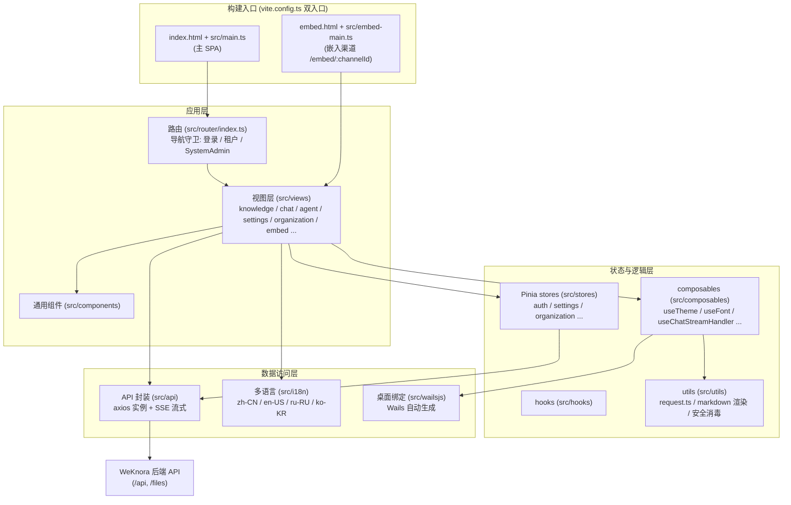

Aqui está o documento completo traduzido para inglês, com toda a estrutura markdown preservada:

--- DOCUMENT START ---
# Web Frontend (frontend/)

WeKnora's web frontend is a single-page application (SPA) built on **Vue 3 + TypeScript + Vite**, hosting the entire interaction surface for knowledge base management, Agent conversations, organization collaboration, and system settings. The same codebase serves three deployment forms simultaneously:

1. **Standard Web deployment**: the Vite build output is hosted by an nginx container, with `/api` reverse-proxied to the backend;
2. **Web embedding (Embed)**: a separate lightweight entry point, `frontend/embed.html` + `frontend/src/embed-main.ts`, for third-party websites to embed the agent chat via iframe / floating widget;
3. **Desktop (Wails)**: communicates with the desktop process's Go side via auto-generated bindings under `frontend/src/wailsjs/`; the frontend code contains extensive adaptations for the desktop form factor (e.g. `--wails-draggable` drag regions, window light/dark theme syncing).

## Tech Stack Overview

Based on `frontend/package.json` (version 0.7.2):

| Category | Choice | Version | Notes |
| --- | --- | --- | --- |
| Framework | Vue | ^3.5.34 | Composition API, `<script setup>` style |
| Language | TypeScript | ~6.0.3 | `vue-tsc` for type checking (`npm run type-check`) |
| Build tool | Vite | ^7.3.5 | Plugins: `@vitejs/plugin-vue`, `@vitejs/plugin-vue-jsx` |
| UI component library | TDesign (tdesign-vue-next) | ^1.19.2 | Paired with `tdesign-icons-vue-next` 0.4.4 (version pinned via overrides) |
| State management | Pinia | ^3.0.4 | All stores live under `frontend/src/stores/` |
| Routing | Vue Router | ^4.5.0 | `createWebHistory`, see `frontend/src/router/index.ts` |
| Internationalization | vue-i18n | ^11.4.2 | zh-CN / en-US / ru-RU / ko-KR |
| HTTP | axios | ^1.16.0 | Unified instance wrapped in `frontend/src/utils/request.ts` |
| SSE streaming | @microsoft/fetch-event-source | ^2.0.1 | Chat streaming replies, see `frontend/src/api/chat/streame.ts` |
| Markdown rendering | marked / marked-katex-extension / katex / highlight.js / mermaid | — | Rich-text rendering of chat answers (formulas, code highlighting, diagrams) |
| Security | dompurify | ^3.4.11 | Unified sanitization of v-html content (`frontend/src/utils/markdownDomPurify.ts`) |
| Document preview | docx-preview / @vue-office/pptx / xlsx / papaparse | — | In-app preview of Word / PPT / Excel / CSV |
| Long lists | vue-virtual-scroller | 2.0.0-beta.8 | Virtual scrolling for the message list |
| Styling | Less + CSS Variables | less ^4.6.4 | Theme variables in `frontend/src/assets/theme/theme.css` |

Notable dependency details:

- `xlsx` isn't installed from the npm registry but as a local tarball: `"xlsx": "file:./packages/xlsx-0.20.2.tgz"` (this is the purpose of the `frontend/packages/` directory — pin the version and allow offline installs);
- `frontend/pnpm-workspace.yaml` does not declare a sub-package workspace; it only contains an `allowBuilds` allowlist (permitting `@vue-office/pptx`, `esbuild`, `vue-demi` to run build scripts), used for pnpm's build-script security policy;
- `overrides` / `resolutions` disable `lightningcss` and unify the versions of `esbuild` and `serialize-javascript`.

## Module Structure

### Directory Quick Reference

| Directory | Responsibility |
| --- | --- |
| `frontend/src/main.ts` | Main SPA entry point: installs TDesign / Pinia / Router / i18n, initializes theme and font, registers the TDesign icon offline guard (`installTDesignIconOfflineGuard`, avoiding runtime requests to `tdesign.gtimg.com`), and waits for `router.isReady()` before mounting to avoid first-paint flicker |
| `frontend/src/embed-main.ts` | Embed entry point: a separate Vue app with its own router (only `/embed/:channelId`), mounted to `#embed-app`, using its own i18n instance (`src/i18n/embed.ts`) |
| `frontend/src/views/` | Page-level components, organized by business domain in subdirectories (see the routing table below) |
| `frontend/src/components/` | Cross-page shared components (message bubbles, upload overlay, command palette, etc.) |
| `frontend/src/stores/` | Pinia state (see the store table below) |
| `frontend/src/api/` | Backend API wrappers (see the API module table below) |
| `frontend/src/composables/` | Composable functions: theme, font, chat stream handling, citation popovers, Embed bridging, etc. |
| `frontend/src/hooks/` | Business hooks (e.g. `useKnowledgeBase`) |
| `frontend/src/utils/` | Utility set: axios instance, markdown rendering pipeline, DOMPurify sanitization, Agent tool display, etc. |
| `frontend/src/i18n/` | vue-i18n configuration and language packs |
| `frontend/src/assets/theme/` | Theme CSS variables (light / dark) |
| `frontend/src/wailsjs/` | Wails desktop auto-generated bindings (do not hand-edit) |
| `frontend/src/directives/`, `frontend/src/types/`, `frontend/src/config/` | Custom directives, type definitions, configuration |
| `frontend/public/` | Static assets: `weknora-widget.js` (embed loader for third-party sites), `config.js` (runtime config placeholder, overwritten at container startup), offline TDesign icons |
| `frontend/packages/` | Local dependency tarballs (`xlsx-0.20.2.tgz`) |

## Page Routing Reference

Routes are defined in `frontend/src/router/index.ts`, using `createWebHistory`, and every page component is a dynamic import (lazily code-split per route).

### Top-Level Routes

| Path | Name | Component | Function |
| --- | --- | --- | --- |
| `/` | — | Redirect | Redirects to `/platform/knowledge-bases` |
| `/login` | `login` | `src/views/auth/Login.vue` | Login page (includes OIDC, language switcher, animated background) |
| `/register` | `registerByInvite` | `src/views/auth/Login.vue` | Invite registration landing page — reuses the Login component, detecting `?token=xxx` on mount to switch into invite-registration mode |
| `/onboarding/workspace` | `workspaceOnboarding` | `src/views/auth/WorkspaceOnboarding.vue` | Workspace onboarding page for users without a tenant (create one or wait to be invited); requires login but not an existing tenant |
| `/join` | `joinOrganization` | Redirect | Organization invite link; converts `?code=` into an `invite_code` parameter and forwards to `/platform/organizations` |
| `/knowledgeBase` | `home` | `src/views/knowledge/KnowledgeBase.vue` | Knowledge base detail page (legacy top-level path) |
| `/platform` | `Platform` | `src/views/platform/index.vue` | Main platform layout (side menu + router outlet + global settings modal + drag-and-drop upload overlay), redirects to the knowledge base list by default |
| `/platform/dev/markdown` | `markdownTest` | `src/views/dev/MarkdownTestPage.vue` | Markdown rendering visual regression test page, registered only in dev mode (`import.meta.env.DEV`) |

### `/platform` Sub-Routes

| Path | Name | Component | Function |
| --- | --- | --- | --- |
| `/platform/knowledge-bases` | `knowledgeBaseList` | `src/views/knowledge/KnowledgeBaseList.vue` | Knowledge base list: space sidebar (All / Mine / By organization / Favorites / Recent), card list, creation entry point |
| `/platform/knowledge-bases/:kbId` | `knowledgeBaseDetail` | `src/views/knowledge/KnowledgeBase.vue` | Knowledge base detail: document list, upload, parsing status, conversation entry point, wiki, etc. |
| `/platform/agents` | `agentList` | `src/views/agent/AgentList.vue` | Agent list and management; editing goes through `AgentEditorModal.vue` |
| `/platform/creatChat` | `globalCreatChat` | `src/views/creatChat/creatChat.vue` | New conversation page: suggested questions, starting a session after selecting a knowledge base/Agent/model |
| `/platform/knowledge-bases/:kbId/creatChat` | `kbCreatChat` | `src/views/creatChat/creatChat.vue` | Starts a new conversation from within a knowledge base's context (same component) |
| `/platform/chat/:chatid` | `chat` | `src/views/chat/index.vue` | Conversation page: message stream (SSE streaming render, skeleton screens, virtual scrolling), citation panel, attachment preview |
| `/platform/organizations` | `organizationList` | `src/views/organization/OrganizationList.vue` | Organization list: create/join organizations, member and shared-resource management (paired with `OrganizationSettingsModal.vue`) |
| `/platform/settings` | `settings` | `src/views/settings/Settings.vue` | Settings center (full-screen modal form factor); see "Settings Center Sections and Visibility" below |
| `/platform/tenant` | — | Redirect | Compatibility for the old path → `/platform/settings` |
| `/platform/knowledge-search` | — | Redirect | Old global search path → knowledge base list, opening the global command palette (⌘K) via `?cmdk=` |
| `/platform/integrations` | — | Redirect | → `/platform/settings?section=integrations` (API / Chrome extension / Claw Skill integrations; views under `src/views/integrations/`) |
| `/platform/system`, `/platform/system/settings`, `/platform/system/admins` | `systemSettings` / `systemAdmins` | Redirect | Old system administration paths → `/platform/settings?section=system-global`, requiring `requiresSystemAdmin` (views under `src/views/system/`: `SystemSettings.vue`, `SystemAuditLog.vue`, `PlatformAPIKeys.vue`, etc.) |
| `/platform/system/queues` | `systemQueues` | Redirect | → `/platform/settings?section=runtime-queues` (runtime task queues, `src/views/system/RuntimeQueues.vue`) |

### Standalone Entry Point: Embed Page

`/embed/:channelId` is not part of the main SPA's routing; instead it is a standalone entry point made up of `frontend/embed.html` + `frontend/src/embed-main.ts` (both nginx and the Vite dev server fall back `/embed/*` requests to `embed.html`). Its component is `src/views/embed/EmbedPage.vue` (along with `EmbedChatView.vue` / `EmbedChatCore.vue` / `EmbedBotMessage.vue`, etc.), authenticated via an Embed token, for third-party websites to embed via iframe.

### Settings Center Sections and Visibility

`Settings.vue` presents all sections across seven groups, addressable via `?section=`:

| Group | Sections (`section` values) |
| --- | --- |
| Account | `general` (personal preferences), `userprofile` |
| Space | `tenant` (space info), `members`, `chathistory` |
| Model & Runtime | `models`, `ollama`, `weknoracloud` |
| Publishing & Integrations | IM integrations, web embedding, API, Chrome extension, Claw Skill |
| Data & Extensions | `vectorstore`, `parser`, `storage`, `websearch`, `mcp` |
| System Administration | `system-global`, `runtime-queues`, `platform-api-keys`, `system-audit-log` |
| Platform | `system` (version info) |

Visibility is governed by two sets of rules, and **the frontend only narrows what's shown — the backend route guards are the authority**:

- **Space role threshold**: `SETTINGS_SECTION_MIN_ROLE` in `frontend/src/config/settingsAccess.ts` assigns a minimum role to each section. `general` / `models` / `system` / `userprofile` / `tenant` / `members` are visible starting at `viewer` (read-only visibility); the rest (`ollama`, `weknoracloud`, `websearch`, `chathistory`, `vectorstore`, `parser`, `storage`, `mcp`) require `admin`. There's also `SETTINGS_MANAGEMENT_SHORTCUT_MIN_ROLE`: the shortcuts labeled "Manage" in the avatar menu have a higher threshold (member management requires `owner`, model management requires `admin`), to avoid disguising a read-only page as a management entry point.
- **System administrator allowlist**: `SYSTEM_ADMIN_SETTINGS_SECTIONS` (`system-global`, `runtime-queues`, `platform-api-keys`, `system-audit-log`) is shown only to system administrators, independent of the space role — see the "System Administrator and Platform Console" section of [Tenants, Users, and Authentication/Authorization](../03-features/01-tenant-auth.md) for details.

### Knowledge Base Editor Modal Sections

A fair amount of configuration **isn't in the settings center but in the knowledge base editor modal** (`KnowledgeBaseEditorModal.vue`), because these settings take effect per-base. The sidebar sections are organized into five groups, three of which only appear when "editing an existing knowledge base":

| Group | Section (`key`) | Notes |
| --- | --- | --- |
| Basics | `basic`, `models` | Name, type, conversation/vector/summary models |
| Processing | `parser`, `multimodal`, `asr`, `chunking` | Parsing engine and header-row handling, image understanding, speech transcription, chunking parameters |
| Data | `vectorStore`, `storage`, `faq` | `faq` only for FAQ-type bases; `vectorStore` cannot be changed once bound |
| Integrations | `datasource` | **Edit mode only** — Feishu / Notion / Yuque / RSS sync is configured here, not in global settings |
| Management | `graph`, `advanced`, `share`, `activity` | Knowledge graph, advanced settings, share to organization, activity stream; the latter two are edit-mode only |

### Global Command Palette (⌘K / Ctrl+K)

`components/GlobalCommandPalette.vue` is the second major navigation channel besides the sidebar:

- Searches knowledge bases, documents, and conversations, and supports narrowing scope to a specific knowledge base (scope chip) before searching;
- Shows recent searches and quick actions (create a knowledge base, upload, start a new conversation, etc.) in the empty state;
- The entry point in the top-right corner opens the **retrieval settings drawer** (`views/settings/RetrievalSettings.vue`). This is where TopK, vector/keyword thresholds, and reranking parameters are tuned — it's **not in the settings center**, so if you can't find it, this is where it lives.

### Navigation Guards

`router.beforeEach` implements a full authentication/authorization chain (`frontend/src/router/index.ts`):

1. **OIDC callback pass-through**: when the URL hash contains `oidc_result=` / `oidc_error=`, the guard passes through directly, letting `App.vue` consume it;
2. **Lite / desktop deep-link restoration**: when Lite mode hard-refreshes and lands on the default home page, the last-visited `/platform` sub-path is restored from `sessionStorage`;
3. **Session restoration**: when not logged in, the guard first tries to restore the session using the `weknora_token` in `localStorage` by calling `getCurrentUser()` (also refreshing memberships, to avoid stale role information);
4. **Lite auto-login**: if restoration fails, it attempts `autoSetup()` once (login-free single-machine mode); on failure, a flag is set in `localStorage` to avoid repeated attempts;
5. **Tenant threshold**: logged in but without a valid tenant → redirect to `/onboarding/workspace`;
6. **SystemAdmin threshold**: routes with `requiresSystemAdmin` redirect non-system-administrators back to the knowledge base list (this is UI-layer interception only; the server enforces its own stricter check).

## State Management (Pinia)

Stores and helper modules under `frontend/src/stores/`:

| File | Store ID / Type | Responsibility |
| --- | --- | --- |
| `stores/auth.ts` | `useAuthStore` | Core authentication: user / token / refreshToken / tenant / memberships / role checks (`hasRole`, `isSystemAdmin`), Lite mode flag; on logout, cascades clearing of other stores' space-scoped caches and reloads per-user preferences (theme/font) |
| `stores/chatResources.ts` | `useChatResourcesStore` | Space-scoped resource cache (60s TTL): knowledge bases, Agents, models, web search provider lists, reused by the chat/new-conversation selectors |
| `stores/editorResources.ts` | `useEditorResourcesStore` | Editor/settings-related resource cache (60s TTL): storage engine configuration and status, prompt templates, parsing engines, system info, MCP services, Skills, Agent type presets, retrieval configuration |
| `stores/commandPalette.ts` | `useCommandPaletteStore` | Global command palette (⌘K / Ctrl+K) open state and query; recent searches are scoped by (user, tenant) to avoid leaking across accounts |
| `stores/organization.ts` | `useOrganizationStore` | Organization collaboration: organization list, members, shared knowledge bases/Agents, join requests and review, role upgrades, and the full set of related actions |
| `stores/organizationState.ts` | Pure function module | Organization list upsert/merge, join-review effects on member counts, and other pure logic (paired with the `organizationState.test.ts` unit tests) |
| `stores/settings.ts` | Settings store | Conversation and Agent configuration: selected knowledge bases/files/tags/MCP/Skills/tools, model configuration, Ollama configuration, web search toggle, etc. |
| `stores/settingsStorage.ts` | Pure function module | Reading, cloning, and built-in Agent mode repair for settings persistence (the `WeKnora_settings` key) (paired with `settingsStorage.test.mjs`) |
| `stores/menu.ts` | `useMenuStore` | Left-side navigation menu structure (new conversation, knowledge bases, Agents, etc.) and i18n titles |
| `stores/knowledge.ts` | `knowledgeStore` | Knowledge card list and total count (lightweight) |
| `stores/ui.ts` | `useUIStore` | Global UI state: settings modal, knowledge base editor modal, manual document editor, sidebar collapse toggle, and related parameters |
| `stores/uploadConfirm.ts` | Upload confirmation store | State for confirmation dialogs on upload / URL import / manual entry / re-parse processing parameters |
| `stores/versionedRequest.ts` | Pure function module | `createVersionedRequestCoordinator`: a versioned caching request coordinator that prevents stale responses from overwriting newer writes (paired with `versionedRequest.test.ts`) |

## API Wrappers (frontend/src/api/)

### Request Foundation

- **axios instance**: `frontend/src/utils/request.ts` creates a unified instance (`baseURL` comes from `getApiBaseUrl()` in `frontend/src/utils/api-base.ts`, respecting Vite's `BASE_URL` to support subpath reverse-proxy deployments; 30s timeout).
- **Request interceptor**: automatically attaches `Authorization: Bearer <weknora_token>` (the Embed channel's `Embed ` token is not overwritten), `Accept-Language` (the current i18n language), `X-Request-ID` (a random string), and `X-Tenant-ID` (for cross-space access, always carrying the active space id so the header isn't lost after switching spaces).
- **Response interceptor**: 2xx responses are unwrapped to return `data`; 401 triggers a single-flight refresh-token flow, with the failed-request queue replayed afterward; 401s on public endpoints (`/auth/login`, `/auth/auto-setup`, `/auth/invitations/lookup`, `/api/v1/embed/`, and other `PUBLIC_AUTH_PATHS`) are thrown directly to the page instead of redirecting to login; Embed pages never redirect to `/login`.
- **SSE streaming**: `frontend/src/api/chat/streame.ts` wraps `useStream()` on top of `@microsoft/fetch-event-source`, supporting streaming output, loading state, error state, and request debug metadata; at a higher level, `frontend/src/composables/useChatStreamHandler.ts` organizes this into the chat message stream.

### Module Reference

| Module | Responsibility |
| --- | --- |
| `api/auth/` | Login, registration, OIDC, `autoSetup` (Lite login-free mode), `getCurrentUser` session restoration |
| `api/tenant/` (`index` / `members` / `invitations` / `audit-log`) | Tenant (workspace) info, member management, invitations, audit log |
| `api/organization/` | Organization CRUD, members, shared knowledge bases/Agents, join requests |
| `api/knowledge-base/` | Knowledge base CRUD and file/knowledge-entry management |
| `api/chat/` (`index` / `streame` / `temporary-attachments`) | Conversation CRUD, title generation, SSE streaming Q&A, temporary attachments |
| `api/chat-history.ts` | Chat history |
| `api/agent/` | Custom Agent CRUD, type presets, placeholders (including built-in Quick Answer / Smart Reasoning ids) |
| `api/model/` | Model configuration management |
| `api/retrieval.ts` | Tenant retrieval configuration |
| `api/vector-store.ts` / `api/storage-backend.ts` / `api/chunker/` | Vector store, storage backend, chunker configuration |
| `api/datasource/` | Data source integration |
| `api/embed/` | Web embedding channel management (create channel, rate limiting, etc.) |
| `api/initialization/` | System initialization flow |
| `api/system/` | System info, storage engine status, prompt templates, parsing engines, and other system-level APIs |
| `api/mcp-service.ts` / `api/skill/` | MCP service and Skill management |
| `api/web-search.ts` / `api/web-search-provider.ts` | Web search and provider configuration |
| `api/wiki/` | Knowledge base wiki generation APIs |
| `api/message-suggestion.ts` | Suggested questions |
| `api/user-favorites.ts` | User favorites (favorited knowledge bases/Agents list) |

## Waiting States in the Conversation Timeline

The RAG pipeline's visual progress indicator (`views/chat/components/RagPipelineProgress.vue`) has a quiet period between "all visible steps have completed" and "the model emits its first character." This gap is described by `utils/rag-pipeline-state.ts`:

- `getRagPipelineWaitKind()` determines the wait type: only a turn where the retrieval step actually completed is labeled `model` (answer generation in progress); pure attachment-based Q&A turns with no retrieval step get the neutral `preparing` state, rather than no feedback at all;
- `createRagWaitController()` handles the presentation details: it delays showing for `RAG_WAIT_REVEAL_DELAY_MS` (250ms) to avoid a flash when the model answers quickly; after `RAG_WAIT_STALL_DELAY_MS` (60s) it switches to a "stalled" state — since the backend stops sending `is_completed` once the SSE connection drops, without this cap the progress bar would claim "almost done" forever;
- State changes are announced through a persistent `aria-live` region, so screen reader users don't miss updates due to whole-node replacement.

## Internationalization (i18n)

Implemented in `frontend/src/i18n/index.ts`, based on `vue-i18n` (Composition mode with `legacy: false`, `globalInjection: true`):

- **Supported languages** (`frontend/src/i18n/locales/`):
  - `zh-CN` (Simplified Chinese, default and fallback)
  - `en-US` (English)
  - `ru-RU` (Russian)
  - `ko-KR` (Korean)
- The selected language is persisted under the `locale` key in `localStorage`; the axios interceptor writes the current language into the `Accept-Language` request header, so the backend returns localized content.
- Because some translations deliberately embed `<strong>` tags (rendered via v-html after DOMPurify sanitization), `warnHtmlMessage: false` is configured to disable vue-i18n's HTML warning.
- **Standalone Embed i18n**: the visitor-facing embed page uses a separate `frontend/src/i18n/embed.ts` (loaded by `embed-main.ts`); the admin-side "web embedding" copy remains in the main language pack; `frontend/src/i18n/locales/embed/index.ts` uniformly re-exports the language normalization helpers (supporting syncing the embed language from URL parameters).
- **Audit and pruning tools**: language packs grow large and tend to accumulate unreferenced dead keys or untranslated new keys, so three companion scripts exist (`frontend/package.json`):

  | Command | Purpose |
  | --- | --- |
  | `npm run check-i18n` | Runs `src/i18n/localeKeyAudit.test.ts`, verifying that the key sets across language packs are consistent with no missing references |
  | `npm run scan-i18n-gaps` | Scans the source code for actually-used keys and compares against the language packs, reporting undefined and unused keys |
  | `npm run regenerate-i18n-locales` | Regenerates pruned language packs based on the scan results |

  Audit log action names use a separate registry (`i18n/auditActionRegistry.ts` + `auditActionLocaleDefaults.ts`); when adding a new audit action, just add an entry to the registry to avoid the pruning tool deleting it as an unreferenced dead key.

## Theme and Appearance

- **Theme mode**: `frontend/src/composables/useTheme.ts` provides three states: `light | dark | system`. It takes effect by setting the `theme-mode` attribute on `document.documentElement`; `system` mode listens to the `prefers-color-scheme` media query to follow automatically.
- **CSS variables**: `frontend/src/assets/theme/theme.css` defines two sets of variables — `:root[theme-mode="light"]` and `:root[theme-mode="dark"]` — following the TDesign token system (`--td-brand-color-*`, `--td-bg-color-*`, `--td-text-color-*`, fonts/border-radius/shadows, etc.); the brand color is green-based; component styles uniformly reference these variables to enable one-click theme switching.
- **Preference persistence**: theme and font preferences are stored in `localStorage` namespaced by user id via `frontend/src/composables/preferenceStorage.ts`; on login/logout/account switch, `reloadThemeFromStorage()` / `reloadFontFromStorage()` reload them (triggered in `stores/auth.ts`).
- **Font**: `frontend/src/composables/useFont.ts` manages the interface font selection; on startup, `main.ts` calls `initTheme()` + `initFont()`.
- **Desktop sync**: `syncWailsNativeChrome()` in `useTheme.ts` calls the Wails runtime's `WindowSetDarkTheme / WindowSetLightTheme / WindowSetBackgroundColour` to keep the native window's background color in sync with the web theme, reducing white-flash on refresh.

## Build and Deployment

### Development and Build (vite.config.ts)

Key points from `frontend/vite.config.ts`:

- **Dual-entry build**: `rollupOptions.input` builds both `index.html` (main SPA) and `embed.html` (embed page) simultaneously; in development, a custom plugin `embedHtmlDevFallback()` rewrites `/embed/:channelId` requests to `/embed.html`, matching nginx's behavior.
- **Code splitting**: `manualChunks` splits mermaid/dagre/cytoscape, marked/katex, and highlight.js into `vendor-mermaid`, `vendor-markdown`, and `vendor-highlight` respectively; the embed entry point filters out the heavy chat chunk via `modulePreload.resolveDependencies`, ensuring the embed page's first paint only loads the code needed for token exchange.
- **Version injection**: `__FRONTEND_VERSION__` (package.json version) and `__FRONTEND_COMMIT__` (`VITE_FRONTEND_COMMIT` / `GITHUB_SHA` / `git rev-parse`) are injected at compile time.
- **Dev proxy**: both the dev server (port 5173) and preview (port 4173) proxy `/api` and `/files` to `VITE_DEV_PROXY_TARGET` (or `FRONTEND_BACKEND_URL`, defaulting to `http://localhost:8080`).
- **Aliases**: `@` → `frontend/src`; plus an entry-file detection fix for `@vue-office/pptx`.
- Common scripts: `npm run dev` / `npm run build` / `npm run preview` (serves the production build locally, the closest environment to verifying the release image) / `npm run type-check` / `npm run test` (tsx --test).

### Production Image (Dockerfile + nginx)

`frontend/Dockerfile`:

- The base image is pinned to a digest-locked `nginx:1.30.3-alpine` (a comment explicitly forbids reverting to a floating tag — newer Alpine 3.24+ fails to boot on old CentOS 7 kernels, which caused an incident in v0.7.0);
- Static output must be built on the host first (`./scripts/build_frontend_dist.sh`); the image only `COPY`s the `dist` folder;
- `nginx.conf` is placed as a template at `/etc/nginx/templates/default.conf.template`, exposing port 80, with `docker-entrypoint.sh` as the entry point.

`frontend/docker-entrypoint.sh` (runtime configuration injection):

1. Generates `/usr/share/nginx/html/config.js`, writing `MAX_FILE_SIZE_MB` (default 50) into `window.__RUNTIME_CONFIG__` for the frontend to read at runtime;
2. Renders the nginx template with `envsubst`; configurable environment variables include `MAX_FILE_SIZE_MB`, `APP_HOST` (default `app`), `APP_PORT` (default `8080`), `APP_SCHEME` (default `http`; set to `https` for a remote HTTPS backend);
3. Starts nginx in the foreground.

Key behaviors of `frontend/nginx.conf`:

- **SPA fallback**: `try_files ... /index.html` under `/`, with `index.html` set to `no-cache` (avoiding users being stuck on a stale version after an upgrade); hashed `/assets/*` files get a one-year immutable cache;
- **API proxy**: `/api/` and `/files` are reverse-proxied to `${APP_SCHEME}://${APP_HOST}:${APP_PORT}`; `/api/` disables `proxy_buffering` / caching / chunked encoding for SSE, extends read/write timeouts to 3600s, and configures 3 upstream retries;
- **Resource short links `/r/`**: `location ^~ /r/` is also reverse-proxied to the backend. IM channels rewrite `resource://` images into `<APP_EXTERNAL_URL>/r/<token>`; without this configuration, requests fall through to the SPA fallback and images show blank on the IM side (see [IM Integration](../03-features/12-im-integration.md) for details);
- **Embed page**: `/embed/*` falls back to `embed.html` (a separate location that does not inherit the main site's `X-Frame-Options: SAMEORIGIN`, so it can be loaded by third-party iframes); `/weknora-widget.js` is the static loader for third-party sites; the file header also includes an optional example server block for a standalone embed subdomain;
- Gzip is enabled (a comment records the measured benefit: first paint drops from 25s to 3-5s on low bandwidth), along with a set of security response headers (`X-Frame-Options`, `X-Content-Type-Options`, `Referrer-Policy`, etc.), repeated within each location to work around nginx's `add_header` not being inherited.

## Desktop (Wails) Integration

`frontend/src/wailsjs/` contains bindings auto-generated by the Wails framework (the file headers are marked "automatically generated. DO NOT EDIT"):

- `wailsjs/go/main/App.d.ts` / `App.js`: JS bindings for the Go-side `App` struct's methods, including `CheckForUpdates` / `AutoCheckForUpdates` (desktop update checks), `GetAPIBaseURL` / `GetAPILanBaseURL`, and the desktop's built-in HTTP server port and external-listening settings (`GetDesktopHTTPPortSetting`, `SetDesktopHTTPBindPublicSetting`, etc.);
- `wailsjs/runtime/`: the Wails runtime API (window control, etc.); when the frontend runs in a browser environment, calls to it gracefully degrade via try/catch (e.g. in `useTheme.ts`).

The desktop app's window content is this same frontend codebase — Lite mode (`autoSetup` login-free flow + deep-link restoration) and the draggable title area marked with `--wails-draggable` are both adaptations built for the desktop form factor.

--- DOCUMENT END ---

**Nota**: o bloco `mermaid` foi deixado sem tradução, conforme instrução de preservar o conteúdo dentro de code fences intocado (os rótulos dos nós contêm texto chinês, mas fazem parte do bloco de código/diagrama).
