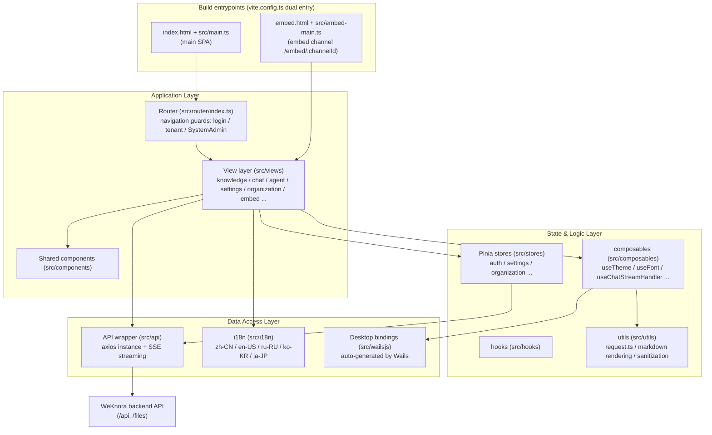

# Web Frontend (frontend/)

WeKnora's web frontend is a single-page application (SPA) built on **Vue 3 + TypeScript + Vite**, hosting the entire interaction surface for knowledge base management, Agent conversations, organization collaboration, and system settings. The same codebase serves three deployment forms simultaneously:

1. **Standard Web deployment**: the Vite build output is hosted by an nginx container, with `/api` reverse-proxied to the backend;
2. **Web embedding (Embed)**: a separate lightweight entry point, `frontend/embed.html` + `frontend/src/embed-main.ts`, for third-party websites to embed the agent chat via iframe / floating widget;
3. **Desktop (Wails)**: communicates with the desktop process's Go side via auto-generated bindings under `frontend/src/wailsjs/`, supporting desktop features such as `--wails-draggable` drag regions and window light/dark theme syncing.

## Tech Stack Overview

Based on `frontend/package.json` (version 0.8.2):

| Category | Choice | Version | Notes |
| --- | --- | --- | --- |
| Framework | Vue | ^3.5.34 | Composition API, `<script setup>` style |
| Language | TypeScript | ~6.0.3 | `vue-tsc` for type checking (`npm run type-check`) |
| Build tool | Vite | ^7.3.5 | Plugins: `@vitejs/plugin-vue`, `@vitejs/plugin-vue-jsx` |
| UI component library | TDesign (tdesign-vue-next) | ^1.19.2 | Paired with `tdesign-icons-vue-next` 0.4.4 (version pinned via overrides) |
| State management | Pinia | ^3.0.4 | All stores live under `frontend/src/stores/` |
| Routing | Vue Router | ^4.5.0 | `createWebHistory`, see `frontend/src/router/index.ts` |
| Internationalization | vue-i18n | ^11.4.2 | zh-CN / en-US / ru-RU / ko-KR / ja-JP |
| HTTP | axios | ^1.16.0 | Unified instance wrapped in `frontend/src/utils/request.ts` |
| SSE streaming | @microsoft/fetch-event-source | ^2.0.1 | Chat streaming replies, see `frontend/src/api/chat/streame.ts` |
| Markdown rendering | marked / marked-katex-extension / katex / highlight.js / mermaid | — | Rich-text rendering of chat answers (formulas, code highlighting, diagrams) |
| Security | dompurify | ^3.4.11 | Unified sanitization of v-html content (`frontend/src/utils/markdownDomPurify.ts`) |
| Document preview | docx-preview / @vue-office/pptx / xlsx / papaparse | — | In-app preview of Word / PPT / Excel / CSV |
| Long lists | vue-virtual-scroller | 2.0.0-beta.8 | Virtual scrolling for the message list |
| Styling | Less + CSS Variables | less ^4.6.4 | Theme variables in `frontend/src/assets/theme/theme.css` |

Notable dependency details:

- `xlsx` `0.20.2` is installed from SheetJS's official pinned URL, and `package-lock.json` keeps the integrity hash; the source repository does not ship the package tarball, so offline builds need an npm cache prepared in advance;
- `frontend/pnpm-workspace.yaml` does not declare a sub-package workspace; it only contains an `allowBuilds` allowlist (permitting `@vue-office/pptx`, `esbuild`, `vue-demi` to run build scripts), used for pnpm's build-script security policy;
- `overrides` / `resolutions` disable `lightningcss` and unify the versions of `esbuild` and `serialize-javascript`.

## Module Structure

### Directory Quick Reference

| Directory | Responsibility |
| --- | --- |
| `frontend/src/main.ts` | Main SPA entry point: installs TDesign / Pinia / Router / i18n, initializes theme and font, registers the TDesign icon offline guard (`installTDesignIconOfflineGuard`, avoiding runtime requests to `tdesign.gtimg.com`), and waits for `router.isReady()` before mounting to avoid first-paint flicker |
| `frontend/src/embed-main.ts` | Embed entry point: a separate Vue app with its own router (only `/embed/:channelId`), mounted to `#embed-app`, using its own i18n instance (`src/i18n/embed.ts`) |
| `frontend/src/views/` | Page-level components, organized by business domain in subdirectories (see the routing table below) |
| `frontend/src/components/` | Cross-page shared components (message bubbles, upload overlay, command palette, etc.) |
| `frontend/src/stores/` | Pinia state (see the store table below) |
| `frontend/src/api/` | Backend API wrappers (see the API module table below) |
| `frontend/src/composables/` | Composable functions: theme, font, chat stream handling, citation popovers, Embed bridging, etc. |
| `frontend/src/hooks/` | Business hooks (e.g. `useKnowledgeBase`) |
| `frontend/src/utils/` | Utility set: axios instance, markdown rendering pipeline, DOMPurify sanitization, Agent tool display, etc. |
| `frontend/src/i18n/` | vue-i18n configuration and language packs |
| `frontend/src/assets/theme/` | Theme CSS variables (light / dark) |
| `frontend/src/wailsjs/` | Wails desktop auto-generated bindings (do not hand-edit) |
| `frontend/src/directives/`, `frontend/src/types/`, `frontend/src/config/` | Custom directives, type definitions, configuration |
| `frontend/public/` | Static assets: `weknora-widget.js` (embed loader for third-party sites), `config.js` (runtime config placeholder, overwritten at container startup), offline TDesign icons |

## Page Routing Reference

Routes are defined in `frontend/src/router/index.ts`, using `createWebHistory`, and every page component is a dynamic import (lazily code-split per route).

### Top-Level Routes

| Path | Name | Component | Function |
| --- | --- | --- | --- |
| `/` | — | Redirect | Redirects to `/platform/knowledge-bases` |
| `/login` | `login` | `src/views/auth/Login.vue` | Login page (includes OIDC, language switcher, animated background) |
| `/register` | `registerByInvite` | `src/views/auth/Login.vue` | Invite registration landing page — reuses the Login component, detecting `?token=xxx` on mount to switch into invite-registration mode |
| `/onboarding/workspace` | `workspaceOnboarding` | `src/views/auth/WorkspaceOnboarding.vue` | Workspace onboarding page for users without a tenant (create one or wait to be invited); requires login but not an existing tenant |
| `/join` | `joinOrganization` | Redirect | Organization invite link; converts `?code=` into an `invite_code` parameter and forwards to `/platform/organizations` |
| `/knowledgeBase` | `home` | `src/views/knowledge/KnowledgeBase.vue` | Knowledge base detail page (legacy top-level path) |
| `/platform` | `Platform` | `src/views/platform/index.vue` | Main platform layout (side menu + router outlet + global settings modal + drag-and-drop upload overlay), redirects to the knowledge base list by default |
| `/platform/dev/markdown` | `markdownTest` | `src/views/dev/MarkdownTestPage.vue` | Markdown rendering visual regression test page, registered only in dev mode (`import.meta.env.DEV`) |

### `/platform` Sub-Routes

| Path | Name | Component | Function |
| --- | --- | --- | --- |
| `/platform/knowledge-bases` | `knowledgeBaseList` | `src/views/knowledge/KnowledgeBaseList.vue` | Knowledge base list: space sidebar (All / Mine / By organization / Favorites / Recent), card list, creation entry point; supports sorting by update time / creation time / name (`components/ResourceSortControl.vue`, also used by the Agent list) |
| `/platform/knowledge-bases/:kbId` | `knowledgeBaseDetail` | `src/views/knowledge/KnowledgeBase.vue` | Knowledge base detail: document list (sortable by update time / creation time / file name, sorted server-side, newest created first by default), upload, parsing status, conversation entry point, Wiki, etc. |
| `/platform/agents` | `agentList` | `src/views/agent/AgentList.vue` | Agent list and management; editing goes through `AgentEditorModal.vue`; requires the `agents` deployment capability |
| `/platform/toolbox/:section?` | `toolbox` | `src/views/toolbox/Toolbox.vue` | Toolbox: three tabs, `skills` (Skills), `mcp` (MCP services), and `browserconnection` (browser connection); see "Toolbox" below |
| `/platform/artifacts` | `artifactLibrary` | `src/views/artifacts/ArtifactLibrary.vue` | Artifact library: collects files generated by agents across sessions; requires the `settings.sandbox` deployment capability |
| `/platform/creatChat` | `globalCreatChat` | `src/views/creatChat/creatChat.vue` | New conversation page: suggested questions, starting a session after selecting a knowledge base/Agent/model |
| `/platform/knowledge-bases/:kbId/creatChat` | `kbCreatChat` | `src/views/creatChat/creatChat.vue` | Starts a new conversation from within a knowledge base's context (same component) |
| `/platform/chat/:chatid` | `chat` | `src/views/chat/index.vue` | Conversation page: message stream (SSE streaming render, skeleton screens, virtual scrolling), citation panel, attachment preview |
| `/platform/organizations` | `organizationList` | `src/views/organization/OrganizationList.vue` | Organization list: create/join organizations, member and shared-resource management (paired with `OrganizationSettingsModal.vue`); requires the `organizations` deployment capability and is always hidden in the Lite edition. Adding members looks up the exact full space ID instead of fuzzy-searching by space name |
| `/platform/settings` | `settings` | `src/views/settings/Settings.vue` | Settings center (full-screen modal form factor); see "Settings Center Sections and Visibility" below |
| `/platform/tenant` | — | Redirect | Compatibility for the old path → `/platform/settings` |
| `/platform/knowledge-search` | — | Redirect | Old global search path → knowledge base list, opening the global command palette (⌘K) via `?cmdk=` |
| `/platform/integrations` | — | Redirect | → `/platform/settings?section=integration-im` (the old `?tab=` is normalized to `integration-<tab>`; views under `src/views/integrations/`) |
| `/platform/system`, `/platform/system/settings`, `/platform/system/admins` | `systemSettings` / `systemAdmins` | Redirect | Old system administration paths → `/platform/settings?section=system-global`, requiring `requiresSystemAdmin` (views under `src/views/system/`: `SystemSettings.vue`, `SystemAuditLog.vue`, `PlatformAPIKeys.vue`, etc.) |
| `/platform/system/queues` | `systemQueues` | Redirect | → `/platform/settings?section=runtime-queues` (runtime task queues, `src/views/system/RuntimeQueues.vue`) |

### Standalone Entry Point: Embed Page

`/embed/:channelId` is not part of the main SPA's routing; instead it is a standalone entry point made up of `frontend/embed.html` + `frontend/src/embed-main.ts` (both nginx and the Vite dev server fall back `/embed/*` requests to `embed.html`). Its component is `src/views/embed/EmbedPage.vue` (along with `EmbedChatView.vue` / `EmbedChatCore.vue` / `EmbedBotMessage.vue`, etc.), authenticated via an Embed token, for third-party websites to embed via iframe.

### Settings Center Sections and Visibility

`Settings.vue` presents all sections across seven groups, addressable via `?section=`:

| Group | Sections (`section` values) |
| --- | --- |
| Account | `general` (personal preferences), `userprofile`, `mymemory` (personal memory), `envvars` (personal variables) |
| Space | `tenant` (space info), `members` (members), `chathistory`, `memory` (space memory) |
| Model & Runtime | `models`, `ollama`, `weknoracloud` |
| Publishing & Integrations | `integration-im`, `integration-embed`, `integration-api`, `integration-mcpserver`, `integration-cli`, `integration-chrome`, `integration-claw` |
| Data & Extensions | `vectorstore`, `parser`, `storage`, `sandbox`, `websearch` |
| System Administration | `system-global`, `runtime-queues`, `platform-api-keys`, `system-audit-log` |
| Platform | `system` (version info) |

The Publishing & Integrations tabs are registered by `INTEGRATION_TABS` / `INTEGRATION_PREVIEW_ITEMS` in `frontend/src/config/integrations.ts`, and their section values are uniformly `integration-<tab>`; the old `/platform/integrations?tab=<tab>` is normalized to the corresponding section.

Since v0.8.2, Skills, MCP services, and browser connection are no longer settings sections; they have moved to the [Toolbox](#toolbox). Old bookmarks for `/platform/settings?section=skills|mcp|browserconnection` are redirected by the route guard to `/platform/toolbox/<section>` (`skills` keeps the `sandboxId` parameter).

Visibility is governed by three sets of rules, and **the frontend only narrows what's shown — the backend route guards are the authority**:

- **Space role threshold**: `SETTINGS_SECTION_MIN_ROLE` in `frontend/src/config/settingsAccess.ts` assigns a minimum role to each section. `general` / `models` / `system` / `userprofile` / `tenant` / `members` / `mymemory` / `envvars` are visible starting at `viewer` (read-only visibility); `ollama`, `weknoracloud`, `websearch`, `chathistory`, `memory`, `vectorstore`, `parser`, `storage`, and `sandbox` require `admin`; within Publishing & Integrations, `integration-api` requires `owner` (`INTEGRATION_TAB_MIN_ROLE`). There's also `SETTINGS_MANAGEMENT_SHORTCUT_MIN_ROLE`: the shortcuts labeled "Manage" in the avatar menu have a higher threshold (member management requires `owner`, model management requires `admin`), to avoid disguising a read-only page as a management entry point.
- **Deployment capabilities**: `SETTINGS_SECTION_CAPABILITY` / `INTEGRATION_TAB_CAPABILITY` in `frontend/src/config/deploymentCapabilities.ts` map sections to the capability keys returned by `GET /api/v1/system/capabilities` (such as `settings.sandbox` and `integrations.mcpserver`); when a capability is explicitly `supported: false`, the entry point is hidden. See "Settings Navigation and Deployment Capabilities" below.
- **System administrator allowlist**: `SYSTEM_ADMIN_SETTINGS_SECTIONS` (`system-global`, `runtime-queues`, `platform-api-keys`, `system-audit-log`) is shown only to system administrators, independent of the space role — see the "System Administrator and Platform Console" section of [Tenants, Users, and Authentication/Authorization](../03-features/01-tenant-auth.md) for details.

### Toolbox

The "Toolbox" in the left menu (`/platform/toolbox/:section?`, `src/views/toolbox/Toolbox.vue`) centrally manages the tools available to agents; its tabs are defined by `TOOLBOX_ITEMS` in `frontend/src/config/toolbox.ts`:

| Tab (`section`) | Content | Visibility condition |
| --- | --- | --- |
| `skills` | Skill management (reuses `SkillSettings.vue`); can take `?sandboxId=` to locate a sandbox configuration | `admin` and above, and the deployment supports `settings.sandbox` |
| `mcp` | MCP services (reuses `McpSettings.vue`) | `admin` and above, and the deployment supports `settings.mcp` |
| `browserconnection` | Browser connection (reuses `BrowserConnectionSettings.vue`); the tab shows the connection status | `viewer` and above |

The tabs keep the role and deployment-capability thresholds of the former settings sections (`canAccessToolboxSection`); when the current space has no visible tab, an empty state is shown. Hovering over the sidebar menu item previews the available tools, and the browser connection status is also shown in the sidebar. For using the browser connection, see [Local Browser](09-local-browser.md).

<Screenshot
  src="/screenshots/toolbox.png"
  caption="Toolbox: manage Skills, MCP services, and browser connection on one page"
  hint="Shows the 'Toolbox' entry in the left menu (with the tool icons previewed on hover), and the three tabs at the top of the Toolbox page (Skills / MCP Services / Browser Connection, with counts and connection status), currently on the Skills tab." />

### Knowledge Base Editor Modal Sections

A fair amount of configuration **isn't in the settings center but in the knowledge base editor modal** (`KnowledgeBaseEditorModal.vue`), because these settings take effect per-base. The sidebar sections are organized into five groups, three of which only appear when "editing an existing knowledge base":

| Group | Section (`key`) | Notes |
| --- | --- | --- |
| Basics | `basic`, `models` | Name, type, conversation/vector/summary models |
| Processing | `parser`, `multimodal`, `asr`, `chunking` | Parsing engine and header-row handling, image understanding, speech transcription, chunking parameters |
| Data | `vectorStore`, `storage`, `faq` | `faq` only for FAQ-type bases; `vectorStore` cannot be changed once bound |
| Integrations | `datasource` | **Edit mode only** — Feishu / Lark (wiki and drive), Notion, Confluence, Yuque, DingTalk Docs, Tencent IMA, RSS / Atom, GitLab, and other syncs are configured here, not in global settings (connector definitions in `views/knowledge/settings/DataSourceEditorDialog.vue`) |
| Management | `graph`, `advanced`, `share`, `activity` | Knowledge graph, advanced settings, share to organization, activity stream; the latter two are edit-mode only |

### Global Command Palette (⌘K / Ctrl+K)

`components/GlobalCommandPalette.vue` is the second major navigation channel besides the sidebar:

- Searches knowledge bases, documents, and conversations, and supports narrowing scope to a specific knowledge base (scope chip) before searching;
- Shows recent searches and quick actions (create a knowledge base, upload, start a new conversation, etc.) in the empty state;
- The entry point in the top-right corner opens the **retrieval settings drawer** (`views/settings/RetrievalSettings.vue`). This is where TopK, vector/keyword thresholds, and reranking parameters are tuned — it's **not in the settings center**, so if you can't find it, this is where it lives.

### Navigation Guards

`router.beforeEach` implements a full authentication/authorization chain (`frontend/src/router/index.ts`):

1. **OIDC callback pass-through**: when the URL hash contains `oidc_result=` / `oidc_error=`, the guard passes through directly, letting `App.vue` consume it;
2. **Toolbox legacy bookmarks**: `/platform/settings?section=skills|mcp|browserconnection` redirects to `/platform/toolbox/<section>`;
3. **Lite / desktop deep-link restoration**: when Lite mode hard-refreshes and lands on the default home page, the last-visited `/platform` sub-path is restored from `sessionStorage` (it does not restore to the organizations page);
4. **Session restoration**: when not logged in, the guard first tries to restore the session using the `weknora_token` in `localStorage` by calling `getCurrentUser()` (also refreshing memberships, to avoid stale role information);
5. **Desktop auto-login**: if restoration fails, it attempts `autoSetup()` once. Since v0.8.2 this only applies to the native desktop app: it first obtains the process's random credential through the Wails binding `GetAutoSetupToken()`, then calls `POST /api/v1/auth/auto-setup` with the `X-WeKnora-Desktop-Token` request header; the Lite edition opened in a browser has no such binding and goes straight to normal registration / login. On failure, a flag is set in `localStorage` to avoid repeated attempts;
6. **Tenant threshold**: logged in but without a valid tenant → redirect to `/onboarding/workspace`;
7. **Deployment capability threshold**: when a route's `meta.requiredCapability` (such as `agents`, `organizations`, or `settings.sandbox`) is not supported by the current deployment, a message is shown and the user is sent back to the knowledge base list; if capability detection fails, the route is allowed through and the backend endpoints act as the safeguard;
8. **SystemAdmin threshold**: routes with `requiresSystemAdmin` redirect non-system-administrators back to the knowledge base list (this is UI-layer interception only; the server enforces its own stricter check).

## State Management (Pinia)

Stores and helper modules under `frontend/src/stores/`:

| File | Store ID / Type | Responsibility |
| --- | --- | --- |
| `stores/auth.ts` | `useAuthStore` | Core authentication: user / token / refreshToken / tenant / memberships / role checks (`hasRole`, `isSystemAdmin`), Lite mode flag; on logout, cascades clearing of other stores' space-scoped caches and reloads per-user preferences (theme/font) |
| `stores/chatResources.ts` | `useChatResourcesStore` | Space-scoped resource cache (60s TTL): knowledge bases, Agents, models, web search provider lists, reused by the chat/new-conversation selectors |
| `stores/editorResources.ts` | `useEditorResourcesStore` | Editor/settings-related resource cache (60s TTL): storage engine configuration and status, prompt templates, parsing engines, system info, MCP services, Skills, Agent type presets, retrieval configuration |
| `stores/commandPalette.ts` | `useCommandPaletteStore` | Global command palette (⌘K / Ctrl+K) open state and query; recent searches are scoped by (user, tenant) to avoid leaking across accounts |
| `stores/organization.ts` | `useOrganizationStore` | Organization collaboration: organization list, members, shared knowledge bases/Agents, join requests and review, role upgrades, and the full set of related actions |
| `stores/organizationState.ts` | Pure function module | Organization list upsert/merge, join-review effects on member counts, and other pure logic (paired with the `organizationState.test.ts` unit tests) |
| `stores/settings.ts` | Settings store | Conversation and Agent configuration: selected knowledge bases/files/tags/MCP/Skills/tools, model configuration, Ollama configuration, web search toggle, etc. |
| `stores/settingsStorage.ts` | Pure function module | Reading, cloning, and built-in Agent mode repair for settings persistence (the `WeKnora_settings` key) (paired with `settingsStorage.test.mjs`) |
| `stores/menu.ts` | `useMenuStore` | Left-side navigation menu structure (new conversation, knowledge bases, Agents, etc.) and i18n titles |
| `stores/knowledge.ts` | `knowledgeStore` | Knowledge card list and total count (lightweight) |
| `stores/ui.ts` | `useUIStore` | Global UI state: settings modal, knowledge base editor modal, manual document editor, sidebar collapse toggle, and related parameters |
| `stores/uploadConfirm.ts` | Upload confirmation store | State for confirmation dialogs on upload / URL import / manual entry / re-parse processing parameters |
| `stores/versionedRequest.ts` | Pure function module | `createVersionedRequestCoordinator`: a versioned caching request coordinator that prevents stale responses from overwriting newer writes (paired with `versionedRequest.test.ts`) |
| `stores/deploymentCapabilities.ts` | `useDeploymentCapabilitiesStore` | Deployment capability snapshot (`GET /api/v1/system/capabilities`), used by the route guard, sidebar, settings, and toolbox to decide whether entry points are shown |
| `stores/modelProviders.ts` | `useModelProvidersStore` | Model provider catalog cache (`GET /api/v1/models/providers`, loaded per model type); the model editor and model cards all read provider information from here |
| `stores/uploadTasks.ts` (+ `uploadQueue.ts` / `uploadTasksCore.ts` / `uploadTasksState.ts`) | `useUploadTasksStore` | Knowledge file upload queue: concurrency-limited transfers, cancel / retry, polling parse progress, driving the floating upload progress panel; uploads continue after leaving the knowledge base page |
| `stores/browserConnection.ts` | `useBrowserConnectionStore` | Local browser connection status, for the toolbox tab and sidebar status display |
| `stores/sessionActivity.ts` | `useSessionActivityStore` | In-progress state of sessions in the sidebar |

## API Wrappers (frontend/src/api/)

### Request Foundation

- **axios instance**: `frontend/src/utils/request.ts` creates a unified instance (`baseURL` comes from `getApiBaseUrl()` in `frontend/src/utils/api-base.ts`, respecting Vite's `BASE_URL` to support subpath reverse-proxy deployments; 30s timeout for regular requests). File uploads (`postUpload`) compute their timeout from the payload size (`uploadTimeoutMs` in `utils/requestTimeouts.ts`, with a 5-minute floor, scaled at roughly 10MB/minute), so after raising `MAX_FILE_SIZE_MB` large files are not cut off by the 30s default; a `timeout` passed explicitly by the caller takes precedence.
- **Request interceptor**: automatically attaches `Authorization: Bearer <weknora_token>` (the Embed channel's `Embed ` token is not overwritten), `Accept-Language` (the current i18n language), `X-Request-ID` (a random string), and `X-Tenant-ID` (for cross-space access, always carrying the active space id so the header isn't lost after switching spaces).
- **Response interceptor**: 2xx responses are unwrapped to return `data`; 401 triggers a single-flight refresh-token flow, with the failed-request queue replayed afterward; 401s on public endpoints (`/auth/login`, `/auth/register`, `/auth/oidc/`, `/auth/auto-setup`, `/auth/invitations/lookup`, `/api/v1/embed/`, i.e. `PUBLIC_AUTH_PATHS`) are thrown directly to the page instead of redirecting to login; Embed pages never redirect to `/login`.
- **HTTP status code (`$httpStatus`)**: the return type of `get` / `post` / `put` / `patch` / `del` / `postUpload` is `WithStatus<T>`; JSON object or array responses carry a non-enumerable `$httpStatus` property that can be used to distinguish successful results with the same shape (for example, when a system administrator creates a user: 201 means newly created, 200 means an idempotent retry). It does not appear in object spreads, `JSON.stringify`, or `Object.keys`; Blob, string, and SSE responses do not carry this property.
- **SSE streaming**: `frontend/src/api/chat/streame.ts` wraps `useStream()` on top of `@microsoft/fetch-event-source`, supporting streaming output, loading state, error state, and request debug metadata; at a higher level, `frontend/src/composables/useChatStreamHandler.ts` organizes this into the chat message stream. When the chat stream handshake returns 401, it shares the single-flight refresh in `utils/authRefresh.ts` with axios and replays the request once as-is after getting the new token, so an expired access token does not interrupt a conversation being started.

### Module Reference

| Module | Responsibility |
| --- | --- |
| `api/auth/` | Login, registration, OIDC, `autoSetup` (native desktop only, carrying the `X-WeKnora-Desktop-Token` provided by Wails), `getCurrentUser` session restoration |
| `api/tenant/` (`index` / `members` / `invitations` / `audit-log`) | Tenant (workspace) info, member management, invitations, audit log |
| `api/organization/` | Organization CRUD, members, shared knowledge bases/Agents, join requests |
| `api/knowledge-base/` | Knowledge base CRUD and file/knowledge-entry management |
| `api/chat/` (`index` / `streame` / `steer` / `temporary-attachments`) | Conversation CRUD, title generation, SSE streaming Q&A, appending messages to a running agent turn (`steer`), temporary attachments |
| `api/artifacts.ts` | Artifact library list and deletion (`/api/v1/artifacts`) |
| `api/memory.ts` / `api/env-vars.ts` | Space / personal memory, personal variables |
| `api/mcp-endpoint.ts` | Built-in MCP Server endpoint management (Publishing & Integrations → MCP Server) |
| `api/chat-history.ts` | Chat history |
| `api/agent/` | Custom Agent CRUD, type presets, placeholders (including built-in Quick Answer / Smart Reasoning ids) |
| `api/model/` | Model configuration management |
| `api/retrieval.ts` | Tenant retrieval configuration |
| `api/vector-store.ts` / `api/storage-backend.ts` / `api/chunker/` | Vector store, storage backend, chunker configuration |
| `api/datasource/` | Data source integration |
| `api/embed/` | Web embedding channel management (create channel, rate limiting, etc.) |
| `api/initialization/` | System initialization flow |
| `api/system/` | System info, storage engine status, prompt templates, parsing engines, and other system-level APIs |
| `api/mcp-service.ts` / `api/skill/` | MCP service and Skill management |
| `api/web-search.ts` / `api/web-search-provider.ts` | Web search and provider configuration |
| `api/wiki/` | Knowledge base wiki generation APIs |
| `api/message-suggestion.ts` | Suggested questions |
| `api/user-favorites.ts` | User favorites (favorited knowledge bases/Agents list) |

## Waiting States in the Conversation Timeline

The RAG pipeline's visual progress indicator (`views/chat/components/RagPipelineProgress.vue`) has a quiet period between "all visible steps have completed" and "the model emits its first character." This gap is described by `utils/rag-pipeline-state.ts`:

- `getRagPipelineWaitKind()` determines the wait type: only a turn where the retrieval step actually completed is labeled `model` (answer generation in progress); pure attachment-based Q&A turns with no retrieval step get the neutral `preparing` state, rather than no feedback at all;
- `createRagWaitController()` handles the presentation details: it delays showing for `RAG_WAIT_REVEAL_DELAY_MS` (250ms) to avoid a flash when the model answers quickly; after `RAG_WAIT_STALL_DELAY_MS` (60s) it switches to a "stalled" state — since the backend stops sending `is_completed` once the SSE connection drops, without this cap the progress bar would claim "almost done" forever;
- State changes are announced through a persistent `aria-live` region, so screen reader users don't miss updates due to whole-node replacement.

## Internationalization (i18n)

Implemented in `frontend/src/i18n/index.ts`, based on `vue-i18n` (Composition mode with `legacy: false`, `globalInjection: true`):

- **Supported languages** (`frontend/src/i18n/locales/`):
  - `zh-CN` (Simplified Chinese, default and fallback)
  - `en-US` (English)
  - `ru-RU` (Russian)
  - `ko-KR` (Korean)
  - `ja-JP` (Japanese)
- The selected language is persisted under the `locale` key in `localStorage`; the axios interceptor writes the current language into the `Accept-Language` request header, so the backend returns localized content.
- Because some translations deliberately embed `<strong>` tags (rendered via v-html after DOMPurify sanitization), `warnHtmlMessage: false` is configured to disable vue-i18n's HTML warning.
- **Standalone Embed i18n**: the visitor-facing embed page uses a separate `frontend/src/i18n/embed.ts` (loaded by `embed-main.ts`); the admin-side "web embedding" copy remains in the main language pack; `frontend/src/i18n/locales/embed/index.ts` uniformly re-exports the language normalization helpers (supporting syncing the embed language from URL parameters).
- **Audit and pruning tools**: language packs grow large and tend to accumulate unreferenced dead keys or untranslated new keys, so three companion scripts exist (`frontend/package.json`):

  | Command | Purpose |
  | --- | --- |
  | `npm run check-i18n` | Runs `src/i18n/localeKeyAudit.test.ts`, verifying that the key sets across language packs are consistent with no missing references |
  | `npm run scan-i18n-gaps` | Scans the source code for actually-used keys and compares against the language packs, reporting undefined and unused keys |
  | `npm run regenerate-i18n-locales` | Regenerates pruned language packs based on the scan results |

  Audit log action names use a separate registry (`i18n/auditActionRegistry.ts` + `auditActionLocaleDefaults.ts`); when adding a new audit action, just add an entry to the registry to avoid the pruning tool deleting it as an unreferenced dead key.

## Theme and Appearance

- **Theme mode**: `frontend/src/composables/useTheme.ts` provides three states: `light | dark | system`. It takes effect by setting the `theme-mode` attribute on `document.documentElement`; `system` mode listens to the `prefers-color-scheme` media query to follow automatically.
- **CSS variables**: `frontend/src/assets/theme/theme.css` defines two sets of variables — `:root[theme-mode="light"]` and `:root[theme-mode="dark"]` — following the TDesign token system (`--td-brand-color-*`, `--td-bg-color-*`, `--td-text-color-*`, fonts/border-radius/shadows, etc.); the brand color is green-based; component styles uniformly reference these variables to enable one-click theme switching.
- **Preference persistence**: theme and font preferences are stored in `localStorage` namespaced by user id via `frontend/src/composables/preferenceStorage.ts`; on login/logout/account switch, `reloadThemeFromStorage()` / `reloadFontFromStorage()` reload them (triggered in `stores/auth.ts`).
- **Font**: `frontend/src/composables/useFont.ts` manages the interface font selection; on startup, `main.ts` calls `initTheme()` + `initFont()`.
- **Desktop sync**: `syncWailsNativeChrome()` in `useTheme.ts` calls the Wails runtime's `WindowSetDarkTheme / WindowSetLightTheme / WindowSetBackgroundColour` to keep the native window's background color in sync with the web theme, reducing white-flash on refresh.

## Build and Deployment

### Development and Build (vite.config.ts)

Key points from `frontend/vite.config.ts`:

- **Dual-entry build**: `rollupOptions.input` builds both `index.html` (main SPA) and `embed.html` (embed page) simultaneously; in development, a custom plugin `embedHtmlDevFallback()` rewrites `/embed/:channelId` requests to `/embed.html`, matching nginx's behavior.
- **Code splitting**: `manualChunks` splits mermaid/dagre/cytoscape, marked/katex, and highlight.js into `vendor-mermaid`, `vendor-markdown`, and `vendor-highlight` respectively; the embed entry point filters out the heavy chat chunk via `modulePreload.resolveDependencies`, ensuring the embed page's first paint only loads the code needed for token exchange.
- **Version injection**: `__FRONTEND_VERSION__` (package.json version) and `__FRONTEND_COMMIT__` (`VITE_FRONTEND_COMMIT` / `GITHUB_SHA` / `git rev-parse`) are injected at compile time.
- **Dev proxy**: both the dev server (port 5173) and preview (port 4173) proxy `/api`, `/files`, and `/mcp/` to `VITE_DEV_PROXY_TARGET` (or `FRONTEND_BACKEND_URL`, defaulting to `http://localhost:8080`). `/api` enables WebSocket forwarding (for the sandbox terminal, etc.) with the timeout extended to 180s; `/mcp/` carries the built-in MCP Server's Streamable HTTP long-lived connections, with a 1-hour timeout.
- **Aliases**: `@` → `frontend/src`; plus an entry-file detection fix for `@vue-office/pptx`.
- Common scripts: `npm run dev` / `npm run build` / `npm run preview` (serves the production build locally, the closest environment to verifying the release image) / `npm run type-check` / `npm run test` (tsx --test).

### Production Image (Dockerfile + nginx)

`frontend/Dockerfile`:

- Since v0.8.2 the build has two stages: a digest-locked `node:24-bookworm-slim` runs `npm ci` + `npm run build` on `$BUILDPLATFORM`, then `dist/` is copied into the runtime layer. Building no longer requires Node / npm installed on the host, nor a pre-generated `dist/` (`scripts/build_frontend_dist.sh` is still used for Lite / desktop packaging);
- The runtime layer's base image is pinned to a digest-locked `nginx:1.30.3-alpine` (a comment explicitly forbids reverting to a floating tag — newer Alpine 3.24+ fails to boot on old CentOS 7 kernels, which caused an incident in v0.7.0);
- `nginx.conf` is placed as a template at `/etc/nginx/templates/default.conf.template`; the proxy parameters shared by `/api/`, `/mcp/`, and skill uploads live in `nginx-api-proxy.conf` (copied as-is to `/etc/nginx/api-proxy.conf`), and http-level snippets live in `nginx-http.conf` (the `api_no_query` log format, which strips query strings). Port 80 is exposed, with `docker-entrypoint.sh` as the entry point.

Image build arguments:

| Name | Type | Default | Description |
| --- | --- | --- | --- |
| `NPM_REGISTRY` | build-arg | empty | Registry used by `npm ci`; when empty, the npm default registry is used |
| `NODE_MAX_OLD_SPACE_SIZE` | build-arg | `4096` | Node heap limit (MB) during the build stage, to avoid Vite build OOM |
| `VITE_FRONTEND_COMMIT` | build-arg | `unknown` | Frontend commit injected into the page; declared after `npm ci`, so changing it does not invalidate the dependency layer cache |

`frontend/docker-entrypoint.sh` (runtime configuration injection):

1. Generates `/usr/share/nginx/html/config.js`, writing `MAX_FILE_SIZE_MB`, `MAX_SKILL_BUNDLE_SIZE_MB`, and `DEFAULT_LOCALE` into `window.__RUNTIME_CONFIG__` for the frontend to read at runtime;
2. Renders the nginx template with `envsubst`;
3. Starts nginx in the foreground.

| Name | Type | Default | Description |
| --- | --- | --- | --- |
| `MAX_FILE_SIZE_MB` | Integer (MB) | `50` | Site-wide request body limit and frontend upload size limit |
| `MAX_SKILL_BUNDLE_SIZE_MB` | Integer (MB) | `256` | Applies only to the skill ZIP upload routes; raised to `MAX_FILE_SIZE_MB` when smaller than it, max 512 |
| `DEFAULT_LOCALE` | String | empty | Default UI language; only `zh-CN` / `en-US` / `ru-RU` / `ko-KR` / `ja-JP` are allowed, other values are discarded |
| `APP_HOST` | String | `app` | Backend host name |
| `APP_PORT` | Integer | `8080` | Backend port |
| `APP_SCHEME` | String | `http` | Backend protocol; set to `https` for a remote HTTPS backend |

Key behaviors of `frontend/nginx.conf`:

- **SPA fallback**: `try_files ... /index.html` under `/`, with `index.html` set to `no-cache` (avoiding users being stuck on a stale version after an upgrade); hashed `/assets/*` files get a one-year immutable cache;
- **API proxy**: `/api/` and `/files` are reverse-proxied to `${APP_SCHEME}://${APP_HOST}:${APP_PORT}`; `/api/` disables `proxy_buffering` / caching / chunked encoding for SSE, extends read/write timeouts to 3600s, and configures 3 upstream retries;
- **Built-in MCP Server `/mcp/`**: reverse-proxied to the backend on the same path, with the same proxy parameters as `/api/`; external MCP clients can connect to `/mcp/<endpoint_id>` directly using the site's domain;
- **WebSocket channels**: `/api/v1/sessions/<id>/sandbox/(terminal|desktop)` (sandbox terminal and graphical desktop) and `/api/v1/local-browser/extension` (BrowserSkill browser extension connection) enable Upgrade separately, and their access logs strip query strings to avoid recording handshake tickets; the cluster-internal path `/api/v1/local-browser/internal` returns 404 directly;
- **Skill bundle uploads**: the two collection routes `/api/v1/skills/catalog` and `/api/v1/sandbox-configs/<id>/skills` use `MAX_SKILL_BUNDLE_SIZE` on their own, while other upload endpoints remain limited by `MAX_FILE_SIZE`;
- **Resource short links `/r/`**: `location ^~ /r/` is also reverse-proxied to the backend. IM channels rewrite `resource://` images into `<APP_EXTERNAL_URL>/r/<token>`; without this configuration, requests fall through to the SPA fallback and images show blank on the IM side (see [IM Integration](../03-features/12-im-integration.md) for details);
- **Embed page**: `/embed/*` returns `embed.html` (a separate location that does not inherit the main site's `X-Frame-Options: SAMEORIGIN`). nginx first uses the internal subrequest `/_embed-frame-policy` to query the backend's `GET /api/v1/embed-frame-policy` for the host origins the channel allows, and adds the returned `Content-Security-Policy` to the response; loading is refused when the channel doesn't exist, is disabled, has no allowed host origins, or the backend is unreachable. Custom reverse proxies need to keep this step, otherwise the host origin allowlist does not take effect. `/weknora-widget.js` is the static loader for third-party sites; the file header also includes an optional example server block for a standalone embed subdomain;
- Gzip is enabled (a comment records the measured benefit: first paint drops from 25s to 3-5s on low bandwidth), along with a set of security response headers (`X-Frame-Options`, `X-Content-Type-Options`, `Referrer-Policy`, etc.), repeated within each location to work around nginx's `add_header` not being inherited.

## Desktop (Wails) Integration

`frontend/src/wailsjs/` contains bindings auto-generated by the Wails framework (the file headers are marked "automatically generated. DO NOT EDIT"):

- `wailsjs/go/main/App.d.ts` / `App.js`: JS bindings for the Go-side `App` struct's methods, including `CheckForUpdates` / `AutoCheckForUpdates` (desktop update checks), `GetAPIBaseURL` / `GetAPILanBaseURL`, the desktop's built-in HTTP server port and external-listening settings (`GetDesktopHTTPPortSetting`, `SetDesktopHTTPBindPublicSetting`, etc.), and `GetAutoSetupToken` (returns the random credential generated when the desktop process starts, which the frontend uses to call `auto-setup` for login-free access; see the navigation guard above);
- `wailsjs/runtime/`: the Wails runtime API (window control, etc.); when the frontend runs in a browser environment, calls to it gracefully degrade via try/catch (e.g. in `useTheme.ts`).

The desktop app's window content is this same frontend codebase — desktop auto-login, deep-link restoration, and the draggable title area marked with `--wails-draggable` are all adaptations built for the desktop form factor.

## Settings Navigation and Deployment Capabilities

Settings entry points are grouped by task: Publishing & Integrations contains the IM, web embedding, API, MCP Server, CLI, Chrome extension, Claw Skill, and other integration pages; sandbox configuration, personal variables, and space / personal memory each have their own management UI in the settings center; Skills, MCP services, and browser connection live in the toolbox. New entry points should reuse the existing registrations in `frontend/src/config/integrations.ts`, `frontend/src/config/toolbox.ts`, `frontend/src/config/settingsAccess.ts`, etc., and check the sidebar grouping at the same time.

`GET /api/v1/system/capabilities` returns the edition along with each capability's supported/reason. The frontend hides or disables entry points based on the actual deployment capabilities (the route guard, left menu, settings sections, and toolbox tabs all read the same snapshot): when capability detection fails or an older backend lacks a key, the entry stays visible by default; `organizations` is always hidden in the Lite edition; `settings.sandbox.docker` / `settings.sandbox.host` are only shown when the backend explicitly returns `supported: true`. Frontend visibility only improves the user experience; backend routes continue to enforce role and capability checks. See the [System API](../04-api/02-api-system.md) for the endpoints.
