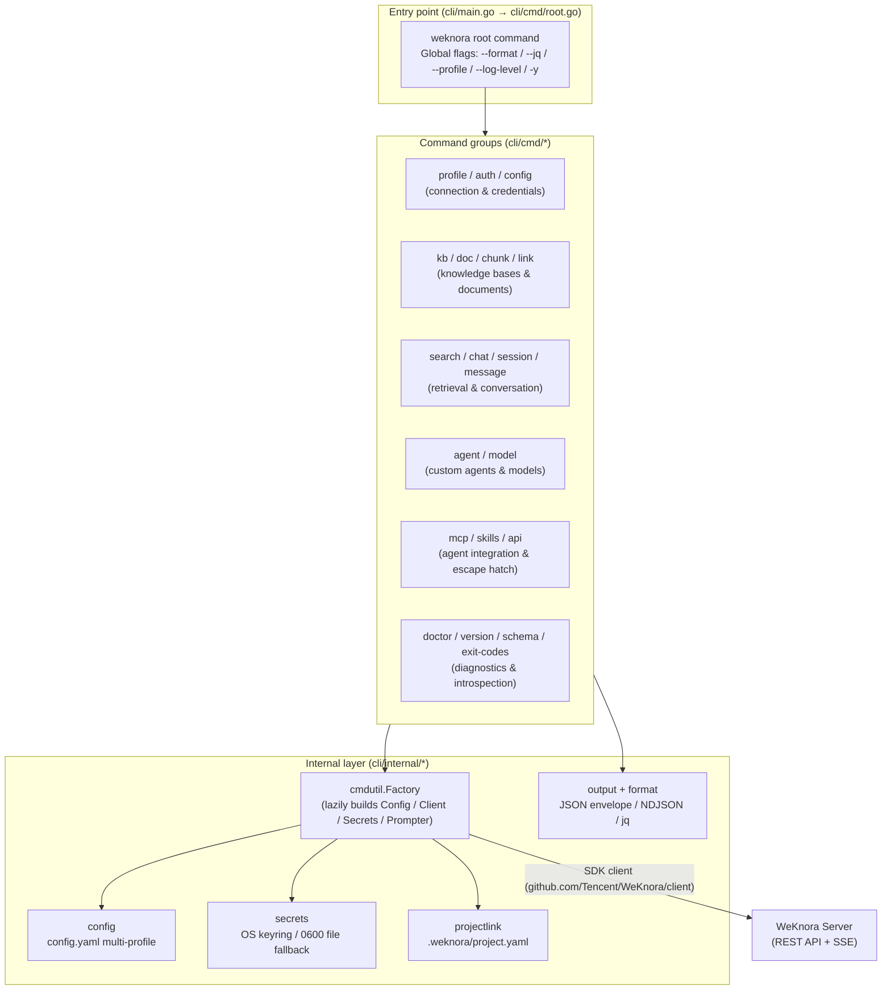

Traduzido documento completo abaixo. Markdown, code fences, mermaid, tabelas e links preservados; só prosa traduzida.

---

# WeKnora CLI (`weknora` Command-Line Tool)

The WeKnora CLI (binary name `weknora`) is the official command-line client for the WeKnora RAG service, with source code located in the repository's `cli/` directory (a standalone Go module: `github.com/Tencent/WeKnora/cli`, requiring Go 1.26+). It targets two kinds of users:

- **Human users**: manage Knowledge Bases and documents, perform hybrid search (vector + keyword), and conduct grounded, streaming Q&A;
- **AI Agents / scripts**: JSON envelope output by default, typed error codes and an exit-code matrix, `--dry-run` previews, a machine-readable `weknora schema` contract, and a `weknora mcp serve` MCP server mode.

The command tree entry point is `cli/cmd/root.go`, with each command group organized under directories in `cli/cmd/`.

## Overall Architecture



---

## Installation

### Build from source (currently the supported install method)

`cli/README.md` states clearly: **building from source is currently the supported install method**; prebuilt binaries, `go install`, and a Homebrew formula for the CLI are planned to ship alongside official tags.

```bash
git clone https://github.com/Tencent/WeKnora.git
cd WeKnora/cli
go build -o weknora .
sudo mv weknora /usr/local/bin/   # or place it anywhere on your $PATH
```

### Using cli/Makefile

`cli/Makefile` provides build targets with version metadata (injected via `-ldflags` into `internal/build.Version/Commit/Date`):

| target | purpose |
|---|---|
| `make build` | compile to `./bin/weknora`, injecting the `git describe` version, short commit hash, and build time |
| `make test` | `go test ./...` |
| `make test-coverage` | run tests and produce a coverage report |
| `make lint` | `go vet ./...` |
| `make tidy` | `go mod tidy` |
| `make clean` | remove `./bin` and coverage.out |

Note: the Makefile has **no** `install` target — you need to move the build output onto your `$PATH` yourself.

### Homebrew (server-side Lite edition, not the CLI)

The repository's `Formula/` directory currently contains only one formula: `Formula/weknora-lite.rb`, which installs the **single-binary Lite edition of the WeKnora server** (`weknora-lite`) — not the `weknora` CLI covered in this document. This formula:

- downloads `WeKnora-lite_v<version>_<os>_<arch>.tar.gz` from GitHub Releases for four platforms (macOS/Linux × arm64/amd64);
- generates a `weknora-lite` launcher script: on first run it auto-generates the `~/.config/weknora/.env.lite` config and stores data under `~/.local/share/weknora/`;
- supports running as a background service via `brew services start weknora-lite`, with logs at `$(brew --prefix)/var/log/weknora-lite.log`.

Using the Lite edition locally as the CLI's target server is a convenient combination: run `brew services start weknora-lite` to start the server, then connect with `weknora profile add local --host http://localhost:8080 --use`.

---

## Configuration and Profile Management

### Config file and paths

User-level configuration is managed by `cli/internal/config/config.go`, at path `$XDG_CONFIG_HOME/weknora/config.yaml` (falling back to `~/.config/weknora/config.yaml` when `XDG_CONFIG_HOME` isn't set; path resolution is in `cli/internal/xdg/xdg.go`, which follows XDG variables on all operating systems, including macOS). Writes are atomic (temp file + rename), with permissions 0600.

On-disk schema (`config.Config` / `config.Profile`):

```yaml
current_profile: prod          # name of the currently active profile
profiles:
  prod:
    host: https://kb.example.com   # required: server address
    tenant_id: 42                  # optional: tenant id (display only, not injected into request headers)
    user: user@example.com         # optional: account email (shown only by profile list)
    api_key_ref: keychain://...    # storage reference for the API key (keychain:// or file://)
    token_ref: keychain://...      # JWT access token reference
    refresh_token_ref: keychain://...
    default_kb_id: "..."           # optional: default knowledge base
defaults:
  format: json                 # optional: CLI-level default output format
  no_version_check: true       # optional: disable version compatibility check
```

### Credential storage (secrets)

Credentials are **never written to config.yaml** — only references (refs) are stored. `cli/internal/secrets/` provides two backends:

- **KeyringStore**: OS keychain (macOS Keychain / Linux keyring), namespaced as `weknora:<profile>:<key>`, with keys `access` / `refresh` / `api_key`;
- **FileStore**: when the keychain is unavailable (headless CI, WSL without DBus, containers), falls back to plaintext 0600 files at `$XDG_CONFIG_HOME/weknora/secrets/<profile>/<key>`; `auth login` prints a one-time warning to stderr in this case.

### Multi-profile switching and resolution priority

Profile resolution is implemented in `cli/internal/cmdutil/factory.go` (`Factory.ActiveProfile`), with priority from highest to lowest:

1. the global `--profile <name>` flag (applies only to the current invocation, not persisted);
2. the `WEKNORA_PROFILE` environment variable;
3. `current_profile` in `config.yaml` (persistently switched via `weknora profile use`).

### Stateless environment-variable credentials (headless / CI / agent path)

`buildClientFromEnv` in `factory.go` supports bypassing config.yaml and the keychain entirely:

| Environment variable | Purpose |
|---|---|
| `WEKNORA_TOKEN` | Bearer JWT (takes precedence over `WEKNORA_API_KEY`) |
| `WEKNORA_API_KEY` | API key |
| `WEKNORA_HOST` | Server address (falls back to the active profile's host if unset) |
| `WEKNORA_PROFILE` | Overrides the active profile |
| `WEKNORA_KB_ID` | Explicitly specifies the knowledge base id |
| `WEKNORA_FORMAT` | Default output format (text / json / ndjson) |
| `WEKNORA_LOG_LEVEL` | SDK log level (error / warn / info / debug) |
| `WEKNORA_AGENT_HELP=1` | Outputs machine-readable AgentHelp JSON on `--help` (`cli/internal/cmdutil/agenthelp.go`) |

### Knowledge base (--kb) resolution chain

Commands requiring a knowledge-base scope (chat, doc, chunk, search chunks/docs, etc.) resolve it via `Factory.ResolveKB` through a 4-level fallback (`cli/internal/cmdutil/factory.go`):

1. the `--kb` flag (a UUID passes through directly; a name is resolved to an id via `ListKnowledgeBases`, see `cli/internal/cmdutil/kb.go`);
2. the `WEKNORA_KB_ID` environment variable;
3. the project link file `.weknora/project.yaml` (written by `weknora link`, looked up by walking up from the current directory, up to 64 levels — see `cli/internal/projectlink/projectlink.go`);
4. if none match, a `local.kb_id_required` error is raised.

JWT profiles (holding both an access and a refresh token) automatically get a transparent 401-refresh transport layer (`AuthRetryTransport`): the first 401 triggers `/api/v1/auth/refresh` and replays the original request; API key profiles and environment-variable credentials do not get this refresh behavior.

---

## Global Flags, Output Formats, and Scripting

### Global flags (`addGlobalFlags` in `cli/cmd/root.go`)

| Flag | Shorthand | Description |
|---|---|---|
| `--format` | | Output format: `text` \| `json` \| `ndjson`. **Defaults to `json`** (regardless of TTY, by agent-first design; humans can explicitly pass `--format text`). The `WEKNORA_FORMAT` environment variable can set a default; priority: `--format` > `WEKNORA_FORMAT` > default json |
| `--jq` | `-q` | Filter JSON output with a jq expression (requires `--format json|ndjson`; errors if combined with explicit `--format text`) |
| `--profile` | | Overrides the active profile for this invocation only (not persisted) |
| `--log-level` | | SDK debug log level: error \| warn \| info \| debug |
| `--yes` | `-y` | Skips confirmation prompts for destructive operations |
| `--version` | | Prints the version (equivalent to `weknora version`) |

Many write commands also register `--dry-run` (`cli/internal/cmdutil/dryrun.go`), covering almost all mutating commands across kb/doc/agent/model/profile/session/link/api/skills, etc.: no write operation is performed, and the output includes `meta.dry_run=true` + `meta.plan` (a description of the action that would be performed).

### JSON Envelope output contract (`cli/internal/output/envelope.go`)

The success path writes to stdout:

```json
{"ok": true, "data": ..., "meta": {"count": 2, "total_count": 2, "has_more": false}, "profile": "prod"}
```

- `data`: the command's payload (object or array); `--jq` projections must be rooted at `.data`, e.g. `--jq '.data[].id'`;
- `meta`: list commands carry `count` / `total_count` / `has_more`; bulk operations carry `successes` / `failures` and a tri-state `status` (success / partial / error); dry-run carries `dry_run` + `plan`;
- `profile`: the name of the profile resolved for this invocation.

The error path writes to stderr (keeping stdout clean, so it's `| jq`-pipeline friendly):

```json
{"ok": false, "error": {"type": "auth.unauthenticated", "message": "...", "exit_code": 3,
  "hint": "...", "retry_argv": ["weknora","auth","login"], "retryable": false}}
```

Error types are layered strings (`cli/internal/cmdutil/errors.go`): `auth.*`, `resource.*`, `input.*`, `server.*`, `network.error`, `operation.*`, `local.*`, `internal.error`. `retry_argv` is a directly executable remediation command array.

`--format ndjson` is used for streaming commands (`chat` / `session ask` / `session resume`): the first line injects a CLI `init` event (including session_id, kb_id, profile), followed by SDK SSE events passed through line by line (`cli/internal/sse/`).

### Exit code matrix (`cli/cmd/exitcodes.go`; run `weknora exit-codes` for a machine-readable version)

| Exit code | Meaning | Corresponding error type | Recommended agent action |
|---|---|---|---|
| 0 | Success | — | Continue |
| 1 | Typed local error / operation failure / uncategorized | `local.*`, `operation.failed`, `operation.cancelled`, `server.session_create_failed`, `internal.error` | Read stderr, then decide whether to retry or give up |
| 2 | Flag / argument parsing error (unknown flag, wrong argument count, missing required flag) | `input.invalid_argument` (same type as exit code 5, distinguished by exit code) | Check `weknora <cmd> --help` |
| 3 | Authentication / authorization failure | `auth.*` | Retry after `weknora auth login` |
| 4 | Resource does not exist | `resource.not_found` | Verify the resource id |
| 5 | Invalid input value (typed validation, not a parsing error) | `input.*` (except confirmation_required) | Adjust arguments and retry |
| 6 | Rate limited | `server.rate_limited` | Back off and retry |
| 7 | Server / network error | `server.*`, `network.*` | Transient error, back off and retry |
| 10 | Confirmation required (high-risk write operation) | `input.confirmation_required` | Ask a human; retry with `-y` after explicit approval |
| 124 | Operation timed out | `operation.timeout` | Increase `--timeout` or check the underlying task |
| 130 | Cancelled by signal (SIGINT/SIGTERM) | — | Stop; do not retry |

**High-risk write protection (exit-10 protocol)**: commands like deletions, `kb config set`, `api -X DELETE/PUT/PATCH`, `message delete`, `session tool-approval resolve`, etc., when run without `-y` in a non-TTY / JSON context, return directly with exit code 10 and `input.confirmation_required`, performing no changes at all — an agent cannot silently mutate server state.

### Machine introspection

- `weknora schema` (`cli/cmd/schema.go`): with no arguments, lists all leaf commands + a purpose index; `weknora schema kb create` outputs the full contract for a single command (used_for, flags, examples, output, risk);
- `WEKNORA_AGENT_HELP=1 weknora <cmd> --help`: outputs the same-source AgentHelp JSON;
- Unknown subcommands produce a typed `input.unknown_subcommand` envelope, including `suggestions` (did-you-mean) and a list of available subcommands.

---

## Command Group Details

Each group below corresponds to a directory under `cli/cmd/`.

### profile — manage connection targets (`cli/cmd/profile/`)

| Subcommand | Use | Description |
|---|---|---|
| list | `list` | List configured profiles |
| add | `add <name>` | Register a new profile (records host only, no credentials) |
| use | `use <name>` | Persistently switch the default profile |
| remove | `remove <name>` | Delete a profile (clears the config entry and keychain reference) |

Key flags for `add`: `--host` (required, server URL), `--user` (optional display email), `--use` (switch to it immediately after adding).

```bash
weknora profile add prod --host=https://kb.example.com --use
weknora profile list --format json
```

### auth — credential management (`cli/cmd/auth/`)

| Subcommand | Use | Description |
|---|---|---|
| login | `login` | Authenticate the **currently active profile**: interactive email+password, or `--with-token` to read an API key from stdin (calls `/auth/me` to validate before persisting) |
| logout | `logout` | Clear stored credentials for a profile; `--all` clears all profiles |
| list | `list` | List authenticated profiles |
| status | `status` | Show the active profile, principal, and token status |
| refresh | `refresh` | Exchange the stored refresh token for a new JWT access token |
| token | `token` | Print the active profile's raw credentials to stdout (for shell scripting) |

```bash
weknora auth login                                    # interactive (TTY)
echo "$WEKNORA_API_KEY" | weknora auth login --with-token   # non-interactive / agent
weknora auth status --format json
```

Note: `auth login` does not accept `--host` — you must first create an active profile with `profile add ... --use`.

### config — view resolved configuration (`cli/cmd/config/`)

| Subcommand | Use | Description |
|---|---|---|
| view | `view` | Read-only display of the resolved configuration and **the source of each value** (active_profile / profile_source / auth_source / host / kb_id / kb_source / log_level / format_default / config_file / secrets / project_link, etc.), without making any network requests |

```bash
weknora config view --format json --jq '.data.kb_source'
```

### link / unlink — bind a directory to a knowledge base (`cli/cmd/link/`)

Both `link` and `unlink` are mounted directly under the root command (see `root.go`).

| Command | Use | Description |
|---|---|---|
| link | `link [kb]` | Writes `.weknora/project.yaml` in the current directory, binding a KB (positional argument or `--kb`, equivalent; with no argument in a TTY, enters interactive selection; an existing link is overwritten). Supports `--dry-run` |
| unlink | `unlink` | Removes the KB binding for the current directory |

```bash
weknora link engineering            # a name is automatically resolved to an id
weknora link --kb a32a63ff-fb36-4874-bcaa-30f48570a694
```

### kb — knowledge base management (`cli/cmd/kb/`)

| Subcommand | Use | Description |
|---|---|---|
| list | `list` | List visible knowledge bases; `--pinned` for pinned only, `--limit/-L` (default 30) |
| view | `view <kb-id>` | View by ID |
| create | `create <name>` | Create; `--description`, `--embedding-model`, `--chat-model` (ready to use immediately after creation), `--storage-provider` |
| update | `update <kb-id>` | Rename/edit description: `--name`, `--description` (in `kb/edit.go`) |
| delete | `delete <kb-id>` | Delete (exit-10 confirmation protection, `-y` to skip) |
| pin / unpin | `pin <kb-id>` / `unpin <kb-id>` | Pin/unpin (idempotent: no-op if already in the target state) |
| status | `status <kb-id>` | Shallow health check (1 HTTP call) |
| check | `check <kb-id>` | End-to-end validation (status + aggregated failed documents) |
| config | `config <kb-id>` | Read-only view of the model configuration (embedding/llm/rerank/multimodal, `retrieval_ready` flag; never shows the API key) |
| config set | `set <kb-id>` | Bind models: both `--chat-model` and `--embedding-model` required (id or name); high-risk write, exit-10 protected |

```bash
weknora kb create docs --embedding-model text-embedding-3 --chat-model gpt-4o
weknora kb config set <kb-id> --chat-model <id> --embedding-model <id> -y
```

### doc — document management (`cli/cmd/doc/`)

| Subcommand | Use | Description |
|---|---|---|
| upload | `upload <file>` | Upload a local file; `--name`, `--recursive` + `--glob` (batch by directory, e.g. `'*.pdf'`), `--metadata key=value` (repeatable), `--enable-multimodel`, `--channel` |
| fetch | `fetch <url>` | Fetch a remote document; `--name`, `--title`, `--file-type` (type hint when the URL has no extension), `--tag-id`, `--channel` |
| create | `create` | Create an entry from inline Markdown text: `--text` (required), `--title`, `--tag-id`, `--channel` |
| list | `list` | List; `--status pending|processing|completed|failed`, `--keyword`, `--file-type`, `--source`, `--tag-id`, `--start-time/--end-time` (RFC3339), `--limit/-L`, `--page-size`, `--all-pages` |
| view | `view <doc-id>` | View a document |
| update | `update <doc-id>` | `--title`, `--description` |
| delete | `delete <doc-id> [<doc-id>...] \| --all --kb=<kb-id>` | Bulk delete / clear a KB (exit-10 protected) |
| download | `download <doc-id>` | Download the original file; `-O/--output` (`-` for stdout), `--clobber` |
| reparse | `reparse <doc-id>` | Reparse |
| wait | `wait <doc-id> [<doc-id>...]` | Poll and wait for parsing to complete; `--timeout` (default 10m, exit code 124 on timeout), `--interval` (default 2s, exponential backoff capped at 15s) |

```bash
weknora doc upload ./design.pdf --kb docs
weknora doc wait <doc-id> --timeout 5m && weknora search chunks "RRF" --kb docs
```

### chunk — chunk debugging (`cli/cmd/chunk/`)

| Subcommand | Use | Description |
|---|---|---|
| list | `list` | Enumerate document chunks (for admin/debug purposes, not retrieval): `--doc` (required), `--limit/-L`, `--page-size`, `--all-pages` |
| view | `view <chunk-id>` | View a single chunk's content |
| delete | `delete <chunk-id> [<chunk-id>...] --doc <doc-id>` | Delete chunks (`--doc` required; exit-10 protected) |

### search — retrieval (`cli/cmd/search/`)

| Subcommand | Use | Description |
|---|---|---|
| chunks | `chunks "<query>"` | **Hybrid search** (vector + keyword): `--kb`, `--limit/-L` (default 8, tuned for a RAG context window), `--vector-threshold`, `--keyword-threshold`, `--no-vector`, `--no-keyword` |
| docs | `docs "<query>"` | Find documents by keyword (server-side filter): `--kb`, `--limit`, `--page-size`, `--all-pages` |
| kb | `kb "<query>"` | Find knowledge bases by name/description (client-side substring match): `--limit` |
| sessions | `sessions "<query>"` | Find sessions by title/description (client-side substring match): `--limit`, `--page-size`, `--all-pages` |

```bash
weknora search chunks "rate limiting design" --kb docs --limit 5 --format json --jq '.data[].content'
```

### chat — streaming RAG Q&A (`cli/cmd/chat/chat.go`)

A single command: `chat "<text>"`. Three output modes share a single SDK streaming call:

- `--format json` (default): buffers the stream into a single envelope projection (events, session_id, assistant_message_id, etc.);
- `--format text`: a real-time, human-readable answer stream;
- `--format ndjson`: raw SSE events passed through (the first line carries an init event with session_id / kb_id).

Flags: `--kb`, `--session` (continue an existing session), `--reference` (include citation indices), `--verbose` (include reasoning / tool / lifecycle events).

```bash
weknora chat "What is RRF?" --kb a32a63ff-fb36-4874-bcaa-30f48570a694
weknora chat "continue" --session sess_abc --format ndjson
```

### session — session management (`cli/cmd/session/`)

| Subcommand | Use | Description |
|---|---|---|
| list | `list` | List sessions: `--limit/-L`, `--page-size`, `--all-pages`, `--since` (e.g. 7d / 24h / 30m) |
| view | `view <session-id>` | View a session; `--full` loads chat history along with it, `--limit/-L` |
| ask | `ask "<text>"` | Ask a **server-side custom agent** a question: `-a/--agent` (required), `--session`, `--reference`, `--verbose` |
| resume | `resume <session-id>` | Resume the SSE event stream for an in-progress/completed message: `-m/--message` (required) |
| stop | `stop <session-id>` | Stop generation for an assistant message: `-m/--message` (required) |
| delete | `delete <session-id> [<session-id>...]` | Bulk delete (exit-10 protected) |
| tool-approval resolve | `resolve <pending-id>` | Approve/reject a tool call pending during an agent run: `--reject`, `--reason`, `--modified-args` (JSON, approval only); high-risk write |

```bash
weknora session ask "Summarize this KB" --agent agt_123 --format ndjson
weknora session tool-approval resolve <pending-id> --reject --reason "writes not allowed" -y
```

### message — messages within a session (`cli/cmd/message/`)

| Subcommand | Use | Description |
|---|---|---|
| list | `list --session <session-id>` | List messages (newest→oldest, time-cursor pagination): `--session` (required), `--limit/-L`, `--before` (RFC3339) |
| search | `search "<query>"` | Search chat history (Q&A pairs) across sessions: `--limit/-L` (default 20), `--mode keyword|vector|hybrid`, `--session` (repeatable, scoping) |
| delete | `delete <message-id> --session <session-id>` | Delete a single message (`--session` required; high-risk write, exit-10 protected) |

### agent — custom agent CRUD (`cli/cmd/agent/`)

| Subcommand | Use | Description |
|---|---|---|
| list | `list` | List: `--limit/-L` |
| view | `view <agent-id>` | View configuration |
| create | `create <name>` | Create: `--model` (required unless `--generate-skeleton`), `--description`, `--system-prompt` / `--system-prompt-file` (mutually exclusive, `-` reads from stdin), `--agent-mode`, `--attach-kb` (repeatable), `--kb-selection-mode`, `--rerank-model`, `--temperature`, `--from` (copy an existing agent), `--config-file` (full AgentConfig YAML/JSON), `--generate-skeleton` (output a blank config skeleton) |
| update | `update <agent-id>` | Update (`agent/edit.go`): `--name`, `--description`, `--model`, `--system-prompt(-file)`, `--agent-mode`, `--rerank-model`, `--temperature`, `--add-kb` / `--remove-kb` (repeatable, idempotent), `--kb-selection-mode`, `--config-file` (replaces the baseline entirely, then layers on fine-grained flags) |
| delete | `delete <agent-id>` | Delete (exit-10 protected) |
| status | `status <agent-id>` | Health status |
| check | `check <agent-id>` | End-to-end validation (status + kb_scope reachability) |

```bash
weknora agent create researcher --model gpt-4o --attach-kb <kb-id> --system-prompt-file ./prompt.md
weknora agent update agt_123 --add-kb <kb-id2> --temperature 0.3
```

### model — model management (`cli/cmd/model/`)

| Subcommand | Use | Description |
|---|---|---|
| list | `list` | List: `--type` (Embedding / Rerank / KnowledgeQA / VLLM / ASR), `--source` (local / remote / openai / aliyun …), `--limit/-L` |
| view | `view <model-id>` | View |
| create | `create <name>` | Register a model: `--type` (required; `chat` is equivalent to KnowledgeQA), `--source` (required; local=Ollama, remote=provider API), `--provider` (required when source=remote), `--base-url`, `--api-key-stdin` (read the key from stdin, keeping it out of argv/history), `--dimension` (Embedding only), `--default`, `--param key=value` (repeatable, value parsed as JSON), `--display-name`, `--description` |
| update | `update <model-id>` | `--display-name`, `--description`, `--base-url`, `--api-key-stdin` (rotate the key), `--param`, `--default` |
| delete | `delete <model-id>` | Delete (exit-10 protected) |

```bash
weknora model create bge-m3 --type Embedding --source local --base-url http://localhost:11434 --dimension 1024
echo "$OPENAI_KEY" | weknora model create gpt-4o --type chat --source remote --provider openai --api-key-stdin
```

### api — raw HTTP escape hatch (`cli/cmd/api/api.go`)

A single command: `api <path>`. Automatically attaches the active profile's authentication / tenant / request-id headers.

| Flag | Shorthand | Description |
|---|---|---|
| `--method` | `-X` | HTTP method (defaults to GET; automatically upgraded to POST when a body is provided) |
| `--data` | `-d` | Inline JSON body (mutually exclusive with `--input` / `-F`) |
| `--input` | | Read the body from a file (`-` for stdin) |
| `--field` | `-F` | Assemble a JSON object body from `key=value` (repeatable; true/false/null/numbers are auto-typed) |
| `--paginate` | | Follow offset pagination (?page=N&page_size=M), merging into a single `{data, total}` response |

`-X DELETE` is protected by exit-10 destructive confirmation; `PUT/PATCH` is protected by write confirmation; `POST` has no such gate, consistent with typed create commands. Supports `--dry-run` (non-GET only).

```bash
weknora api /api/v1/knowledge-bases                              # GET
weknora api /api/v1/knowledge-bases -d '{"name":"foo"}'          # POST (automatic)
weknora api /api/v1/knowledge-bases/<id> -X DELETE -y
```

### mcp — Model Context Protocol server (`cli/cmd/mcp/`)

| Subcommand | Use | Description |
|---|---|---|
| serve | `serve` | Runs a JSON-RPC 2.0 MCP server over stdin/stdout (currently stdio transport only); logs go to stderr; eagerly builds the SDK client on startup and fails immediately with `auth.unauthenticated` if no profile is present |

Exposes a **curated set of 10 tools** (implemented in `cli/internal/mcp/tools.go`): `kb_list` / `kb_view` / `doc_list` / `doc_view` / `doc_download` / `search_chunks` / `chunk_list` / `agent_list` are read-only; `chat` and `session_ask` create session/message records. Destructive verbs (create / delete / upload) are deliberately excluded.

Example MCP client registration (written to the client's `mcpServers` config):

```json
{
  "mcpServers": {
    "weknora": { "command": "weknora", "args": ["mcp", "serve"] }
  }
}
```

### skills — embedded Agent Skills (`cli/cmd/skills/skills.go`)

| Subcommand | Use | Description |
|---|---|---|
| list | `list` | List the Agent Skills embedded in the binary (`cli/skills/embed.go`) (name / description / files) |
| install | `install` | Write the embedded skills into an agent's skills directory: `--dir` (defaults to `~/.claude/skills`, supports `~` expansion), `--force` (overwrite existing files, otherwise skip); supports `--dry-run` |

```bash
weknora skills install --dry-run --format json
weknora skills install --dir ~/.claude/skills --force
```

### doctor — self-check (`cli/cmd/doctor/doctor.go`)

A single command: `doctor`. Runs 4 checks: base URL reachability, authentication, server version compatibility, and credential storage. Each check reports a status of `ok / warn / fail / skip`; any `fail` → exit code 1 (JSON data is still output); warn-only → exit code 0 but `summary.all_passed=false`.

Flags: `--no-cache` (bypass the `$XDG_CACHE_HOME/weknora/server-info.yaml` cache and force re-probing), `--offline` (skip network checks, verifying only the local keychain/file storage).

```bash
weknora doctor --format json --jq '.data.summary.all_passed'
```

### Root-level auxiliary commands (`cli/cmd/root.go`, `schema.go`, `exitcodes.go`)

| Command | Use | Description |
|---|---|---|
| version | `version` | Build metadata (version / commit / date) |
| schema | `schema [command...]` | Machine-readable command contract (see "Machine introspection" above) |
| exit-codes | `exit-codes` | Exit code matrix (JSON or table) |

---

## What the Acceptance Tests Cover (`cli/acceptance/`)

`cli/acceptance/` is the CLI's cross-cutting contract/integration test layer (`doc.go` notes it as "contract surface — change with care"), split into two subpackages:

### contract/ — wire protocol contract tests

- **`wire_test.go`**: drives the full cobra command tree in-process, capturing stdout/stderr for each scenario and comparing byte-for-byte against the JSON golden files under `testdata/wire/`. Scenarios covered include: `version`, `auth_status` (success + `auth.unauthenticated` failure), `doctor` (offline success + network error), `kb_list` (success / empty list / `auth.forbidden`), `kb_view` (success / `resource.not_found`), `profile_use`, `search` (success / `input.invalid` / not_found). The golden files fix the complete envelope shape (e.g. `{"ok":true,"data":[...],"meta":{"count":2,"total_count":2}}`), so any wire contract drift is caught immediately; failure cases assert that stderr contains the expected typed error code.
- **`errorcodes_test.go`**: uses go/ast to scan every literal reference to `cmdutil.NewError(CodeXxx, ...)` / `Wrapf(CodeXxx, ...)` in `cli/cmd/`, verifying that all error codes are registered in the `cmdutil.AllCodes()` registry — ensuring the documented error code list never drifts from the code.

### e2e/ — end-to-end tests against a real server

`e2e_test.go` carries the `//go:build acceptance_e2e` build tag and does not run under plain `go test ./...` by default; run it explicitly with:

```bash
cd cli
WEKNORA_E2E_HOST=https://kb.example.com WEKNORA_E2E_TOKEN=eyJ... \
  go test -tags=acceptance_e2e -v ./acceptance/e2e/...
```

`TestRAGFullLoop` compiles a real CLI binary and drives a complete RAG loop via the `WEKNORA_HOST`/`WEKNORA_TOKEN` environment-variable credential path (validating the keychain-free headless auth chain): **kb create (with model binding) → doc upload → doc wait (await indexing) → search → chat**, with each step parsing the previous step's JSON envelope to extract ids, verifying both functional behavior and wire contract stability; the temporary KB is guaranteed cleanup via `t.Cleanup` even if the test fails.

Additionally, `cli/cmd/` contains cross-cutting tree-level tests (outside the acceptance directory, but constraining the whole tree in the same way): `required_positional_coverage_test.go`, `dryrun_coverage_test.go`, `agenthelp_coverage_test.go`, `root_unknown_subcommand_test.go`, etc., ensuring full coverage of positional-argument validation, `--dry-run` support, AgentHelp metadata, and unknown-subcommand handling for every leaf command.

---

## 5-Minute Quickstart

```bash
# 1. Register the server as a profile and activate it
weknora profile add prod --host https://kb.example.com --use

# 2. Authenticate (interactive; use --with-token for agent scenarios)
weknora auth login

# 3. Self-check
weknora doctor

# 4. Create a KB, bind models, upload a document, and wait for indexing
weknora kb create docs --embedding-model <emb> --chat-model <llm>
weknora doc upload ./design.pdf --kb docs
weknora doc wait <doc-id>

# 5. Search and chat
weknora search chunks "rate limiting" --kb docs
weknora chat "Summarize this design document" --kb docs
```

---

Doc traduzido completo, tudo preservado (frontmatter, headings, code fences, mermaid, tabelas, links). Precisa mais alguma coisa?
