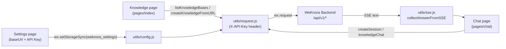

Vou traduzir o documento diretamente, mantendo toda a estrutura markdown.

---

# WeChat Mini Program Client

WeKnora provides a lightweight WeChat Mini Program client under the repository's `miniprogram/` directory, serving as a quick mobile entry point. It does not attempt to replicate the full functionality of the Web frontend, but instead focuses on three things:

- Configuring the WeKnora API address and tenant API Key;
- Listing and selecting a Knowledge Base, and importing web page URLs into the selected knowledge base;
- Initiating Knowledge Chat against the selected knowledge base.

## Tech Stack

This client is a **native WeChat Mini Program**, without using cross-platform frameworks such as Taro / uni-app / mpvue, and with no npm runtime dependencies at all:

- `miniprogram/app.js` — the standard `App({...})` entry point; on `onLaunch` it writes default settings to local storage;
- `miniprogram/app.json` — standard Mini Program global configuration (`pages`, `window`, `tabBar`);
- `miniprogram/app.wxss` — global styles; pages each use the standard `js / wxml / wxss / json` four-file set;
- `miniprogram/package.json` — package name `weknora-miniprogram` (version `0.1.0`), with `description` "WeChat Mini Program plugin for WeKnora", **with no `dependencies`**, only a single test script (see "Testing" below);
- `miniprogram/project.config.json` — `compileType: "miniprogram"`, `libVersion: "latest"` (uses the latest base library), compilation options enable `es6`, `enhance`, `postcss`, `minified`, and enable `urlCheck: true` (legal domain validation). **Note: this file intentionally does not include an `appid` field**; the AppID is provided via a private configuration file (see "Build and Release").

Global window style: navigation bar title `WeKnora`, background color `#0d3b2a` (dark green), white text.

## Page List

`miniprogram/app.json` registers 3 pages, and all three together make up the bottom `tabBar` (selected color `#07c05f`):

| Page Path | Name (tabBar label) | Function |
| --- | --- | --- |
| `pages/index/index` | Knowledge | Home page. Checks whether baseUrl / API Key are already configured; if not, prompts the user with a one-tap jump to Settings; calls `GET /api/v1/knowledge-bases` to load the knowledge base list, and lets the user select a knowledge base via a `picker` or list tap (the selection is persisted to local storage); after entering a web page URL, calls `POST /api/v1/knowledge-bases/{id}/knowledge/url` to import that URL into the selected knowledge base (`enable_multimodel` is fixed to `false`) |
| `pages/chat/chat` | Chat | Knowledge Q&A page. On the first question, lazily creates a session via `POST /api/v1/sessions` (carrying the selected `knowledge_base_id`), then calls `POST /api/v1/knowledge-chat/{sessionId}` to ask the question; the response body is SSE text, which the client parses with `utils/sse.js`, concatenating the chunks where `response_type === "answer"` and displaying the result as a whole (falling back to displaying the raw response if parsing fails) |
| `pages/settings/settings` | Settings | Connection configuration page. Fill in the API Base URL and API Key (password input field), saved to local storage under `weknora_settings` |

## Backend Address and Authentication Configuration

The Mini Program **does not hard-code the backend address in the code**; all connection information is filled in by the user on the "Settings" page and stored under the local storage key `weknora_settings` via `wx.setStorageSync`, with a structure containing three fields:

```js
{
  baseUrl: "http://localhost:8080",   // default value written by app.js onLaunch
  apiKey: "",
  selectedKnowledgeBaseId: ""
}
```

- **Default value**: In `onLaunch`, `miniprogram/app.js` writes a default `baseUrl: "http://localhost:8080"` and empty `apiKey` if no local settings are found. This default is only for local development convenience — actual use requires changing it to a real address on the Settings page.
- **Read/write and normalization**: `miniprogram/utils/config.js` provides `getSettings()` / `saveSettings()`, and strips leading/trailing whitespace and a trailing `/` via `normalizeBaseUrl()`.
- **Authentication method is API Key**: all requests in `miniprogram/utils/request.js` uniformly carry the following request headers:
  - `X-API-Key: <the API Key entered by the user>` (from the WeKnora tenant settings page, in the form `sk-...`);
  - `X-Request-ID: mp-<timestamp>-<random string>` (for server-side tracing);
  - `Content-Type: application/json`.
- **Pre-validation**: if either `baseUrl` or `apiKey` is missing, the request is directly rejected with an error Promise ("Please configure the WeKnora API base URL / API key first."); `pages/index/index.js`'s `onShow` likewise uses this to display a prompt guiding the user to the Settings page.
- **AppID configuration**: the WeChat Mini Program AppID is not placed in the shared `project.config.json`, but instead by copying `miniprogram/project.private.config.json.example` to `project.private.config.json` and filling in the real AppID (the example file's content is `{"appid": "your-wechat-mini-program-appid"}`).

Backend interfaces invoked (all defined in `miniprogram/utils/request.js`):

| Function | Method and Path |
| --- | --- |
| `listKnowledgeBases()` | `GET /api/v1/knowledge-bases` |
| `createKnowledgeFromURL(kbId, url, enableMultimodel)` | `POST /api/v1/knowledge-bases/{kbId}/knowledge/url` |
| `createSession(kbId)` | `POST /api/v1/sessions` |
| `knowledgeChat(sessionId, query, kbId)` | `POST /api/v1/knowledge-chat/{sessionId}` |

## utils/ Utility Modules

| File | Responsibility |
| --- | --- |
| `miniprogram/utils/config.js` | Persistence layer for settings: defines the storage key `STORAGE_KEY = "weknora_settings"`, provides `getSettings()`, `saveSettings()` (merge-style update), and `normalizeBaseUrl()` (trims and strips a trailing slash) |
| `miniprogram/utils/request.js` | Promise-based HTTP wrapper built on `wx.request`: concatenates `baseUrl + path`, injects `X-API-Key` / `X-Request-ID` headers, applies unified 2xx status checking and error message extraction (preferring `error.message`, then `message`, falling back to `HTTP <status>`); also exports the 4 business API functions listed in the table above |
| `miniprogram/utils/sse.js` | Server-Sent Events text parser: `parseSSE(raw)` splits event blocks on blank lines and parses `event:` / `data:` lines; `collectAnswerFromSSE(raw)` JSON-parses each event's `data` and accumulates the `content` where `response_type === "answer"` to produce the final answer text. Note that the Mini Program side **does not do streaming rendering** — it waits until `wx.request` receives the complete SSE text and then parses and displays it all at once |

## Data Flow Overview



## Build and Release Process

The Mini Program requires no build step (native development, no build toolchain) — simply open it directly with WeChat DevTools:

1. **Import the project**: in WeChat DevTools, select "Import Project" and point the directory to the repository's `miniprogram/`. The tool will read `project.config.json` (project name "WeKnora Mini Program").
2. **Configure the AppID**: copy `miniprogram/project.private.config.json.example` to `project.private.config.json`, and replace `appid` with your own Mini Program AppID. The shared `project.config.json` intentionally does not include the AppID, to avoid forcing maintainers to use a placeholder project; `project.private.config.json` is a personal private configuration file and should not be committed.
3. **Configure the backend connection**: after running, go to the **Settings** tab, fill in the API Base URL (e.g. `https://weknora.example.com`) and the API Key obtained from the WeKnora tenant settings page, then save.
4. **Local debugging note**: `project.config.json` has `urlCheck: true` enabled, so by default DevTools will block requests to non-legal domains such as `localhost`. For local testing, you can check "Do not verify legal domains" in DevTools, or expose the WeKnora service via an HTTPS development domain.
5. **Release**: before formal release, you need to add the WeKnora API domain (which must be HTTPS) to the request legal domain list (request domain whitelist) in the Mini Program admin console on the WeChat Official Accounts Platform; then click "Upload" in DevTools to submit the code, and finally submit it for review and release in the admin console.

### Testing

`miniprogram/package.json` defines a single script:

```bash
cd miniprogram
npm test    # actually runs node --test ../tests/miniprogram/*.test.js
```

That is, it uses Node.js's built-in test runner to run the unit tests in the repository's `tests/miniprogram/miniprogram.test.js` (covering the pure-function logic under `utils/`), without needing to install any dependencies.
