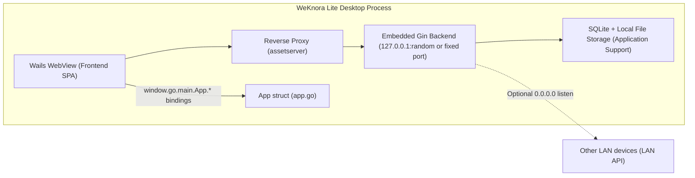

# Desktop Client (WeKnora Lite Desktop)

::: warning Not Yet Officially Released
The desktop app is not currently shipped with an installer in the Release, and needs to be built manually following [Installation & Deployment](../01-getting-started/02-installation.md).
:::

The WeKnora Lite desktop app is built on [Wails v2](https://wails.io); it runs the Go backend within the desktop process, using SQLite and local file storage. Once launched, you can manage knowledge bases and run retrieval and Q&A, with no Docker and no external database required. The source code is located in `cmd/desktop/`, and the core capabilities are identical to the [single-binary Lite](../01-getting-started/02-installation.md) edition; the desktop edition additionally provides login-free startup, as well as a [host sandbox](../03-features/22-skills-sandbox.md#lite-host) for running agent commands on macOS.

## Overall Architecture {#_1-overall-architecture}

The desktop app consists of three parts (all within the same process):

1. **Embedded Backend**: In `cmd/desktop/main.go`, `container.BuildContainer()` builds the same dependency injection container as the server edition, starting an `http.Server` (Gin router) in a separate goroutine.
2. **Wails Window (WebView)**: `wails.Run()` creates a native window; the frontend page is forwarded to the embedded backend via a **reverse proxy** (`httputil.NewSingleHostReverseProxy`) mounted through `assetserver.Options.Handler`, so what the WebView loads is the SPA served from the backend's `./web` directory.
3. **Go Bindings Layer**: The `App` struct in `cmd/desktop/app.go` is exposed to the frontend JS via `Bind` (`window.go.main.App.*`).



### Ports and Listening

Determined by `desktopBackendListenAddr()` in `main.go`:

- By default binds to `127.0.0.1`, with the port taken from `http_port` saved in `desktop-prefs.json`; if unset (0), a random free port is used via `:0`, with exponential backoff retry (`listenWithRetry`, up to 10 attempts).
- If the preference `http_bind_public` is `true`, it instead listens on `0.0.0.0`, and probes a non-loopback IPv4 (preferring private addresses) via `desktopPreferredLANIPv4()`, constructing `http://<LAN-IP>:<port>/api/v1` for use by other devices on the LAN.
- The reverse proxy and the WebView's API calls always go through the loopback address `http://127.0.0.1:<port>`, and never dial `0.0.0.0` directly.

### Data Storage Location (macOS .app Runtime)

`configureDesktopStorage()` in `main.go` detects when running from `.app/Contents/MacOS` and:

- Sets the data directory to `~/Library/Application Support/WeKnora Lite/` (name taken from the .app bundle name).
- SQLite database: `.../data/weknora.db` (injected via the `DB_PATH` environment variable).
- Local file storage: `.../data/files` (`LOCAL_STORAGE_BASE_DIR`).
- `migrateLegacyDesktopData()` performs a one-time migration of legacy data stored under `.app/Contents/Resources/data` to Application Support.
- The working directory switches to `.app/Contents/Resources`, so that the bundled `config/config.yaml`, `.env`, `migrations/sqlite`, and `web/` frontend assets can be read.

## Main Source Files {#_2-main-source-files}

| File | Purpose |
|------|------|
| `cmd/desktop/main.go` | Main entry point (`//go:build !bindings`): starts the embedded Gin backend, builds the macOS menu, configures the Wails window and reverse proxy, injects DomReady JS |
| `cmd/desktop/main_bindings.go` | Binding generation entry point (`//go:build bindings`): compiled separately with `-tags bindings` during the `wails build` frontend binding generation stage — only performs `Bind`, without starting Gin/database |
| `cmd/desktop/app.go` | The `App` struct and all Wails binding methods |
| `cmd/desktop/prefs.go` | Reading/writing desktop preferences (`desktop-prefs.json`), including the approved project directories for the host sandbox |
| `cmd/desktop/signing_key.go` | Generates and persists the signing key on first startup |
| `cmd/desktop/update.go` | Update-check / download / install-and-restart logic based on GitHub Releases |
| `cmd/desktop/wails.json` | Wails build configuration |
| `cmd/desktop/build/` | Packaging assets: `appicon.png` (app icon), `darwin/Info.plist` (macOS bundle template), `windows/installer/project.nsi` (Windows NSIS installer template) |

## Window Configuration and Frontend Injection {#_3-window-configuration-and-frontend-injection}

Key configuration in `wails.Run(&options.App{...})` (see `cmd/desktop/main.go`):

- Title `WeKnora Lite`, initial size **1280 × 800**, resizable, shown on startup.
- `AssetServer.Handler` uses a reverse proxy pointing to the embedded backend — **the frontend assets are not Go-embedded, but are the SPA served from the backend's `./web` directory (bundled at `.app/Contents/Resources/web`)**.
- macOS-specific: `mac.TitleBarHiddenInset()` for a hidden-style title bar, with an opaque WebView.
- App menu: `About WeKnora` (including an "Open GitHub" button linking to `https://github.com/Tencent/WeKnora`), `Check for Updates...`, `Quit` (Cmd+Q), a standard Edit menu, and `View > Reload` (Cmd+R, sends an `app:reload` event to the frontend).

On `OnDomReady`, three pieces of JS are injected into the WebView:

1. `wailsThemeSyncJS`: syncs the light/dark theme and window background color according to `WeKnora_theme` in `localStorage`.
2. `dragHandlerJS`: custom window drag handling (bypassing Wails' CSS-variable-based drag detection, instead using `el.closest()` DOM traversal + a top 38px title bar region check, sending `drag` via the WKWebView message bridge); it also intercepts external `http(s)` links and `window.open`, opening them in the system browser instead (`BrowserOpenURL`).
3. Injects `window.__WEKNORA_API_BASE__` (the real API root path `http://127.0.0.1:<port>/api/v1`) and an optional `window.__WEKNORA_API_LAN_BASE__` (LAN access address).

## Wails Binding Methods (Callable from Frontend) {#_4-wails-binding-methods-callable-from-frontend}

The `App` struct (`cmd/desktop/app.go`) is exposed via `Bind`, callable from the frontend as `window.go.main.App.<methodName>`; the generated TypeScript bindings are located at `frontend/src/wailsjs/go/main/App.d.ts`:

| Method | Signature (JS side) | Description |
|------|--------------|------|
| `GetAPIBaseURL` | `(): Promise<string>` | Returns the local REST API root address, e.g. `http://127.0.0.1:PORT/api/v1` (the WebView's `window.location.origin` is not the API host, so this value must be used) |
| `GetAPILanBaseURL` | `(): Promise<string>` | Returns the API address recommended for other devices on the LAN (`…/api/v1`); empty when not in bind-public mode or if IP probing fails |
| `GetDesktopHTTPPortSetting` | `(): Promise<number>` | Reads the saved local API port preference (0 = random port on each startup) |
| `SetDesktopHTTPPortSetting` | `(port: number): Promise<void>` | Saves the port preference; requires an app restart to take effect |
| `GetDesktopHTTPBindPublicSetting` | `(): Promise<boolean>` | Reads the preference for whether to listen on all network interfaces (`0.0.0.0`) |
| `SetDesktopHTTPBindPublicSetting` | `(v: boolean): Promise<void>` | Saves the LAN/public listening preference; requires an app restart to take effect |
| `GetDesktopListenPublicActive` | `(): Promise<boolean>` | Whether the current session is **actually** listening on all network interfaces (runtime state, not the saved preference) |
| `CheckForUpdates` | `(): Promise<void>` | Manually triggers an update check (with dialog feedback such as "already up to date") |
| `AutoCheckForUpdates` | `(): Promise<void>` | Silently checks for updates and automatically downloads in the background |
| `GetAutoSetupToken` | `(): Promise<string>` | Returns the login-free credential for the current process; the frontend uses it to call `POST /api/v1/auth/auto-setup` |
| `PickProjectDir` | `(): Promise<string>` | Opens the system directory picker, adds the selected directory to the host sandbox's approved list, and returns it; empty if cancelled |
| `GetProjectDirs` | `(): Promise<string[]>` | Reads the approved project directories |
| `RemoveProjectDir` | `(dir: string): Promise<void>` | Removes a directory from the approved list |
| `GetApprovalMode` / `SetApprovalMode` | `(): Promise<string>` / `(mode: string): Promise<void>` | Reads/writes the host sandbox approval mode; currently only `auto` is accepted |

## Preferences Storage (cmd/desktop/prefs.go) {#_5-preferences-storage-cmd-desktop-prefs-go}

Preferences are saved as a JSON file `desktop-prefs.json`, located at `os.UserConfigDir()/WeKnora Lite/desktop-prefs.json`:

- macOS: `~/Library/Application Support/WeKnora Lite/desktop-prefs.json`
- Windows: `%AppData%\WeKnora Lite\desktop-prefs.json`
- Linux: `~/.config/WeKnora Lite/desktop-prefs.json`

File permissions are `0600`, with the following fields:

| Field | Type | Default | Description |
|------|------|--------|------|
| `http_port` | int | 0 | The port the embedded API service listens on; 0 or an invalid value (outside 1–65535) means a random free port is used on each startup |
| `http_bind_public` | bool | false | Whether to listen on `0.0.0.0` (allowing LAN/public access to the embedded API) |
| `project_dirs` | string[] | empty | Host project directories (absolute paths) approved via the system directory picker; only directories in this list can be bound to a session |
| `approval_mode` | string | `auto` | Host sandbox approval mode; unknown values are treated as `auto`; `ask` and `full` are not yet available and are rejected on save |

Read/write entry points: `LoadDesktopPrefsHTTPPort()` / `LoadDesktopHTTPBindPublic()` / `SaveDesktopHTTPPortPreference()` / `SaveDesktopHTTPBindPublicPreference()`, plus `LoadProjectDirs()` / `LoadApprovalMode()` for the host sandbox; on read or parse failure, these silently fall back to zero values. `project_dirs` can only be appended via the directory picker (`PickProjectDir` or `POST /api/v1/system/host-project-dir`); manually entered paths are not treated as authorized.

## Login-Free Startup and Signing Key

The desktop edition does not require registration or login at startup:

- Each startup generates a random credential that is handed only to the built-in frontend via the Wails binding `GetAutoSetupToken`. The frontend carries it in the `X-WeKnora-Desktop-Token` request header when calling `POST /api/v1/auth/auto-setup`; the first call creates the default user `admin@weknora.local` and a space, and subsequent calls issue a login token directly. Requests without this credential (including other devices on the LAN and ordinary browsers) are rejected.
- When no valid `SYSTEM_SIGNING_KEY` (or non-default `SYSTEM_AES_KEY`) is configured, the first startup generates `signing.key` (permissions `0600`) in the preferences directory and uses it as `SYSTEM_SIGNING_KEY` for signing file presigned links, web embed sessions, and so on; it remains valid across restarts. It is used only for signing and does not replace the AES key that encrypts stored credentials.

## Auto-Update Mechanism (cmd/desktop/update.go) {#_6-auto-update-mechanism-cmd-desktop-update-go}

`checkUpdate(ctx, currentVersion, showUpToDate, autoDownload)` executes within a goroutine:

1. **Version Source**: `desktopAboutVersion()` prefers the `handler.Version` injected via build-time ldflags, otherwise searches upward for a `VERSION` file at the repository root; if the version cannot be determined, the check is abandoned.
2. **Check**: GETs `https://api.github.com/repos/Tencent/WeKnora/releases/latest` (10s timeout, with `User-Agent: WeKnora-Lite-Desktop-App`; if the `GITHUB_TOKEN` environment variable is set, an `Authorization` header is attached to raise the rate limit). Compares `tag_name` against the current version using `golang.org/x/mod/semver`.
3. **Asset Selection**: `findBestAsset()` matches release asset filenames against `runtime.GOOS/GOARCH` — an OS keyword (`mac`/`win`/`linux`) + an architecture keyword (`amd64`/`arm64`, compatible with `universal`/`aarch64`), falling back progressively: OS+Arch → OS only → macOS `.dmg` → Windows `.exe`; if nothing matches, the release page is opened instead.
4. **Download**: `downloadAndInstall()` downloads to the system temp directory; `autoDownload` mode downloads silently, while manual mode first shows an "Update Available" dialog. Once the download completes, the user is prompted "Restart Now / Later".
5. **Install and Restart** (`applyUpdateAndRestart()`, platform-specific):
   - **Windows**: Writes a temporary `weknora_update.bat` (delays 2 seconds → silently runs the installer with `/S` → restarts the original program → self-deletes), executed via `cmd.exe /C start /b` before the app exits.
   - **macOS (.dmg)**: Mounts the .dmg to a temporary mount point via `hdiutil attach`, locates the `.app` inside it, and writes a temporary `weknora_update.sh`: `rm -rf` the old bundle and `cp -a` the new bundle (retrying with elevated privileges via `osascript … with administrator privileges` on failure) → `hdiutil detach` → `open` the new app → self-delete; falls back to `open`-ing the downloaded file for non-`.dmg` cases or on error.
   - **Linux**: Opens the downloaded file with `xdg-open` and exits.

Trigger entry points: the macOS menu `Check for Updates...` (manual, shows the result), the binding method `CheckForUpdates()` (manual), and `AutoCheckForUpdates()` (silent + automatic download, called by the frontend `frontend/src/App.vue` when it detects that `window.go.main.App.AutoCheckForUpdates` exists).

## Wails Build Configuration (cmd/desktop/wails.json) {#_7-wails-build-configuration-cmd-desktop-wails-json}

```json
{
  "name": "WeKnora Lite",
  "outputfilename": "WeKnora Lite",
  "frontend:dir": "../../frontend",
  "wailsjsdir": "../../frontend/src",
  "build:tags": "desktop",
  "info": { "companyName": "Tencent", "productName": "WeKnora Lite", "productVersion": "1.0.0" },
  "mac": { "category": "public.app-category.productivity", "titlebar": "hiddenInset" }
}
```

Key points:

- `build:tags` is `desktop`: only programs compiled with this tag include the Lite host sandbox; tags passed via `wails build -tags ...` are merged with it.
- `frontend:dir` points to the repository's `frontend/`; `wailsjsdir` points to `frontend/src`, so Wails' auto-generated bindings are output to `frontend/src/wailsjs/` (`go/main/App.js`, `App.d.ts`, and `runtime/`).
- **Frontend build**: the packaging script builds the frontend separately, and `frontend:build` is not set in the Wails configuration. The WebView accesses the embedded backend through a reverse proxy.
- `cmd/desktop/build/` contains `appicon.png` (app icon), `darwin/Info.plist` (a Go template for the macOS bundle, declaring `CFBundleIdentifier: com.wails.WeKnora Lite`, a minimum system version of 10.13, Retina support, etc.), and the Windows installer template `windows/installer/project.nsi` (which additionally installs third-party license files); the output of `wails build` is written to `cmd/desktop/build/bin/`.

## How the Frontend Detects the Desktop Environment {#_8-how-the-frontend-detects-the-desktop-environment}

- `dragHandlerJS` adds a `wails-desktop` class to `document.documentElement`, which the frontend CSS can use for desktop-specific styling.
- The `window.go.main.App.*` bindings injected by Wails (generated bindings in `frontend/src/wailsjs/go/main/`) and `window.runtime` (`frontend/src/wailsjs/runtime/`, e.g. `BrowserOpenURL`, `EventsEmit`) only exist in the desktop environment; the frontend determines this via feature detection. For example, `frontend/src/composables/useApiBaseUrlDisplay.ts` polls `window.__WEKNORA_API_BASE__` or calls `window.go.main.App.GetAPIBaseURL()` to obtain the real API address (in a browser environment it falls back to a configured value / `window.location.origin`); `frontend/src/App.vue` triggers a silent update check when it detects that `window.go.main.App.AutoCheckForUpdates` exists.
- The settings pages `frontend/src/views/settings/GeneralSettings.vue` and `frontend/src/views/integrations/ApiIntegrationSettings.vue` also use these bindings to display/modify desktop-specific options such as the port and LAN listening.

## Build Method {#_9-build-method}

The macOS packaging script is `scripts/package-mac-app.sh` (the root `Makefile` has no desktop-related target):

```bash
# Full build (frontend + Wails packaging + assembling the .app)
./scripts/package-mac-app.sh

# Skip the frontend build (reuse the existing web/ directory)
SKIP_FRONTEND=1 ./scripts/package-mac-app.sh
```

Script flow:

1. **Frontend Build**: `cd frontend && npm ci && npm run build`, then syncs `frontend/dist` into the repository root's `web/` (the Lite backend serves the SPA from `./web`).
2. **Wails Build**: Requires the Wails CLI to be installed first (`go install github.com/wailsapp/wails/v2/cmd/wails@latest`), sets environment variables such as `EDITION=lite` and `GOLANG_PROTOBUF_REGISTRATION_CONFLICT=warn` (to work around a `common.proto` descriptor registration conflict between the Milvus and Qdrant generated gRPC code), takes the version number from `scripts/get_version.sh` to inject into ldflags, then runs the actual build command:

   ```bash
   cd cmd/desktop && wails build -clean -tags "sqlite_fts5" -ldflags="$LDFLAGS" -o "WeKnora Lite"
   ```

   The effective build tags are `desktop` from `wails.json` plus `sqlite_fts5` from the command line. This command's "binding generation" stage compiles `main_bindings.go` separately using `-tags bindings` (without connecting to a database), and refreshes the binding files under `frontend/src/wailsjs/`.
3. **Assembling the Output**: Copies `cmd/desktop/build/bin/WeKnora Lite.app` into `dist/`, and places the third-party licenses (`scripts/copy-licenses.sh`), `.env` (from `.env.lite.example`), `config/`, `migrations/sqlite/`, and the `web/` frontend assets into `.app/Contents/Resources/`.

The final output is `dist/WeKnora Lite.app`, which runs by double-clicking. Windows/Linux builds can also be produced using `wails build` under `cmd/desktop` (the update mechanism has already been adapted for `.exe` / `xdg-open` on those platforms), but the repository currently only provides the macOS packaging script and `build/darwin` assets.
