# Database and Migrations

This chapter covers WeKnora's database support matrix, the final table schema after all migrations in the `migrations/` directory are stacked, the inter-table relationships (ER diagram), the golang-migrate migration mechanism, and guidance for adding new migrations and troubleshooting common issues.

## 1. Supported Databases

The main application connects to the database via GORM, with the driver determined by the `DB_DRIVER` environment variable. The switch statement inside `initDatabase()` in `internal/container/container.go` **only accepts two values**:

| `DB_DRIVER` | Description |
| --- | --- |
| `postgres` | Standard mode. Supports both native PostgreSQL (+pgvector) and **ParadeDB** (a PostgreSQL fork with built-in `pg_search`/BM25, whose official compose setup defaults to the `paradedb/paradedb:v0.22.2-pg17` image). The GORM DSN is assembled from `DB_HOST/DB_PORT/DB_USER/DB_PASSWORD/DB_NAME`, forcing `sslmode=disable` and `TimeZone=UTC` |
| `sqlite` | Lite mode. The path comes from `DB_PATH` (default `./data/weknora.db`), the DSN appends `_journal_mode=WAL&_busy_timeout=5000&_foreign_keys=on`, and loads the `sqlite-vec` extension (`sqlite_vec.Auto()`) for vector search |
| Any other value | Fails immediately with `unsupported database driver` |

**MySQL is not a primary database option**: the `go-sql-driver/mysql` entry in `go.mod` is used to register the protocol driver for the Doris retrieval engine (MySQL protocol, `database/sql`) — see the import comment in `container.go`. `migrations/mysql/00-init-db.sql` is a one-off MySQL table-creation script containing only 7 core tables (tenants/models/knowledge_bases/knowledges/sessions/messages/chunks); **no Go code or script references it**, and it is not wired into the application startup flow — treat it as legacy/external-initialization tooling.

The retrieval engine (storage for vector/keyword indexes) is decoupled from the primary database and controlled by `RETRIEVE_DRIVER` (postgres / elasticsearch / qdrant / milvus / sqlite, etc. — see the *Extension Points Guide* for details). When `RETRIEVE_DRIVER` does not include `postgres`, the migration DSN appends `options=-c app.skip_embedding=true`, and the `embeddings`-related migrations are conditionally skipped via this GUC.

## 2. Migration Directory Structure

```text
migrations/
├── versioned/     # PostgreSQL/ParadeDB versioned migrations: 000000-000079, 80 versions total (160 .up/.down.sql files)
├── sqlite/        # SQLite migrations: 000000_init (flattened full schema) + subsequent incremental versions
├── paradedb/      # Additional ParadeDB scripts: 00-init-db.sql (extension initialization), 01-migrate-to-paradedb.sql (existing-database cutover)
└── mysql/         # 00-init-db.sql, a legacy one-off MySQL table-creation script (not wired into the code)
```

- `versioned/` is the single "incremental history," running from `000000_init` to `000079_knowledge_folder_path`;
- `sqlite/` uses `000000_init` as the flattened full initialization (dialect differences such as JSONB→TEXT, SERIAL→AUTOINCREMENT are already adapted), followed by incremental versions added as needed (currently `000001_remove_wiki_log` and `000002_knowledge_folder_path`), also executed in order by golang-migrate;
- `paradedb/00-init-db.sql` creates extensions such as `pg_search`; the BM25 index uses the Chinese Lindera tokenizer, built on `embeddings.content`.

### 2.1 Overview of the versioned/ Migration History (by topic)

| Version Range | Topic | Key Tables/Columns Introduced |
| --- | --- | --- |
| 000000 | Core initialization | `tenants`, `models`, `knowledge_bases`, `knowledges`, `chunks`, `sessions`, `messages` |
| 000001 | User authentication + Agent + MCP | `users`, `auth_tokens`, `custom_agents`, `mcp_services`, `knowledge_tags` |
| 000002-000011 | Vector/retrieval | `embeddings` (HNSW + BM25, gated by `app.skip_embedding`), `chunks.flags`, `seq_id`, ParadeDB BM25 index |
| 000012-000018 | Cross-tenant collaboration | `organizations`, `organization_members`, `kb_shares`, `agent_shares`, `organization_join_requests` |
| 000019-000028 | Messaging/IM enhancements | `messages` extended columns (images, rendered_content, agent_duration_ms), `im_channels`, `im_channel_sessions` |
| 000029-000036 | Data source and vector store abstraction | `data_sources`, `sync_logs`, `web_search_providers`, `vector_stores`, KB's asr_config/vector_store_id |
| 000037-000041 | Wiki and task queue | `wiki_pages`, `wiki_folders`, `wiki_page_issues`, `wiki_log_entries` (removed in 000077), `task_pending_ops`, `task_dead_letters` |
| 000042-000054 | RBAC / audit / invitations | `mcp_tool_approvals`, `tenant_members`, `audit_logs`, `organization_tenant_members`, `user_resource_favorites`, `tenant_invitations`, `user_kb_pins`, `invitation_tokens` |
| 000055-000060 | Processing pipeline and embedding channels | `knowledge_processing_spans`, `knowledge_pending_subtasks`, `embed_channels`, HNSW 1024-dimension index |
| 000061-000067 | Wiki hierarchy / OAuth / document multi-tagging / suggested questions | `wiki_pages` hierarchy columns, `mcp_oauth_clients`, `mcp_oauth_tokens`, `knowledge_tag_relations`, `principals`, `principal_models`, `tenant_api_keys`, `message_suggestion_sets`, `message_suggestion_events` |
| 000068-000074 | Storage/resources/temporary documents | `storage_backends`, `resources`, `resource_bindings`, `resource_access_grants`, `temporary_documents`, platform-level API keys, OAuth refresh lease |
| 000075-000076 | Wiki version history and indexing | `wiki_page_revisions`, `wiki_pages.last_edit_source`/`last_editor_id`, prefix index on `knowledges.metadata->>'external_id'` |
| 000077 | Remove Wiki operation log | DROP `wiki_log_entries`, and delete legacy pages with `page_type = 'log'`; Wiki changes are now recorded uniformly in the knowledge base activity stream |
| 000078 | Chunk editing and custom metadata | `chunks` gains `source_content`/`content_revision`/`index_status`/`last_editor_id`/`context_header`, new `chunk_revisions` table, `knowledges` gains `custom_metadata` |
| 000079 | Knowledge base folder tree | `knowledges` gains a `folder_path` column and backfills legacy directory uploads (previously the path was embedded in `file_name`), plus a new `(tenant_id, knowledge_base_id, folder_path)` index |

## 3. Final Table Schema

The following is the **final effective structure** after all up migrations are stacked (subsequent ALTERs to earlier tables have been merged in). All business tables uniformly include `created_at` / `updated_at`, and most include `deleted_at` (GORM soft delete); these are not listed individually below.

### 3.1 Tenants and Users

| Table | Purpose | Key Fields |
| --- | --- | --- |
| `tenants` | Tenant (workspace), the root of the multi-tenancy system | `id` (SERIAL, starting at 10000), `name`, `api_key` (unique index), `retriever_engines` (JSONB), `status`, `storage_quota`/`storage_used`, `agent_config`/`context_config`/`conversation_config`/`web_search_config`/`credentials` (JSONB), `default_storage_backend_id` |
| `users` | Login users | `id` (UUID), `username` (unique), `email` (unique), `password_hash`, `tenant_id` (FK→tenants, ON DELETE SET NULL), `is_active`, `can_access_all_tenants` (system administrator), `preferences` (JSON) |
| `auth_tokens` | Login tokens | `id`, `user_id` (FK→users, CASCADE), `token`, `token_type` (access/refresh), `expires_at` (TIMESTAMPTZ, from 000072), `is_revoked` |
| `tenant_members` | Tenant-level RBAC membership relationship | `user_id`+`tenant_id` (unique under soft delete), `role` (owner/admin/contributor/viewer), `status`, `invited_by`, `joined_at` |
| `tenant_invitations` | In-app invitations | `tenant_id`, `invitee_user_id`, `role`, `status` (pending/accepted/rejected), `expires_at`; unique constraint on pending |
| `invitation_tokens` | Invitation link tokens (000054) | Tokens bound to a tenant/role |
| `tenant_api_keys` | Tenant/platform API keys | `tenant_id` (NULL for platform scope), `scope_type` (tenant/platform, CHECK constraint), `key_hash` (unique), `full_access`, `knowledge_base_ids`, `capabilities`, `expires_at`/`revoked_at` |
| `user_kb_pins` | User-level knowledge base pinning | PK (`tenant_id`, `user_id`, `kb_id`) + `pinned_at` |
| `user_resource_favorites` | User favorites | PK (`user_id`, `tenant_id`, `resource_type`, `resource_id`) |
| `audit_logs` | Audit log (000044) | `tenant_id`, `actor_user_id`/`actor_role`, `action`, `target_type`/`target_id`/`target_user_id`, `request_path`/`request_method`, `outcome` (success/denied), `scope_type`/`scope_id`, `details` (JSONB) |

### 3.2 Models and Knowledge Bases

| Table | Purpose | Key Fields |
| --- | --- | --- |
| `models` | AI model configuration (LLM/embedding/rerank, etc.) | `id`, `tenant_id` (FK→tenants, CASCADE), `name`/`display_name`, `type` (embedding/summary/rerank/llm…), `source`, `parameters` (JSONB), `is_default`, `is_builtin`, `managed_by`, `status` |
| `knowledge_bases` | Knowledge base | `id` (UUID), `tenant_id`, `name`, `type` (document/faq), `chunking_config`/`image_processing_config`/`vlm_config`/`faq_config`/`asr_config`/`wiki_config`/`indexing_strategy` (JSONB), `embedding_model_id`/`summary_model_id` (FK→models), `vector_store_id` (FK→vector_stores), `storage_backend_id` (FK→storage_backends), `creator_id` (FK→users), `is_temporary`, `activity_scope` |
| `knowledges` | Knowledge entries (documents/web pages/FAQs, etc.) | `id`, `tenant_id`, `knowledge_base_id` (FK), `type`, `title`, `source` (VARCHAR(2048)), `parse_status` (unprocessed/processing/completed/failed), `enable_status`, `file_name`/`file_type`/`file_size`/`file_path`/`file_hash`, `metadata` (internal ingestion state), `custom_metadata` (JSONB, user-supplied metadata, 000078), `folder_path` (directory tree path, 000079), `summary_status`, `channel`, `processed_at`/`error_message`. **Has no `tag_id` column** — since 000063, tagging goes through the `knowledge_tag_relations` join table |
| `chunks` | Chunks (the smallest retrieval unit) | `id`, `tenant_id`, `knowledge_base_id`, `knowledge_id` (FK), `content`, `source_content` (immutable raw parser output), `content_revision`, `index_status` (ready/processing/failed), `last_editor_id`, `context_header` (heading breadcrumb used for indexing), `chunk_index`, `start_at`/`end_at`, `pre_chunk_id`/`next_chunk_id` (linked list), `parent_chunk_id` (parent-child chunk self-reference), `chunk_type` (text/image/…), `image_info`/`video_info`, `relation_chunks`/`indirect_relation_chunks` (JSONB), `is_enabled`, `flags`, `status`, `content_hash`, `seq_id`, `tag_id` |
| `chunk_revisions` | Chunk revision history (000078) | `id`, `tenant_id`, `knowledge_base_id`, `knowledge_id`, `chunk_id`+`revision` (unique index), `content`, `is_enabled`, `editor_id`, `edit_source`, `edited_at` |
| `embeddings` | Vectors + BM25 index (specific to the Postgres/ParadeDB retrieval engine, gated by `app.skip_embedding`) | `id`, `source_id`+`source_type` (unique; source such as chunk/wiki page), `chunk_id`/`knowledge_id`/`knowledge_base_id`, `content` (BM25 full text), `dimension`, `embedding` (halfvec, HNSW indexes built separately for 768/1024/3584 dimensions), `is_enabled`, `tag_id` |
| `knowledge_tags` | Knowledge tags (FAQ categorization, etc.) | `id`, `tenant_id`, `knowledge_base_id`, `name`, `seq_id` |
| `knowledge_tag_relations` | Document ↔ tag many-to-many (000063) | Composite primary key (`knowledge_id`, `tag_id`) + `created_at`; indexed on both sides. **Also removed the `knowledges.tag_id` column** (existing single-tag data was migrated into this table). FAQ entry tags are not here — they still use the single-tag `chunks.tag_id` |
| `vector_stores` | External vector store connection configuration (000032) | `id`, `tenant_id`, `name` (unique within tenant), `engine_type`, `connection_config`/`index_config` (JSONB) |

### 3.3 Sessions and Messages

| Table | Purpose | Key Fields |
| --- | --- | --- |
| `sessions` | Session (conversation context and a snapshot of retrieval parameters) | `id`, `tenant_id`, `title`, `knowledge_base_id`, `agent_id` (FK→custom_agents), `user_id`, `max_rounds`, `enable_rewrite`, `fallback_strategy`/`fallback_response`, `keyword_threshold`/`vector_threshold`, `embedding_top_k`/`rerank_top_k`/`rerank_threshold`, `rerank_model_id`/`summary_model_id`, `agent_config`/`context_config` (JSONB) |
| `messages` | Message | `id`, `request_id`, `session_id` (FK), `role`, `content`/`rendered_content`, `knowledge_references` (JSONB references), `agent_steps` (JSONB, Agent reasoning trace), `mentioned_items`/`images` (JSONB), `is_completed`/`is_fallback`, `channel` (web/IM channel), `agent_id`+`agent_tenant_id`, `model_id`, `knowledge_id`, `agent_duration_ms`, `execution_context` |
| `message_suggestion_sets` | Suggested question sets (000067) | `tenant_id`, `session_id`, `assistant_message_id`, `placement` (starter/follow_up), `config_hash`+`locale` (cache key, unique), `status`, `questions` (JSONB), token/latency statistics, `lease_until` |
| `message_suggestion_events` | Suggested question impression/click events | `suggestion_set_id` (FK, CASCADE), `question_id`, `event_type`, `actor_id` |
| `temporary_documents` | Session-scoped temporary documents (000070) | `tenant_id`, `session_id`, `resource_ref`, `file_name`/`file_type`/`file_size`, `status` (uploaded/processing/ready/expired), `content`, `chunks` (JSONB), `expires_at` |

### 3.4 Agent and MCP

| Table | Purpose | Key Fields |
| --- | --- | --- |
| `custom_agents` | Custom agents | **Composite primary key (`id`, `tenant_id`)**, `name`, `is_builtin`, `created_by` (FK→users), `runnable_by_viewer`, `config` (JSONB: mode/model/tools/knowledge scope) |
| `mcp_services` | MCP service configuration | `id`, `tenant_id`, `name`, `enabled`, `transport_type` (stdio/sse/…), `url`/`headers`/`auth_config`/`stdio_config`/`env_vars` (JSONB), `is_builtin` |
| `mcp_tool_approvals` | MCP tool approval policy (000042) | (`tenant_id`, `service_id`, `tool_name`) unique, `require_approval` |
| `mcp_oauth_clients` | MCP OAuth clients (000062) | (`tenant_id`, `service_id`) unique, `client_id`/`client_secret`/`redirect_uri` |
| `mcp_oauth_tokens` | MCP OAuth tokens | (`tenant_id`, `user_id`, `service_id`) unique, `access_token`/`refresh_token`, `expires_at`, `refresh_lease_id`/`refresh_lease_until` (000074, prevents concurrent refresh) |
| `principals` / `principal_models` | Principal—model authorization (000064) | Mapping of available models per principal (user/tenant) |

### 3.5 Cross-Tenant Collaboration (Organizations)

| Table | Purpose | Key Fields |
| --- | --- | --- |
| `organizations` | Organization (cross-tenant collaboration unit, 000012) | `id`, `name`, `owner_id` (FK→users), `owner_tenant_id`, `invite_code` (unique) + expiration control, `require_approval`, `searchable`, `member_limit` |
| `organization_members` | User members of the organization | `organization_id` (FK, CASCADE), `user_id`, `tenant_id`, `role` |
| `organization_tenant_members` | Tenant members of the organization (000045) | (`organization_id`, `tenant_id`) unique, `role` (admin/editor/viewer), `representative_user_id` |
| `organization_join_requests` | Join/upgrade requests | `organization_id`, `user_id`, `status` (pending unique), `requested_role`, `request_type` (join/upgrade), approval fields |
| `kb_shares` | Knowledge base shared to an organization | (`knowledge_base_id`, `organization_id`) unique under soft delete, `source_tenant_id`, `permission` |
| `agent_shares` | Agent shared to an organization | FK (`agent_id`, `source_tenant_id`)→custom_agents composite primary key, `organization_id`, `permission` |
| `tenant_disabled_shared_agents` | Tenant disabling a specific shared agent | PK (`tenant_id`, `agent_id`, `source_tenant_id`) |

### 3.6 Wiki

| Table | Purpose | Key Fields |
| --- | --- | --- |
| `wiki_pages` | AI-generated wiki pages (000037) | `id`, `tenant_id`, `knowledge_base_id`, `slug` (unique within KB), `title`, `page_type` (summary/index/…), `status`, `content`/`summary`, hierarchy columns (000061: `parent_slug`, `folder_id`, `category_path`, `wiki_path`, `depth`, `sort_order`), `source_refs`/`chunk_refs`/`in_links`/`out_links` (JSONB), `version`; full-text GIN/tsvector + trigram indexes |
| `wiki_folders` | Wiki folder tree | `knowledge_base_id`, `parent_id` (adjacency list), `name` (unique under the same parent), `path` (materialized path), `depth`, `sort_order` |
| `wiki_page_issues` | Page issue reports | `knowledge_base_id`, `slug`, `issue_type`, `description`, `suspected_knowledge_ids`, `status`, `reported_by` |
| `wiki_page_revisions` | Wiki page revision history (000075) | `page_id`+`version` (unique index), snapshot of title/body/summary/type/status/alias, `edit_source` (pipeline/agent/user/revert), `editor_id`, `edited_at`; two-tier retention cap: soft 50 versions (only prunes pipeline and empty-source entries) / hard 200 versions |

### 3.7 Data Sources / Channels / Search

| Table | Purpose | Key Fields |
| --- | --- | --- |
| `data_sources` | External data source connections (Feishu/Notion/Yuque/RSS, 000029) | `id`, `tenant_id`, `knowledge_base_id`, `type`, `config` (JSONB credentials), `sync_schedule` (cron), `sync_mode` (incremental/full), `conflict_strategy`, `sync_deletions`, `last_sync_at`/`last_sync_cursor`/`last_sync_result` |
| `sync_logs` | Execution record of each sync run | `data_source_id` (FK, CASCADE), `status`, `started_at`/`finished_at`, `items_total/created/updated/deleted/skipped/failed`, `error_message` |
| `im_channels` | IM channel integration configuration (WeChat Work/Feishu/Slack, etc.) | `tenant_id`, `platform`, `agent_id`, `knowledge_base_id`, credential configuration |
| `im_channel_sessions` | IM user/thread ↔ session mapping | `im_channel_id`, `session_id`, `agent_id`, platform user/conversation identifiers |
| `embed_channels` | Web embed chat widget channels (000060) | `tenant_id`, `agent_id`, public token/domain configuration |
| `web_search_providers` | Web search engine configuration (000030) | `id`, `tenant_id`, `name`, `provider` (bing/google/tavily/searxng…), `parameters` (JSONB API key), `is_default` |

### 3.8 Storage / Resources / Tasks / Observability

| Table | Purpose | Key Fields |
| --- | --- | --- |
| `storage_backends` | Object storage backend configuration (000068) | `id`, `tenant_id`, `name` (unique within tenant), `provider` (local/minio/cos/oss/s3/obs/tos/ks3), `config` (JSONB), `source` (user/system), `legacy_alias` |
| `resources` | Unified resource registry (000069) | `id`, `handle` (22-character short handle, unique), `tenant_id`, `storage_backend_id`, `provider`, `physical_path`, `location_hash` (unique within tenant), `mime_type`/`original_name`/`size`/`content_hash`, `lifecycle` (persistent/temporary) + `expires_at`, `state` |
| `resource_bindings` | Resource ↔ owner (message/knowledge/session) polymorphic binding | (`resource_id`, `owner_type`, `owner_id`, `relation`) unique |
| `resource_access_grants` | Temporary resource access tokens | `token_hash` (unique), `resource_id`, `access_scope`, `expires_at`/`revoked_at` |
| `task_pending_ops` | General-purpose pending task queue (000041) | `tenant_id`, `task_type`, `scope`+`scope_id`, `op`, `dedup_key`, `payload` (JSONB), `fail_count`, `enqueued_at`/`claimed_at` (concurrent claiming) |
| `task_dead_letters` | Failed task dead-letter archive | `task_type`, `scope`/`scope_id`/`related_id`, `payload`, `last_error`, `fail_count`, `failed_at` |
| `knowledge_pending_subtasks` | Knowledge processing subtask queue (000056) | `knowledge_id`, `attempt`, `task_type`, payload |
| `knowledge_processing_spans` | Document processing pipeline trace (000055) | (`knowledge_id`, `attempt`, `span_id`) unique, `parent_span_id`, `name` (DocReader/Chunking/Embedding…), `kind`, `status`, `input`/`output`/`metadata` (JSONB), `error_code`/`error_message`, `duration_ms` |
| `schema_migrations` | golang-migrate status table (maintained automatically) | `version`, `dirty` |

## 4. ER Diagram (Core Tables)

```mermaid
erDiagram
    tenants ||--o{ users : "tenant_id (SET NULL)"
    tenants ||--o{ tenant_members : "tenant members"
    users ||--o{ tenant_members : "user_id"
    users ||--o{ auth_tokens : "login tokens"
    tenants ||--o{ models : "model configuration"
    tenants ||--o{ knowledge_bases : "knowledge bases"
    tenants ||--o{ tenant_api_keys : "API keys"
    tenants ||--o{ audit_logs : "audit"
    users ||--o{ audit_logs : "actor_user_id"

    knowledge_bases ||--o{ knowledges : "documents"
    knowledge_bases }o--|| models : "embedding_model_id"
    knowledge_bases }o--o| vector_stores : "vector_store_id"
    knowledge_bases }o--o| storage_backends : "storage_backend_id"
    knowledge_bases }o--o| users : "creator_id"
    knowledges ||--o{ chunks : "chunks"
    chunks ||--o| chunks : "parent_chunk_id (parent-child chunk)"
    chunks ||--o| embeddings : "source_id (vector/BM25)"
    knowledge_bases ||--o{ knowledge_tags : "tags"
    knowledge_tags ||--o{ knowledge_tag_relations : "multi-tag relations"
    knowledges ||--o{ knowledge_tag_relations : "knowledge_id"

    tenants ||--o{ sessions : "sessions"
    sessions ||--o{ messages : "messages"
    sessions }o--o| custom_agents : "agent_id"
    sessions }o--o| knowledge_bases : "knowledge_base_id"
    messages }o--o| knowledges : "knowledge_id"
    messages ||--o{ message_suggestion_sets : "suggested questions"
    message_suggestion_sets ||--o{ message_suggestion_events : "events"
    sessions ||--o{ temporary_documents : "temporary documents"

    tenants ||--o{ custom_agents : "custom agents"
    tenants ||--o{ mcp_services : "MCP services"
    mcp_services ||--o{ mcp_tool_approvals : "tool approvals"
    mcp_services ||--o{ mcp_oauth_clients : "OAuth clients"
    mcp_services ||--o{ mcp_oauth_tokens : "OAuth tokens"

    users ||--o{ organizations : "owner_id"
    organizations ||--o{ organization_tenant_members : "tenant members"
    organizations ||--o{ kb_shares : "knowledge base shares"
    organizations ||--o{ agent_shares : "agent shares"
    organizations ||--o{ organization_join_requests : "join requests"
    knowledge_bases ||--o{ kb_shares : "shared"
    custom_agents ||--o{ agent_shares : "shared (id, tenant_id)"

    knowledge_bases ||--o{ wiki_pages : "wiki pages"
    wiki_pages }o--o| wiki_folders : "folder_id"
    wiki_folders ||--o{ wiki_folders : "parent_id (tree)"
    knowledge_bases ||--o{ wiki_page_issues : "issue reports"

    knowledge_bases ||--o{ data_sources : "data sources"
    data_sources ||--o{ sync_logs : "sync logs"
    tenants ||--o{ web_search_providers : "web search configuration"
    tenants ||--o{ im_channels : "IM channels"
    im_channels ||--o{ im_channel_sessions : "channel session mapping"
    im_channel_sessions }o--|| sessions : "session_id"
    tenants ||--o{ embed_channels : "embed channels"

    tenants ||--o{ storage_backends : "storage backends"
    tenants ||--o{ resources : "resources"
    resources }o--o| storage_backends : "storage_backend_id"
    resources ||--o{ resource_bindings : "polymorphic binding (message/knowledge/session)"
    resources ||--o{ resource_access_grants : "access grants"

    tenants ||--o{ task_pending_ops : "task queue"
    tenants ||--o{ task_dead_letters : "dead letters"
    knowledges ||--o{ knowledge_processing_spans : "processing trace"
```



## 5. Migration Mechanism (golang-migrate)

The migration tool is **golang-migrate/migrate v4** (`go.mod`: `github.com/golang-migrate/migrate/v4 v4.19.1`), with state recorded in the `schema_migrations` table (`version` + `dirty`). There are two execution paths:

### 5.1 Automatic Migration at Application Startup (Default)

`initDatabase()` in `internal/container/container.go`:

- When `AUTO_MIGRATE != "false"` (**enabled by default**), it calls `database.RunMigrationsWithOptions(migrateDSN, opts)`;
- When `AUTO_RECOVER_DIRTY != "false"` (**enabled by default**), it sets `MigrationOptions.AutoRecoverDirty = true`, automatically attempting recovery when a dirty state is encountered;
- Migration failures **only log a Warning and do not block startup** (on the assumption that migrations might be managed externally) — be sure to check the startup logs when troubleshooting;
- For Postgres, the migrate DSN appends `options=-c app.skip_embedding=<true|false>` (depending on whether `RETRIEVE_DRIVER` includes `postgres`), controlling whether the `embeddings`-related migrations actually create tables and indexes.

The path-selection logic in `internal/database/migration.go`:

```go
// internal/database/migration.go
migrationsPath := "file://migrations/versioned"
if strings.HasPrefix(dsn, "sqlite3://") {
    migrationsPath = "file://migrations/sqlite"
}
```

That is, Postgres/ParadeDB uses `migrations/versioned/`, while SQLite uses `migrations/sqlite/`.

### 5.2 Manual Execution: scripts/migrate.sh

`scripts/migrate.sh` is a wrapper around the `migrate` CLI (invoked by the `migrate-*` targets in the Makefile):

- Automatically loads the root `.env` file;
- The DSN is taken from `DB_URL` if present (forcibly replacing `sslmode=require/prefer` with `disable`); otherwise it is assembled from `DB_HOST/DB_PORT/DB_USER/DB_PASSWORD/DB_NAME` (defaulting to `localhost:5432/postgres/WeKnora`), with the password URL-encoded via Python's `urllib.parse.quote` to support special characters;
- The migrations directory defaults to `MIGRATIONS_DIR=migrations/versioned`;
- If `migrate` is not installed, it prompts with: `go install -tags 'postgres' github.com/golang-migrate/migrate/v4/cmd/migrate@latest`.

```bash
make migrate-up                    # Apply all pending migrations
make migrate-down                  # Roll back
make migrate-version               # View current version and dirty flag
make migrate-create name=add_xxx   # Create 000080_add_xxx.up.sql / .down.sql
make migrate-force version=74      # Force-mark a version (recover from dirty state)
make migrate-goto version=60       # Migrate/roll back to a specific version
```

## 6. How to Add a New Migration

1. **Create the files**: run `make migrate-create name=add_my_feature` to generate the next version number under `migrations/versioned/` (the current highest is `000079`, so the new migration will be `000080_add_my_feature.up.sql` / `.down.sql`);
2. **Write the up SQL**: pay attention to PostgreSQL dialect features (JSONB, partial indexes, `TIMESTAMP WITH TIME ZONE`); if it involves the `embeddings` table, follow the pattern in existing migrations and gate it conditionally with the `app.skip_embedding` GUC (`SELECT current_setting('app.skip_embedding', true)`) to ensure the migration still succeeds on non-Postgres retrieval engine deployments;
3. **Write the down SQL**: it must be reversible (drop column/table/index), otherwise the rollback chain breaks;
4. **Keep SQLite in sync**: `migrations/sqlite/000000_init.up.sql` is the flattened full schema — **new columns/tables must be merged into it** (paying attention to dialect conversions: JSONB→TEXT, SERIAL→INTEGER AUTOINCREMENT, differences in partial-index syntax, etc.). If the change needs to take effect on an existing Lite database (e.g., dropping a table or data), also append an incremental version under `migrations/sqlite/`;
5. **Keep the GORM models in sync**: add the corresponding field to the relevant struct in `internal/types/` (GORM is used purely for ORM mapping — production databases **do not use AutoMigrate** for table creation; the schema is entirely driven by SQL migrations);
6. **Verify**: run `make migrate-up` → `make migrate-down` → `make migrate-up` three times in a row to confirm reversibility; also start a Lite version once with `DB_DRIVER=sqlite` to verify the SQLite initialization script.

## 7. Common Migration Troubleshooting

### 7.1 Dirty State (Most Common)

If a migration fails midway or the process is killed, `schema_migrations.dirty` becomes `true`, and subsequent migrations will refuse to run.

```bash
# 1. Check the state
make migrate-version            # Outputs something like "74 (dirty)"
# Or query the table directly
# SELECT version, dirty FROM schema_migrations;

# 2. Manually inspect how far that version's up SQL actually executed, and fix up or clean up any remnants

# 3. Force back to the last clean version, then retry
make migrate-force version=73
make migrate-up
```

By default, `AUTO_RECOVER_DIRTY` is enabled (`container.go`), so the application will automatically attempt recovery on startup; if it is disabled (set to `false`), the logs will instruct you to manually use force.

### 7.2 Migration "Succeeds" but the Table Isn't Created

Check the startup logs: an automatic migration failure only logs a Warning (`Database migration failed ... Continuing with application startup`) and does not cause the process to exit. Also note that `embeddings`-related objects are gated by `app.skip_embedding` — if `RETRIEVE_DRIVER` does not include `postgres`, not creating the `embeddings` index is expected behavior.

### 7.3 Connection Failure Due to Special Characters in the Password

The `migrate` CLI requires the DSN in URL form; passwords containing characters like `@ # !` must be URL-encoded. Both `scripts/migrate.sh` and `container.go` already handle this (using Python's `quote` and Go's `url.QueryEscape`, respectively); if you assemble `DB_URL` manually, you must encode it yourself.

### 7.4 ParadeDB / Native Postgres Differences

The BM25 index (`USING bm25`, Chinese Lindera tokenizer) is only available on ParadeDB; native Postgres deployments need to ensure the corresponding migration's conditional branch takes effect, or switch to an external retrieval engine such as Elasticsearch. For cutting over an existing native Postgres database to ParadeDB, see `migrations/paradedb/01-migrate-to-paradedb.sql`.

### 7.5 Version File Conflicts

If multiple branches simultaneously add the same version number (e.g., two `000080_*` files), a conflict occurs: golang-migrate sorts by number and requires unique version numbers. When merging, whoever merges later needs to renumber their migration to the next free version number (renaming both the up and down files).
