# Database and Migrations

WeKnora maintains its database schema with versioned migrations; PostgreSQL and SQLite each use their own migrations directory. Migrations can run automatically at application startup or be executed manually via a script; when adding a column or table, both paths must be kept in sync.

## Supported Databases {#_1-supported-databases}

The main application connects to the database via GORM, with the driver determined by the `DB_DRIVER` environment variable. The switch statement inside `initDatabase()` in `internal/container/container.go` **only accepts two values**:

| `DB_DRIVER` | Description |
| --- | --- |
| `postgres` | Standard mode. Supports both native PostgreSQL (+pgvector) and **ParadeDB** (a PostgreSQL fork with built-in `pg_search`/BM25, whose official compose setup defaults to the `paradedb/paradedb:v0.22.6-pg17` image). The GORM DSN is assembled from `DB_HOST/DB_PORT/DB_USER/DB_PASSWORD/DB_NAME`, forcing `sslmode=disable` and `TimeZone=UTC` |
| `sqlite` | Lite mode. The path comes from `DB_PATH` (default `./data/weknora.db`), the DSN appends `_journal_mode=WAL&_busy_timeout=5000&_foreign_keys=on`, and loads the `sqlite-vec` extension (`sqlite_vec.Auto()`) for vector search |
| Any other value | Fails immediately with `unsupported database driver` |

**MySQL is not a primary database option**: the `go-sql-driver/mysql` entry in `go.mod` is used to register the protocol driver for the Doris retrieval engine (MySQL protocol, `database/sql`) — see the import comment in `container.go`. `migrations/mysql/00-init-db.sql` is a one-off MySQL table-creation script containing only 10 core tables (tenants/models/knowledge_bases/knowledges/sessions/messages/message_suggestion_sets/message_suggestion_events/chunks/chunk_revisions); **no Go code or script references it**, and it is not wired into the application startup flow — treat it as legacy/external-initialization tooling.

The retrieval engine (storage for vector/keyword indexes) is decoupled from the primary database and controlled by `RETRIEVE_DRIVER` (postgres / elasticsearch / qdrant / milvus / sqlite, etc. — see the *Extension Points Guide* for details). When `RETRIEVE_DRIVER` does not include `postgres`, the migration DSN appends `options=-c app.skip_embedding=true`, and the `embeddings`-related migrations are conditionally skipped via this GUC.

## Migration Directory Structure {#_2-migration-directory-structure}

```text
migrations/
├── versioned/     # PostgreSQL/ParadeDB versioned migrations: 000000-000110, 111 versions total (222 .up/.down.sql files)
├── sqlite/        # SQLite migrations: 000000_init (flattened full schema) + incremental versions 000001-000030
├── paradedb/      # Additional ParadeDB scripts: 00-init-db.sql, 01-migrate-to-paradedb.sql (existing-database cutover)
└── mysql/         # 00-init-db.sql, a legacy one-off MySQL table-creation script (not wired into the code)
```

- PostgreSQL's `versioned/` runs from `000000_init` to `000110_im_channel_locale`;
- `sqlite/` uses `000000_init` as the flattened full initialization (dialect differences such as JSONB→TEXT, SERIAL→AUTOINCREMENT are already adapted), followed by incremental versions (currently up to `000030_im_channel_locale`), also executed in order by golang-migrate;
- Extensions such as `uuid-ossp`, `vector`, `pg_trgm`, and `pg_search` are created by the `versioned/` migrations themselves (000000, 000002); the BM25 index uses the Chinese Lindera tokenizer, built on `embeddings.content`;
- Besides the extensions, `paradedb/00-init-db.sql` also contains an old set of table-creation statements and is **not referenced by compose or the code**. Do not mount it as a database initdb script: the old tables it creates first will make `000000_init` fail.

### Overview of the versioned/ Migration History (by topic) {#_2-1-overview-of-the-versioned-migration-history-by-topic}

| Version Range | Topic | Key Tables/Columns Introduced |
| --- | --- | --- |
| 000000 | Core initialization | `tenants`, `models`, `knowledge_bases`, `knowledges`, `chunks`, `sessions`, `messages` |
| 000001 | User authentication + Agent + MCP | `users`, `auth_tokens`, `custom_agents`, `mcp_services`, `knowledge_tags` |
| 000002-000011 | Vector/retrieval | `embeddings` (HNSW + BM25, gated by `app.skip_embedding`), `chunks.flags`, `seq_id`, ParadeDB BM25 index |
| 000012-000018 | Cross-tenant collaboration | `organizations`, `organization_members`, `kb_shares`, `agent_shares`, `organization_join_requests` |
| 000019-000028 | Messaging/IM enhancements | `messages` extended columns (images, rendered_content, agent_duration_ms), `im_channels`, `im_channel_sessions` |
| 000029-000036 | Data source and vector store abstraction | `data_sources`, `sync_logs`, `web_search_providers`, `vector_stores`, KB's asr_config/vector_store_id |
| 000037-000041 | Wiki and task queue | `wiki_pages`, `wiki_folders`, `wiki_page_issues`, `wiki_log_entries` (removed in 000077), `task_pending_ops`, `task_dead_letters` |
| 000042-000054 | RBAC / audit / invitations / system settings | `mcp_tool_approvals`, `tenant_members`, `audit_logs`, `organization_tenant_members` (the original `organization_members` was renamed and archived), `user_resource_favorites`, `tenant_invitations`, `user_kb_pins`, `system_settings` and `users.is_system_admin` (000053), invitation link columns `tenant_invitations.token`/`accepted_count` (000054) |
| 000055-000060 | Processing pipeline and embedding channels | `knowledge_processing_spans`, `knowledges.pending_subtasks_count` (000056, counter for the `finalizing` state), `embed_channels`, HNSW 1024-dimension index |
| 000061-000067 | Wiki hierarchy / OAuth / document multi-tagging / principal identity / suggested questions | `wiki_pages` hierarchy columns, `mcp_oauth_clients`, `mcp_oauth_tokens`, `knowledge_tag_relations`, principal identity columns (000064: `tenants.api_principal_config`, `mcp_oauth_tokens.principal_type`/`principal_id`), `tenant_api_keys` (000065, which also removes `tenants.api_key`), `message_suggestion_sets`, `message_suggestion_events` |
| 000068-000074 | Storage/resources/temporary documents | `storage_backends`, `resources`, `resource_bindings`, `resource_access_grants`, `temporary_documents`, platform-level API keys, OAuth refresh lease |
| 000075-000076 | Wiki version history and indexing | `wiki_page_revisions`, `wiki_pages.last_edit_source`/`last_editor_id`, prefix index on `knowledges.metadata->>'external_id'` |
| 000077 | Remove Wiki operation log | DROP `wiki_log_entries`, and delete legacy pages with `page_type = 'log'`; Wiki changes are now recorded uniformly in the knowledge base activity stream |
| 000078 | Chunk editing and custom metadata | `chunks` gains `source_content`/`content_revision`/`index_status`/`last_editor_id`/`context_header`, new `chunk_revisions` table, `knowledges` gains `custom_metadata` |
| 000079 | Knowledge base folder tree | `knowledges` gains a `folder_path` column and backfills legacy directory uploads (previously the path was embedded in `file_name`), plus a new `(tenant_id, knowledge_base_id, folder_path)` index |

### Migrations After 000080 {#_2-2-migrations-after-000080}

| Version | Change |
| --- | --- |
| 000080 | knowledge_bases.auto_tag_config |
| 000081 | messages.artifacts, persisting generated files (stored in the `message_artifacts` table since 000103) |
| 000082 | tenant_sandbox_configs, with multiple named backends and configuration-change leases |
| 000083 | sessions.sandbox_config_id |
| 000084 | Six personal-memory tables, tenants.memory_config, messages.used_memories |
| 000085 | messages.usage |
| 000086 | tenant_skills, tenant_skill_snapshots: install and snapshot ledger |
| 000087 | Skill install_session_id / install_message_id: install conversation log |
| 000088 | Snapshot planned_name, recording the planned name before creation |
| 000089 | Skill envs, tenant_user_env_vars |
| 000090 | tenant_skill_catalog; tenant_skills.catalog_id, backfilling existing installs |
| 000091 | mcp_tool_approvals.enabled, default true |
| 000092 | mcp_services.usage_instructions; `mcp_metadata` table, persisting a snapshot of each MCP service's tool catalog |
| 000093 | `browser_devices`, `browser_pairings`, `browser_task_interruptions`: device authorization and pairing for browser connections |
| 000094 | memory_subjects.extraction_state, memory_items.replaces_id, `memory_extraction_sessions` table (records extraction progress per session); fixes data from older versions where pending inferences prematurely replaced active memories |
| 000095 | memory_item_embeddings.embedding (halfvec, added only when the `vector` extension is installed) and its retrieval index |
| 000096 | Data migration: DingTalk channel `mode` changes from webhook to websocket (Stream). Stream mode must be enabled in the DingTalk developer console; down is a no-op |
| 000097 | Session forking: sessions.parent_session_id / forked_from_message_id / fork_bootstrap, messages.sandbox_checkpoint |
| 000098 | `fork_snapshot_leases` table, recording the sandbox snapshots taken before a forked session is persisted, so they can be reclaimed |
| 000099 | Upgrades an installed pg_search 0.22.2–0.22.5 to 0.22.6; skipped when the image does not provide 0.22.6, for other versions, or when `app.skip_embedding=true` |
| 000100 | Drops three indexes on chunks that only slowed down writes: `idx_chunks_chunk_type`, `idx_chunks_content_hash`, `idx_chunks_tenant_kg` |
| 000101 | knowledges.profile (document profile), knowledge_bases.profile_config / generated_profile (AI-generated knowledge base description) |
| 000102 | `mcp_endpoints` table: MCP endpoints a workspace publishes externally |
| 000103 | `message_artifacts` table, backfilled from `messages.artifacts`; from then on only the new table is read and written. After the backfill, rows with content in the old column are set to NULL (the column is kept for compatibility with old instances during rolling upgrades); unparseable `file_size`/`created_at` values fall back to 0 and the message creation time without interrupting the migration. The down migration writes the new table back into the old column |
| 000104 | tenant_skills.served, recording the version still served from the image while a new version is installing or has failed |
| 000105 | messages.context_checkpoint, the Agent context compression summary |
| 000106 | messages `(session_id, created_at DESC, id DESC)` index `idx_messages_session_created_id`, created with `CREATE INDEX CONCURRENTLY` so it does not block writes; an interrupted build leaves an INVALID index, which must be removed with `DROP INDEX` before rerunning the migration |
| 000107 | message_artifacts.deleted_at; files deleted by users are kept as tombstone rows |
| 000108 | sessions.sandbox_config_tenant_id (BIGINT, default 0), recording which workspace the session's sandbox config belongs to; backfills sessions that use shared Agents based on their sandbox config |
| 000109 | sessions.host_workspace_dir (VARCHAR(1024)), the project directory of the Lite desktop host sandbox; not modified after creation |
| 000110 | im_channels.locale (VARCHAR(16), default empty string), a fixed reply language for the IM channel; an empty string uses the deployment default |

SQLite version numbers evolve independently and do not map one-to-one to the PostgreSQL numbers:

| SQLite Version | Change |
| --- | --- |
| 000001–000002 | Remove Wiki log, folder path |
| 000003–000004 | Auto-tagging, long-term memory |
| 000005 | Message attachments and invitation fields |
| 000006–000008 | Tasks/dead letters, system administration and settings, processing spans/pending subtask count |
| 000009 | Legacy Embed memory flag column; the current channel API does not expose this field |
| 000010–000011 | Multi-tag relations, principal models |
| 000012–000013 | Message usage, MCP tool enabled (corresponding to 000085, 000091) |
| 000014–000016 | Browser authorization, memory consistency, memory vector retrieval index (corresponding to 000093–000095; SQLite has no vector column and still sorts in the application) |
| 000017 | DingTalk channel switched to websocket (corresponding to 000096) |
| 000018–000019 | Session forking, fork snapshot leases (corresponding to 000097–000098) |
| 000020–000022 | Drop redundant chunks indexes, knowledge profile, MCP endpoints (corresponding to 000100–000102) |
| 000023 | `message_artifacts` table, backfilling and clearing the old column (corresponding to 000103) |
| 000024–000026 | messages.context_checkpoint, messages session time index, message_artifacts.deleted_at (corresponding to 000105–000107) |
| 000027 | sessions.sandbox_config_tenant_id (corresponding to 000108; Lite has no shared workspaces, so nothing is backfilled) |
| 000028 | Creates the missing `tenant_skills`, `tenant_skill_snapshots`, `tenant_skill_catalog`, `tenant_user_env_vars` tables (corresponding to 000086–000090 and 000104). Previously Lite lacked these four tables, and skills failed with `no such table` when reading credentials |
| 000029–000030 | sessions.host_workspace_dir, im_channels.locale (corresponding to 000109–000110) |

000092 (`mcp_metadata`, `mcp_services.usage_instructions`) and 000099 (pg_search upgrade) have no SQLite counterpart.

The baseline schema and the subsequent incremental versions together determine the final result for both new and existing databases; you cannot tell whether Lite has a given table just from the names of newly added migration files.

## Final Table Schema {#_3-final-table-schema}

The following is the **final effective structure** after all up migrations are stacked (subsequent ALTERs to earlier tables have been merged in). Most business tables include `created_at` / `updated_at`, and many include `deleted_at` (GORM soft delete); these are not listed individually below.

### Tenants and Users {#_3-1-tenants-and-users}

| Table | Purpose | Key Fields |
| --- | --- | --- |
| `tenants` | Tenant (workspace), the root of the multi-tenancy system | `id` (SERIAL, starting at 10000), `name`, `retriever_engines` (JSONB), `status`, `storage_quota`/`storage_used`, `agent_config`/`context_config`/`conversation_config`/`web_search_config`/`credentials`/`api_principal_config`/`memory_config` (JSONB), `default_storage_backend_id`. The original `api_key` column was moved into `tenant_api_keys` and dropped in 000065 |
| `users` | Login users | `id` (UUID), `username` (unique), `email` (unique), `password_hash`, `tenant_id` (FK→tenants, ON DELETE SET NULL), `is_active`, `can_access_all_tenants` (cross-workspace access), `is_system_admin` (system administrator, 000053), `preferences` (JSON) |
| `auth_tokens` | Login tokens | `id`, `user_id` (FK→users, CASCADE), `token`, `token_type` (access/refresh), `expires_at` (TIMESTAMPTZ, from 000072), `is_revoked` |
| `tenant_members` | Tenant-level RBAC membership relationship | `user_id`+`tenant_id` (unique under soft delete), `role` (owner/admin/contributor/viewer), `status`, `invited_by`, `joined_at` |
| `tenant_invitations` | In-app invitations and invitation links | `tenant_id`, `invitee_user_id`, `role`, `status` (pending/accepted/rejected), `expires_at`; unique constraint on pending; `token` (invitation link, unique)/`accepted_count` (000054) |
| `tenant_api_keys` | Tenant/platform API keys | `tenant_id` (NULL for platform scope), `scope_type` (tenant/platform, CHECK constraint), `key_hash` (unique), `full_access`, `knowledge_base_ids`, `capabilities`, `expires_at`/`revoked_at` |
| `user_kb_pins` | User-level knowledge base pinning | PK (`tenant_id`, `user_id`, `kb_id`) + `pinned_at` |
| `user_resource_favorites` | User favorites | PK (`user_id`, `tenant_id`, `resource_type`, `resource_id`) |
| `system_settings` | System-level settings (000053) | `key`, `value`/`value_type`, `category`, `is_secret`, `requires_restart`, `last_modified_by` |
| `audit_logs` | Audit log (000044) | `tenant_id`, `actor_user_id`/`actor_role`, `action`, `target_type`/`target_id`/`target_user_id`, `request_path`/`request_method`, `outcome` (success/denied), `scope_type`/`scope_id`, `details` (JSONB) |

### Models and Knowledge Bases {#_3-2-models-and-knowledge-bases}

| Table | Purpose | Key Fields |
| --- | --- | --- |
| `models` | AI model configuration (LLM/embedding/rerank, etc.) | `id`, `tenant_id` (FK→tenants, CASCADE), `name`/`display_name`, `type` (`KnowledgeQA` / `Embedding` / `Rerank` / `VLLM` / `ASR`), `source`, `parameters` (JSONB; since v0.8.2 it may contain an optional `spec` that overrides protocol and capabilities, with no migration required), `is_default`, `is_builtin`, `managed_by`, `status` |
| `knowledge_bases` | Knowledge base | `id` (UUID), `tenant_id`, `name`, `type` (document/faq/wiki), `chunking_config`/`image_processing_config`/`vlm_config`/`faq_config`/`asr_config`/`wiki_config`/`indexing_strategy`/`auto_tag_config`/`profile_config`/`generated_profile` (JSONB), `embedding_model_id`/`summary_model_id` (FK→models), `vector_store_id` (FK→vector_stores), `storage_backend_id` (FK→storage_backends), `creator_id` (FK→users), `is_temporary`, `activity_scope` |
| `knowledges` | Knowledge entries (documents/web pages/FAQs, etc.) | `id`, `tenant_id`, `knowledge_base_id` (FK), `type`, `title`, `source` (VARCHAR(2048)), `parse_status` (pending/processing/finalizing/completed/failed/cancelled/deleting), `pending_subtasks_count` (000056, number of unfinished enrichment subtasks in the `finalizing` stage), `enable_status`, `file_name`/`file_type`/`file_size`/`file_path`/`file_hash`, `metadata` (internal ingestion state), `custom_metadata` (JSONB, user-supplied metadata, 000078), `folder_path` (directory tree path, 000079), `summary_status`, `profile` (JSONB, document profile: gist/topics/type/typical questions, 000101), `channel`, `processed_at`/`error_message`. **Has no `tag_id` column** — since 000063, tagging goes through the `knowledge_tag_relations` join table |
| `chunks` | Chunks (the smallest retrieval unit) | `id`, `tenant_id`, `knowledge_base_id`, `knowledge_id` (FK), `content`, `source_content` (immutable raw parser output), `content_revision`, `index_status` (ready/processing/failed), `last_editor_id`, `context_header` (heading breadcrumb used for indexing), `chunk_index`, `start_at`/`end_at`, `pre_chunk_id`/`next_chunk_id` (linked list), `parent_chunk_id` (parent-child chunk self-reference), `chunk_type` (text/image/…), `image_info`/`video_info`, `relation_chunks`/`indirect_relation_chunks` (JSONB), `is_enabled`, `flags`, `status`, `content_hash`, `seq_id`, `tag_id` |
| `chunk_revisions` | Chunk revision history (000078) | `id`, `tenant_id`, `knowledge_base_id`, `knowledge_id`, `chunk_id`+`revision` (unique index), `content`, `is_enabled`, `editor_id`, `edit_source`, `edited_at` |
| `embeddings` | Vectors + BM25 index (specific to the Postgres/ParadeDB retrieval engine, gated by `app.skip_embedding`) | `id`, `source_id`+`source_type` (unique; source such as chunk/wiki page), `chunk_id`/`knowledge_id`/`knowledge_base_id`, `content` (BM25 full text), `dimension`, `embedding` (halfvec, HNSW indexes built separately for 768/1024/3584 dimensions), `is_enabled`, `tag_id` |
| `knowledge_tags` | Knowledge tags (FAQ categorization, etc.) | `id`, `tenant_id`, `knowledge_base_id`, `name`, `seq_id` |
| `knowledge_tag_relations` | Document ↔ tag many-to-many (000063) | Composite primary key (`knowledge_id`, `tag_id`) + `created_at`; indexed on both sides. **Also removed the `knowledges.tag_id` column** (existing single-tag data was migrated into this table). FAQ entry tags are not here — they still use the single-tag `chunks.tag_id` |
| `vector_stores` | External vector store connection configuration (000032) | `id`, `tenant_id`, `name` (unique within tenant), `engine_type`, `connection_config`/`index_config` (JSONB) |

### Sessions and Messages {#_3-3-sessions-and-messages}

| Table | Purpose | Key Fields |
| --- | --- | --- |
| `sessions` | Session (conversation context and a snapshot of retrieval parameters) | `id`, `tenant_id`, `title`, `knowledge_base_id`, `agent_id` (FK→custom_agents), `user_id`, `max_rounds`, `enable_rewrite`, `fallback_strategy`/`fallback_response`, `keyword_threshold`/`vector_threshold`, `embedding_top_k`/`rerank_top_k`/`rerank_threshold`, `rerank_model_id`/`summary_model_id`, `agent_config`/`context_config` (JSONB), `sandbox_config_id`/`sandbox_config_tenant_id` (sandbox config and the workspace it belongs to; 0 means the session's own workspace, 000108), `parent_session_id`/`forked_from_message_id`/`fork_bootstrap` (session forking, 000097; no foreign keys), `host_workspace_dir` (Lite desktop project directory, 000109) |
| `messages` | Message | `id`, `request_id`, `session_id` (FK), `role`, `content`/`rendered_content`, `knowledge_references` (JSONB references), `agent_steps` (JSONB, Agent reasoning trace), `mentioned_items`/`images` (JSONB), `is_completed`/`is_fallback`, `channel` (web/IM channel), `agent_id`+`agent_tenant_id`, `model_id`, `knowledge_id`, `agent_duration_ms`, `execution_context`, `attachments`, `used_memories`/`usage` (JSONB), `sandbox_checkpoint` (sandbox checkpoint at the fork point, 000097), `context_checkpoint` (Agent context compression summary, 000105). The `artifacts` column has not been read or written since 000103 and has been cleared (it is kept only for rollback and rolling upgrades); for generated files see `message_artifacts` |
| `message_artifacts` | Files generated by skills, one per row (000103) | `session_id`, `message_id`, `position` (ordinal within the message, i.e., the index used by the download API; unique together with `message_id`), `url` (storage or resource:// reference, not returned to the client), `file_name`/`file_type`/`file_size`, `content_hash`, `source_path` (the same path within the same session is treated as multiple versions of the same file), `mod_time` (RFC 3339 text, preserving nanosecond precision for collector comparisons), `created_at`, `deleted_at` (000107; after a user deletes a file, a tombstone row is kept so `position` stays stable and the file is not collected again). When a message is soft-deleted, its files are hidden as well |
| `message_suggestion_sets` | Suggested question sets (000067) | `tenant_id`, `session_id`, `assistant_message_id`, `placement` (starter/follow_up), `config_hash`+`locale` (cache key, unique), `status`, `questions` (JSONB), token/latency statistics, `lease_until` |
| `message_suggestion_events` | Suggested question impression/click events | `suggestion_set_id` (FK, CASCADE), `question_id`, `event_type`, `actor_id` |
| `temporary_documents` | Session-scoped temporary documents (000070) | `tenant_id`, `session_id`, `resource_ref`, `file_name`/`file_type`/`file_size`, `status` (uploaded/processing/ready/expired), `content`, `chunks` (JSONB), `expires_at` |

### Agent and MCP {#_3-4-agent-and-mcp}

| Table | Purpose | Key Fields |
| --- | --- | --- |
| `custom_agents` | Custom agents | **Composite primary key (`id`, `tenant_id`)**, `name`, `is_builtin`, `created_by` (FK→users), `runnable_by_viewer`, `config` (JSONB: mode/model/tools/knowledge scope) |
| `mcp_services` | MCP service configuration | `id`, `tenant_id`, `name`, `enabled`, `transport_type` (stdio/sse/…), `url`/`headers`/`auth_config`/`advanced_config`/`stdio_config`/`env_vars` (JSONB), `is_builtin`, `usage_instructions` (locally maintained usage instructions, 000092) |
| `mcp_metadata` | MCP tool catalog snapshot (000092) | PK (`tenant_id`, `service_id`, `principal`); `principal` is an empty string for static authentication, while OAuth services get one row per user principal; `config_fingerprint`, `tools` (JSONB), `instructions`, `server_name`/`server_version`/`server_description`, `synced_at`; deleted in cascade with the service |
| `mcp_endpoints` | MCP endpoints a workspace publishes externally (000102) | `tenant_id`, `name`/`description`, `enabled`, `token_hash` (SHA-256 of the Bearer token, unique among non-deleted rows; the plaintext is shown only once)/`token_hint`, `knowledge_base_ids` (JSONB; an empty array means all knowledge bases), `tools` (JSONB allowlist), `default_agent_id`, `rate_limit_per_minute` (default 60), `last_used_at` |
| `mcp_tool_approvals` | MCP tool approval policy (000042) | (`tenant_id`, `service_id`, `tool_name`) unique, `require_approval`, `enabled` (default true) |
| `mcp_oauth_clients` | MCP OAuth clients (000062) | (`tenant_id`, `service_id`) unique, `client_id`/`client_secret`/`redirect_uri` |
| `mcp_oauth_tokens` | MCP OAuth tokens | (`tenant_id`, `principal_type`, `principal_id`, `service_id`) unique (keyed by principal since 000064, previously by `user_id`), `access_token`/`refresh_token`, `expires_at`, `refresh_lease_id`/`refresh_lease_until` (000074, prevents concurrent refresh) |

### Browser Connections

| Table | Purpose and Key Fields |
| --- | --- |
| `browser_devices` | Authorized browser extension devices (000093), one per user in each workspace; label, token_hash/previous_hash (only the SHA-256 is stored; token rotation has a grace period), expires_at/renew_after, last_seen_at, revoked_at, online lease owner/lease_until |
| `browser_pairings` | One-time pairing token hashes and expiration times |
| `browser_task_interruptions` | Interrupted tasks that require the user to resume them explicitly (scope_key + session) |

### Sandbox and Skills

| Table | Purpose and Key Fields |
| --- | --- |
| `tenant_sandbox_configs` | id, tenant_id, name, sandbox_type, config (JSONB), cordoned_at; non-deleted configs have unique names within a workspace |
| `tenant_skill_catalog` | Workspace skill definitions; name/version/description/instructions, bundle_ref/bundle_sha256; name unique within the workspace |
| `tenant_skills` | A catalog_id plus a sandbox_config_id corresponds to one installation; enabled/status/error, installed_snapshot_id, installing_since, install_session_id/install_message_id, envs, served (the version still being served while a new version is installing or has failed, 000104) |
| `tenant_skill_snapshots` | sandbox_config_id, skill_id, snapshot_id/parent_snapshot_id, generation, trigger/state, planned_name, superseded_at |
| `tenant_user_env_vars` | tenant_id, principal_type/principal_id, sandbox_config_id, skill_id, name, encrypted value; an empty skill_id denotes a config-level variable |
| `fork_snapshot_leases` | snapshot_id (PK), tenant_id, sandbox_config_id, created_at; when a session is forked, the sandbox snapshot is recorded first and reclaimed in the background if the fork fails or the process is interrupted (000098) |

Catalog definitions are kept separate from installations; disabling a skill only changes its visibility. Personal variables use the full principal identity and cannot be merged under the synthetic user_id shared by IM. Workspace variables and personal values are stored encrypted, and responses never return personal values in plaintext.

### Long-Term Memory

| Table | Purpose and Key Fields |
| --- | --- |
| `memory_subjects` | (tenant_id, subject_id) unique; personal enabled flag, resident block_text, item_count, extract_cursor/pending_sessions/extract_scheduled_at, extraction_state (000094), consolidation times |
| `memory_extraction_sessions` | PK (tenant_id, subject_id, session_id); records the extraction cursor, pending marker, and failed ranges per session (000094) |
| `memory_items` | kind/content/topic/normalized_key, importance/origin/status, source session/message, valid_from/invalid_at/expires_at, superseded_by, replaces_id (the old item that a pending item will replace, 000094) |
| `memory_tombstones` | Fingerprints of deleted/rejected topics and content, used to suppress repeated extraction; the original text is not stored |
| `memory_topic_stats` | topic/aliases, hits, last_seen_at/promoted_at |
| `memory_doc_affinity` | knowledge_id/knowledge_base_id/title, hits/last_used_at |
| `memory_item_embeddings` | item_id, model_id, dims, vector; when PostgreSQL has the `vector` extension installed there is also an embedding column (halfvec, 000095) for in-database retrieval, while SQLite sorts in the application; stored in a table separate from the items |

subject_id uses Principal.StorageID() and, together with tenant_id, isolates identities. Vector records are not included in item lists and do not change access rights to the original knowledge bases.

### Cross-Tenant Collaboration (Organizations) {#_3-5-cross-tenant-collaboration-organizations}

| Table | Purpose | Key Fields |
| --- | --- | --- |
| `organizations` | Organization (cross-tenant collaboration unit, 000012) | `id`, `name`, `owner_id` (FK→users), `owner_tenant_id`, `invite_code` (unique) + expiration control, `require_approval`, `searchable`, `member_limit` |
| `organization_members_pre_plan3` | Legacy organization user member table (renamed from `organization_members` and archived in 000045, kept only for rollback) | `organization_id`, `user_id`, `tenant_id`, `role`; membership is now maintained by `organization_tenant_members` |
| `organization_tenant_members` | Tenant members of the organization (000045) | (`organization_id`, `tenant_id`) unique, `role` (admin/editor/viewer), `representative_user_id` |
| `organization_join_requests` | Join/upgrade requests | `organization_id`, `user_id`, `status` (pending unique), `requested_role`, `request_type` (join/upgrade), approval fields |
| `kb_shares` | Knowledge base shared to an organization | (`knowledge_base_id`, `organization_id`) unique under soft delete, `source_tenant_id`, `permission` |
| `agent_shares` | Agent shared to an organization | FK (`agent_id`, `source_tenant_id`)→custom_agents composite primary key, `organization_id`, `permission` |
| `tenant_disabled_shared_agents` | Tenant disabling a specific shared agent | PK (`tenant_id`, `agent_id`, `source_tenant_id`) |

### Wiki {#_3-6-wiki}

| Table | Purpose | Key Fields |
| --- | --- | --- |
| `wiki_pages` | AI-generated wiki pages (000037) | `id`, `tenant_id`, `knowledge_base_id`, `slug` (unique within KB), `title`, `page_type` (summary/index/…), `status`, `content`/`summary`, hierarchy columns (000061: `parent_slug`, `folder_id`, `category_path`, `wiki_path`, `depth`, `sort_order`), `source_refs`/`chunk_refs`/`in_links`/`out_links` (JSONB), `version`; full-text GIN/tsvector + trigram indexes |
| `wiki_folders` | Wiki folder tree | `knowledge_base_id`, `parent_id` (adjacency list), `name` (unique under the same parent), `path` (materialized path), `depth`, `sort_order` |
| `wiki_page_issues` | Page issue reports | `knowledge_base_id`, `slug`, `issue_type`, `description`, `suspected_knowledge_ids`, `status`, `reported_by` |
| `wiki_page_revisions` | Wiki page revision history (000075) | `page_id`+`version` (unique index), snapshot of title/body/summary/type/status/alias, `edit_source` (pipeline/agent/user/revert), `editor_id`, `edited_at`; two-tier retention cap: soft 50 versions (only prunes pipeline and empty-source entries) / hard 200 versions |

### Data Sources / Channels / Search {#_3-7-data-sources-channels-search}

| Table | Purpose | Key Fields |
| --- | --- | --- |
| `data_sources` | External data source connections (Feishu/Lark wiki and drive, Notion, Confluence, Yuque, DingTalk, IMA, RSS, GitLab, 000029) | `id`, `tenant_id`, `knowledge_base_id`, `type`, `config` (JSONB credentials), `sync_schedule` (cron), `sync_mode` (incremental/full), `conflict_strategy`, `sync_deletions`, `last_sync_at`/`last_sync_cursor`/`last_sync_result` |
| `sync_logs` | Execution record of each sync run | `data_source_id` (FK, CASCADE), `status`, `started_at`/`finished_at`, `items_total/created/updated/deleted/skipped/failed`, `error_message` |
| `im_channels` | IM channel integration configuration (WeChat Work/Feishu/Slack, etc.) | `tenant_id`, `platform`, `agent_id`, `knowledge_base_id`, `mode` (websocket/webhook; DingTalk uses only websocket since 000096), `output_mode`, `session_mode`, `bot_identity`, `credentials`, `locale` (fixed reply language; an empty string uses the deployment default, 000110) |
| `im_channel_sessions` | IM user/thread ↔ session mapping | `im_channel_id`, `session_id`, `agent_id`, platform user/conversation identifiers |
| `embed_channels` | Web embed chat widget channels (000060) | `tenant_id`, `agent_id`, public token/domain configuration |
| `web_search_providers` | Web search engine configuration (000030) | `id`, `tenant_id`, `name`, `provider` (bing/google/tavily/searxng…), `parameters` (JSONB API key), `is_default` |

### Storage / Resources / Tasks / Observability {#_3-8-storage-resources-tasks-observability}

| Table | Purpose | Key Fields |
| --- | --- | --- |
| `storage_backends` | Object storage backend configuration (000068) | `id`, `tenant_id`, `name` (unique within tenant), `provider` (local/minio/cos/oss/s3/obs/tos/ks3), `config` (JSONB), `source` (user/system), `legacy_alias` |
| `resources` | Unified resource registry (000069) | `id`, `handle` (22-character short handle, unique), `tenant_id`, `storage_backend_id`, `provider`, `physical_path`, `location_hash` (unique within tenant), `mime_type`/`original_name`/`size`/`content_hash`, `lifecycle` (persistent/temporary) + `expires_at`, `state` |
| `resource_bindings` | Resource ↔ owner (message/knowledge/session) polymorphic binding | (`resource_id`, `owner_type`, `owner_id`, `relation`) unique |
| `resource_access_grants` | Temporary resource access tokens | `token_hash` (unique), `resource_id`, `access_scope`, `expires_at`/`revoked_at` |
| `task_pending_ops` | General-purpose pending task queue (000041) | `tenant_id`, `task_type`, `scope`+`scope_id`, `op`, `dedup_key`, `payload` (JSONB), `fail_count`, `enqueued_at`/`claimed_at` (concurrent claiming) |
| `task_dead_letters` | Failed task dead-letter archive | `task_type`, `scope`/`scope_id`/`related_id`, `payload`, `last_error`, `fail_count`, `failed_at` |
| `knowledge_processing_spans` | Document processing pipeline trace (000055) | (`knowledge_id`, `attempt`, `span_id`) unique, `parent_span_id`, `name` (DocReader/Chunking/Embedding…), `kind`, `status`, `input`/`output`/`metadata` (JSONB), `error_code`/`error_message`, `duration_ms` |
| `schema_migrations` | golang-migrate status table (maintained automatically) | `version`, `dirty` |

## ER Diagram (Core Tables) {#_4-er-diagram-core-tables}

```mermaid
erDiagram
    tenants ||--o{ users : "tenant_id (SET NULL)"
    tenants ||--o{ tenant_members : "tenant members"
    users ||--o{ tenant_members : "user_id"
    users ||--o{ auth_tokens : "login tokens"
    tenants ||--o{ models : "model configuration"
    tenants ||--o{ knowledge_bases : "knowledge bases"
    tenants ||--o{ tenant_api_keys : "API keys"
    tenants ||--o{ audit_logs : "audit"
    users ||--o{ audit_logs : "actor_user_id"

    knowledge_bases ||--o{ knowledges : "documents"
    knowledge_bases }o--|| models : "embedding_model_id"
    knowledge_bases }o--o| vector_stores : "vector_store_id"
    knowledge_bases }o--o| storage_backends : "storage_backend_id"
    knowledge_bases }o--o| users : "creator_id"
    knowledges ||--o{ chunks : "chunks"
    chunks ||--o| chunks : "parent_chunk_id (parent-child chunk)"
    chunks ||--o| embeddings : "source_id (vector/BM25)"
    knowledge_bases ||--o{ knowledge_tags : "tags"
    knowledge_tags ||--o{ knowledge_tag_relations : "multi-tag relations"
    knowledges ||--o{ knowledge_tag_relations : "knowledge_id"

    tenants ||--o{ sessions : "sessions"
    sessions ||--o{ messages : "messages"
    sessions ||--o{ sessions : "parent_session_id (fork)"
    messages ||--o{ message_artifacts : "generated files"
    sessions }o--o| custom_agents : "agent_id"
    sessions }o--o| knowledge_bases : "knowledge_base_id"
    messages }o--o| knowledges : "knowledge_id"
    messages ||--o{ message_suggestion_sets : "suggested questions"
    message_suggestion_sets ||--o{ message_suggestion_events : "events"
    sessions ||--o{ temporary_documents : "temporary documents"

    tenants ||--o{ custom_agents : "custom agents"
    tenants ||--o{ mcp_services : "MCP services"
    mcp_services ||--o{ mcp_tool_approvals : "tool approvals"
    mcp_services ||--o{ mcp_oauth_clients : "OAuth clients"
    mcp_services ||--o{ mcp_oauth_tokens : "OAuth tokens"
    mcp_services ||--o{ mcp_metadata : "tool catalog snapshot"
    tenants ||--o{ mcp_endpoints : "external MCP endpoints"

    users ||--o{ organizations : "owner_id"
    organizations ||--o{ organization_tenant_members : "tenant members"
    organizations ||--o{ kb_shares : "knowledge base shares"
    organizations ||--o{ agent_shares : "agent shares"
    organizations ||--o{ organization_join_requests : "join requests"
    knowledge_bases ||--o{ kb_shares : "shared"
    custom_agents ||--o{ agent_shares : "shared (id, tenant_id)"

    knowledge_bases ||--o{ wiki_pages : "wiki pages"
    wiki_pages }o--o| wiki_folders : "folder_id"
    wiki_folders ||--o{ wiki_folders : "parent_id (tree)"
    knowledge_bases ||--o{ wiki_page_issues : "issue reports"

    knowledge_bases ||--o{ data_sources : "data sources"
    data_sources ||--o{ sync_logs : "sync logs"
    tenants ||--o{ web_search_providers : "web search configuration"
    tenants ||--o{ im_channels : "IM channels"
    im_channels ||--o{ im_channel_sessions : "channel session mapping"
    im_channel_sessions }o--|| sessions : "session_id"
    tenants ||--o{ embed_channels : "embed channels"

    tenants ||--o{ storage_backends : "storage backends"
    tenants ||--o{ resources : "resources"
    resources }o--o| storage_backends : "storage_backend_id"
    resources ||--o{ resource_bindings : "polymorphic binding (message/knowledge/session)"
    resources ||--o{ resource_access_grants : "access grants"

    tenants ||--o{ task_pending_ops : "task queue"
    tenants ||--o{ task_dead_letters : "dead letters"
    knowledges ||--o{ knowledge_processing_spans : "processing trace"
```



## Migration Mechanism (golang-migrate) {#_5-migration-mechanism-golang-migrate}

The migration tool is **golang-migrate/migrate v4** (`go.mod`: `github.com/golang-migrate/migrate/v4 v4.19.1`), with state recorded in the `schema_migrations` table (`version` + `dirty`). There are two execution paths:

### Automatic Migration at Application Startup (Default) {#_5-1-automatic-migration-at-application-startup-default}

`initDatabase()` in `internal/container/container.go`:

- When `AUTO_MIGRATE != "false"` (**enabled by default**), it calls `database.RunMigrationsWithOptions(migrateDSN, opts)`;
- When `AUTO_RECOVER_DIRTY != "false"` (**enabled by default**), it sets `MigrationOptions.AutoRecoverDirty = true`, automatically attempting recovery when a dirty state is encountered;
- Migration failures **only log a Warning and do not block startup** (on the assumption that migrations might be managed externally) — be sure to check the startup logs when troubleshooting;
- For Postgres, the migrate DSN appends `options=-c app.skip_embedding=<true|false>` (depending on whether `RETRIEVE_DRIVER` includes `postgres`), controlling whether the `embeddings`-related migrations actually create tables and indexes.

The path-selection logic in `internal/database/migration.go`:

```go
// internal/database/migration.go
migrationsPath := "file://migrations/versioned"
if strings.HasPrefix(dsn, "sqlite3://") {
    migrationsPath = "file://migrations/sqlite"
}
```

That is, Postgres/ParadeDB uses `migrations/versioned/`, while SQLite uses `migrations/sqlite/`.

### Manual Execution: scripts/migrate.sh {#_5-2-manual-execution-scripts-migrate-sh}

`scripts/migrate.sh` is a wrapper around the `migrate` CLI (invoked by the `migrate-*` targets in the Makefile):

- Automatically loads the root `.env` file;
- The DSN is taken from `DB_URL` if present (forcibly replacing `sslmode=require/prefer` with `disable`); otherwise it is assembled from `DB_HOST/DB_PORT/DB_USER/DB_PASSWORD/DB_NAME` (defaulting to `localhost:5432/postgres/WeKnora`), with the password URL-encoded via Python's `urllib.parse.quote` to support special characters;
- The migrations directory defaults to `MIGRATIONS_DIR=migrations/versioned`;
- If `migrate` is not installed, it prompts with: `go install -tags 'postgres' github.com/golang-migrate/migrate/v4/cmd/migrate@latest`.

```bash
make migrate-up                    # Apply all pending migrations
make migrate-down                  # Roll back
make migrate-version               # View current version and dirty flag
make migrate-create name=add_xxx   # Create add_xxx.up.sql / .down.sql at the next free version
make migrate-force version=74      # Force-mark a version (recover from dirty state)
make migrate-goto version=60       # Migrate/roll back to a specific version
```

## How to Add a New Migration {#_6-how-to-add-a-new-migration}

1. **Create the files**: run `make migrate-create name=add_my_feature` to generate the next version number under `migrations/versioned/` (check the directory before creating, and use up/down files at the next free version);
2. **Write the up SQL**: pay attention to PostgreSQL dialect features (JSONB, partial indexes, `TIMESTAMP WITH TIME ZONE`); if it involves the `embeddings` table, follow the pattern in existing migrations and gate it conditionally with the `app.skip_embedding` GUC (`SELECT current_setting('app.skip_embedding', true)`) to ensure the migration still succeeds on non-Postgres retrieval engine deployments;
3. **Write the down SQL**: it must be reversible (drop column/table/index), otherwise the rollback chain breaks;
4. **Keep SQLite in sync**: append an incremental migration at the next free version under `migrations/sqlite/` that mirrors the same change (paying attention to dialect conversions: JSONB→TEXT, SERIAL→INTEGER AUTOINCREMENT, TIMESTAMPTZ→DATETIME, etc.). Existing Lite databases do not replay `000000_init`, so changing only the baseline leaves old databases missing columns/tables. Also update the table/column lists and the expected version number in `internal/database/migration_sqlite_versioned_schema_test.go`;
5. **Keep the GORM models in sync**: add the corresponding field to the relevant struct in `internal/types/` (GORM is used purely for ORM mapping — production databases **do not use AutoMigrate** for table creation; the schema is entirely driven by SQL migrations);
6. **Verify**: run `make migrate-up` → `make migrate-down` → `make migrate-up` three times in a row to confirm reversibility; also start a Lite version once with `DB_DRIVER=sqlite` to verify the SQLite initialization script.

## Common Migration Troubleshooting {#_7-common-migration-troubleshooting}

For the deployment-oriented diagnostic order, extension checks, and recovery boundaries, see [Database migration troubleshooting](../01-getting-started/05-troubleshooting.md#database-migrations). `force` only changes the version marker and does not undo any SQL; back up and verify the actual schema first, and do not assume the failed migration was fully rolled back.

### Dirty State (Most Common) {#_7-1-dirty-state-most-common}

If a migration fails midway or the process is killed, `schema_migrations.dirty` becomes `true`, and subsequent migrations will refuse to run.

```bash
# 1. Check the state
make migrate-version            # Outputs something like "74 (dirty)"
# Or query the table directly
# SELECT version, dirty FROM schema_migrations;

# 2. Stop writes, back up, and verify the actual schema and how far the failed SQL got

# 3. Run this only after confirming the schema matches version 73 and the failed migration can be safely rerun
# 73 is only an example; do not mechanically use the failed version minus one
make migrate-force version=73
make migrate-up
```

By default, `AUTO_RECOVER_DIRTY` is enabled (`container.go`), so the application will automatically attempt recovery on startup; if it is disabled (set to `false`), the logs will instruct you to manually use force.

### Migration "Succeeds" but the Table Isn't Created {#_7-2-migration-succeeds-but-the-table-isn-t-created}

Check the startup logs: an automatic migration failure only logs a Warning (`Database migration failed ... Continuing with application startup`) and does not cause the process to exit. Also note that `embeddings`-related objects are gated by `app.skip_embedding` — if `RETRIEVE_DRIVER` does not include `postgres`, not creating the `embeddings` index is expected behavior.

### Connection Failure Due to Special Characters in the Password {#_7-3-connection-failure-due-to-special-characters-in-the-password}

The `migrate` CLI requires the DSN in URL form; passwords containing characters like `@ # !` must be URL-encoded. Both `scripts/migrate.sh` and `container.go` already handle this (using Python's `quote` and Go's `url.QueryEscape`, respectively); if you assemble `DB_URL` manually, you must encode it yourself.

### ParadeDB / Native Postgres Differences {#_7-4-paradedb-native-postgres-differences}

The BM25 index (`USING bm25`, Chinese Lindera tokenizer) is only available on ParadeDB; native Postgres deployments need to ensure the corresponding migration's conditional branch takes effect, or switch to an external retrieval engine such as Elasticsearch. For cutting over an existing native Postgres database to ParadeDB, see `migrations/paradedb/01-migrate-to-paradedb.sql`.

Since v0.8.2 the official image is `paradedb/paradedb:v0.22.6-pg17`. Migration 000099 only upgrades an installed pg_search 0.22.2–0.22.5 to 0.22.6: if the startup log reports `pg_search 0.22.6 is not available`, the database image has not been switched yet; after switching the image, run `ALTER EXTENSION pg_search UPDATE TO '0.22.6'` manually. Other version lines are never upgraded or downgraded automatically.

### Version File Conflicts {#_7-5-version-file-conflicts}

If multiple branches simultaneously add the same version number (e.g., both branches generate the same numeric prefix), a conflict occurs: golang-migrate sorts by number and requires unique version numbers, and when the directory contains a duplicate version the whole directory fails to load, so migrations fail on every deployment. When merging, whoever merges later needs to renumber their migration to the next free version number (renaming both the up and down files). `internal/database/migration_versions_test.go` loads both the `versioned/` and `sqlite/` directories, so CI can catch these conflicts (000105 was renumbered from 000104 for exactly this reason).
