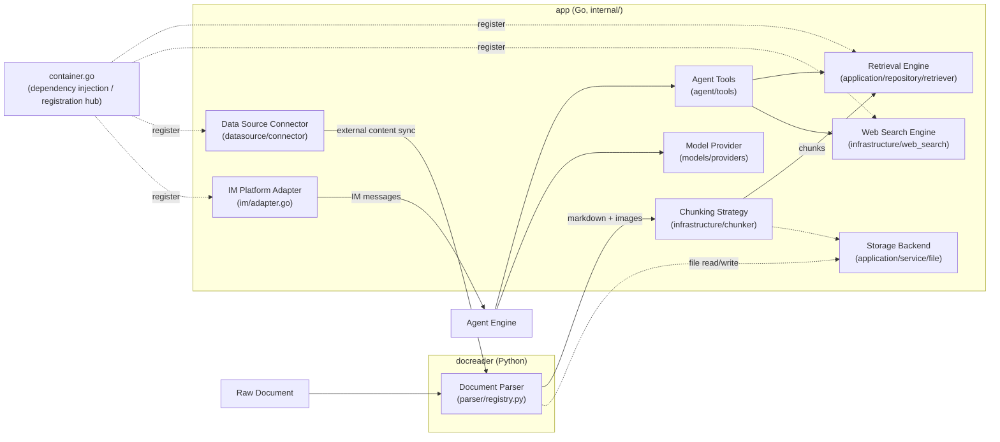

# Extension Points Guide

WeKnora's parsers, chunking strategies, retrieval engines, model providers, search engines, data sources, IM adapters, Agent tools, and storage backends all plug in through interfaces. To add a new implementation, first implement the corresponding interface, then wire it up at the registration entry point, and verify the existing call chain. The sections below list the interface, existing implementations, and integration steps for each extension type.

## Extension Points Overview {#_0-extension-points-overview}



On the Go side, the **registration hub** for most extension points is `internal/container/container.go` (the dependency injection container): retrieval engines via `initRetrieveEngineRegistry()`, web search via `registerWebSearchProviders()`, IM adapters via `registerIMAdapterFactories()`, and data source connectors via `initConnectorRegistry()`.

---

## Adding a New Document Parser (docreader, Python) {#_1-adding-a-new-document-parser-docreader-python}

### Interface Definition

The base class is in `docreader/parser/base_parser.py`. After the lightweight refactor, `BaseParser` is only responsible for converting a document into markdown text + raw image references (chunking, image storage, OCR, and VLM captioning are all handled on the Go side):

```python
# docreader/parser/base_parser.py
class BaseParser(ABC):
    """Base parser interface."""

    def __init__(self, file_name: str = "", file_type: Optional[str] = None, **kwargs):
        self.file_name = file_name
        self.file_type = file_type or os.path.splitext(file_name)[1].lstrip(".")

    @abstractmethod
    def parse_into_text(self, content: bytes) -> Document:
        """Parse document content into markdown text.

        Returns:
            Document with ``content`` (markdown string) and optional
            ``images`` dict mapping storage-relative paths to base64 data.
        """
```

The return value `Document` (`docreader/models/document.py`, a pydantic model) has two core fields: `content: str` (markdown) and `images: Dict[str, str]` (path → base64).

### Registration Mechanism

The `ParserEngineRegistry` in `docreader/parser/registry.py` manages parsers via a two-level mapping of "engine name → {file extension → Parser class}"; when the requested engine doesn't support a given file type, it automatically falls back to the `builtin` engine. The default registry is built by `_build_default_registry()`, and the module-level singleton is `registry = _build_default_registry()`.

```python
# docreader/parser/registry.py (excerpt)
class ParserEngineRegistry:
    def register(self, name: str, file_types: Dict[str, Type[BaseParser]],
                 description: str = "", check_available: Callable = None,
                 unavailable_hint: str = ""): ...
    def get_parser_class(self, engine: str, file_type: str) -> Type[BaseParser]: ...
```

### Existing Implementations

| Engine | Parser | File |
| --- | --- | --- |
| `builtin` | `Docx2Parser` / `DocParser` / `PDFParser` / `MarkdownParser` / `ExcelParser` / `EPUBParser` / `HTMLParser` / `MHTMLParser` / `ImageParser` (jpg/png/gif/bmp/tiff/webp, etc.) | `docreader/parser/docx2_parser.py`, `doc_parser.py`, `pdf_parser.py`, `markdown_parser.py`, `excel_parser.py`, `epub_parser.py`, `html_parser.py`, `mhtml_parser.py`, `image_parser.py` |
| `markitdown` | `MarkitdownParser` (Microsoft MarkItDown, multi-format) | `docreader/parser/markitdown_parser.py` |
| `opendataloader` | `OpenDataLoaderParser` (PDF layout analysis, requires Java 11+, includes `check_available` detection) | `docreader/parser/opendataloader_parser.py` |

### Steps to Add One

1. Create `docreader/parser/my_parser.py`, inheriting from `BaseParser`, implementing `parse_into_text(content: bytes) -> Document`;
2. **Registration point: `docreader/parser/registry.py`** — add to `_build_default_registry()`:

```python
reg.register(
    "my_engine",
    {"myext": MyParser},
    description="My parsing engine",
    check_available=lambda overrides: (True, ""),   # optional: dependency availability check
    unavailable_hint="Hint shown to the user when a dependency is missing",
)
```

3. If you're just swapping in a new implementation for an existing file extension, you can instead simply add a line `"ext": MyParser` to the `builtin` mapping;
4. Add a unittest under `docreader/tests/` (see `test_parser_routing.py` for reference), and verify with `uv run python -m unittest`.

---

## Adding a New Chunking Strategy (internal/infrastructure/chunker) {#_2-adding-a-new-chunking-strategy-internal-infrastructure-chunker}

### Interface Definition

Chunking doesn't use an interface — instead it follows a pattern of **strategy tiers + package-level function-variable overrides**. The public entry point is in `internal/infrastructure/chunker/strategy.go`:

```go
// internal/infrastructure/chunker/strategy.go
// Strategy values for SplitterConfig.Strategy.
const (
    StrategyAuto      = "auto"
    StrategyHeading   = "heading"
    StrategyHeuristic = "heuristic"
    StrategyRecursive = "recursive"
    StrategyLegacy    = "legacy"
)

func Split(text string, cfg SplitterConfig) []Chunk
func SplitWithDiagnostics(text string, cfg SplitterConfig) ([]Chunk, *Diagnostics)
func SplitParentChild(text string, parentCfg, childCfg SplitterConfig) ParentChildResult
```

The config and result types are in `internal/infrastructure/chunker/splitter.go`:

```go
// internal/infrastructure/chunker/splitter.go
type Chunk struct {
    Content       string
    ContextHeader string
    Seq           int
    Start         int
    End           int
}

type SplitterConfig struct {
    ChunkSize    int
    ChunkOverlap int
    Separators   []string
    Strategy     string   // empty = legacy (for backward compatibility)
    TokenLimit   int      // limit chunk size by approximate token count, 0 = use ChunkSize character count
    Languages    []string // multi-language heuristic hint, empty = auto-detect
}
```

Strategy dispatch happens in `runTier()`; the heading and heuristic implementations are overridden via package-level function variables in each file's `init()`:

```go
// internal/infrastructure/chunker/strategy.go
func runTier(tier StrategyTier, text string, cfg SplitterConfig, profile *DocProfile) []Chunk {
    switch tier {
    case TierHeading:
        return splitByHeadings(text, cfg, profile)
    case TierHeuristic:
        return splitByHeuristics(text, cfg, profile)
    case TierLegacy:
        return SplitText(text, cfg)
    }
    return SplitText(text, cfg)
}

var splitByHeadings = func(text string, cfg SplitterConfig, _ *DocProfile) []Chunk {
    return SplitText(text, cfg) // overridden by heading_splitter.go's init()
}
var splitByHeuristics = func(text string, cfg SplitterConfig, _ *DocProfile) []Chunk {
    return SplitText(text, cfg) // overridden by heuristic_splitter.go's init()
}
```

### Existing Implementations

| Strategy Tier | Description | File |
| --- | --- | --- |
| `TierHeading` | Chunks by Markdown heading hierarchy | `internal/infrastructure/chunker/heading_hierarchy.go`, etc. |
| `TierHeuristic` | Multi-language heuristic chunking | `internal/infrastructure/chunker/heuristic_splitter.go` |
| `TierLegacy` (= `recursive`) | Recursive separator-based chunking (original implementation) | `SplitText()` in `internal/infrastructure/chunker/splitter.go` |
| Validator | Every tier's output is checked by `ValidateChunks`; failures fall back down the chain | `internal/infrastructure/chunker/validator.go` |

### Steps to Add One

1. Create `internal/infrastructure/chunker/my_splitter.go`, implementing `func(text string, cfg SplitterConfig, profile *DocProfile) []Chunk`;
2. **Registration point: `internal/infrastructure/chunker/strategy.go`** —
   - Add a strategy constant (e.g. `StrategyMine = "mine"`) and a new `StrategyTier`;
   - In the switch statements of `resolveChain`/`resolveChainWithProfile`, return the tier chain for the new strategy (recommended to fall back to `TierLegacy` as a bottom rung);
   - Add a new case in `runTier()`;
3. No changes are needed on the caller side: the knowledge base's `chunking_config.strategy` (JSONB) is passed in via `buildSplitterConfigFromChunking` in `internal/application/service/knowledge_process.go`;
4. Write unit tests with `SplitWithDiagnostics` to verify tier selection and `ValidateChunks` acceptance behavior.

---

## Adding a New Retrieval Engine {#_3-adding-a-new-retrieval-engine}

### Interface Definition

The interface is in `internal/types/interfaces/retriever.go` (three layers: engine → repository → service + registry):

```go
// internal/types/interfaces/retriever.go
type RetrieveEngine interface {
    EngineType() types.RetrieverEngineType
    Retrieve(ctx context.Context, params types.RetrieveParams) ([]*types.RetrieveResult, error)
    Support() []types.RetrieverType // supported retrieval types (vector/keyword)
}

type RetrieveEngineRepository interface {
    Save(ctx context.Context, indexInfo *types.IndexInfo, params map[string]any) error
    BatchSave(ctx context.Context, indexInfoList []*types.IndexInfo, params map[string]any) error
    EstimateStorageSize(ctx context.Context, indexInfoList []*types.IndexInfo, params map[string]any) int64
    DeleteByChunkIDList(ctx context.Context, indexIDList []string, dimension int, knowledgeType string) error
    DeleteBySourceIDList(ctx context.Context, sourceIDList []string, dimension int, knowledgeType string) error
    CopyIndices(ctx context.Context, sourceKnowledgeBaseID string,
        sourceToTargetKBIDMap map[string]string,
        sourceToTargetChunkIDMap map[string]string,
        targetKnowledgeBaseID string, dimension int, knowledgeType string) error
    DeleteByKnowledgeIDList(ctx context.Context, knowledgeIDList []string, dimension int, knowledgeType string) error
    BatchUpdateChunkEnabledStatus(ctx context.Context, chunkStatusMap map[string]bool) error
    BatchUpdateChunkTagID(ctx context.Context, chunkTagMap map[string]string) error
    RetrieveEngine
}

type RetrieveEngineRegistry interface {
    Register(indexService RetrieveEngineService) error
    GetRetrieveEngineService(engineType types.RetrieverEngineType) (RetrieveEngineService, error)
    GetAllRetrieveEngineServices() []RetrieveEngineService
    GetByStoreID(storeID string) (RetrieveEngineService, error)
}
```

The engine type enumeration is in `internal/types/retriever.go`:

```go
// internal/types/retriever.go
const (
    PostgresRetrieverEngineType        RetrieverEngineType = "postgres"
    ElasticsearchRetrieverEngineType   RetrieverEngineType = "elasticsearch"
    InfinityRetrieverEngineType        RetrieverEngineType = "infinity"
    ElasticFaissRetrieverEngineType    RetrieverEngineType = "elasticfaiss"
    QdrantRetrieverEngineType          RetrieverEngineType = "qdrant"
    MilvusRetrieverEngineType          RetrieverEngineType = "milvus"
    WeaviateRetrieverEngineType        RetrieverEngineType = "weaviate"
    DorisRetrieverEngineType           RetrieverEngineType = "doris"
    SQLiteRetrieverEngineType          RetrieverEngineType = "sqlite"
    TencentVectorDBRetrieverEngineType RetrieverEngineType = "tencent_vectordb"
    OpenSearchRetrieverEngineType      RetrieverEngineType = "opensearch"
)
```

### Existing Implementations

All under `internal/application/repository/retriever/`: `postgres/` (pgvector + BM25/ParadeDB), `elasticsearch/v7/`, `elasticsearch/v8/`, `qdrant/`, `milvus/`, `weaviate/`, `doris/`, `sqlite/` (sqlite-vec + FTS5), `tencentvectordb/`, `opensearch/`.

### Steps to Add One

1. Add a `RetrieverEngineType` constant in `internal/types/retriever.go`;
2. Create a new package under `internal/application/repository/retriever/myengine/`, implementing the `RetrieveEngineRepository` interface (you can reference `qdrant/` or `sqlite/`);
3. **Registration point: `initRetrieveEngineRegistry()` in `internal/container/container.go`** — conditionally register based on the `RETRIEVE_DRIVER` environment variable (comma-separated):

```go
// internal/container/container.go (excerpt)
retrieveDriver := strings.Split(os.Getenv("RETRIEVE_DRIVER"), ",")
if slices.Contains(retrieveDriver, "postgres") {
    postgresRepo := postgresRepo.NewPostgresRetrieveEngineRepository(db)
    if err := registry.Register(
        retriever.NewKVHybridRetrieveEngine(postgresRepo, types.PostgresRetrieverEngineType),
    ); err != nil { ... }
}
```

   Follow this example to add a branch for your new engine, wrapping it with `retriever.NewKVHybridRetrieveEngine(repo, engineType)` before registering;
   To reuse existing vectors when moving documents between knowledge bases, also implement the optional `KnowledgeIndexMover` interface (`MoveKnowledgeIndices`: keeps chunk IDs and vectors, changes only the owning knowledge base, and is safe to retry); without it, moves that reuse vectors are rejected and only the re-parse mode can be used;
4. If the engine requires an independent deployment, add a profile-gated service in `docker-compose.dev.yml` (reference `qdrant`/`opensearch`), and add the corresponding connection variables in `.env.example`.

---

## Adding a New Model Provider (internal/models/providers) {#_4-adding-a-new-model-provider-internal-models-provider}

Model integration is split into four layers: protocol, provider, catalog, and runtime (see [Model Management](../03-features/06-models.md#layered-structure) for an overview). Most new providers only need a new provider definition plus model catalog entries, reusing an existing protocol.

### Interface Definition

A provider definition is a struct rather than an interface implementation, located in `internal/models/providers/definition.go`:

```go
// internal/models/providers/definition.go (excerpt)
type Definition struct {
    ID           string            // stable identifier stored in models.parameters.provider
    Name         string
    Names        map[string]string // per-language names, e.g. "zh-CN"
    Website      string
    Icon         []byte            // SVG
    API          api.API           // default chat protocol
    RerankAPI    api.RerankAPI     // defaults to cohere-rerank when not declared
    EmbeddingAPI api.EmbeddingAPI  // defaults to openai-embeddings when not declared
    TranscriptionAPI api.TranscriptionAPI // defaults to openai-transcriptions when not declared
    DefaultBaseURLs  map[types.ModelType]string
    ModelTypes       []types.ModelType
    RequiresAuth     bool
    Auth             AuthStyle          // bearer / api-key / x-api-key / x-goog-api-key / none / signed
    URLPatterns      []string           // identifies legacy rows with no provider by their URL
    ExtraFields      []ExtraField       // extra fields rendered dynamically by the editor
    CredentialLabels []CredentialLabel  // renames credential input boxes (signed APIs)
    Compat           VendorCompat       // provider-level compatibility defaults for each protocol
    ThinkingLevels   api.ThinkingLevelMap
    Order            int                // ordering in the provider list
    // optional hooks
    Endpoint  func(req EndpointRequest) (url string, query map[string]string)
    PreferAPI func(baseURL string, spec models.ModelSpec) api.API
    Signer    func(creds api.Credentials) api.AuthFunc
}
```

The protocol layer has one minimal interface per capability; a new protocol plugs in by implementing it:

```go
// internal/models/api/rerank.go
type Reranker interface {
    Rerank(ctx context.Context, query string, documents []string) ([]RerankResult, error)
}

// internal/models/api/embeddings.go
type Embedder interface {
    Embed(ctx context.Context, texts []string, kind EmbedInputType) ([][]float32, error)
}

// internal/models/api/transcriptions.go
type Transcriber interface {
    Transcribe(ctx context.Context, req TranscriptionRequest) (*Transcription, error)
}
```

Chat protocol clients implement the `Chat` interface of `internal/models/chat` (`Chat` / `ChatStream` / `GetModelName` / `GetModelID`).

### Existing Implementations

- **Providers**: 27 files under `internal/models/providers/`, one per provider (`aliyun.go`, `deepseek.go`, `generic.go`, `weknoracloud.go`, etc.), explicitly listed by `Builtins()` in `builtin.go`; icons live in `providers/assets/<id>.svg`.
- **Protocols**: `internal/models/api/<protocol>`. Chat: `openaicompletions`, `openairesponses`, `anthropicmessages`, `googlegenai`; embeddings: `openaiembeddings`, `dashscopeembeddings`, `arkembeddings`, `googleembeddings`; rerank: `cohererank`, `dashscoperank`, `nimrerank`, `tencentlkeap`, `volcengineknowledge`; speech: `openaitranscriptions`, `openaichataudio`.
- **Model catalog**: `internal/models/catalog/data/seed.json` (model metadata) + `overrides.json` (protocol, thinking mapping, and compat fixes) → a script generates `models.generated.json`, which is embedded at compile time.
- **Runtime**: `internal/models/runtime` combines the provider definitions and the catalog (`New()`), applies the deployment overlay `config/models.json`, and resolves the protocol, endpoint, and compatibility settings for each model row.

### Steps to Add One

1. **Create the provider definition**: `internal/models/providers/<id>.go`, declaring the name, supported model types, the default URL for each type, the auth style, protocol defaults, and any special endpoint hooks, and cite the official documentation it is based on in the package comment;
2. **Registration point one: `internal/models/providers/builtin.go`** — add `new<Id>Provider()` to `Builtins()`; put the icon in `providers/assets/<id>.svg`;
3. **Registration point two: the model catalog** — add an entry for the provider in `internal/models/catalog/data/seed.json` (it needs an empty list even if there are no models yet, because the runtime reads the catalog by provider ID) and maintain the model metadata there; protocol, thinking mapping, and compat fixes go in `overrides.json`. Model keys include the type and id / match, so chat and embedding models with the same name can coexist;
4. **Generate the catalog**: run `make model-catalog-generate`. Do not edit generated files by hand;
5. **New protocol (optional)**: reuse an existing protocol whenever it covers the case; if a new protocol is truly needed, add an `internal/models/api/<protocol>` package and wire it into the protocol branch of the corresponding factory (chat: `NewRemoteChat` in `internal/models/chat/chat.go`; embeddings: `internal/models/embedding/protocol.go`; rerank: `internal/models/rerank/reranker.go`; speech: `internal/models/asr/protocol.go`);
6. **Validate**: run `make model-catalog-check`.

`make model-catalog-check` first checks whether the generated data is stale, then runs all tests under `internal/models/...`: registration and icon checks in `providers`; resolution and overlays in `runtime`; the **invariants** in the `parity` package (field validity of each model entry, decodable compat key names, consistency between context and max output) and **per-model outbound request checks** (each chat model may emit only one output-limit field with thinking both on and off; models that do not support sampling parameters must not carry temperature; always-thinking models must not receive an off switch, etc.). When a new provider or model violates these rules, the tests fail directly, with no need to write separate test cases.

No frontend changes are needed: the provider dropdown, icons, extra fields, and model catalog are all rendered dynamically from `GET /api/v1/models/providers`. Out-of-the-box built-in model rows are declared by operators in `config/builtin_models.yaml` and are unrelated to provider definitions.

### Maintaining Existing Providers

**Adding or adjusting model metadata** (new model ids, context windows, pricing): first generate a diff report, then update `seed.json` against the provider's documentation, and finally regenerate the catalog.

```bash
make model-catalog-diff                 # all providers
make model-catalog-diff VENDOR=deepseek # a single provider
```

The report compares against the public metadata from [models.dev](https://models.dev/api.json): `+` marks models that upstream has but the catalog lacks, `~` marks numeric differences, and `?` marks entries upstream does not include (common for Chinese providers and aliases, and not necessarily an error). The script only reads and never writes, and it is never called at runtime. Behavioral facts such as field names and thinking formats are not synced automatically and must be maintained by hand based on the provider's documentation.

**A provider changed its API behavior** (switched the output-limit field, added new effort values, changed the thinking switch format): change `Compat` in `providers/<id>.go`, or the `compat` of the corresponding model in `overrides.json`, regenerate the catalog, and update the documentation links in the comments as well. Snapshot tests such as `internal/models/api/openaicompletions/golden_test.go` pin the outbound JSON, so update the test expectations first when making changes.

**Emergency fixes**: you don't have to wait for a release — first make the change on the deployment side with the [deployment overlay `config/models.json`](../03-features/06-models.md#deployment-overlay-config-models-json), then port it back into the code once verified.

---

## Adding a New Web Search Engine (internal/infrastructure/web_search) {#_5-adding-a-new-web-search-engine-internal-infrastructure-web-search}

### Interface Definition

```go
// internal/types/interfaces/web_search.go
type WebSearchProvider interface {
    // Name returns the name of the provider
    Name() string
    // Search performs a web search
    Search(ctx context.Context, query string, maxResults int, includeDate bool) ([]*types.WebSearchResult, error)
}
```

The registry is a factory map (instantiated on demand with tenant parameters):

```go
// internal/infrastructure/web_search/registry.go
type ProviderFactory func(params types.WebSearchProviderParameters) (interfaces.WebSearchProvider, error)

type Registry struct {
    factories map[string]ProviderFactory
    mu        sync.RWMutex
}

func (r *Registry) Register(id string, factory ProviderFactory)
func (r *Registry) CreateProvider(providerType string, params types.WebSearchProviderParameters) (interfaces.WebSearchProvider, error)
```

Engines that support filtering by region or recency can additionally implement the optional `FilteredWebSearchProvider` interface (`SearchWithFilters`); engines that do not support filtering must not silently drop the filters the caller requested.

### Existing Implementations

Under `internal/infrastructure/web_search/`: `duckduckgo.go`, `google.go`, `bing.go`, `brave.go`, `tavily.go`, `ollama.go`, `baidu.go`, `searxng.go`, `keenable.go`, `zhipu.go`, `exa.go`, `metaso.go`, `bocha.go`, `serply.go` (plus `proxy.go` for outbound proxy support). Type constants are in `internal/types/web_search_provider.go` (`WebSearchProviderTypeXxx`, mapping one-to-one to the registration IDs).

### Steps to Add One

1. Add a `WebSearchProviderType` constant in `internal/types/web_search_provider.go`;
2. Create `internal/infrastructure/web_search/mysearch.go`, implementing `WebSearchProvider` and exposing a factory `func NewMySearchProvider(params types.WebSearchProviderParameters) (interfaces.WebSearchProvider, error)`;
3. **Registration point: `registerWebSearchProviders()` in `internal/container/container.go`**:

```go
func registerWebSearchProviders(registry *infra_web_search.Registry) {
    registry.Register("duckduckgo", infra_web_search.NewDuckDuckGoProvider)
    registry.Register("google", infra_web_search.NewGoogleProvider)
    // ... add here:
    registry.Register("mysearch", infra_web_search.NewMySearchProvider)
}
```

4. If the new engine needs to appear in the frontend's provider dropdown and parameter form, update the corresponding config page components under `frontend/`; tenant configuration is persisted in the `web_search_providers` table.

---

## Adding a New Data Source Connector (internal/datasource/connector) {#_6-adding-a-new-data-source-connector-internal-datasource-connector}

> The directory includes an implementation guide, `internal/datasource/CONNECTOR_IMPLEMENTATION_GUIDE.md`, which you can read alongside this section.

### Interface Definition

```go
// internal/datasource/connector.go
type Connector interface {
    // Type returns the connector type identifier (e.g., "feishu", "notion")
    Type() string

    // Validate verifies that the provided configuration is valid by testing
    // connectivity and checking credentials.
    Validate(ctx context.Context, config *types.DataSourceConfig) error

    // ListResources lists available resources that can be synced.
    // parentID supports lazy-loading of hierarchical resources: "" returns the top level, non-empty returns the direct children of that resource.
    ListResources(ctx context.Context, config *types.DataSourceConfig, parentID string) ([]types.Resource, error)

    // ResolveResourceAncestors resolves the ancestor chain for existing selected items in a lazy-loaded tree (O(depth)).
    ResolveResourceAncestors(
        ctx context.Context, config *types.DataSourceConfig, resourceIDs []string,
    ) ([]string, error)

    // FetchAll performs a full sync of the specified resources.
    FetchAll(ctx context.Context, config *types.DataSourceConfig, resourceIDs []string) ([]types.FetchedItem, error)

    // FetchIncremental performs an incremental sync based on the provided cursor.
    FetchIncremental(ctx context.Context, config *types.DataSourceConfig, cursor *types.SyncCursor) ([]types.FetchedItem, *types.SyncCursor, error)
}
```

An optional streaming interface (for paginated checkpointing with large data volumes, keeping only a single item in memory at a time):

```go
// internal/datasource/connector.go
type StreamHandler interface {
    Emit(ctx context.Context, item types.FetchedItem) error
    Checkpoint(ctx context.Context, cursor *types.SyncCursor) error
}

type StreamingConnector interface {
    Connector
    FetchStream(ctx context.Context, config *types.DataSourceConfig,
        cursor *types.SyncCursor, h StreamHandler) (*types.SyncCursor, error)
}
```

Two more optional interfaces let full syncs still reconcile deletions: `FullStreamingConnector` (`FetchFullStream`) and `FullSyncWithCursor` (`FetchAllFromCursor`). On a forced full sync or with `sync_mode=full`, they re-fetch all items while keeping the previous cursor to identify deleted documents. Without them, full syncs cannot produce deletion events.

The registry is in the same file: `ConnectorRegistry` (`NewConnectorRegistry()` / `Register(connector)` / `Get(type)` / `List()`); the connector's UI metadata (name, AuthType, capabilities) lives in the `ConnectorMetadataRegistry` map in the same file.

### Existing Implementations

| Type | Directory | Description |
| --- | --- | --- |
| `feishu` / `lark` | `internal/datasource/connector/feishu/wiki/` | Feishu / Lark wiki; the same implementation distinguishes the region |
| `feishu_drive` / `lark_drive` | `internal/datasource/connector/feishu/drive/` | Feishu / Lark Drive |
| `notion` | `internal/datasource/connector/notion/` | Pages and databases |
| `confluence` | `internal/datasource/connector/confluence/` | Confluence |
| `yuque` | `internal/datasource/connector/yuque/` | Yuque |
| `dingtalk` | `internal/datasource/connector/dingtalk/` | DingTalk Docs |
| `ima` | `internal/datasource/connector/ima/` | Tencent ima knowledge base |
| `rss` | `internal/datasource/connector/rss/` | RSS feeds |
| `gitlab` | `internal/datasource/connector/gitlab/` | GitLab repositories |

`internal/types/datasource.go` also contains type constants such as `github` and `google_drive` that have no registered implementation yet.

### Steps to Add One

1. Create a new package under `internal/datasource/connector/mysource/`, implementing `Connector` (for large data volumes, it's recommended to also implement `StreamingConnector`), and provide `NewConnector()`;
2. **Registration point one: `initConnectorRegistry()` in `internal/container/container.go`**:

```go
if err := registry.Register(mysourceConnector.NewConnector()); err != nil {
    errs = errors.Join(errs, fmt.Errorf("register mysource connector: %w", err))
}
```

3. **Registration point two: `ConnectorMetadataRegistry` in `internal/datasource/connector.go`** — add a type constant (`ConnectorTypeXxx` in `internal/types`) and a metadata entry (Name/Description/AuthType/Capabilities);
4. Sync the config structure: if `types.DataSourceConfig` needs new credential fields, mind the encrypted-storage conventions; the frontend's data source onboarding page renders based on the metadata;
5. Reuse the shared utilities in `internal/datasource`: user-supplied API URLs first go through `ValidateConnectorBaseURL` for SSRF validation, HTTP requests use `NewConnectorHTTPClient` (with SSRF protection on redirects and at dial time), and generated file names use `SanitizeFileName`.

---

## Adding a New IM Platform Adapter (internal/im) {#_7-adding-a-new-im-platform-adapter-internal-im}

### Interface Definition

```go
// internal/im/adapter.go
type Platform string // "wecom" / "feishu" / "lark" / "slack" / "telegram" / "dingtalk" /
                     // "mattermost" / "wechat" / "qqbot" / "yunzhijia"

// Adapter is the interface every IM platform must implement.
type Adapter interface {
    // Platform returns the platform identifier.
    Platform() Platform

    // VerifyCallback verifies the signature/token of an incoming callback request.
    VerifyCallback(c *gin.Context) error

    // ParseCallback parses the raw IM callback request into a unified IncomingMessage.
    // Returns nil message for non-message events (e.g., URL verification).
    ParseCallback(c *gin.Context) (*IncomingMessage, error)

    // SendReply sends a reply back to the IM platform.
    SendReply(ctx context.Context, incoming *IncomingMessage, reply *ReplyMessage) error

    // HandleURLVerification handles the initial URL verification challenge.
    HandleURLVerification(c *gin.Context) bool
}
```

Two optional capability interfaces:

```go
// internal/im/adapter.go
// StreamSender: once implemented, the IM service pushes real-time streaming replies (e.g. Feishu streaming cards, Telegram message editing)
type StreamSender interface {
    StartStream(ctx context.Context, incoming *IncomingMessage) (string, error)
    UpdateStreamContent(ctx context.Context, incoming *IncomingMessage, streamID string, fullContent string) error
    FinalizeStream(ctx context.Context, incoming *IncomingMessage, streamID string, finalContent string) error
    EndStream(ctx context.Context, incoming *IncomingMessage, streamID string) error
}

// FileDownloader: once implemented, channels configured with a knowledge_base_id will ingest file messages into the knowledge base
type FileDownloader interface {
    DownloadFile(ctx context.Context, msg *IncomingMessage) (io.ReadCloser, string, error)
}
```

Adapters are instantiated per channel by a factory (`internal/im/service.go`):

```go
// internal/im/service.go
type AdapterFactory func(ctx context.Context, channel *IMChannel,
    msgHandler func(ctx context.Context, msg *IncomingMessage) error,
) (Adapter, context.CancelFunc, error)

func (s *Service) RegisterAdapterFactory(platform string, factory AdapterFactory)
```

### Existing Implementations

Under `internal/im/`, one subpackage per platform: `wecom/`, `feishu/` (also reused for lark, via `feishu.NewFactory(RegionLark)`), `slack/`, `telegram/`, `dingtalk/`, `mattermost/`, `wechat/`, `qqbot/`, `yunzhijia/`.

### Steps to Add One

1. Add a `Platform` constant in `internal/im/adapter.go`;
2. Create `internal/im/myplatform/`, implementing `Adapter` (adding `StreamSender`/`FileDownloader` as needed) and `NewFactory() im.AdapterFactory`;
3. **Registration point: `registerIMAdapterFactories()` in `internal/container/container.go`**:

```go
func registerIMAdapterFactories(imService *imPkg.Service) {
    imService.RegisterAdapterFactory("wecom", wecom.NewFactory())
    // ... add here:
    imService.RegisterAdapterFactory("myplatform", myplatform.NewFactory())
    if err := imService.LoadAndStartChannels(); err != nil { ... }
}
```

4. Channel configuration is persisted in the `im_channels` table, with session mappings in `im_channel_sessions`; the frontend's channel management page needs a configuration form added for the new platform.

---

## Adding a New Agent Tool (internal/agent/tools) {#_8-adding-a-new-agent-tool-internal-agent-tools}

### Interface Definition

The tool interface is defined in `internal/types/agent.go`:

```go
// internal/types/agent.go
type Tool interface {
    // Name returns the unique identifier for this tool
    Name() string

    // Description returns a human-readable description of what the tool does
    Description() string

    // Parameters returns the JSON Schema for the tool's parameters
    Parameters() json.RawMessage

    // Execute runs the tool with the given arguments
    Execute(ctx context.Context, args json.RawMessage) (*ToolResult, error)
}
```

The runtime registry is in `internal/agent/tools/registry.go`:

```go
// internal/agent/tools/registry.go
type ToolRegistry struct {
    tools             map[string]types.Tool
    maxToolOutputSize int
}

// RegisterTool adds a tool to the registry.
// Same-named tools are first-wins, to prevent name-collision hijacking (GHSA-67q9-58vj-32qx).
func (r *ToolRegistry) RegisterTool(tool types.Tool)
func (r *ToolRegistry) GetTool(name string) (types.Tool, error)
func (r *ToolRegistry) ListTools() []string
```

### Existing Implementations

Tool name constants are centralized in `internal/agent/tools/definitions.go`: `thinking`, `todo_write`, the knowledge retrieval tools (`search_knowledge`, `read_document`, `list_documents`, `query_knowledge_graph`), `database_query`, `data_analysis`, `data_schema`, `web_search`, `web_fetch`, the on-demand MCP tools (`discover_mcp_tools`, `call_mcp_tool`), the sandbox/skill tools (`shell_exec`, `read_file`, `list_sandbox_files`, `write_sandbox_file`, `edit_sandbox_file`, `write_skill_file`, `edit_skill_file`), the memory tools (`search_memory`, `search_conversations`), and the wiki tools (`wiki_read_page`, `wiki_write_page`, `wiki_replace_text`, `wiki_rename_page`, `wiki_delete_page`, `wiki_search`, `wiki_flag_issue`, `wiki_read_issue`, `wiki_update_issue`); the local browser tool `local_browser` is implemented in `browserskill*.go`. Implementation files mostly share their tool's name (e.g. `search_knowledge.go`, `read_document.go`, `list_documents.go`, `data_analysis.go`; `mcp_tool.go` / `mcp_catalog.go` handle on-demand discovery and invocation of an MCP service's remote tools).

Retired sandbox tool names (`execute_skill_script`, `read_skill`, `read_sandbox_file`) are kept only for decoding historical records and are no longer registered; retired retrieval tool names (`knowledge_search`, `grep_chunks`, `list_knowledge_chunks`, `get_document_info`, `wiki_read_source_doc`) are still kept as `LegacyTool*` constants: `legacyToolSuccessors` maps them to `search_knowledge` / `read_document`, `NormalizeAllowedTools` automatically rewrites the old names in saved Agent configurations when tools are registered, and `SuccessorToolName` / `IsLegacyRetrievalTool` let other services identify them. When renaming or merging tools, follow this mechanism instead of doing a data migration.

### Steps to Add One

1. Create `internal/agent/tools/my_tool.go`, implementing the four `types.Tool` methods (`Parameters()` returns a JSON Schema; note the OpenAI limit of ≤ 64 characters for tool names, see `maxFunctionNameLength` in `definitions.go`);
2. **Registration point one: `internal/agent/tools/definitions.go`** — add a `ToolMyTool = "my_tool"` constant, and add the tool to `AvailableToolDefinitions()` (the UI's list of selectable tools; the comment there explicitly requires it to stay in sync with registered tools);
3. **Registration point two: the Agent engine's tool assembly logic** — add the construction of the new tool into the service logic that builds the `ToolRegistry` (Agent session initialization, which instantiates and `RegisterTool`s tools based on the Agent's configured allow-list); if resource cleanup is needed, implement `Cleanup` (`types.Cleanable`);
4. For tools with large output volumes, be aware of `ToolRegistry`'s `maxToolOutputSize` truncation behavior; write a `_test.go` for the tool (there are plenty of references in the same directory, e.g. `search_knowledge_test.go`, `scope_authorization_test.go`).

---

## Adding a New Storage Backend (Object Storage) {#_9-adding-a-new-storage-backend-object-storage}

### Interface Definition

The file service interface is in `internal/types/interfaces/file.go`:

```go
// internal/types/interfaces/file.go
type FileService interface {
    CheckConnectivity(ctx context.Context) error
    SaveFile(ctx context.Context, file *multipart.FileHeader, tenantID uint64, knowledgeID string) (string, error)
    SaveBytes(ctx context.Context, data []byte, tenantID uint64, fileName string, temp bool) (string, error)
    GetFile(ctx context.Context, filePath string) (io.ReadCloser, error)
    GetFileURL(ctx context.Context, filePath string) (string, error)
    DeleteFile(ctx context.Context, filePath string) error
    CopyFile(ctx context.Context, srcPath string, tenantID uint64, knowledgeID string) (string, error)
}
```

Multi-backend resolution (tenant-level `storage_backends` table config → `FileService` instance) goes through `internal/types/interfaces/storagebackend.go`:

```go
// internal/types/interfaces/storagebackend.go
type StorageBackendService interface {
    Create(ctx context.Context, backend *types.StorageBackend) error
    Update(ctx context.Context, backend *types.StorageBackend) error
    Delete(ctx context.Context, tenantID uint64, id string) error
    SetDefault(ctx context.Context, tenantID uint64, id string) error
    Test(ctx context.Context, backend *types.StorageBackend) error
}

type StorageBackendResolver interface {
    ResolveFileService(ctx context.Context, tenant *types.Tenant, backendID, provider, localBaseDir string) (FileService, string, error)
    ResolveBackend(ctx context.Context, tenant *types.Tenant, backendID, provider string) (*types.StorageBackend, error)
}
```

### Existing Implementations

All under `internal/application/service/file/`:

| provider | File | Description |
| --- | --- | --- |
| `local` | `local.go` | Local filesystem |
| `minio` | `minio.go` | MinIO / S3-compatible |
| `cos` | `cos.go` | Tencent Cloud COS |
| `tos` | `tos.go` | Volcengine TOS |
| `s3` | `s3.go` | AWS S3 and compatible services |
| `obs` | `obs.go` | Huawei Cloud OBS |
| `oss` | `oss.go` | Alibaba Cloud OSS |
| `ks3` | `ks3.go` | Kingsoft Cloud KS3 |

### Steps to Add One

1. Create `internal/application/service/file/mystore.go`, implementing all `FileService` methods (`CheckConnectivity` is used for the frontend's "Test Connection" button, i.e. `StorageBackendService.Test`);
2. **Registration point: the `NewFileServiceFromStorageConfig()` switch statement in `internal/application/service/file/factory.go`** — add a case to the provider switch:

```go
switch p {
case "local":  // NewLocalFileService(...)
case "minio":  // NewMinioFileService(...)
// ... add here:
case "mystore":
    return NewMyStoreFileService(cfg), p, nil
default:
    return nil, p, fmt.Errorf("unsupported storage provider: %s", p)
}
```

3. If the new provider needs new config fields (endpoint/bucket/region, etc.), extend `StorageEngineConfig` / `StorageBackend.config` (JSONB) in `internal/types`;
4. Add a form for the corresponding provider on the frontend's storage backend management page; tenant configuration lives in the `storage_backends` table (the `provider` column is the switch key).

---

## Appendix: Extension Points Quick Reference

| Extension Point | Core Interface | Interface File | Registration Point |
| --- | --- | --- | --- |
| Document Parser | `BaseParser.parse_into_text` | `docreader/parser/base_parser.py` | `docreader/parser/registry.py` `_build_default_registry()` |
| Chunking Strategy | tier function `func(text, cfg, profile) []Chunk` | `internal/infrastructure/chunker/strategy.go` | Same file's `runTier()` + strategy constants |
| Retrieval Engine | `RetrieveEngineRepository` | `internal/types/interfaces/retriever.go` | `container.go` `initRetrieveEngineRegistry()` (gated by `RETRIEVE_DRIVER`) |
| Model Provider | `providers.Definition` (+ protocol-layer `Reranker` / `Embedder` / `Transcriber`, `chat.Chat`) | `internal/models/providers/definition.go` | `internal/models/providers/builtin.go` `Builtins()` + `internal/models/catalog/data/seed.json` |
| Web Search | `WebSearchProvider` | `internal/types/interfaces/web_search.go` | `container.go` `registerWebSearchProviders()` |
| Data Source Connector | `Connector` / `StreamingConnector` | `internal/datasource/connector.go` | `container.go` `initConnectorRegistry()` + `ConnectorMetadataRegistry` |
| IM Adapter | `Adapter` (+`StreamSender`/`FileDownloader`) | `internal/im/adapter.go` | `container.go` `registerIMAdapterFactories()` |
| Agent Tool | `types.Tool` | `internal/types/agent.go` | `internal/agent/tools/definitions.go` + `ToolRegistry.RegisterTool` |
| Storage Backend | `FileService` | `internal/types/interfaces/file.go` | `internal/application/service/file/factory.go` switch |
