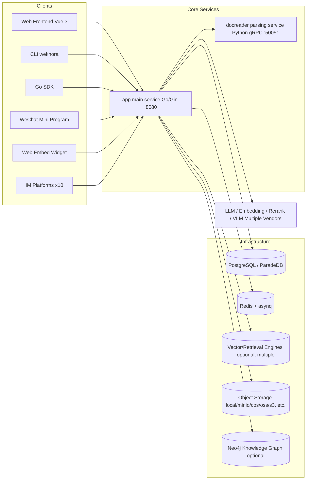

Vou traduzir agora. Documento grande, formatação markdown mantida.

---

# WeKnora Documentation

WeKnora is Tencent's open-source enterprise-grade knowledge base and RAG (Retrieval-Augmented Generation) system: a Go monolithic backend + Vue 3 frontend + Python document parsing microservice (docreader), supporting multi-tenancy, multiple knowledge bases, hybrid retrieval, Agent capabilities, knowledge graphs, Wiki generation, MCP integration, multi-platform IM access, and web embedding, among other capabilities.

This directory is the official WeKnora documentation, organized into six parts: "Getting Started → Architecture → Features → API → Clients → Development."

## Documentation Site

This directory is also a VitePress site — Markdown files become pages, and new files are automatically added to the sidebar (the title is taken from the first-level heading in the body, and the directory order follows the numeric prefix in the filename).

```bash
npm install
npm run dev      # local preview
npm run build    # output to .vitepress/dist
npm run preview  # preview the build output
```

The theme is located in `.vitepress/theme/`: `style.css` is the single source of truth for typography and colors, and `Landing.vue` is the homepage.

## Writing Conventions

- **Explain how to use it first, then how it's implemented.** Each feature document should begin by answering "what problem does this solve, and how is it used in the UI," before moving on to the data model, workflow, and source code details; source code references are consolidated in an "Implementation Reference" section at the end.
- **User-facing sections** (01 Getting Started, 03 Feature Modules, 05 Clients) are organized around tasks; **developer-facing sections** (02 Architecture, 04 API, 06 Development Guide) are organized around structure and can dive directly into details.
- Wherever UI operations are involved, include screenshots referenced via the `<Screenshot>` component (see the section below).

## Screenshots

Screenshots are referenced using the global `<Screenshot>` component, with images placed under `public/screenshots/`:

```md
<Screenshot
  src="/screenshots/kb-document-list.png"
  caption="Knowledge base document list: parsing status, tags, and batch operations"
  hint="Shows the document list page, including the parsing status column, tags column, top filter bar, and the batch operations bar that appears after selection." />
```

When the image file doesn't exist, the component renders as a dashed placeholder box with a caption, indicating the expected file path and what the image should show. Simply place a same-named image file into `website-docs/public/screenshots/` for it to take effect automatically — **no need to modify the Markdown**.

There are currently 31 screenshots pending:

| Filename (placed under `public/screenshots/`) | Appears in | Should show |
| --- | --- | --- |
| `introduction-overview.png` | Product Introduction | Full view of the main interface after login |
| `quickstart-register.png` | Quick Start | Registration page |
| `quickstart-init-wizard.png` | Quick Start | Model configuration in the initialization wizard |
| `quickstart-upload.png` | Quick Start | Upload confirmation dialog |
| `quickstart-document-list.png` | Quick Start | List of documents that have finished parsing |
| `quickstart-chat.png` | Quick Start | A round of Q&A with citations |
| `settings-members.png` | Tenant & Auth | Space members and invitations |
| `settings-system-admin.png` | Platform Administration | Platform console (system administrator-only section) |
| `kb-document-list.png` | Knowledge Base | Document list and batch operations bar |
| `kb-settings.png` | Knowledge Base | Chunking parameters and indexing strategy toggles |
| `kb-chunk-edit.png` | Knowledge Base | Chunk editing and version history |
| `kb-batch-tag.png` | Knowledge Base | Batch tagging dialog |
| `kb-activity.png` | Knowledge Base | Activity stream records |
| `kb-folder-tree.png` | Knowledge Base | Folder tree in the document list |
| `settings-models.png` | Model Management | Model list and add-model form |
| `agent-editor.png` | Agent Engine | Custom Agent configuration dialog |
| `agent-chat.png` | Agent Engine | Agent reasoning process timeline |
| `mcp-services.png` | MCP Integration | MCP service configuration and tool list |
| `kg-graph.png` | Knowledge Graph | Entity-relationship graph |
| `datasource-sync.png` | Data Source Import | Data source list and sync status |
| `im-channels.png` | IM Integration | IM channel configuration |
| `embed-channel.png` | Web Embedding | Channel configuration and widget appearance |
| `wiki-browser.png` | Wiki Capabilities | Wiki browser directory and pages |
| `wiki-graph.png` | Wiki Capabilities | Wiki graph view |
| `wiki-revision-history.png` | Wiki Capabilities | Page revision history and rollback |
| `chat-references-drawer.png` | Conversation Experience | Answer, citation markers, and citation panel |
| `settings-storage-backends.png` | Storage Backends | Multi-instance list and connectivity test |
| `chrome-extension.png` | Chrome Extension | Web sidebar Q&A and clipping |
| `faq-management.png` | FAQ Capabilities | FAQ entry list and import |
| `queue-dashboard.png` | Observability | Runtime task queue panel |
| `observability-langfuse.png` | Observability | A complete call trace in Langfuse |

The repository's `docs/images/` directory already contains a set of ready-made product screenshots (`qa.png`, `knowledgebases.png`, `wiki-browser.png`, `wiki-graph.png`, `settings.png`, `agent-qa.png`, `graph1-3.png`, `langfuse.png`, `rbac-*.png`, etc.) — when filling in screenshots, check first whether these can be reused directly.

## Suggested Reading Paths

- **First-time use**: Reading the four articles in 01 Getting Started in order is enough to complete deployment and your first Q&A session.
- **Evaluation / understanding the design**: The five articles in 02 Architecture give a full picture of the system and its two core pipelines (document ingestion, retrieval Q&A).
- **Using a specific feature**: Go directly to the corresponding section in 03 Feature Modules.
- **Integrating with the API / writing an integration**: 04 API Reference + 05 Clients (CLI / Go SDK).
- **Extending / contributing code**: 06 Development Guide, especially the extension points guide.

## Table of Contents

### 01 Getting Started

| Document | Content |
| --- | --- |
| [Product Introduction](01-getting-started/01-introduction.md) | What WeKnora is, core concepts (tenant/knowledge base/knowledge/chunk/session/Agent, etc.), feature overview, and system component diagram |
| [Installation & Deployment](01-getting-started/02-installation.md) | docker-compose (including 12 optional profiles), development mode, Helm, Lite single-binary and desktop app, Homebrew |
| [Quick Start](01-getting-started/03-quickstart.md) | The full path from register → initialization wizard → configure models → create a knowledge base → upload → Q&A, with a runnable curl walkthrough |
| [Configuration Reference](01-getting-started/04-configuration.md) | All config.yaml fields, ~150 environment variables, prompt templates, built-in models, and built-in Agent configuration |

### 02 Architecture

| Document | Content |
| --- | --- |
| [Overall Architecture](02-architecture/01-overview.md) | Component composition, tech stack, inter-process communication, top-level directory tour |
| [Go Backend Design](02-architecture/02-backend-design.md) | Four-layer architecture, uber/dig dependency injection, startup and graceful shutdown, routing and middleware, domain model ER diagram |
| [Document Ingestion Pipeline](02-architecture/03-document-pipeline.md) | The full chain from upload/URL/manual creation → storage → parsing → chunking → vectorization → indexing → post-processing, and its state machine |
| [Retrieval & Q&A Pipeline](02-architecture/04-rag-pipeline.md) | The chat_pipeline plugin pipeline, cross-knowledge-base retrieval and fusion, reranking, streaming output (SSE), and citation generation |
| [Async Task System](02-architecture/05-async-tasks.md) | asynq queue topology, 6 worker pools, Lite synchronous mode, dead-letter handling and task inspection, event bus |

### 03 Feature Modules

| Document | Content |
| --- | --- |
| [Tenants, Users & Auth/Authorization](03-features/01-tenant-auth.md) | Multi-tenant model, JWT / API Key / OIDC, RBAC role matrix, organizations and shared spaces |
| [Knowledge Base & Knowledge Management](03-features/02-knowledge-base.md) | Knowledge base types and all configurable options, tree-structured folders, multi-tag and batch tagging, chunk editing and version history, custom metadata, preview security, copy and move, activity stream, quotas |
| [Document Parsing Service (docreader)](03-features/03-document-parsing.md) | gRPC interface, three-engine registry, parser matrix (including HTML / MHTML / Excel header modes), concurrency model, deployment and scaling |
| [Chunking Mechanism](03-features/04-chunking.md) | Adaptive chunking architecture (heading/heuristic/recursive), parent-child chunks, semantic boundary overlap, ContextHeader, debug endpoints |
| [Retrieval Engines & Vector Storage](03-features/05-retrieval-engines.md) | Capability comparison across retrieval engines (vector/BM25/full-text/hybrid), driver selection, dimension management, score normalization |
| [Model Management](03-features/06-models.md) | 5 model categories, 26 vendor providers, built-in model mechanism, local Ollama models, rate limiting and usage |
| [Agent Engine](03-features/07-agent.md) | ReAct loop, 24 built-in tools, context and memory management, skill system and sandbox, custom Agents, suggested questions |
| [MCP Integration](03-features/08-mcp.md) | MCP client management, full OAuth 2.0 + PKCE flow, tool approval, WeKnora MCP Server (`tencent-weknora-mcp`, 29 tools) |
| [Knowledge Graph](03-features/09-knowledge-graph.md) | Two-level switch, LLM entity-relationship extraction, Neo4j storage, graph-augmented retrieval |
| [Data Source Import](03-features/10-datasource.md) | Connector ecosystem (Feishu/Lark/Notion/Yuque/RSS), credential encryption, sync scheduling and incremental updates |
| [Web Search & Web Scraping](03-features/11-web-search.md) | 9 search engines, SSRF protection, dual web_fetch implementations, self-hosted SearXNG |
| [IM Integration](03-features/12-im-integration.md) | 10 IM platform adapters, message processing pipeline, built-in commands, streaming rendering, multi-instance coordination |
| [Web Embedding — Embed Channel](03-features/13-embed-channel.md) | Embed channel configuration, anonymous sessions and token exchange, secure mode, webhooks, integration examples |
| [Wiki Capabilities](03-features/14-wiki.md) | LLM-based Wiki site generation from a knowledge base, four-stage pipeline, slug mechanism, manual editing and version rollback, issue closure loop, changes merged into the knowledge base activity stream |
| [Evaluation Capabilities](03-features/15-evaluation.md) | Evaluation tasks, Parquet dataset format, 12 retrieval/generation metrics |
| [Observability & Auditing](03-features/16-observability.md) | Logging system, Langfuse tracing, audit logs and retention policy, rate limiting, health checks |
| [FAQ Capabilities](03-features/17-faq.md) | FAQ entry model, batch import and deduplication, retrieval hit strategy, clone syncing |
| [Conversation Experience](03-features/18-chat-experience.md) | Progress bar and citation panel, exporting conversations, session-scoped temporary attachments, channel session visibility, cross-session history search |
| [Storage Backends](03-features/19-storage-backends.md) | Multi-instance registration, space defaults and per-knowledge-base binding, connectivity testing, legacy alias migration |
| [Platform Administration & System Administrators](03-features/20-platform-admin.md) | Boundary between platform-level identity and space Owners, first administrator bootstrap, the console's four sections, runtime system settings |
| [External Access to Images & Files](03-features/21-file-access.md) | Four types of URLs, how each channel retrieves them, a troubleshooting table for images not displaying in IM/API |

### 04 API Reference

Covers approximately 360 endpoints, each with permission requirements, a parameter table, and a curl example.

| Document | Content |
| --- | --- |
| [API Overview](04-api/01-api-overview.md) | Base URL, three authentication methods, common response envelope and error codes, pagination conventions, SSE protocol, rate limiting |
| [Auth & Users](04-api/02-api-auth.md) | /auth registration/login, token refresh, invitations |
| [Tenants & Members](04-api/02-api-tenant.md) | Tenants, members, invitations, API Keys, auditing |
| [Organizations & Sharing](04-api/02-api-org.md) | Organizations, knowledge base sharing, Agent sharing |
| [Knowledge Base & Knowledge](04-api/02-api-knowledge.md) | Knowledge bases, knowledge, folders |
| [Chunks & Tags](04-api/02-api-chunks.md) | Chunk read/write and versioning, question generation, tags, chunk preview |
| [FAQ & Wiki](04-api/02-api-faq-wiki.md) | FAQ management and import, Wiki read/write |
| [Sessions & Chat](04-api/02-api-chat.md) | Sessions, messages, knowledge Q&A and Agent conversations (SSE) |
| [Models & Initialization](04-api/02-api-model-system.md) | Models, initialization wizard, WeKnoraCloud, evaluation |
| [System & Platform Administration](04-api/02-api-system.md) | System info, global settings, runtime queue, platform API Keys, system auditing |
| [Infrastructure & Data Sources](04-api/02-api-infra.md) | Vector storage, storage backends, web search, data sources |
| [Agent & MCP](04-api/02-api-agent-mcp.md) | Agent, MCP services, OAuth, skills, favorites |
| [IM, Embed & Files](04-api/02-api-channels.md) | IM callbacks and channels, WeChat QR code scanning, Embed, file service |

### 05 Clients

| Document | Content |
| --- | --- |
| [Web Frontend](05-clients/01-frontend.md) | Vue 3 + TDesign tech stack, page routing, state management, i18n, deployment |
| [CLI Tool](05-clients/02-cli.md) | 17 command groups, multi-profile configuration, output formats and exit codes, scripting usage |
| [Go SDK](05-clients/03-go-sdk.md) | Resource coverage across ~170 methods, streaming conversations, error handling, complete examples |
| [WeChat Mini Program](05-clients/04-miniprogram.md) | Page structure, backend address and API Key configuration, build and release |
| [Desktop Client](05-clients/05-desktop.md) | Standalone desktop app (not yet officially released), data directory and port settings, preferences and auto-update |
| [Chrome Extension](05-clients/06-chrome-extension.md) | Web sidebar Q&A, clipping and quick notes, credential configuration and troubleshooting |
| [Claw Skill](05-clients/07-claw-skill.md) | The WeKnora Skill on ClawHub, environment variable configuration, trade-offs versus MCP |

### 06 Development Guide

| Document | Content |
| --- | --- |
| [Development Guide](06-development/01-dev-guide.md) | Environment requirements, full list of Makefile targets, development mode, four testing tracks, CI and coding standards, debugging tips |
| [Database & Migrations](06-development/02-database-schema.md) | 40+ table schemas and ER diagram, golang-migrate's dual paths (versioned / sqlite), steps for adding a new migration, troubleshooting |
| [Extension Points Guide](06-development/03-extension-points.md) | 9 major extension points: parsers/chunking strategies/retrieval engines/model providers/search engines/data source connectors/IM adapters/Agent tools/storage backends |

## System Component Overview



## Documentation Conventions

- Source code paths in the text are relative to the repository root, e.g. `internal/agent/engine.go`.
- API paths default to the `/api/v1` prefix; see [API Overview](04-api/01-api-overview.md) for authentication methods.
- Secrets in configuration examples are placeholders — be sure to replace them in production (especially `JWT_SECRET`, `SYSTEM_AES_KEY`, and database passwords).
- The documentation is compiled based on the source code version corresponding to the repository root's `VERSION` file (read automatically during the VitePress build), and is maintained in sync with code changes.
